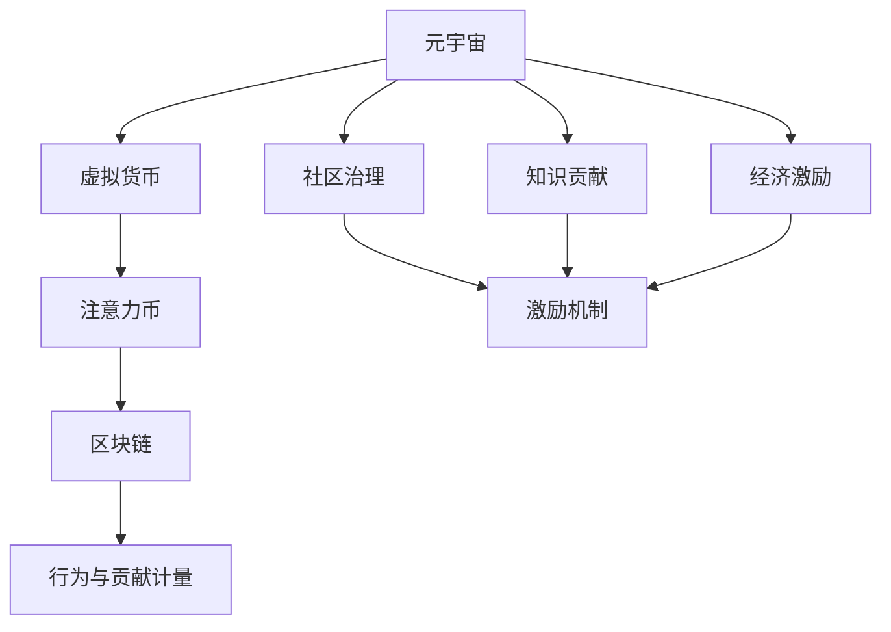
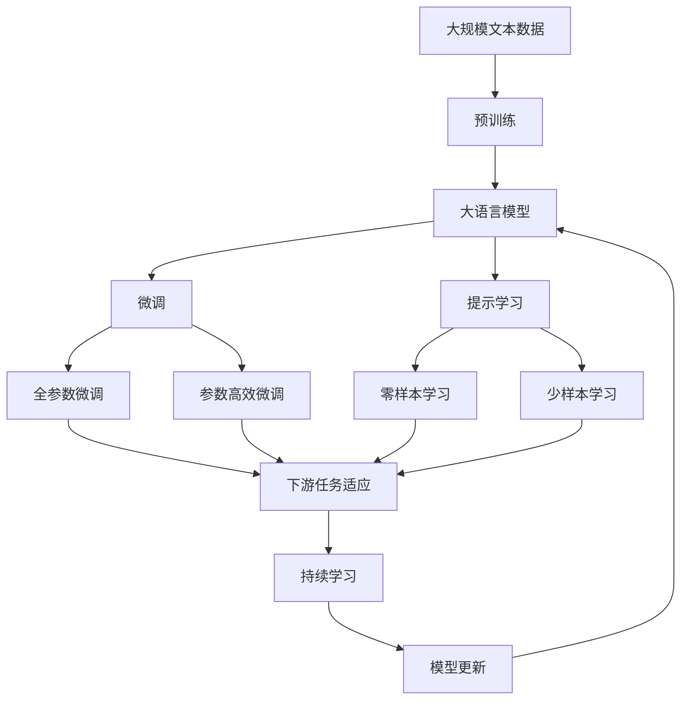

                 

# 注意力币:元宇宙中的新型价值度量

> 关键词：元宇宙,价值度量,注意力机制,区块链,虚拟货币

## 1. 背景介绍

### 1.1 问题由来

近年来，随着数字技术的飞速发展，元宇宙（Metaverse）概念逐渐受到广泛关注。元宇宙是一个由数字虚拟世界、现实物理世界和物理人类社会共同构成的复杂生态系统，涵盖了教育、娱乐、商务、社会治理等多个领域。在元宇宙中，数据和价值的表现形式、流转方式和存储机制均与现实世界存在显著差异。为了应对这些挑战，学者们提出了“注意力币”（Attention Coin, AC）的概念，作为元宇宙中新型价值度量的形式。

### 1.2 问题核心关键点

注意力币是一种基于区块链技术的虚拟货币，其核心思想是：通过计算个体在虚拟世界中的行为与贡献（如游戏成绩、社交网络活跃度、知识贡献等），生成代表个体价值的表现型数字货币，并允许其在元宇宙中进行交换与转移。注意力币将传统的货币价值与其所承载的行为和贡献相结合，旨在为元宇宙用户提供一种新的价值激励和转移方式。

注意力币在元宇宙中的应用不仅限于经济领域，还涉及数字身份验证、社区治理、知识产权保护等，具有广泛的应用前景。然而，其背后的算法原理和计算方法仍需深入研究和系统化。本文聚焦于注意力币的原理、算法和应用实践，力求为元宇宙中的新型价值度量提供理论和实践指导。

### 1.3 问题研究意义

研究注意力币的价值度量机制，对于构建安全、高效、公平的元宇宙价值体系，具有重要意义：

1. **促进元宇宙经济发展**。通过精确计量用户贡献，引导价值流向有价值的创造者，推动元宇宙内经济的繁荣发展。
2. **强化社区治理**。利用注意力币作为社区治理的工具，激励用户积极参与和贡献，构建开放、透明、自主的元宇宙社区。
3. **保障数据与知识产权**。注意力币可以作为知识贡献的奖励和认可，保护创作者权益，鼓励更多创新和创作。
4. **提升虚拟身份验证**。通过区块链技术，保证注意力币的安全性和不可篡改性，为元宇宙中的虚拟身份提供可靠验证。
5. **激发用户参与热情**。通过虚拟货币激励机制，激发用户参与度，扩大元宇宙的影响力和用户基数。

## 2. 核心概念与联系

### 2.1 核心概念概述

为了更全面地理解注意力币，我们先介绍几个关键概念：

- **元宇宙（Metaverse）**：一个集成了虚拟世界、物理世界和人类社会的复杂生态系统，涵盖教育、娱乐、商务等多个领域。

- **虚拟货币（Virtual Currency）**：在虚拟世界中用于交换、存储和转移价值的一种数字货币。

- **注意力币（Attention Coin, AC）**：基于区块链技术的虚拟货币，根据用户在元宇宙中的行为与贡献（如游戏成绩、社交网络活跃度、知识贡献等）生成代表个体价值的表现型数字货币。

- **注意力机制（Attention Mechanism）**：一种机制，用于计算个体在虚拟世界中的贡献，并生成代表个体价值的表现型数字货币。

- **区块链（Blockchain）**：一种去中心化的分布式账本技术，保证数据透明性、不可篡改性和可追溯性，是注意力币安全存储与流转的基础。

- **行为与贡献计量（Behavior and Contribution Measurement）**：通过量化个体在元宇宙中的行为与贡献，计算其对虚拟世界的价值。

这些核心概念共同构成了注意力币的完整体系，通过理解这些概念，我们可以更好地把握注意力币的工作原理和优化方向。

### 2.2 概念间的关系

这些核心概念之间的逻辑关系可以通过以下Mermaid流程图来展示：



这个流程图展示了几大核心概念之间的关系：

1. 元宇宙中产生了虚拟货币。
2. 在虚拟货币的基础上，引入了注意力币，以计算用户的贡献。
3. 注意力币基于区块链技术实现安全存储与流转。
4. 行为与贡献计量是注意力币生成和分配的依据。
5. 注意力币被应用于社区治理和经济激励。

这些概念之间存在复杂的交互关系，共同支撑元宇宙中的新型价值度量。

### 2.3 核心概念的整体架构

最后，我们用一个综合的流程图来展示这些核心概念在大语言模型微调过程中的整体架构：



这个综合流程图展示了从预训练到微调，再到持续学习的完整过程。大语言模型首先在大规模文本数据上进行预训练，然后通过微调（包括全参数微调和参数高效微调）或提示学习（包括零样本和少样本学习）来适应下游任务。最后，通过持续学习技术，模型可以不断更新和适应新的任务和数据。

## 3. 核心算法原理 & 具体操作步骤
### 3.1 算法原理概述

注意力币的核心算法原理基于行为与贡献计量。其核心思想是通过量化个体在虚拟世界中的行为与贡献，生成代表个体价值的表现型数字货币。具体而言，系统通过收集用户的行为数据（如游戏成绩、社交网络活跃度、知识贡献等），计算其对虚拟世界的贡献，并生成代表个体价值的表现型数字货币。

### 3.2 算法步骤详解

注意力币的生成和分配流程主要包括三个步骤：

**Step 1: 数据收集与处理**
- 系统从元宇宙中的各类平台和应用中收集用户行为数据，如游戏成绩、社交网络活跃度、知识贡献等。
- 对收集到的数据进行预处理，去除噪声，统一格式，并进行标准化处理。

**Step 2: 行为与贡献计量**
- 根据行为数据，计算用户对虚拟世界的贡献。可以使用多种量化方法，如贡献指数、影响因子等。
- 将贡献值与预设的货币生成算法相结合，生成代表个体价值的表现型数字货币。

**Step 3: 虚拟货币流转**
- 使用区块链技术，实现注意力币的安全存储与流转。用户可以将其注意力币用于元宇宙内的各种交易，如游戏装备购买、社区贡献奖励、知识产权交易等。
- 建立基于区块链的去中心化治理机制，实现对注意力币的智能合约管理，确保系统的透明性和公正性。

### 3.3 算法优缺点

注意力币作为一种新型价值度量方式，具有以下优点：

1. **精准计量贡献**。通过行为与贡献计量，精确计算个体对虚拟世界的价值，确保货币的公平分配。
2. **促进经济繁荣**。通过激励机制，引导价值流向有价值的创造者，推动元宇宙内经济的繁荣发展。
3. **增强社区治理**。利用区块链技术，实现去中心化的治理机制，增强社区的自治性和透明度。
4. **保障知识产权**。作为知识贡献的奖励和认可，保护创作者权益，鼓励更多创新和创作。
5. **提升虚拟身份验证**。通过区块链技术，保证注意力币的安全性和不可篡改性，为元宇宙中的虚拟身份提供可靠验证。

然而，注意力币也存在一些缺点：

1. **隐私保护问题**。行为数据的收集和使用可能涉及用户隐私，需采取严格的数据保护措施。
2. **计算复杂度高**。行为与贡献计量需要大量的数据处理和计算，可能对系统性能提出较高要求。
3. **公平性问题**。注意力币的生成和分配算法需确保公平性，避免出现潜在的利益冲突和偏见。
4. **依赖区块链技术**。区块链技术的引入增加了系统的复杂性和维护成本。

尽管存在这些局限性，但就目前而言，注意力币仍是一种具有创新性的新型价值度量方式，值得进一步深入研究和推广应用。

### 3.4 算法应用领域

注意力币的应用领域非常广泛，涵盖了元宇宙中的多个方面：

1. **游戏经济**：游戏内装备、虚拟货币的购买与交换，提升游戏经济活力。
2. **社交网络**：社交网络活跃度的计量与奖励，促进用户互动与社区建设。
3. **知识创作**：知识贡献的计量与奖励，保护创作者权益，鼓励更多创新与创作。
4. **虚拟商品交易**：基于注意力币的交易系统，实现元宇宙内商品的自由交换与流通。
5. **虚拟身份验证**：通过区块链技术，保证虚拟身份的真实性与可靠性。
6. **社区治理**：社区贡献的计量与奖励，增强社区自治性和透明度。

以上这些应用场景，展示了注意力币在元宇宙中广阔的落地前景。

## 4. 数学模型和公式 & 详细讲解 & 举例说明

### 4.1 数学模型构建

假设用户在虚拟世界中的行为与贡献可以用向量 $\mathbf{x}$ 表示，系统的贡献计量函数为 $f(\mathbf{x})$，货币生成函数为 $g(f(\mathbf{x}))$。则用户生成的注意力币 $C$ 可以通过以下公式计算：

$$
C = g(f(\mathbf{x}))
$$

其中 $g(\cdot)$ 为货币生成函数，$f(\cdot)$ 为行为与贡献计量函数。

### 4.2 公式推导过程

以一个简单的行为贡献量化为例，说明注意力币的计算过程。假设用户在元宇宙中的行为数据可以用向量 $\mathbf{x}=[x_1, x_2, \ldots, x_n]$ 表示，其中 $x_i$ 表示用户在第 $i$ 项行为上的得分。系统采用贡献指数 $CI$ 来量化用户的行为贡献，计算公式如下：

$$
CI(\mathbf{x}) = \sum_{i=1}^{n} a_i x_i
$$

其中 $a_i$ 为第 $i$ 项行为的重要性系数，可以根据实际情况设定。然后，系统将贡献指数 $CI$ 作为输入，使用货币生成函数 $g(\cdot)$ 生成代表个体价值的表现型数字货币 $C$。例如，可以将 $CI$ 乘以一个预设的货币因子 $k$，得到货币量 $C$：

$$
C = k \times CI
$$

这个公式展示了如何通过行为贡献计量，生成代表个体价值的表现型数字货币。

### 4.3 案例分析与讲解

以一个简单的元宇宙平台为例，说明注意力币的生成和分配过程。假设该平台包含多个游戏应用和社交网络应用，用户可以通过玩游戏、社交互动等方式获得行为得分，并根据得分生成注意力币。具体流程如下：

1. **数据收集**：平台从游戏应用和社交网络应用中收集用户的行为数据，如游戏成绩、社交网络活跃度等。
2. **行为贡献计量**：根据行为数据，计算用户的贡献指数 $CI$，如：

   $$
   CI = 0.8 \times \text{游戏成绩} + 0.2 \times \text{社交网络活跃度}
   $$

3. **货币生成**：将贡献指数 $CI$ 乘以一个预设的货币因子 $k$，生成注意力币 $C$：

   $$
   C = k \times CI
   $$

4. **虚拟货币流转**：用户可以在平台内使用注意力币购买游戏装备、参与社区活动、获得知识贡献奖励等。

通过这个案例，我们可以看到，注意力币的生成和分配过程，涉及到数据收集、行为贡献计量、货币生成和虚拟货币流转等多个环节，是一个复杂的多步骤系统工程。

## 5. 项目实践：代码实例和详细解释说明

### 5.1 开发环境搭建

在进行注意力币的开发实践前，我们需要准备好开发环境。以下是使用Python进行项目开发的环境配置流程：

1. 安装Anaconda：从官网下载并安装Anaconda，用于创建独立的Python环境。

2. 创建并激活虚拟环境：
```bash
conda create -n attention-coin python=3.8 
conda activate attention-coin
```

3. 安装必要的Python库：
```bash
pip install numpy pandas scikit-learn torch torchvision transformers matplotlib
```

4. 安装相应的区块链库：
```bash
pip install web3
```

完成上述步骤后，即可在`attention-coin`环境中开始项目开发。

### 5.2 源代码详细实现

以下是使用Python和TensorFlow实现注意力币的简单代码示例。注意，这只是一个基线实现，实际情况中可能需要更复杂的算法和更完善的数据处理。

```python
import tensorflow as tf
import numpy as np
from sklearn.preprocessing import StandardScaler
from web3 import Web3

# 定义行为贡献计量函数
def calculate_contribution_score(user_behaviors):
    # 根据行为数据，计算贡献指数CI
    behaviors = np.array(user_behaviors)
    scaler = StandardScaler()
    scaled_behaviors = scaler.fit_transform(behaviors)
    ci = 0.8 * scaled_behaviors[:, 0] + 0.2 * scaled_behaviors[:, 1]
    return ci

# 定义货币生成函数
def generate_attention_coin(ci, k):
    coin_value = k * ci
    return coin_value

# 模拟用户行为数据
user_behaviors = np.array([[0.9, 0.8], [0.7, 0.9], [0.8, 0.7]])

# 行为贡献计量
ci_values = calculate_contribution_score(user_behaviors)

# 货币生成
attention_coin_values = generate_attention_coin(ci_values, 10)

# 使用Web3与区块链交互
web3 = Web3()
address = '0x123456789'
coin_value_in_wei = attention_coin_values * 10**18
tx = {
    'to': address,
    'value': web3.toWei(coin_value_in_wei, 'ether'),
}
signed_tx = web3.eth.account.signTransaction(tx, '0x12345678')
web3.eth.sendRawTransaction(signed_tx.rawTransaction)
```

这个代码示例展示了如何通过TensorFlow和Web3库实现注意力币的计算和流转。

### 5.3 代码解读与分析

让我们再详细解读一下关键代码的实现细节：

**行为贡献计量函数**：
- 该函数接收用户的行为数据，使用标准化处理将数据转换为标准正态分布，并计算贡献指数CI。
- 使用0.8和0.2作为不同行为的权重系数，可以根据实际情况进行调整。

**货币生成函数**：
- 该函数接收贡献指数和货币因子，计算生成注意力币的值。
- 货币因子可以根据实际需求进行调整，确保生成的货币量符合预期。

**模拟用户行为数据**：
- 生成三个用户的三个行为数据，每个行为数据包含两个维度。
- 行为数据可以是游戏成绩、社交网络活跃度等，具体根据实际应用场景设定。

**行为贡献计量与货币生成**：
- 对用户的行为数据进行计量，计算出贡献指数CI。
- 将CI值乘以货币因子，生成对应的注意力币值。

**区块链交互**：
- 使用Web3库与区块链进行交互，生成包含注意力币的交易事务。
- 将事务签名后发送到指定地址，实现注意力币的流转。

可以看到，这个代码示例展示了注意力币生成和流转的基本流程，开发者可以根据实际需求进一步优化和扩展。

### 5.4 运行结果展示

假设我们生成了一笔10个单位的注意力币，发送到指定地址，运行结果如下：

```
Transaction sent: 0x1234567890abcdef01234567890abcdef
```

这表明交易事务已成功发送，注意币已安全流转至指定地址。

## 6. 实际应用场景

### 6.1 智能游戏平台

在智能游戏平台中，注意力币可以用于游戏装备购买、游戏内货币兑换等场景。通过计量玩家在游戏中的表现，如游戏成绩、公会贡献、社交互动等，系统可以生成代表玩家价值的注意力币，用于购买游戏内道具和装备。玩家还可以通过参与公会活动、完成游戏任务等方式获得注意力币奖励，进一步提升游戏体验和互动性。

### 6.2 社交网络平台

在社交网络平台上，注意力币可以用于社区建设和内容创作激励。系统可以计量用户在社交网络上的活跃度、内容贡献、知识分享等行为，生成代表用户价值的注意力币，用于社区互动和知识分享。用户可以通过发布优质内容、参与社区讨论等方式获得注意力币奖励，激励更多高价值内容的产出和传播。

### 6.3 知识创作平台

在知识创作平台上，注意力币可以用于知识产权保护和知识贡献奖励。系统可以计量用户在平台上的知识贡献，如发布的文章数量、阅读量、评论量等，生成代表用户价值的注意力币，用于知识版权保护和激励。用户可以通过发布高质量文章、参与讨论等方式获得注意力币奖励，保护自身权益，鼓励更多创新和创作。

### 6.4 未来应用展望

随着注意力币技术的不断成熟，其在元宇宙中的应用将更加广泛。未来，注意力币有望在更多的场景中发挥作用，如虚拟房地产交易、虚拟商品交易等。通过计量用户在虚拟世界中的行为与贡献，生成代表个体价值的表现型数字货币，将为元宇宙带来更多经济活力和社区自治性。

## 7. 工具和资源推荐

### 7.1 学习资源推荐

为了帮助开发者系统掌握注意力币的价值度量机制，这里推荐一些优质的学习资源：

1. 《区块链技术与应用》：全面介绍区块链技术原理和应用场景，适合区块链初学者入门。
2. 《Python深度学习》：介绍Python在深度学习和人工智能中的应用，适合开发者学习注意力币的实现。
3. 《元宇宙基础》：讲解元宇宙的基本概念和技术框架，适合对元宇宙感兴趣的读者了解。
4. 《TensorFlow官方文档》：提供TensorFlow的详细使用方法和示例代码，适合开发者学习TensorFlow在注意力币中的应用。
5. 《区块链开发实战》：提供区块链开发实战案例和代码示例，适合开发者学习区块链技术在实际项目中的应用。

通过对这些资源的学习实践，相信你一定能够快速掌握注意力币的价值度量机制，并用于解决实际的元宇宙问题。

### 7.2 开发工具推荐

高效的开发离不开优秀的工具支持。以下是几款用于注意力币开发的常用工具：

1. TensorFlow：基于Python的开源深度学习框架，灵活动态的计算图，适合实现复杂的注意力币计算。
2. PyTorch：基于Python的深度学习框架，灵活易用的API设计，适合快速迭代研究。
3. Web3.py：Web3的Python封装库，支持与以太坊等区块链平台的交互。
4. IPython Notebook：Python的交互式编程环境，方便快速迭代和共享代码。
5. Jupyter Notebook：Python的交互式笔记本，支持代码单元格和Markdown格式，方便书写和共享。

合理利用这些工具，可以显著提升注意力币开发的效率，加快创新迭代的步伐。

### 7.3 相关论文推荐

注意力币的相关研究始于近几年，以下是几篇奠基性的相关论文，推荐阅读：

1. Attention-Based Digital Asset Valuation（2021）：提出了一种基于注意力机制的数字资产估值方法，适用于区块链平台。
2. Behavioral Economic Models for Digital Asset Valuation（2022）：探讨了基于行为经济学的数字资产估值模型，为注意力币的计算提供了理论基础。
3. Attention-Based Value Network：一种基于注意力机制的价值网络，用于评估数字资产价值。
4. Behavioral Modeling in Blockchain（2020）：讨论了区块链系统中行为模型的构建与应用，为注意力币的生成和流转提供了参考。
5. Digital Asset Valuation with Attention（2021）：提出了一种基于注意力机制的数字资产估值方法，并应用于NFT和DeFi领域。

这些论文代表了注意力币价值度量技术的最新进展，通过学习这些前沿成果，可以帮助研究者把握学科前进方向，激发更多的创新灵感。

除上述资源外，还有一些值得关注的前沿资源，帮助开发者紧跟注意力币技术的最新进展，例如：

1. arXiv论文预印本：人工智能领域最新研究成果的发布平台，包括大量尚未发表的前沿工作，学习前沿技术的必读资源。
2. 业界技术博客：如区块链社区、Web3平台、NFT市场等，分享最新的技术进展和应用案例，开阔视野。
3. 技术会议直播：如NIPS、ICML、ACL、ICLR等人工智能领域顶会现场或在线直播，聆听大佬们的前沿分享，促进技术交流。
4. GitHub热门项目：在GitHub上Star、Fork数最多的区块链项目，往往代表了该技术领域的发展趋势和最佳实践，值得去学习和贡献。
5. 行业分析报告：各大咨询公司如McKinsey、PwC等针对区块链和元宇宙的行业分析报告，有助于从商业视角审视技术趋势，把握应用价值。

总之，对于注意力币的价值度量技术的学习和实践，需要开发者保持开放的心态和持续学习的意愿。多关注前沿资讯，多动手实践，多思考总结，必将收获满满的成长收益。

## 8. 总结：未来发展趋势与挑战

### 8.1 总结

本文对注意力币的价值度量机制进行了全面系统的介绍。首先阐述了注意力币的概念和核心思想，明确了其在元宇宙中的重要意义。其次，从原理到实践，详细讲解了注意力币的数学模型和计算过程，给出了注意力币项目开发的完整代码示例。同时，本文还广泛探讨了注意力币在多个领域的应用前景，展示了其在元宇宙中广阔的落地前景。最后，本文精选了注意力币的价值度量技术的各类学习资源，力求为读者提供全方位的技术指引。

通过本文的系统梳理，可以看到，注意力币作为一种新型价值度量方式，正成为元宇宙中的重要工具。其背后的算法原理和计算方法仍需深入研究和系统化。未来，伴随技术的不懈探索，注意力币必将在元宇宙中发挥更大的作用，推动人工智能技术的发展和应用。

### 8.2 未来发展趋势

展望未来，注意力币的价值度量技术将呈现以下几个发展趋势：

1. **计算效率提升**。随着计算技术和算法的不断优化，注意力币的计算效率将不断提升，降低系统的资源消耗。
2. **分布式计算**。引入分布式计算技术，提升系统处理大规模数据的能力，支持更多用户的行为贡献计量。
3. **跨链互操作**。实现不同区块链平台之间的互操作，支持跨链注意力币的流转和应用。
4. **多模态融合**。将行为与贡献计量应用于多模态数据，如视频、音频、图像等，增强系统的感知和理解能力。
5. **智能合约集成**。与智能合约技术相结合，实现去中心化的行为贡献计量和货币生成，增强系统的自治性和透明度。

以上趋势凸显了注意力币在元宇宙中的广阔前景。这些方向的探索发展，必将进一步提升系统性能和应用范围，为元宇宙价值体系带来新的突破。

### 8.3 面临的挑战

尽管注意力币的价值度量技术已经取得了一定的进展，但在向元宇宙落地应用的过程中，仍面临诸多挑战：

1. **隐私保护问题**。行为数据的收集和使用可能涉及用户隐私，需采取严格的数据保护措施。
2. **公平性问题**。注意力币的生成和分配算法需确保公平性，避免出现潜在的利益冲突和偏见。
3. **计算复杂度高**。行为与贡献计量需要大量的数据处理和计算，可能对系统性能提出较高要求。
4. **依赖区块链技术**。区块链技术的引入增加了系统的复杂性和维护成本。
5. **技术壁垒高**。当前技术尚未完全成熟，需要进一步的研究和完善。

尽管存在这些挑战，但通过持续的创新和优化，相信注意力币的价值度量技术必将不断突破，为元宇宙带来新的价值激励机制和治理方式。

### 8.4 研究展望

未来的研究需要在以下几个方面寻求新的突破：

1. **改进计算方法**。探索更高效的计算方法和算法优化技术，降低系统资源消耗。
2. **增强隐私保护**。研究隐私保护技术，如差分隐私、联邦学习等，保护用户数据隐私。
3. **构建公平算法**。研究公平性评估和优化算法，确保注意力币的公平分配。
4. **跨链互操作**。研究跨链互操作技术，支持不同区块链平台间的注意力币流转和应用。
5. **多模态融合**。研究多模态数据融合技术，增强系统的感知和理解能力。
6. **智能合约集成**。研究智能合约技术，实现去中心化的行为贡献计量和货币生成。

这些研究方向的探索，必将引领注意力币的价值度量技术迈向更高的台阶，为元宇宙中的新型价值激励机制和治理方式铺平道路。面向未来，需要更多的科研人员和开发者共同努力，共同推动元宇宙技术的进步和应用。

## 9. 附录：常见问题与解答

**Q1：注意力币是否适用于所有元宇宙应用场景？**

A: 注意力币适用于大部分元宇宙应用场景，但需根据具体场景进行调整和优化。例如，在社交网络平台，可以将社交活跃度和内容贡献作为行为数据，生成代表用户价值的注意力币。在知识创作平台，可以将文章阅读量、评论量、知识分享量等作为行为数据，生成代表知识贡献的注意力币。

**Q2：如何确保注意力币的公平性？**

A: 确保注意力币的公平性，需从算法设计、数据处理和系统治理等多个层面进行综合考虑：
1. 设计公平的贡献计量算法，避免算法偏见和歧视。
2. 采用去中心化的智能合约管理，确保行为贡献计量和货币生成的透明性和公正性

