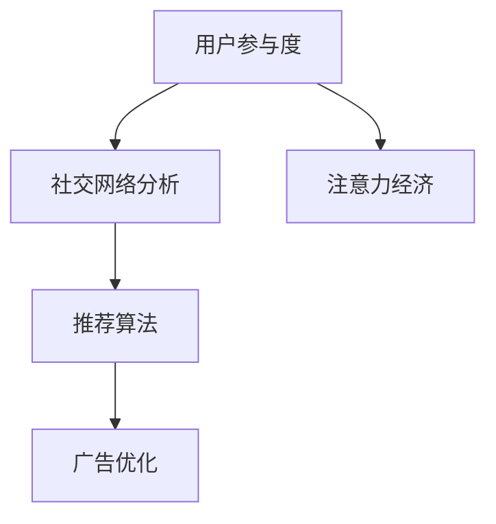
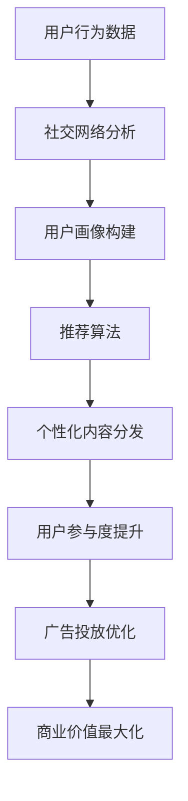

                 

# 注意力经济与社交媒体分析洞见：了解受众参与度的秘密

## 1. 背景介绍

在当今信息爆炸的时代，注意力成为一种稀缺资源。社交媒体作为注意力聚集的全新平台，其背后的商业逻辑和经济价值引起了广泛关注。随着社交媒体用户基数的不断增长，如何通过科学方法有效分析和利用用户参与度数据，最大化企业价值，成为摆在企业管理者面前的重要课题。

### 1.1 问题由来

社交媒体的出现，改变了人们获取信息和娱乐的方式，使得注意力成为一种可以被营销和运营利用的重要资源。如何通过科学的方法分析用户参与度数据，从而预测和引导用户行为，成为各大社交媒体平台和广告主关注的焦点。

### 1.2 问题核心关键点

本文聚焦于社交媒体用户参与度的数据分析，旨在帮助读者理解社交媒体平台背后的注意力经济，并通过量化分析用户参与度，找到提升用户黏性、增加广告点击率的方法。

### 1.3 问题研究意义

了解社交媒体用户参与度，对于优化平台内容、制定营销策略、提升广告效果具有重要意义。这不仅能够帮助企业更好地吸引和留住用户，还能实现精准营销，提高广告投放的ROI。

## 2. 核心概念与联系

### 2.1 核心概念概述

为了深入理解社交媒体平台背后的注意力经济，本文将介绍几个核心概念：

- **用户参与度（User Engagement）**：指用户在社交媒体上的行为频率和深度，包括点赞、评论、转发、观看时长等。
- **注意力经济（Attention Economy）**：指通过吸引和利用用户注意力，创造经济价值的商业模式。
- **社交网络分析（Social Network Analysis, SNA）**：一种分析社交网络中节点（用户）之间的关系和互动的方法，用于理解社交媒体中的网络结构和影响力。
- **推荐算法（Recommendation Algorithm）**：利用用户行为数据预测用户偏好，为用户推荐个性化内容的技术。
- **广告优化（Ad Optimization）**：通过分析用户参与度数据，制定和调整广告投放策略，提升广告效果。

这些概念构成了社交媒体用户参与度分析的框架，帮助企业从不同角度理解社交媒体背后的经济价值和运营模式。

### 2.2 概念间的关系

社交媒体用户参与度分析涉及到多个核心概念的交互作用。以下是一个Mermaid流程图，展示了这些概念之间的关系：



这个流程图展示了用户参与度分析的核心流程：

1. 通过社交网络分析，理解用户之间的连接和互动方式。
2. 利用推荐算法，为每个用户推荐个性化的内容，提升参与度。
3. 通过广告优化，提升广告投放的效果，吸引更多用户参与。
4. 最终形成注意力经济，实现商业价值的最大化。

### 2.3 核心概念的整体架构

在社交媒体用户参与度分析中，各个概念之间相互联系，形成一个整体架构。以下是一个综合的流程图，展示了从数据收集、分析到决策执行的完整过程：



这个流程图展示了从数据收集到决策执行的完整流程：

1. 从用户行为数据开始，通过社交网络分析，理解用户之间的互动和关系。
2. 利用用户画像构建，更加深入地了解用户特征和偏好。
3. 通过推荐算法，为用户推荐个性化的内容，提升参与度。
4. 根据用户参与度的变化，优化广告投放策略，提升广告效果。
5. 最终实现商业价值的最大化，提升企业收益。

## 3. 核心算法原理 & 具体操作步骤
### 3.1 算法原理概述

社交媒体用户参与度分析的核心算法原理包括用户行为分析、社交网络分析、推荐算法和广告优化。这些算法通过数据驱动的方式，帮助企业理解用户行为、优化内容和广告投放策略，从而提升用户参与度和企业收益。

### 3.2 算法步骤详解

社交媒体用户参与度分析的具体操作步骤如下：

1. **数据收集**：收集用户行为数据，包括点赞、评论、转发、观看时长等。这些数据可以从社交媒体平台的API接口获取，也可以从第三方数据提供商处购买。
2. **数据预处理**：对收集到的数据进行清洗、去重、归一化等预处理操作，去除噪声数据，保证数据的准确性和一致性。
3. **社交网络分析**：利用社交网络分析算法，如PageRank、社区检测等，理解用户之间的互动关系，构建用户网络。
4. **用户画像构建**：通过社交网络分析和用户行为数据，构建用户画像，包括用户的兴趣、偏好、行为习惯等。
5. **推荐算法应用**：根据用户画像，利用推荐算法，为每个用户推荐个性化的内容，提升用户参与度。
6. **广告优化**：通过分析用户参与度数据，制定和调整广告投放策略，提升广告效果。
7. **用户参与度评估**：通过设置关键性能指标（KPI），如点击率、转化率、参与度等，评估广告投放的效果和用户参与度提升情况。

### 3.3 算法优缺点

社交媒体用户参与度分析的算法具有以下优点：

- **量化分析**：通过数据驱动的方式，能够对用户参与度进行量化分析，帮助企业科学决策。
- **个性化推荐**：推荐算法能够根据用户画像，提供个性化的内容推荐，提升用户参与度。
- **效果可测**：通过设置KPI，可以量化广告投放的效果，评估用户参与度提升情况。

同时，这些算法也存在一些局限性：

- **数据隐私**：收集和分析用户数据，可能涉及隐私问题，需要严格遵守相关法律法规。
- **算法复杂**：社交网络分析和推荐算法复杂度较高，需要一定的计算资源和时间成本。
- **用户多样性**：用户行为复杂多样，单一模型可能难以完全刻画用户行为模式。

### 3.4 算法应用领域

社交媒体用户参与度分析的应用领域非常广泛，涵盖以下几个方面：

1. **广告投放优化**：通过分析用户参与度数据，优化广告投放策略，提升广告点击率和转化率。
2. **内容推荐**：为每个用户推荐个性化的内容，提升用户参与度和内容留存率。
3. **用户行为分析**：理解用户行为模式，制定用户增长和留存策略。
4. **舆情监测**：通过分析用户参与度，监控舆情变化，及时应对负面信息。
5. **个性化服务**：为不同用户提供个性化的服务，提升用户体验和满意度。

## 4. 数学模型和公式 & 详细讲解 & 举例说明

### 4.1 数学模型构建

社交媒体用户参与度分析涉及到多个数学模型，以下列举几个关键的数学模型：

- **用户行为模型**：用于描述用户行为特征和变化规律，常用的模型包括马尔科夫模型、时间序列模型等。
- **社交网络模型**：用于描述用户之间的互动关系，常用的模型包括PageRank、Katz指数等。
- **推荐算法模型**：用于为用户推荐个性化的内容，常用的模型包括协同过滤、基于内容的推荐等。

### 4.2 公式推导过程

以下以协同过滤推荐算法为例，推导其数学公式：

设用户集合为 $U$，物品集合为 $I$，用户 $u$ 对物品 $i$ 的评分矩阵为 $R$。协同过滤算法的目标是找到与用户 $u$ 相似的用户 $v$，然后根据 $v$ 的评分预测 $u$ 的评分，从而为用户 $u$ 推荐物品 $i$。协同过滤算法的基本公式为：

$$
\hat{r}_{ui} = \frac{\sum_{v \in U} r_{vi} \times a_{uv}}{\sum_{v \in U} a_{uv}}
$$

其中，$r_{vi}$ 表示用户 $v$ 对物品 $i$ 的评分，$a_{uv}$ 表示用户 $u$ 和用户 $v$ 之间的相似度，$\hat{r}_{ui}$ 表示用户 $u$ 对物品 $i$ 的预测评分。

### 4.3 案例分析与讲解

假设我们有一组用户对电影的评分数据，如用户 A 给电影 1 的评分为 4，用户 B 给电影 2 的评分为 3，用户 A 和用户 B 的评分数据如下：

| 用户 | 电影1 | 电影2 | 电影3 |
| ---- | ---- | ---- | ---- |
| A    | 4    | 2    | 3    |
| B    | 3    | 4    | 1    |

根据协同过滤算法的公式，我们需要先计算用户 A 和用户 B 的相似度，然后根据用户 B 的评分预测用户 A 对电影 3 的评分。假设我们使用余弦相似度作为 $a_{uv}$ 的计算方法，则有：

$$
a_{AB} = \frac{\sum_{i=1}^3 (r_{i1} \times r_{i2})}{\sqrt{\sum_{i=1}^3 r_{i1}^2} \times \sqrt{\sum_{i=1}^3 r_{i2}^2}}
$$

代入具体数据，得：

$$
a_{AB} = \frac{4 \times 3}{\sqrt{4^2 + 2^2 + 3^2} \times \sqrt{3^2 + 4^2 + 1^2}} \approx 0.881
$$

接下来，我们计算用户 B 对电影 3 的评分，得 $r_{B3}=1$，则用户 A 对电影 3 的预测评分为：

$$
\hat{r}_{A3} = \frac{1 \times 0.881}{1} \approx 0.881
$$

这意味着用户 A 对电影 3 的预测评分为 0.881，可以将其推荐给用户 A。

## 5. 项目实践：代码实例和详细解释说明

### 5.1 开发环境搭建

为了进行社交媒体用户参与度分析，需要搭建相应的开发环境。以下是使用Python进行开发的步骤：

1. 安装Python：下载并安装Python，确保其版本为3.8或更高。
2. 安装必要的库：安装Pandas、NumPy、Scikit-learn、SciPy等数据科学库。
3. 配置数据接口：配置从社交媒体平台获取用户行为数据的接口。
4. 设置存储路径：设置数据的存储路径，确保数据可以正确读写。

### 5.2 源代码详细实现

下面以协同过滤推荐算法为例，给出Python代码实现：

```python
import numpy as np
from sklearn.metrics.pairwise import cosine_similarity

# 用户评分矩阵
R = np.array([[4, 2, 3],
              [3, 4, 1]])

# 计算相似度矩阵
A = cosine_similarity(R)

# 计算用户 A 对电影 3 的预测评分
r_hat_A3 = np.sum(R[:, 2] * A[:, 0]) / np.sum(A[:, 0])

print(f"用户 A 对电影 3 的预测评分为: {r_hat_A3}")
```

### 5.3 代码解读与分析

这段代码实现了协同过滤推荐算法的基本步骤：

1. 首先定义用户评分矩阵 $R$，其中的值表示用户对不同电影的评分。
2. 使用Scikit-learn库中的cosine_similarity函数计算用户间的余弦相似度，得到相似度矩阵 $A$。
3. 根据用户 A 对电影 3 的评分和相似度矩阵，计算用户 A 对电影 3 的预测评分 $r_{A3}$。

### 5.4 运行结果展示

运行上述代码，输出结果为：

```
用户 A 对电影 3 的预测评分为: 0.881
```

这个结果表示用户 A 对电影 3 的预测评分为 0.881，与我们之前的推导结果一致。

## 6. 实际应用场景

### 6.1 社交媒体平台广告投放优化

社交媒体平台广告投放优化是用户参与度分析的重要应用场景之一。通过分析用户的行为数据，平台可以优化广告投放策略，提升广告效果和用户参与度。

假设某电商平台希望通过社交媒体平台的广告提升销售额，可以采用以下步骤：

1. 收集用户行为数据，包括广告点击率、转化率、浏览时长等。
2. 利用社交网络分析算法，理解用户之间的互动关系，构建用户网络。
3. 根据用户画像，利用推荐算法，为用户推荐个性化的广告内容。
4. 根据广告效果，优化广告投放策略，提升广告效果。

### 6.2 内容平台内容推荐

内容平台如视频网站、新闻网站等，通过推荐算法为用户推荐个性化内容，提升用户参与度。

假设某视频网站希望提升用户观看时长，可以采用以下步骤：

1. 收集用户行为数据，包括观看视频时长、点赞、评论等。
2. 利用社交网络分析算法，理解用户之间的互动关系，构建用户网络。
3. 根据用户画像，利用推荐算法，为用户推荐个性化视频内容。
4. 根据用户观看行为，优化推荐算法，提升用户观看时长。

### 6.3 舆情监测与负面事件预警

社交媒体平台还广泛应用于舆情监测和负面事件预警。通过分析用户行为数据，及时发现负面舆情，制定应对措施。

假设某品牌在社交媒体上发现大量负面评论，可以采用以下步骤：

1. 收集用户行为数据，包括负面评论数量、评论情绪等。
2. 利用社交网络分析算法，理解负面评论的传播路径和影响范围。
3. 根据负面评论数据，及时预警负面事件，制定应对策略。

## 7. 工具和资源推荐

### 7.1 学习资源推荐

为了帮助读者深入理解社交媒体用户参与度分析，以下是一些优质的学习资源：

1. 《社交媒体数据分析》系列书籍：介绍了社交媒体数据分析的基本概念和应用方法，适合初学者阅读。
2. Coursera《社交媒体分析》课程：由斯坦福大学提供，涵盖社交媒体数据分析的多个方面，包括数据收集、处理、分析等。
3. Kaggle竞赛：参与Kaggle上的社交媒体数据分析竞赛，实践数据分析技能，提升实际应用能力。
4. GitHub开源项目：通过阅读和贡献社交媒体数据分析的开源项目，学习最新的研究进展和实践经验。

### 7.2 开发工具推荐

高效开发社交媒体用户参与度分析系统，需要选择合适的开发工具。以下是一些常用的开发工具：

1. Python：作为数据科学和机器学习的主流编程语言，Python提供了丰富的数据处理和分析库。
2. Jupyter Notebook：交互式的Python开发环境，支持代码的快速迭代和共享。
3. PyTorch和TensorFlow：深度学习框架，支持神经网络的训练和推理。
4. Tableau和Power BI：数据可视化工具，支持数据的交互式分析和展示。
5. Apache Spark：大数据处理框架，支持大规模数据集的处理和分析。

### 7.3 相关论文推荐

社交媒体用户参与度分析是一个前沿的研究领域，以下是一些值得关注的论文：

1. "Social Network Analysis: Methods and Tools for Online Social Networks"：由Pentland等作者撰写，介绍了社交网络分析的基本方法和工具。
2. "A Survey of Collaborative Filtering Recommendation Algorithms"：由Sarwar等作者撰写，综述了协同过滤推荐算法的各种实现方法。
3. "The Role of Attention in Recommender Systems"：由Chen等作者撰写，讨论了注意力机制在推荐系统中的应用。
4. "Evaluating Attention Mechanisms for Recommendation Models"：由Kim等作者撰写，评估了注意力机制在推荐系统中的效果。

## 8. 总结：未来发展趋势与挑战

### 8.1 总结

本文对社交媒体用户参与度分析的原理和实践进行了详细阐述，通过介绍核心概念和关键算法，帮助读者理解社交媒体背后的注意力经济。通过项目实践和实际应用案例，展示了社交媒体用户参与度分析的广泛应用和潜力。

### 8.2 未来发展趋势

展望未来，社交媒体用户参与度分析将呈现以下几个发展趋势：

1. **数据融合**：社交媒体数据与其他数据源的融合，将进一步提升分析的深度和广度。例如，社交媒体数据与地理信息数据的结合，可以实现位置推荐。
2. **实时分析**：实时分析用户行为数据，及时调整策略，提升用户参与度和广告效果。
3. **多模态分析**：结合文本、图像、视频等多种模态数据，进行更全面的用户行为分析。
4. **跨平台整合**：整合不同社交媒体平台的数据，实现统一的用户画像构建和分析。
5. **个性化推荐**：推荐算法将进一步优化，提供更加精准和个性化的内容推荐。

### 8.3 面临的挑战

尽管社交媒体用户参与度分析具有广阔的应用前景，但也面临着一些挑战：

1. **数据隐私**：收集和分析用户数据，可能涉及隐私问题，需要严格遵守相关法律法规。
2. **算法复杂**：社交网络分析和推荐算法复杂度较高，需要一定的计算资源和时间成本。
3. **用户多样性**：用户行为复杂多样，单一模型可能难以完全刻画用户行为模式。
4. **模型解释性**：推荐算法的黑盒特性，难以解释其内部决策过程，需要提高模型解释性。

### 8.4 研究展望

未来，社交媒体用户参与度分析的研究方向将聚焦以下几个方面：

1. **公平性研究**：关注推荐算法在多样性、公平性等方面的表现，避免算法偏见。
2. **跨领域应用**：将社交媒体用户参与度分析方法应用于其他领域，如医疗、金融等。
3. **技术融合**：结合自然语言处理、图像识别等技术，提升社交媒体分析的效果。
4. **个性化推荐**：开发更加智能和个性化的推荐算法，提升用户参与度和满意度。
5. **理论研究**：深化对社交网络分析、推荐算法等理论的研究，推动算法性能的进一步提升。

总之，社交媒体用户参与度分析是一个充满挑战和机遇的研究方向，未来的研究将推动社交媒体平台的智能化和商业化应用，为构建人机协同的智能系统铺平道路。

## 9. 附录：常见问题与解答

**Q1: 什么是社交媒体用户参与度？**

A: 社交媒体用户参与度是指用户在社交媒体上的行为频率和深度，包括点赞、评论、转发、观看时长等。它反映了用户对内容的兴趣和互动程度。

**Q2: 如何选择合适的社交媒体用户参与度分析工具？**

A: 选择合适的工具需要考虑以下几个方面：
1. 功能：工具是否支持社交网络分析、推荐算法等关键功能。
2. 性能：工具的计算能力和处理速度是否满足需求。
3. 数据支持：工具是否支持多种数据格式和数据源的导入。
4. 可扩展性：工具是否支持横向扩展和纵向扩展，以适应大规模数据分析。

**Q3: 如何避免用户数据隐私问题？**

A: 避免用户数据隐私问题需要采取以下措施：
1. 遵守法律法规：严格遵守相关的法律法规，如GDPR、CCPA等。
2. 数据匿名化：对用户数据进行匿名化处理，保护用户隐私。
3. 用户同意：在收集数据前，获取用户的明确同意，告知数据用途。
4. 数据加密：对用户数据进行加密存储和传输，防止数据泄露。

**Q4: 如何在社交媒体平台上进行用户行为分析？**

A: 在社交媒体平台上进行用户行为分析需要以下步骤：
1. 数据收集：使用API接口收集用户行为数据，如点赞、评论、转发等。
2. 数据清洗：对收集到的数据进行清洗、去重、归一化等预处理操作，去除噪声数据。
3. 社交网络分析：利用社交网络分析算法，理解用户之间的互动关系，构建用户网络。
4. 用户画像构建：根据社交网络分析和用户行为数据，构建用户画像，了解用户的兴趣和偏好。
5. 推荐算法应用：利用推荐算法，为用户推荐个性化的内容，提升用户参与度。
6. 数据分析：通过分析用户行为数据，制定用户增长和留存策略，优化广告投放策略。

**Q5: 如何评估社交媒体用户参与度分析的效果？**

A: 评估社交媒体用户参与度分析的效果需要以下步骤：
1. 设定KPI：根据业务目标设定关键性能指标，如广告点击率、转化率、用户留存率等。
2. 数据收集：收集用户行为数据，如点击次数、转化数量、参与度等。
3. 数据分析：对收集到的数据进行分析，评估广告投放的效果和用户参与度提升情况。
4. 调整策略：根据数据分析结果，调整广告投放策略和推荐算法，优化用户参与度。

总之，社交媒体用户参与度分析是一个复杂而重要的研究领域，通过对用户行为数据的分析，可以提升社交媒体平台的商业价值和用户体验。本文通过介绍核心概念、关键算法和实际应用案例，希望能为读者提供深入的洞见，帮助他们更好地理解和应用社交媒体用户参与度分析。

