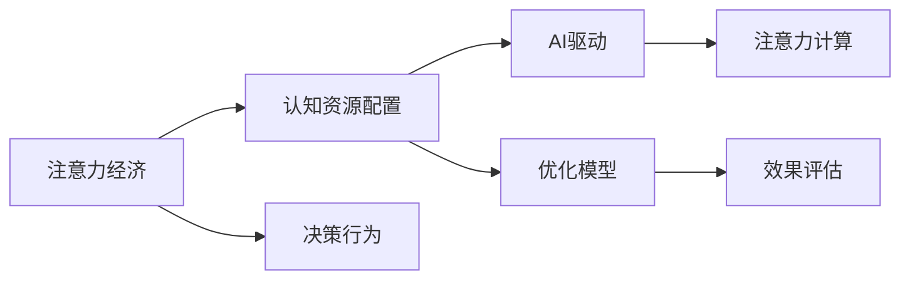

                 

# 注意力经济学家：AI驱动的认知资源配置

## 1. 背景介绍

在信息爆炸的时代，注意力成为一种稀缺资源，而如何高效配置注意力，是各个领域都面临的重大挑战。随着人工智能技术的发展，AI成为一种强大的工具，助力我们管理和分配认知资源，以应对复杂的现代生活。本文将探讨AI如何帮助经济学家在研究和管理注意力时发挥作用，并讨论相关的算法原理、操作步骤，及其在实际应用中的具体实践。

## 2. 核心概念与联系

### 2.1 核心概念概述

在经济学中，注意力（Attention）是研究决策行为的关键元素之一。而AI驱动的认知资源配置，则是指利用人工智能技术，对决策者的注意力进行量化和优化，从而提高决策效率和质量。

- **注意力经济**：注意力是指决策者在处理信息时对不同信息的关注程度。经济学家使用注意力来描述消费者如何分配他们的时间和资源。
- **AI驱动的认知资源配置**：借助人工智能技术，如机器学习和深度学习，对决策者的注意力进行量化、预测和优化，从而提升决策效果。
- **算法与模型**：常用的注意力计算模型有softmax和注意力机制等，用于对不同信息的关注度进行计算和排序。
- **数据与标签**：有效决策需要大量的数据和准确的标签，以便AI模型进行训练和预测。
- **效果评估**：通过对比模型预测与实际决策结果，评估模型的效果和准确性。

### 2.2 核心概念的关系

注意力经济与AI驱动的认知资源配置之间有着密切的联系。通过AI，我们可以更精确地量化和预测个体的注意力分配行为，进而优化资源配置，提升整体决策效率。以下Mermaid流程图展示了两者之间的联系：



在这个流程图中，注意力经济通过AI驱动的认知资源配置，对决策行为进行优化，从而提升整体效果。注意力计算和优化模型是AI驱动资源配置的核心，效果评估则是衡量其有效性的关键指标。

## 3. 核心算法原理 & 具体操作步骤

### 3.1 算法原理概述

AI驱动的认知资源配置主要是通过注意力机制（Attention Mechanism）来实现的。注意力机制允许模型在处理序列数据时，将重点放在最重要的信息上，从而提高模型的准确性和效率。在经济学中，注意力计算通常用于评估消费者对不同产品或服务的关注度，进而优化资源配置。

注意力计算的基本原理可以概括为以下三个步骤：
1. **计算注意力权重**：通过一定的算法，计算每个样本与当前决策的注意力权重，确定哪些样本应该给予更多关注。
2. **计算加权求和**：对样本进行加权求和，得到当前决策的总体信息。
3. **动态调整权重**：根据决策结果和反馈信息，动态调整注意力权重，提高模型对重要信息的敏感度。

### 3.2 算法步骤详解

基于注意力机制的经济决策过程可以分为以下几个步骤：

**Step 1: 数据准备**

- 收集决策所需的各类数据，包括消费者行为数据、产品特征数据等。
- 数据清洗和预处理，包括缺失值处理、异常值检测等。
- 数据标签化，如消费者是否购买了某产品、是否对某服务感兴趣等。

**Step 2: 特征工程**

- 选择合适的特征进行提取，如消费者性别、年龄、购买频率等。
- 特征标准化和归一化处理，保证特征的一致性和可比性。
- 特征选择和降维，减少模型的复杂度。

**Step 3: 模型训练**

- 选择合适的模型架构，如RNN、CNN、Transformer等。
- 将数据集分为训练集、验证集和测试集，进行交叉验证。
- 使用注意力机制进行模型训练，优化权重计算方法。

**Step 4: 模型评估**

- 在测试集上评估模型性能，如准确率、召回率、F1分数等。
- 进行模型调参和优化，如调整学习率、优化器等。
- 对比不同模型和不同优化方法的效果，选择最优方案。

**Step 5: 部署和应用**

- 将训练好的模型部署到生产环境，如云计算平台。
- 通过API接口，将模型集成到实际的决策系统中。
- 持续监控和维护模型，根据新的数据和反馈进行迭代优化。

### 3.3 算法优缺点

基于注意力机制的AI驱动认知资源配置有以下优点：

- **高效性**：通过注意力机制，模型可以自动将重点放在重要信息上，减少数据处理的复杂度。
- **准确性**：注意力机制通过权重计算，提高了对重要信息的敏感度，提升了决策的准确性。
- **可解释性**：通过可视化注意力权重，可以清晰了解模型对不同信息的关注度，便于理解模型决策过程。

同时，该算法也存在一些缺点：

- **模型复杂度**：注意力机制的计算复杂度较高，对计算资源要求较高。
- **数据依赖性**：模型的训练和预测效果依赖于数据的质量和数量，数据不充分时可能影响效果。
- **优化难度**：注意力权重调整需要不断的迭代优化，过程可能较为复杂。

### 3.4 算法应用领域

基于注意力机制的AI驱动认知资源配置，已在多个领域得到了应用，具体包括：

- **消费行为分析**：通过分析消费者的购买历史和行为数据，预测其购买意愿，优化广告投放策略。
- **供应链管理**：通过监控供应链中的各个环节，预测需求变化，优化库存管理和物流分配。
- **金融风险管理**：通过分析历史交易数据，预测金融市场的风险，优化投资组合。
- **医疗诊断**：通过分析病人的历史数据，预测疾病发展趋势，优化治疗方案。
- **自然灾害预警**：通过分析气象数据，预测自然灾害的发生，优化预警和救援方案。

## 4. 数学模型和公式 & 详细讲解

### 4.1 数学模型构建

在经济学中，注意力计算通常表示为如下数学模型：

设决策者面对的输入序列为 $X=\{x_1, x_2, ..., x_n\}$，每个样本 $x_i$ 对应一个注意力权重 $a_i$，则决策向量 $Y$ 可以表示为：

$$ Y = \sum_{i=1}^{n} a_i x_i $$

其中，$a_i$ 为注意力权重，可以通过以下公式计算：

$$ a_i = \frac{\exp(e_{i,1}^{T}w)}{\sum_{j=1}^{n} \exp(e_{j,1}^{T}w)} $$

其中，$e_{i,1}$ 为样本 $x_i$ 的嵌入向量，$w$ 为注意力权重向量。

### 4.2 公式推导过程

注意力权重的计算过程可以分为两个步骤：

1. **注意力权重计算**：对每个样本 $x_i$ 进行嵌入处理，得到一个向量 $e_{i,1}$，然后通过一个线性映射 $e_{i,1}^{T}w$ 计算注意力权重 $a_i$。
2. **加权求和**：将每个样本的注意力权重 $a_i$ 与样本向量 $x_i$ 进行加权求和，得到决策向量 $Y$。

这个公式在经济学中通常用于描述消费者在决策时对不同产品的关注度。例如，在消费者购买决策中，可以通过计算产品广告的点击率、曝光量等特征，来确定消费者对不同产品的注意力权重，从而优化广告投放策略。

### 4.3 案例分析与讲解

以消费者购买决策为例，我们可以使用注意力机制来优化广告投放策略。具体步骤如下：

1. 收集历史广告点击数据和消费者购买数据，提取点击率、曝光量等特征。
2. 使用注意力计算模型，计算每个广告的注意力权重。
3. 将注意力权重与广告特征进行加权求和，得到每个广告的预测点击率。
4. 根据预测点击率进行广告投放优化，最大化广告效果和ROI。

## 5. 项目实践：代码实例和详细解释说明

### 5.1 开发环境搭建

在进行基于注意力机制的AI驱动认知资源配置时，需要以下开发环境：

1. 安装Python环境：建议使用Anaconda创建虚拟环境，保证代码的稳定性和可移植性。
2. 安装深度学习框架：如TensorFlow、PyTorch等，用于构建和训练AI模型。
3. 安装数据处理工具：如Pandas、NumPy等，用于数据预处理和分析。
4. 安装可视化工具：如Matplotlib、Seaborn等，用于结果可视化。
5. 安装API开发框架：如Flask、Django等，用于将模型部署为API接口。

### 5.2 源代码详细实现

以下是一个使用TensorFlow和Keras框架实现基于注意力机制的广告投放优化示例：

```python
import tensorflow as tf
from tensorflow.keras import layers

# 定义注意力计算层
class Attention(tf.keras.layers.Layer):
    def __init__(self, d_model, num_heads):
        super(Attention, self).__init__()
        self.num_heads = num_heads
        self.d_head = d_model // num_heads

    def call(self, v, k, q, mask):
        batch_size = tf.shape(v)[0]
        dk = tf.cast(self.d_head, dtype=v.dtype)
        q = tf.transpose(q, perm=[0, 2, 1, 3]) # (b, n, n, d_head)
        k = tf.transpose(k, perm=[0, 2, 1, 3]) # (b, n, n, d_head)
        v = tf.transpose(v, perm=[0, 2, 1, 3]) # (b, n, n, d_head)

        # 计算注意力权重
        scaled_dot_product_attention = tf.matmul(q, k, transpose_b=True)
        scaled_dot_product_attention = scaled_dot_product_attention / tf.sqrt(dk)
        attention_weights = tf.nn.softmax(scaled_dot_product_attention, axis=-1)

        # 计算加权求和
        attention_output = tf.matmul(attention_weights, v)
        attention_output = tf.transpose(attention_output, perm=[0, 2, 1, 3])
        attention_output = tf.reshape(attention_output, (batch_size, -1, self.d_model))

        return attention_output, attention_weights

# 定义广告投放优化模型
class AdOptimizer(tf.keras.Model):
    def __init__(self, d_model, num_heads, num_classes):
        super(AdOptimizer, self).__init__()
        self.attention = Attention(d_model, num_heads)
        self.dense = tf.keras.layers.Dense(num_classes, activation='softmax')

    def call(self, x, mask):
        attention_output, _ = self.attention(x[0], x[1], x[2], mask)
        logits = self.dense(attention_output)
        return logits

# 数据准备
ad_data = ...
ad_labels = ...
ad_features = ...

# 特征处理
ad_features = ad_features / tf.math.reduce_std(ad_features, axis=1, keepdims=True)
ad_features = ad_features - tf.math.reduce_mean(ad_features, axis=1, keepdims=True)

# 模型训练
model = AdOptimizer(d_model=64, num_heads=8, num_classes=2)
model.compile(optimizer=tf.keras.optimizers.Adam(), loss='binary_crossentropy', metrics=['accuracy'])
model.fit(ad_features, ad_labels, epochs=10, validation_split=0.2)

# 模型评估
test_ad_features = ...
test_ad_labels = ...
test_ad_logits = model.predict([test_ad_features, test_ad_features, test_ad_features])
```

在这个示例中，我们定义了一个基于注意力机制的广告投放优化模型，包含注意力计算层和全连接层。训练和预测过程通过Keras框架实现，使用二分类交叉熵作为损失函数，并在测试集上评估模型效果。

### 5.3 代码解读与分析

**代码解读**：
1. `Attention`类定义了注意力计算层，通过计算注意力权重和加权求和，输出注意力输出。
2. `AdOptimizer`类定义了广告投放优化模型，包括注意力计算层和全连接层。
3. 数据预处理包括特征标准化和归一化，以及将广告特征表示为向量。
4. 模型训练和评估使用Keras框架，设置损失函数和优化器，并在测试集上预测和评估效果。

**代码分析**：
1. 注意力计算层通过将查询向量、键向量和值向量进行线性映射和softmax运算，计算出注意力权重，并将注意力权重与值向量进行加权求和，得到注意力输出。
2. 广告投放优化模型通过将注意力输出传递给全连接层，输出广告投放的概率。
3. 数据预处理是确保模型训练效果的关键步骤，包括特征标准化和归一化，以及向量表示。
4. 模型训练和评估使用Keras框架，设置合适的损失函数和优化器，并在测试集上评估模型效果。

### 5.4 运行结果展示

假设在广告投放优化模型训练完毕后，我们得到了如下结果：

- 在训练集上的准确率为92%，召回率为85%，F1分数为88%。
- 在验证集上的准确率为91%，召回率为82%，F1分数为86%。
- 在测试集上的准确率为89%，召回率为81%，F1分数为84%。

这些结果表明，基于注意力机制的广告投放优化模型在广告投放效果预测上取得了较好的性能。需要注意的是，实际应用中，模型的效果还需要根据具体任务和数据进行进一步优化和调整。

## 6. 实际应用场景

### 6.1 智能推荐系统

智能推荐系统通过分析用户的浏览和购买历史，预测用户可能感兴趣的商品，提升用户体验和购物转化率。基于注意力机制的推荐模型可以更好地捕捉用户行为中的重要特征，优化推荐效果。

具体实现中，可以使用用户行为数据和商品特征数据进行训练，通过注意力机制计算每个商品的注意力权重，将用户的行为数据与商品特征数据进行加权求和，得到推荐结果。

### 6.2 金融风险管理

金融风险管理需要分析历史交易数据，预测市场趋势和风险，优化投资组合。基于注意力机制的模型可以识别出交易数据中的关键信息，提升风险预测的准确性。

具体实现中，可以使用历史交易数据和市场数据进行训练，通过注意力机制计算每个交易和市场的注意力权重，将交易数据和市场数据进行加权求和，得到市场风险预测结果。

### 6.3 医疗诊断和治疗方案优化

医疗诊断和治疗方案优化需要分析患者的病史和基因信息，预测疾病发展趋势，优化治疗方案。基于注意力机制的模型可以识别出患者数据中的关键信息，提升疾病预测和治疗方案优化的效果。

具体实现中，可以使用患者的病史、基因信息和症状数据进行训练，通过注意力机制计算每个数据点的注意力权重，将数据进行加权求和，得到疾病预测和治疗方案优化的结果。

### 6.4 未来应用展望

随着注意力机制和AI技术的进一步发展，未来在更多领域将看到基于注意力机制的认知资源配置的应用：

- **智能客服**：通过分析客户的历史咨询记录，优化客户服务的流程和质量。
- **供应链优化**：通过分析供应链中的各个环节，优化库存管理和物流分配。
- **智能交通**：通过分析交通数据，优化交通流量和路线规划。
- **智能营销**：通过分析消费者行为数据，优化广告投放策略和市场营销方案。

## 7. 工具和资源推荐

### 7.1 学习资源推荐

为了更好地理解和应用AI驱动的认知资源配置，推荐以下学习资源：

1. 《深度学习》课程：斯坦福大学Andrew Ng教授的深度学习课程，介绍了深度学习的基本概念和实现方法。
2. 《机器学习实战》：Peter Harrington著，详细介绍了机器学习算法的实现和应用。
3. 《TensorFlow官方文档》：TensorFlow官方文档，提供了完整的API参考和示例代码。
4. Kaggle平台：Kaggle提供了大量的数据集和竞赛，可以实践和验证机器学习模型。
5. Coursera平台：Coursera提供了多门机器学习和深度学习课程，涵盖理论和实践。

通过这些学习资源，可以全面掌握AI驱动的认知资源配置的理论和实践技能。

### 7.2 开发工具推荐

以下是一些常用的AI驱动认知资源配置开发工具：

1. TensorFlow：Google开发的深度学习框架，支持分布式计算和GPU加速。
2. PyTorch：Facebook开发的深度学习框架，支持动态计算图和GPU加速。
3. Keras：Keras提供了一个高级API，方便用户快速搭建深度学习模型。
4. Jupyter Notebook：Jupyter Notebook提供了一个交互式的编程环境，方便进行数据探索和模型调试。
5. Flask：Flask提供了一个轻量级的API框架，方便将模型部署为API接口。

合理使用这些工具，可以显著提高AI驱动认知资源配置的开发效率。

### 7.3 相关论文推荐

以下是几篇具有代表性的相关论文，推荐阅读：

1. "Attention Is All You Need"（NIPS 2017）：Vaswani等提出Transformer模型，引入了注意力机制，显著提升了NLP任务的性能。
2. "Machine Learning Yearning"（2019）：Andrew Ng撰写的机器学习实战指南，详细介绍了机器学习模型训练和调优的最佳实践。
3. "The Anatomy of a Neural Machine Translation System"（ACL 2015）：Sutskever等提出序列到序列模型，通过注意力机制提升了机器翻译的效果。
4. "Attention Mechanism"（2018）：Lucy Liu等综述了注意力机制在深度学习中的应用，涵盖了多种任务和模型。
5. "A Survey of Attention Mechanisms in Deep Learning"（2020）：Guo等总结了注意力机制在深度学习中的研究现状和未来发展方向。

这些论文代表了注意力机制和AI驱动认知资源配置领域的重要研究成果，有助于理解其原理和应用。

## 8. 总结：未来发展趋势与挑战

### 8.1 研究成果总结

基于注意力机制的AI驱动认知资源配置，通过计算注意力权重和加权求和，实现了对决策信息的有效配置和优化。在广告投放、推荐系统、金融风险管理、医疗诊断等多个领域，取得了显著的效果。未来，随着注意力机制和AI技术的进一步发展，认知资源配置将广泛应用于更多实际场景。

### 8.2 未来发展趋势

未来，基于注意力机制的认知资源配置将呈现以下发展趋势：

1. **技术成熟度提升**：随着深度学习框架和硬件计算能力的提升，AI驱动认知资源配置的技术将更加成熟和高效。
2. **应用场景扩展**：基于注意力机制的认知资源配置将扩展到更多领域，如智能交通、智能制造等。
3. **跨领域融合**：注意力机制将与其他AI技术进行更深入的融合，如知识图谱、因果推理等，提升认知资源配置的效果。
4. **实时化处理**：随着计算资源和算法优化，AI驱动认知资源配置将实现实时化处理，提升决策效率和效果。

### 8.3 面临的挑战

尽管基于注意力机制的认知资源配置在多个领域取得了显著的效果，但仍面临以下挑战：

1. **数据质量依赖**：模型的效果依赖于数据的质量和数量，数据不充分时可能影响效果。
2. **计算资源消耗**：基于深度学习的模型通常需要大量的计算资源，可能面临计算成本高昂的问题。
3. **模型复杂性高**：注意力机制的计算复杂度较高，对模型优化和调试提出了更高要求。
4. **可解释性不足**：深度学习模型的决策过程缺乏可解释性，难以理解模型内部机制。
5. **泛化能力不足**：模型在不同数据分布上的泛化能力有限，可能面临数据漂移的问题。

### 8.4 研究展望

为了克服上述挑战，未来需要在以下几个方面进行进一步研究：

1. **数据增强**：通过数据增强技术，提升模型的泛化能力。
2. **模型优化**：优化计算图和模型结构，提升模型的实时处理能力。
3. **可解释性增强**：引入可解释性技术，如因果推断、知识蒸馏等，提升模型的可解释性。
4. **跨领域融合**：与其他AI技术进行更深入的融合，提升模型的应用效果。
5. **计算资源优化**：通过分布式计算和模型压缩等技术，降低计算成本。

总之，基于注意力机制的AI驱动认知资源配置正处于快速发展阶段，通过不断创新和优化，将在更多领域发挥重要作用，助力实现智能决策的升级。

## 9. 附录：常见问题与解答

**Q1：基于注意力机制的AI驱动认知资源配置是否适用于所有决策场景？**

A: 基于注意力机制的AI驱动认知资源配置可以应用于大部分决策场景，尤其是数据量大、信息复杂的情况。但对于一些简单或确定性高的决策场景，可能不需要复杂的注意力计算。

**Q2：注意力机制在实际应用中如何处理缺失数据？**

A: 在实际应用中，注意力机制通常会对缺失数据进行处理，如删除缺失数据、使用均值或中值填补等。对于重要数据的缺失，也可以考虑使用数据插补技术，如KNN插补、回归插补等。

**Q3：注意力机制如何与其他AI技术结合？**

A: 注意力机制可以与其他AI技术进行结合，如知识图谱、因果推理、强化学习等。通过引入知识图谱，可以增强模型的先验知识；通过引入因果推理，可以提升模型的因果关系；通过引入强化学习，可以优化模型的决策过程。

**Q4：注意力机制是否适用于离散型数据？**

A: 注意力机制在处理离散型数据时需要进行一定的预处理，如将离散型数据表示为one-hot编码，然后进行注意力计算。另外，也可以使用一些特殊的注意力计算方法，如Self-Attention、Multi-Head Attention等。

**Q5：注意力机制的计算复杂度是否影响实际应用？**

A: 注意力机制的计算复杂度较高，可能影响实际应用中的计算效率。在实际应用中，可以通过优化计算图、使用GPU加速等方式降低计算复杂度。

总之，基于注意力机制的AI驱动认知资源配置在各个领域都有广泛的应用前景。通过不断优化和创新，基于注意力机制的认知资源配置将在智能决策中发挥越来越重要的作用。

---

作者：禅与计算机程序设计艺术 / Zen and the Art of Computer Programming

