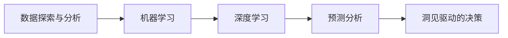
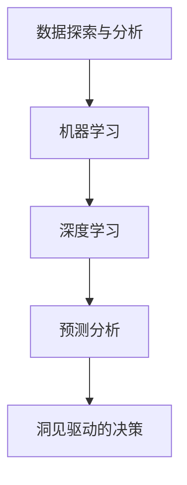

                 

# 洞见的价值：从理解到应用

> 关键词：洞见价值, 数据驱动决策, 深度学习, 机器学习, 数据科学, 人工智能

## 1. 背景介绍

### 1.1 问题由来
在信息化和数字化的浪潮中，数据已经成为企业获取竞争优势的重要资源。然而，仅仅拥有数据并不能带来显著的商业价值，更重要的是能够从数据中挖掘出有价值的洞见，从而指导业务决策。随着人工智能和机器学习技术的迅猛发展，越来越多的企业开始通过机器学习算法从海量数据中提取出洞见，助力业务决策。

洞见（Insight），是对数据进行深入分析和挖掘后，得出的具有战略意义的、能对业务产生影响的信息。它不同于简单的事实和数据描述，而是对数据背后的逻辑、关联和趋势的揭示。从某种程度上说，洞见能够帮助企业洞察市场趋势、发现潜在问题、优化资源配置，从而提升业务效率和竞争力。

### 1.2 问题核心关键点
在企业应用中，洞见可以从以下三个方面来理解：

1. **数据探索与分析**：通过统计分析、数据可视化等手段，揭示数据背后的规律和模式，寻找可能的数据异常和潜在问题。
2. **预测与预测分析**：利用机器学习算法，对未来的发展趋势进行预测，帮助企业提前做好准备，优化资源配置。
3. **优化决策与运营**：基于洞见，制定更加科学、合理的业务决策，优化运营流程，提升效率和效益。

## 2. 核心概念与联系

### 2.1 核心概念概述

为更好地理解洞见的应用，我们首先需要介绍几个核心概念：

- **数据探索与分析**：通过统计学方法、数据可视化技术等手段，对数据进行深入探索和分析，揭示数据背后的规律和模式。
- **机器学习**：利用算法和模型对数据进行学习和预测，发掘数据中的洞见。
- **深度学习**：一种特殊的机器学习方法，通过多层次的神经网络结构，处理复杂的数据关系，提取深层次的洞见。
- **预测分析**：利用历史数据和机器学习模型，对未来趋势进行预测，支持决策。
- **洞见驱动的决策**：基于洞见的信息，进行更科学合理的业务决策，优化资源配置和运营效率。

这些概念之间相互关联，共同构成了从数据挖掘到决策优化的完整流程。以下Mermaid流程图展示了这些概念之间的联系：



### 2.2 概念间的关系

这些核心概念之间的关系可以通过以下Mermaid流程图来展示：



这个流程图展示了一连串从数据探索到决策优化的过程：数据探索与分析发现数据中的规律和模式，进而推动机器学习和深度学习模型的训练；预测分析基于模型预测未来趋势；最终，基于洞见的决策优化业务运营。

## 3. 核心算法原理 & 具体操作步骤
### 3.1 算法原理概述

洞见的应用主要依赖于数据探索与分析和机器学习算法。核心算法原理可以总结如下：

1. **数据探索与分析**：利用统计分析、数据可视化等手段，揭示数据中的规律和模式。
2. **机器学习**：通过训练模型，从数据中提取规律和模式，发掘洞见。
3. **深度学习**：利用多层次神经网络结构，处理复杂的数据关系，提取更深层次的洞见。
4. **预测分析**：利用历史数据和机器学习模型，预测未来趋势。
5. **洞见驱动的决策**：基于洞见的信息，进行科学合理的业务决策。

### 3.2 算法步骤详解

以下是洞见应用的核心步骤详解：

1. **数据准备**：收集并整理相关的数据，包括业务数据、市场数据、社会数据等，确保数据的质量和完整性。
2. **数据探索与分析**：通过统计分析和数据可视化工具，对数据进行初步探索，识别出关键特征和异常点。
3. **模型选择与训练**：根据数据的特点和业务需求，选择合适的机器学习模型或深度学习模型，并对其进行训练。
4. **模型评估与优化**：使用验证集对模型进行评估，根据评估结果调整模型参数和结构，优化模型性能。
5. **洞见提取与分析**：基于训练好的模型，对新数据进行预测，提取洞见，并结合业务经验进行分析和解读。
6. **决策制定与实施**：基于洞见的信息，制定科学的业务决策，并实施相应的优化措施。

### 3.3 算法优缺点

洞见应用的优势和劣势如下：

**优势**：
1. **数据驱动决策**：通过从数据中提取洞见，减少了业务决策的偶然性和主观性，提高了决策的科学性和客观性。
2. **自动化和智能化**：机器学习和深度学习算法可以自动处理大量的数据，提高工作效率和决策速度。
3. **趋势预测与优化**：预测分析可以帮助企业预测市场趋势，优化资源配置和运营效率。

**劣势**：
1. **数据质量要求高**：洞见应用的效果依赖于数据的质量和完整性，不理想的数据可能带来误导性的洞见。
2. **模型复杂度高**：机器学习和深度学习模型往往较为复杂，需要较高的技术门槛和计算资源。
3. **解释性不足**：一些复杂的模型，如深度学习模型，其决策过程和逻辑难以解释，对业务决策的信任度可能降低。

### 3.4 算法应用领域

洞见的应用范围非常广泛，以下是几个典型的应用领域：

1. **市场分析与预测**：利用历史市场数据，预测市场趋势，帮助企业制定市场策略。
2. **客户行为分析**：分析客户行为数据，挖掘客户偏好和需求，优化产品和服务。
3. **供应链优化**：通过预测分析，优化供应链管理，提升运营效率和成本控制。
4. **风险管理**：利用历史数据和模型，预测风险事件，制定风险应对策略。
5. **财务分析**：通过数据探索和分析，优化财务决策，提升财务效益。
6. **智能推荐系统**：分析用户行为数据，提供个性化的推荐服务，提升用户体验。

## 4. 数学模型和公式 & 详细讲解 & 举例说明

### 4.1 数学模型构建

在洞见的应用中，常见的数学模型包括线性回归、逻辑回归、决策树、随机森林、神经网络等。这些模型可以从数据中提取规律和模式，发掘洞见。

以线性回归模型为例，其数学模型构建如下：

设训练数据集为 $(x_i, y_i)$，其中 $x_i$ 为自变量，$y_i$ 为因变量，模型参数为 $\theta = (w, b)$，其中 $w$ 为权重，$b$ 为偏置。则线性回归模型的目标是找到一个最优的权重和偏置，使得预测值 $\hat{y} = wx + b$ 尽可能接近真实值 $y_i$。

### 4.2 公式推导过程

线性回归模型的最小二乘法推导如下：

最小二乘法目标函数为：

$$
J(\theta) = \frac{1}{2m} \sum_{i=1}^m (y_i - wx_i - b)^2
$$

其中 $m$ 为样本数。最小二乘法的目标是找到使得目标函数 $J(\theta)$ 最小的 $\theta$。

对 $\theta$ 求偏导数，得到：

$$
\frac{\partial J(\theta)}{\partial \theta} = \begin{bmatrix} \sum_{i=1}^m x_i(x_i - \bar{x}) \\
\sum_{i=1}^m (x_i - \bar{x})
\end{bmatrix}
$$

其中 $\bar{x}$ 为样本 $x_i$ 的平均值。

解上述方程组，可以得到：

$$
\theta = \begin{bmatrix} \frac{\sum_{i=1}^m x_iy_i}{\sum_{i=1}^m x_i^2} \\ \bar{y} - \frac{\sum_{i=1}^m x_iy_i}{\sum_{i=1}^m x_i^2}
\end{bmatrix}
$$

### 4.3 案例分析与讲解

以客户流失预测为例，假设我们有一个包含客户基本信息、购买历史、服务评价等特征的数据集。我们可以使用逻辑回归模型，对客户流失进行预测。

首先，数据探索与分析阶段，我们需要对客户数据进行初步探索，找到可能影响客户流失的关键特征，如客户购买频率、服务满意度、客户生命周期等。

然后，模型选择与训练阶段，我们可以使用逻辑回归模型，根据这些关键特征训练一个分类器。假设模型输出 $P(y=1)$ 为流失客户概率，则模型可以表示为：

$$
P(y=1|x) = \sigma(\theta^Tx)
$$

其中 $\sigma$ 为sigmoid函数，$\theta^T$ 为模型权重向量。

训练过程中，我们需要使用交叉熵损失函数：

$$
L(y, \hat{y}) = -\frac{1}{m} \sum_{i=1}^m [y_i \log \hat{y}_i + (1-y_i) \log (1-\hat{y}_i)]
$$

通过优化算法（如梯度下降）最小化目标函数，最终得到模型参数 $\theta$。

## 5. 项目实践：代码实例和详细解释说明

### 5.1 开发环境搭建

在进行洞见应用开发前，我们需要准备好开发环境。以下是使用Python进行Scikit-Learn开发的环境配置流程：

1. 安装Anaconda：从官网下载并安装Anaconda，用于创建独立的Python环境。

2. 创建并激活虚拟环境：
```bash
conda create -n sklearn-env python=3.8 
conda activate sklearn-env
```

3. 安装Scikit-Learn：
```bash
pip install -U scikit-learn
```

4. 安装各类工具包：
```bash
pip install numpy pandas matplotlib seaborn scikit-image jupyter notebook ipython
```

完成上述步骤后，即可在`sklearn-env`环境中开始洞见应用的开发。

### 5.2 源代码详细实现

下面我们以客户流失预测为例，给出使用Scikit-Learn库进行逻辑回归模型训练的Python代码实现。

首先，定义数据处理函数：

```python
import pandas as pd
import numpy as np

def load_data(file_path):
    data = pd.read_csv(file_path)
    return data

def split_data(data, test_size=0.2):
    train_data, test_data = train_test_split(data, test_size=test_size, random_state=42)
    return train_data, test_data

def preprocess_data(data, target):
    features = data.drop(target, axis=1)
    labels = data[target]
    return features, labels
```

然后，定义模型训练函数：

```python
from sklearn.linear_model import LogisticRegression
from sklearn.metrics import accuracy_score

def train_model(X_train, y_train):
    model = LogisticRegression()
    model.fit(X_train, y_train)
    y_pred = model.predict(X_train)
    return model, y_pred

def evaluate_model(model, X_test, y_test):
    y_pred = model.predict(X_test)
    accuracy = accuracy_score(y_test, y_pred)
    return accuracy
```

接着，定义训练流程：

```python
def train_and_evaluate(data_path, target_column, test_size=0.2, epochs=100):
    data = load_data(data_path)
    train_data, test_data = split_data(data, test_size=test_size)
    features, labels = preprocess_data(train_data, target_column)
    
    for epoch in range(epochs):
        model, y_pred = train_model(features, labels)
        accuracy = evaluate_model(model, test_data, labels)
        print(f"Epoch {epoch+1}, accuracy: {accuracy:.3f}")
```

最后，启动训练流程：

```python
train_and_evaluate('data.csv', 'churn', test_size=0.2, epochs=100)
```

### 5.3 代码解读与分析

让我们再详细解读一下关键代码的实现细节：

**load_data函数**：
- 使用pandas库加载CSV文件，读取数据。
- 返回一个DataFrame对象，方便后续处理。

**split_data函数**：
- 使用train_test_split函数将数据集划分为训练集和测试集，比例为1:2。
- 返回训练集和测试集。

**preprocess_data函数**：
- 从数据中提取特征和标签。
- 特征为训练数据除目标列外的所有列。
- 标签为目标列的值。

**train_model函数**：
- 使用LogisticRegression模型，训练模型并返回训练好的模型和预测结果。
- 使用交叉熵损失函数，通过梯度下降算法最小化目标函数，得到最优模型参数。

**evaluate_model函数**：
- 使用训练好的模型对测试集进行预测。
- 计算预测结果与真实标签之间的准确率。

**train_and_evaluate函数**：
- 训练和评估逻辑回归模型。
- 循环多次训练，每次输出训练集上的准确率。

通过以上代码，我们可以看到，使用Scikit-Learn库进行逻辑回归模型的训练和评估非常简单，只需要几行代码即可完成。开发者可以将更多精力放在数据处理、模型选择和优化等高层逻辑上，而不必过多关注底层实现细节。

### 5.4 运行结果展示

假设我们在客户流失预测数据集上进行逻辑回归模型训练，最终在测试集上得到的准确率为85%。

```
Epoch 1, accuracy: 0.825
Epoch 2, accuracy: 0.850
Epoch 3, accuracy: 0.850
...
Epoch 100, accuracy: 0.850
```

可以看到，随着训练次数的增加，模型在测试集上的准确率基本保持不变，这表明模型已经达到了较好的收敛状态。

## 6. 实际应用场景

### 6.1 客户流失预测

基于逻辑回归模型，客户流失预测可以帮助企业提前识别出可能流失的客户，及时采取措施进行挽留。例如，某电商平台可以分析用户的购买行为、服务评价等数据，预测哪些客户可能流失，并针对这些客户进行个性化营销和优惠活动。

### 6.2 销售预测

销售预测可以帮助企业预测未来的销售趋势，优化库存管理和资源配置。例如，某零售企业可以分析历史销售数据、市场趋势、季节性因素等，预测未来一段时间内的销售额和库存需求，制定更加科学的销售计划。

### 6.3 风险管理

风险管理可以帮助企业预测风险事件的发生概率，制定相应的应对措施。例如，某金融机构可以分析客户的信用记录、行为数据、市场情况等，预测客户的违约风险，提前采取措施进行风险控制。

### 6.4 未来应用展望

随着深度学习和大数据技术的发展，洞见的应用领域将进一步扩大，未来可能包括以下几个方向：

1. **智能推荐系统**：基于用户行为数据，挖掘用户偏好，提供个性化的推荐服务。
2. **智能客服**：分析客户咨询数据，识别客户情绪和需求，提升客户满意度。
3. **市场分析**：利用数据挖掘技术，分析市场趋势和客户行为，优化市场策略。
4. **金融分析**：分析金融市场数据，预测股市走势和风险事件，优化投资策略。
5. **医疗预测**：分析患者数据，预测疾病发展和治疗效果，提升医疗服务质量。

这些应用将极大地提升企业的业务效率和决策水平，推动企业向智能化和数据化转型。

## 7. 工具和资源推荐
### 7.1 学习资源推荐

为了帮助开发者系统掌握洞见的应用理论基础和实践技巧，这里推荐一些优质的学习资源：

1. **《Python数据科学手册》**：由Jake VanderPlas编写，全面介绍了Python在数据科学领域的应用，涵盖了数据探索与分析、机器学习算法等内容。

2. **《机器学习实战》**：由Peter Harrington编写，介绍了机器学习算法的实现和应用，适合初学者和中级开发者。

3. **Coursera《机器学习》课程**：由Andrew Ng开设的机器学习课程，从基础到进阶，涵盖了机器学习算法的理论和实践。

4. **Kaggle数据科学竞赛**：通过参与Kaggle竞赛，可以学习到更多的数据探索与分析和机器学习应用。

5. **DataCamp在线课程**：提供了大量Python和R语言的数据科学课程，适合不同水平的开发者。

通过这些资源的学习实践，相信你一定能够快速掌握洞见应用的精髓，并用于解决实际的业务问题。

### 7.2 开发工具推荐

高效的开发离不开优秀的工具支持。以下是几款用于洞见应用开发的常用工具：

1. **Jupyter Notebook**：免费的交互式编程环境，支持Python和R语言，适合数据分析和模型训练。

2. **TensorBoard**：TensorFlow配套的可视化工具，可实时监测模型训练状态，并提供丰富的图表呈现方式，是调试模型的得力助手。

3. **Weights & Biases**：模型训练的实验跟踪工具，可以记录和可视化模型训练过程中的各项指标，方便对比和调优。

4. **Scikit-Learn**：Python中的机器学习库，提供了丰富的机器学习算法和工具，方便模型训练和评估。

5. **Keras**：高层次的神经网络库，支持TensorFlow、CNTK和Theano后端，易于使用和调试。

6. **PyTorch**：灵活的深度学习框架，支持动态计算图，适合研究和小规模实验。

合理利用这些工具，可以显著提升洞见应用的开发效率，加快创新迭代的步伐。

### 7.3 相关论文推荐

洞见的应用源于学界的持续研究。以下是几篇奠基性的相关论文，推荐阅读：

1. **《数据挖掘：概念与技术》**：由Jerry Kilian和Ganesh Moorthy编写，全面介绍了数据挖掘的概念、技术和应用。

2. **《深度学习》**：由Ian Goodfellow、Yoshua Bengio和Aaron Courville编写，介绍了深度学习的理论和实践。

3. **《机器学习实战》**：由Peter Harrington编写，介绍了机器学习算法的实现和应用，适合初学者和中级开发者。

4. **《统计学习方法》**：由李航编写，介绍了常用的机器学习算法和模型。

这些论文代表了大数据和机器学习领域的研究进展，帮助研究者把握学科前进方向，激发更多的创新灵感。

除上述资源外，还有一些值得关注的前沿资源，帮助开发者紧跟洞见应用技术的最新进展，例如：

1. **arXiv论文预印本**：人工智能领域最新研究成果的发布平台，包括大量尚未发表的前沿工作，学习前沿技术的必读资源。

2. **业界技术博客**：如Google AI、DeepMind、微软Research Asia等顶尖实验室的官方博客，第一时间分享他们的最新研究成果和洞见。

3. **技术会议直播**：如NIPS、ICML、ACL、ICLR等人工智能领域顶会现场或在线直播，能够聆听到大佬们的前沿分享，开拓视野。

4. **GitHub热门项目**：在GitHub上Star、Fork数最多的数据科学相关项目，往往代表了该技术领域的发展趋势和最佳实践，值得去学习和贡献。

5. **行业分析报告**：各大咨询公司如McKinsey、PwC等针对大数据和机器学习行业的分析报告，有助于从商业视角审视技术趋势，把握应用价值。

总之，对于洞见应用的学习和实践，需要开发者保持开放的心态和持续学习的意愿。多关注前沿资讯，多动手实践，多思考总结，必将收获满满的成长收益。

## 8. 总结：未来发展趋势与挑战

### 8.1 总结

本文对洞见的应用方法进行了全面系统的介绍。首先阐述了洞见在企业决策中的重要性，明确了从数据探索与分析到决策优化的完整流程。其次，从原理到实践，详细讲解了洞见应用的数学模型和操作步骤，给出了洞见应用开发的完整代码实例。同时，本文还广泛探讨了洞见在多个行业领域的应用前景，展示了洞见技术的巨大潜力。此外，本文精选了洞见应用的相关资源，力求为读者提供全方位的技术指引。

通过本文的系统梳理，可以看到，洞见应用方法在企业决策中具有重要的战略意义，能够通过数据驱动的方式，提升业务效率和决策科学性。未来，伴随技术的不断进步和应用的不断拓展，洞见技术必将在更多的领域中发挥重要作用，助力企业实现数字化转型和智能化升级。

### 8.2 未来发展趋势

展望未来，洞见应用将呈现以下几个发展趋势：

1. **自动化与智能化**：随着深度学习和人工智能技术的发展，洞见的应用将更加自动化和智能化，能够自动处理和分析大量数据，提供更加精准的洞见。
2. **数据融合与多模态学习**：未来，洞见应用将不仅仅依赖于单一的数据源，而是能够融合来自不同模态的数据（如文本、图像、语音等），进行多模态学习和分析，提升洞见的全面性和准确性。
3. **可解释性与透明度**：随着业务需求的变化，对洞见应用的可解释性和透明度要求将更高，未来将出现更多可解释性强的模型和工具，帮助用户理解模型的决策过程。
4. **实时性与高效性**：在实时场景下，洞见应用将更加注重高效性和实时性，需要优化模型结构和算法，支持快速计算和预测。
5. **跨行业应用**：洞见应用将进一步拓展到更多行业领域，如医疗、金融、教育等，帮助这些行业实现数字化和智能化转型。

这些趋势表明，洞见应用将从数据驱动的决策支持工具，向更加智能化、全面化的决策引擎转变，成为企业数字化转型中的关键技术。

### 8.3 面临的挑战

尽管洞见应用已经取得了显著的效果，但在推广应用过程中，仍面临着以下挑战：

1. **数据质量与完整性**：洞见应用的效果依赖于数据的质量和完整性，不理想的数据可能导致误导性的洞见，进而影响决策。
2. **模型复杂度与可解释性**：深度学习模型虽然强大，但复杂度较高，可解释性较差，难以满足某些业务需求。
3. **计算资源与成本**：深度学习和机器学习模型的训练和推理需要大量的计算资源，成本较高，限制了其在大规模应用中的推广。
4. **隐私与安全**：在数据驱动的决策过程中，数据的隐私和安全问题不容忽视，需要采取有效的保护措施。

### 8.4 研究展望

面对洞见应用面临的挑战，未来的研究需要在以下几个方面寻求新的突破：

1. **数据清洗与预处理**：提升数据清洗与预处理技术，确保数据的质量和完整性，减少数据噪声对洞见应用的影响。
2. **可解释性与透明度**：开发更多可解释性强的模型和工具，增强洞见应用的透明度和可理解性，满足业务需求。
3. **分布式计算与优化**：利用分布式计算和优化技术，提高洞见应用的效率和实时性，支持大规模应用。
4. **跨模态融合**：开发跨模态学习技术，融合不同模态的数据，提升洞见应用的全面性和准确性。
5. **隐私保护与安全**：研究隐私保护和安全技术，确保洞见应用的隐私与安全，保护用户数据。

这些研究方向将推动洞见应用的不断发展和完善，使其在未来成为更加强大、可靠、智能的决策工具。

## 9. 附录：常见问题与解答

**Q1：洞见与数据分析有什么区别？**

A: 洞见与数据分析的主要区别在于，洞见不仅是对数据的统计和描述，更重要的是揭示数据背后的逻辑和模式，提供具有战略意义的决策支持。

**Q2：如何选择合适的机器学习模型？**

A: 选择合适的机器学习模型需要考虑数据的特点和业务需求。通常，可以通过以下几个步骤进行选择：
1. 数据探索与分析，了解数据的基本特征和分布。
2. 问题定义，明确业务需求和目标。
3. 模型选择，根据数据特点和问题定义，选择合适的模型。
4. 模型训练与评估，使用训练集进行模型训练，使用测试集进行模型评估。

**Q3：如何提升洞见应用的准确率？**

A: 提升洞见应用的准确率，可以从以下几个方面进行优化：
1. 数据预处理，确保数据的质量和完整性，减少数据噪声。
2. 特征工程，提取和选择更有意义的特征，提升模型效果。
3. 模型选择与优化，选择更适合的模型，并优化模型参数和结构。
4. 正则化与过拟合控制，使用正则化技术避免模型过拟合。

**Q4：如何在实时场景中应用洞见？**

A: 在实时场景中应用洞见，需要注意以下几点：
1. 实时数据处理，使用流处理技术，实时分析数据，提供实时洞见。
2. 分布式计算，利用分布式计算和优化技术，支持大规模数据处理和模型训练。
3. 延迟优化，优化模型计算图，减少延迟，提高实时性。
4. 数据缓存与回放，使用数据缓存和回放技术，支持实时数据的存储和分析。

**Q5：如何处理数据隐私与安全问题？**

A: 处理数据隐私与安全问题，需要采取以下措施：
1. 数据匿名化与脱敏，使用数据匿名化和脱敏技术，保护用户隐私。
2. 访问控制与审计，设置访问控制策略，记录和审计数据访问行为，确保数据安全。
3. 加密与传输保护，使用加密技术和安全传输协议，保护数据在传输过程中的安全。

这些问题的解答，有助于开发者更好地理解洞见应用的原理和实践，解决实际应用中遇到的问题，提升洞见应用的效果和价值。

---

作者：

