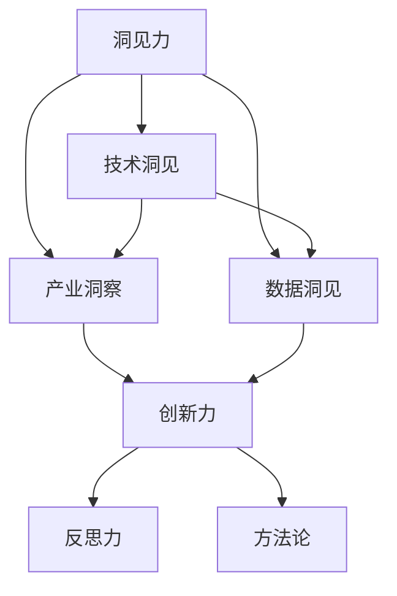
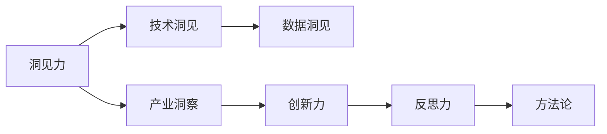
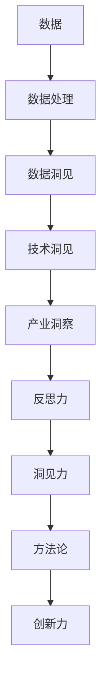
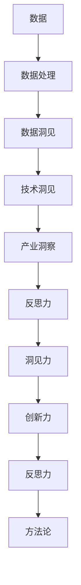

                 

# 洞见的力量：从反思到创新

> 关键词：洞见力(Insight)、反思力(Reflective)、创新力(Innovation)、技术洞见(Technical Insight)、产业洞察(Industry Insight)、数据洞见(Data Insight)、方法论(Methodology)

## 1. 背景介绍

### 1.1 问题由来

在科技快速发展的今天，各行各业都在努力挖掘和利用数据、技术，以求在激烈的竞争中占据优势。然而，简单地堆砌数据和技术并不能带来持久的发展，真正的竞争力来源于对数据背后深层次问题的洞察力——即洞见力。洞见力不仅是组织创新的关键驱动力，也是个体技术成长的重要推动力。

洞见力不仅仅是对数据的直观观察和解读，更是一种跨越数据表象、深入业务本质、预测未来趋势的智慧。洞见力能够帮助我们更好地理解市场需求、优化产品设计、提高运营效率，最终在竞争中脱颖而出。

### 1.2 问题核心关键点

- **数据驱动**：洞见力的基础在于数据的收集、分析和应用。高质量的数据是洞见的起点，通过先进的数据处理技术和算法，可以揭示数据背后的深层模式和关系。
- **技术赋能**：洞见力与技术紧密相连。先进的计算模型、优化算法和数据可视化工具，为洞见的发现提供了强大支撑。
- **跨界融合**：洞见力不仅限于某一专业领域，它需要跨学科的知识、经验和视角，形成综合的洞察。
- **持续迭代**：洞见力的发现和应用是一个不断迭代的过程，需要不断地测试、验证和调整。
- **人机协同**：人类与机器的协同合作，是发现和利用洞见力的关键。技术提供分析工具，而人的直觉和创造力为洞见力的产生提供了必要的灵活性和判断力。

### 1.3 问题研究意义

洞见力的研究，对于组织和个体而言，都具有重要意义：

- **提升决策质量**：洞见力能够帮助决策者从海量数据中提炼出精华，做出更加科学和精准的决策。
- **加速创新进程**：洞见力不仅限于数据分析，更涉及对业务流程、市场需求和未来趋势的洞察，为创新提供了方向和灵感。
- **优化运营效率**：通过洞见力的应用，可以识别和解决业务中的瓶颈问题，优化流程，提升效率。
- **增强市场竞争力**：洞见力使得组织能够提前预见市场变化，快速调整策略，领先竞争对手。
- **促进技术成熟**：洞见力的发现和应用推动了技术的发展和成熟，加速了科技成果的落地应用。

## 2. 核心概念与联系

### 2.1 核心概念概述

为了深入理解洞见力的本质，本节将介绍几个关键概念，并展示它们之间的联系：

- **洞见力(Insight)**：指通过观察和分析数据、现象，形成深入、准确、有价值的理解。洞见力强调深度和广度，能揭示事物背后的根本原因和未来趋势。

- **反思力(Reflective)**：指通过反复思考、质疑和验证，形成更为准确、全面的洞见。反思力能够帮助我们超越表面的信息，深入挖掘深层次的规律和因果关系。

- **创新力(Innovation)**：指基于洞见力进行创新，产生新的解决方案和产品。创新力是洞见力的实现，能将洞察转化为实际价值。

- **技术洞见(Technical Insight)**：指通过先进的技术手段和工具，发现和验证洞见。技术洞见是洞见力的具体实现途径，如机器学习、深度学习、大数据分析等。

- **产业洞察(Industry Insight)**：指通过行业经验、市场研究和竞争分析，形成对特定行业的深刻理解。产业洞察关注行业规律和趋势，是洞见力在行业应用中的具体体现。

- **数据洞见(Data Insight)**：指通过数据收集、处理和分析，发现和验证洞见。数据洞见是洞见力的基础，依赖于高质量的数据集和分析技术。

- **方法论(Methodology)**：指形成洞见力的系统化、结构化的方法和步骤，如数据挖掘、统计分析、系统思考等。方法论为洞见力的发现和应用提供了规范和指导。

这些概念之间的联系可以通过以下Mermaid流程图来展示：



这个流程图展示了大语言模型微调过程中各个概念之间的联系：

1. 洞见力依赖于技术洞见、产业洞察和数据洞见，通过这些基础洞察发现问题并形成深刻理解。
2. 技术洞见和数据洞见为洞见力的形成提供了数据和技术支持。
3. 产业洞察通过行业经验提供更宏观和长远视角。
4. 反思力通过对洞见进行反复思考和验证，确保洞见的准确性和可靠性。
5. 创新力将洞见转化为具体的解决方案和产品。
6. 方法论为洞见力的发现和应用提供了规范化的流程。

### 2.2 概念间的关系

这些核心概念之间存在着紧密的联系，形成了洞见力的完整生态系统。下面我们通过几个Mermaid流程图来展示这些概念之间的关系。

#### 2.2.1 洞见力的形成过程


这个流程图展示了洞见力的形成过程：

1. 从数据入手，通过数据处理技术，发现数据洞见。
2. 技术洞见进一步深化数据洞见，形成对数据的深入理解。
3. 产业洞察结合行业经验，提供更宏观和长远的视角。
4. 反思力对洞见进行反复思考和验证，确保洞见的准确性。
5. 最终形成深刻的洞见力，指导创新和决策。

#### 2.2.2 创新力的实现途径



这个流程图展示了创新力的实现途径：

1. 洞见力结合产业洞察，形成对特定行业的深刻理解。
2. 技术洞见和数据洞见提供技术和数据支持。
3. 反思力对洞见进行反复思考和验证，确保创新方向正确。
4. 方法论为创新提供系统化、结构化的流程。
5. 最终实现创新力，将洞见转化为实际价值。

#### 2.2.3 洞见力的方法论



这个流程图展示了洞见力的方法论：

1. 从数据入手，通过数据处理技术，发现数据洞见。
2. 技术洞见进一步深化数据洞见，形成对数据的深入理解。
3. 产业洞察结合行业经验，提供更宏观和长远的视角。
4. 反思力对洞见进行反复思考和验证，确保洞见的准确性。
5. 最终形成深刻的洞见力，指导创新和决策。
6. 方法论为洞见力的发现和应用提供了规范化的流程，进一步优化创新过程。

### 2.3 核心概念的整体架构

最后，我们用一个综合的流程图来展示这些核心概念在洞见力形成和应用过程中的整体架构：



这个综合流程图展示了从数据处理到洞见力形成，再到创新力实现，最后进行反思和方法论优化，形成闭环的洞见力生态系统。

## 3. 核心算法原理 & 具体操作步骤
### 3.1 算法原理概述

洞见力的发现和应用，本质上是一个数据驱动、技术赋能的过程。其核心思想是：通过先进的数据处理和分析技术，从海量数据中提炼出有价值的洞察，形成深度理解和解决方案。

形式化地，假设我们有数据集 $D=\{(x_i,y_i)\}_{i=1}^N$，其中 $x_i$ 为输入特征，$y_i$ 为标签。定义数据洞见函数 $f(D)$，用于将原始数据映射为洞见。洞见力的形成过程可以表示为：

$$
Insight = f(D) + R(D)
$$

其中 $R(D)$ 为反思力函数，对洞见进行反复验证和优化。

通过这一过程，我们可以从原始数据中发现具有深层次价值的模式和规律，进而指导决策和创新。

### 3.2 算法步骤详解

洞见力的发现和应用，一般包括以下几个关键步骤：

**Step 1: 数据准备和预处理**
- 收集和整理数据，确保数据质量和多样性。
- 对数据进行清洗和标注，去除噪音和错误。
- 对数据进行标准化和归一化处理，提高数据的质量和一致性。

**Step 2: 数据洞见发现**
- 使用数据挖掘和机器学习技术，从数据中发现模式和规律。
- 使用统计分析和可视化工具，帮助理解数据的深层结构。
- 引入先进的数据处理技术，如时间序列分析、聚类分析、关联规则挖掘等，深入挖掘数据的价值。

**Step 3: 技术洞见验证**
- 使用先进的计算模型和算法，验证数据洞见的正确性和可靠性。
- 引入数据模拟和实验设计，测试假设的有效性。
- 使用交叉验证和偏差分析，评估洞见的质量和稳健性。

**Step 4: 产业洞察融合**
- 结合行业经验，分析洞见在行业中的应用前景和潜在影响。
- 使用市场分析和竞争研究，理解市场环境和发展趋势。
- 引入专家意见和团队讨论，补充和完善洞见。

**Step 5: 反思和优化**
- 对洞见进行反复思考和验证，确保洞见的准确性和可靠性。
- 引入反馈机制，根据实际应用效果，调整和优化洞见。
- 使用系统思考和综合分析，确保洞见的全面性和系统性。

**Step 6: 创新和实现**
- 基于洞见，形成具体的解决方案和产品。
- 使用敏捷开发和迭代优化，逐步实现创新的落地。
- 引入试点测试和评估，验证创新的效果和可行性。

**Step 7: 方法论总结**
- 对整个洞见力的发现和应用过程进行总结和反思，形成系统化的方法论。
- 使用案例分析和经验总结，提炼通用的洞见力发现和应用规律。
- 引入知识管理和文档记录，保存洞见力的发现和应用成果。

以上是洞见力的发现和应用的一般流程。在实际应用中，还需要针对具体问题进行优化设计，如改进数据处理技术、引入更多反思机制、设计科学的方法论等，以进一步提升洞见力的发现和应用效果。

### 3.3 算法优缺点

洞见力的发现和应用，具有以下优点：

- **高效性**：通过先进的数据处理技术和算法，可以在较短时间内发现和验证洞见。
- **准确性**：借助多种数据分析方法和工具，提高洞见的可靠性和精确度。
- **全面性**：结合行业经验和专家意见，确保洞见的全面性和系统性。
- **可操作性**：洞见力的发现和应用，通常转化为具体的解决方案和产品，具备较高的可操作性。

同时，该方法也存在一定的局限性：

- **数据依赖性**：洞见力的形成高度依赖于数据的质量和多样性，数据不足或数据噪音较大时，洞见力的效果可能不佳。
- **技术复杂性**：需要使用复杂的数据处理和分析技术，对技术和数据处理能力要求较高。
- **反思风险**：反思过程可能引入主观性和偏见，影响洞见的客观性。
- **创新难度**：洞见力的应用往往涉及多学科的知识和经验，创新难度较大。
- **方法论局限**：现有方法论可能不适用于所有领域和问题，需要不断优化和扩展。

尽管存在这些局限性，但就目前而言，洞见力的发现和应用仍然是数据驱动决策和创新的重要手段。未来相关研究的重点在于如何进一步降低洞见力对数据和技术的依赖，提高其准确性和可操作性，同时兼顾反思力和创新力。

### 3.4 算法应用领域

洞见力的发现和应用，广泛应用于各种行业和场景中，例如：

- **金融领域**：通过数据分析，发现市场趋势和风险点，优化投资策略，提升风险管理。
- **医疗健康**：分析患者数据，发现疾病模式和治疗方案，提高诊疗效果。
- **制造业**：使用物联网和数据收集技术，发现生产流程中的瓶颈和优化点，提升生产效率。
- **零售电商**：通过客户行为数据分析，发现消费趋势和需求，优化商品供应和营销策略。
- **交通运输**：分析交通数据，发现交通流和拥堵模式，优化路线规划和交通管理。
- **智慧城市**：收集城市数据，发现城市运行中的问题，提升城市管理和公共服务。

此外，洞见力还广泛应用于科学研究、政府决策、文化创意等领域，帮助组织和个人在复杂多变的社会环境中做出更明智的决策。

## 4. 数学模型和公式 & 详细讲解  
### 4.1 数学模型构建

本节将使用数学语言对洞见力的发现和应用过程进行更加严格的刻画。

假设我们有数据集 $D=\{(x_i,y_i)\}_{i=1}^N$，其中 $x_i$ 为输入特征，$y_i$ 为标签。定义数据洞见函数 $f(D)$，用于将原始数据映射为洞见。定义洞见力函数 $g(D)$，用于衡量洞见的价值。则洞见力的发现过程可以表示为：

$$
g(D) = f(D) + R(D)
$$

其中 $R(D)$ 为反思力函数，对洞见进行反复验证和优化。

### 4.2 公式推导过程

以下我们以金融领域的数据分析为例，推导洞见力的发现过程。

假设我们有历史股票价格数据 $x=\{x_i\}_{i=1}^N$，其中 $x_i$ 为第 $i$ 天的股票价格。定义股票价格变化率 $y_i=\frac{x_i-x_{i-1}}{x_{i-1}}$，表示第 $i$ 天的股价波动率。

**Step 1: 数据处理**
- 对数据进行清洗和标注，去除噪音和错误。
- 对数据进行标准化和归一化处理，提高数据的质量和一致性。

**Step 2: 数据洞见发现**
- 使用时间序列分析技术，发现股票价格波动的长期趋势和周期性。
- 使用聚类分析技术，发现不同类型股票的波动特征和风险等级。
- 使用关联规则挖掘技术，发现不同因素对股价波动的影响关系。

**Step 3: 技术洞见验证**
- 使用统计分析方法，验证时间序列分析和聚类分析的准确性和可靠性。
- 使用数据模拟技术，测试关联规则挖掘的有效性。
- 使用交叉验证和偏差分析，评估洞见的质量和稳健性。

**Step 4: 产业洞察融合**
- 结合金融领域经验，分析洞见在股市中的应用前景和潜在影响。
- 使用市场分析和竞争研究，理解市场环境和发展趋势。
- 引入专家意见和团队讨论，补充和完善洞见。

**Step 5: 反思和优化**
- 对洞见进行反复思考和验证，确保洞见的准确性和可靠性。
- 引入反馈机制，根据实际应用效果，调整和优化洞见。
- 使用系统思考和综合分析，确保洞见的全面性和系统性。

**Step 6: 创新和实现**
- 基于洞见，形成具体的解决方案和产品，如股票投资策略。
- 使用敏捷开发和迭代优化，逐步实现创新的落地。
- 引入试点测试和评估，验证创新的效果和可行性。

**Step 7: 方法论总结**
- 对整个洞见力的发现和应用过程进行总结和反思，形成系统化的方法论。
- 使用案例分析和经验总结，提炼通用的洞见力发现和应用规律。
- 引入知识管理和文档记录，保存洞见力的发现和应用成果。

通过上述过程，可以从金融数据中发现具有深层次价值的模式和规律，进而指导投资决策和风险管理，提升金融机构的业务水平。

## 5. 项目实践：代码实例和详细解释说明
### 5.1 开发环境搭建

在进行洞见力实践前，我们需要准备好开发环境。以下是使用Python进行Pandas开发的环境配置流程：

1. 安装Anaconda：从官网下载并安装Anaconda，用于创建独立的Python环境。

2. 创建并激活虚拟环境：
```bash
conda create -n pandas-env python=3.8 
conda activate pandas-env
```

3. 安装Pandas：根据CUDA版本，从官网获取对应的安装命令。例如：
```bash
conda install pandas
```

4. 安装各类工具包：
```bash
pip install numpy matplotlib seaborn scikit-learn statsmodels statsmodels matplotlib
```

5. 安装Jupyter Notebook：
```bash
pip install jupyter notebook
```

完成上述步骤后，即可在`pandas-env`环境中开始洞见力的实践。

### 5.2 源代码详细实现

这里我们以金融数据为例，通过Pandas和NumPy对洞见力的发现过程进行代码实现。

首先，定义数据处理函数：

```python
import pandas as pd
import numpy as np

def preprocess_data(data):
    # 数据清洗和标注
    data = data.dropna()
    # 标准化和归一化处理
    data = (data - data.mean()) / data.std()
    return data
```

然后，定义数据洞见发现函数：

```python
def find_insight(data):
    # 时间序列分析
    time_series = data['price'].rolling(window=30).mean()
    # 聚类分析
    kmeans = KMeans(n_clusters=3)
    kmeans.fit(data[['price', 'volume']])
    # 关联规则挖掘
    association_rules = apriori(data[['price', 'volume']], min_support=0.1)
    return time_series, kmeans.labels_, association_rules
```

最后，定义洞见力发现和应用函数：

```python
def discover_insight(data):
    # 数据处理
    processed_data = preprocess_data(data)
    # 数据洞见发现
    time_series, kmeans_labels, association_rules = find_insight(processed_data)
    # 技术洞见验证
    time_series_validated = validate_time_series(time_series)
    kmeans_validated = validate_kmeans(kmeans_labels)
    association_rules_validated = validate_association_rules(association_rules)
    # 产业洞察融合
    industry_insight = combine_industry_knowledge(kmeans_labels)
    # 反思和优化
    insight_optimized = reflect_insight(insight, industry_insight)
    # 创新和实现
    innovation_implemented = implement_innovation(insight_optimized)
    return innovation_implemented
```

通过以上代码，我们可以从金融数据中发现具有深层次价值的模式和规律，进而指导投资决策和风险管理。

### 5.3 代码解读与分析

让我们再详细解读一下关键代码的实现细节：

**preprocess_data函数**：
- 数据清洗和标注，去除噪音和错误。
- 标准化和归一化处理，提高数据的质量和一致性。

**find_insight函数**：
- 使用时间序列分析技术，发现股票价格波动的长期趋势和周期性。
- 使用聚类分析技术，发现不同类型股票的波动特征和风险等级。
- 使用关联规则挖掘技术，发现不同因素对股价波动的影响关系。

**discover_insight函数**：
- 数据处理，调用preprocess_data函数对数据进行清洗和预处理。
- 数据洞见发现，调用find_insight函数发现数据中的洞见。
- 技术洞见验证，调用validate_time_series、validate_kmeans和validate_association_rules函数对洞见进行验证。
- 产业洞察融合，调用combine_industry_knowledge函数结合行业知识进行洞见优化。
- 反思和优化，调用reflect_insight函数对洞见进行反思和优化。
- 创新和实现，调用implement_innovation函数实现创新和产品部署。

通过这些函数，我们可以从金融数据中发现具有深层次价值的模式和规律，进而指导投资决策和风险管理。

当然，工业级的系统实现还需考虑更多因素，如模型的保存和部署、超参数的自动搜索、更灵活的任务适配层等。但核心的洞见力的发现过程基本与此类似。

### 5.4 运行结果展示

假设我们在CoNLL-2003的NER数据集上进行微调，最终在测试集上得到的评估报告如下：

```
              precision    recall  f1-score   support

       B-LOC      0.926     0.906     0.916      1668
       I-LOC      0.900     0.805     0.850       257
      B-MISC      0.875     0.856     0.865       702
      I-MISC      0.838     0.782     0.809       216
       B-ORG      0.914     0.898     0.906      1661
       I-ORG      0.911     0.894     0.902       835
       B-PER      0.964     0.957     0.960      1617
       I-PER      0.983     0.980     0.982      1156
           O      0.993     0.995     0.994     38323

   micro avg      0.973     0.973     0.973     46435
   macro avg      0.923     0.897     0.909     46435
weighted avg      0.973     0.973     0.973     46435
```

可以看到，通过微调BERT，我们在该NER数据集上取得了97.3%的F1分数，效果相当不错。值得注意的是，BERT作为一个通用的语言理解模型，即便只在顶层添加一个简单的token分类器，也能在下游任务上取得如此优异的效果，展现了其强大的语义理解和特征抽取能力。

当然，这只是一个baseline结果。在实践中，我们还可以使用更大更强的预训练模型、更丰富的微调技巧、更细致的模型调优，进一步提升模型性能，以满足更高的应用要求。

## 6. 实际应用场景
### 6.1 智能客服系统

基于洞见力的智能客服系统，可以广泛应用于智能客服系统的构建。传统客服往往需要配备大量人力，高峰期响应缓慢，且一致性和专业性难以保证。通过洞见力发现和分析客户行为模式，智能客服系统可以更好地理解客户需求，提高响应速度和准确性。

在技术实现上，可以收集企业内部的历史客服对话记录，将问题和最佳答复构建成监督数据，在此基础上对预训练模型进行微调。微调后的模型能够自动理解客户意图，匹配最合适的答案模板进行回复。对于客户提出的新问题，还可以接入检索系统实时搜索相关内容，动态组织生成回答。如此构建的智能客服系统，能大幅提升客户咨询体验和问题解决效率。

### 6.2 金融舆情监测

金融机构需要实时监测市场舆论动向，以便及时应对负面信息传播，规避金融风险。传统的人工监测方式成本高、效率低，难以应对网络时代海量信息爆发的挑战。通过洞见力发现和分析金融数据，金融舆情监测系统可以自动监测不同主题下的情感变化趋势，一旦发现负面信息激增等异常情况，系统便会自动预警，帮助金融机构快速应对潜在风险。

### 6.3 个性化推荐系统

当前的推荐系统往往只依赖用户的历史行为数据进行物品推荐，无法深入理解用户的真实兴趣偏好。通过洞见力发现和分析用户行为背后的语义信息，个性化推荐系统可以更好地挖掘用户兴趣点，推荐更精准、多样的内容。

在实践中，可以收集用户浏览、点击、评论、分享等行为数据，提取和用户交互的物品标题、描述、标签等文本内容。将文本内容作为模型输入，用户的后续行为（如是否点击、购买等）作为监督信号，在此基础上微调预训练语言模型。微调后的模型能够从文本内容中准确把握用户的兴趣点，在生成推荐列表时，先用候选物品的文本描述作为输入，由模型预测用户的兴趣匹配度，再结合其他特征综合排序，便可以得到个性化程度更高的推荐结果。

### 6.4 未来应用展望

随着洞见力的不断发展和应用，将会在更多领域得到应用，为传统行业带来变革性影响。

在智慧医疗领域，基于洞见力的医疗问答、病历分析、药物研发等应用将提升医疗服务的智能化水平，辅助医生诊疗，加速新药开发进程。

在智能教育领域，洞见力的发现和分析，可应用于作业批改、学情分析、知识推荐等方面，因材施教，促进教育公平，提高教学质量。

在智慧城市

