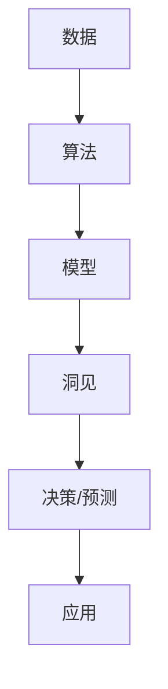

                 

## 1. 背景介绍

### 1.1 问题由来
在人类文明的发展历程中，洞见（Insight）作为一种无形的力量，不断地推动着科技进步和社会变革。从数学定理的发现到编程语言的创新，洞见的作用无处不在。然而，在追求效率和速度的现代科技社会中，洞见的发现和应用变得愈发困难。

人工智能（AI）作为当今科技发展的前沿领域，其核心在于让机器具备理解和应用洞见的能力。尽管深度学习、强化学习、自然语言处理等技术取得了巨大进步，但如何通过技术手段让机器更好地理解和应用洞见，仍是一个重要的研究方向。

### 1.2 问题核心关键点
洞见的力量在于其能帮助我们在复杂的现实世界中找到规律、发现模式、推断因果关系，从而实现预测和决策。在大数据和算力资源的推动下，机器学习模型的计算能力不断增强，但在如何有效提取和应用洞见方面，仍有诸多挑战：

1. **数据质量与多样性**：洞见的提取依赖于高质量、多样性的数据。数据缺失、错误或偏见会导致模型无法捕捉到真实的洞见。
2. **模型复杂度与泛化能力**：模型过于复杂可能导致过拟合，无法泛化到新的数据集上。
3. **算法透明性与可解释性**：深度学习模型的“黑盒”特性使得洞见的解释变得困难，特别是在医疗、金融等高风险领域，模型的决策过程需要透明和可解释。
4. **计算资源与效率**：尽管计算资源不断增加，但复杂模型的训练和推理仍需大量资源和时间。
5. **伦理与安全性**：机器学习模型的应用可能涉及隐私、偏见、公平性等问题，需要考虑伦理和安全性。

### 1.3 问题研究意义
研究洞见的提取与应用，对于提升人工智能的智能水平、推动技术进步具有重要意义：

1. **提升决策准确性**：通过洞见的提取和应用，模型能够更准确地预测和决策，提高生产效率和生活质量。
2. **降低成本与风险**：高效、准确的洞见提取能够降低人工干预的需求，减少资源浪费和决策风险。
3. **促进跨领域创新**：洞见的跨领域应用可以推动不同领域的融合创新，创造新的应用场景和价值。
4. **增强模型可解释性**：洞见的可解释性增强了模型的透明度，有助于在复杂系统中进行有效监管和优化。
5. **实现人类解放**：洞见的自动化应用能够替代人类进行复杂、高负荷的工作，让人类从繁重的工作中解放出来，专注于更具创造性的任务。

## 2. 核心概念与联系

### 2.1 核心概念概述

在讨论洞见的应用之前，我们需要理解几个核心概念：

- **洞见（Insight）**：通过数据分析、计算和建模，从复杂的现象中揭示出规律、模式和因果关系的过程。
- **模型（Model）**：通过学习和训练得到的数学模型，用于预测、分类、聚类等任务。
- **数据（Data）**：用于训练和测试模型的信息，包括结构化数据、非结构化数据等。
- **算法（Algorithm）**：用于处理和分析数据的数学和统计方法。
- **可解释性（Explainability）**：模型决策过程的透明度和可理解性，有助于用户理解和信任模型。

这些概念之间存在着紧密的联系，形成一个完整的洞见提取与应用框架。

### 2.2 概念间的关系

我们可以通过以下Mermaid流程图来展示这些核心概念之间的关系：



这个流程图展示了一个简单的洞见提取与应用流程：

1. **数据收集**：从各种来源收集数据，如传感器、用户行为、文本记录等。
2. **算法处理**：应用各种算法对数据进行处理，包括预处理、特征工程、建模等。
3. **模型训练**：使用处理后的数据训练模型，使其能够学习到数据的规律和特征。
4. **洞见提取**：通过模型对数据进行分析和预测，揭示出隐藏的洞见。
5. **决策/预测**：基于洞见，模型进行预测或决策，输出结果。
6. **应用部署**：将模型部署到实际应用中，实现自动化决策或预测。

通过这个流程，我们可以看到洞见的应用是数据、算法、模型三者相互作用的结果。

## 3. 核心算法原理 & 具体操作步骤
### 3.1 算法原理概述

洞见提取通常分为两个阶段：数据处理和模型训练。在数据处理阶段，我们通过数据清洗、特征提取等方法对原始数据进行处理，以便于后续的建模和分析。在模型训练阶段，我们使用训练数据对模型进行训练，使其能够学习到数据的规律和特征，从而揭示出隐藏的洞见。

### 3.2 算法步骤详解

以下是洞见提取的详细步骤：

1. **数据收集与预处理**：
   - 从不同的数据源收集数据。
   - 对数据进行清洗、去重、格式化等预处理，确保数据质量。
   - 进行特征提取，将原始数据转化为模型能够处理的特征。

2. **算法选择与参数调优**：
   - 根据任务选择合适的算法，如回归、分类、聚类等。
   - 对算法进行参数调优，寻找最优的参数组合。

3. **模型训练与评估**：
   - 使用训练数据对模型进行训练。
   - 对模型进行评估，使用测试数据验证模型的性能。
   - 根据评估结果进行模型的调整和优化。

4. **洞见提取与分析**：
   - 对模型进行分析和解释，揭示出隐藏的洞见。
   - 对洞见进行验证，确保其稳定性和可靠性。

5. **决策与预测**：
   - 根据洞见进行决策或预测。
   - 将模型部署到实际应用中，实现自动化决策或预测。

### 3.3 算法优缺点

洞见提取具有以下优点：

- **自动化与效率**：通过算法和模型，可以自动化地从数据中提取洞见，提高工作效率。
- **准确性与可靠性**：合理的算法和模型设计可以提高洞见的准确性和可靠性。
- **可解释性**：通过算法和模型的透明性，可以解释洞见的来源和形成过程。

然而，洞见提取也存在以下缺点：

- **数据质量依赖**：洞见的提取依赖于高质量、多样性的数据。
- **模型复杂度**：复杂的模型可能会导致过拟合，影响洞见的泛化能力。
- **计算资源消耗**：模型训练和预测需要大量的计算资源，可能面临资源消耗过大的问题。
- **算法透明性**：深度学习等复杂模型的决策过程不透明，难以解释。

### 3.4 算法应用领域

洞见提取在多个领域中得到了广泛应用，包括但不限于：

1. **金融风险管理**：通过分析历史交易数据，预测市场趋势和风险，帮助投资者做出更好的决策。
2. **医疗诊断**：利用患者数据和医学文献，揭示疾病的发病机制和治疗方法，辅助医生进行诊断和治疗。
3. **市场营销**：通过分析消费者行为数据，揭示市场趋势和消费者偏好，帮助企业制定更加有效的营销策略。
4. **智能交通**：通过分析交通数据，揭示交通流动的规律和瓶颈，优化交通管理，提高交通效率。
5. **环境保护**：通过分析环境数据，揭示环境变化的趋势和影响因素，制定环保政策，保护生态环境。

## 4. 数学模型和公式 & 详细讲解 & 举例说明

### 4.1 数学模型构建

在数学模型构建阶段，我们需要根据任务选择合适的数学模型，并定义模型的输入、输出和目标函数。

以线性回归模型为例，其数学模型为：

$$
y = \beta_0 + \beta_1 x_1 + \beta_2 x_2 + \cdots + \beta_n x_n + \epsilon
$$

其中，$y$ 为输出，$x_i$ 为输入，$\beta_i$ 为模型参数，$\epsilon$ 为误差项。目标函数为均方误差（Mean Squared Error, MSE）：

$$
\mathcal{L}(\theta) = \frac{1}{N} \sum_{i=1}^N (y_i - \hat{y}_i)^2
$$

其中，$\theta = (\beta_0, \beta_1, \beta_2, \cdots, \beta_n)$ 为模型参数。

### 4.2 公式推导过程

线性回归模型的参数估计可以通过最小二乘法实现，其推导过程如下：

1. **最小二乘法**：

$$
\theta = \mathop{\arg\min}_{\theta} \sum_{i=1}^N (y_i - \hat{y}_i)^2
$$

2. **求导与求解**：

$$
\frac{\partial}{\partial \beta_j} \sum_{i=1}^N (y_i - \hat{y}_i)^2 = 0 \quad (j=0,1,\cdots,n)
$$

3. **求解方程组**：

$$
\beta_j = \frac{1}{N} \sum_{i=1}^N (x_{ij} - \bar{x}_i)(y_i - \bar{y}) / \sum_{i=1}^N (x_{ij} - \bar{x}_i)^2
$$

其中，$\bar{x}_i$ 和 $\bar{y}$ 分别为 $x_i$ 和 $y$ 的均值。

### 4.3 案例分析与讲解

以医疗诊断为例，利用机器学习模型分析患者的病历数据，揭示疾病的潜在因素和发病机制。

1. **数据收集**：收集患者的病历数据，包括症状、检查结果、诊断等信息。
2. **数据预处理**：对数据进行清洗、去重、格式化等预处理，确保数据质量。
3. **算法选择**：选择合适的算法，如线性回归、决策树、随机森林等。
4. **模型训练**：使用训练数据对模型进行训练，优化模型参数。
5. **洞见提取**：对模型进行分析和解释，揭示疾病的潜在因素和发病机制。
6. **应用部署**：将模型部署到实际应用中，辅助医生进行诊断和治疗。

## 5. 项目实践：代码实例和详细解释说明

### 5.1 开发环境搭建

在进行洞见提取实践前，我们需要准备好开发环境。以下是使用Python进行Scikit-Learn开发的环境配置流程：

1. 安装Anaconda：从官网下载并安装Anaconda，用于创建独立的Python环境。

2. 创建并激活虚拟环境：
```bash
conda create -n pytorch-env python=3.8 
conda activate pytorch-env
```

3. 安装Scikit-Learn：
```bash
pip install scikit-learn
```

4. 安装各类工具包：
```bash
pip install numpy pandas scikit-learn matplotlib tqdm jupyter notebook ipython
```

完成上述步骤后，即可在`pytorch-env`环境中开始洞见提取实践。

### 5.2 源代码详细实现

这里我们以金融风险管理为例，给出使用Scikit-Learn进行线性回归的Python代码实现。

首先，定义数据集：

```python
from sklearn.datasets import load_boston
from sklearn.model_selection import train_test_split
import pandas as pd
import numpy as np

boston = load_boston()
X = pd.DataFrame(boston.data, columns=boston.feature_names)
y = pd.Series(boston.target, name='MEDV')
```

然后，将数据集拆分为训练集和测试集：

```python
X_train, X_test, y_train, y_test = train_test_split(X, y, test_size=0.3, random_state=42)
```

接着，定义线性回归模型并进行训练：

```python
from sklearn.linear_model import LinearRegression
from sklearn.metrics import mean_squared_error

model = LinearRegression()
model.fit(X_train, y_train)

y_pred = model.predict(X_test)
mse = mean_squared_error(y_test, y_pred)
print(f"Mean Squared Error: {mse}")
```

最后，评估模型的性能并进行洞见提取：

```python
from sklearn.inspection import permutation_importance

perm_importance = permutation_importance(model, X_test, y_test, n_repeats=10, random_state=42)
importances = perm_importance.importances_mean
```

以上就是使用Scikit-Learn进行线性回归的完整代码实现。可以看到，Scikit-Learn提供了丰富的工具函数和模型选择，使得洞见提取的实现变得简单高效。

### 5.3 代码解读与分析

让我们再详细解读一下关键代码的实现细节：

**数据集定义**：
- 使用`load_boston`函数加载波士顿房价数据集，包含14个特征和目标变量。
- 将数据集转换为Pandas DataFrame，方便后续处理。

**数据拆分**：
- 使用`train_test_split`函数将数据集划分为训练集和测试集，其中测试集占30%。
- 设置随机种子，确保实验可重复性。

**模型训练**：
- 定义线性回归模型，并使用`fit`方法在训练集上训练模型。
- 使用`predict`方法对测试集进行预测，计算预测误差。
- 使用`mean_squared_error`函数计算均方误差。

**洞见提取**：
- 使用`permutation_importance`函数计算每个特征的重要性，通过随机打乱特征并计算模型性能的变化来评估特征对模型的影响。
- 获取特征重要性的均值，作为洞见提取结果。

**性能评估**：
- 打印均方误差，评估模型的预测精度。
- 打印特征重要性，揭示影响模型预测的主要因素。

## 6. 实际应用场景

### 6.1 智能客服系统

在智能客服系统中，通过分析历史客服对话记录，揭示客户常见问题和需求，可以帮助客服系统更好地响应客户需求，提升服务质量。

1. **数据收集**：收集历史客服对话数据，包括客户提问和客服回复。
2. **数据预处理**：对数据进行清洗、去重、格式化等预处理，确保数据质量。
3. **算法选择**：选择适合的算法，如文本分类、情感分析等。
4. **模型训练**：使用训练数据对模型进行训练，优化模型参数。
5. **洞见提取**：对模型进行分析和解释，揭示客户常见问题和需求。
6. **应用部署**：将模型部署到实际应用中，辅助客服系统进行智能回复。

### 6.2 金融风险管理

在金融风险管理中，通过分析历史交易数据，揭示市场趋势和风险，帮助投资者做出更好的决策。

1. **数据收集**：收集历史交易数据，包括股票价格、交易量、市场新闻等。
2. **数据预处理**：对数据进行清洗、去重、格式化等预处理，确保数据质量。
3. **算法选择**：选择适合的算法，如时间序列分析、回归分析等。
4. **模型训练**：使用训练数据对模型进行训练，优化模型参数。
5. **洞见提取**：对模型进行分析和解释，揭示市场趋势和风险。
6. **应用部署**：将模型部署到实际应用中，辅助投资者进行投资决策。

### 6.3 医疗诊断

在医疗诊断中，通过分析患者病历数据，揭示疾病的潜在因素和发病机制，辅助医生进行诊断和治疗。

1. **数据收集**：收集患者的病历数据，包括症状、检查结果、诊断等信息。
2. **数据预处理**：对数据进行清洗、去重、格式化等预处理，确保数据质量。
3. **算法选择**：选择适合的算法，如线性回归、决策树、随机森林等。
4. **模型训练**：使用训练数据对模型进行训练，优化模型参数。
5. **洞见提取**：对模型进行分析和解释，揭示疾病的潜在因素和发病机制。
6. **应用部署**：将模型部署到实际应用中，辅助医生进行诊断和治疗。

## 7. 工具和资源推荐

### 7.1 学习资源推荐

为了帮助开发者系统掌握洞见提取的理论基础和实践技巧，这里推荐一些优质的学习资源：

1. 《统计学习基础》系列博文：由统计学专家撰写，深入浅出地介绍了统计学习的基本概念和核心方法。
2. 《机器学习实战》书籍：斯坦福大学Andrew Ng教授的入门级书籍，涵盖机器学习算法和实践，适合初学者。
3. 《深度学习》书籍：Ian Goodfellow等编写的深度学习经典教材，详细介绍了深度学习的理论和实践。
4. Scikit-Learn官方文档：Scikit-Learn的官方文档，提供了丰富的模型库和工具函数，是洞见提取学习的必备资料。
5 Kaggle竞赛平台：Kaggle提供了大量的数据集和竞赛项目，通过实际应用实践洞见提取技巧。

通过对这些资源的学习实践，相信你一定能够快速掌握洞见提取的精髓，并用于解决实际的业务问题。

### 7.2 开发工具推荐

高效的开发离不开优秀的工具支持。以下是几款用于洞见提取开发的常用工具：

1. Python：Python以其简洁的语法和丰富的库支持，成为数据科学和机器学习开发的主流语言。
2. Scikit-Learn：Scikit-Learn提供了丰富的模型和工具函数，适合数据预处理和洞见提取的实现。
3. TensorFlow和PyTorch：这两个深度学习框架提供了强大的计算能力和灵活的模型设计，适用于复杂模型的训练和优化。
4. Jupyter Notebook：Jupyter Notebook提供了交互式的开发环境，方便进行代码调试和可视化展示。
5. R语言：R语言是统计分析和数据科学的主要工具，提供了丰富的统计函数和绘图库。

合理利用这些工具，可以显著提升洞见提取任务的开发效率，加快创新迭代的步伐。

### 7.3 相关论文推荐

洞见提取的研究源于学界的持续研究。以下是几篇奠基性的相关论文，推荐阅读：

1. 《机器学习》：Tom Mitchell教授的经典著作，系统介绍了机器学习的理论和应用。
2. 《统计学习》：Tibshirani教授的著作，详细介绍了统计学习的核心方法和应用。
3. 《深度学习》：Goodfellow等编写的深度学习经典教材，介绍了深度学习的理论和实践。
4. 《统计学习基础》：Cai等教授的博文，介绍了统计学习的基本概念和核心方法。
5 《机器学习实战》：Andrew Ng教授的入门级书籍，涵盖机器学习算法和实践。

这些论文代表了大数据和机器学习领域的进展，帮助研究者把握学科的前沿方向，激发更多的创新灵感。

除上述资源外，还有一些值得关注的前沿资源，帮助开发者紧跟大数据和机器学习技术的最新进展，例如：

1. arXiv论文预印本：人工智能领域最新研究成果的发布平台，包括大量尚未发表的前沿工作，学习前沿技术的必读资源。
2 业界技术博客：如Google AI、DeepMind、Microsoft Research Asia等顶尖实验室的官方博客，第一时间分享他们的最新研究成果和洞见。
3 技术会议直播：如NeurIPS、ICML、CVPR等人工智能领域顶会现场或在线直播，能够聆听到大佬们的前沿分享，开拓视野。
4 GitHub热门项目：在GitHub上Star、Fork数最多的数据科学和机器学习相关项目，往往代表了该技术领域的发展趋势和最佳实践，值得去学习和贡献。
5 行业分析报告：各大咨询公司如McKinsey、PwC等针对大数据和机器学习行业的分析报告，有助于从商业视角审视技术趋势，把握应用价值。

总之，对于洞见提取技术的学习和实践，需要开发者保持开放的心态和持续学习的意愿。多关注前沿资讯，多动手实践，多思考总结，必将收获满满的成长收益。

## 8. 总结：未来发展趋势与挑战

### 8.1 研究成果总结

本文对洞见的提取与应用进行了全面系统的介绍。首先阐述了洞见在人工智能中的重要性，明确了洞见提取在提升模型性能、推动技术进步方面的独特价值。其次，从原理到实践，详细讲解了洞见的数学模型和操作步骤，给出了洞见提取任务开发的完整代码实例。同时，本文还广泛探讨了洞见在智能客服、金融风险管理、医疗诊断等多个行业领域的应用前景，展示了洞见提取范式的巨大潜力。此外，本文精选了洞见提取技术的各类学习资源，力求为读者提供全方位的技术指引。

通过本文的系统梳理，可以看到，洞见提取技术在大数据和机器学习中的广泛应用，极大地提升了模型的智能水平和应用效果。未来，随着技术的不断进步，洞见提取方法还将进一步扩展到更多领域，为人工智能技术的发展提供更加坚实的理论基础和实践支撑。

### 8.2 未来发展趋势

展望未来，洞见提取技术将呈现以下几个发展趋势：

1. **自动化与智能化**：随着算法和模型的不断优化，洞见提取将更加自动化和智能化，能够从原始数据中快速提取出有用的洞见。
2. **多模态数据融合**：未来的洞见提取将更多地融合多模态数据，如文本、图像、视频等，提高模型的综合分析和决策能力。
3. **跨领域应用**：洞见提取将突破传统领域的限制，广泛应用于更多垂直领域，如金融、医疗、教育等，推动跨领域技术的融合创新。
4. **模型可解释性**：未来的模型设计将更加注重可解释性，使洞见的提取和应用过程更加透明和可理解。
5. **伦理与安全**：洞见提取技术将更加注重伦理和安全问题，确保模型应用的公平性和安全性。

以上趋势凸显了洞见提取技术的广阔前景。这些方向的探索发展，必将进一步提升人工智能的智能水平和应用效果，为科技和社会发展带来深远影响。

### 8.3 面临的挑战

尽管洞见提取技术已经取得了显著进展，但在应用过程中仍面临诸多挑战：

1. **数据质量与多样性**：高质量、多样性的数据是洞见提取的基础，但在实际应用中，数据往往存在缺失、错误或偏见。
2. **模型复杂度与泛化能力**：复杂的模型可能会导致过拟合，影响洞见的泛化能力。
3. **计算资源消耗**：模型训练和推理需要大量的计算资源，可能面临资源消耗过大的问题。
4. **算法透明性**：深度学习等复杂模型的决策过程不透明，难以解释。
5. **伦理与安全**：洞见提取技术可能涉及隐私、偏见、公平性等问题，需要考虑伦理和安全性。

正视洞见提取面临的这些挑战，积极应对并寻求突破，将是大数据和机器学习技术走向成熟的必由之路。相信随着学界和产业界的共同努力，这些挑战终将一一被克服，洞见提取技术必将在构建人机协同的智能系统中发挥更大的作用。

### 8.4 研究展望

面对洞见提取所面临的挑战，未来的研究需要在以下几个方面寻求新的突破：

1. **数据增强与预处理**：通过数据增强和预处理技术，提升数据质量和多样性，确保洞见的可靠性。
2. **模型简化与优化**：设计更简单、更有效的模型结构，减少过拟合风险，提高模型的泛化能力。
3. **计算优化与加速**：通过优化计算图、分布式计算等技术，提升模型的训练和推理速度。
4. **算法透明性与可解释性**：引入可解释性算法和透明性技术，提高洞见的可解释性和可理解性。
5. **伦理与安全约束**：在模型设计中加入伦理和安全约束，确保洞见提取过程的公平性和安全性。

这些研究方向的探索，必将引领洞见提取技术迈向更高的台阶，为构建更加智能、安全、可信的人工智能系统提供坚实的技术支撑。

## 9. 附录：常见问题与解答

**Q1：如何评估模型的性能？**

A: 模型性能评估通常使用多种指标，包括均方误差、准确率、召回率、F1分数等。具体选择哪些指标需要根据任务特点和应用场景来决定。例如，在金融风险管理中，均方误差和F1分数可能更为重要，而在医疗诊断中，准确率和召回率可能更为关键。

**Q2：如何处理数据缺失问题？**

A: 数据缺失是常见的数据问题之一，处理方式包括插值法、删除法、均值/中位数/众数填充等。需要根据数据的分布特性和任务需求来选择合适的处理方法。

**Q3：如何避免过拟合？**

A: 过拟合是模型训练中常见的问题，可以通过以下方式避免：
1. 数据增强：通过对训练数据进行变换和扩充，提升数据多样性。
2. 正则化：使用L1/L2正则化等方法，限制模型参数大小。
3. 早停：在模型性能不再提升时停止训练，防止过拟合。
4. 集成学习：通过多个模型的平均或投票，减少单个模型的过拟合风险。

**Q4：如何提升模型的泛化能力？**

A: 提升模型泛化能力的关键在于增加数据量和模型复杂度的平衡。可以通过以下方式实现：
1. 增加数据量：尽可能收集更多高质量的数据，扩大训练集的规模。
2. 简化模型结构：避免过度复杂的模型，防止过拟合。
3. 使用正则化：通过L1/L2正则化等方法，限制模型参数大小。
4. 交叉验证：使用交叉验证方法，评估模型的泛化能力。

**Q5：如何保证模型的可解释性？**

A: 提高模型可解释性的方法包括：
1. 使用简单的模型：简单模型通常具有更好的可解释性，如线性回归、决策树等。
2. 可视化技术：使用可视化工具展示模型参数和决策路径，帮助理解模型行为。
3. 特征

