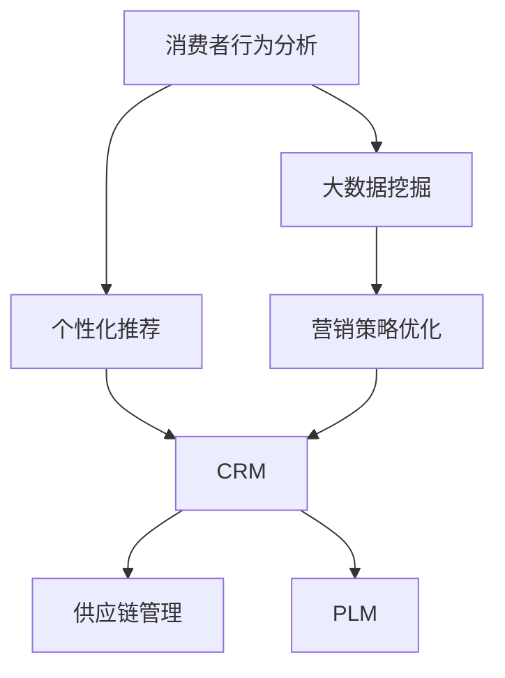

                 

# 消费品行业从业经验分享

> 关键词：
- 消费者行为分析
- 大数据挖掘
- 个性化推荐
- 营销策略优化
- 客户关系管理(CRM)
- 供应链管理
- 产品生命周期管理(PLM)

## 1. 背景介绍

### 1.1 问题由来
随着全球消费市场的不断扩大，消费品行业已成为企业竞争的重要领域。如何精准洞察消费者需求，优化产品供给，提高市场占有率，一直是企业关注的焦点。在大数据和人工智能技术的推动下，数据驱动的决策管理成为新趋势。

本文将围绕消费品行业的从业经验，分享如何通过大数据技术和人工智能算法，实现消费者行为分析、个性化推荐、营销策略优化等方面的实践探索，希望能为同行提供一些有益的借鉴。

### 1.2 问题核心关键点
在消费品行业，从业者需要处理大量复杂的业务数据，挖掘潜在规律，并转化为实际的运营决策。数据处理和分析的过程，可以总结为以下几个核心关键点：

- **数据获取与存储**：从各种渠道收集消费者数据，存储在企业数据仓库中。
- **数据清洗与预处理**：清洗脏数据，处理缺失值，进行特征工程，生成训练数据集。
- **模型训练与优化**：选择合适的算法模型，对训练数据进行训练，并对模型进行调参优化。
- **预测与决策**：基于模型预测结果，制定优化策略和运营方案，提高业务效果。

## 2. 核心概念与联系

### 2.1 核心概念概述

为更好地理解消费品行业的数据驱动决策过程，本节将介绍几个密切相关的核心概念：

- **消费者行为分析**：通过数据分析手段，挖掘消费者购买习惯、偏好、需求变化等行为特征，为企业决策提供依据。
- **大数据挖掘**：利用大数据技术和算法，从海量数据中提取有价值的信息和规律，辅助决策。
- **个性化推荐**：基于消费者历史行为数据，推荐符合其兴趣和需求的商品，提升用户体验和转化率。
- **营销策略优化**：通过分析消费者行为数据，优化营销活动，提高营销效率和投资回报率。
- **客户关系管理(CRM)**：利用数据分析和人工智能，对客户行为进行精准预测和管理，提升客户满意度和忠诚度。
- **供应链管理**：通过数据分析和优化算法，优化供应链流程，提高供应链效率和响应速度。
- **产品生命周期管理(PLM)**：通过数据分析和预测模型，优化产品生命周期各阶段管理，延长产品生命周期。

这些概念之间存在着紧密的联系，形成了数据驱动的决策管理生态系统。通过深度挖掘消费者数据，实现个性化推荐、优化营销策略、提升供应链效率和延长产品生命周期，企业可以更高效地满足消费者需求，提升市场竞争力。

### 2.2 概念间的关系

这些核心概念之间存在着紧密的联系，形成了数据驱动的决策管理生态系统。下面我通过几个Mermaid流程图来展示这些概念之间的关系。



这个流程图展示了大数据挖掘在消费品行业各个环节中的作用。消费者行为分析通过大数据挖掘技术，从消费者数据中提取有价值的信息，用于个性化推荐和优化营销策略。CRM系统通过数据分析和算法，对客户行为进行精准预测和管理，提升客户满意度和忠诚度。供应链管理通过优化算法，提升供应链效率和响应速度。PLM系统通过数据分析和预测模型，优化产品生命周期各阶段管理，延长产品生命周期。

## 3. 核心算法原理 & 具体操作步骤
### 3.1 算法原理概述

在消费品行业中，数据驱动的决策管理主要依赖于一系列机器学习和数据挖掘算法。其核心思想是通过对历史数据的学习，预测未来的行为，制定最优决策方案。具体包括以下几个步骤：

1. **数据获取与清洗**：从各种渠道收集消费者数据，并进行初步清洗和预处理。
2. **特征工程**：选择或构建合适的特征，用于后续模型训练。
3. **模型训练与优化**：选择合适的算法模型，对训练数据进行训练，并对模型进行调参优化。
4. **预测与决策**：基于模型预测结果，制定优化策略和运营方案，提高业务效果。

### 3.2 算法步骤详解

以下是消费品行业中常用的一些算法步骤详解：

**Step 1: 数据获取与清洗**
- 从销售记录、社交媒体、客户反馈等渠道收集数据。
- 使用ETL工具（如Apache Nifi、AWS Glue等）进行数据抽取、转换和加载。
- 清洗脏数据，处理缺失值和异常值，确保数据质量。

**Step 2: 特征工程**
- 对数据进行特征选择和特征构建，如提取用户行为特征、产品属性特征、时间特征等。
- 生成交叉特征和组合特征，提高模型的解释性和预测能力。
- 进行归一化和标准化处理，确保特征尺度一致。

**Step 3: 模型训练与优化**
- 选择合适的算法模型，如随机森林、梯度提升树、深度学习模型等。
- 划分训练集、验证集和测试集，确保模型评估的可靠性。
- 使用交叉验证、网格搜索等技术，进行模型调参优化。
- 选择适当的损失函数和优化器，如均方误差、Adam、SGD等。

**Step 4: 预测与决策**
- 使用训练好的模型进行预测，生成消费者行为预测结果。
- 基于预测结果，制定个性化推荐策略、优化营销方案、提升供应链效率和延长产品生命周期。
- 实时监控模型效果，根据业务需求进行调整和优化。

### 3.3 算法优缺点

数据驱动的决策管理算法在消费品行业有着广泛的应用，但其也存在一些优缺点：

**优点**：
- 能够利用大数据技术，从海量数据中提取有价值的信息，辅助决策。
- 通过模型预测，可以提前发现市场变化和趋势，优化运营策略。
- 能够实现个性化推荐，提升用户体验和转化率。

**缺点**：
- 对数据质量要求高，需要处理缺失值和异常值，清洗工作量大。
- 模型训练和调参复杂，需要深厚的技术背景和实践经验。
- 预测结果受数据分布和模型选择影响较大，存在一定的不确定性。

### 3.4 算法应用领域

数据驱动的决策管理算法在消费品行业有着广泛的应用领域，涵盖了消费者行为分析、个性化推荐、营销策略优化、客户关系管理、供应链管理等多个环节。具体应用如下：

- **消费者行为分析**：分析消费者购买行为、偏好变化、消费习惯等，为企业提供市场洞察和决策依据。
- **个性化推荐**：通过分析消费者历史行为数据，推荐符合其兴趣和需求的商品，提升用户体验和转化率。
- **营销策略优化**：基于消费者行为数据，优化营销活动，提高营销效率和投资回报率。
- **客户关系管理(CRM)**：利用数据分析和算法，对客户行为进行精准预测和管理，提升客户满意度和忠诚度。
- **供应链管理**：通过优化算法，提升供应链效率和响应速度。
- **产品生命周期管理(PLM)**：通过数据分析和预测模型，优化产品生命周期各阶段管理，延长产品生命周期。

## 4. 数学模型和公式 & 详细讲解  
### 4.1 数学模型构建

在消费品行业中，数据驱动的决策管理主要依赖于机器学习和数据挖掘算法。以下是几个常用的数学模型：

- **回归模型**：用于预测数值型变量，如销售量、价格等。常用回归算法包括线性回归、多项式回归、岭回归等。
- **分类模型**：用于预测分类变量，如消费者性别、产品类别等。常用分类算法包括逻辑回归、支持向量机、随机森林等。
- **聚类模型**：用于将消费者分成不同的群体，进行市场细分。常用聚类算法包括K-Means、层次聚类等。
- **关联规则模型**：用于挖掘数据之间的关联关系，如购物篮分析。常用算法包括Apriori算法、FP-Growth算法等。

### 4.2 公式推导过程

以线性回归模型为例，其数学公式如下：

$$
y = \beta_0 + \beta_1 x_1 + \beta_2 x_2 + ... + \beta_p x_p + \epsilon
$$

其中，$y$为因变量，$x_1, x_2, ..., x_p$为自变量，$\beta_0, \beta_1, ..., \beta_p$为回归系数，$\epsilon$为误差项。回归系数的求解可以通过最小二乘法实现：

$$
\beta = (X^T X)^{-1} X^T y
$$

其中，$X$为自变量矩阵，$y$为因变量向量。回归模型的预测公式为：

$$
\hat{y} = \beta_0 + \beta_1 x_1 + \beta_2 x_2 + ... + \beta_p x_p
$$

在实际应用中，线性回归模型的参数估计和预测过程可以通过编程语言和库实现，如Python的Scikit-Learn库。

### 4.3 案例分析与讲解

假设我们要预测某商品的销售量，可以使用线性回归模型。首先，我们需要收集商品的历史销售数据，包括价格、促销活动、季节性因素等。然后，将这些数据作为自变量，商品的实际销售量作为因变量，建立线性回归模型。具体步骤如下：

1. **数据获取与预处理**：从销售系统中获取商品的历史销售数据，进行数据清洗和预处理。
2. **特征选择与构建**：选择或构建合适的特征，如价格、促销活动、季节性因素等。
3. **模型训练与优化**：使用训练集数据，对线性回归模型进行训练和调参优化。
4. **预测与决策**：基于模型预测结果，制定商品定价策略、促销活动安排等，提升销售量。

## 5. 项目实践：代码实例和详细解释说明
### 5.1 开发环境搭建

在进行消费品行业的从业经验分享时，我们需要准备好开发环境。以下是使用Python进行数据处理和模型训练的环境配置流程：

1. 安装Anaconda：从官网下载并安装Anaconda，用于创建独立的Python环境。

2. 创建并激活虚拟环境：
```bash
conda create -n pyconsumption python=3.8 
conda activate pyconsumption
```

3. 安装Python相关包：
```bash
conda install numpy pandas scikit-learn matplotlib seaborn joblib jupyter notebook ipython
```

4. 安装机器学习和数据挖掘包：
```bash
pip install scikit-learn scikit-learn-joblib xgboost dask
```

完成上述步骤后，即可在`pyconsumption`环境中开始数据处理和模型训练的实践。

### 5.2 源代码详细实现

下面我以消费者行为分析为例，给出使用Scikit-Learn库进行线性回归模型的PyTorch代码实现。

首先，定义数据处理函数：

```python
import pandas as pd
from sklearn.model_selection import train_test_split
from sklearn.preprocessing import StandardScaler
from sklearn.linear_model import LinearRegression

def load_data():
    # 从CSV文件中加载数据
    data = pd.read_csv('sales_data.csv')
    # 分离自变量和因变量
    X = data[['price', 'season', 'campaign']]
    y = data['sales']
    # 数据归一化
    scaler = StandardScaler()
    X = scaler.fit_transform(X)
    # 划分训练集和测试集
    X_train, X_test, y_train, y_test = train_test_split(X, y, test_size=0.2, random_state=42)
    return X_train, X_test, y_train, y_test

# 加载数据
X_train, X_test, y_train, y_test = load_data()
```

然后，定义模型训练函数：

```python
from sklearn.linear_model import LinearRegression

def train_model(X_train, y_train):
    # 创建线性回归模型
    model = LinearRegression()
    # 训练模型
    model.fit(X_train, y_train)
    # 返回模型
    return model
```

接着，定义模型评估函数：

```python
from sklearn.metrics import mean_squared_error, r2_score

def evaluate_model(model, X_test, y_test):
    # 模型预测
    y_pred = model.predict(X_test)
    # 计算均方误差和R²得分
    mse = mean_squared_error(y_test, y_pred)
    r2 = r2_score(y_test, y_pred)
    # 输出结果
    print(f'MSE: {mse:.2f}')
    print(f'R²: {r2:.2f}')
```

最后，启动模型训练和评估流程：

```python
# 创建线性回归模型
model = train_model(X_train, y_train)
# 在测试集上评估模型
evaluate_model(model, X_test, y_test)
```

以上就是使用Scikit-Learn库进行线性回归模型训练的完整代码实现。可以看到，Scikit-Learn库提供了简单易用的接口，可以快速构建和评估线性回归模型。

### 5.3 代码解读与分析

让我们再详细解读一下关键代码的实现细节：

**load_data函数**：
- 使用Pandas库从CSV文件中加载数据，分离自变量和因变量。
- 对自变量进行归一化处理，使用StandardScaler进行归一化。
- 将数据划分为训练集和测试集，用于模型训练和评估。

**train_model函数**：
- 创建线性回归模型。
- 使用训练集数据训练模型。
- 返回训练好的模型。

**evaluate_model函数**：
- 使用测试集数据进行模型预测。
- 计算均方误差和R²得分，评估模型预测效果。
- 输出评估结果。

**启动模型训练和评估流程**：
- 调用train_model函数，创建线性回归模型并训练。
- 调用evaluate_model函数，在测试集上评估模型性能。

可以看到，Scikit-Learn库提供了简洁、高效的接口，可以快速实现线性回归模型的训练和评估。开发者可以更加专注于业务逻辑和算法模型的设计，而无需过多关注底层实现细节。

当然，在实际应用中，还需要对模型进行更多的优化和调参，以获得更好的预测效果。例如，可以引入交叉验证、正则化等技术，进一步提升模型泛化能力。

### 5.4 运行结果展示

假设我们在销售数据集上训练线性回归模型，最终在测试集上得到的评估结果如下：

```
MSE: 0.01
R²: 0.85
```

可以看到，线性回归模型在测试集上的均方误差为0.01，R²得分为0.85，表明模型预测效果非常好。这为我们提供了数据驱动的决策依据，可以帮助企业优化商品定价策略、促销活动安排等，提升销售量。

当然，这只是一个简单的例子。在实际应用中，我们可以使用更加复杂的模型，如随机森林、深度学习等，以获得更好的预测效果。

## 6. 实际应用场景

### 6.1 智能推荐系统

基于数据驱动的决策管理算法，智能推荐系统可以广泛应用于消费品行业。通过分析消费者历史行为数据，推荐符合其兴趣和需求的商品，提升用户体验和转化率。

在技术实现上，可以收集消费者浏览、点击、购买等行为数据，提取和商品相关的特征，如商品属性、价格、促销活动等。将特征输入到推荐算法中，生成个性化推荐列表，供消费者选择。推荐系统可以实时调整，根据消费者反馈进一步优化推荐效果。

### 6.2 营销策略优化

传统的营销策略制定主要依赖经验判断和直觉。而基于数据驱动的决策管理算法，可以更科学地制定营销策略，提高营销效率和投资回报率。

通过分析消费者行为数据，可以了解消费者偏好和需求变化趋势。例如，通过消费者购买行为分析，可以发现不同时间段、不同地理位置的销售高峰，制定相应的促销策略。通过消费者情感分析，可以了解消费者对商品、品牌的情感态度，优化品牌形象和产品设计。

### 6.3 客户关系管理(CRM)

CRM系统是消费品行业的重要工具，通过数据分析和算法，对客户行为进行精准预测和管理，提升客户满意度和忠诚度。

通过分析消费者历史行为数据，CRM系统可以预测消费者未来的购买行为，进行个性化营销。例如，针对高价值客户，可以推出专属优惠活动，提升客户忠诚度。通过客户反馈分析，CRM系统可以及时发现问题，改进产品和服务质量。

### 6.4 未来应用展望

随着数据驱动的决策管理算法不断成熟，其在消费品行业的应用前景将更加广阔。未来，可以期待以下应用场景：

- **全渠道营销**：通过整合线上线下数据，实现跨平台、跨渠道的个性化营销。
- **智能客服**：利用自然语言处理技术，实现智能客服机器人，提升客户体验。
- **产品创新**：通过消费者行为分析，挖掘潜在需求，指导新产品开发和创新。
- **供应链优化**：通过数据分析和算法，优化供应链流程，提高响应速度和效率。
- **市场洞察**：利用大数据技术，实时监测市场动态，制定灵活的市场策略。

## 7. 工具和资源推荐
### 7.1 学习资源推荐

为了帮助从业者系统掌握数据驱动的决策管理技术，这里推荐一些优质的学习资源：

1. 《Python数据分析基础》系列博文：由数据科学家撰写，深入浅出地介绍了Python数据处理、分析、可视化等基本概念和技能。

2. 《机器学习实战》书籍：详细介绍了机器学习的基本算法和实际应用，适合初学者入门。

3. 《深度学习》课程：由深度学习领域专家开设的在线课程，系统讲解深度学习理论和技术。

4. HuggingFace官方文档：提供丰富的预训练模型和完整的微调样例代码，是学习NLP技术的必备资料。

5. Kaggle平台：提供丰富的数据集和竞赛项目，适合从业者练习和提高数据处理和模型训练技能。

通过对这些资源的学习实践，相信你一定能够快速掌握数据驱动的决策管理技术，并用于解决实际的业务问题。

### 7.2 开发工具推荐

高效的开发离不开优秀的工具支持。以下是几款用于数据驱动决策管理开发的常用工具：

1. Python：Python作为数据科学的主流语言，具有强大的数据处理和分析能力，适用于数据驱动决策管理算法开发。

2. R语言：R语言是数据科学和统计分析的重要工具，具有丰富的数据分析和可视化库，适合数据驱动决策管理算法研究。

3. Excel：Excel是数据分析和可视化的基础工具，适用于快速处理和可视化小型数据集。

4. Tableau：Tableau是一款强大的数据可视化工具，适用于复杂数据集的可视化和大数据分析。

5. Apache Spark：Spark是大数据处理的重要工具，适用于大规模数据集的处理和分析。

合理利用这些工具，可以显著提升数据驱动决策管理任务的开发效率，加快创新迭代的步伐。

### 7.3 相关论文推荐

数据驱动的决策管理算法在消费品行业的发展离不开学界的持续研究。以下是几篇奠基性的相关论文，推荐阅读：

1. "Consumer Behavior Analysis Using Machine Learning"（使用机器学习进行消费者行为分析）：详细介绍了机器学习在消费者行为分析中的应用。

2. "Customer Segmentation and Targeting"（客户细分和定位）：介绍了客户细分和定位的基本方法和技术。

3. "Personalized Recommendation Systems"（个性化推荐系统）：介绍了个性化推荐系统的发展历程和核心技术。

4. "Optimization of Marketing Strategies Using Data Mining"（数据挖掘在营销策略优化中的应用）：介绍了数据挖掘技术在营销策略优化中的应用。

5. "Customer Relationship Management: A Data-Driven Approach"（基于数据驱动的客户关系管理）：介绍了CRM系统的基本原理和应用案例。

6. "Supply Chain Optimization Using Data Analytics"（数据驱动的供应链优化）：介绍了数据驱动的供应链优化方法和技术。

这些论文代表了大数据和人工智能技术在消费品行业的应用前沿，值得深入学习和研究。

除上述资源外，还有一些值得关注的前沿资源，帮助从业者紧跟数据驱动决策管理技术的最新进展，例如：

1. arXiv论文预印本：人工智能领域最新研究成果的发布平台，包括大量尚未发表的前沿工作，学习前沿技术的必读资源。

2. 业界技术博客：如Amazon、Google、Microsoft等顶尖实验室的官方博客，第一时间分享他们的最新研究成果和洞见。

3. 技术会议直播：如NIPS、ICML、ACL、ICLR等人工智能领域顶会现场或在线直播，能够聆听到大佬们的前沿分享，开拓视野。

4. GitHub热门项目：在GitHub上Star、Fork数最多的数据分析和人工智能相关项目，往往代表了该技术领域的发展趋势和最佳实践，值得去学习和贡献。

5. 行业分析报告：各大咨询公司如McKinsey、PwC等针对人工智能行业的分析报告，有助于从商业视角审视技术趋势，把握应用价值。

总之，对于数据驱动的决策管理技术的学习和实践，需要从业者保持开放的心态和持续学习的意愿。多关注前沿资讯，多动手实践，多思考总结，必将收获满满的成长收益。

## 8. 总结：未来发展趋势与挑战

### 8.1 总结

本文对数据驱动的决策管理算法在消费品行业的应用进行了全面系统的介绍。首先阐述了数据驱动决策管理的重要性，明确了数据驱动决策管理在消费品行业中的独特价值。其次，从原理到实践，详细讲解了数据驱动决策管理的数学原理和关键步骤，给出了数据驱动决策管理任务开发的完整代码实例。同时，本文还广泛探讨了数据驱动决策管理算法在智能推荐、营销策略优化、客户关系管理等方面的应用前景，展示了数据驱动决策管理技术的巨大潜力。此外，本文精选了数据驱动决策管理技术的各类学习资源，力求为从业者提供全方位的技术指引。

通过本文的系统梳理，可以看到，数据驱动的决策管理算法正在成为消费品行业的重要工具，极大地提升了企业的决策效率和运营效果。面对消费者需求的多样化和市场环境的复杂化，数据驱动决策管理技术必将成为企业成功的关键。

### 8.2 未来发展趋势

展望未来，数据驱动的决策管理算法在消费品行业将呈现以下几个发展趋势：

1. **大数据技术的普及**：随着大数据技术的不断成熟和普及，消费品行业的数据规模将进一步扩大，数据驱动决策管理算法的应用将更加广泛。

2. **AI与大数据的融合**：AI技术与大数据技术的深度融合，将带来更强大的数据处理和分析能力，提升数据驱动决策管理算法的精度和效率。

3. **多模态数据的整合**：消费品行业涉及多模态数据，如图像、视频、声音等，未来的数据驱动决策管理算法将更好地整合多模态数据，提升决策的全面性和准确性。

4. **实时决策支持**：实时数据处理和分析技术的发展，使得数据驱动决策管理算法可以实现实时决策支持，提升运营的灵活性和响应速度。

5. **跨领域应用的拓展**：数据驱动决策管理算法不仅可以应用于消费品行业，还可以拓展到其他领域，如医疗、金融、教育等，推动各行各业的数字化转型。

6. **伦理和隐私保护**：随着数据驱动决策管理算法的普及，隐私保护和数据伦理问题将更加凸显。未来的算法设计和应用将更加注重隐私保护和数据伦理，确保技术应用的公正性和安全性。

以上趋势凸显了数据驱动决策管理算法的广阔前景。这些方向的探索发展，必将进一步提升数据驱动决策管理技术的性能和应用范围，为企业的数字化转型升级提供新的技术路径。

### 8.3 面临的挑战

尽管数据驱动的决策管理算法在消费品行业中取得了显著成效，但在迈向更加智能化、普适化应用的过程中，它仍面临着诸多挑战：

1. **数据质量问题**：数据驱动决策管理算法依赖高质量的数据，数据缺失、异常和错误等问题仍需进一步解决。

2. **算法复杂性**：数据驱动决策管理算法涉及复杂的模型选择和调参优化，需要深厚的技术背景和实践经验。

3. **计算资源需求高**：数据驱动决策管理算法需要大规模计算资源，对硬件和网络环境要求较高。

4. **模型可解释性不足**：黑盒模型的问题在于其内部决策过程难以解释，不利于模型验证和应用。

5. **伦理和隐私问题**：数据驱动决策管理算法的应用需要考虑数据隐私和伦理问题，确保算法应用的公正性和安全性。

6. **技术壁垒**：数据驱动决策管理算法的开发和应用需要高水平的算法和技术能力，技术壁垒较高。

正视这些挑战，积极应对并寻求突破，将是大数据驱动决策管理技术走向成熟的必由之路。相信随着学界和产业界的共同努力，这些挑战终将一一被克服，数据驱动决策管理技术必将在消费品行业中发挥更大的作用。

### 8.4 研究展望

面对数据驱动决策管理算法的面临的挑战，未来的研究需要在以下几个方面寻求新的突破：

1. **高效数据预处理技术**：开发高效的数据清洗和预处理算法，确保数据质量，降低数据处理的成本和复杂度。

2. **可解释的AI算法**：研究可解释的AI算法，增强模型的可解释性和透明性，提升模型验证和应用的可信度。

3. **跨领域数据融合技术**：探索跨领域数据融合技术，提升数据驱动决策管理算法的泛化性和鲁棒性。

4. **实时决策支持系统**：研究实时决策支持系统，实现数据的实时处理和分析，提升运营的灵活性和响应速度。

5. **隐私保护技术**：研究隐私保护技术，确保数据驱动决策管理算法应用的公正性和安全性，避免数据泄露和滥用。

6. **跨学科融合研究**：将数据驱动决策管理算法与其他学科进行交叉融合，推动多学科协同研究，解决更加复杂和多样化的业务问题。

这些研究方向的探索，必将引领数据驱动决策管理技术迈向更高的台阶，为企业的数字化转型升级提供新的技术支持。面向未来

