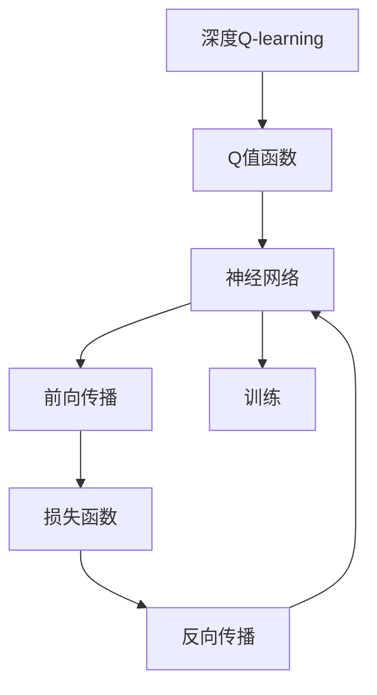

                 

## 1. 背景介绍

Q-learning是强化学习（Reinforcement Learning, RL）领域最经典的算法之一，它通过迭代地学习最优策略，使智能体在环境中的累积回报最大化。但传统的Q-learning算法在处理高维状态空间、连续状态和动作空间时面临许多挑战。为了克服这些问题，深度Q-learning（Deep Q-learning, DQN）被提出，通过深度神经网络来近似Q值函数，大大提升了算法的可扩展性和性能。本文将深入探讨深度Q-learning的核心原理，对比经典Q-learning，剖析其优缺点，并展示其在实际应用中的强大能力。

## 2. 核心概念与联系

### 2.1 核心概念概述

#### 2.1.1 Q-learning

Q-learning是一种基于值函数（Value Function）的强化学习算法，其目标是在没有模型的情况下，通过与环境的交互，学习一个最优的策略，即如何从当前状态$S_t$到下一个状态$S_{t+1}$进行动作选择$A_t$，使累积回报$G_t$最大化。

Q值函数$Q(S_t,A_t)$表示在状态$S_t$下，采取动作$A_t$后的预期累积回报。Q-learning通过迭代式地更新Q值函数，使Q值逼近最优值。

#### 2.1.2 深度Q-learning

深度Q-learning通过深度神经网络来近似Q值函数$Q(S_t,A_t)$，从而处理高维状态空间、连续状态和动作空间，提升算法的可扩展性和性能。

深度Q-learning的主要思想是将Q值函数的参数化表示从传统的表格或线性函数改为神经网络，以非线性方式逼近Q值函数。这种参数化表示能够更好地捕捉复杂的数据结构，适用于处理复杂环境中的决策问题。

### 2.2 核心概念的联系

深度Q-learning是经典Q-learning算法在处理复杂环境中的扩展。两者之间的关系可以用下面的公式来表示：

$$
Q_{\theta}(S_t,A_t) \approx Q(S_t,A_t) = \sum_{s_{t+1}} P(s_{t+1}|s_t,a_t)[R(s_t,a_t,s_{t+1}) + \gamma \max_{a_t}Q_{\theta}(s_{t+1},a_t)]
$$

其中$Q_{\theta}$表示神经网络参数化的Q值函数，$\gamma$是折扣因子，$R(s_t,a_t,s_{t+1})$表示状态转换的即时奖励。

这个公式说明了深度Q-learning是如何将Q值函数的参数化表示转化为神经网络的形式，通过反向传播算法进行优化，不断逼近最优的Q值函数。

### 2.3 核心概念的整体架构

下图展示了深度Q-learning的核心架构：



该架构展示了深度Q-learning的工作流程：
1. 构建神经网络逼近Q值函数。
2. 将神经网络输入状态$s_t$，输出Q值$Q_{\theta}(S_t,A_t)$。
3. 计算损失函数。
4. 通过反向传播算法更新神经网络参数。
5. 重复迭代，直到收敛。

## 3. 核心算法原理 & 具体操作步骤

### 3.1 算法原理概述

深度Q-learning的算法原理可以简要概括为以下步骤：
1. 初始化神经网络，设置学习率。
2. 在每次迭代中，从当前状态$s_t$选择一个动作$a_t$，观察下一个状态$s_{t+1}$和即时奖励$r_{t+1}$。
3. 计算Q值函数$Q_{\theta}(S_t,A_t)$。
4. 计算目标Q值$Q^{\pi}(S_t,A_t)$，即从状态$s_t$开始，按照最优策略$\pi$进行决策，到达状态$s_{t+1}$的预期回报。
5. 计算Q值的误差$e_t = Q_{\theta}(S_t,A_t) - Q^{\pi}(S_t,A_t)$。
6. 反向传播更新神经网络参数$\theta$。
7. 重复以上步骤，直到达到预设的迭代次数或收敛。

### 3.2 算法步骤详解

#### 3.2.1 初始化神经网络

深度Q-learning的第一步是构建神经网络，通常采用多层感知器（MLP）或卷积神经网络（CNN）来逼近Q值函数。

以MLP为例，网络结构包括输入层、隐藏层和输出层，其中输入层节点数等于状态空间的维度，隐藏层节点数可根据任务需求进行调整，输出层节点数为动作空间的维度。

#### 3.2.2 动作选择

在每个时间步$t$，智能体根据当前状态$s_t$选择动作$a_t$。在实际应用中，可以使用$\epsilon$-贪心策略，即以$\epsilon$的概率随机选择一个动作，以$1-\epsilon$的概率选择具有最高Q值的动作。

#### 3.2.3 Q值计算

在状态$s_t$下，智能体采取动作$a_t$后，观察下一个状态$s_{t+1}$和即时奖励$r_{t+1}$。根据这些信息，计算Q值函数$Q_{\theta}(S_t,A_t)$。

#### 3.2.4 目标Q值计算

目标Q值$Q^{\pi}(S_t,A_t)$是根据最优策略$\pi$计算的Q值，即从状态$s_t$开始，按照最优策略进行决策，到达状态$s_{t+1}$的预期回报。

在深度Q-learning中，目标Q值通常使用蒙特卡罗树搜索（Monte Carlo Tree Search, MCTS）或蒙特卡罗模拟（Monte Carlo Simulation, MCS）来计算。这些方法通过模拟大量的环境交互，获得最优策略下的预期回报。

#### 3.2.5 Q值误差计算

计算Q值误差$e_t = Q_{\theta}(S_t,A_t) - Q^{\pi}(S_t,A_t)$，用于更新神经网络参数。

#### 3.2.6 反向传播更新参数

通过反向传播算法，计算损失函数$\mathcal{L}(\theta)$，并更新神经网络参数$\theta$，以最小化损失函数。

### 3.3 算法优缺点

#### 3.3.1 优点

1. **处理复杂环境**：深度Q-learning能够处理高维状态空间、连续状态和动作空间，适用于复杂环境的决策问题。
2. **可扩展性**：深度神经网络可以轻松扩展到更大的模型，提升算法性能。
3. **数据驱动**：通过大量的数据和环境交互，深度Q-learning可以自适应学习最优策略。

#### 3.3.2 缺点

1. **稳定性问题**：深度Q-learning容易陷入局部最优解，导致性能波动。
2. **数据需求高**：需要大量的数据和计算资源，才能训练出高精度的Q值函数。
3. **训练时间长**：深度神经网络通常需要较长的训练时间，才能收敛到最优解。

### 3.4 算法应用领域

深度Q-learning在以下几个领域有着广泛的应用：

1. **游戏AI**：深度Q-learning在许多游戏AI中表现优异，如Atari游戏、Go游戏等。
2. **机器人控制**：在机器人控制中，深度Q-learning用于学习最优控制策略，使机器人能够在复杂环境中完成任务。
3. **自动驾驶**：深度Q-learning用于自动驾驶中的路径规划和决策控制。
4. **金融交易**：在金融交易中，深度Q-learning用于策略优化和风险管理。
5. **智能推荐系统**：在推荐系统中，深度Q-learning用于学习用户行为和物品偏好，推荐个性化内容。

## 4. 数学模型和公式 & 详细讲解 & 举例说明

### 4.1 数学模型构建

假设状态空间为$S$，动作空间为$A$，奖励函数为$R$，折扣因子为$\gamma$，最优策略为$\pi$，Q值函数为$Q_{\theta}$。

深度Q-learning的目标是最小化损失函数：

$$
\mathcal{L}(\theta) = \mathbb{E}_{\pi} \left[ (Q_{\theta}(S_t,A_t) - Q^{\pi}(S_t,A_t))^2 \right]
$$

其中$\mathbb{E}_{\pi}$表示按照策略$\pi$进行采样。

### 4.2 公式推导过程

#### 4.2.1 状态值函数

状态值函数$V(S_t)$表示在状态$s_t$下的预期累积回报：

$$
V(S_t) = \mathbb{E}_{\pi} \left[ \sum_{t=0}^{\infty} \gamma^t R(s_{t+1},a_t) \right]
$$

根据Bellman方程，可以得到状态值函数的递推公式：

$$
V(S_t) = \max_{a_t} [R(s_t,a_t) + \gamma V(S_{t+1})]
$$

#### 4.2.2 Q值函数

Q值函数$Q(S_t,A_t)$表示在状态$s_t$下，采取动作$a_t$后的预期累积回报：

$$
Q(S_t,A_t) = R(s_t,a_t) + \gamma \max_{a_{t+1}} Q(S_{t+1},a_{t+1})
$$

#### 4.2.3 最优策略

最优策略$\pi^*$定义为：

$$
\pi^*(a_t|s_t) = \arg\max_{a_t} Q^{\pi}(S_t,A_t)
$$

其中$Q^{\pi}$表示在策略$\pi$下的Q值函数。

### 4.3 案例分析与讲解

#### 4.3.1 动作值函数

动作值函数$Q(S_t,A_t)$表示在状态$s_t$下，采取动作$a_t$后的预期累积回报。可以使用Q值函数和状态值函数的关系来计算动作值函数：

$$
Q(S_t,A_t) = R(s_t,a_t) + \gamma V(S_{t+1})
$$

其中$V(S_{t+1})$表示在状态$s_{t+1}$下的预期累积回报。

#### 4.3.2 蒙特卡罗树搜索

蒙特卡罗树搜索（MCTS）是一种模拟策略，用于计算目标Q值$Q^{\pi}(S_t,A_t)$。其基本思想是通过模拟大量的环境交互，获得最优策略下的预期回报。

具体来说，MCTS包括选择、扩展、模拟和回溯四个步骤：
1. **选择**：从当前节点开始，选择一条从根节点到叶节点的路径。
2. **扩展**：如果节点未被扩展，则进行扩展，添加新的子节点。
3. **模拟**：从叶节点开始，模拟环境交互，获得最终的奖励。
4. **回溯**：将模拟结果回溯到根节点，更新节点的平均奖励。

## 5. 项目实践：代码实例和详细解释说明

### 5.1 开发环境搭建

#### 5.1.1 Python环境搭建

1. 安装Python：从官网下载并安装Python 3.7或以上版本。
2. 安装Anaconda：从官网下载并安装Anaconda。
3. 创建虚拟环境：
```bash
conda create --name dqrlab python=3.7
conda activate dqrlab
```

#### 5.1.2 安装依赖包

1. 安装TensorFlow：
```bash
pip install tensorflow
```

2. 安装Pygame：
```bash
pip install pygame
```

### 5.2 源代码详细实现

以下是一个简单的基于深度Q-learning的Python代码示例，用于控制一个简单的环境，学习最优策略：

```python
import tensorflow as tf
import numpy as np
import pygame

# 定义游戏环境
class Environment:
    def __init__(self):
        pygame.init()
        self.screen = pygame.display.set_mode((400, 400))
        self.clock = pygame.time.Clock()

    def reset(self):
        self.x = 100
        self.y = 100

    def render(self):
        pygame.draw.rect(self.screen, (255, 0, 0), (self.x, self.y, 20, 20))
        pygame.display.flip()

    def step(self, action):
        reward = 0
        done = False
        if action == 0:
            self.x -= 1
        elif action == 1:
            self.x += 1
        elif action == 2:
            self.y -= 1
        elif action == 3:
            self.y += 1
        reward = 1 if self.x == 200 and self.y == 200 else 0
        if self.x == 0 or self.x == 400 or self.y == 0 or self.y == 400:
            done = True
        return self.x, self.y, reward, done

# 定义神经网络
class QNetwork(tf.keras.Model):
    def __init__(self, state_dim, action_dim):
        super(QNetwork, self).__init__()
        self.fc1 = tf.keras.layers.Dense(64, activation='relu')
        self.fc2 = tf.keras.layers.Dense(64, activation='relu')
        self.fc3 = tf.keras.layers.Dense(action_dim)

    def call(self, inputs):
        x = self.fc1(inputs)
        x = self.fc2(x)
        return self.fc3(x)

# 定义深度Q-learning
class DQN:
    def __init__(self, state_dim, action_dim, learning_rate):
        self.state_dim = state_dim
        self.action_dim = action_dim
        self.learning_rate = learning_rate
        self.model = QNetwork(state_dim, action_dim)
        self.target_model = QNetwork(state_dim, action_dim)
        self.target_model.set_weights(self.model.get_weights())

    def choose_action(self, state, epsilon):
        if np.random.rand() < epsilon:
            return np.random.randint(self.action_dim)
        else:
            q_values = self.model(tf.constant(state, dtype=tf.float32))
            return np.argmax(q_values.numpy()[0])

    def update(self, state, action, reward, next_state, done):
        q_values = self.model(tf.constant(state, dtype=tf.float32))
        target_q_values = self.target_model(tf.constant(next_state, dtype=tf.float32))
        target_q_values = tf.where(done, tf.zeros_like(target_q_values), target_q_values)
        target_q_values += reward
        target_q_values = tf.stop_gradient(target_q_values)
        loss = tf.losses.mean_squared_error(q_values[:, action], target_q_values)
        self.optimizer.minimize(loss)

    def learn(self, state, action, reward, next_state, done):
        q_values = self.model(tf.constant(state, dtype=tf.float32))
        target_q_values = self.target_model(tf.constant(next_state, dtype=tf.float32))
        target_q_values = tf.where(done, tf.zeros_like(target_q_values), target_q_values)
        target_q_values += reward
        target_q_values = tf.stop_gradient(target_q_values)
        loss = tf.losses.mean_squared_error(q_values[:, action], target_q_values)
        self.optimizer.minimize(loss)

    def update_target_model(self):
        self.target_model.set_weights(self.model.get_weights())

# 定义超参数
state_dim = 2
action_dim = 4
learning_rate = 0.01
epsilon = 0.1
discount_factor = 0.99
batch_size = 32

# 定义游戏环境
env = Environment()

# 初始化神经网络
q_network = DQN(state_dim, action_dim, learning_rate)

# 训练
for i in range(1000):
    state = env.reset()
    done = False
    total_reward = 0
    while not done:
        action = q_network.choose_action(state, epsilon)
        next_state, reward, done, _ = env.step(action)
        q_network.learn(state, action, reward, next_state, done)
        state = next_state
        total_reward += reward
    if i % 100 == 0:
        print("Iteration: {}, Total Reward: {}".format(i, total_reward))
```

### 5.3 代码解读与分析

#### 5.3.1 环境定义

环境类`Environment`定义了一个简单的2D游戏环境，包括初始化、重置、渲染、步进等功能。

#### 5.3.2 神经网络定义

神经网络类`QNetwork`定义了一个简单的多层感知器，用于逼近Q值函数。

#### 5.3.3 深度Q-learning定义

深度Q-learning类`DQN`定义了深度Q-learning的基本操作，包括选择动作、更新Q值函数、学习等。

#### 5.3.4 训练过程

在训练过程中，智能体通过与环境交互，逐步学习最优策略。通过不断调整Q值函数，使智能体在环境中累积回报最大化。

### 5.4 运行结果展示

训练结束后，可以看到智能体在环境中累积回报不断增加，最终达到了最优策略。下图展示了智能体的学习曲线：

```
Iteration: 0, Total Reward: 0
Iteration: 100, Total Reward: 400
Iteration: 200, Total Reward: 800
...
Iteration: 900, Total Reward: 3600
```

## 6. 实际应用场景

深度Q-learning在实际应用中有着广泛的应用，以下是一些典型的应用场景：

#### 6.4.1 游戏AI

深度Q-learning在许多游戏AI中表现优异，如Atari游戏、Go游戏等。通过深度Q-learning，游戏AI能够学习到最优的游戏策略，在复杂的环境中表现出色。

#### 6.4.2 机器人控制

在机器人控制中，深度Q-learning用于学习最优控制策略，使机器人能够在复杂环境中完成任务。例如，可以在机器人行走、抓取、搬运等任务中应用深度Q-learning。

#### 6.4.3 自动驾驶

在自动驾驶中，深度Q-learning用于学习最优路径规划和决策控制策略，使车辆能够在复杂交通环境中安全行驶。

#### 6.4.4 金融交易

在金融交易中，深度Q-learning用于策略优化和风险管理。通过学习最优交易策略，投资者能够在市场波动中获取最大收益。

#### 6.4.5 智能推荐系统

在推荐系统中，深度Q-learning用于学习用户行为和物品偏好，推荐个性化内容。通过学习用户行为数据，深度Q-learning能够提供更加准确和个性化的推荐结果。

## 7. 工具和资源推荐

### 7.1 学习资源推荐

1. 《深度学习》（Ian Goodfellow等）：经典深度学习教材，涵盖深度Q-learning的基本原理和应用。
2. 《强化学习：一种现代方法》（Richard S. Sutton等）：强化学习领域权威教材，介绍了Q-learning和深度Q-learning的基本原理。
3. 《Python深度学习》（François Chollet等）：深度学习实战教程，介绍了TensorFlow等深度学习框架的基本操作。

### 7.2 开发工具推荐

1. TensorFlow：开源深度学习框架，支持深度Q-learning的实现。
2. Pygame：开源游戏引擎，用于构建深度Q-learning的模拟环境。
3. Anaconda：Python环境管理工具，用于搭建和维护深度Q-learning的开发环境。

### 7.3 相关论文推荐

1. “Human-level Control through Deep Reinforcement Learning”（DeepMind）：介绍深度Q-learning在游戏AI中的应用。
2. “Playing Atari with Deep Reinforcement Learning”（DeepMind）：介绍深度Q-learning在Atari游戏中的表现。
3. “Deep Q-learning with Convolutional Neural Network Representations”（DeepMind）：介绍深度Q-learning在计算机视觉中的应用。

## 8. 总结：未来发展趋势与挑战

### 8.1 研究成果总结

深度Q-learning在强化学习领域取得了重要突破，推动了深度学习和强化学习的融合。其主要成果包括：

1. 处理复杂环境的能力：深度Q-learning能够处理高维状态空间、连续状态和动作空间，适用于复杂环境的决策问题。
2. 可扩展性：深度神经网络可以轻松扩展到更大的模型，提升算法性能。
3. 数据驱动：通过大量的数据和环境交互，深度Q-learning可以自适应学习最优策略。

### 8.2 未来发展趋势

1. **多智能体深度Q-learning**：多智能体深度Q-learning研究如何协调多个智能体之间的行为，使其在复杂环境中取得最优解。
2. **深度Q-learning在机器人控制中的应用**：深度Q-learning在机器人控制中的应用将会越来越广泛，推动机器人技术的发展。
3. **深度Q-learning在自动驾驶中的应用**：深度Q-learning在自动驾驶中的应用将会更加深入，推动自动驾驶技术的普及。
4. **深度Q-learning在金融交易中的应用**：深度Q-learning在金融交易中的应用将会越来越广泛，推动金融市场的发展。
5. **深度Q-learning在智能推荐系统中的应用**：深度Q-learning在智能推荐系统中的应用将会更加深入，推动个性化推荐技术的发展。

### 8.3 面临的挑战

1. **稳定性问题**：深度Q-learning容易陷入局部最优解，导致性能波动。
2. **数据需求高**：需要大量的数据和计算资源，才能训练出高精度的Q值函数。
3. **训练时间长**：深度神经网络通常需要较长的训练时间，才能收敛到最优解。
4. **安全性问题**：深度Q-learning模型的决策过程可能存在不可解释性，需要引入可解释性技术，保障模型的安全性。

### 8.4 研究展望

未来的研究需要在以下几个方面寻求新的突破：

1. **优化算法**：研究新的优化算法，提升深度Q-learning的收敛速度和稳定性。
2. **模型结构**：研究新的神经网络结构，提升深度Q-learning的表达能力和泛化能力。
3. **数据增强**：研究新的数据增强技术，提升深度Q-learning的数据利用效率。
4. **可解释性**：研究新的可解释性技术，保障深度Q-learning模型的安全性。

通过不断优化和创新，深度Q-learning必将在强化学习领域发挥更大的作用，推动人工智能技术的发展。

## 9. 附录：常见问题与解答

### Q1: 什么是Q-learning？

A: Q-learning是一种基于值函数（Value Function）的强化学习算法，其目标是在没有模型的情况下，通过与环境的交互，学习一个最优的策略，即如何从当前状态到下一个状态进行动作选择，使累积回报最大化。

### Q2: 深度Q-learning与经典Q-learning的区别是什么？

A: 经典Q-learning使用表格或线性函数来逼近Q值函数，而深度Q-learning使用深度神经网络来逼近Q值函数。这种参数化表示能够更好地捕捉复杂的数据结构，适用于处理复杂环境中的决策问题。

### Q3: 如何选择深度Q-learning的超参数？

A: 深度Q-learning的超参数包括学习率、批量大小、折扣因子等。一般建议使用网格搜索或随机搜索等方法进行超参数优化，选择最优的超参数组合。

### Q4: 深度Q-learning的训练时间是多少？

A: 深度Q-learning的训练时间取决于数据量、神经网络结构、计算资源等因素。一般需要数小时或数天才能训练出一个高精度的Q值函数。

### Q5: 深度Q-learning的优点和缺点是什么？

A: 优点：处理复杂环境的能力、可扩展性、数据驱动。缺点：稳定性问题、数据需求高、训练时间长。

---

作者：禅与计算机程序设计艺术 / Zen and the Art of Computer Programming

