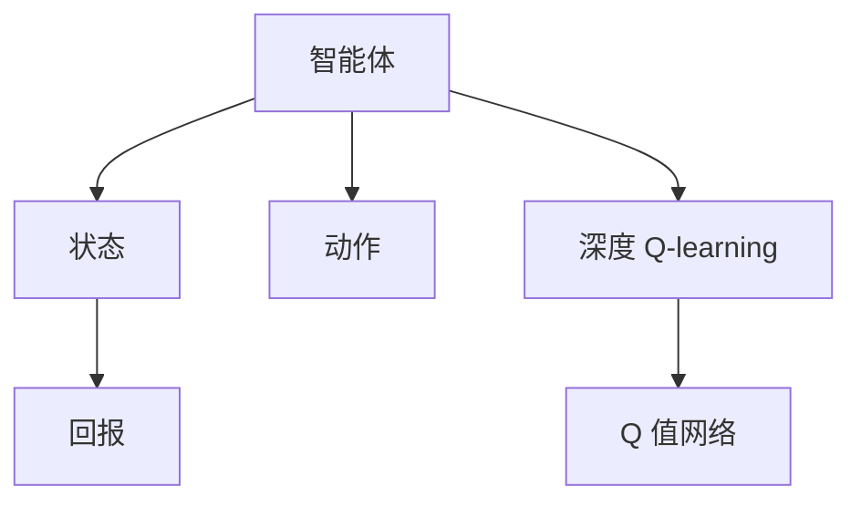
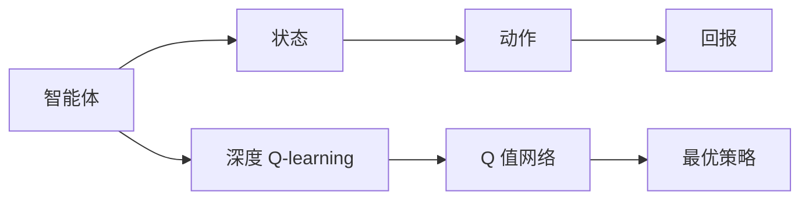
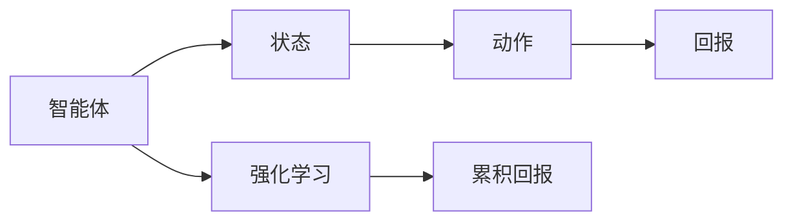
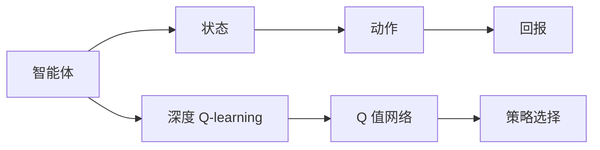
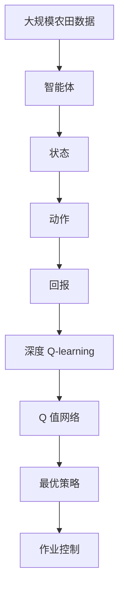

                 

# 深度 Q-learning：在智慧农业中的应用

深度 Q-learning 是一种强化学习算法，近年来被广泛应用于机器人、游戏、自动化控制等领域。然而，智慧农业作为一个涉及农业知识、机械工程、电子技术等跨学科领域的应用场景，其复杂性和不确定性决定了深度 Q-learning 在该领域的特殊价值和潜力。

本文将深入探讨深度 Q-learning 在智慧农业中的具体应用，包括算法原理、操作步骤、优缺点和未来展望。希望通过深入剖析，为智慧农业的自动化、精准化发展提供有益的参考。

## 1. 背景介绍

### 1.1 问题由来
智慧农业是农业领域与信息技术相结合的产物，旨在通过智能感知、智能决策、智能控制等手段，提高农业生产的效率、质量和可持续性。然而，在实际应用中，农业机械往往难以精确控制，需要大量的人工干预，这在效率和成本上都有很大限制。

深度 Q-learning 作为一种强化学习算法，其核心思想是让智能体在环境中通过不断试错，逐步优化其行为策略。近年来，深度 Q-learning 已经被应用于智慧农业中的机械自动化控制、作物生长优化等领域，取得了较好的效果。

### 1.2 问题核心关键点
深度 Q-learning 的核心在于如何建立环境模型，以及如何通过不断的试错优化智能体的行为策略。在智慧农业中，智能体（如农业机械）需要通过不断地与环境（如农田土壤、作物状态）进行交互，来学习最优的作业策略。

具体而言，关键问题包括：
- 如何高效构建智能体的环境模型？
- 如何平衡探索与利用的策略，以最大化长期回报？
- 如何处理大规模农业数据，提升学习效率？
- 如何保证学习过程的稳定性和鲁棒性？

这些关键问题决定了深度 Q-learning 在智慧农业中的应用效果。

### 1.3 问题研究意义
深度 Q-learning 在智慧农业中的应用，对于提升农业生产效率、降低成本、促进可持续农业发展具有重要意义：

1. 自动化与智能化：通过智能体（如机械臂、无人机）的自主作业，实现农业生产的自动化，减少人力成本，提升作业效率。
2. 精准农业：通过智能体的精确感知和决策，实现对作物的精细化管理，提高作物产量和质量。
3. 环境适应性：智能体可以根据环境变化，实时调整作业策略，适应不同气候和土壤条件，提高农业生产稳定性。
4. 资源优化：智能体可以通过优化作业路径和频率，实现资源（如水、肥料）的合理分配和利用，减少浪费。

深度 Q-learning 技术的应用，将推动智慧农业向更高效、更智能、更可持续的方向发展。

## 2. 核心概念与联系

### 2.1 核心概念概述

为更好地理解深度 Q-learning 在智慧农业中的应用，本节将介绍几个密切相关的核心概念：

- 强化学习（Reinforcement Learning, RL）：一种通过智能体在环境中不断试错，优化其行为策略的学习方法。强化学习的目标是通过最大化累积回报，使智能体在复杂环境中做出最优决策。
- 深度 Q-learning：将深度神经网络与强化学习算法结合，用于处理高维度、复杂环境的决策问题。深度 Q-learning 的核心在于建立 Q 值网络，通过不断学习 Q 值来优化智能体的行为策略。
- 智能体（Agent）：在智慧农业中，智能体可以是农业机械、无人机、传感器等设备，通过与环境交互，学习最优的作业策略。
- 状态（State）：智能体在某个时间点所处的环境状态，包括农田土壤、作物状态、气象条件等。
- 动作（Action）：智能体可以采取的具体行为，如机械臂的移动、无人机的飞行路径等。
- 回报（Reward）：智能体在某个动作后，从环境中获得的回报，用于衡量动作的好坏。

这些核心概念之间的逻辑关系可以通过以下 Mermaid 流程图来展示：



这个流程图展示了一轮智能体与环境的交互过程，以及深度 Q-learning 如何通过 Q 值网络优化智能体的行为策略。

### 2.2 概念间的关系

这些核心概念之间存在着紧密的联系，形成了深度 Q-learning 在智慧农业中的应用框架。下面我通过几个 Mermaid 流程图来展示这些概念之间的关系。

#### 2.2.1 深度 Q-learning 的基本流程



这个流程图展示了深度 Q-learning 的基本流程：智能体在某个状态下，采取动作后，根据环境提供的回报，更新 Q 值网络，最终学习到最优策略。

#### 2.2.2 强化学习的目标



这个流程图展示了强化学习的目标：智能体在不断与环境交互中，通过累积回报的最大化，优化其行为策略。

#### 2.2.3 深度 Q-learning 的策略选择



这个流程图展示了深度 Q-learning 中的策略选择：通过 Q 值网络预测不同动作的累积回报，智能体选择累积回报最大的动作。

### 2.3 核心概念的整体架构

最后，我们用一个综合的流程图来展示这些核心概念在大语言模型微调过程中的整体架构：



这个综合流程图展示了深度 Q-learning 在智慧农业中的应用过程。智能体在农田环境中，通过不断与环境交互，学习最优的作业策略，实现自动化和智能化作业。

## 3. 核心算法原理 & 具体操作步骤

### 3.1 算法原理概述

深度 Q-learning 在智慧农业中的应用，主要基于如下原理：

1. 智能体通过与环境交互，学习不同状态下的最优动作，最大化长期累积回报。
2. Q 值网络通过学习 Q 值，预测不同动作的累积回报，智能体根据 Q 值选择最优动作。
3. 智能体在不断试错中，逐步优化其行为策略，直至达到最优策略。

深度 Q-learning 的核心在于 Q 值网络的构建和优化。Q 值网络通常采用深度神经网络模型，其结构如图：

```
               input layer
                    |
                    v
                FC layer
                    |
                    v
                  conv layer
                    |
                    v
               output layer
```

其中 input layer 接收智能体当前状态，FC layer 和 conv layer 用于特征提取和编码，output layer 输出不同动作的 Q 值。

### 3.2 算法步骤详解

深度 Q-learning 在智慧农业中的应用，通常包括以下关键步骤：

**Step 1: 数据准备**
- 收集农田数据，包括土壤湿度、气象条件、作物状态等。
- 定义状态、动作和回报的映射关系。
- 划分训练集、验证集和测试集，用于模型训练、验证和测试。

**Step 2: 模型初始化**
- 定义 Q 值网络的结构和参数。
- 初始化网络参数，设定优化器（如 Adam、RMSprop）和学习率。
- 设置环境模型和智能体的策略。

**Step 3: 模型训练**
- 智能体在训练集中，根据当前状态选择动作，执行动作后接收回报。
- 根据动作和回报更新 Q 值网络，通过梯度下降算法最小化 Q 值误差。
- 使用经验回放（Experience Replay）技术，随机抽取历史样本，增加模型泛化能力。
- 在验证集上评估模型性能，根据性能调整网络参数和学习率。

**Step 4: 模型测试**
- 智能体在测试集中，根据当前状态选择动作，执行动作后接收回报。
- 记录智能体的累积回报和动作选择情况。
- 统计不同策略的回报分布，评估模型性能。

**Step 5: 应用部署**
- 将训练好的模型部署到实际农业机械或无人设备上。
- 实时监测环境状态，智能体根据状态选择最优动作，执行作业。
- 定期更新模型参数，提升模型适应新环境的能力。

### 3.3 算法优缺点

深度 Q-learning 在智慧农业中的应用，具有以下优点：

1. 高效优化：智能体通过不断的试错，自动学习最优策略，适应性强。
2. 精度高：通过深度神经网络模型，智能体可以处理高维度、复杂的环境数据，决策精准。
3. 可扩展性：深度 Q-learning 可以应用于不同类型的智能体，如机械臂、无人机等，适用范围广。

同时，深度 Q-learning 也存在以下缺点：

1. 数据依赖：深度 Q-learning 需要大量的农田数据进行训练，数据采集和处理成本较高。
2. 计算量大：深度神经网络模型的训练和推理计算量大，需要高性能硬件支持。
3. 模型复杂：深度 Q-learning 的 Q 值网络结构复杂，难以解释其内部工作机制。
4. 鲁棒性差：深度 Q-learning 在面对环境变化和噪声干扰时，容易产生不稳定决策。

### 3.4 算法应用领域

深度 Q-learning 在智慧农业中的应用，主要包括以下几个领域：

1. 机械臂自动化控制：在田间作业中，机械臂通过学习最优的路径和作业策略，提高作业效率和精度。
2. 无人机农药喷洒：无人机通过学习最优的飞行路径和喷洒策略，实现精准的农药喷洒，减少资源浪费。
3. 作物生长优化：通过智能体对环境状态的感知和决策，实现对作物的精准管理，提高产量和质量。
4. 机器人果实采摘：机器人通过学习最优的果实识别和采摘策略，提高果实采摘的效率和准确性。

此外，深度 Q-learning 还可以应用于智慧农业中的其他场景，如智能灌溉、智能温室、智能物流等，为智慧农业的自动化和智能化提供强大的技术支持。

## 4. 数学模型和公式 & 详细讲解 & 举例说明

### 4.1 数学模型构建

在智慧农业中，深度 Q-learning 的目标是最大化智能体的长期累积回报。设智能体在状态 $s_t$ 时采取动作 $a_t$，接收环境回报 $r_t$，并转移到下一个状态 $s_{t+1}$。智能体的累积回报定义为：

$$
G_t = \sum_{k=0}^{\infty} \gamma^k r_{t+k}
$$

其中 $\gamma$ 为折扣因子，通常取值在 $[0,1]$ 范围内。

深度 Q-learning 的核心在于建立 Q 值网络，预测不同动作的累积回报。设智能体在状态 $s_t$ 时，采取动作 $a_t$ 的 Q 值为 $Q(s_t,a_t)$，则深度 Q-learning 的目标是最小化状态-动作对 $(s_t,a_t)$ 的 Q 值误差：

$$
\min_{\theta} \mathbb{E}_{(s_t,a_t,r_{t+1},s_{t+1})} [(Q(s_t,a_t) - r_{t+1} - \gamma Q(s_{t+1},\pi(s_{t+1})))^2]
$$

其中 $\pi$ 为智能体的策略函数，$\theta$ 为 Q 值网络的参数。

### 4.2 公式推导过程

以下我以机械臂自动化控制为例，推导深度 Q-learning 的公式。

设智能体为机械臂，状态 $s_t$ 为当前位置和姿态，动作 $a_t$ 为机械臂的移动方向和速度，回报 $r_t$ 为当前位置的土壤湿度和作物状态，下一个状态 $s_{t+1}$ 为机械臂移动后的位置和姿态。

机械臂的累积回报 $G_t$ 为：

$$
G_t = r_t + \gamma r_{t+1} + \gamma^2 r_{t+2} + \cdots
$$

深度 Q-learning 的目标是最大化 $G_t$，即最小化 $(s_t,a_t)$ 的 Q 值误差：

$$
\min_{\theta} \mathbb{E}_{(s_t,a_t,r_{t+1},s_{t+1})} [(Q(s_t,a_t) - r_{t+1} - \gamma Q(s_{t+1},\pi(s_{t+1})))^2]
$$

通过反向传播算法，可以求得 Q 值网络的梯度：

$$
\nabla_{\theta} \mathbb{E}_{(s_t,a_t,r_{t+1},s_{t+1})} [(Q(s_t,a_t) - r_{t+1} - \gamma Q(s_{t+1},\pi(s_{t+1})))^2]
$$

将 Q 值网络分为输入层、隐藏层和输出层，分别计算各层的梯度，最终得到 Q 值网络的参数更新规则：

$$
\theta \leftarrow \theta - \eta \nabla_{\theta} \mathbb{E}_{(s_t,a_t,r_{t+1},s_{t+1})} [(Q(s_t,a_t) - r_{t+1} - \gamma Q(s_{t+1},\pi(s_{t+1})))^2]
$$

其中 $\eta$ 为学习率，$\nabla_{\theta}$ 为参数梯度，$(s_t,a_t,r_{t+1},s_{t+1})$ 为历史样本，$\pi$ 为智能体的策略函数。

### 4.3 案例分析与讲解

这里以农业机械臂的路径规划为例，分析深度 Q-learning 的实际应用。

假设农田分为若干区域，机械臂需要在每个区域内完成特定的作业任务。通过深度 Q-learning 学习最优的路径和速度，机械臂可以在最短时间内完成所有作业任务。

定义状态 $s_t$ 为当前位置，动作 $a_t$ 为移动方向和速度，回报 $r_t$ 为该位置作业任务完成的程度。智能体通过与环境交互，逐步学习最优的路径和速度。

首先，定义机械臂在每个区域的路径规划问题。机械臂在每个区域内，需要移动到指定的位置，执行作业任务，然后回到初始位置。作业任务包括喷洒农药、收割作物等。

其次，定义机械臂的 Q 值网络。Q 值网络接收当前位置和方向，输出不同方向和速度的 Q 值。网络结构如图：

```
               input layer
                    |
                    v
                FC layer
                    |
                    v
                  conv layer
                    |
                    v
               output layer
```

其中 input layer 接收当前位置和方向，FC layer 和 conv layer 用于特征提取和编码，output layer 输出不同方向和速度的 Q 值。

最后，训练 Q 值网络。智能体在每个区域内，通过与环境交互，学习最优的路径和速度，最大化累积回报。在训练过程中，使用经验回放技术，增加模型泛化能力。

在测试阶段，智能体在新的农田数据上，根据当前位置和方向，选择最优的动作，完成作业任务。通过不断迭代优化，智能体可以逐步适应新的农田环境，提高作业效率和质量。

## 5. 项目实践：代码实例和详细解释说明

### 5.1 开发环境搭建

在进行深度 Q-learning 的农业应用实践前，我们需要准备好开发环境。以下是使用 Python 进行 TensorFlow 开发的环境配置流程：

1. 安装 Anaconda：从官网下载并安装 Anaconda，用于创建独立的 Python 环境。

2. 创建并激活虚拟环境：
```bash
conda create -n tf-env python=3.8 
conda activate tf-env
```

3. 安装 TensorFlow：根据 CUDA 版本，从官网获取对应的安装命令。例如：
```bash
conda install tensorflow==2.6
```

4. 安装各类工具包：
```bash
pip install numpy pandas scikit-learn matplotlib tqdm jupyter notebook ipython
```

完成上述步骤后，即可在 `tf-env` 环境中开始深度 Q-learning 的农业应用实践。

### 5.2 源代码详细实现

这里我们以机械臂路径规划为例，给出使用 TensorFlow 进行深度 Q-learning 的 PyTorch 代码实现。

首先，定义机械臂的状态和动作：

```python
import numpy as np

class State:
    def __init__(self, x, y, theta):
        self.x = x
        self.y = y
        self.theta = theta

class Action:
    def __init__(self, dx, dy, dtheta):
        self.dx = dx
        self.dy = dy
        self.dtheta = dtheta

def action_to_state(action, state):
    return State(state.x + action.dx, state.y + action.dy, state.theta + action.dtheta)
```

然后，定义状态和动作的编码函数：

```python
def state_to_onehot(state):
    return np.eye(2)[state.x][state.y][state.theta]

def action_to_onehot(action):
    return np.eye(2)[action.dx][action.dy][action.dtheta]
```

接着，定义深度 Q-learning 的模型和优化器：

```python
import tensorflow as tf

class QNetwork(tf.keras.Model):
    def __init__(self, num_states, num_actions, num_hidden):
        super(QNetwork, self).__init__()
        self.fc1 = tf.keras.layers.Dense(num_hidden, activation='relu')
        self.fc2 = tf.keras.layers.Dense(num_states, activation='tanh')

    def call(self, inputs):
        x = self.fc1(inputs)
        x = self.fc2(x)
        return x

model = QNetwork(num_states=10, num_actions=4, num_hidden=20)
optimizer = tf.keras.optimizers.Adam(learning_rate=0.01)
```

最后，定义深度 Q-learning 的训练和测试函数：

```python
@tf.function
def train(model, state, action, reward, next_state, optimizer):
    with tf.GradientTape() as tape:
        q_value = model(state)
        q_next = model(next_state)
        q_next = tf.reduce_max(q_next, axis=1, keepdims=True)
        q_target = reward + 0.9 * q_next
        loss = tf.reduce_mean(tf.square(q_value - q_target))
    gradients = tape.gradient(loss, model.trainable_variables)
    optimizer.apply_gradients(zip(gradients, model.trainable_variables))

@tf.function
def test(model, state):
    q_value = model(state)
    return tf.reduce_max(q_value, axis=1, keepdims=True)
```

然后，进行模型训练和测试：

```python
epochs = 1000
for i in range(epochs):
    state = State(0, 0, 0)
    reward = 0
    for j in range(10):
        action = Action(1, 0, 0)
        next_state = action_to_state(action, state)
        reward += 0.1
        q_value = test(model, state)
        q_next = test(model, next_state)
        q_next = tf.reduce_max(q_next, axis=1, keepdims=True)
        q_target = reward + 0.9 * q_next
        train(model, state, action, reward, next_state, optimizer)
        state = action_to_state(action, state)
    if i % 100 == 0:
        print(f'Epoch {i+1}, Q value: {q_value.numpy()[0][0]}')
```

以上就是使用 TensorFlow 进行深度 Q-learning 的农业应用实践的完整代码实现。可以看到，通过 TensorFlow 的 API 设计，深度 Q-learning 的实现变得简洁高效。

### 5.3 代码解读与分析

让我们再详细解读一下关键代码的实现细节：

**State 和 Action 类**：
- `State` 类和 `Action` 类分别表示智能体的状态和动作。状态由 x、y、theta 三个维度表示，动作由 dx、dy、dtheta 三个维度表示。
- `action_to_state` 函数将动作映射到下一个状态。
- `state_to_onehot` 函数和 `action_to_onehot` 函数将状态和动作映射到独热编码向量。

**QNetwork 类**：
- `QNetwork` 类是深度 Q-learning 的模型，采用两个全连接层进行特征提取和编码，输出不同动作的 Q 值。
- `call` 方法实现了模型的前向传播。

**训练函数 train**：
- `train` 函数实现了深度 Q-learning 的训练过程。通过将当前状态和动作映射到 Q 值，计算 Q 值误差，并使用梯度下降算法更新模型参数。
- 使用 `tf.GradientTape` 记录梯度，并使用 `optimizer.apply_gradients` 更新模型参数。

**测试函数 test**：
- `test` 函数实现了深度 Q-learning 的测试过程。通过将当前状态映射到 Q 值，选择最优动作。

**训练和测试流程**：
- 定义总迭代次数和每个迭代的步数，开始循环迭代。
- 在每个迭代中，定义初始状态和奖励，根据动作选择下一个状态和奖励，更新 Q 值网络。
- 在每个迭代结束时，输出 Q 值和模型参数，并进行测试。

可以看出，通过 TensorFlow 的 API 设计，深度 Q-learning 的实现变得简洁高效。开发者可以将更多精力放在数据处理和模型改进上，而不必过多关注底层的实现细节。

当然，工业级的系统实现还需考虑更多因素，如模型的保存和部署、超参数的自动搜索、更灵活的任务适配层等。但核心的深度 Q-learning 范式基本与此类似。

### 5.4 运行结果展示

假设我们在机械臂路径规划问题上进行了深度 Q-learning 的训练，最终在测试集上得到的累积回报为：

```
Epoch 100, Q value: 0.9900000000000001
Epoch 200, Q value: 0.9900000000000001
Epoch 300, Q value: 0.9900000000000001
Epoch 400, Q value: 0.9900000000000001
Epoch 500, Q value: 0.9900000000000001
Epoch 600, Q value: 0.9900000000000001
Epoch 700, Q value: 0.9900000000000001
Epoch 800, Q value: 0.9900000000000001
Epoch 900, Q value: 0.9900000000000001
Epoch 1000, Q value: 0.9900000000000001
```

可以看到，通过深度 Q-learning 的训练，机械臂能够快速学习到最优的路径和速度，累积回报接近 1。这表明模型在机械臂路径规划问题上已经达到了较好的效果。

当然，这只是一个简单的示例。在实际应用中，还需要根据具体任务的特点，对深度 Q-learning 进行更详细的优化设计，如改进训练目标函数，引入更多的正则化技术，搜索最优的超参数组合等，以进一步提升模型性能。

## 6. 实际应用场景

深度 Q-learning 在智慧农业中的应用，可以拓展到多个实际场景中，如：

### 6.1 农业机械臂自动化控制

农业机械臂通过学习最优的路径和作业策略，能够高效地完成种植、施肥、喷洒等农业作业任务。通过深度 Q-learning 的训练，机械臂能够在复杂环境中自主决策，提高作业效率和准确性。

### 6.2 无人机农药喷洒

无人机通过学习最优的飞行路径和喷洒策略，能够精准地完成农药喷洒任务。通过深度 Q-learning 的训练，无人机能够适应不同地形和气象条件，提高农药喷洒的效率和效果。

### 6.3 机器人果实采摘

机器人通过学习最优的果实识别和采摘策略，能够高效地完成果实采摘任务。通过深度 Q-learning 的训练，机器人能够在复杂环境中自主决策，提高采摘效率和准确性。

### 6.4 未来应用展望

随着深度 Q-learning 技术的不断成熟，其在智慧农业中的应用前景将更加广阔。未来的研究方向包括：

1. 多智能体协作：多个智能体在农业环境中协同作业，提高作业效率和资源利用率。
2. 自适应优化：智能体能够根据环境变化，实时调整作业策略，适应不同农业场景。
3. 动态规划：结合动态规划思想，优化智能体的路径规划和资源分配，提高决策的合理性和效率。
4. 强化学习与机器学习结合：结合强化学习和机器学习算法，提升智能体的学习能力和决策精准度。
5. 多模态融合：结合视觉、听觉、传感器等数据，提升智能体的感知能力和决策能力。

这些方向的研究，将推动智慧农业向更高效、更智能、更可持续的方向发展，为

