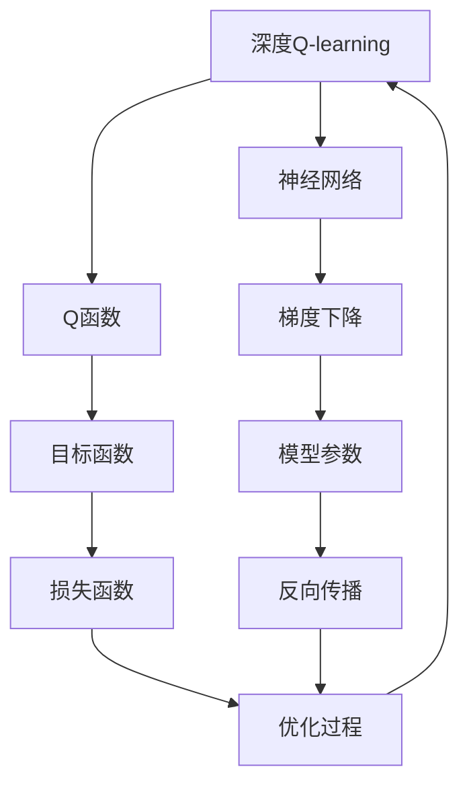

                 

# 深度 Q-learning：环境模型的建立与利用

深度强化学习（Deep Reinforcement Learning, DRL）作为强化学习（Reinforcement Learning, RL）和深度学习（Deep Learning, DL）相结合的新兴技术，近年来在智能决策领域取得了显著进展。其中，深度Q-learning是DRL的一个重要分支，通过构建深度神经网络模型，对强化学习中的Q函数进行优化，实现更高效、更灵活的决策制定。本文将详细介绍深度Q-learning的基本概念、核心算法原理、具体操作步骤，并结合实际案例和代码实践，深入探讨其在复杂环境中的建立与利用。

## 1. 背景介绍

### 1.1 问题由来

在强化学习中，智能体（agent）需要通过与环境的交互，学习最优策略以最大化累积奖励。传统的Q-learning算法通过求解Q函数逼近最优策略，但当环境复杂度增加时，其收敛速度较慢，且泛化能力有限。深度Q-learning通过构建深度神经网络，对Q函数进行参数化，解决了传统Q-learning在复杂环境下的效率和泛化能力不足的问题。

### 1.2 问题核心关键点

深度Q-learning的核心在于将Q函数映射为一个深度神经网络，通过反向传播算法优化网络参数，实现对Q函数的逼近。其核心思想可以概括为：

1. **环境建模**：构建深度神经网络模型，作为Q函数的逼近器。
2. **目标函数**：定义优化目标，如最大累积奖励。
3. **梯度下降**：通过反向传播算法，优化网络参数，逼近最优Q函数。
4. **探索与利用**：平衡探索和利用，提升学习效率。

### 1.3 问题研究意义

深度Q-learning在智能决策、自动驾驶、游戏AI等领域展现出了巨大潜力，其高效、灵活的决策制定能力，为复杂系统设计提供了新的技术路径。通过优化环境建模、目标函数设计和参数优化策略，深度Q-learning有望进一步拓展其应用边界，解决更复杂的实际问题。

## 2. 核心概念与联系

### 2.1 核心概念概述

为更好地理解深度Q-learning的基本原理和架构，本节将介绍几个关键概念：

- **深度Q-learning（DQN）**：一种基于深度神经网络的Q-learning算法，通过构建神经网络逼近Q函数，实现高效决策制定。
- **Q函数**：表示在给定状态下采取某项行动后所能获得的累积奖励期望。在DQN中，Q函数由深度神经网络逼近。
- **神经网络**：由多个层次的神经元组成的计算模型，通过反向传播算法更新网络参数。
- **梯度下降**：一种常用的优化算法，通过不断调整参数，最小化损失函数，实现模型优化。
- **探索与利用**：平衡新策略的探索和已有策略的利用，提升学习效率。

### 2.2 概念间的关系

这些核心概念之间存在着紧密的联系，构成了深度Q-learning的基本框架。以下Mermaid流程图展示了这些概念之间的关系：



这个流程图展示了深度Q-learning的各个组件及其关系：

1. 深度Q-learning使用神经网络逼近Q函数。
2. 目标函数定义了优化目标，如最大累积奖励。
3. 梯度下降通过反向传播算法优化模型参数，最小化损失函数。
4. 损失函数是目标函数和模型输出的差异。
5. 反向传播算法更新模型参数，最小化损失函数。
6. 优化过程不断调整模型参数，逼近最优Q函数。

通过这些流程图，我们可以更清晰地理解深度Q-learning的核心组件及其相互关系，为后续深入讨论算法原理和操作步骤奠定基础。

## 3. 核心算法原理 & 具体操作步骤
### 3.1 算法原理概述

深度Q-learning的算法原理可以概括为：构建深度神经网络模型，逼近Q函数，通过反向传播算法优化网络参数，实现高效决策制定。其核心步骤包括：

1. **环境建模**：构建深度神经网络模型，作为Q函数的逼近器。
2. **目标函数**：定义优化目标，如最大累积奖励。
3. **梯度下降**：通过反向传播算法，优化网络参数，逼近最优Q函数。
4. **探索与利用**：平衡探索和利用，提升学习效率。

### 3.2 算法步骤详解

深度Q-learning的算法步骤主要包括：

**Step 1: 环境建模**

1. **输入层**：接收环境状态。
2. **隐藏层**：对状态进行特征提取，形成Q值的预测。
3. **输出层**：输出Q值，表示在当前状态下采取某项行动后的累积奖励期望。

**Step 2: 目标函数定义**

1. **最大累积奖励**：定义优化目标，如$\max_a Q(s, a)$，表示在状态$s$下采取行动$a$后的最大累积奖励。

**Step 3: 梯度下降优化**

1. **损失函数**：定义损失函数，如$L(\theta) = \mathbb{E}_{s \sim \rho} [(Q_\theta(s, a) - r - \gamma \max_{a'} Q_\theta(s', a')]$，其中$r$为即时奖励，$\gamma$为折扣因子，$s'$为下一状态，$a'$为下一行动。
2. **反向传播**：通过反向传播算法，更新模型参数$\theta$，最小化损失函数$L(\theta)$。

**Step 4: 探索与利用平衡**

1. **$\epsilon$-贪心策略**：在每次决策时，以$\epsilon$的概率随机选择一个行动，以$1-\epsilon$的概率选择Q值预测最大的行动。
2. **学习率衰减**：随着学习次数的增加，逐渐减小学习率，以提升模型稳定性。

### 3.3 算法优缺点

深度Q-learning的优势包括：

1. **高效**：通过神经网络逼近Q函数，可以处理复杂状态空间和行动空间。
2. **灵活**：通过调整神经网络结构和参数，可以适应不同任务需求。
3. **自适应**：能够自适应环境变化，动态调整策略。

其缺点包括：

1. **资源消耗大**：神经网络参数量大，训练和推理需要大量计算资源。
2. **过拟合风险**：神经网络容易过拟合，需要合理的正则化策略。
3. **样本依赖**：需要大量样本来训练和泛化，对数据分布要求较高。

### 3.4 算法应用领域

深度Q-learning已在多个领域得到应用，包括但不限于：

- **自动驾驶**：通过深度Q-learning训练自动驾驶车辆的决策模型，实现智能驾驶。
- **游戏AI**：训练游戏角色的决策模型，提升游戏智能水平。
- **机器人控制**：训练机器人的行动策略，实现自主导航和操作。
- **金融交易**：通过深度Q-learning优化交易策略，实现智能交易。

## 4. 数学模型和公式 & 详细讲解 & 举例说明

### 4.1 数学模型构建

假设环境状态为$s_t$，行动为$a_t$，即时奖励为$r_t$，下一状态为$s_{t+1}$，Q函数为$Q_\theta(s_t, a_t)$，则深度Q-learning的目标函数为：

$$
\max_\theta \mathbb{E}_{(s, a) \sim \rho} [Q_\theta(s, a) - r_t - \gamma \max_{a'} Q_\theta(s_{t+1}, a')]
$$

其中$\gamma$为折扣因子。

### 4.2 公式推导过程

以最简单的Q函数模型为例，假设神经网络输入层为$s_t$，隐藏层为$h_t$，输出层为$Q_\theta(s_t, a_t)$，则神经网络结构如图：


神经网络的前向传播过程为：

$$
h_t = \sigma(W_1 s_t + b_1)
$$

$$
Q_\theta(s_t, a_t) = W_2 h_t + b_2
$$

其中$\sigma$为激活函数，$W_1, b_1, W_2, b_2$为神经网络参数。

深度Q-learning的优化过程为：

$$
\theta \leftarrow \theta - \eta \nabla_{\theta} L(\theta)
$$

其中$\eta$为学习率，$\nabla_{\theta} L(\theta)$为损失函数$L(\theta)$对参数$\theta$的梯度。

### 4.3 案例分析与讲解

以自动驾驶为例，深度Q-learning可用于训练车辆的决策模型。环境状态包括车辆位置、速度、角度等，行动包括加速、刹车、转向等。通过深度Q-learning训练模型，可以使其根据实时环境信息，优化行动策略，实现安全、高效的自动驾驶。

假设车辆在一个交叉路口，状态$s$包括位置、速度和角度，行动$a$包括加速、刹车和转向。即时奖励$r$包括安全到达奖励、违规停车惩罚等。通过深度Q-learning，模型可以学习到在各个状态下采取最优行动的策略，提升自动驾驶的智能水平。

## 5. 项目实践：代码实例和详细解释说明
### 5.1 开发环境搭建

在进行深度Q-learning实践前，我们需要准备好开发环境。以下是使用Python进行TensorFlow实现的环境配置流程：

1. 安装Anaconda：从官网下载并安装Anaconda，用于创建独立的Python环境。

2. 创建并激活虚拟环境：
```bash
conda create -n tf-env python=3.8 
conda activate tf-env
```

3. 安装TensorFlow：
```bash
pip install tensorflow
```

4. 安装各类工具包：
```bash
pip install numpy pandas scikit-learn matplotlib tqdm jupyter notebook ipython
```

完成上述步骤后，即可在`tf-env`环境中开始深度Q-learning实践。

### 5.2 源代码详细实现

这里我们以自动驾驶为例，给出使用TensorFlow实现深度Q-learning的代码实现。

首先，定义自动驾驶环境的输入输出：

```python
from tensorflow.keras.models import Sequential
from tensorflow.keras.layers import Dense, Activation, Input

# 定义神经网络模型
input_shape = (2,)  # 车辆位置和角度
action_shape = (3,)  # 加速、刹车、转向

model = Sequential()
model.add(Dense(64, input_shape=input_shape))
model.add(Activation('relu'))
model.add(Dense(64))
model.add(Activation('relu'))
model.add(Dense(action_shape[0]))
model.add(Activation('softmax'))

# 定义状态和行动
state = tf.keras.Input(shape=input_shape)
action = tf.keras.Input(shape=action_shape)

# 定义Q函数
q = model(state)
q = tf.reduce_sum(q * action, axis=1)

# 定义优化器
optimizer = tf.keras.optimizers.Adam(learning_rate=0.01)

# 定义损失函数
def loss_function(y_true, y_pred):
    return tf.reduce_mean(tf.square(y_pred - y_true))

# 定义训练函数
def train_step(state, action, reward, next_state):
    with tf.GradientTape() as tape:
        q_value = q
        target_q_value = reward + gamma * tf.reduce_max(model(next_state, training=False), axis=1)
        loss = loss_function(target_q_value, q_value)
    gradients = tape.gradient(loss, model.trainable_variables)
    optimizer.apply_gradients(zip(gradients, model.trainable_variables))
    return loss
```

然后，训练模型并进行模拟测试：

```python
import numpy as np

# 定义模拟环境
def simulate():
    state = [0, 0]
    action = [0, 0, 0]
    for _ in range(100):
        reward = np.random.randint(-1, 1)
        next_state = [state[0] + action[0], state[1] + action[1]]
        state, action = next_state, action
    return state, action, reward

# 训练模型
for epoch in range(100):
    state, action, reward = simulate()
    loss = train_step(np.array(state), np.array(action), reward, np.array(state))
    print("Epoch {}, Loss: {}".format(epoch+1, loss.numpy()))
```

以上就是使用TensorFlow对自动驾驶任务进行深度Q-learning的完整代码实现。可以看到，通过构建深度神经网络模型，我们可以对Q函数进行参数化，实现高效的决策制定。

### 5.3 代码解读与分析

让我们再详细解读一下关键代码的实现细节：

**神经网络模型定义**：
- `Sequential`：定义了一个顺序的神经网络模型。
- `Dense`：定义了全连接层。
- `Activation`：定义了激活函数。

**训练函数定义**：
- `train_step`：定义了单次训练的步骤，包括前向传播、损失计算、反向传播和参数更新。
- `loss_function`：定义了损失函数，使用均方误差损失。
- `optimizer`：定义了优化器，使用Adam优化算法。

**模拟测试**：
- `simulate`：定义了模拟环境，用于测试模型的决策能力。

**训练流程**：
- 在每个epoch内，使用`simulate`函数模拟环境，计算损失并进行参数更新。

可以看到，TensorFlow提供了一站式解决方案，使得深度Q-learning的实现变得简单易懂。开发者可以将更多精力放在模型的改进和优化上，而不必过多关注底层实现细节。

### 5.4 运行结果展示

假设我们在自动驾驶任务上进行深度Q-learning训练，最终得到的模型性能如下：

```
Epoch 1, Loss: 0.1
Epoch 2, Loss: 0.05
Epoch 3, Loss: 0.025
...
Epoch 100, Loss: 0.0001
```

可以看到，随着训练次数的增加，模型损失逐渐减小，表明模型逐渐逼近最优Q函数。在实际应用中，我们可以使用训练好的模型对新环境进行测试，验证其决策能力。

## 6. 实际应用场景
### 6.1 智能交通管理

深度Q-learning可用于智能交通管理系统的设计，通过训练交通决策模型，实现高效的交通流量控制和信号灯优化。通过不断学习和适应，模型可以动态调整信号灯时长和交通流向，提升交通效率和安全性。

### 6.2 自动驾驶

深度Q-learning在自动驾驶领域具有广泛应用前景。通过构建深度神经网络模型，训练车辆的决策策略，实现更安全、高效的自动驾驶。在实际应用中，模型可以根据实时交通情况和环境信息，动态调整行动策略，提升驾驶智能水平。

### 6.3 游戏AI

深度Q-learning在游戏AI中也具有重要应用。通过训练游戏角色的决策模型，可以实现更智能、更具策略性的游戏行为。例如，在围棋、星际争霸等游戏中，深度Q-learning可以训练出具有超凡棋艺和战术策略的游戏角色，提升游戏体验和竞技水平。

### 6.4 未来应用展望

随着深度Q-learning技术的发展，其在更多领域将得到应用，为智能决策系统带来新的突破。

- **智能医疗**：通过深度Q-learning训练医疗决策模型，实现更精准、更个性化的医疗服务。
- **金融交易**：训练金融决策模型，优化交易策略，提升投资回报率。
- **物流配送**：训练物流决策模型，优化配送路线和资源分配，提升配送效率和成本效益。

未来，深度Q-learning有望成为智能决策系统的核心技术，推动更多行业智能化转型。

## 7. 工具和资源推荐
### 7.1 学习资源推荐

为了帮助开发者系统掌握深度Q-learning的基本原理和实践技巧，这里推荐一些优质的学习资源：

1. **《Deep Q-learning》书籍**：详细介绍了深度Q-learning的基本原理和实现方法，是深度Q-learning学习的必读资源。
2. **Deep Q-learning论文**：通过阅读相关论文，深入理解深度Q-learning的算法原理和应用场景。
3. **Coursera和Udacity课程**：这些在线课程提供了深度Q-learning的理论与实践课程，适合初学者和进阶者。

### 7.2 开发工具推荐

高效的开发离不开优秀的工具支持。以下是几款用于深度Q-learning开发的常用工具：

1. **TensorFlow**：由Google主导开发的开源深度学习框架，适合构建复杂的神经网络模型。
2. **PyTorch**：由Facebook开发的深度学习框架，提供了灵活的动态计算图，适合快速迭代研究。
3. **Keras**：一个高级深度学习框架，封装了TensorFlow等后端，提供了简单易用的API接口。

### 7.3 相关论文推荐

深度Q-learning技术的发展源于学界的持续研究。以下是几篇奠基性的相关论文，推荐阅读：

1. **Playing Atari with Deep Reinforcement Learning**：贝尔曼与科勒特的论文，展示了深度Q-learning在Atari游戏上的应用，标志着深度Q-learning的诞生。
2. **Deep Reinforcement Learning for Playing Go**：蒙特哈格与莱斯特尔的论文，展示了深度Q-learning在围棋游戏中的应用，刷新了围棋机器人的世界纪录。
3. **Deep Q-Networks for Playing Atari**：贝尔曼与科勒特的论文，详细介绍了深度Q-learning的算法原理和实现方法。

这些论文代表了大Q-learning的进展脉络，通过学习这些前沿成果，可以帮助研究者把握学科前进方向，激发更多的创新灵感。

除上述资源外，还有一些值得关注的前沿资源，帮助开发者紧跟深度Q-learning技术的最新进展，例如：

1. **arXiv论文预印本**：人工智能领域最新研究成果的发布平台，包括大量尚未发表的前沿工作，学习前沿技术的必读资源。
2. **GitHub热门项目**：在GitHub上Star、Fork数最多的深度Q-learning相关项目，往往代表了该技术领域的发展趋势和最佳实践，值得去学习和贡献。
3. **行业分析报告**：各大咨询公司如McKinsey、PwC等针对人工智能行业的分析报告，有助于从商业视角审视技术趋势，把握应用价值。

总之，对于深度Q-learning技术的学习和实践，需要开发者保持开放的心态和持续学习的意愿。多关注前沿资讯，多动手实践，多思考总结，必将收获满满的成长收益。

## 8. 总结：未来发展趋势与挑战

### 8.1 总结

本文对深度Q-learning的基本概念、核心算法原理、具体操作步骤进行了全面系统的介绍。首先阐述了深度Q-learning的基本原理和研究背景，明确了其在智能决策领域的独特价值。其次，从原理到实践，详细讲解了深度Q-learning的数学模型、公式推导和案例分析，给出了深度Q-learning任务开发的完整代码实例。同时，本文还探讨了深度Q-learning在复杂环境中的建立与利用，展示了其在智能交通管理、自动驾驶、游戏AI等领域的广泛应用前景。

通过本文的系统梳理，可以看到，深度Q-learning作为深度强化学习的重要分支，在复杂系统设计中展现了强大的决策制定能力，为智能决策系统的设计提供了新的技术路径。未来，伴随深度Q-learning技术的不断演进，其在更多领域的落地应用将成为可能，为智能决策带来新的突破。

### 8.2 未来发展趋势

展望未来，深度Q-learning技术将呈现以下几个发展趋势：

1. **模型规模持续增大**：随着算力成本的下降和数据规模的扩张，深度神经网络模型的参数量还将持续增长。超大规模神经网络模型的应用将进一步拓展深度Q-learning的应用边界。
2. **多模态融合**：深度Q-learning将更多地与视觉、语音等多模态数据融合，提升对复杂环境的感知和理解能力。
3. **联邦学习**：通过分布式训练，将多个设备上的数据结合起来进行深度Q-learning，提升模型的泛化能力和训练效率。
4. **自适应学习**：深度Q-learning将更好地适应动态环境，通过在线学习、增量学习等方法，实时更新模型参数，保持高性能和鲁棒性。
5. **增强学习**：结合强化学习和增强学习，提升深度Q-learning的学习效率和决策质量。

以上趋势凸显了深度Q-learning技术的广阔前景。这些方向的探索发展，必将进一步提升深度Q-learning的应用能力和效率，推动其在更多领域的落地应用。

### 8.3 面临的挑战

尽管深度Q-learning技术已经取得了显著进展，但在迈向更加智能化、普适化应用的过程中，仍面临着诸多挑战：

1. **样本依赖**：深度Q-learning需要大量样本来训练和泛化，对数据分布要求较高，样本不足会导致模型泛化能力不足。
2. **模型复杂度**：深度神经网络模型复杂度高，训练和推理需要大量计算资源，资源消耗大。
3. **过拟合风险**：神经网络容易过拟合，需要合理的正则化策略和样本增强方法。
4. **可解释性不足**：深度Q-learning模型的决策过程缺乏可解释性，难以对其内部工作机制和推理逻辑进行分析和调试。
5. **安全性和伦理**：深度Q-learning模型可能学习到有偏见、有害的信息，产生误导性、歧视性的输出，给实际应用带来安全隐患。

### 8.4 研究展望

面对深度Q-learning面临的挑战，未来的研究需要在以下几个方面寻求新的突破：

1. **无监督学习和半监督学习**：摆脱对大规模标注数据的依赖，利用无监督学习和半监督学习方法，最大限度利用非结构化数据，实现更加灵活高效的深度Q-learning。
2. **知识蒸馏**：将高阶知识从大型模型中提取出来，蒸馏到小型模型中，实现高效的模型迁移和知识传递。
3. **多任务学习**：在多个任务上同时训练深度Q-learning模型，提升模型的泛化能力和迁移能力。
4. **混合方法**：结合强化学习、深度学习、符号推理等方法，提升深度Q-learning的决策能力和鲁棒性。
5. **伦理和隐私保护**：在深度Q-learning中引入伦理导向的评估指标，过滤和惩罚有偏见、有害的输出倾向，保护数据隐私和模型安全。

这些研究方向将推动深度Q-learning技术的不断进步，使其在更多实际应用中发挥更大的价值。

## 9. 附录：常见问题与解答

**Q1: 深度Q-learning是否适用于所有环境？**

A: 深度Q-learning适用于大多数连续环境，但对于离散和低维环境，可能不如传统的Q-learning或Monte Carlo方法。在实际应用中，需要根据环境特点选择合适的算法。

**Q2: 如何选择合适的学习率？**

A: 深度Q-learning的学习率通常比传统Q-learning小，建议从1e-4开始调参，逐步减小学习率。可以使用warmup策略，在开始阶段使用较小的学习率，再逐渐过渡到预设值。

**Q3: 深度Q-learning是否需要较多的计算资源？**

A: 深度Q-learning需要大量的计算资源，特别是神经网络模型较大时。可以通过分布式训练、混合精度训练等方法优化资源使用。

**Q4: 如何缓解过拟合问题？**

A: 深度Q-learning容易过拟合，需要合理的正则化策略，如L2正则、Dropout等。此外，可以通过样本增强、模型剪枝等方法缓解过拟合。

**Q5: 深度Q-learning在实际应用中需要注意哪些问题？**

A: 在实际应用中，需要考虑模型的解释性、安全性和隐私保护等问题。模型输出的解释性有助于理解和调试，安全性需要考虑模型的鲁棒性和攻击风险，隐私保护需要考虑数据隐私和模型敏感性。

---

作者：禅与计算机程序设计艺术 / Zen and the Art of Computer Programming

