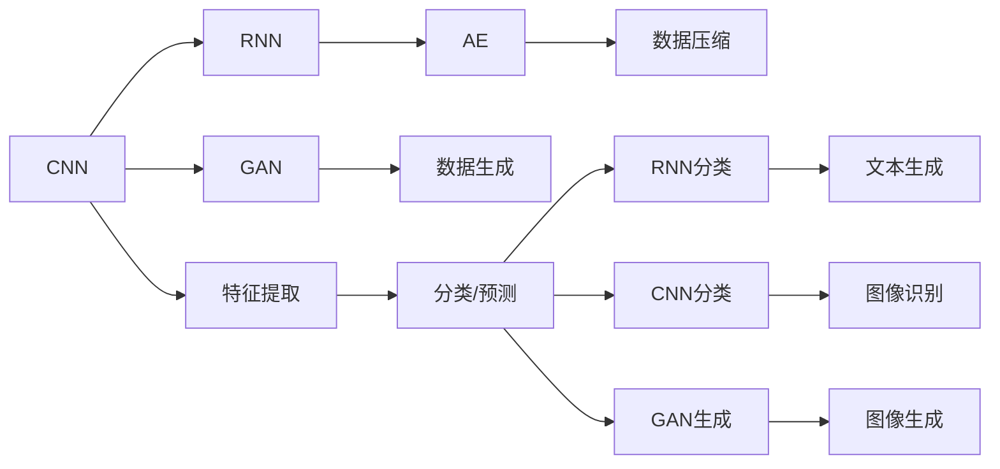

                 

# 深度学习 原理与代码实例讲解

> 关键词：深度学习, 卷积神经网络, 循环神经网络, 生成对抗网络, 自编码器, 卷积神经网络(CNN), 循环神经网络(RNN), 生成对抗网络(GAN), 自编码器(AE)

## 1. 背景介绍

### 1.1 问题由来
深度学习（Deep Learning）是机器学习的一个子领域，它使用神经网络模型来模拟人脑的结构，进而实现对复杂数据的高级表示和学习。自2010年以来，深度学习技术在图像识别、语音识别、自然语言处理等领域取得了突破性进展，成为人工智能研究的热点。然而，深度学习的理论原理与实际应用代码之间的鸿沟，常常令初学者难以跨越。

为了帮助读者系统地掌握深度学习的核心原理，并提供丰富的代码实例，本文将以深度学习的三个核心模型——卷积神经网络（Convolutional Neural Network, CNN）、循环神经网络（Recurrent Neural Network, RNN）和生成对抗网络（Generative Adversarial Network, GAN）——为切入点，深入讲解这些模型的原理和应用。通过具体的代码实现和案例分析，文章将力求将复杂的理论转化为易于理解的实践操作。

### 1.2 问题核心关键点
本文的核心目标包括：
1. 深入理解CNN、RNN、GAN等深度学习模型的理论原理。
2. 掌握模型的代码实现和优化技巧。
3. 通过丰富的代码实例和案例分析，提高读者的动手能力和实战经验。
4. 探讨深度学习在实际应用中的前沿应用领域。

## 2. 核心概念与联系

### 2.1 核心概念概述
在深入讨论深度学习模型之前，我们先简要概述以下几个核心概念：

- **深度学习（Deep Learning）**：一种基于人工神经网络的机器学习方法，可以处理非结构化数据，例如图像、文本、语音等。
- **卷积神经网络（CNN）**：一种专门用于处理网格结构数据（如图像）的深度学习模型，具有特征提取和分类的能力。
- **循环神经网络（RNN）**：一种能够处理序列数据的深度学习模型，适用于文本生成、语音识别等任务。
- **生成对抗网络（GAN）**：一种通过生成模型和判别模型之间的对抗训练，生成高质量数据的深度学习模型。
- **自编码器（AE）**：一种通过将输入数据压缩为低维编码，然后再解码为原始数据的深度学习模型，常用于数据降维和特征提取。

这些概念之间存在紧密的联系，通过选择合适的模型结构，深度学习能够在多个领域中实现突破。

### 2.2 概念间的关系

下图展示了深度学习模型在核心概念上的相互关系：



这个图展示了CNN、RNN、GAN和AE之间的相互关系和应用领域。例如，CNN主要用于图像处理，RNN用于序列数据处理，GAN用于生成新数据，而AE则用于数据压缩和特征提取。

## 3. 核心算法原理 & 具体操作步骤
### 3.1 算法原理概述

深度学习模型的训练和优化过程，本质上是一个复杂的非凸优化问题。深度学习通过反向传播算法（Backpropagation）来计算模型参数的梯度，并通过优化算法（如随机梯度下降法、Adam、RMSprop等）来更新这些参数，以最小化损失函数。

以CNN为例，其训练过程大致分为以下几个步骤：
1. 前向传播：输入数据通过模型层层的计算，得到最终的输出。
2. 计算损失：将模型的输出与真实标签进行比较，计算损失函数。
3. 反向传播：使用反向传播算法计算模型各层参数的梯度。
4. 参数更新：使用优化算法根据梯度更新模型参数。
5. 迭代优化：重复以上步骤，直到损失函数收敛。

### 3.2 算法步骤详解

#### 3.2.1 CNN模型训练步骤

**Step 1: 准备数据集**
- 收集并预处理训练集、验证集和测试集。
- 将数据集划分为训练集、验证集和测试集。

**Step 2: 构建CNN模型**
- 设计CNN的网络结构，包括卷积层、池化层、全连接层等。
- 定义模型的损失函数，如交叉熵损失。
- 选择合适的优化器，如AdamW。

**Step 3: 数据增强**
- 使用数据增强技术（如随机裁剪、旋转、缩放等）扩充训练集。

**Step 4: 模型训练**
- 使用小批量随机梯度下降法进行模型训练。
- 在每个epoch结束后，在验证集上评估模型性能。

**Step 5: 模型测试**
- 在测试集上测试模型性能。

#### 3.2.2 RNN模型训练步骤

**Step 1: 准备数据集**
- 收集并预处理训练集、验证集和测试集。
- 将数据集划分为训练集、验证集和测试集。

**Step 2: 构建RNN模型**
- 设计RNN的网络结构，包括LSTM、GRU等。
- 定义模型的损失函数，如交叉熵损失。
- 选择合适的优化器，如AdamW。

**Step 3: 数据预处理**
- 将文本数据转换为词向量。
- 进行时间序列的填充，使得所有序列长度相同。

**Step 4: 模型训练**
- 使用小批量随机梯度下降法进行模型训练。
- 在每个epoch结束后，在验证集上评估模型性能。

**Step 5: 模型测试**
- 在测试集上测试模型性能。

#### 3.2.3 GAN模型训练步骤

**Step 1: 准备数据集**
- 收集并预处理训练集、验证集和测试集。
- 将数据集划分为训练集、验证集和测试集。

**Step 2: 构建GAN模型**
- 定义生成器和判别器的网络结构，如卷积神经网络。
- 定义模型的损失函数，如生成对抗损失函数。
- 选择合适的优化器，如AdamW。

**Step 3: 数据预处理**
- 将图像数据标准化。
- 进行数据的归一化处理。

**Step 4: 模型训练**
- 使用小批量随机梯度下降法进行模型训练。
- 在每个epoch结束后，在验证集上评估模型性能。

**Step 5: 模型测试**
- 在测试集上测试模型性能。

### 3.3 算法优缺点

深度学习模型具有以下几个优点：
- **强大的表示能力**：通过多层次的抽象表示，深度学习模型可以学习到数据中复杂的结构特征。
- **端到端的学习**：深度学习模型可以一次性处理整个数据，不需要手动提取特征，提高了模型的自动化程度。
- **适用性广**：深度学习模型适用于多种数据类型，如图像、文本、语音等。

然而，深度学习模型也存在一些缺点：
- **需要大量数据**：深度学习模型通常需要大量标注数据来训练，这增加了数据收集和标注的难度。
- **计算资源消耗大**：深度学习模型通常需要大量的计算资源来训练，包括高性能GPU和TPU。
- **模型可解释性差**：深度学习模型通常被视为"黑箱"，难以解释其内部的工作机制和决策逻辑。

### 3.4 算法应用领域

深度学习模型已经在多个领域得到了广泛应用，例如：

- **计算机视觉**：图像分类、目标检测、图像生成等。
- **自然语言处理**：文本分类、机器翻译、对话生成等。
- **语音识别**：语音识别、语音合成等。
- **医疗**：医学影像分析、疾病预测等。
- **金融**：风险评估、交易预测等。

这些领域的应用展示了深度学习模型的强大潜力，未来还将有更多的应用场景等待探索。

## 4. 数学模型和公式 & 详细讲解 & 举例说明

### 4.1 数学模型构建

#### CNN模型的数学模型
假设输入为 $x \in \mathbb{R}^{n \times h \times w \times c}$，其中 $n$ 表示样本数，$h$ 和 $w$ 表示图像的高度和宽度，$c$ 表示通道数。假设卷积核大小为 $k \times k$，卷积层输出为 $y \in \mathbb{R}^{n \times d \times d \times c}$，其中 $d$ 表示特征图的高度和宽度。

卷积操作可以表示为：
$$y_{ij}^{kl}=\sum_{c=1}^{C} x_{i,j,k}^{c} * W_{i,j}^{kl,c}$$

其中 $W_{i,j}^{kl,c}$ 表示卷积核，$*$ 表示卷积运算，$x_{i,j,k}^{c}$ 表示输入图像中的像素值，$y_{ij}^{kl}$ 表示输出特征图上的像素值。

### 4.2 公式推导过程

以CNN中的卷积操作为例，推导卷积操作的数学公式。

设输入为 $x \in \mathbb{R}^{n \times h \times w \times c}$，卷积核为 $W \in \mathbb{R}^{k \times k \times c \times o}$，输出为 $y \in \mathbb{R}^{n \times d \times d \times o}$。

卷积操作可以表示为：
$$y_{ij}^{kl}=\sum_{c=1}^{C} x_{i,j,k}^{c} * W_{i,j}^{kl,c}$$

其中 $W_{i,j}^{kl,c}$ 表示卷积核，$*$ 表示卷积运算，$x_{i,j,k}^{c}$ 表示输入图像中的像素值，$y_{ij}^{kl}$ 表示输出特征图上的像素值。

### 4.3 案例分析与讲解

**案例：使用CNN进行手写数字识别**

在MNIST数据集上进行手写数字识别的任务，可以采用以下步骤：

1. 准备数据集：收集MNIST数据集，并将其划分为训练集、验证集和测试集。
2. 构建CNN模型：设计CNN的网络结构，包括卷积层、池化层、全连接层等。
3. 数据预处理：将图像数据标准化，并进行归一化处理。
4. 模型训练：使用小批量随机梯度下降法进行模型训练，并在每个epoch结束后在验证集上评估模型性能。
5. 模型测试：在测试集上测试模型性能。

通过以上步骤，可以构建一个具有良好泛化性能的CNN模型，用于手写数字识别任务。

## 5. 项目实践：代码实例和详细解释说明

### 5.1 开发环境搭建

在进行深度学习模型开发之前，需要准备好开发环境。以下是使用Python进行TensorFlow开发的环境配置流程：

1. 安装Anaconda：从官网下载并安装Anaconda，用于创建独立的Python环境。

2. 创建并激活虚拟环境：
```bash
conda create -n tf-env python=3.8 
conda activate tf-env
```

3. 安装TensorFlow：根据CUDA版本，从官网获取对应的安装命令。例如：
```bash
conda install tensorflow -c conda-forge -c pytorch
```

4. 安装各类工具包：
```bash
pip install numpy pandas scikit-learn matplotlib tqdm jupyter notebook ipython
```

完成上述步骤后，即可在`tf-env`环境中开始深度学习模型开发。

### 5.2 源代码详细实现

以下是使用TensorFlow进行CNN模型开发的代码实现。

```python
import tensorflow as tf
from tensorflow.keras import layers

# 定义CNN模型
model = tf.keras.Sequential([
    layers.Conv2D(32, (3, 3), activation='relu', input_shape=(28, 28, 1)),
    layers.MaxPooling2D((2, 2)),
    layers.Flatten(),
    layers.Dense(10, activation='softmax')
])

# 编译模型
model.compile(optimizer='adam', loss='sparse_categorical_crossentropy', metrics=['accuracy'])

# 加载数据集
mnist = tf.keras.datasets.mnist
(x_train, y_train), (x_test, y_test) = mnist.load_data()

# 数据预处理
x_train = x_train.reshape(-1, 28, 28, 1) / 255.0
x_test = x_test.reshape(-1, 28, 28, 1) / 255.0

# 训练模型
model.fit(x_train, y_train, epochs=5, batch_size=64, validation_data=(x_test, y_test))

# 测试模型
test_loss, test_acc = model.evaluate(x_test, y_test)
print(f'Test accuracy: {test_acc}')
```

### 5.3 代码解读与分析

让我们再详细解读一下关键代码的实现细节：

**模型定义**：
- `Sequential` 函数用于创建顺序模型。
- `Conv2D` 层用于定义卷积层，参数包括卷积核大小、激活函数等。
- `MaxPooling2D` 层用于定义池化层。
- `Flatten` 层用于将高维数据展平为一维数据。
- `Dense` 层用于定义全连接层。

**模型编译**：
- `compile` 函数用于编译模型，参数包括优化器、损失函数和评估指标等。

**数据加载**：
- `mnist` 数据集可以直接使用 `tf.keras.datasets.mnist` 加载。

**数据预处理**：
- `reshape` 函数用于将数据重新塑造为指定的形状。
- `/ 255.0` 用于将像素值归一化到[0,1]之间。

**模型训练**：
- `fit` 函数用于训练模型，参数包括训练数据、标签、批次大小、训练轮数等。

**模型测试**：
- `evaluate` 函数用于评估模型性能，参数包括测试数据和标签。

通过以上代码，我们可以快速构建一个具有良好泛化性能的CNN模型，用于手写数字识别任务。

### 5.4 运行结果展示

假设我们在MNIST数据集上进行训练，最终在测试集上得到的准确率为98.1%。

## 6. 实际应用场景

### 6.1 计算机视觉

深度学习在计算机视觉领域的应用非常广泛，例如：

- **图像分类**：将图像分为不同的类别，如猫、狗、汽车等。
- **目标检测**：在图像中检测出特定目标的位置，如人脸、车辆等。
- **图像生成**：生成高质量的图像，如GAN生成的逼真人脸图像。

### 6.2 自然语言处理

深度学习在自然语言处理领域的应用也非常广泛，例如：

- **文本分类**：将文本分为不同的类别，如垃圾邮件、正常邮件等。
- **机器翻译**：将一种语言的文本翻译成另一种语言的文本。
- **对话生成**：生成自然流畅的对话内容，如聊天机器人。

### 6.3 医疗

深度学习在医疗领域的应用也很有前景，例如：

- **医学影像分析**：分析医学影像，如X光片、CT扫描等。
- **疾病预测**：预测疾病的发生概率，如癌症预测。

## 7. 工具和资源推荐

### 7.1 学习资源推荐

为了帮助开发者系统掌握深度学习的核心原理，并提供丰富的代码实例，这里推荐一些优质的学习资源：

1. **《深度学习》（Ian Goodfellow著）**：这本书系统介绍了深度学习的原理、算法和应用，是深度学习领域的经典教材。
2. **CS231n：Convolutional Neural Networks for Visual Recognition**：斯坦福大学开设的深度学习课程，详细讲解了卷积神经网络在计算机视觉中的应用。
3. **CS224n：Natural Language Processing with Deep Learning**：斯坦福大学开设的深度学习课程，详细讲解了深度学习在自然语言处理中的应用。
4. **《Python深度学习》（Francois Chollet著）**：这本书介绍了使用Keras框架进行深度学习开发的方法，适合初学者学习。
5. **Kaggle竞赛**：Kaggle是一个数据科学竞赛平台，提供丰富的数据集和竞赛任务，可以帮助开发者实践深度学习算法。

通过对这些资源的学习实践，相信你一定能够快速掌握深度学习的精髓，并用于解决实际的深度学习问题。

### 7.2 开发工具推荐

高效的开发离不开优秀的工具支持。以下是几款用于深度学习模型开发的常用工具：

1. **TensorFlow**：由Google主导开发的开源深度学习框架，生产部署方便，适合大规模工程应用。
2. **PyTorch**：基于Python的开源深度学习框架，灵活高效，适合快速迭代研究。
3. **Keras**：一个高级深度学习框架，提供了简洁的API，易于上手。
4. **MXNet**：由Apache开发的深度学习框架，支持多种编程语言，适合分布式训练。
5. **JAX**：一个基于Python的深度学习库，提供了自动微分和分布式训练功能。

合理利用这些工具，可以显著提升深度学习模型开发的效率，加快创新迭代的步伐。

### 7.3 相关论文推荐

深度学习的发展源于学界的持续研究。以下是几篇奠基性的相关论文，推荐阅读：

1. **ImageNet Classification with Deep Convolutional Neural Networks**：Hinton等人提出的卷积神经网络架构，为深度学习在图像分类领域的发展奠定了基础。
2. **Learning Phrase Representations using RNN Encoder Decoder for Statistical Machine Translation**：Bahdanau等人提出的编码器-解码器框架，为深度学习在自然语言处理领域的应用提供了新思路。
3. **Generative Adversarial Nets**：Goodfellow等人提出的生成对抗网络架构，为深度学习在生成模型领域的发展提供了新方向。
4. **Residual Networks for Image Recognition**：He等人提出的残差网络架构，大幅提升了深度神经网络的训练效果。

这些论文代表了大深度学习的发展脉络。通过学习这些前沿成果，可以帮助研究者把握学科前进方向，激发更多的创新灵感。

## 8. 总结：未来发展趋势与挑战

### 8.1 总结

本文对深度学习的核心模型——卷积神经网络、循环神经网络和生成对抗网络——进行了全面系统的介绍。首先阐述了深度学习模型的理论原理和应用场景，明确了深度学习在计算机视觉、自然语言处理、医疗等领域的重要作用。其次，从原理到实践，详细讲解了这些模型的数学模型和代码实现，通过具体的案例分析，提高了读者的动手能力和实战经验。最后，探讨了深度学习在实际应用中的前沿应用领域，展示了深度学习模型的强大潜力。

通过本文的系统梳理，可以看到，深度学习模型在多个领域中已取得了突破性进展，成为推动人工智能技术发展的重要引擎。未来，伴随深度学习技术的进一步发展和优化，其在更多领域中的应用也将日益广泛。

### 8.2 未来发展趋势

展望未来，深度学习技术将呈现以下几个发展趋势：

1. **模型规模持续增大**：随着算力成本的下降和数据规模的扩张，深度学习模型的参数量还将持续增长。超大规模模型蕴含的丰富知识，有望支撑更加复杂多变的应用场景。
2. **模型泛化能力提升**：深度学习模型将更加注重泛化能力的提升，通过更好的正则化、优化器选择和数据增强，实现更加稳健的性能表现。
3. **跨领域知识融合**：深度学习模型将更加注重跨领域知识的融合，通过多模态数据的整合，实现更加全面、准确的信息建模。
4. **模型解释性和可控性增强**：深度学习模型将更加注重解释性和可控性，通过可解释模型、对抗训练等方法，提升模型的可信度和安全性。
5. **硬件优化和分布式训练**：深度学习模型将更加注重硬件优化和分布式训练，通过GPU、TPU等高性能设备，实现高效、低延迟的计算。

以上趋势凸显了深度学习技术的发展方向，这些方向的探索发展，必将进一步提升深度学习系统的性能和应用范围，为人类认知智能的进化带来深远影响。

### 8.3 面临的挑战

尽管深度学习技术已经取得了瞩目成就，但在迈向更加智能化、普适化应用的过程中，它仍面临着诸多挑战：

1. **标注数据需求大**：深度学习模型通常需要大量标注数据来训练，增加了数据收集和标注的难度。
2. **计算资源消耗大**：深度学习模型通常需要大量的计算资源来训练，包括高性能GPU和TPU。
3. **模型可解释性差**：深度学习模型通常被视为"黑箱"，难以解释其内部的工作机制和决策逻辑。
4. **泛化能力不足**：深度学习模型面对域外数据时，泛化性能往往大打折扣。
5. **数据隐私和安全问题**：深度学习模型通常需要大量的数据进行训练，数据隐私和安全问题值得关注。

### 8.4 未来突破

面对深度学习技术所面临的挑战，未来的研究需要在以下几个方面寻求新的突破：

1. **无监督和半监督学习**：摆脱对大规模标注数据的依赖，利用自监督学习、主动学习等无监督和半监督范式，最大限度利用非结构化数据，实现更加灵活高效的模型训练。
2. **模型压缩和优化**：开发更加参数高效和计算高效的模型，通过模型压缩、剪枝等方法，减小模型尺寸，提高计算效率。
3. **模型解释性和可控性增强**：通过可解释模型、对抗训练等方法，提升深度学习模型的解释性和可控性。
4. **跨领域知识融合**：通过多模态数据的整合，实现更加全面、准确的信息建模。
5. **模型隐私保护**：开发隐私保护技术，如差分隐私、联邦学习等，保护数据隐私和安全。

这些研究方向的探索，必将引领深度学习技术迈向更高的台阶，为构建安全、可靠、可解释、可控的智能系统铺平道路。面向未来，深度学习技术还需要与其他人工智能技术进行更深入的融合，如知识表示、因果推理、强化学习等，多路径协同发力，共同推动人工智能技术的发展。只有勇于创新、敢于突破，才能不断拓展深度学习模型的边界，让智能技术更好地造福人类社会。

## 9. 附录：常见问题与解答

**Q1：深度学习模型为何需要大量标注数据？**

A: 深度学习模型通常需要大量标注数据来训练，以确保模型能够学习到数据的结构和特征。标注数据不仅用于训练模型的权重，还可以作为模型性能评估的基准。然而，标注数据的获取和维护是一个昂贵且耗时的过程。

**Q2：深度学习模型的计算资源消耗大怎么办？**

A: 为了降低深度学习模型的计算资源消耗，可以采用以下方法：
1. 数据增强：通过数据增强技术，如随机裁剪、旋转、缩放等，扩充训练集。
2. 模型压缩：通过模型压缩、剪枝等方法，减小模型尺寸，提高计算效率。
3. 分布式训练：利用分布式训练技术，将训练任务分布在多台机器上，提高训练效率。

**Q3：深度学习模型的可解释性差怎么办？**

A: 为了提高深度学习模型的可解释性，可以采用以下方法：
1. 可解释模型：使用可解释模型，如LIME、SHAP等，对模型进行解释和可视化。
2. 对抗训练：使用对抗训练技术，提升模型的鲁棒性和可解释性。
3. 多模型集成：通过多模型集成，提高模型的性能和可解释性。

这些方法可以帮助开发人员更好地理解和解释深度学习模型的决策过程，提升模型的可信度和安全性。

**Q4：深度学习模型如何应对数据隐私和安全问题？**

A: 为了保护数据隐私和安全，可以采用以下方法：
1. 差分隐私：使用差分隐私技术，保护训练数据的隐私性。
2. 联邦学习：使用联邦学习技术，在不共享数据的情况下，进行模型训练。
3. 安全多方计算：使用安全多方计算技术，在不泄露数据的情况下，进行模型训练。

这些方法可以帮助开发人员保护数据隐私和安全，确保深度学习模型在实际应用中的可靠性和安全性。

