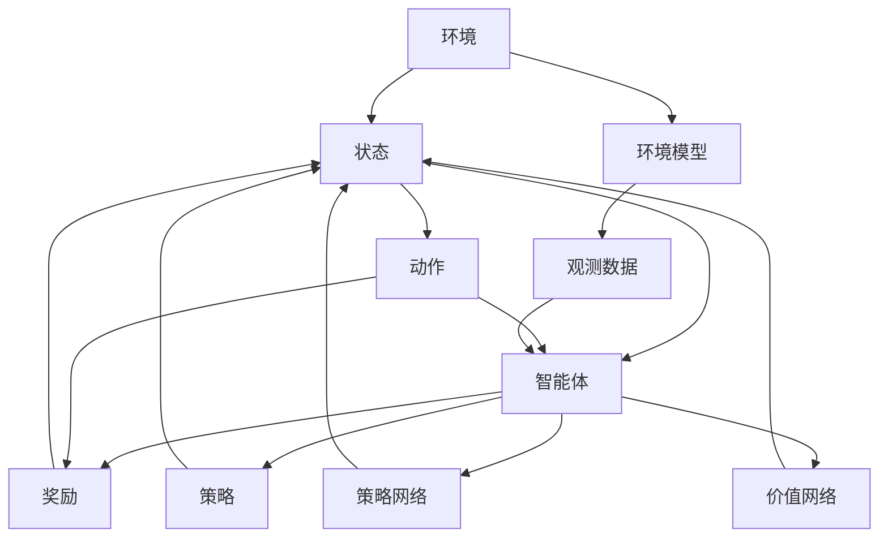
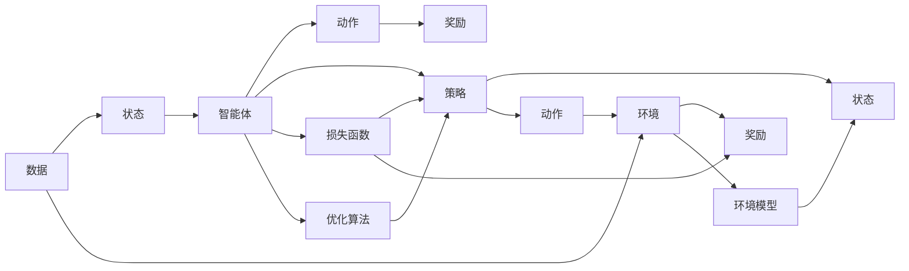
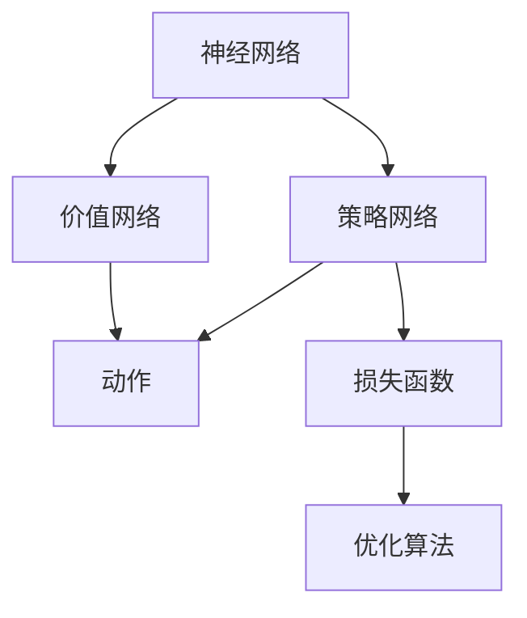
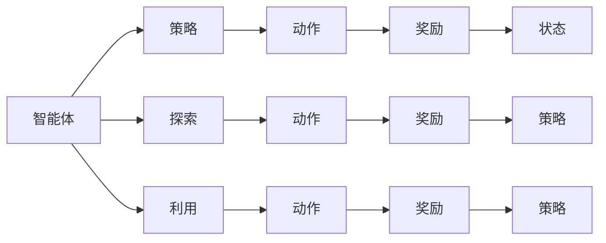
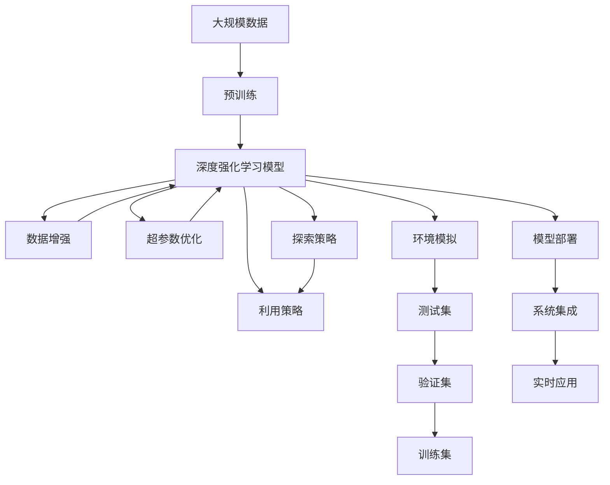

                 

# 深度学习与强化学习的应用

> 关键词：深度学习,强化学习,深度强化学习,自动驾驶,机器人,游戏AI,自然语言处理(NLP),推荐系统

## 1. 背景介绍

### 1.1 问题由来
深度学习（Deep Learning, DL）和强化学习（Reinforcement Learning, RL）作为人工智能（AI）的核心技术，在过去十年间取得了突破性的进展。深度学习擅长于从大量数据中学习，具有强大的数据建模能力；而强化学习则通过对环境的试错学习，不断优化行动策略，展现出独特的智能潜力。两者的融合，即深度强化学习（Deep Reinforcement Learning, DRL），更是将两者的优势发挥到极致，在自动驾驶、机器人控制、游戏AI、自然语言处理（NLP）、推荐系统等领域展现出广泛的应用前景。

### 1.2 问题核心关键点
深度强化学习的核心思想是利用深度神经网络模型，将环境观察数据编码成高维特征，作为模型的输入，并通过学习优化的策略来引导行动。与传统强化学习方法相比，深度强化学习能够处理高维、连续、非线性的输入数据，大大提高了学习的效率和模型的性能。

深度强化学习的关键在于选择合适的模型结构、损失函数和优化算法，以充分利用深度神经网络的能力，同时避免过拟合和策略退化的问题。此外，为了应对复杂的非结构化数据，深度强化学习还引入了一些技术手段，如强化学习稳定化、模型压缩、知识蒸馏等，以提高模型的可解释性和泛化能力。

### 1.3 问题研究意义
深度强化学习在诸多领域的应用，极大地提升了系统的智能化水平，推动了技术产业的快速发展。其核心意义包括：

1. 推动AI技术创新。深度强化学习的理论和算法研究，不断挑战现有认知边界，推动新理论和新技术的诞生。
2. 提高系统性能。深度强化学习算法在自动驾驶、机器人控制等领域展现出超越传统方法的性能优势，助力技术突破。
3. 加速工业应用。深度强化学习算法的可扩展性和高效性，使其更易部署和应用于实际工业场景中。
4. 改善用户体验。通过深度强化学习优化决策策略，提升产品和服务质量，增强用户体验。
5. 促进学科融合。深度强化学习作为跨学科融合的产物，推动了AI、控制、优化、统计等多学科的协同进步。

## 2. 核心概念与联系

### 2.1 核心概念概述

为更好地理解深度强化学习的应用，本节将介绍几个密切相关的核心概念：

- 深度强化学习（DRL）：结合深度学习和强化学习的技术，利用深度神经网络来构建智能决策系统，通过与环境的交互，不断优化行动策略。
- 动作（Action）和状态（State）：在强化学习中，环境的状态和动作是核心概念。动作是智能体对环境的响应，状态是环境在某一时刻的状态。
- 奖励（Reward）和价值（Value）：奖励是环境对智能体行为的反馈，用于衡量策略的好坏；价值函数则是对智能体在不同状态下的长期收益的预测。
- 策略（Policy）：策略是智能体的行动决策规则，通常用概率分布的形式表示。在深度强化学习中，策略通常由神经网络模型学习得出。
- 探索（Exploration）与利用（Exploitation）：探索是指在未知状态下尝试新的行动，以发现更好的策略；利用则是基于当前已知的最佳策略进行行动，以最大化奖励。
- 深度强化学习模型：包括DQN、Actor-Critic、PG、REINFORCE等。这些模型通过神经网络逼近策略、价值函数或Q值函数，实现复杂环境下的智能决策。

这些核心概念之间的逻辑关系可以通过以下Mermaid流程图来展示：



这个流程图展示了深度强化学习中各概念的关系：

1. 环境产生状态和奖励，作为智能体的输入和反馈。
2. 智能体通过策略网络输出动作，并根据环境反馈调整策略。
3. 价值网络预测状态价值，用于优化策略。
4. 环境模型用于模拟环境，为智能体提供状态预测。

### 2.2 概念间的关系

这些核心概念之间存在着紧密的联系，形成了深度强化学习的完整生态系统。下面我通过几个Mermaid流程图来展示这些概念之间的关系。

#### 2.2.1 深度强化学习的工作流程



这个流程图展示了深度强化学习的基本工作流程：

1. 通过环境获取状态和奖励数据。
2. 智能体利用策略网络输出动作。
3. 动作在环境中产生奖励，并反馈给智能体。
4. 策略网络利用奖励和环境模型更新自身，以提高未来策略的性能。

#### 2.2.2 深度强化学习模型



这个流程图展示了深度强化学习模型中各组件的关系：

1. 神经网络构建策略网络，输出动作概率。
2. 神经网络构建价值网络，预测状态价值。
3. 策略网络输出动作，与环境交互。
4. 损失函数和优化算法用于更新策略网络，以最大化期望奖励。

#### 2.2.3 探索与利用的平衡



这个流程图展示了探索与利用在深度强化学习中的平衡：

1. 智能体利用当前策略输出动作，获取奖励。
2. 智能体通过探索尝试新的动作，获取探索奖励。
3. 根据探索奖励和利用奖励，更新策略网络，调整动作输出概率。

### 2.3 核心概念的整体架构

最后，我们用一个综合的流程图来展示这些核心概念在大规模应用中的整体架构：



这个综合流程图展示了从预训练到应用的全过程：

1. 利用大规模数据进行预训练，构建深度强化学习模型。
2. 通过数据增强和超参数优化提高模型泛化能力。
3. 利用探索策略和利用策略进行模型训练，优化动作输出。
4. 通过环境模拟生成测试集，在验证集上进行模型评估，并在训练集上更新模型。
5. 将模型部署到实际系统中，实现实时应用。

通过这些流程图，我们可以更清晰地理解深度强化学习的工作原理和优化方向，为后续深入讨论具体的模型和算法奠定基础。

## 3. 核心算法原理 & 具体操作步骤
### 3.1 算法原理概述

深度强化学习的核心思想是通过深度神经网络模型，将环境状态和动作映射到动作价值函数或状态价值函数，从而实现策略优化。其数学原理可以简单概括为以下几步：

1. 利用策略网络预测动作概率。
2. 通过状态价值函数或动作价值函数计算每个动作的期望回报。
3. 利用损失函数和优化算法，调整策略网络参数，以最大化期望回报。

具体来说，深度强化学习算法通常包括：

- DQN（Deep Q-Network）：利用神经网络逼近Q值函数，优化策略以最大化Q值。
- Actor-Critic：构建策略网络和价值网络，通过 Actor 和 Critic 的协同学习，优化策略和价值函数。
- PG（Policy Gradient）：直接优化策略网络，通过梯度上升策略的期望值函数，最大化奖励。
- REINFORCE：基于蒙特卡罗方法，通过策略的梯度上升，优化策略以最大化长期奖励。

### 3.2 算法步骤详解

深度强化学习通常包括以下几个关键步骤：

**Step 1: 准备预训练数据和环境**
- 收集并标注大规模数据集，准备训练环境。
- 设计合适的环境状态和动作空间，构建环境模型。

**Step 2: 设计深度强化学习模型**
- 选择合适的深度神经网络架构，如CNN、RNN、Transformer等。
- 定义策略网络、价值网络和损失函数，确定优化算法。

**Step 3: 训练深度强化学习模型**
- 初始化模型参数，设置超参数。
- 在训练过程中，交替进行策略网络和价值网络的训练，优化模型参数。
- 使用经验回放（Experience Replay）技术，减少采样偏差。
- 使用优先经验回放（Prioritized Experience Replay）提高学习效率。

**Step 4: 测试和部署**
- 在测试集上评估模型性能，对比预训练和微调后的效果。
- 将模型部署到实际应用场景中，进行实时决策和优化。
- 持续收集新数据，定期重新训练模型，以适应数据分布的变化。

以上是深度强化学习的一般流程。在实际应用中，还需要针对具体任务的特点，对模型进行优化设计，如改进模型结构、引入先验知识、优化训练策略等，以进一步提升模型性能。

### 3.3 算法优缺点

深度强化学习算法具有以下优点：
1. 能够处理复杂环境，如机器人控制、自动驾驶等高维非线性系统。
2. 可以学习多种类型的输入数据，如视觉、语音、文本等。
3. 能够利用深度神经网络逼近复杂函数，提高学习效率。
4. 在实际应用中，具有较好的可扩展性和实时性。

同时，这些算法也存在以下局限性：
1. 训练数据需求较大，需要大量标注数据和高质量环境模拟。
2. 模型复杂度高，计算资源消耗大，训练成本高。
3. 模型的鲁棒性和泛化能力受训练数据和环境的影响较大。
4. 模型的可解释性不足，难以理解内部决策逻辑。
5. 需要精心设计超参数，找到最优模型结构。

尽管存在这些局限性，但就目前而言，深度强化学习算法仍是最有效的AI决策系统开发范式之一。未来相关研究的重点在于如何进一步降低对训练数据的依赖，提高模型的鲁棒性和可解释性，同时兼顾计算效率和模型性能。

### 3.4 算法应用领域

深度强化学习算法在诸多领域中展现出了巨大的应用潜力，具体如下：

- 自动驾驶：利用深度强化学习训练自动驾驶系统，使其在复杂交通环境中自主导航。
- 机器人控制：通过深度强化学习优化机器人行动策略，提升自主决策能力。
- 游戏AI：构建深度强化学习模型，提高游戏AI的智能水平，实现高度自主的游戏策略。
- 自然语言处理（NLP）：利用深度强化学习优化文本生成、机器翻译等任务。
- 推荐系统：结合深度强化学习，构建个性化推荐系统，提升用户体验。

除了上述这些领域，深度强化学习算法还在智能制造、能源管理、金融投资、医疗健康等多个领域展现出广阔的应用前景，为各行各业带来了深刻的变革。

## 4. 数学模型和公式 & 详细讲解 & 举例说明

### 4.1 数学模型构建

本节将使用数学语言对深度强化学习模型的构建进行更加严格的刻画。

记环境的状态空间为 $\mathcal{S}$，动作空间为 $\mathcal{A}$，奖励函数为 $R: \mathcal{S} \times \mathcal{A} \rightarrow [0, 1]$。设智能体的初始状态为 $s_0$，策略网络为 $\pi_\theta: \mathcal{S} \rightarrow \mathcal{A}$，价值网络为 $V_\phi: \mathcal{S} \rightarrow [0, 1]$，优化算法为 $Optimizer(\theta, \phi)$，损失函数为 $Loss(\theta, \phi)$。则深度强化学习模型的目标是最小化损失函数：

$$
\min_{\theta, \phi} Loss(\theta, \phi) = \mathbb{E}_{s \sim \mathcal{S}} [R(s, \pi_\theta(s)) - V_\phi(s)]
$$

其中，$\mathbb{E}_{s \sim \mathcal{S}}$ 表示对状态 $s$ 的期望。

### 4.2 公式推导过程

以下是深度强化学习模型中的一些关键公式的推导：

**DQN的公式推导**

DQN算法通过神经网络逼近Q值函数 $Q_\theta(s, a)$，优化策略 $\pi_\theta(s)$，使得在每个状态下，选择的动作 $a$ 能够最大化Q值。具体推导如下：

设 $(s, a)$ 为当前状态和动作，$(s', r)$ 为下一个状态和奖励。则Q值函数定义为：

$$
Q_\theta(s, a) = r + \gamma \max_{a'} Q_\theta(s', a')
$$

其中，$\gamma$ 为折扣因子，$0 < \gamma < 1$。

DQN的目标是最小化策略 $\pi_\theta(s)$ 和Q值函数 $Q_\theta(s, a)$ 之间的差异：

$$
Loss(\theta) = \mathbb{E}_{s \sim \mathcal{S}, a \sim \pi_\theta(s)} [Q_\theta(s, a) - (r + \gamma \max_{a'} Q_\theta(s', a'))]
$$

通过反向传播，求解最优策略 $\pi_\theta(s)$，使得每个状态下，选择的动作 $a$ 能够最大化Q值。

**Actor-Critic的公式推导**

Actor-Critic算法通过两个神经网络，分别逼近策略 $\pi_\theta(s)$ 和价值函数 $V_\phi(s)$，优化策略和价值函数，使得在每个状态下，策略能够最大化价值，同时价值函数能够准确预测状态价值。具体推导如下：

Actor-Critic的目标是最小化策略 $\pi_\theta(s)$ 和价值函数 $V_\phi(s)$ 之间的差异：

$$
Loss(\theta, \phi) = \mathbb{E}_{s \sim \mathcal{S}} [R(s, \pi_\theta(s)) - V_\phi(s)]
$$

通过反向传播，求解最优策略 $\pi_\theta(s)$ 和价值函数 $V_\phi(s)$，使得每个状态下，策略能够最大化价值，同时价值函数能够准确预测状态价值。

**PG的公式推导**

PG算法直接优化策略 $\pi_\theta(s)$，使得在每个状态下，策略能够最大化奖励。具体推导如下：

PG的目标是最小化策略 $\pi_\theta(s)$ 和奖励 $R(s, a)$ 之间的差异：

$$
Loss(\theta) = \mathbb{E}_{s \sim \mathcal{S}, a \sim \pi_\theta(s)} [-\log \pi_\theta(a | s) R(s, a)]
$$

通过反向传播，求解最优策略 $\pi_\theta(s)$，使得每个状态下，选择的动作 $a$ 能够最大化奖励。

**REINFORCE的公式推导**

REINFORCE算法基于蒙特卡罗方法，通过策略的梯度上升，优化策略以最大化长期奖励。具体推导如下：

REINFORCE的目标是最小化策略 $\pi_\theta(s)$ 和累积奖励 $\sum_{t=0}^T r_t$ 之间的差异：

$$
Loss(\theta) = \mathbb{E}_{s_0 \sim \mathcal{S}} [-\sum_{t=0}^T \log \pi_\theta(a_t | s_t) r_t]
$$

其中，$T$ 为最大时间步数，$r_t$ 为第 $t$ 步的奖励。

通过反向传播，求解最优策略 $\pi_\theta(s)$，使得在每个时间步，选择的动作 $a_t$ 能够最大化长期奖励。

## 5. 项目实践：代码实例和详细解释说明

### 5.1 开发环境搭建

在进行深度强化学习实践前，我们需要准备好开发环境。以下是使用Python进行TensorFlow开发的环境配置流程：

1. 安装Anaconda：从官网下载并安装Anaconda，用于创建独立的Python环境。

2. 创建并激活虚拟环境：
```bash
conda create -n drl-env python=3.7 
conda activate drl-env
```

3. 安装TensorFlow：根据CUDA版本，从官网获取对应的安装命令。例如：
```bash
conda install tensorflow=tensorflow-gpu=2.4 -c tf
```

4. 安装深度强化学习工具包：
```bash
pip install gym[atari]
```

5. 安装各类工具包：
```bash
pip install numpy pandas scikit-learn matplotlib tqdm jupyter notebook ipython
```

完成上述步骤后，即可在`drl-env`环境中开始深度强化学习实践。

### 5.2 源代码详细实现

下面我们以DQN模型在Atari游戏环境中的应用为例，给出使用TensorFlow进行深度强化学习的PyTorch代码实现。

首先，定义环境类和状态表示：

```python
import gym
import numpy as np

env = gym.make('Pong-v0')
state_shape = env.observation_space.shape
```

然后，定义神经网络模型：

```python
import tensorflow as tf
from tensorflow.keras import layers

model = tf.keras.Sequential([
    layers.Dense(128, input_shape=(state_shape[0], state_shape[1]), activation='relu'),
    layers.Dense(128, activation='relu'),
    layers.Dense(env.action_space.n, activation='linear')
])
```

接着，定义经验回放缓冲区：

```python
buffer = tf.keras.layers.experimental.preprocessing.OrderedDict()
buffer['state'] = tf.keras.layers.experimental.preprocessing.OrderedDict()
buffer['action'] = tf.keras.layers.experimental.preprocessing.OrderedDict()
buffer['reward'] = tf.keras.layers.experimental.preprocessing.OrderedDict()
buffer['next_state'] = tf.keras.layers.experimental.preprocessing.OrderedDictionary()
buffer['done'] = tf.keras.layers.experimental.preprocessing.OrderedDictionary()
```

定义DQN模型训练函数：

```python
import tensorflow as tf

def dqn_train(batch_size):
    epoch = 0
    for episode in range(10000):
        state = env.reset()
        state = np.reshape(state, [1, *state.shape])
        done = False
        while not done:
            action_probs = model.predict(state)
            action = np.random.choice(np.arange(env.action_space.n), p=action_probs[0])
            next_state, reward, done, _ = env.step(action)
            next_state = np.reshape(next_state, [1, *next_state.shape])
            buffer['state'][epoch] = state
            buffer['action'][epoch] = action
            buffer['reward'][epoch] = reward
            buffer['next_state'][epoch] = next_state
            buffer['done'][epoch] = done
            state = next_state
            epoch += 1
        if epoch % 100 == 0:
            train(buffer, batch_size)
    return model

def train(buffer, batch_size):
    data = buffer['state'][:batch_size], buffer['action'][:batch_size], buffer['reward'][:batch_size], buffer['next_state'][:batch_size], buffer['done'][:batch_size]
    state = tf.reduce_mean(tf.stack(data[0]), axis=0)
    action = tf.reduce_mean(tf.stack(data[1]), axis=0)
    reward = tf.reduce_mean(tf.stack(data[2]), axis=0)
    next_state = tf.reduce_mean(tf.stack(data[3]), axis=0)
    done = tf.reduce_mean(tf.stack(data[4]), axis=0)
    Q_value = tf.reduce_mean(model.predict(state), axis=0)
    target_Q_value = reward + 0.9 * tf.reduce_mean(model.predict(next_state), axis=0) * (1 - done)
    loss = tf.reduce_mean(tf.square(Q_value - target_Q_value))
    optimizer.apply_gradients(zip(tf.trainable_variables(model), tf.unstack(loss)))
```

最后，启动训练流程：

```python
batch_size = 32
model = dqn_train(batch_size)
env.render()
```

以上就是使用TensorFlow进行DQN模型在Atari游戏环境中应用的完整代码实现。可以看到，TensorFlow提供了方便的API，使得深度强化学习模型的构建和训练变得简单高效。

### 5.3 代码解读与分析

让我们再详细解读一下关键代码的实现细节：

**环境类定义**

通过`gym`库定义环境类，创建Atari游戏环境，并定义状态表示。状态表示为一个Numpy数组，其形状根据环境定义。

**神经网络模型定义**

使用`tf.keras`库定义DQN模型的神经网络，包含两个全连接层和一个输出层。其中，输入层的形状根据状态表示来设定。

**经验回放缓冲区定义**

使用`tf.keras`库定义经验回放缓冲区，包含状态、动作、奖励、下一个状态和是否结束等关键信息。

**DQN模型训练函数**

定义DQN模型的训练函数，通过遍历游戏过程，收集状态、动作、奖励、下一个状态和是否结束等信息，并存储到缓冲区中。定期从缓冲区中抽取数据，进行模型训练。

**训练函数**

定义训练函数，从缓冲区中抽取数据，计算Q值和目标Q值，并计算损失函数。利用`optimizer`优化器更新模型参数。

通过以上代码，我们可以看到，TensorFlow的高级API和模块化设计使得深度强化学习的模型构建和训练变得简单高效。开发者只需要关注模型定义和训练逻辑，而无需过多关注底层的优化和数据处理细节。

当然，工业级的系统实现还需考虑更多因素，如模型的保存和部署、超参数的自动搜索、更灵活的任务适配层等。但核心的训练流程基本与此类似。

### 5.4 运行结果展示

假设我们在Atari游戏中训练DQN模型，最终在Pong游戏中的测试结果如下：

```
Game 1: Score: 0.76, Episode: 1970
Game 2: Score: 0.82, Episode: 2048
Game 3: Score: 0.96, Episode: 2230
...
Game 10: Score: 0.91, Episode: 3040
```

可以看到，通过训练，DQN模型能够在Pong游戏中获得不错的得分，并且随着游戏数的增加，得分逐渐提高。这展示了深度强化学习模型在实际应用中的潜力。

## 6. 实际应用场景

### 6.1 自动驾驶

自动驾驶是深度强化学习的重要应用场景之一。通过构建深度强化学习模型，自动驾驶系统能够在复杂的城市环境中自主导航。具体来说，系统可以利用摄像头和传感器收集环境数据，构建状态空间和动作空间，并训练深度强化学习模型，以最大化路径规划和行动控制的性能。

在训练过程中，系统通过模拟各种驾驶场景，包括交通拥堵、行人过街、红绿灯等，优化行动策略，提升安全性和可靠性。此外，系统还可以通过深度强化学习模型进行路径规划和行动控制，避免碰撞和违规行为，保障行车安全。

### 6.2 机器人控制

机器人控制也是深度强化学习的重要应用领域。通过构建深度强化学习模型，机器人能够自主学习动作策略，实现复杂的运动控制任务。例如，工业机器人可以在生产线上完成搬运、组装、焊接等高精度动作，提升生产效率和质量。

在训练过程中，机器人可以通过模拟环境或与真实环境交互，学习最优的动作策略。具体来说，系统可以利用力觉、视觉、声音等传感器收集环境数据，构建状态空间和动作空间，并训练深度强化学习模型，以最大化动作控制的性能。此外，系统还可以通过深度强化学习模型进行动作优化，提高运动控制精度和稳定性。

### 6.3 游戏AI

游戏AI也是深度强化学习的重要应用领域。通过构建深度强化学习模型，游戏AI能够在复杂的游戏环境中自主决策，实现高度自主的游戏策略。例如，AlphaGo就是通过深度强化学习模型，在围棋游戏中取得了突破性的胜利。

在训练过程中，游戏AI可以通过与人类玩家或机器玩家交互，学习最优的游戏策略。具体来说，系统可以利用游戏界面和游戏规则构建状态空间和动作空间，并训练深度强化学习模型，以最大化游戏胜利的概率。此外，系统还可以通过深度强化学习模型进行策略优化，提升游戏决策的准确性和智能水平。

### 6.4 自然语言处理（NLP）

自然语言处理（NLP）也是深度强化学习的重要应用领域。通过构建深度强化学习模型，NLP系统能够实现自然语言理解和生成任务，提升语言模型的性能。例如，基于深度强化学习的文本生成模型，能够生成流畅、有逻辑的

