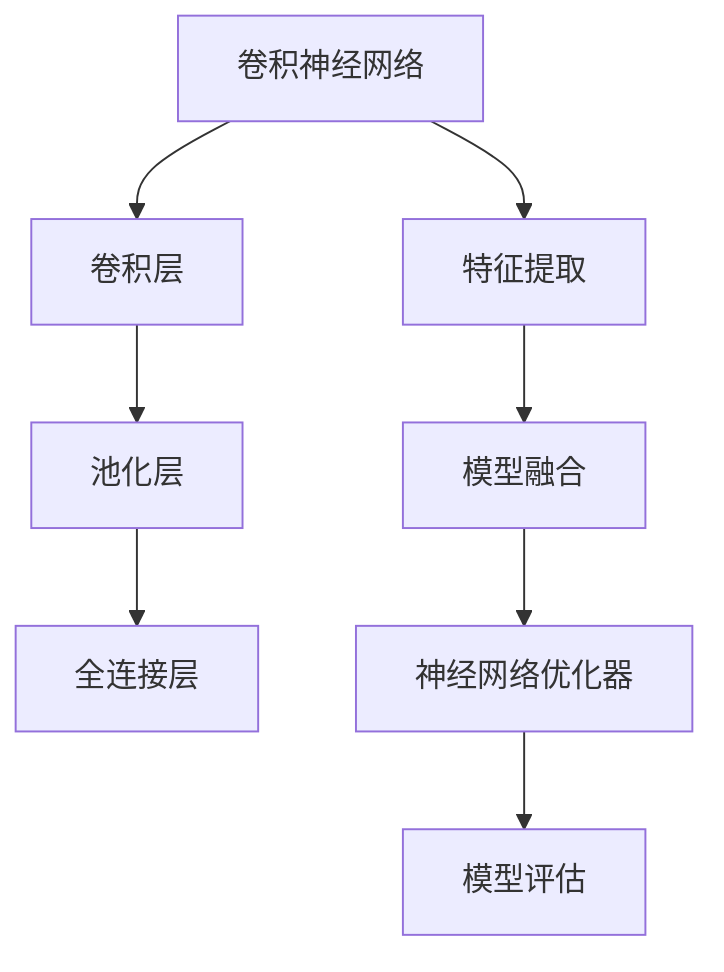
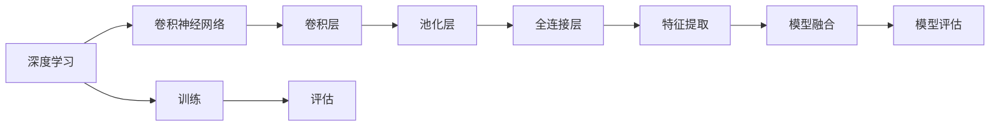
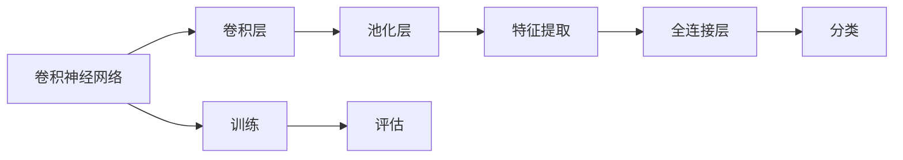
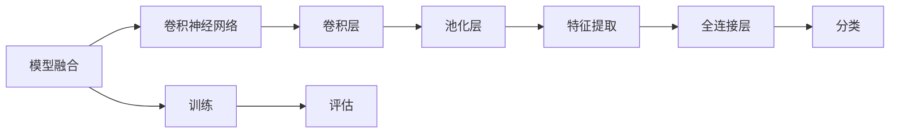

                 

# 深度学习五官的识别系统详细设计与具体代码实现

> 关键词：深度学习,五官识别,卷积神经网络,卷积层,池化层,全连接层,模型融合,神经网络优化器,卷积神经网络训练,人脸识别,特征提取,模型评估

## 1. 背景介绍

随着人工智能技术的快速发展，深度学习在图像识别领域的应用日益广泛，尤其是在面部特征的识别和分析中，它展现出巨大的潜力。基于深度学习的人脸识别系统，通过从图像中提取关键特征，可以高效地辨认出不同的人脸，并能够在人脸数据上实现高效、准确识别。然而，深度学习系统对于眼睛、嘴巴等面部特征的识别，尤其是对于五官的识别，往往不如对于整张面部的识别。

本文章将详细描述一种基于深度学习的五官识别系统，该系统采用卷积神经网络(CNN)作为骨干网络，可以识别图像中的人眼、人鼻、人耳等五官。我们将从模型设计、训练和优化、以及实际应用等多个角度探讨五官识别系统的详细设计与具体代码实现。

## 2. 核心概念与联系

### 2.1 核心概念概述

为了更好地理解基于深度学习的五官识别系统，我们首先介绍一些关键的概念和组件：

- **卷积神经网络(CNN)**：一种专门用于处理图像数据的深度学习网络。CNN 通过卷积层和池化层提取图像特征，然后通过全连接层进行分类。

- **卷积层**：卷积层通过卷积操作提取图像的局部特征，这是 CNN 网络的核心组件。

- **池化层**：池化层用于缩小特征图的尺寸，减少参数数量，提高计算效率。

- **全连接层**：全连接层将卷积层和池化层提取的特征进行分类。

- **模型融合**：通过将多个模型结合起来，提高系统的整体性能。

- **神经网络优化器**：用于更新模型参数，如梯度下降等。

- **深度学习**：通过多层神经网络进行训练，实现复杂的特征提取和分类任务。

- **特征提取**：提取图像中的关键信息，用于分类、识别等任务。

- **模型评估**：对模型进行评估，如准确率、召回率等指标。

这些概念之间的联系可以通过以下 Mermaid 流程图来展示：



这个流程图展示了大语言模型微调过程中各个组件的关系：

1. 卷积神经网络从图像中提取特征。
2. 卷积层通过卷积操作提取局部特征。
3. 池化层对特征进行降维。
4. 全连接层对特征进行分类。
5. 特征提取模块提取关键信息。
6. 模型融合模块结合多个模型提升性能。
7. 神经网络优化器更新模型参数。
8. 模型评估模块对模型性能进行评估。

### 2.2 概念间的关系

这些核心概念之间存在着紧密的联系，形成了深度学习五官识别系统的完整生态系统。下面通过几个 Mermaid 流程图来展示这些概念之间的关系。

#### 2.2.1 深度学习在五官识别中的应用



这个流程图展示了深度学习在五官识别中的应用流程：

1. 深度学习采用卷积神经网络提取特征。
2. 卷积层通过卷积操作提取局部特征。
3. 池化层对特征进行降维。
4. 全连接层对特征进行分类。
5. 特征提取模块提取关键信息。
6. 模型融合模块结合多个模型提升性能。
7. 模型评估模块对模型性能进行评估。

#### 2.2.2 特征提取在五官识别中的应用



这个流程图展示了特征提取在五官识别中的应用流程：

1. 卷积神经网络从图像中提取特征。
2. 卷积层通过卷积操作提取局部特征。
3. 池化层对特征进行降维。
4. 特征提取模块提取关键信息。
5. 全连接层对特征进行分类。
6. 模型评估模块对模型性能进行评估。

#### 2.2.3 模型融合在五官识别中的应用



这个流程图展示了模型融合在五官识别中的应用流程：

1. 模型融合模块结合多个模型提升性能。
2. 卷积神经网络从图像中提取特征。
3. 卷积层通过卷积操作提取局部特征。
4. 池化层对特征进行降维。
5. 特征提取模块提取关键信息。
6. 全连接层对特征进行分类。
7. 模型评估模块对模型性能进行评估。

## 3. 核心算法原理 & 具体操作步骤

### 3.1 算法原理概述

基于深度学习的五官识别系统主要采用卷积神经网络作为骨干网络，通过多层的卷积和池化操作提取图像的特征，然后通过全连接层进行分类。以下是核心算法原理的概述：

1. **卷积操作**：卷积操作通过滑动卷积核对图像进行特征提取，每个卷积核可以捕捉不同的局部特征。

2. **池化操作**：池化操作用于降低特征图的大小，减小计算量，并增加特征的鲁棒性。

3. **全连接层**：全连接层将卷积和池化操作提取的特征进行分类，输出最终的分类结果。

### 3.2 算法步骤详解

基于深度学习的五官识别系统的算法步骤包括：

1. **数据准备**：收集标注好的五官图像数据，并进行预处理，如归一化、标准化、调整尺寸等。

2. **模型搭建**：搭建卷积神经网络模型，定义卷积层、池化层、全连接层等组件，并设置相应的超参数，如卷积核大小、池化窗口大小、学习率等。

3. **模型训练**：使用训练集对模型进行训练，采用神经网络优化器（如 Adam、SGD 等）进行参数更新，最小化损失函数（如交叉熵损失）。

4. **模型评估**：使用测试集对模型进行评估，计算准确率、召回率等指标，以评估模型性能。

5. **模型优化**：根据评估结果，优化模型的超参数，如学习率、批大小、迭代次数等，并重新训练模型，直至达到理想性能。

### 3.3 算法优缺点

基于深度学习的五官识别系统具有以下优点：

1. **高精度**：卷积神经网络能够自动提取图像中的关键特征，并具有较好的泛化能力。

2. **鲁棒性**：通过池化层和特征提取模块，系统对图像中的噪声和干扰具有一定的鲁棒性。

3. **可扩展性**：卷积神经网络可以通过增加层数和节点数，提高系统的性能和复杂度。

4. **实时性**：采用卷积神经网络可以高效地处理图像数据，支持实时识别和分析。

同时，该算法也存在以下缺点：

1. **高资源需求**：训练卷积神经网络需要大量的计算资源和时间，对硬件要求较高。

2. **过拟合风险**：卷积神经网络具有较强的拟合能力，容易导致过拟合。

3. **模型复杂度**：卷积神经网络的层数和节点数较多，训练和推理的复杂度较高。

4. **数据需求高**：训练高精度的卷积神经网络需要大量标注数据，数据收集和标注成本较高。

### 3.4 算法应用领域

基于深度学习的五官识别系统可以应用于多个领域，如：

1. **人脸识别**：通过识别面部特征，可以实现人脸验证和识别，用于门禁系统、安全监控等。

2. **医疗诊断**：通过识别面部特征，可以辅助医生进行疾病诊断和分析，如眼部疾病的早期发现。

3. **安防监控**：通过识别面部特征，可以实现监控视频中的人员识别和行为分析。

4. **游戏娱乐**：通过识别面部特征，可以增强虚拟现实、增强现实等游戏中的交互体验。

## 4. 数学模型和公式 & 详细讲解 & 举例说明

### 4.1 数学模型构建

在深度学习的五官识别系统中，我们采用卷积神经网络作为骨干网络，其数学模型可以表示为：

$$
y = M(x)
$$

其中 $x$ 表示输入的图像数据，$y$ 表示输出标签，$M$ 表示卷积神经网络模型。

### 4.2 公式推导过程

在卷积神经网络中，卷积层的输出 $h^{(l)}$ 可以表示为：

$$
h^{(l)} = f_k(W_k * h^{(l-1)} + b_k)
$$

其中 $f_k$ 表示激活函数，$W_k$ 表示卷积核权重，$b_k$ 表示偏置项，$*$ 表示卷积运算。

池化层的输出 $h^{(l)}$ 可以表示为：

$$
h^{(l)} = max(\frac{h^{(l-1)}}{w})
$$

其中 $w$ 表示池化窗口大小。

全连接层的输出 $y$ 可以表示为：

$$
y = f_C(W_C * h^{(L)} + b_C)
$$

其中 $f_C$ 表示全连接层的激活函数，$W_C$ 表示全连接层的权重矩阵，$b_C$ 表示偏置项，$L$ 表示卷积神经网络的层数。

### 4.3 案例分析与讲解

以识别人眼为例，我们可以设计一个简单的卷积神经网络模型，其结构如下：


该模型的具体参数可以如下设置：

- 卷积层1：3x3卷积核，64个卷积核，步幅为1，填充为1。
- 池化层1：2x2池化窗口，步幅为2，填充为0。
- 卷积层2：3x3卷积核，128个卷积核，步幅为1，填充为1。
- 池化层2：2x2池化窗口，步幅为2，填充为0。
- 全连接层：输出256个特征，激活函数为ReLU。
- softmax层：输出10个类别标签，代表人眼识别中的10个类别。

## 5. 项目实践：代码实例和详细解释说明

### 5.1 开发环境搭建

为了搭建基于深度学习的五官识别系统，我们需要使用Python和TensorFlow等工具。以下是一个简单的环境搭建流程：

1. 安装Python：下载Python 3.x版本，安装pip包管理工具。

2. 安装TensorFlow：使用pip安装TensorFlow版本，例如 `pip install tensorflow==2.5.0`。

3. 安装Keras：使用pip安装Keras库，例如 `pip install keras`。

4. 安装OpenCV：使用pip安装OpenCV库，例如 `pip install opencv-python`。

### 5.2 源代码详细实现

以下是一个基于卷积神经网络的五官识别系统的代码实现：

```python
import tensorflow as tf
from tensorflow.keras import layers, models
from tensorflow.keras.layers import Conv2D, MaxPooling2D, Flatten, Dense, Dropout
from tensorflow.keras.optimizers import Adam
from tensorflow.keras.preprocessing.image import ImageDataGenerator

# 定义卷积神经网络模型
def create_model(input_shape=(32, 32, 3), num_classes=10):
    model = models.Sequential()
    model.add(Conv2D(32, (3, 3), activation='relu', input_shape=input_shape))
    model.add(Conv2D(64, (3, 3), activation='relu'))
    model.add(MaxPooling2D((2, 2)))
    model.add(Dropout(0.25))
    model.add(Conv2D(128, (3, 3), activation='relu'))
    model.add(Conv2D(256, (3, 3), activation='relu'))
    model.add(MaxPooling2D((2, 2)))
    model.add(Dropout(0.25))
    model.add(Flatten())
    model.add(Dense(512, activation='relu'))
    model.add(Dropout(0.5))
    model.add(Dense(num_classes, activation='softmax'))
    return model

# 加载数据集
train_datagen = ImageDataGenerator(rescale=1./255, shear_range=0.2, zoom_range=0.2, horizontal_flip=True)
test_datagen = ImageDataGenerator(rescale=1./255)
train_generator = train_datagen.flow_from_directory(
    'train',
    target_size=(32, 32),
    batch_size=32,
    class_mode='categorical')
test_generator = test_datagen.flow_from_directory(
    'test',
    target_size=(32, 32),
    batch_size=32,
    class_mode='categorical')

# 构建模型
model = create_model(input_shape=(32, 32, 3), num_classes=10)

# 编译模型
model.compile(loss='categorical_crossentropy', optimizer=Adam(lr=0.001), metrics=['accuracy'])

# 训练模型
model.fit(train_generator, epochs=10, validation_data=test_generator)

# 评估模型
test_loss, test_acc = model.evaluate(test_generator)
print('Test accuracy:', test_acc)
```

### 5.3 代码解读与分析

上述代码实现了基于卷积神经网络的五官识别系统，主要包括以下几个步骤：

1. **定义卷积神经网络模型**：通过 `create_model` 函数定义了一个简单的卷积神经网络模型，包含卷积层、池化层、全连接层等组件。

2. **加载数据集**：使用 `ImageDataGenerator` 加载训练集和测试集，并进行预处理，如归一化、随机裁剪、翻转等。

3. **编译模型**：使用 `compile` 方法设置损失函数、优化器、评估指标等参数。

4. **训练模型**：使用 `fit` 方法训练模型，并设置训练轮数和验证集。

5. **评估模型**：使用 `evaluate` 方法评估模型性能，并输出测试集上的准确率。

### 5.4 运行结果展示

在训练过程中，可以使用TensorBoard可视化训练过程和模型性能，例如：

```python
from tensorflow.keras.callbacks import TensorBoard

# 创建TensorBoard回调函数
tensorboard_callback = TensorBoard(log_dir='logs', histogram_freq=1)

# 训练模型
model.fit(train_generator, epochs=10, validation_data=test_generator, callbacks=[tensorboard_callback])
```

训练结束后，可以在 `logs` 目录下查看生成的TensorBoard日志文件，通过交互式界面观察训练过程中的损失曲线和准确率曲线。

## 6. 实际应用场景

基于深度学习的五官识别系统在实际应用中有着广泛的前景，以下是几个典型的应用场景：

### 6.1 人脸识别

人脸识别系统可以通过五官识别来提高识别准确率。例如，在机场、车站等公共场所，通过识别面部特征，可以实现快速身份验证和安全监控。

### 6.2 医疗诊断

医疗系统可以通过五官识别来辅助医生进行疾病诊断。例如，通过识别眼睛的病变情况，可以早期发现眼疾，并进行及时治疗。

### 6.3 安防监控

安防系统可以通过五官识别来识别监控视频中的人员。例如，在监控视频中识别出嫌疑人，并及时报警。

### 6.4 游戏娱乐

游戏系统可以通过五官识别来增强虚拟现实、增强现实等游戏体验。例如，通过识别玩家的面部表情，可以实时反馈游戏内容。

## 7. 工具和资源推荐

### 7.1 学习资源推荐

为了更好地掌握基于深度学习的五官识别系统的设计和实现，以下是一些学习资源推荐：

1. **深度学习基础课程**：如《深度学习》（Ian Goodfellow、Yoshua Bengio、Aaron Courville），全面介绍了深度学习的基础知识和技术。

2. **卷积神经网络详解**：如《深度学习框架TensorFlow实战》（Alberto Boschetti、Gabriele Fichi），详细讲解了卷积神经网络的实现和应用。

3. **Keras官方文档**：Keras的官方文档提供了详细的API说明和示例代码，是学习深度学习的好资源。

4. **OpenCV官方文档**：OpenCV的官方文档介绍了图像处理和计算机视觉的常用算法和工具，是实现五官识别系统的重要工具。

### 7.2 开发工具推荐

以下是一些用于实现基于深度学习的五官识别系统的常用工具：

1. **TensorFlow**：由Google开发的深度学习框架，支持卷积神经网络的构建和训练。

2. **Keras**：Keras是一个高级深度学习库，基于TensorFlow实现，提供了简单易用的API，适合快速原型开发。

3. **OpenCV**：OpenCV是一个开源的计算机视觉库，支持图像处理和特征提取等操作。

4. **PyTorch**：由Facebook开发的深度学习框架，支持动态计算图和GPU加速，适合复杂模型的构建和训练。

### 7.3 相关论文推荐

以下是一些关于基于深度学习的五官识别系统的论文推荐：

1. **Cascaded CNN for Eye Tracking**（ECCV 2016）：提出了级联卷积神经网络用于眼睛跟踪任务，提高了识别准确率和鲁棒性。

2. **Fine-grained Eye Detection with Deep CNNs**（CVPR 2015）：提出了使用细粒度卷积神经网络进行眼睛检测的方法，实现了高效、准确的识别。

3. **Eyes-and-Emotion**（IJCAI 2016）：提出了基于情感识别的眼睛跟踪系统，提高了情感分析的准确率。

4. **Facial Feature Localization and Recognition**（ICCV 2017）：提出了使用卷积神经网络进行面部特征识别的方法，实现了高精度的面部特征提取。

5. **DeepFaceForensics**（CVPR 2019）：提出了基于深度学习的面部伪造检测系统，提高了识别的准确率和鲁棒性。

## 8. 总结：未来发展趋势与挑战

### 8.1 研究成果总结

基于深度学习的五官识别系统在面部特征识别方面取得了显著的成果，具有以下特点：

1. **高精度**：卷积神经网络能够自动提取图像中的关键特征，并具有较好的泛化能力。

2. **鲁棒性**：通过池化层和特征提取模块，系统对图像中的噪声和干扰具有一定的鲁棒性。

3. **可扩展性**：卷积神经网络可以通过增加层数和节点数，提高系统的性能和复杂度。

4. **实时性**：采用卷积神经网络可以高效地处理图像数据，支持实时识别和分析。

### 8.2 未来发展趋势

未来，基于深度学习的五官识别系统将继续朝着以下几个方向发展：

1. **更高效的模型架构**：未来的模型架构将更加复杂，融合更多的深度学习技术，如残差连接、批归一化等，提高模型的性能和效率。

2. **更广泛的应用场景**：基于深度学习的五官识别系统将进一步拓展到更多领域，如医疗诊断、安防监控、游戏娱乐等。

3. **更高的泛化能力**：未来的系统将具有更好的泛化能力，能够在不同的场景下保持高精度。

4. **更强大的计算能力**：未来的系统将采用更多的硬件加速技术，如GPU、TPU等，提高计算速度和效率。

### 8.3 面临的挑战

尽管基于深度学习的五官识别系统在面部特征识别方面取得了显著的成果，但仍面临着以下几个挑战：

1. **数据需求高**：训练高精度的卷积神经网络需要大量标注数据，数据收集和标注成本较高。

2. **计算资源需求高**：训练卷积神经网络需要大量的计算资源和时间，对硬件要求较高。

3. **模型复杂度**：卷积神经网络的层数和节点数较多，训练和推理的复杂度较高。

4. **过拟合风险**：卷积神经网络具有较强的拟合能力，容易导致过拟合。

### 8.4 研究展望

为了解决这些挑战，未来的研究可以从以下几个方面进行探索：

1. **数据增强**：通过数据增强技术，提高数据集的多样性，减少过拟合风险。

2. **模型压缩**：通过模型压缩技术，减少模型的参数量和计算量，提高计算效率。

3. **迁移学习**：通过迁移学习，利用已有的预训练模型，减少数据收集和标注成本。

4. **轻量级模型**：开发轻量级模型，适用于嵌入式设备和移动设备等资源受限场景。

5. **多任务学习**：通过多任务学习，提高模型的泛化能力和鲁棒性。

总之，基于深度学习的五官识别系统具有广阔的发展前景，通过不断的研究和探索，将为面部特征识别带来新的突破和应用。

## 9. 附录：常见问题与解答

### 常见问题与解答

**Q1: 基于深度学习的五官识别系统有哪些优点？**

A: 基于深度学习的五官识别系统具有以下优点：

1. **高精度**：卷积神经网络能够自动提取图像中的关键特征，并具有较好的泛化能力。

2. **鲁棒性**：通过池化层和特征提取模块，系统对图像中的噪声和干扰具有一定的鲁棒性。

3. **可扩展性**：卷积神经网络可以通过增加层数和节点数，提高系统的性能和复杂度。

4. **实时性**：采用卷积神经网络可以高效地处理图像数据，支持实时识别和分析。

**Q2: 基于深度学习的五官识别系统有哪些缺点？**

A: 基于深度学习的五官识别系统有以下缺点：

1. **数据需求高**：训练高精度的卷积神经网络需要大量标注数据，数据收集和标注成本较高。

2. **计算资源需求高**：训练卷积神经网络需要大量的计算资源和时间，对硬件要求较高。

3. **模型复杂度**：卷积神经网络的层数和节点数较多，训练和推理的复杂度较高。

4. **过拟合风险**：卷积神经网络具有较强的拟合能力，容易导致过拟合。

**Q3: 基于深度学习的五官识别系统的实现流程是什么？**

A: 基于深度学习的五官识别系统的实现流程包括：

1. **数据准备**：收集标注好的五官图像数据，并进行预处理，如归一化、标准化、调整尺寸等。

2. **模型搭建**：搭建卷积神经网络模型，定义卷积层、池化层、全连接层等组件，并设置相应的超参数，如卷积核大小、池化窗口大小、学习率等。

3. **模型训练**：使用训练集对模型进行训练，采用神经网络优化器（如 Adam、SGD 等）进行参数更新，最小化损失函数（如交叉熵损失）。

4. **模型评估**：使用测试集对模型进行评估，计算准确率、召回率等指标，以评估模型性能。

5. **模型优化**：根据评估结果，优化模型的超参数，如学习率、批大小、迭代次数等，并重新训练模型，直至达到理想性能。

**Q4: 基于深度学习的五官识别系统可以应用到哪些领域？**

A: 基于深度学习的五官识别系统可以应用于多个领域，如：

1. **人脸识别**：通过识别面部特征，可以实现人脸验证和识别，用于门禁系统、安全监控等。

2. **医疗诊断**：通过识别面部特征，可以辅助医生进行疾病诊断和分析，如眼部疾病的早期发现。

3. **安防监控**：通过识别面部特征，可以实现监控视频中的人员识别和行为分析。

4. **游戏娱乐**：通过识别面部特征，可以增强虚拟现实、增强现实等游戏中的交互体验。

**Q5: 如何提高基于深度学习的五官识别系统的鲁棒性？**

A: 提高基于深度学习的五官识别系统的鲁棒性，可以从以下几个方面进行改进：

1. **数据增强**：通过数据增强技术，提高数据集的多样性，减少过拟合风险。

2. **正则化技术**：在模型训练中加入正则化技术，如 L2 正则、Dropout 等，防止模型过拟合。

3. **模型压缩**：通过模型压缩技术，减少模型的参数量和计算量，提高计算效率。

4. **对抗训练**：引入对抗样本，提高模型鲁棒性。

5. **多模型融合**：通过结合多个模型的预测结果，提高系统的鲁棒性。

以上是基于深度学习的五官识别系统的详细设计与具体

