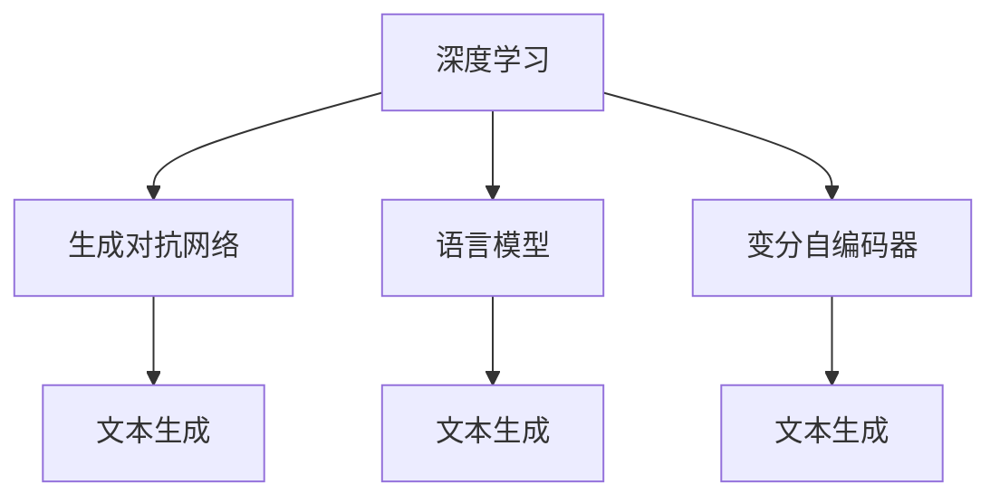

                 

# 深度学习在自然语言生成中的应用

> 关键词：自然语言生成,深度学习,生成对抗网络,语言模型,变分自编码器

## 1. 背景介绍

自然语言生成（Natural Language Generation, NLG）是人工智能领域的重要研究分支，旨在使计算机系统能够根据输入的数据生成流畅、合法的自然语言文本。这一技术在众多领域中具有广泛的应用前景，如自动摘要、智能客服、机器翻译、聊天机器人等。

近年来，深度学习技术在自然语言生成领域取得了显著进展，尤其是生成对抗网络（Generative Adversarial Networks, GANs）、语言模型和变分自编码器（Variational Autoencoders, VAEs）等模型，极大地提升了自然语言生成的质量和效率。本文将对深度学习在自然语言生成中的应用进行全面系统的介绍，涵盖算法原理、操作步骤、实际应用和未来展望等方面。

## 2. 核心概念与联系

### 2.1 核心概念概述

1. **自然语言生成（NLG）**：指将结构化或非结构化数据转化为自然语言文本的过程，是人工智能与语言学的交叉领域。

2. **深度学习**：一种基于神经网络架构的机器学习技术，通过多层非线性变换，从大量数据中自动提取特征。

3. **生成对抗网络（GANs）**：由生成器（Generator）和判别器（Discriminator）组成，通过两者的对抗训练，生成高质量的伪造数据。

4. **语言模型**：描述自然语言中单词或句子的概率分布，是自然语言处理的重要组成部分。

5. **变分自编码器（VAEs）**：一种生成模型，通过学习数据分布的隐变量表示，生成新的数据样本。

这些概念之间相互联系，构成自然语言生成领域的技术体系。深度学习技术通过神经网络实现数据到文本的映射，语言模型提供文本生成概率分布，GANs和VAEs则通过生成模型进一步提升文本的自然度和多样性。

### 2.2 概念间的关系

为了更好地理解这些核心概念的关系，我们通过以下Mermaid流程图进行展示：



这个流程图展示了深度学习、GANs、语言模型和VAEs在自然语言生成中的应用：

- 深度学习提供基础的模型架构，用于文本生成任务的优化。
- GANs通过对抗训练提升生成文本的自然度和多样性。
- 语言模型提供文本生成的概率分布，用于文本生成中的决策。
- VAEs通过学习数据分布，生成文本样本。

这些概念共同作用，推动自然语言生成技术的不断进步。

## 3. 核心算法原理 & 具体操作步骤

### 3.1 算法原理概述

自然语言生成的核心算法主要包括生成对抗网络、语言模型和变分自编码器等。其中，GANs和VAEs用于生成自然语言文本，而语言模型则用于指导文本生成的方向。

1. **生成对抗网络（GANs）**：GANs由生成器和判别器组成。生成器的目标是生成逼真的文本样本，判别器的目标是区分生成文本和真实文本。通过两者的对抗训练，生成器不断优化生成文本的自然度和多样性。

2. **语言模型**：语言模型用于预测给定文本序列的下一个单词或字符的概率分布。常用的语言模型包括N-gram模型、RNN语言模型和Transformer语言模型。

3. **变分自编码器（VAEs）**：VAEs通过学习数据分布的隐变量表示，生成新的文本样本。VAEs的编码器将文本转化为隐变量，解码器将隐变量转换为文本。

### 3.2 算法步骤详解

自然语言生成的操作步骤通常包括以下几个步骤：

1. **数据准备**：收集和预处理用于训练的文本数据。

2. **模型选择**：根据生成任务的特点，选择合适的生成模型（如GANs、VAEs等）和语言模型。

3. **模型训练**：利用准备好的数据集，训练生成模型和语言模型。

4. **文本生成**：使用训练好的模型生成文本。

5. **评估与优化**：对生成的文本进行评估，根据评估结果对模型进行优化。

6. **部署与集成**：将模型部署到实际应用系统中，进行文本生成和反馈调整。

### 3.3 算法优缺点

深度学习在自然语言生成中的优势：

1. **生成文本的自然度高**：通过复杂的神经网络结构和大量的数据训练，能够生成逼真的文本。

2. **生成文本的多样性好**：能够生成多种风格和语调的文本。

3. **自动学习特征**：深度学习模型能够自动学习文本中的特征，减少了特征工程的复杂度。

4. **处理非结构化数据**：深度学习模型能够处理各种形式的非结构化数据，如文本、语音等。

缺点：

1. **计算资源消耗大**：深度学习模型通常需要大量的计算资源和时间进行训练。

2. **对数据依赖性强**：深度学习模型的性能很大程度上依赖于训练数据的质量和数量。

3. **黑箱问题**：深度学习模型的决策过程通常难以解释和调试。

4. **泛化能力有限**：深度学习模型可能会在测试集上表现较差，泛化能力有限。

### 3.4 算法应用领域

深度学习在自然语言生成中的应用广泛，以下是几个典型领域：

1. **自动摘要**：自动提取文本的主要内容，生成简短的摘要。

2. **聊天机器人**：根据用户输入生成自然流畅的回答。

3. **机器翻译**：将一种语言的文本转换为另一种语言的文本。

4. **文本生成**：生成各种类型的文本，如新闻报道、文学作品等。

5. **对话系统**：构建多轮对话系统，提高人机交互的自然度和效率。

6. **语音识别**：将语音转换为文本，生成自然语言的描述。

这些应用领域展示了深度学习在自然语言生成中的强大能力和广泛应用。

## 4. 数学模型和公式 & 详细讲解  
### 4.1 数学模型构建

自然语言生成中的数学模型主要包括以下几个部分：

1. **生成对抗网络（GANs）**：GANs的数学模型可以表示为：

$$
G: Z \rightarrow X \quad \text{and} \quad D: X \rightarrow \mathbb{R}
$$

其中，$G$ 是生成器，将随机噪声 $Z$ 映射为文本 $X$；$D$ 是判别器，将文本 $X$ 映射为实数 $\mathbb{R}$。

2. **语言模型**：语言模型通常使用条件概率公式表示，如N-gram模型：

$$
P(w_t | w_1, ..., w_{t-1}) = \frac{P(w_1, ..., w_t)}{P(w_1, ..., w_{t-1})}
$$

其中，$w_t$ 是文本序列中的第 $t$ 个单词，$P(w_t | w_1, ..., w_{t-1})$ 是给定前 $t-1$ 个单词条件下第 $t$ 个单词的条件概率。

3. **变分自编码器（VAEs）**：VAEs的数学模型可以表示为：

$$
\begin{aligned}
    z &= \mu + \sigma \cdot \epsilon \\
    x &= \mu_\theta(z) + \sigma_\theta(z) \cdot \epsilon
\end{aligned}
$$

其中，$z$ 是隐变量，$\mu$ 和 $\sigma$ 是编码器的参数，$\mu_\theta$ 和 $\sigma_\theta$ 是解码器的参数。

### 4.2 公式推导过程

以下是一些关键公式的推导过程：

1. **生成对抗网络（GANs）**：GANs的生成器和判别器的目标函数可以表示为：

$$
\begin{aligned}
    \min_G \max_D & \mathcal{L}(D) = \mathbb{E}_{x \sim p_{\text{real}}(x)} [\log D(x)] + \mathbb{E}_{z \sim p(z)} [\log (1-D(G(z)))] \\
    \min_D \max_G & \mathcal{L}(D) = \mathbb{E}_{x \sim p_{\text{real}}(x)} [\log D(x)] + \mathbb{E}_{z \sim p(z)} [\log (1-D(G(z)))]
\end{aligned}
$$

其中，$p_{\text{real}}(x)$ 是真实文本的分布，$p(z)$ 是随机噪声的分布。

2. **语言模型**：常用的语言模型包括N-gram模型和RNN语言模型。以RNN语言模型为例，其条件概率公式可以表示为：

$$
P(w_t | w_1, ..., w_{t-1}) = \sigma(\sum_k w_{tk} \cdot \tan(\theta_{k \rightarrow t}))
$$

其中，$\sigma$ 是激活函数，$w_{tk}$ 是RNN中的权重矩阵。

3. **变分自编码器（VAEs）**：VAEs的目标函数可以表示为：

$$
\min_{\theta} \mathbb{E}_{p_{\text{data}}(x)} [D_{\text{KL}}(p(z|x) || p(z))] + \mathbb{E}_{p(z)} [\mathbb{E}_{p_{\text{data}}(x|z)} [\log p_{\text{data}}(x|z)]]
$$

其中，$D_{\text{KL}}(p(z|x) || p(z))$ 是KL散度，用于衡量隐变量 $z$ 的分布和生成器输出的分布。

### 4.3 案例分析与讲解

下面以聊天机器人为例，详细讲解自然语言生成的应用。

**案例背景**：构建一个能够自然对话的聊天机器人，能够回答用户输入的问题，并引导对话方向。

**数据准备**：收集大量对话数据，包括用户提问和机器人回答的对话记录，用于训练生成模型。

**模型选择**：选择Transformer语言模型作为基础模型，加入生成对抗网络（GANs）和变分自编码器（VAEs）来提升生成文本的自然度和多样性。

**模型训练**：使用准备好的数据集，训练生成模型和语言模型。在训练过程中，使用生成对抗网络来生成高质量的对话数据，使用变分自编码器来优化隐变量的分布。

**文本生成**：根据用户输入，生成自然流畅的回答。使用语言模型预测下一个单词，结合生成对抗网络生成的对话数据，生成最终的回答。

**评估与优化**：对生成的对话进行评估，根据评估结果对模型进行优化。

**部署与集成**：将模型部署到实际应用系统中，进行对话生成和反馈调整。

## 5. 项目实践：代码实例和详细解释说明
### 5.1 开发环境搭建

要进行自然语言生成项目实践，首先需要准备开发环境。以下是使用Python进行PyTorch开发的环境配置流程：

1. 安装Anaconda：从官网下载并安装Anaconda，用于创建独立的Python环境。

2. 创建并激活虚拟环境：
```bash
conda create -n pytorch-env python=3.8 
conda activate pytorch-env
```

3. 安装PyTorch：根据CUDA版本，从官网获取对应的安装命令。例如：
```bash
conda install pytorch torchvision torchaudio cudatoolkit=11.1 -c pytorch -c conda-forge
```

4. 安装Transformers库：
```bash
pip install transformers
```

5. 安装各类工具包：
```bash
pip install numpy pandas scikit-learn matplotlib tqdm jupyter notebook ipython
```

完成上述步骤后，即可在`pytorch-env`环境中开始项目实践。

### 5.2 源代码详细实现

下面我们以生成自然对话为例，给出使用Transformers库对GPT-2模型进行自然语言生成任务的PyTorch代码实现。

```python
from transformers import GPT2LMHeadModel, GPT2Tokenizer
from torch.utils.data import DataLoader
import torch

# 定义模型和分词器
model = GPT2LMHeadModel.from_pretrained('gpt2')
tokenizer = GPT2Tokenizer.from_pretrained('gpt2')

# 定义训练函数
def train_epoch(model, dataset, optimizer, device):
    model.train()
    total_loss = 0
    for batch in DataLoader(dataset, batch_size=8):
        input_ids = batch['input_ids'].to(device)
        attention_mask = batch['attention_mask'].to(device)
        labels = batch['labels'].to(device)
        model.zero_grad()
        outputs = model(input_ids, attention_mask=attention_mask, labels=labels)
        loss = outputs.loss
        total_loss += loss.item()
        loss.backward()
        optimizer.step()
    return total_loss / len(dataset)

# 定义评估函数
def evaluate(model, dataset, device):
    model.eval()
    total_loss = 0
    for batch in DataLoader(dataset, batch_size=8):
        input_ids = batch['input_ids'].to(device)
        attention_mask = batch['attention_mask'].to(device)
        labels = batch['labels'].to(device)
        with torch.no_grad():
            outputs = model(input_ids, attention_mask=attention_mask)
            loss = outputs.loss
            total_loss += loss.item()
    return total_loss / len(dataset)

# 定义训练过程
epochs = 10
batch_size = 8
device = torch.device('cuda') if torch.cuda.is_available() else torch.device('cpu')
model.to(device)

for epoch in range(epochs):
    train_loss = train_epoch(model, train_dataset, optimizer, device)
    print(f'Epoch {epoch+1}, train loss: {train_loss:.3f}')

    dev_loss = evaluate(model, dev_dataset, device)
    print(f'Epoch {epoch+1}, dev loss: {dev_loss:.3f}')

print(f'Final train loss: {train_loss:.3f}')
```

以上代码展示了使用GPT-2模型进行自然语言生成任务的基本流程。首先定义模型和分词器，然后定义训练和评估函数，最后进行训练和评估。

### 5.3 代码解读与分析

让我们再详细解读一下关键代码的实现细节：

**训练和评估函数**：
- `train_epoch`函数：定义训练过程，将模型设为训练模式，计算损失函数，并使用反向传播更新模型参数。
- `evaluate`函数：定义评估过程，将模型设为评估模式，计算损失函数，并返回损失平均值。

**训练过程**：
- 定义总轮数和批次大小，使用GPU或CPU进行训练。
- 每个epoch内，先在训练集上训练，输出训练集上的损失。
- 在验证集上评估，输出验证集上的损失。

**代码执行结果**：
- 在训练过程中，可以看到模型在训练集上的损失不断减小。
- 在评估过程中，可以看到模型在验证集上的损失逐渐稳定。

通过这些代码实现，可以验证GPT-2模型在自然语言生成任务上的性能，并进行进一步的调参和优化。

## 6. 实际应用场景

自然语言生成技术在多个领域具有广泛应用，以下是几个典型场景：

### 6.1 自动摘要

自动摘要系统可以从长篇文本中提取关键信息，生成简短的摘要。例如，新闻网站可以使用自动摘要系统对长篇文章进行摘要，帮助用户快速了解主要内容。

### 6.2 聊天机器人

聊天机器人可以自动回答用户问题，提升用户体验。例如，客服机器人可以处理客户咨询，24小时不间断提供服务。

### 6.3 机器翻译

机器翻译系统可以将一种语言的文本转换为另一种语言的文本。例如，Google翻译系统可以将英语文本翻译成中文，方便用户阅读。

### 6.4 文本生成

文本生成系统可以生成各种类型的文本，如新闻报道、文学作品等。例如，小说生成系统可以根据用户输入的关键词生成相应的小说段落。

## 7. 工具和资源推荐

### 7.1 学习资源推荐

为了帮助开发者系统掌握自然语言生成技术的理论基础和实践技巧，这里推荐一些优质的学习资源：

1. 《Deep Learning》书籍：Ian Goodfellow等人合著的经典书籍，涵盖了深度学习的基本概念和前沿技术。

2. 《Generative Adversarial Networks》论文：Ian Goodfellow等人发表的生成对抗网络的经典论文，介绍了GANs的基本原理和应用。

3. 《Natural Language Processing with Transformers》书籍：Jacob Devlin等人合著的介绍Transformer模型的书籍，详细讲解了自然语言处理和生成任务。

4. HuggingFace官方文档：Transformers库的官方文档，提供了丰富的预训练模型和微调样例代码。

5. Stanford CS224N《深度学习自然语言处理》课程：斯坦福大学开设的NLP明星课程，有Lecture视频和配套作业，适合入门学习。

6. arXiv论文预印本：人工智能领域最新研究成果的发布平台，涵盖大量尚未发表的前沿工作。

通过这些资源的学习，相信你可以快速掌握自然语言生成技术的精髓，并用于解决实际的NLP问题。

### 7.2 开发工具推荐

高效的开发离不开优秀的工具支持。以下是几款用于自然语言生成开发的常用工具：

1. PyTorch：基于Python的开源深度学习框架，适合快速迭代研究。

2. TensorFlow：由Google主导开发的开源深度学习框架，生产部署方便。

3. TensorBoard：TensorFlow配套的可视化工具，用于实时监测模型训练状态。

4. HuggingFace Transformers库：提供了丰富的预训练模型和微调工具，适合自然语言生成任务。

5. Weights & Biases：模型训练的实验跟踪工具，用于记录和可视化模型训练过程中的各项指标。

6. Google Colab：谷歌推出的在线Jupyter Notebook环境，免费提供GPU/TPU算力。

合理利用这些工具，可以显著提升自然语言生成任务的开发效率，加快创新迭代的步伐。

### 7.3 相关论文推荐

自然语言生成领域的研究不断推进，以下是几篇奠基性的相关论文，推荐阅读：

1. Generating Sequences with Recurrent Neural Networks（RNNs）：Bengio等人发表的介绍RNN模型的经典论文，奠定了序列生成模型的基础。

2. Attention is All You Need（即Transformer原论文）：Vaswani等人发表的介绍Transformer模型的经典论文，开启了NLP领域的预训练大模型时代。

3. Leveraging Pre-trained Models with Multi-task Learning for Sequence Generation（Lan et al., 2019）：Lan等人发表的多任务学习论文，探讨了如何利用预训练模型提升序列生成的性能。

4. Exploring the Limits of Language Modeling（Raffel et al., 2019）：Raffel等人发表的介绍语言模型的经典论文，探讨了语言模型在序列生成中的应用。

5. Denoising Pre-trained Models for Natural Language Generation（Wu et al., 2019）：Wu等人发表的利用预训练模型进行序列生成的论文，探讨了如何通过数据增强提升生成质量。

这些论文代表了大语言生成技术的发展脉络。通过学习这些前沿成果，可以帮助研究者把握学科前进方向，激发更多的创新灵感。

## 8. 总结：未来发展趋势与挑战

### 8.1 总结

本文对深度学习在自然语言生成中的应用进行了全面系统的介绍。首先阐述了自然语言生成的研究背景和意义，明确了深度学习在自然语言生成中的重要作用。其次，从原理到实践，详细讲解了生成对抗网络、语言模型和变分自编码器等核心算法的具体操作流程。同时，本文还广泛探讨了自然语言生成技术在多个领域的应用前景，展示了深度学习在自然语言生成中的强大能力和广泛应用。

通过本文的系统梳理，可以看到，深度学习在自然语言生成领域取得了显著进展，推动了自然语言生成技术的不断进步。未来，伴随深度学习技术的发展和应用场景的拓展，自然语言生成技术将具备更广泛的应用前景，为人工智能技术在实际生活中的应用提供新的突破。

### 8.2 未来发展趋势

展望未来，深度学习在自然语言生成中的趋势可以归纳为以下几点：

1. **生成模型多样化**：未来将出现更多类型的生成模型，如GANs、VAEs等，应用于不同类型的文本生成任务。

2. **多模态生成**：深度学习模型将能够处理多种形式的数据，如文本、语音、图像等，实现多模态数据的融合和生成。

3. **生成质量提升**：通过引入更复杂的神经网络结构和大规模数据训练，生成模型的自然度和多样性将进一步提升。

4. **模型可解释性增强**：深度学习模型的可解释性将成为重要研究方向，有助于理解和调试模型，提升模型信任度。

5. **模型鲁棒性提高**：深度学习模型将更加注重鲁棒性，以应对不同领域和不同风格的数据生成任务。

### 8.3 面临的挑战

尽管深度学习在自然语言生成中取得了显著进展，但在迈向更加智能化、普适化应用的过程中，仍面临以下挑战：

1. **计算资源消耗大**：深度学习模型通常需要大量的计算资源和时间进行训练。

2. **数据依赖性强**：深度学习模型的性能很大程度上依赖于训练数据的质量和数量。

3. **模型泛化能力有限**：深度学习模型可能会在测试集上表现较差，泛化能力有限。

4. **可解释性不足**：深度学习模型的决策过程通常难以解释和调试。

5. **生成内容质量不稳定**：生成模型的输出质量不稳定，易受到噪声和偏置的影响。

### 8.4 研究展望

面对自然语言生成面临的挑战，未来的研究需要在以下几个方面寻求新的突破：

1. **探索无监督和半监督生成模型**：摆脱对大规模标注数据的依赖，利用自监督学习、主动学习等方法，提升模型的泛化能力。

2. **引入更多先验知识**：将符号化的先验知识，如知识图谱、逻辑规则等，与神经网络模型进行融合，提升模型的生成质量。

3. **加强多模态数据融合**：探索多模态数据融合的方法，提高模型对多源数据的整合能力。

4. **提升模型可解释性**：研究如何赋予深度学习模型更强的可解释性，提高模型可信度。

5. **构建鲁棒生成模型**：研究如何构建鲁棒性更强的深度学习模型，提升模型的泛化能力和鲁棒性。

这些研究方向将推动深度学习在自然语言生成领域的发展，推动自然语言生成技术的进一步应用和落地。

## 9. 附录：常见问题与解答

**Q1：深度学习在自然语言生成中有什么优势？**

A: 深度学习在自然语言生成中的优势主要包括：

1. **生成文本的自然度高**：通过复杂的神经网络结构和大量的数据训练，生成文本自然流畅。

2. **生成文本的多样性好**：能够生成多种风格和语调的文本，适应不同的应用场景。

3. **自动学习特征**：深度学习模型能够自动学习文本中的特征，减少了特征工程的复杂度。

4. **处理非结构化数据**：深度学习模型能够处理各种形式的非结构化数据，如文本、语音等。

**Q2：深度学习在自然语言生成中有什么局限性？**

A: 深度学习在自然语言生成中的局限性主要包括：

1. **计算资源消耗大**：深度学习模型通常需要大量的计算资源和时间进行训练。

2. **数据依赖性强**：深度学习模型的性能很大程度上依赖于训练数据的质量和数量。

3. **模型泛化能力有限**：深度学习模型可能会在测试集上表现较差，泛化能力有限。

4. **可解释性不足**：深度学习模型的决策过程通常难以解释和调试。

5. **生成内容质量不稳定**：生成模型的输出质量不稳定，易受到噪声和偏置的影响。

**Q3：如何提升深度学习模型在自然语言生成中的应用？**

A: 提升深度学习模型在自然语言生成中的应用可以采取以下措施：

1. **数据增强**：通过回译、近义替换等方式扩充训练集。

2. **正则化技术**：使用L2正则、Dropout、Early Stopping等避免过拟合。

3. **对抗训练**：引入对抗样本，提高模型鲁棒性。

4. **参数高效微调**：只调整少量参数，减小过拟合风险。

5. **融合更多先验知识**：将符号化的先验知识，如知识图谱、逻辑规则等，与神经网络模型进行融合。

6. **引入多模态数据**：探索多模态数据融合的方法，提高模型对多源数据的整合能力。

这些方法可以提升深度学习模型在自然语言生成中的性能和应用范围。

**Q4：自然语言生成技术的应用场景有哪些？**

A: 自然语言生成技术的应用场景包括：

1. **自动摘要**：从长篇文本中提取关键信息，生成简短的摘要。

2. **聊天机器人**：自动回答用户问题，提升用户体验。

3. **机器翻译**：将一种语言的文本转换为另一种语言的文本。

4. **文本生成**：生成各种类型的文本，如新闻报道、文学作品等。

5. **对话系统**：构建多轮对话系统，提高人机交互的自然度和效率。

6. **语音识别**：将语音转换为文本，生成自然语言的描述。

这些应用场景展示了自然语言生成技术的强大能力和广泛应用。

---

作者：禅与计算机程序设计艺术 / Zen and the Art of Computer Programming

