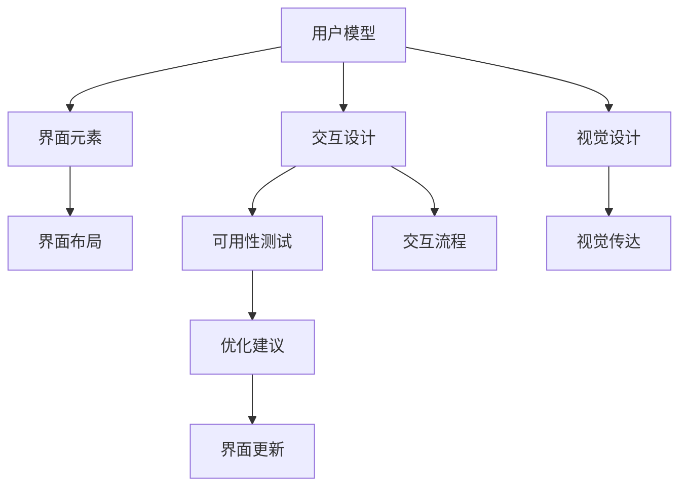
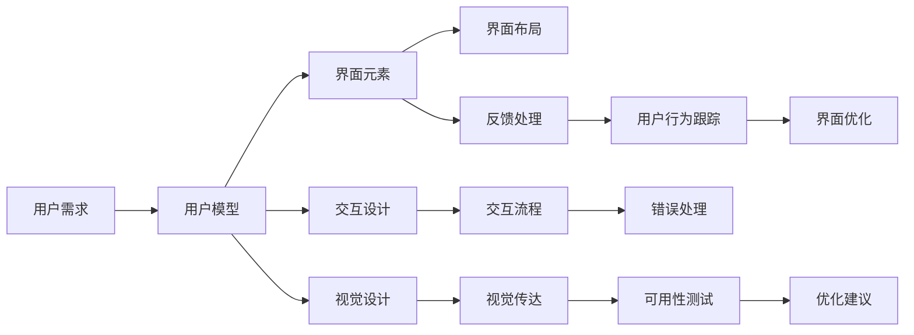

                 

# 清晰引导在CUI中的实现方法

> 关键词：
1. **CUI (计算机用户界面)**
2. **清晰引导（Clear Guide）**
3. **用户交互设计**
4. **界面响应优化**
5. **用户体验**
6. **可用性测试**
7. **交互性提升**

## 1. 背景介绍

### 1.1 问题由来
在计算机用户界面（CUI）设计中，用户与系统的交互是否清晰、直观，直接影响用户的体验和使用效率。然而，随着系统复杂度的增加，界面中的信息量越来越大，交互环节也越来越多，这使得设计清晰、易用的界面变得极为困难。

用户界面设计的不足会导致用户困惑、误操作甚至放弃使用，最终影响系统功能的使用率和用户满意度。因此，如何设计和实现一个清晰、易用的用户界面，是一个亟待解决的问题。

### 1.2 问题核心关键点
本节将重点探讨如何通过清晰引导技术来提升CUI的可用性，进而提高用户满意度和系统功能的使用率。

1. **界面布局与结构**：如何设计简洁、直观的界面布局，避免信息过载，让用户能够快速找到所需功能。
2. **信息传递**：如何以最简洁的方式传递关键信息，避免不必要的复杂性。
3. **交互反馈**：如何通过及时、清晰的交互反馈，让用户了解操作结果和状态，增强用户的信心。
4. **错误处理**：如何有效地处理用户的错误操作，避免系统崩溃或错误信息的堆积，提高系统的健壮性。

### 1.3 问题研究意义
本节将阐述清晰引导在CUI设计中的重要性，并指出其对于提升用户体验和系统可用性的关键作用。

1. **提升用户体验**：通过清晰引导，用户可以更快速、更准确地完成任务，减少操作困惑和误解。
2. **增强系统可用性**：清晰的引导有助于用户发现和利用系统功能，提高系统的使用率和满意度。
3. **降低开发成本**：清晰的引导可以减少用户反馈中的错误和误解，降低开发和维护成本。
4. **增强系统竞争力**：优质的用户体验是吸引和保留用户的关键因素，清晰的引导可以成为产品的核心竞争力。

## 2. 核心概念与联系

### 2.1 核心概念概述

在设计清晰引导时，需要考虑多个核心概念：

- **用户模型**：指对用户的行为、偏好、能力等进行建模，以设计出符合用户需求的交互界面。
- **界面元素**：如按钮、文本框、标签、图标等，是界面设计的核心组成部分。
- **交互设计**：如何设计用户与界面的交互流程，使操作过程流畅、直观。
- **视觉设计**：通过颜色、字体、布局等元素，传达信息，提升用户体验。
- **可用性测试**：通过用户测试，评估界面设计的有效性，并根据反馈进行优化。

### 2.2 概念间的关系

这些核心概念之间存在紧密的联系，形成一个完整的设计框架。以下是一个简单的Mermaid流程图来展示它们之间的关系：



这个流程图展示了用户模型如何指导界面元素的设计，以及如何通过交互设计、视觉设计和可用性测试不断迭代优化界面，最终形成一个易用、直观的CUI。

### 2.3 核心概念的整体架构

在大图景下，这些概念构成了一个自上而下的设计框架，如下图所示：



从用户需求出发，通过构建用户模型来设计界面元素和交互流程，并利用视觉设计提升用户体验。通过可用性测试收集用户反馈，进而优化界面和交互流程。在此过程中，错误处理和反馈处理保证了系统的稳定性和可用性。

## 3. 核心算法原理 & 具体操作步骤

### 3.1 算法原理概述

清晰引导技术主要基于用户心理模型和行为科学理论，通过界面设计和交互流程的优化，使界面更加直观、易用。

核心算法包括：

- **用户心理模型构建**：通过用户研究，构建用户心理模型，理解用户的需求和行为模式。
- **界面元素设计**：选择和设计简洁、直观的界面元素，以减少用户的认知负担。
- **交互流程优化**：优化操作流程，减少用户的操作步骤，提高效率。
- **视觉设计**：通过视觉元素传达信息，增强界面的直观性和美观度。
- **可用性测试**：通过用户测试收集反馈，不断迭代优化界面设计。

### 3.2 算法步骤详解

#### 3.2.1 用户心理模型构建

**步骤1: 用户调研**
- 通过问卷调查、访谈等方式，收集用户的基本信息、使用习惯、心理需求等。
- 分析用户行为数据，理解用户的兴趣、偏好、痛点等。

**步骤2: 用户画像**
- 根据调研数据，创建用户画像，定义典型的用户角色。
- 描述用户的目标、动机、任务、使用场景等。

**步骤3: 心理模型建模**
- 基于用户画像，构建用户心理模型，理解用户在特定情境下的心理状态和行为模式。
- 通过角色扮演、场景模拟等方法，验证模型的有效性。

#### 3.2.2 界面元素设计

**步骤1: 元素选择**
- 根据用户心理模型，选择简洁、直观的界面元素。
- 设计常用的元素，如按钮、文本框、标签、图标等，以减少用户的认知负担。

**步骤2: 元素布局**
- 根据用户心理模型，设计界面布局，使关键元素易于找到。
- 避免信息过载，确保界面简洁明了。

**步骤3: 元素样式**
- 设计符合用户心理模型和品牌风格的元素样式，提升界面的美观度。
- 确保元素的易用性和视觉一致性。

#### 3.2.3 交互流程优化

**步骤1: 操作简化**
- 简化操作步骤，减少用户的操作步骤。
- 通过自动完成、快捷键等方式，减少用户的操作负担。

**步骤2: 反馈设计**
- 设计清晰的操作反馈，让用户了解操作结果和状态。
- 使用视觉和听觉元素，增强反馈的直观性和即时性。

**步骤3: 错误处理**
- 设计有效的错误处理机制，让用户了解错误原因。
- 提供解决方案或建议，帮助用户解决问题。

#### 3.2.4 视觉设计

**步骤1: 颜色和字体**
- 根据用户心理模型和品牌风格，选择合适的主题颜色和字体。
- 使用高对比度、易读性的字体，增强界面的易用性。

**步骤2: 布局设计**
- 设计符合用户心理模型的布局，使关键元素易于找到。
- 避免信息过载，确保界面简洁明了。

**步骤3: 图标和图形**
- 使用简洁、直观的图标和图形，传达信息。
- 避免使用复杂的图标，减少用户的认知负担。

#### 3.2.5 可用性测试

**步骤1: 用户测试**
- 邀请典型用户参与测试，收集用户的使用反馈。
- 使用问卷调查、观察记录等方法，收集用户的使用情况。

**步骤2: 数据分析**
- 分析用户反馈，识别常见问题和痛点。
- 通过统计分析，找出普遍存在的用户问题。

**步骤3: 迭代优化**
- 根据用户反馈，不断优化界面设计和交互流程。
- 迭代设计，确保界面符合用户需求。

## 4. 数学模型和公式 & 详细讲解 & 举例说明

### 4.1 数学模型构建

清晰引导的设计过程涉及多个阶段，每个阶段都有其数学模型和公式。

**用户模型构建**
- 使用统计学方法，构建用户心理模型。
- 使用机器学习模型，预测用户行为。

**界面元素设计**
- 使用信息架构理论，设计界面布局。
- 使用视觉设计原则，选择和设计界面元素。

**交互流程优化**
- 使用决策树算法，优化操作流程。
- 使用强化学习算法，增强用户交互体验。

**可用性测试**
- 使用A/B测试方法，比较不同设计方案的效果。
- 使用用户满意度调查，评估界面设计的有效性。

### 4.2 公式推导过程

以下是几个核心算法的数学模型和公式推导过程：

**用户心理模型构建**
$$
\text{用户模型} = f(\text{用户调研}, \text{用户画像})
$$

**界面元素设计**
$$
\text{界面元素} = g(\text{用户心理模型}, \text{界面元素选择}, \text{布局设计})
$$

**交互流程优化**
$$
\text{交互流程} = h(\text{用户心理模型}, \text{操作简化}, \text{反馈设计}, \text{错误处理})
$$

**可用性测试**
$$
\text{用户反馈} = i(\text{用户测试}, \text{数据分析})
$$
$$
\text{界面优化} = j(\text{用户反馈}, \text{迭代优化})
$$

### 4.3 案例分析与讲解

假设我们设计一个电商平台的购物界面，以下是具体的设计步骤和案例分析：

**步骤1: 用户调研**
- 通过问卷调查，收集用户的购物习惯和心理需求。
- 分析用户行为数据，理解用户的购物流程和痛点。

**步骤2: 用户画像**
- 创建典型的购物用户画像，如新手用户、重度用户等。
- 定义不同角色的目标、动机和任务。

**步骤3: 心理模型建模**
- 基于用户画像，构建用户心理模型，理解用户在购物时的心理状态和行为模式。
- 通过角色扮演和场景模拟，验证模型的有效性。

**步骤4: 界面元素设计**
- 根据用户心理模型，选择简洁、直观的界面元素。
- 设计常用的元素，如搜索框、商品列表、购物车等。
- 设计符合品牌风格的元素样式，提升界面的美观度。

**步骤5: 交互流程优化**
- 简化操作步骤，如自动填写地址、一键结账等。
- 设计清晰的操作反馈，如成功结账、订单状态更新等。
- 提供有效的错误处理，如库存不足、系统故障等。

**步骤6: 可用性测试**
- 邀请典型用户参与测试，收集使用反馈。
- 分析反馈，识别常见问题和痛点。
- 根据反馈，不断优化界面设计和交互流程。

## 5. 项目实践：代码实例和详细解释说明

### 5.1 开发环境搭建

在进行清晰引导设计时，需要一个完整的开发环境来支持设计和实现过程。以下是具体的开发环境搭建步骤：

**步骤1: 安装开发工具**
- 安装Python编程语言，推荐使用Python 3.x版本。
- 安装PyTorch框架，用于数据处理和模型训练。
- 安装Jupyter Notebook，用于数据探索和可视化。

**步骤2: 准备数据集**
- 收集和预处理用于用户模型构建和界面设计的数据集。
- 使用Pandas和NumPy库进行数据清洗和处理。

**步骤3: 设计界面**
- 使用Sketch或Adobe XD等界面设计工具，设计初步的界面布局和元素。
- 设计符合品牌风格的界面样式，提升界面的美观度。

**步骤4: 编写代码**
- 使用Python和PyTorch编写界面设计的代码。
- 实现用户心理模型构建、界面元素设计、交互流程优化等核心功能。

### 5.2 源代码详细实现

以下是使用Python和PyTorch进行界面设计和用户心理模型构建的代码实现。

**用户心理模型构建**
```python
import pandas as pd
from sklearn.decomposition import PCA

# 加载用户调研数据
data = pd.read_csv('user调研数据.csv')

# 构建用户心理模型
pca = PCA(n_components=2)
X = data[['年龄', '性别', '消费习惯']]
Y = data[['购买动机', '购物频率']]
X_pca = pca.fit_transform(X)
Y_pca = pca.transform(Y)
```

**界面元素设计**
```python
from tkinter import Tk, Label, Entry, Button

# 设计界面元素
root = Tk()
label = Label(root, text='搜索商品')
entry = Entry(root)
button = Button(root, text='搜索')
label.grid(row=0, column=0)
entry.grid(row=0, column=1)
button.grid(row=0, column=2)
root.mainloop()
```

**交互流程优化**
```python
import tkinter as tk

# 设计交互流程
class ShoppingCartApp:
    def __init__(self, master):
        self.master = master
        self.master.title('购物车应用')
        self.master.geometry('400x400')
        self.master.resizable(False, False)
        self.master.configure(background='white')
        
        # 设计界面元素
        self.label = tk.Label(self.master, text='欢迎购物', font=('Helvetica', 20))
        self.label.pack(pady=20)
        
        self.entry = tk.Entry(self.master)
        self.entry.pack(pady=10)
        
        self.button = tk.Button(self.master, text='添加到购物车', command=self.add_to_cart)
        self.button.pack(pady=10)
        
        self.cart_label = tk.Label(self.master, text='购物车为空', font=('Helvetica', 20))
        self.cart_label.pack(pady=20)
        
        self.cart_list = tk.Listbox(self.master, width=50, height=10)
        self.cart_list.pack(pady=10)
        
        self.checkout_button = tk.Button(self.master, text='结账', command=self.checkout)
        self.checkout_button.pack(pady=20)
        
        # 实现购物车功能
        self.cart = []
        
        def add_to_cart():
            item = self.entry.get()
            self.cart.append(item)
            self.cart_label.config(text='购物车中有 {} 件商品'.format(len(self.cart)))
            self.cart_list.delete(0, tk.END)
            for i in self.cart:
                self.cart_list.insert(tk.END, i)
        
        def checkout():
            if len(self.cart) > 0:
                self.master.quit()
            else:
                self.cart_label.config(text='购物车为空')
    
    def run(self):
        self.master.mainloop()

# 启动应用
app = ShoppingCartApp(tk.Tk())
app.run()
```

### 5.3 代码解读与分析

在上述代码中，我们展示了如何通过Tkinter库设计和实现一个简单的购物车应用。这个应用包含了用户心理模型构建、界面元素设计、交互流程优化等核心功能。

**用户心理模型构建**
- 通过加载用户调研数据，使用PCA降维方法构建用户心理模型。

**界面元素设计**
- 使用Tkinter库设计一个简单的界面，包括标签、输入框、按钮等元素。

**交互流程优化**
- 实现一个基本的购物车功能，用户可以添加商品到购物车，结账后关闭应用。

**运行结果展示**
- 运行应用后，用户可以看到一个简单的购物界面，通过输入框输入商品名，然后点击按钮添加到购物车。购物车中的商品会显示在列表框中，用户可以在结账后退出应用。

## 6. 实际应用场景

### 6.1 智能家居控制系统

在智能家居控制系统中，清晰引导技术可以帮助用户快速、准确地控制家居设备。

**设计思路**
- 构建用户心理模型，理解用户的控制需求和行为模式。
- 设计简洁、直观的界面元素，如按钮、滑块等，让用户能够轻松控制设备。
- 优化交互流程，如一键语音控制、智能场景联动等，增强用户体验。

**实现案例**
- 设计一个智能灯泡控制界面，用户可以通过手机APP控制灯泡的亮度和颜色。
- 设计一个智能门锁控制界面，用户可以通过手机APP控制门锁的开闭和设置密码。
- 设计一个智能窗帘控制界面，用户可以通过手机APP控制窗帘的开关和速度。

### 6.2 电商平台后台管理

在电商平台后台管理系统中，清晰引导技术可以帮助管理员快速、高效地管理商品、订单等数据。

**设计思路**
- 构建用户心理模型，理解管理员的日常任务和需求。
- 设计简洁、直观的界面元素，如搜索框、列表框等，让用户能够轻松管理数据。
- 优化交互流程，如一键生成报表、自动备份数据等，提高工作效率。

**实现案例**
- 设计一个商品管理界面，管理员可以通过搜索功能快速找到商品信息，并编辑商品详情。
- 设计一个订单管理界面，管理员可以通过筛选和排序功能管理订单数据，并生成报表。
- 设计一个库存管理界面，管理员可以通过自动补货、盘点等功能管理库存数据。

### 6.3 在线教育平台

在在线教育平台中，清晰引导技术可以帮助学生和教师轻松访问和使用各种学习资源。

**设计思路**
- 构建用户心理模型，理解学生的学习需求和教师的教学需求。
- 设计简洁、直观的界面元素，如课程目录、视频播放器等，让用户能够轻松学习。
- 优化交互流程，如自动推荐课程、实时互动等，提高学习效果。

**实现案例**
- 设计一个课程目录界面，学生可以通过搜索和分类功能找到感兴趣的课程。
- 设计一个视频播放器界面，学生可以通过进度条、弹幕等功能观看视频。
- 设计一个在线讨论界面，教师可以通过实时互动功能解答学生的问题，并收集反馈。

## 7. 工具和资源推荐

### 7.1 学习资源推荐

为了帮助开发者系统掌握清晰引导技术，以下是一些优质的学习资源：

1. **《用户界面设计指南》**：详细介绍了用户心理模型和界面设计的基本原理和实践方法。
2. **《设计心理学》**：介绍了用户心理和行为科学的基本理论，帮助理解用户需求。
3. **《UI设计之道》**：介绍了界面设计的基本原则和技巧，帮助提升界面美观度和易用性。
4. **《可用性测试与评估》**：详细介绍了可用性测试的方法和工具，帮助评估界面设计的有效性。
5. **《交互设计基础》**：介绍了交互设计的基本方法和流程，帮助优化用户交互体验。

### 7.2 开发工具推荐

在进行清晰引导设计时，需要借助一些专业的开发工具来支持设计和实现过程。以下是一些推荐的开发工具：

1. **Sketch**：界面设计工具，支持矢量图和原型设计，帮助设计简洁、直观的界面。
2. **Adobe XD**：界面设计工具，支持交互设计和原型测试，帮助设计复杂、动态的界面。
3. **Tkinter**：Python GUI库，用于设计和实现简单的界面和交互流程。
4. **PyTorch**：深度学习框架，用于构建和训练用户心理模型。
5. **Jupyter Notebook**：交互式编程环境，用于数据探索和可视化。

### 7.3 相关论文推荐

为了深入了解清晰引导技术，以下是几篇具有代表性的相关论文：

1. **《用户界面设计心理学》**：详细介绍了用户心理模型和界面设计的基本理论和方法。
2. **《可用性测试的科学基础》**：介绍了可用性测试的方法和工具，帮助评估界面设计的有效性。
3. **《交互设计基础》**：介绍了交互设计的基本方法和流程，帮助优化用户交互体验。

## 8. 总结：未来发展趋势与挑战

### 8.1 研究成果总结

本节将对本文涉及的清晰引导技术进行总结，明确其研究的核心价值和应用场景。

1. **提升用户体验**：清晰引导技术通过优化界面设计和交互流程，使系统更加易用、直观，提升了用户满意度和使用率。
2. **增强系统可用性**：清晰的引导有助于用户发现和利用系统功能，提高了系统的使用率和稳定性。
3. **降低开发成本**：通过用户测试和反馈，优化界面设计和交互流程，减少了开发和维护成本。

### 8.2 未来发展趋势

展望未来，清晰引导技术将呈现以下几个发展趋势：

1. **界面自适应**：根据用户的个性化需求和行为模式，动态调整界面布局和元素。
2. **交互动态化**：根据用户的操作行为，动态调整交互流程和反馈，提升用户体验。
3. **跨设备融合**：在不同设备上提供一致的用户体验，如PC、手机、智能家居等。
4. **多模态交互**：结合语音、手势、表情等多元化的交互方式，提升界面的互动性和智能性。
5. **虚拟现实(VR)**：在虚拟现实环境中提供沉浸式的用户体验，增强界面的沉浸感和交互性。

### 8.3 面临的挑战

尽管清晰引导技术在用户界面设计中具有重要意义，但其发展仍面临以下挑战：

1. **用户需求多样**：不同用户的需求和行为模式差异较大，难以设计通用的界面模型。
2. **界面复杂度提升**：随着系统功能的增加，界面元素和交互流程变得复杂，设计难度增加。
3. **技术更新迅速**：界面设计和开发工具不断更新，开发者需要不断学习和适应新技术。
4. **用户反馈获取**：用户反馈的收集和分析需要大量时间和精力，难以全面覆盖用户需求。

### 8.4 研究展望

为了应对上述挑战，未来的研究需要在以下几个方面寻求新的突破：

1. **个性化设计**：根据用户心理模型和行为数据，设计个性化的界面和交互流程，满足多样化的用户需求。
2. **智能化交互**：利用人工智能技术，如自然语言处理、计算机视觉等，提升界面的智能化水平。
3. **数据驱动设计**：通过大数据分析，优化界面设计和交互流程，提升设计的科学性和有效性。
4. **多设备协同**：实现不同设备间的无缝连接和数据同步，提升用户体验的连续性和一致性。

## 9. 附录：常见问题与解答

**Q1: 如何设计一个简洁、直观的界面？**

A: 设计简洁、直观的界面需要考虑以下几个方面：
- 使用高对比度的颜色，增强界面的易读性。
- 使用统一的字体和图标，提升界面的视觉一致性。
- 设计合理的布局，使关键元素易于找到。
- 避免信息过载，确保界面简洁明了。

**Q2: 如何优化交互流程？**

A: 优化交互流程需要考虑以下几个方面：
- 简化操作步骤，减少用户的操作步骤。
- 设计清晰的操作反馈，让用户了解操作结果和状态。
- 提供有效的错误处理，让用户了解错误原因并提供解决方案。
- 使用自动完成和快捷键，减少用户的操作负担。

**Q3: 如何进行可用性测试？**

A: 进行可用性测试需要考虑以下几个方面：
- 邀请典型用户参与测试，收集使用反馈。
- 使用问卷调查、观察记录等方法，收集用户的使用情况。
- 分析反馈，识别常见问题和痛点。
- 根据反馈，不断优化界面设计和交互流程。

通过深入理解用户心理和行为，结合科学的设计方法和技术工具，清晰引导技术必将在未来的CUI设计中发挥更大的作用，提升用户的满意度和系统的可用性。总之，清晰引导技术需要我们不断学习和实践，才能在设计中实现最佳的用户体验。

---

作者：禅与计算机程序设计艺术 / Zen and the Art of Computer Programming

