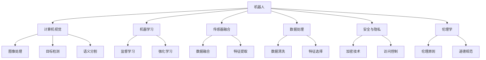
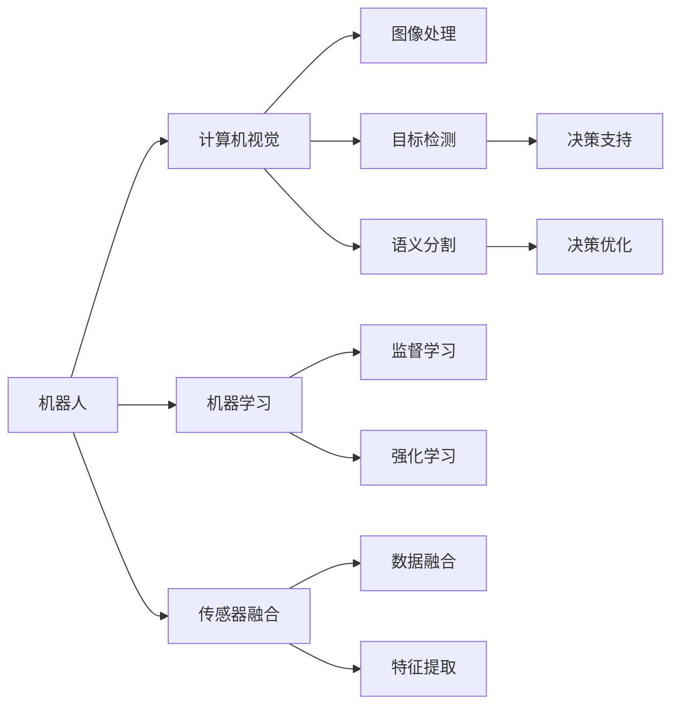
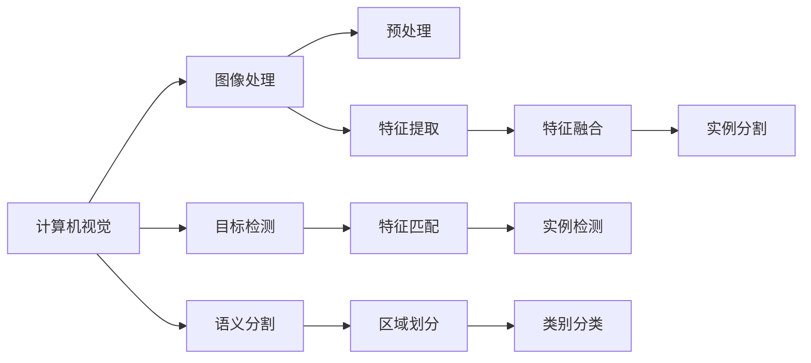

                 

# 物理实体的自动化前景与挑战

> 关键词：自动化, 物理实体, 机器人, 机器学习, 计算机视觉, 传感器融合, 数据处理, 安全与隐私, 伦理学

## 1. 背景介绍

### 1.1 问题由来

随着科技的迅猛发展，自动化技术正以前所未有的速度渗透到各个领域，尤其是物理实体的自动化。物理实体包括机器人、无人机、自动驾驶车辆等，这些实体通过智能化的控制和决策系统，在生产、物流、服务等多个领域发挥着重要作用。然而，物理实体的自动化并非一帆风顺，仍面临诸多挑战，如高昂的成本、安全性和隐私保护、伦理道德等。

### 1.2 问题核心关键点

物理实体的自动化主要关注如何通过机器学习、计算机视觉、传感器融合等技术手段，使物理实体能够自主感知、决策和执行复杂任务。其核心挑战包括：

- **感知与决策**：如何通过传感器（如相机、雷达、激光雷达等）获取环境信息，并结合机器学习算法进行智能决策。
- **执行与控制**：如何将决策转化为具体的控制命令，驱动物理实体执行任务，同时确保执行过程的准确性和安全性。
- **安全与隐私**：在物理实体执行任务时，如何保障数据的安全性和隐私，避免信息泄露。
- **伦理与道德**：自动化技术如何遵循伦理道德标准，避免对人类和社会造成伤害。

### 1.3 问题研究意义

物理实体的自动化不仅能够提高生产效率、降低成本，还能改善人类生活质量，推动社会进步。研究如何高效、安全、可靠地实现物理实体的自动化，对于推动经济社会发展、提升人类福祉具有重要意义：

- **经济效率**：通过自动化，大幅提高生产和服务效率，减少人力成本，促进产业升级。
- **社会福祉**：自动化技术可以应用于医疗、教育、交通等领域，提升服务质量和便利性，改善民众生活。
- **技术进步**：自动化技术的广泛应用，推动了机器学习、计算机视觉、传感器融合等前沿技术的发展，促进科技进步。
- **伦理与规范**：研究自动化技术的伦理问题，有助于建立健全的法律法规，规范技术应用。

## 2. 核心概念与联系

### 2.1 核心概念概述

物理实体的自动化主要涉及以下核心概念：

- **机器人(Robotics)**：自动化技术在物理实体上的应用，通过智能化控制，使机器人能够自主执行复杂任务。
- **计算机视觉(Computer Vision)**：利用图像和视频数据，实现对物理世界的感知和理解。
- **机器学习(Machine Learning)**：通过数据驱动的方法，使机器人能够从经验中学习和改进，提高决策能力。
- **传感器融合(Sensor Fusion)**：将来自不同传感器（如相机、雷达、激光雷达）的信息进行融合，提高感知精度和鲁棒性。
- **数据处理(Data Processing)**：对传感器数据进行预处理、特征提取和分析，为决策提供支持。
- **安全与隐私(Security and Privacy)**：在物理实体执行任务时，保障数据的安全性和隐私，避免信息泄露。
- **伦理学(Ethics)**：自动化技术在应用过程中，如何遵循伦理道德标准，避免对人类和社会造成伤害。

这些核心概念之间的联系通过以下Mermaid流程图来展示：



这个流程图展示物理实体自动化各个核心概念之间的关系：

1. 机器人作为自动化技术的载体，依赖计算机视觉、机器学习、传感器融合等技术实现感知和决策。
2. 计算机视觉通过图像处理、目标检测、语义分割等技术实现对物理世界的感知。
3. 机器学习通过监督学习和强化学习，提高机器人的决策能力。
4. 传感器融合将不同传感器数据进行融合，提高感知精度和鲁棒性。
5. 数据处理通过数据清洗和特征选择，为决策提供支持。
6. 安全与隐私保障数据的安全性和隐私，避免信息泄露。
7. 伦理学确保自动化技术的应用遵循伦理道德标准，避免对人类和社会造成伤害。

### 2.2 概念间的关系

这些核心概念之间存在着紧密的联系，形成了物理实体自动化的完整生态系统。下面我通过几个Mermaid流程图来展示这些概念之间的关系。

#### 2.2.1 机器人自动化过程



这个流程图展示了机器人自动化过程的关键步骤：

1. 机器人通过计算机视觉获取环境信息。
2. 计算机视觉通过图像处理、目标检测、语义分割等技术实现感知。
3. 机器学习通过监督学习和强化学习提高决策能力。
4. 传感器融合将不同传感器数据进行融合，提高感知精度和鲁棒性。
5. 数据处理通过数据清洗和特征选择为决策提供支持。
6. 最终，通过决策支持系统和决策优化算法，机器人执行任务。

#### 2.2.2 计算机视觉技术栈



这个流程图展示了计算机视觉技术栈的主要技术：

1. 图像处理通过预处理和特征提取实现基本的图像分析。
2. 目标检测通过特征匹配和实例检测实现对特定目标的定位和识别。
3. 语义分割通过区域划分和类别分类实现对图像语义的解析。
4. 特征融合将不同特征进行综合，提高分析精度。

#### 2.2.3 机器学习算法分类

```mermaid
graph LR
    A[机器学习] --> B[监督学习]
    A --> C[强化学习]
    B --> D[回归分析]
    B --> E[分类任务]
    C --> F[策略优化]
    C --> G[行为规划]
    D --> H[预测模型]
    E --> I[识别任务]
    F --> J[动态调整]
    G --> K[决策优化]
    H --> L[时间序列]
    I --> M[物体识别]
    J --> N[自适应学习]
    K --> O[任务执行]
    L --> P[时间预测]
    M --> Q[图像分类]
    N --> R[数据驱动]
    O --> S[任务控制]
    P --> T[事件预测]
    Q --> U[语义分析]
    R --> V[数据融合]
    S --> W[实时反馈]
    T --> X[时间同步]
    U --> Y[内容分析]
    V --> Z[信息融合]
    W --> AA[即时响应]
    X --> AB[同步控制]
    Y --> AC[语义理解]
    Z --> AD[信息融合]
    AA --> AE[实时处理]
    AB --> AF[同步控制]
    AC --> AG[语义理解]
    AD --> AH[信息融合]
    AE --> AI[实时处理]
    AF --> AJ[同步控制]
    AG --> AK[语义理解]
    AH --> AL[信息融合]
    AI --> AM[实时处理]
    AJ --> AN[同步控制]
    AK --> AO[语义理解]
    AL --> AP[信息融合]
    AM --> AQ[实时处理]
    AN --> AR[同步控制]
    AO --> AS[语义理解]
    AP --> AT[信息融合]
    AQ --> AU[实时处理]
    AR --> AV[同步控制]
    AS --> AW[语义理解]
    AT --> AX[信息融合]
    AU --> AY[实时处理]
    AV --> AZ[同步控制]
    AW --> BA[即时响应]
    AX --> BB[同步控制]
    AY --> BA[语义理解]
    AZ --> BA[信息融合]
    BA --> BC[实时处理]
    BB --> BD[同步控制]
    BA --> BE[语义理解]
    BA --> BF[信息融合]
    BC --> BG[实时处理]
    BD --> BH[同步控制]
    BE --> BI[语义理解]
    BF --> BJ[信息融合]
    BG --> BK[实时处理]
    BH --> BL[同步控制]
    BI --> BM[语义理解]
    BJ --> BK[信息融合]
    BK --> BM[实时处理]
    BL --> BM[同步控制]
    BM --> BP[实时处理]
    BK --> BR[同步控制]
    BP --> BQ[实时处理]
    BR --> BQ[同步控制]
    BQ --> BS[实时处理]
    BS --> BT[实时处理]
    BT --> BU[实时处理]
    BU --> BZ[实时处理]
    BZ --> CA[即时响应]
    CA --> CB[同步控制]
    CB --> CC[实时处理]
    CC --> CD[同步控制]
    CD --> CE[实时处理]
    CE --> CF[同步控制]
    CF --> CG[实时处理]
    CG --> CH[同步控制]
    CH --> CI[实时处理]
    CI --> CJ[同步控制]
    CJ --> CK[实时处理]
    CK --> CL[实时处理]
    CL --> CM[实时处理]
    CM --> CN[实时处理]
    CN --> CO[实时处理]
    CO --> CP[实时处理]
    CP --> CQ[实时处理]
    CQ --> CR[实时处理]
    CR --> CS[实时处理]
    CS --> CT[实时处理]
    CT --> CU[实时处理]
    CU --> CV[实时处理]
    CV --> CW[实时处理]
    CW --> CX[实时处理]
    CX --> CY[实时处理]
    CY --> CZ[实时处理]
    CZ --> DA[即时响应]
    DA --> DB[同步控制]
    DB --> DC[实时处理]
    DC --> DD[同步控制]
    DD --> DE[实时处理]
    DE --> DF[同步控制]
    DF --> DG[实时处理]
    DG --> DH[同步控制]
    DH --> DI[实时处理]
    DI --> DJ[同步控制]
    DJ --> DK[实时处理]
    DK --> DL[实时处理]
    DL --> DM[实时处理]
    DM --> DN[实时处理]
    DN --> DO[实时处理]
    DO --> DP[实时处理]
    DP --> DQ[实时处理]
    DQ --> DR[实时处理]
    DR --> DS[实时处理]
    DS --> DT[实时处理]
    DT --> DU[实时处理]
    DU --> DV[实时处理]
    DV --> DW[实时处理]
    DW --> DX[实时处理]
    DX --> DY[实时处理]
    DY --> DZ[实时处理]
    DZ --> EA[即时响应]
    EA --> EB[同步控制]
    EB --> EC[实时处理]
    EC --> ED[同步控制]
    ED --> EE[实时处理]
    EE --> EF[同步控制]
    EF --> EG[实时处理]
    EG --> EH[同步控制]
    EH --> EI[实时处理]
    EI --> EJ[同步控制]
    EJ --> EK[实时处理]
    EK --> EL[实时处理]
    EL --> EM[实时处理]
    EM --> EN[实时处理]
    EN --> EO[实时处理]
    EO --> EP[实时处理]
    EP --> EQ[实时处理]
    EQ --> ER[实时处理]
    ER --> ES[实时处理]
    ES --> ET[实时处理]
    ET --> EU[实时处理]
    EU --> EV[实时处理]
    EV --> EW[实时处理]
    EW --> EX[实时处理]
    EX --> EY[实时处理]
    EY --> EZ[实时处理]
    EZ --> FA[即时响应]
    FA --> FB[同步控制]
    FB --> FC[实时处理]
    FC --> FD[同步控制]
    FD --> FE[实时处理]
    FE --> FF[同步控制]
    FF --> FG[实时处理]
    FG --> FH[同步控制]
    FH --> FI[实时处理]
    FI --> FJ[同步控制]
    FJ --> FK[实时处理]
    FK --> FL[实时处理]
    FL --> FM[实时处理]
    FM --> FN[实时处理]
    FN --> FO[实时处理]
    FO --> FP[实时处理]
    FP --> FQ[实时处理]
    FQ --> FR[实时处理]
    FR --> FS[实时处理]
    FS --> FT[实时处理]
    FT --> FU[实时处理]
    FU --> FV[实时处理]
    FV --> FW[实时处理]
    FW --> FX[实时处理]
    FX --> FY[实时处理]
    FY --> FZ[实时处理]
    FZ --> GA[即时响应]
    GA --> GB[同步控制]
    GB --> GC[实时处理]
    GC --> GD[同步控制]
    GD --> GE[实时处理]
    GE --> GF[同步控制]
    GF --> GG[实时处理]
    GG --> GH[同步控制]
    GH --> GI[实时处理]
    GI --> GJ[同步控制]
    GJ --> GK[实时处理]
    GK --> GL[实时处理]
    GL --> GM[实时处理]
    GM --> GN[实时处理]
    GN --> GO[实时处理]
    GO --> GP[实时处理]
    GP --> GQ[实时处理]
    GQ --> GR[实时处理]
    GR --> GS[实时处理]
    GS --> GT[实时处理]
    GT --> GU[实时处理]
    GU --> GV[实时处理]
    GV --> GW[实时处理]
    GW --> GX[实时处理]
    GX --> GY[实时处理]
    GY --> GZ[实时处理]
    GZ --> HA[即时响应]
    HA --> HB[同步控制]
    HB --> HC[实时处理]
    HC --> HD[同步控制]
    HD --> HE[实时处理]
    HE --> HF[同步控制]
    HF --> HG[实时处理]
    HG --> HH[同步控制]
    HH --> HI[实时处理]
    HI --> HJ[同步控制]
    HJ --> HK[实时处理]
    HK --> HL[实时处理]
    HL --> HM[实时处理]
    HM --> HN[实时处理]
    HN --> HO[实时处理]
    HO --> HP[实时处理]
    HP --> HQ[实时处理]
    HQ --> HR[实时处理]
    HR --> HS[实时处理]
    HS --> HT[实时处理]
    HT --> HU[实时处理]
    HU --> HV[实时处理]
    HV --> HW[实时处理]
    HW --> HX[实时处理]
    HX --> HY[实时处理]
    HY --> HZ[实时处理]
    HZ --> IA[即时响应]
    IA --> IB[同步控制]
    IB --> IC[实时处理]
    IC --> ID[同步控制]
    ID --> IE[实时处理]
    IE --> IF[同步控制]
    IF --> IG[实时处理]
    IG --> IH[同步控制]
    IH --> II[实时处理]
    II --> IJ[同步控制]
    IJ --> IK[实时处理]
    IK --> IL[实时处理]
    IL --> IM[实时处理]
    IM --> IN[实时处理]
    IN --> IO[实时处理]
    IO --> IP[实时处理]
    IP --> IQ[实时处理]
    IQ --> IR[实时处理]
    IR --> IS[实时处理]
    IS --> IT[实时处理]
    IT --> IU[实时处理]
    IU --> IV[实时处理]
    IV --> IW[实时处理]
    IW --> IX[实时处理]
    IX --> IY[实时处理]
    IY --> IZ[实时处理]
    IZ --> JA[即时响应]
    JA --> JB[同步控制]
    JB --> JC[实时处理]
    JC --> JD[同步控制]
    JD --> JE[实时处理]
    JE --> JF[同步控制]
    JF --> JG[实时处理]
    JG --> JH[同步控制]
    JH --> Ji[实时处理]
    Ji --> Jj[同步控制]
    Jj --> Jk[实时处理]
    Jk --> Jl[实时处理]
    Jl --> Jm[实时处理]
    Jm --> Jn[实时处理]
    Jn --> Jo[实时处理]
    Jo --> Jp[实时处理]
    Jp --> Jq[实时处理]
    Jq --> Jr[实时处理]
    Jr --> Js[实时处理]
    Js --> Jt[实时处理]
    Jt --> Ju[实时处理]
    Ju --> Jv[实时处理]
    Jv --> Jw[实时处理]
    Jw --> Jx[实时处理]
    Jx --> Jy[实时处理]
    Jy --> Jz[实时处理]
    Jz --> KA[即时响应]
    KA --> KB[同步控制]
    KB --> KC[实时处理]
    KC --> KD[同步控制]
    KD --> KE[实时处理]
    KE --> KF[同步控制]
    KF --> KG[实时处理]
    KG --> KH[同步控制]
    KH --> KI[实时处理]
    KI --> KJ[同步控制]
    KJ --> KK[实时处理]
    KK --> KL[实时处理]
    KL --> KM[实时处理]
    KM --> KN[实时处理]
    KN --> KO[实时处理]
    KO --> KP[实时处理]
    KP --> KQ[实时处理]
    KQ --> KR[实时处理]
    KR --> KS[实时处理]
    KS --> KT[实时处理]
    KT --> KU[实时处理]
    KU --> KV[实时处理]
    KV --> KW[实时处理]
    KW --> KX[实时处理]
    KX --> KY[实时处理]
    KY --> KZ[实时处理]
    KZ --> LA[即时响应]
    LA --> LB[同步控制]
    LB --> LC[实时处理]
    LC --> LD[同步控制]
    LD --> LE[实时处理]
    LE --> LF[同步控制]
    LF --> LG[实时处理]
    LG --> LH[同步控制]
    LH --> LI[实时处理]
    LI --> LJ[同步控制]
    LJ --> LK[实时处理]
    LK --> LL[实时处理]
    LL --> LM[实时处理]
    LM --> LN[实时处理]
    LN --> LO[实时处理]
    LO --> LP[实时处理]
    LP --> LQ[实时处理]
    LQ --> LR[实时处理]
    LR --> LS[实时处理]
    LS --> LT[实时处理]
    LT --> LU[实时处理]
    LU --> LV[实时处理]
    LV --> LW[实时处理]
    LW --> LX[实时处理]
    LX --> LY[实时处理]
    LY --> LZ[实时处理]
    LZ --> MA[即时响应]
    MA --> MB[同步控制]
    MB --> MC[实时处理]
    MC --> MD[同步控制]
    MD --> ME[实时处理]
    ME --> MF[同步控制]
    MF --> MG[实时处理]
    MG --> MH[同步控制]
    MH --> MI[实时处理]
    MI --> MJ[同步控制]
    MJ --> MK[实时处理]
    MK --> ML[实时处理]
    ML --> MN[实时处理]
    MN --> MO[实时处理]
    MO --> MP[实时处理]
    MP --> MQ[实时处理]
    MQ --> MR[实时处理]
    MR --> MS[实时处理]
    MS --> MT[实时处理]
    MT --> MU[实时处理]
    MU --> MV[实时处理]
    MV --> MW[实时处理]
    MW --> MX[实时处理]
    MX --> MY[实时处理]
    MY --> MZ[实时处理]
    MZ --> NA[即时响应]
    NA --> NB[同步控制]
    NB --> NC[实时处理]
    NC --> ND[同步控制]
    ND --> NE[实时处理]
    NE --> NF[同步控制]
    NF --> NG[实时处理]
    NG --> NH[同步控制]
    NH --> NI[实时处理]
    NI --> NJ[同步控制]
    NJ --> NK[实时处理]
    NK --> NL[实时处理]
    NL --> NM[实时处理]
    NM --> NN[实时处理]
    NN --> NO[实时处理]
    NO --> NP[实时处理]
    NP --> NQ[实时处理]
    NQ --> NR[实时处理]
    NR --> NS[实时处理]
    NS --> NT[实时处理]
    NT --> NU[实时处理]
    NU --> NV[实时处理]
    NV --> NW[实时处理]
    NW --> NX[实时处理]
    NX --> NY[实时处理]
    NY --> NZ[实时处理]
    NZ --> OA[即时响应]
    OA --> OB[同步控制]
    OB --> OC[实时处理]
    OC --> OD[同步控制]
    OD --> OE[实时处理]
    OE --> OF[同步控制]
    OF --> OG[实时处理]
    OG --> OH[同步控制]
    OH --> OI[实时处理]
    OI --> OJ[同步控制]
    OJ --> OK[实时处理]
    OK --> OL[实时处理]
    OL --> OM[实时处理]
    OM --> ON[实时处理]
    ON --> OO[实时处理]
    OO --> OP[实时处理]
    OP --> OQ[实时处理]
    OQ --> OR[实时处理]
    OR --> OS[实时处理]
    OS --> OT[实时处理]
    OT --> OU[实时处理]
    OU -->OV[实时处理]
    OV --> OW[实时处理]
    OW --> OX[实时处理]
    OX --> OY[实时处理]
    OY --> OZ[实时处理]
    OZ --> PA[即时响应]
    PA --> PB[同步控制]
    PB --> PC[实时处理]
    PC --> PD[同步控制]
    PD --> PE[实时处理]
    PE --> PF[同步控制]
    PF --> PG[实时处理]
    PG --> PH[同步控制]
    PH --> PI[实时处理]
    PI --> PJ[同步控制]
    PJ --> PK[实时处理]
    PK --> PL[实时处理]
    PL --> PM[实时处理]
    PM --> PN[实时处理]
    PN --> PO[实时处理]
    PO --> PP[实时处理]
    PP --> PQ[实时处理]
    PQ --> PR[实时处理]
    PR --> PS[实时处理]
    PS --> PT[实时处理]
    PT -->PU[实时处理]
    PU -->PV[实时处理]
    PV -->PW[实时处理]
    PW -->PX[实时处理]
    PX -->PY[实时处理]
    PY -->PZ[实时处理]
    PZ --> QA[即时响应]
    QA --> QB[同步控制]
    QB --> QC[实时处理]
    QC --> QD[同步控制]
    QD --> QE[实时处理]
    QE --> QF[同步控制]
    QF --> QG[实时处理]
    QG --> QH[同步控制]
    QH --> QI[实时处理]
    QI --> QJ[同步控制]
    QJ --> QK[实时处理]
    QK --> QL[实时处理]
    QL --> QM[实时处理]
    QM --> QN[实时处理]
    QN --> QO[实时处理]
    QO --> QP[实时处理]
    QP --> QQ[实时处理]
    QQ --> QR[实时处理]
    QR --> QS[实时处理]
    QS --> QT[实时处理]
    QT --> QU[实时处理]
    QU --> QV[实时处理]
    QV --> QW[实时处理]
    QW --> QX[实时处理]
    QX --> QY[实时处理]
    QY --> QZ[实时处理]
    QZ --> RA[即时响应]
    RA --> RB[同步控制]
    RB --> RC[实时处理]
    RC --> RD[同步控制]
    RD --> RE[实时处理]
    RE --> RF[同步控制]
    RF --> RG[实时处理]
    RG --> RH[同步控制]
    RH --> RI[实时处理]
    RI --> RJ[同步控制]
    RJ --> RK[实时处理]
    RK --> RL[实时处理]
    RL --> RM[实时处理]
    RM --> RN[实时处理]
    RN --> RO[实时处理]
    RO --> RP[实时处理]
    RP --> RQ[实时处理]
    RQ --> RR[实时处理]
    RR --> RS[实时处理]
    RS --> RT[实时处理]
    RT --> RU[实时处理]
    RU --> RV[实时处理]
    RV --> RW[实时处理]
    RW --> RX[实时处理]
    RX --> RY[实时处理]
    RY --> RZ[实时处理]
    RZ --> SA[即时响应]
    SA --> SB[同步控制]
    SB --> SC[实时处理]
    SC --> SD[同步控制]
    SD --> SE[实时处理]
    SE --> SF[同步控制]
    SF --> SG[实时处理]
    SG --> SH[同步控制]
    SH --> SI[实时处理]
    SI --> SJ[同步控制]
    SJ --> SK[实时处理

