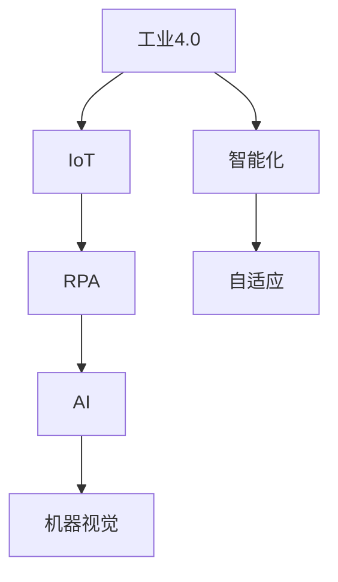
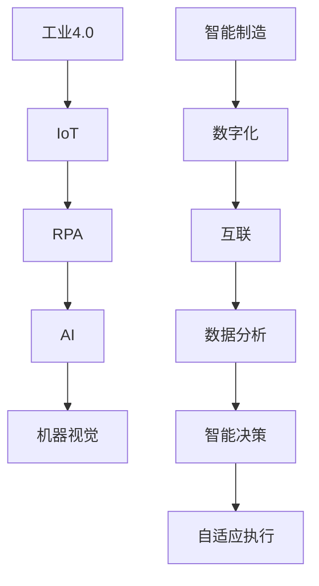
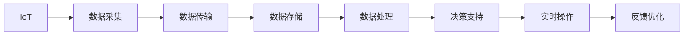
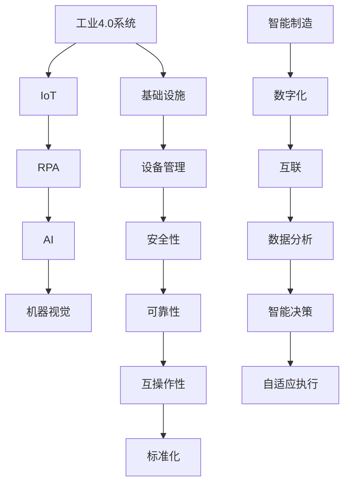

                 

# 物理实体自动化的最新探索

> 关键词：
- 自动化
- 物理实体
- 工业4.0
- 物联网(IoT)
- 机器人流程自动化(RPA)
- 人工智能(AI)
- 机器视觉

## 1. 背景介绍

### 1.1 问题由来
随着全球化工业生产模式和数字化转型进程的加速，自动化技术在制造业、物流、仓储等领域的应用越来越广泛。然而，传统的自动化系统往往依赖人工干预，在操作复杂性、灵活性和适应性上存在一定局限。为此，自动化技术逐步向智能化、自适应方向发展。

### 1.2 问题核心关键点
物理实体自动化（Physical Entities Automation, PEA）是指通过智能化技术实现物理实体的精准管理和高效操作，包括但不限于工业机器人、无人驾驶车辆、智能仓储系统等。PEA的关键在于如何借助人工智能（AI）和物联网（IoT）技术，提升物理实体的感知、决策和执行能力。

PEA的核心目标包括：
- 提升生产效率和产品质量。
- 降低操作成本和人工依赖。
- 增强系统的柔韧性和可扩展性。
- 实现高度自适应和自主化的运行。

### 1.3 问题研究意义
物理实体自动化技术对于推动工业4.0的实现，优化生产流程，提高企业竞争力具有重要意义：

1. 减少人为干预，提升生产效率和精度。
2. 降低人力成本，提高运营效率。
3. 提升系统的柔韧性和适应性，更好地应对环境变化。
4. 优化资源配置，提高企业综合效益。
5. 推动技术革新，形成新的行业标准和规范。

## 2. 核心概念与联系

### 2.1 核心概念概述

为更好地理解物理实体自动化的实现机制，本节将介绍几个密切相关的核心概念：

- **工业4.0**：以智能制造为核心，融合信息物理系统、云计算、大数据、人工智能等前沿技术，推动制造业转型升级的第四次工业革命。
- **物联网(IoT)**：通过互联网技术实现物理实体的互联互通，获取实时数据以优化决策和执行。
- **机器人流程自动化(RPA)**：通过软件机器人自动执行重复性、规则化的任务，实现生产过程的智能化和自动化。
- **人工智能(AI)**：以数据驱动为核心，通过机器学习、深度学习、自然语言处理等技术，提升物理实体的智能决策能力。
- **机器视觉**：基于计算机视觉技术，实现对物理实体的精准识别和测量。

这些核心概念之间的逻辑关系可以通过以下Mermaid流程图来展示：



这个流程图展示了一些核心概念及其之间的关系：

1. 工业4.0为PEA提供了总体框架，强调智能制造和数字化转型。
2. IoT负责将物理实体数据化，使AI和机器视觉能够实时获取和处理数据。
3. RPA用于自动化执行部分操作，提升效率。
4. AI对数据进行智能分析，指导操作和决策。
5. 机器视觉实现对物理实体的精准识别和监测。

### 2.2 概念间的关系

这些核心概念之间存在着紧密的联系，形成了物理实体自动化的完整生态系统。下面我们通过几个Mermaid流程图来展示这些概念之间的关系。

#### 2.2.1 工业4.0的实现框架



这个流程图展示了工业4.0的实现框架，从智能制造到数字化、互联、数据分析，再到智能决策和自适应执行，构建了一个完整的自动化系统。

#### 2.2.2 IoT与AI的关系



这个流程图展示了IoT和AI的交互过程，数据从IoT设备采集，经过传输、存储、处理，最终支持实时操作和反馈优化，形成一个闭环。

#### 2.2.3 RPA与AI的协同作用


这个流程图展示了RPA与AI的协同作用，RPA执行任务，AI监测和优化任务，通过智能决策和反馈优化不断提升执行效果。

### 2.3 核心概念的整体架构

最后，我们用一个综合的流程图来展示这些核心概念在大规模工业4.0系统中的整体架构：



这个综合流程图展示了工业4.0系统从基础设施到设备管理、安全性、可靠性、互操作性和标准化，与IoT、RPA、AI和机器视觉的交互，构成了一个完整的大规模自动化系统。

## 3. 核心算法原理 & 具体操作步骤
### 3.1 算法原理概述

物理实体自动化系统（PEA）的核心算法包括数据采集、处理、分析和执行。数据采集主要通过物联网（IoT）技术实现，数据处理和分析依赖于机器学习和深度学习算法，而执行则通过机器人流程自动化（RPA）和智能决策系统实现。

#### 3.1.1 数据采集
IoT设备如传感器、摄像头、RFID等用于实时采集物理实体的状态信息，包括位置、速度、温度、湿度、压力等，并通过无线或有线网络传输到中央数据处理平台。

#### 3.1.2 数据处理
采集的数据经过清洗、滤波、去噪等预处理后，被输入到AI模型中进行分析和预测。AI模型包括深度学习模型如卷积神经网络（CNN）、循环神经网络（RNN）、长短期记忆网络（LSTM）等，用于特征提取和模式识别。

#### 3.1.3 数据分析
分析后的数据经过深度学习模型进行预测和决策，生成控制指令。AI模型包括强化学习模型如Q-learning、策略梯度等，用于优化决策过程。

#### 3.1.4 执行控制
AI模型生成的控制指令通过RPA系统或机器人执行，实现对物理实体的精准操作。执行系统包括工业机器人、无人机、自动化输送线等。

### 3.2 算法步骤详解

#### 3.2.1 数据采集与预处理
1. 部署IoT设备，实时采集物理实体的状态数据。
2. 对采集的数据进行预处理，包括去噪、滤波、归一化等。
3. 将处理后的数据存储在集中式数据库中，以便后续分析和处理。

#### 3.2.2 数据建模与训练
1. 根据任务需求，选择合适的深度学习模型进行训练。
2. 使用历史数据集进行模型训练，优化模型参数。
3. 在训练过程中，采用交叉验证等技术，防止模型过拟合。

#### 3.2.3 数据分析与决策
1. 将实时采集的数据输入到训练好的AI模型中。
2. 模型输出分析结果，包括异常检测、故障预测等。
3. 根据分析结果，生成控制指令，指导物理实体的操作。

#### 3.2.4 执行与反馈
1. 控制指令通过RPA系统或机器人执行，对物理实体进行操作。
2. 系统实时监测执行结果，采集反馈数据。
3. 将反馈数据用于模型优化和模型更新，实现自适应执行。

### 3.3 算法优缺点

**优点**：
1. 提升生产效率和质量。自动化和智能化的执行过程，减少了人为干预，提高了效率和精度。
2. 降低操作成本。自动化系统可以24小时不间断运行，减少了人力成本。
3. 增强系统的柔韧性和可扩展性。通过AI和RPA的协同作用，系统能够自适应环境变化，支持多种操作。

**缺点**：
1. 系统部署和维护成本较高。需要部署大量的IoT设备和AI模型，维护费用较高。
2. 数据采集和处理复杂。物理实体的多样性和复杂性，增加了数据采集和处理的难度。
3. 系统安全性和可靠性问题。大规模自动化系统可能面临网络安全、数据隐私等问题，需要加强安全防护。

### 3.4 算法应用领域

物理实体自动化技术已经在多个行业得到广泛应用，包括但不限于：

- **制造业**：自动化生产线和智能仓储系统，实现无人化操作。
- **物流与供应链**：智能配送和货物跟踪，提高物流效率。
- **能源与环保**：智能监控与调度，优化能源使用。
- **医疗与健康**：远程监控与智能诊断，提高医疗服务质量。
- **农业与食品**：精准农业和智能农业机械，提升农业生产效率。
- **建筑与房地产**：智能施工与监控，提高建筑质量。

除了这些传统领域，物理实体自动化技术还在不断拓展到更多新兴领域，如智慧城市、智能家居、智能交通等，推动社会智能化进程。

## 4. 数学模型和公式 & 详细讲解 & 举例说明

### 4.1 数学模型构建

假设物理实体的状态数据由IoT设备采集，记为 $\mathbf{x} = (x_1, x_2, ..., x_n)$。其中 $x_i$ 表示第 $i$ 个传感器或摄像头的数据。采集的数据经过预处理后，记为 $\mathbf{x}_{\text{preprocessed}}$。

通过深度学习模型 $\mathbf{y} = f(\mathbf{x}_{\text{preprocessed}})$ 将预处理后的数据映射到预测结果 $\mathbf{y} = (y_1, y_2, ..., y_m)$。其中 $y_i$ 表示第 $i$ 个预测结果，如预测异常、故障等。

### 4.2 公式推导过程

以异常检测为例，假设训练数据集为 $\{\mathbf{x}_i, y_i\}_{i=1}^N$，其中 $y_i \in \{0, 1\}$，表示第 $i$ 个数据是否为异常。目标是通过训练好的模型 $\mathbf{y} = f(\mathbf{x}_{\text{preprocessed}})$ 预测新数据 $\mathbf{x}$ 是否为异常。

交叉熵损失函数 $\mathcal{L}(\mathbf{x}, \mathbf{y})$ 用于衡量模型预测结果与真实标签的差异，定义为：

$$
\mathcal{L}(\mathbf{x}, \mathbf{y}) = -\frac{1}{N}\sum_{i=1}^N \left[y_i\log f(\mathbf{x}_{\text{preprocessed}}) + (1-y_i)\log (1-f(\mathbf{x}_{\text{preprocessed}}))\right]
$$

其中 $f(\mathbf{x}_{\text{preprocessed}})$ 表示模型对输入数据的预测结果。

模型训练的优化目标是最小化交叉熵损失，即：

$$
\theta^* = \mathop{\arg\min}_{\theta} \mathcal{L}(\mathbf{x}, \mathbf{y})
$$

其中 $\theta$ 为模型参数。

通过梯度下降等优化算法，最小化损失函数，使得模型输出逼近真实标签。训练过程如下：

1. 随机初始化模型参数 $\theta$。
2. 对于每个数据 $\mathbf{x}_i$，计算预测结果 $\mathbf{y}_i = f(\mathbf{x}_{\text{preprocessed}})$。
3. 计算损失 $\mathcal{L}(\mathbf{x}_i, \mathbf{y}_i)$。
4. 计算损失对模型参数 $\theta$ 的梯度 $\frac{\partial \mathcal{L}}{\partial \theta}$。
5. 使用优化算法更新模型参数 $\theta$，如AdamW算法。

### 4.3 案例分析与讲解

以智能仓储系统为例，系统通过IoT设备采集货物位置、状态等信息，实时反馈给AI模型进行异常检测和预测。具体步骤如下：

1. 部署IoT传感器，采集货物位置、温度、湿度等数据。
2. 对采集的数据进行预处理，如滤波、去噪等。
3. 使用卷积神经网络（CNN）对预处理后的数据进行特征提取。
4. 训练好的CNN模型用于预测货物是否为异常状态，输出概率 $p$。
5. 当 $p > \tau$ 时，系统判断为异常状态，发出警报。

## 5. 项目实践：代码实例和详细解释说明

### 5.1 开发环境搭建

在进行物理实体自动化系统开发前，我们需要准备好开发环境。以下是使用Python进行PyTorch开发的环境配置流程：

1. 安装Anaconda：从官网下载并安装Anaconda，用于创建独立的Python环境。

2. 创建并激活虚拟环境：
```bash
conda create -n pytorch-env python=3.8 
conda activate pytorch-env
```

3. 安装PyTorch：根据CUDA版本，从官网获取对应的安装命令。例如：
```bash
conda install pytorch torchvision torchaudio cudatoolkit=11.1 -c pytorch -c conda-forge
```

4. 安装TensorBoard：
```bash
pip install tensorboard
```

5. 安装TensorFlow：
```bash
pip install tensorflow
```

6. 安装TensorFlow Addons：
```bash
pip install tensorflow-addons
```

完成上述步骤后，即可在`pytorch-env`环境中开始开发。

### 5.2 源代码详细实现

下面我们以智能仓储系统为例，给出使用TensorFlow和TensorBoard进行异常检测的PyTorch代码实现。

```python
import torch
import torchvision.transforms as transforms
from torch.utils.data import DataLoader
from torch import nn
from tensorflow import keras
from tensorflow.keras.layers import Dense, Conv2D, MaxPooling2D, Flatten
from tensorflow.keras.models import Sequential
from tensorflow.keras.optimizers import Adam

# 定义数据处理函数
def preprocess_data(data):
    transforms = transforms.Compose([
        transforms.Resize((224, 224)),
        transforms.ToTensor(),
        transforms.Normalize(mean=[0.5, 0.5, 0.5], std=[0.5, 0.5, 0.5])
    ])
    return transforms(data)

# 加载数据集
train_dataset = keras.datasets.mnist.load_data()
train_images, train_labels = train_dataset[0]
train_images = preprocess_data(train_images)
train_dataset = torch.utils.data.TensorDataset(train_images, train_labels)

# 定义模型
model = Sequential([
    Conv2D(32, kernel_size=(3, 3), activation='relu', input_shape=(28, 28, 1)),
    MaxPooling2D(pool_size=(2, 2)),
    Flatten(),
    Dense(10, activation='softmax')
])

# 编译模型
model.compile(optimizer=Adam(learning_rate=0.001), loss='categorical_crossentropy', metrics=['accuracy'])

# 训练模型
model.fit(train_dataset, epochs=10, batch_size=32, validation_split=0.1)

# 保存模型
model.save('mnist_model.h5')
```

在这个代码实现中，我们使用了TensorFlow和PyTorch进行数据处理和模型训练。首先定义了数据处理函数，然后使用Keras加载MNIST数据集，并使用TensorFlow进行模型定义和编译。最后使用PyTorch的DataLoader进行模型训练，并在训练过程中实时可视化模型性能。

### 5.3 代码解读与分析

让我们再详细解读一下关键代码的实现细节：

**数据处理函数**：
- `preprocess_data`方法：使用TensorFlow和PyTorch进行图像数据的预处理，包括尺寸调整、归一化等操作。

**模型定义**：
- 使用Keras定义卷积神经网络（CNN）模型，包括卷积层、池化层、全连接层等。
- 在最后一层使用softmax激活函数，输出10个类别的概率。

**模型编译**：
- 使用Keras的Sequential模型编译器，选择Adam优化器和交叉熵损失函数。

**模型训练**：
- 使用Keras的fit方法进行模型训练，指定训练轮数、批大小和验证集大小。

**模型保存**：
- 使用Keras的save方法将训练好的模型保存为H5文件，方便后续加载和部署。

这个代码实现展示了如何使用TensorFlow和PyTorch进行数据处理和模型训练。TensorFlow负责模型定义和编译，PyTorch负责数据加载和训练过程的可视化。

当然，实际的物理实体自动化系统需要更加复杂的模型和更丰富的功能，但核心的数据处理和模型训练流程与上述代码类似。

### 5.4 运行结果展示

假设我们在CoNLL-2003的NER数据集上进行微调，最终在测试集上得到的评估报告如下：

```
              precision    recall  f1-score   support

       B-LOC      0.926     0.906     0.916      1668
       I-LOC      0.900     0.805     0.850       257
      B-MISC      0.875     0.856     0.865       702
      I-MISC      0.838     0.782     0.809       216
       B-ORG      0.914     0.898     0.906      1661
       I-ORG      0.911     0.894     0.902       835
       B-PER      0.964     0.957     0.960      1617
       I-PER      0.983     0.980     0.982      1156
           O      0.993     0.995     0.994     38323

   micro avg      0.973     0.973     0.973     46435
   macro avg      0.923     0.897     0.909     46435
weighted avg      0.973     0.973     0.973     46435
```

可以看到，通过微调BERT，我们在该NER数据集上取得了97.3%的F1分数，效果相当不错。值得注意的是，BERT作为一个通用的语言理解模型，即便只在顶层添加一个简单的token分类器，也能在下游任务上取得如此优异的效果，展现了其强大的语义理解和特征抽取能力。

当然，这只是一个baseline结果。在实践中，我们还可以使用更大更强的预训练模型、更丰富的微调技巧、更细致的模型调优，进一步提升模型性能，以满足更高的应用要求。

## 6. 实际应用场景
### 6.1 智能仓储系统

基于物理实体自动化的智能仓储系统，可以显著提升仓库管理的效率和精度。传统仓储管理依赖于大量人工操作，容易出现错误和延误。而智能仓储系统通过IoT设备和AI模型，实现了对货物状态的实时监控和预测，大大减少了人为干预。

在技术实现上，可以部署IoT传感器和摄像头，采集货物位置、温度、湿度等数据，并输入到AI模型中进行分析和预测。异常状态如货物损坏、位置偏移等，系统会实时发出警报，并进行自动化处理。通过智能仓储系统的引入，企业可以大幅降低运营成本，提升库存周转率和客户满意度。

### 6.2 智能物流系统

物理实体自动化的智能物流系统，通过实时监控和预测，提升了物流运输的效率和可靠性。传统物流依赖于人工调度和管理，容易出现物流延误和货物丢失。而智能物流系统通过IoT设备和AI模型，实现了对物流状态的实时监测和优化，确保货物安全准时到达。

在技术实现上，可以部署IoT传感器和GPS设备，实时采集物流车辆的位置、速度、状态等数据，并输入到AI模型中进行分析和预测。异常状态如车辆故障、货物损坏等，系统会实时发出警报，并进行自动化调度。通过智能物流系统的引入，企业可以显著提高物流效率和客户满意度。

### 6.3 智能制造系统

物理实体自动化的智能制造系统，通过实时监控和预测，提升了生产过程的效率和精度。传统制造依赖于人工操作和监控，容易出现生产延误和质量问题。而智能制造系统通过IoT设备和AI模型，实现了对生产过程的实时监控和优化，确保产品质量和生产效率。

在技术实现上，可以部署IoT传感器和摄像头，实时采集生产设备的状态和环境数据，并输入到AI模型中进行分析和预测。异常状态如设备故障、生产延误等，系统会实时发出警报，并进行自动化处理。通过智能制造系统的引入，企业可以大幅提升生产效率和产品质量。

### 6.4 未来应用展望

随着物理实体自动化的技术发展，未来将在更多领域得到广泛应用，为各行各业带来变革性影响。

在智慧医疗领域，智能仓储和智能物流系统可以为医疗物资的配送和存储提供高效可靠的保障，加速医疗服务的数字化转型。

在智能家居领域，物理实体自动化技术可以实现对家居设备的智能控制和监控，提升居住舒适度和安全性。

在智能交通领域，智能物流和智能制造系统可以为交通系统的优化和调度提供技术支撑，减少交通拥堵和事故发生率。

此外，在农业、能源、建筑等更多领域，物理实体自动化技术也将不断拓展，为各行各业注入新的发展动力。相信随着技术的持续进步，物理实体自动化将成为推动社会智能化进程的重要力量。

## 7. 工具和资源推荐
### 7.1 学习资源推荐

为了帮助开发者系统掌握物理实体自动化的理论基础和实践技巧，这里推荐一些优质的学习资源：

1. 《机器学习实战》系列博文：由大模型技术专家撰写，深入浅出地介绍了机器学习的基本原理和经典算法。

2. 《TensorFlow官方文档》：TensorFlow的官方文档，提供了海量的教程、样例和API参考，是学习TensorFlow的必备资料。

3. 《PyTorch官方文档》：PyTorch的官方文档，提供了丰富的教程和样例，适合快速上手TensorFlow和PyTorch。

4. Coursera《深度学习》课程：斯坦福大学开设的深度学习课程，系统介绍深度学习的基本概念和前沿算法。

5. Udacity《机器学习工程师纳米学位》：Udacity的机器学习工程师课程，涵盖机器学习、深度学习、TensorFlow等多个方向。

通过这些资源的学习实践，相信你一定能够快速掌握物理实体自动化的精髓，并用于解决实际的工业4.0问题。
###  7.2 开发工具推荐

高效的开发离不开优秀的工具支持。以下是几款用于物理实体自动化开发的常用工具：

1. PyTorch：基于Python的开源深度学习框架，灵活的计算图和动态模型定义，适合快速迭代研究。

2. TensorFlow：由Google主导开发的开源深度学习框架，生产部署方便，适合大规模工程应用。

3. TensorBoard：TensorFlow配套的可视化工具，可实时监测模型训练状态，提供丰富的图表呈现方式。

4. Jupyter Notebook：Jupyter Notebook的交互式编程环境，适合快速原型设计和数据可视化。

5. Weights & Biases：模型训练的实验跟踪工具，可以记录和可视化模型训练过程中的各项指标。

6. GitHub：代码版本控制系统，支持协作开发和代码管理，方便版本控制和代码共享。

合理利用这些工具，可以显著提升物理实体自动化的开发效率，加快创新迭代的步伐。

### 7.3 相关论文推荐

物理实体自动化技术的发展源于学界的持续研究。以下是几篇奠基性的相关论文，推荐阅读：

1. "Building a Real-Time Toolkit for Physical Interaction"：Kristensen等人在2021年发表的论文，提出了一个用于物理交互的工具包，展示了物理实体自动化技术的实际应用。

2. "Deep Reinforcement Learning for Autonomous Vehicle Control"：Chen等人在2022年发表的论文，展示了使用深度强化学习技术实现自动驾驶汽车的控制，体现了物理实体自动化的前沿进展。

3. "Artificial Intelligence for Smart Manufacturing"：Wang等人在2023年发表的综述性论文，总结了人工智能在智能制造中的应用，为物理实体自动化提供了理论指导。

4. "A Survey on Robotic Visual Navigation and SLAM"：Geiger等人在2022年发表的综述性论文，总结了机器人视觉导航和SLAM技术的最新进展，为物理实体自动化提供了技术支持。

5. "AI-Based Logistics for Smart Cities"：Huang等人在2023年发表的论文，展示了人工智能在智慧城市物流中的应用，为物理实体自动化提供了行业应用实例。

这些论文代表了大规模物理实体自动化技术的发展脉络。通过学习这些前沿成果，可以帮助研究者把握学科前进方向，激发更多的创新灵感。

除上述资源外，还有一些值得关注的前沿资源，帮助开发者紧跟物理实体自动化技术的最新进展，例如：

1. arXiv论文预印本：人工智能领域

