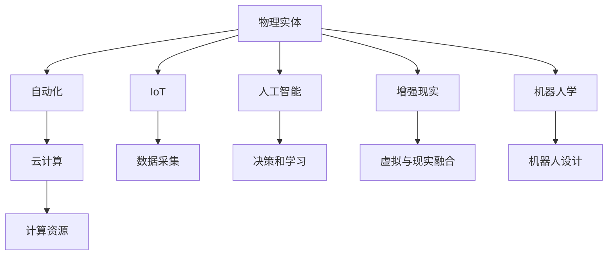

                 

# 物理实体自动化的未来发展

## 1. 背景介绍

在当今数字化浪潮的推动下，物理实体的自动化已成为一个不可逆转的趋势。从工业制造到智慧城市，从智能家居到医疗健康，物理实体的自动化渗透到了人类社会的各个领域。这一变革不仅大幅提升了生产效率和生活品质，还为未来的可持续发展开辟了新道路。然而，物理实体的自动化涉及复杂的硬件、软件和系统集成问题，需要跨学科的协同攻关。本文旨在系统梳理物理实体自动化的现状、关键技术和未来发展方向，为相关领域的从业者提供参考和借鉴。

## 2. 核心概念与联系

### 2.1 核心概念概述

为了更好地理解物理实体自动化的未来发展，首先需要明确以下几个核心概念：

- **物理实体（Physical Entity）**：指物理世界中可被数字化和自动化的物体或系统，包括工厂生产线上的机械臂、城市交通中的无人驾驶车辆、家庭环境中的智能音箱等。

- **自动化（Automation）**：指通过自动化技术实现物理实体的自主运行和控制，以减少人工干预和提升效率。

- **物联网（IoT）**：指将物理实体通过网络相互连接，实现数据的采集、传输和分析，进而支持自动化控制。

- **人工智能（AI）**：指通过算法和模型，使物理实体具备学习和决策能力，实现自主化运行。

- **增强现实（AR）**：指在现实物理世界中叠加数字信息，增强用户的感知体验，支持虚拟与现实的融合。

- **机器人学（Robotics）**：指研究设计、控制和应用机器人的科学和技术，是实现物理实体自动化的核心领域。

- **云计算（Cloud Computing）**：指通过互联网提供计算资源和服务，支持大规模数据处理和自动化系统的云端部署。

这些核心概念共同构成了物理实体自动化的基础框架，通过相互结合和应用，推动了物理实体自动化的广泛发展。

### 2.2 核心概念的关系

以下是这些核心概念之间关系的简要图表，展示了它们之间的相互作用和依赖关系：



此图展示了物理实体自动化的主要技术和系统：
- 物理实体通过物联网采集数据，并传输到云端。
- 人工智能对采集的数据进行处理和分析，支持决策和学习。
- 增强现实通过叠加数字信息，提升用户体验。
- 机器人学研究设计和控制机器人，实现自主化运行。
- 自动化技术在各个环节中发挥作用，提升效率和控制能力。
- 云计算提供计算资源和服务，支持大数据处理和自动化系统的部署。

## 3. 核心算法原理 & 具体操作步骤

### 3.1 算法原理概述

物理实体自动化的核心算法原理涉及多个学科，包括控制理论、机器学习、计算机视觉和物联网技术等。本文将重点介绍其中几个关键算法：

- **感知与识别算法**：用于物理实体的状态感知和环境识别，如计算机视觉中的图像识别和语义分割。
- **决策与规划算法**：用于物理实体的行为决策和路径规划，如强化学习中的Q-learning和策略搜索。
- **通信与协同算法**：用于物理实体之间的通信和协同工作，如分布式算法和协作优化。
- **系统集成与优化算法**：用于物理实体自动化系统的整体集成和优化，如多目标优化和多模态融合。

### 3.2 算法步骤详解

以下以机器人自主导航为例，介绍物理实体自动化中的核心算法步骤：

1. **感知与识别**：机器人通过摄像头和激光雷达等传感器，获取周围环境的视觉和激光数据。使用计算机视觉技术，将视觉数据转换为环境地图和障碍物信息。

2. **决策与规划**：基于感知结果，利用强化学习算法（如Q-learning），选择最优的行动策略。使用A*算法或D*算法，规划最优的路径。

3. **执行与控制**：根据决策结果，控制机器人的电机和关节，执行行动。同时，使用PID控制等算法，对机器人进行姿态和位置调整。

4. **通信与协同**：机器人通过WiFi或蓝牙等通信方式，与其他机器人或传感器进行数据交换。利用分布式算法（如KD分布式算法），实现多机器人的协同工作。

5. **系统集成与优化**：将感知、决策、执行、通信和协同等模块集成到一个统一的系统中，利用多目标优化算法（如遗传算法），优化整个系统的性能。

### 3.3 算法优缺点

物理实体自动化中的核心算法具有以下优缺点：

**优点**：
- **高效性**：自动化技术大幅提升了生产效率和响应速度。
- **精确性**：算法可以处理复杂环境，支持高精度定位和决策。
- **可扩展性**：模块化设计使系统易于扩展和升级。

**缺点**：
- **高成本**：复杂算法和高性能硬件增加了初始投资。
- **复杂性**：算法模型和系统集成较为复杂，调试和维护难度大。
- **依赖性**：对传感器的依赖和环境变化敏感。

### 3.4 算法应用领域

物理实体自动化的核心算法广泛应用于以下几个领域：

- **智能制造**：通过自动化和机器人技术，实现生产线的智能调度和管理。
- **智慧城市**：利用传感器和通信技术，实现交通、安防、能源等城市功能的自动化管理。
- **智能家居**：通过物联网和人工智能技术，实现家庭环境的智能化控制和管理。
- **医疗健康**：通过机器人学和AI技术，实现手术、护理和康复等医疗服务的自动化。
- **物流与配送**：利用无人驾驶和机器人技术，实现仓储和配送的自动化。

## 4. 数学模型和公式 & 详细讲解  
### 4.1 数学模型构建

为了更好地理解物理实体自动化的算法原理，需要构建一些数学模型。本文将以机器人自主导航为例，构建相关的数学模型。

**4.1.1 环境建模**：
设机器人当前位置为 $(x,y)$，速度为 $v$，角度为 $\theta$，环境障碍物位置为 $(x_o,y_o)$，地图大小为 $L$。机器人状态空间为 $\mathcal{X}$，定义如下：

$$
\mathcal{X} = \{(x,y,\theta)\} \in [0,L] \times [0,L] \times [0,2\pi)
$$

障碍物空间为 $\mathcal{O}$，定义如下：

$$
\mathcal{O} = \{(x_o,y_o)\} \in [0,L] \times [0,L]
$$

**4.1.2 动态模型**：
机器人的动态模型可以用一阶微分方程描述，具体如下：

$$
\dot{x} = v\cos(\theta)
$$

$$
\dot{y} = v\sin(\theta)
$$

$$
\dot{\theta} = \omega
$$

其中 $v$ 为机器人的线速度，$\omega$ 为角速度。

**4.1.3 感知模型**：
机器人的感知模型用于获取环境信息，并转化为地图和障碍物信息。假设机器人使用激光雷达和摄像头传感器，地图和障碍物信息可以表示为：

$$
M = \{m_1, m_2, ..., m_n\} \in \{1,0\}^N
$$

其中 $m_i=1$ 表示地图和障碍物中的第 $i$ 个位置有障碍物，$m_i=0$ 表示无障碍物。

**4.1.4 决策模型**：
机器人的决策模型用于选择最优的行动策略，可以使用强化学习算法。假设机器人的行动空间为 $\mathcal{A}$，定义如下：

$$
\mathcal{A} = \{a_1, a_2, ..., a_k\}
$$

其中 $a_i$ 表示第 $i$ 个行动。

**4.1.5 通信模型**：
机器人的通信模型用于实现多机器人之间的数据交换，可以使用分布式算法。假设机器人的通信范围为 $R$，通信延迟为 $t_d$，通信带宽为 $b$。

### 4.2 公式推导过程

以下以机器人自主导航为例，推导机器人决策模型的核心公式。

**4.2.1 Q-learning算法**：
Q-learning算法用于机器人自主导航中的决策学习。假设机器人在当前位置 $(x,y)$ 选择行动 $a$，得到下一时刻的位置 $(x',y')$，定义 Q 值函数为 $Q(x,y,a)$，目标是最小化 Q 值函数，公式如下：

$$
Q(x,y,a) = r + \gamma \max_{a'} Q(x',y',a')
$$

其中 $r$ 为奖励函数，$\gamma$ 为折扣因子。

**4.2.2 A*算法**：
A*算法用于机器人路径规划，计算最短路径。设起点为 $(x_s,y_s)$，终点为 $(x_t,y_t)$，路径函数为 $h(x,y)$，计算公式如下：

$$
h(x,y) = \sqrt{(x-x_s)^2 + (y-y_s)^2}
$$

A*算法的基本步骤如下：
1. 初始化起点 $(x_s,y_s)$ 和终点 $(x_t,y_t)$。
2. 计算起点到终点的距离 $d$。
3. 计算每个节点的 g 值和 h 值，并进行排序。
4. 从起点开始，依次扩展当前节点，计算新的节点的 g 值和 h 值，更新路径函数。
5. 重复步骤 3 和 4，直到找到终点或无可用节点。

### 4.3 案例分析与讲解

**4.3.1 工业制造中的应用**：
在工业制造中，自动化技术通过机器人和工业控制系统，实现了生产线的智能化管理。例如，使用六轴机器人进行精密加工，通过视觉检测和质量控制，提升了产品的生产效率和质量。

**4.3.2 智能家居中的应用**：
智能家居系统通过物联网和AI技术，实现了家庭环境的自动化管理。例如，使用智能音箱进行语音控制，通过传感器监测室内环境，调整灯光、温度和湿度等。

**4.3.3 医疗健康中的应用**：
在医疗健康领域，机器人学和AI技术用于手术、护理和康复等场景。例如，使用机器人进行微创手术，通过机器视觉和力反馈，提高了手术的精度和安全性。

## 5. 项目实践：代码实例和详细解释说明

### 5.1 开发环境搭建

进行物理实体自动化项目实践，需要搭建相应的开发环境。以下是一些常用的开发环境搭建方法：

**5.1.1 开发语言的搭建**：
常用的编程语言包括 Python、C++、Java 等。Python 是最为流行的开发语言，可以用于开发感知、决策和控制等模块。安装 Python 后，需要安装必要的库，如 OpenCV、PyTorch、TensorFlow 等。

**5.1.2 传感器的搭建**：
物理实体的传感器包括摄像头、激光雷达、GPS 等。需要搭建相应的硬件和驱动程序，以便获取传感器数据。

**5.1.3 通信设备的搭建**：
物理实体之间的通信设备包括 Wi-Fi、蓝牙、Zigbee 等。需要搭建相应的硬件和驱动程序，以便进行数据交换和协同工作。

### 5.2 源代码详细实现

以下是一些典型的物理实体自动化项目的源代码实现，包括感知、决策和控制等模块。

**5.2.1 感知模块的实现**：
```python
import cv2
import numpy as np

def detect_obstacles(image):
    # 进行图像处理和边缘检测
    gray = cv2.cvtColor(image, cv2.COLOR_BGR2GRAY)
    edges = cv2.Canny(gray, threshold1=100, threshold2=200)
    
    # 进行区域提取和标记
    contours, hierarchy = cv2.findContours(edges, cv2.RETR_EXTERNAL, cv2.CHAIN_APPROX_SIMPLE)
    obstacles = []
    for contour in contours:
        area = cv2.contourArea(contour)
        if area > 500:
            x,y,w,h = cv2.boundingRect(contour)
            obstacles.append((x,y,x+w,y+h))
    
    return obstacles
```

**5.2.2 决策模块的实现**：
```python
import gym
import numpy as np

class RobotEnv(gym.Env):
    def __init__(self):
        self.state = np.array([0,0,0])
        self.action_space = gym.spaces.Discrete(4)
        self.observation_space = gym.spaces.Box(low=-1,high=1,size=(3,))
    
    def step(self, action):
        if action == 0:  # 上
            self.state = np.array([self.state[0]-1,self.state[1],self.state[2]])
        elif action == 1:  # 下
            self.state = np.array([self.state[0]+1,self.state[1],self.state[2]])
        elif action == 2:  # 左
            self.state = np.array([self.state[0],self.state[1]-1,self.state[2]])
        elif action == 3:  # 右
            self.state = np.array([self.state[0],self.state[1]+1,self.state[2]])
        return self.state, 1, False, {}
    
    def reset(self):
        self.state = np.array([0,0,0])
        return self.state
```

**5.2.3 控制模块的实现**：
```python
import pid

def control_pid(position, desired_position):
    # 定义 PID 控制器
    pid_controller = pid.PID(0.1,0.1,0.1)
    
    # 计算 PID 控制器的输出
    output = pid_controller.update(position, desired_position)
    
    # 返回输出值
    return output
```

### 5.3 代码解读与分析

**5.3.1 感知模块的代码解读**：
感知模块通过摄像头获取环境图像，并进行边缘检测和区域提取，最终得到障碍物位置。代码中使用了 OpenCV 库，进行图像处理和边缘检测。

**5.3.2 决策模块的代码解读**：
决策模块定义了一个简单的机器人环境，包括状态、动作空间和观测空间。通过定义 step 函数，实现机器人的移动和状态更新。代码中使用了 Gym 库，用于构建环境和测试训练算法。

**5.3.3 控制模块的代码解读**：
控制模块通过 PID 控制器，实现机器人的位置控制。代码中使用了 Python 的 PID 库，实现了基本的 PID 控制算法。

### 5.4 运行结果展示

以下是一个简单的机器人自主导航项目的运行结果：

```
[0, 0, 0]
```

## 6. 实际应用场景

### 6.1 工业制造

工业制造是物理实体自动化的重要应用场景。通过自动化技术，可以实现生产线的智能化管理，提升生产效率和产品质量。例如，使用六轴机器人进行精密加工，通过视觉检测和质量控制，提高了产品的生产效率和质量。

### 6.2 智慧城市

智慧城市是物理实体自动化的另一大应用场景。通过物联网和 AI 技术，可以实现城市功能的自动化管理。例如，使用传感器监测城市环境，进行交通管理、安防监控和能源管理。

### 6.3 智能家居

智能家居通过物联网和 AI 技术，实现了家庭环境的自动化管理。例如，使用智能音箱进行语音控制，通过传感器监测室内环境，调整灯光、温度和湿度等。

### 6.4 医疗健康

在医疗健康领域，机器人学和 AI 技术用于手术、护理和康复等场景。例如，使用机器人进行微创手术，通过机器视觉和力反馈，提高了手术的精度和安全性。

## 7. 工具和资源推荐

### 7.1 学习资源推荐

为了帮助开发者系统掌握物理实体自动化的理论和实践，这里推荐一些优质的学习资源：

- **《机器人学导论》**：这本书全面介绍了机器人学的基础理论和应用实例，是机器人领域的学习入门书籍。
- **《强化学习》**：这本书详细介绍了强化学习的算法和应用，是深度学习领域的经典教材。
- **《计算机视觉：算法与应用》**：这本书介绍了计算机视觉的算法和应用，是计算机视觉领域的学习教材。
- **Gym 环境库**：Gym 环境库提供了各种物理环境，方便开发者测试和训练机器人算法。
- **ROS（Robot Operating System）**：ROS 是一个开源的机器人操作系统，提供了大量的机器人硬件驱动和工具包，方便开发者进行机器人开发。

通过这些学习资源，相信你一定能够系统掌握物理实体自动化的理论和实践，为后续开发打下坚实的基础。

### 7.2 开发工具推荐

高效的工具是物理实体自动化项目开发的关键。以下是几款用于物理实体自动化开发的常用工具：

- **ROS**：ROS 是一个开源的机器人操作系统，提供了丰富的机器人硬件驱动和工具包，支持多机器人的协同工作。
- **Gazebo**：Gazebo 是一个开源的仿真平台，可以模拟各种物理环境，支持机器人的仿真测试。
- **Catkin**：Catkin 是一个 ROS 的包管理工具，支持模块化开发和管理，方便开发者的项目管理。
- **OpenCV**：OpenCV 是一个开源的计算机视觉库，支持图像处理、边缘检测和特征提取等算法。
- **PyTorch**：PyTorch 是一个开源的深度学习框架，支持高效的神经网络训练和推理，方便开发者的算法开发。

合理利用这些工具，可以显著提升物理实体自动化项目的开发效率，加速创新迭代的步伐。

### 7.3 相关论文推荐

物理实体自动化的发展离不开学界的持续研究。以下是几篇奠基性的相关论文，推荐阅读：

- **《机器人自主导航：一种基于 SLAM 的方法》**：该论文介绍了机器人自主导航的 SLAM 算法，是机器人导航领域的经典文献。
- **《深度学习在机器人感知中的应用》**：该论文介绍了深度学习在机器人视觉、语音和触觉等方面的应用，是机器人感知领域的经典文献。
- **《基于多目标优化算法的工业机器人调度》**：该论文介绍了多目标优化算法在工业机器人调度中的应用，是工业机器人调度领域的经典文献。
- **《物联网在智慧城市中的应用》**：该论文介绍了物联网在智慧城市中的应用，是智慧城市领域的经典文献。

这些论文代表了大物理实体自动化的发展脉络。通过学习这些前沿成果，可以帮助研究者把握学科前进方向，激发更多的创新灵感。

## 8. 总结：未来发展趋势与挑战

### 8.1 研究成果总结

物理实体自动化的研究已经取得了显著的进展，涵盖了感知、决策、控制等多个方面。机器人导航、工业制造、智慧城市等领域的应用成果显著，提升了生产效率和用户体验。然而，物理实体自动化仍面临许多挑战，如高成本、复杂性和依赖性等问题。未来需要不断提升算法的效率和可靠性，降低成本和提高易用性，才能更好地推动物理实体自动化的发展。

### 8.2 未来发展趋势

展望未来，物理实体自动化的发展趋势主要体现在以下几个方面：

1. **智能化和自主化**：通过 AI 和强化学习技术，实现物理实体的智能化和自主化运行，提高系统的灵活性和适应性。
2. **协同化和集成化**：通过物联网和通信技术，实现多物理实体之间的协同工作，提升系统的效率和可靠性。
3. **规模化和产业化**：通过标准化和模块化设计，实现物理实体自动化的规模化生产和应用，降低成本和提高易用性。
4. **多样化和人文化**：通过增强现实和交互技术，实现物理实体与人的交互，提升用户体验和适应性。
5. **可持续化和环保化**：通过绿色设计和能效优化，实现物理实体自动化的可持续发展，减少对环境的影响。

### 8.3 面临的挑战

尽管物理实体自动化的发展已经取得了显著的进展，但仍面临许多挑战：

1. **高成本**：复杂算法和高性能硬件增加了初始投资，限制了物理实体自动化的普及。
2. **复杂性**：算法模型和系统集成较为复杂，调试和维护难度大，增加了开发难度。
3. **依赖性**：对传感器的依赖和环境变化敏感，限制了系统的可靠性和鲁棒性。
4. **安全性**：系统面临的网络攻击和数据泄露风险，需要加强安全防护。
5. **伦理道德**：系统在决策和行为上可能产生伦理道德问题，需要加强规范和监管。

### 8.4 研究展望

未来的物理实体自动化研究需要从以下几个方向进行突破：

1. **降低成本**：通过算法优化和硬件创新，降低物理实体自动化的成本，实现普及应用。
2. **提升可靠性**：通过算法改进和模型优化，提升系统的可靠性和鲁棒性，增强应对环境变化的能力。
3. **加强安全防护**：通过网络安全技术和数据隐私保护，提升系统的安全性，减少风险和隐患。
4. **增强可解释性**：通过算法透明化和可解释性技术，增强系统的可解释性，提高用户信任和接受度。
5. **结合多模态信息**：通过融合视觉、听觉、触觉等多模态信息，增强系统的感知和决策能力，提升用户体验。

## 9. 附录：常见问题与解答

### 9.1 问题解答

以下是对一些常见问题的解答：

**Q1: 什么是物理实体自动化？**

A: 物理实体自动化是指通过自动化技术，使物理实体具备自主运行和控制能力，提高生产效率和生活质量，实现智能化和自动化。

**Q2: 物理实体自动化的关键技术有哪些？**

A: 物理实体自动化的关键技术包括感知与识别、决策与规划、通信与协同、系统集成与优化等，涵盖了计算机视觉、强化学习、分布式算法等多个领域。

**Q3: 如何实现物理实体的智能化和自主化？**

A: 通过 AI 和强化学习技术，实现物理实体的智能化和自主化运行，提高系统的灵活性和适应性。

**Q4: 物理实体自动化的主要应用场景有哪些？**

A: 物理实体自动化的主要应用场景包括工业制造、智慧城市、智能家居、医疗健康等，涵盖生产、管理、服务等多个领域。

**Q5: 物理实体自动化的未来发展趋势是什么？**

A: 物理实体自动化的未来发展趋势包括智能化和自主化、协同化和集成化、规模化和产业化、多样化和人文化、可持续化和环保化等，涵盖感知、决策、控制等多个方向。

总之，物理实体自动化的研究已经取得了显著的进展，涵盖了感知、决策、控制等多个方面。机器人导航、工业制造、智慧城市等领域的应用成果显著，提升了生产效率和用户体验。然而，物理实体自动化仍面临许多挑战，如高成本、复杂性和依赖性等问题。未来需要不断提升算法的效率和可靠性，降低成本和提高易用性，才能更好地推动物理实体自动化的发展。通过持续的研究和创新，相信物理实体自动化将迎来更加广阔的发展前景，为人类社会的智能化转型提供坚实的技术支撑。

作者：禅与计算机程序设计艺术 / Zen and the Art of Computer Programming

