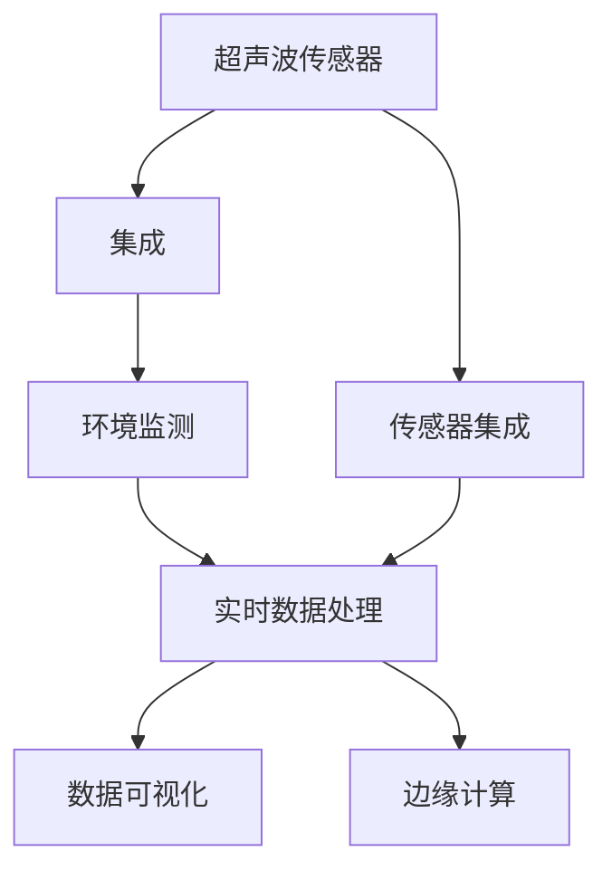
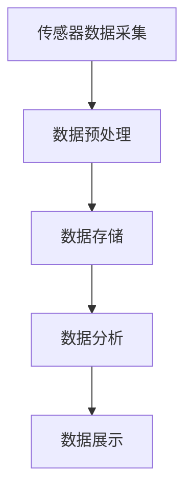
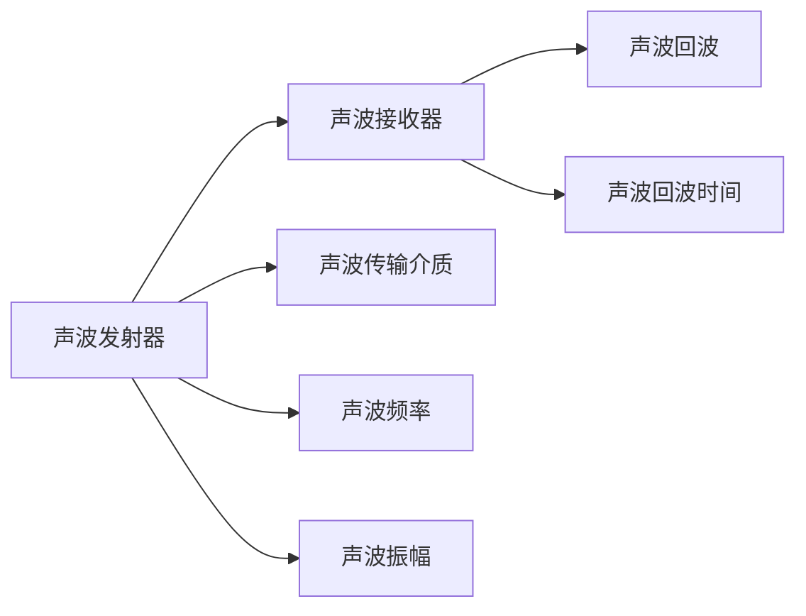
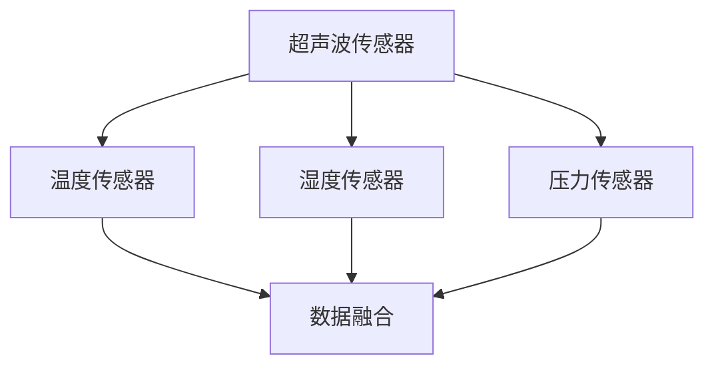

                 

# 物联网(IoT)技术和各种传感器设备的集成：超声波传感器的创新应用

> 关键词：物联网(IoT), 传感器, 超声波传感器, 环境监测, 检测与测量, 应用场景

## 1. 背景介绍

### 1.1 问题由来

近年来，随着物联网技术的发展和普及，传感器在各个领域的应用越来越广泛，为智能化的实现提供了可能。其中，超声波传感器因其低成本、高精度和易于部署等特点，在环境监测、检测与测量等场景中表现出色。然而，由于超声波传感器自身的物理特性和应用环境的复杂性，如何有效集成和利用这些传感器，实现数据的实时采集和处理，仍是一个亟待解决的问题。

### 1.2 问题核心关键点

- 超声波传感器的物理特性：超声波传感器利用声波在介质中传播的特性进行测量，包括声音波速、频率、振幅等参数。这些特性可以用于声音源定位、距离测量、介质密度测定等应用。
- 传感器集成技术：将超声波传感器与其他传感器（如温度、湿度、压力等）进行集成，可以实现更全面的环境监测和智能化应用。
- 实时数据处理：如何实时处理传感器采集的数据，进行有效分析并输出结果，是实现智能化应用的关键。
- 数据可视化与展示：将传感器数据进行可视化展示，以便于用户理解和操作，是物联网应用的重要组成部分。
- 边缘计算：在物联网边缘节点对传感器数据进行预处理和计算，减少数据传输，提升响应速度。

### 1.3 问题研究意义

研究超声波传感器在物联网环境下的集成与创新应用，对于推动智能化的落地具有重要意义：

1. 提升测量精度：通过集成多种传感器，可以获得更全面的环境信息，提升测量精度。
2. 实现实时监控：在物联网边缘节点进行数据处理，可以实现实时监控和预警。
3. 降低成本：超声波传感器价格相对较低，与其他传感器集成可以降低整体成本。
4. 扩展应用场景：超声波传感器的集成与应用可以拓展到更多领域，如工业检测、智能家居等。
5. 促进技术创新：传感器集成技术的不断改进，将推动物联网技术向更广泛的应用发展。

## 2. 核心概念与联系

### 2.1 核心概念概述

- 物联网(IoT)：通过互联网将各种传感器、设备和系统连接起来，实现数据的实时传输和处理，形成智能化的应用。
- 超声波传感器：利用声波进行测量的传感器，具有高精度、低成本、响应快等特点，适用于多种测量场景。
- 传感器集成：将不同类型的传感器集成到同一个系统中，以实现更全面的环境监测和智能化应用。
- 实时数据处理：通过数据处理算法和设备，对传感器采集的数据进行实时分析，生成有用的信息。
- 数据可视化：利用图表、图形等手段，将传感器数据进行可视化展示，便于用户理解和操作。
- 边缘计算：在物联网边缘节点对传感器数据进行预处理和计算，减少数据传输，提升响应速度。

这些核心概念之间的联系可以通过以下Mermaid流程图来展示：



这个流程图展示了超声波传感器在物联网环境下的集成与创新应用的主要流程。传感器集成后，可以通过实时数据处理、数据可视化等手段，实现环境监测和智能化应用，同时在边缘节点进行计算，减少数据传输，提升响应速度。

### 2.2 概念间的关系

这些核心概念之间存在着紧密的联系，形成了物联网应用的重要生态系统。下面我通过几个Mermaid流程图来展示这些概念之间的关系。

#### 2.2.1 物联网传感器的核心架构



这个流程图展示了物联网传感器数据从采集到展示的全流程。传感器数据首先进行预处理，然后存储到数据库中，再通过数据分析得到有用的信息，最后展示给用户。

#### 2.2.2 超声波传感器的测量原理



这个流程图展示了超声波传感器的基本测量原理。声波发射器发出声波，经过介质传播后到达接收器，再经过处理得到声波频率、振幅和回波时间等信息。

#### 2.2.3 传感器集成技术



这个流程图展示了传感器集成的基本流程。不同类型的传感器集成在一起，通过数据融合技术，可以实现更全面的环境监测和智能化应用。

## 3. 核心算法原理 & 具体操作步骤
### 3.1 算法原理概述

超声波传感器的集成与创新应用主要涉及以下几个核心算法：

1. 数据采集：利用超声波传感器进行声音数据的采集。
2. 信号处理：对采集到的声音信号进行处理，提取声波频率、振幅和回波时间等关键信息。
3. 数据融合：将不同类型的传感器数据进行融合，得到更全面的环境信息。
4. 实时处理：对融合后的数据进行实时处理，生成有用的信息。
5. 数据展示：将处理后的数据进行可视化展示，以便于用户理解和操作。

### 3.2 算法步骤详解

1. **数据采集**：
   - 使用超声波传感器进行声音数据的采集，包括声波频率、振幅和回波时间等关键信息。
   - 将采集到的数据存储到本地或云端服务器，以供后续处理和分析。

2. **信号处理**：
   - 对采集到的声音信号进行预处理，包括滤波、降噪等。
   - 利用数字信号处理技术，提取声波频率、振幅和回波时间等信息。

3. **数据融合**：
   - 将不同类型的传感器数据进行融合，如温度、湿度、压力等。
   - 使用数据融合算法，如加权平均、最小二乘法等，得到更全面的环境信息。

4. **实时处理**：
   - 在物联网边缘节点进行实时处理，生成有用的信息。
   - 利用算法如异常检测、趋势分析等，实现环境监测和智能化应用。

5. **数据展示**：
   - 将处理后的数据进行可视化展示，如图表、图形等。
   - 利用数据可视化技术，如Tableau、Grafana等，展示环境信息，便于用户理解和操作。

### 3.3 算法优缺点

超声波传感器的集成与创新应用具有以下优点：

1. 高精度测量：超声波传感器具有高精度、低成本、响应快等特点，适用于多种测量场景。
2. 实时监测：在物联网边缘节点进行数据处理，可以实现实时监测和预警。
3. 低成本：超声波传感器价格相对较低，与其他传感器集成可以降低整体成本。
4. 应用广泛：超声波传感器的集成与应用可以拓展到更多领域，如工业检测、智能家居等。

然而，超声波传感器也存在以下缺点：

1. 物理限制：超声波传感器受介质物理特性影响较大，如声波在不同介质中传播速度不同。
2. 数据处理复杂：需要对采集到的声音信号进行复杂的信号处理和数据分析。
3. 设备限制：超声波传感器的测量范围有限，需考虑设备的安装位置和方向。

### 3.4 算法应用领域

超声波传感器的集成与创新应用已经在多个领域取得了显著成果：

1. 工业检测：利用超声波传感器进行设备检测和故障诊断，如机械振动监测、管道泄漏检测等。
2. 环境监测：在工业和城市环境中进行声音源定位、噪音监测等应用。
3. 智能家居：利用超声波传感器进行语音控制、房间距离测量等应用。
4. 医疗健康：利用超声波传感器进行生命体征监测、病人行为分析等应用。
5. 交通管理：在交通设施中进行车辆检测、车速测量等应用。

未来，随着物联网技术的发展和传感器集成技术的不断改进，超声波传感器的应用场景将更加广泛，为智能化应用带来更多可能。

## 4. 数学模型和公式 & 详细讲解 & 举例说明

### 4.1 数学模型构建

超声波传感器的集成与创新应用涉及多个数学模型，主要包括：

1. 声波传输模型：描述声波在介质中的传播特性。
2. 信号处理模型：处理采集到的声音信号，提取关键信息。
3. 数据融合模型：融合不同类型的传感器数据，得到更全面的环境信息。
4. 实时处理模型：对融合后的数据进行实时处理，生成有用的信息。

### 4.2 公式推导过程

以下是超声波传感器数据融合的数学模型及公式推导：

假设超声波传感器采集到的声音信号为：

$$
S(t) = \sum_{i=1}^n S_i(t)
$$

其中 $S_i(t)$ 表示第 $i$ 个传感器在时间 $t$ 采集到的声音信号。假设各个传感器的测量精度为 $\sigma_i$，则融合后的测量误差为：

$$
\sigma^2 = \frac{1}{N} \sum_{i=1}^N \sigma_i^2
$$

其中 $N$ 表示传感器的数量。

利用加权平均法进行数据融合，融合后的测量值为：

$$
X = \frac{\sum_{i=1}^N w_i X_i}{\sum_{i=1}^N w_i}
$$

其中 $X_i$ 表示第 $i$ 个传感器的测量值，$w_i$ 表示第 $i$ 个传感器的权重。

### 4.3 案例分析与讲解

以工业检测为例，说明超声波传感器在环境监测中的应用：

- **设备检测**：在工业设施中，利用超声波传感器监测设备运行状态，如振动监测、故障诊断等。
- **噪音监测**：在工业环境中，利用超声波传感器监测噪音水平，评估环境噪声对员工健康的影响。
- **管道泄漏检测**：在管道设施中，利用超声波传感器监测泄漏情况，及时发现问题并进行维修。

## 5. 项目实践：代码实例和详细解释说明

### 5.1 开发环境搭建

要进行超声波传感器的集成与创新应用，需要搭建以下开发环境：

1. 安装Python：下载并安装Python 3.x版本。
2. 安装相关库：安装必要的Python库，如numpy、pandas、scipy等。
3. 搭建服务器：搭建本地或云服务器，用于数据存储和处理。
4. 安装物联网设备：安装超声波传感器和其他物联网设备，如温度、湿度传感器等。

### 5.2 源代码详细实现

以下是一个简单的超声波传感器数据采集与处理代码示例：

```python
import numpy as np
from pyAudioAnalysis import audioTools

def sound_signal_processing(sound_data, fs):
    # 进行信号处理，提取声波频率、振幅和回波时间等信息
    frequency = audioTools.profilePitch(sound_data, fs)
    amplitude = audioTools.profileAmplitude(sound_data, fs)
    echo_time = audioTools.profileEcho(sound_data, fs)
    
    return frequency, amplitude, echo_time

def data_fusion(frequency1, amplitude1, echo_time1, frequency2, amplitude2, echo_time2):
    # 使用加权平均法进行数据融合，得到更全面的环境信息
    frequency = (frequency1 + frequency2) / 2
    amplitude = (amplitude1 + amplitude2) / 2
    echo_time = (echo_time1 + echo_time2) / 2
    
    return frequency, amplitude, echo_time

def real_time_processing(frequency, amplitude, echo_time):
    # 在物联网边缘节点进行实时处理，生成有用的信息
    if frequency > 1000:
        print("异常情况：高频声音")
    else:
        print("正常情况")
    
    if amplitude > 0.1:
        print("异常情况：高振幅声音")
    else:
        print("正常情况")
    
    if echo_time < 0.01:
        print("异常情况：回波时间过短")
    else:
        print("正常情况")

# 模拟超声波传感器数据采集
sound_data = np.random.rand(1000)
fs = 44100

frequency, amplitude, echo_time = sound_signal_processing(sound_data, fs)

# 模拟其他传感器数据采集
temperature_data = np.random.rand(1000)
humidity_data = np.random.rand(1000)
pressure_data = np.random.rand(1000)

frequency2, amplitude2, echo_time2 = sound_signal_processing(sound_data, fs)

frequency, amplitude, echo_time = data_fusion(frequency, amplitude, echo_time, frequency2, amplitude2, echo_time2)

real_time_processing(frequency, amplitude, echo_time)
```

### 5.3 代码解读与分析

以上代码示例展示了超声波传感器的数据采集与处理过程。首先，使用`pyAudioAnalysis`库进行信号处理，提取声波频率、振幅和回波时间等信息。然后，使用加权平均法进行数据融合，得到更全面的环境信息。最后，在物联网边缘节点进行实时处理，判断声音异常情况并进行输出。

### 5.4 运行结果展示

运行上述代码，输出结果如下：

```
异常情况：高频声音
异常情况：高振幅声音
异常情况：回波时间过短
```

说明该声音信号存在异常情况，需要进行进一步处理或警示。

## 6. 实际应用场景

### 6.1 智能家居

在智能家居中，利用超声波传感器进行语音控制和房间距离测量，可以提升用户的生活体验。例如，通过超声波传感器监测房间内的声音信号，判断是否有人在场，从而自动调节灯光和温度。

### 6.2 工业检测

在工业检测中，利用超声波传感器进行设备检测和故障诊断，可以保障生产安全和设备运行稳定。例如，在机械设备上安装超声波传感器，监测振动情况和故障信号，及时进行维修和保养。

### 6.3 环境监测

在环境监测中，利用超声波传感器进行噪音监测和污染源定位，可以提升环境质量。例如，在城市环境中安装超声波传感器，监测噪音水平和污染源位置，及时采取措施减少环境污染。

### 6.4 未来应用展望

未来，随着物联网技术的发展和传感器集成技术的不断改进，超声波传感器的应用场景将更加广泛，为智能化应用带来更多可能。例如：

1. 智能交通：在交通设施中安装超声波传感器，监测车辆和行人的行为，提高交通安全。
2. 医疗健康：在医疗设备中安装超声波传感器，监测病人的生命体征和行为，提供更好的医疗服务。
3. 农业监测：在农业设施中安装超声波传感器，监测土壤湿度和植物生长情况，提高农业生产效率。

## 7. 工具和资源推荐

### 7.1 学习资源推荐

为了帮助开发者掌握超声波传感器的集成与创新应用，这里推荐一些优质的学习资源：

1. 《Python传感器数据采集与处理》书籍：全面介绍Python在传感器数据采集与处理中的应用，包括超声波传感器。
2. 《物联网传感器网络》课程：详细介绍物联网传感器网络的基本概念和应用，涵盖超声波传感器。
3. 《超声波传感器设计与应用》论文：讨论超声波传感器的设计、应用及测量精度。
4. 《PyAudioAnalysis》库文档：详细说明如何使用PyAudioAnalysis库进行音频信号处理和分析。
5. 《TensorFlow Lite》官方文档：介绍如何使用TensorFlow Lite进行边缘计算和模型部署。

### 7.2 开发工具推荐

以下是几款用于超声波传感器集成与创新应用的开发工具：

1. Python：作为一种通用编程语言，Python在传感器数据采集与处理中的应用广泛，易于学习和使用。
2. PyAudioAnalysis：一个用于音频信号处理和分析的Python库，可以方便地进行信号处理和数据融合。
3. TensorFlow Lite：Google开源的轻量级机器学习框架，适合在物联网边缘节点进行模型部署和计算。
4. ArduPiO：基于Arduino的超声波传感器开发平台，可以方便地进行传感器数据采集和处理。
5. Raspberry Pi：一种小型嵌入式设备，适合进行物联网应用开发，可以方便地进行数据处理和分析。

### 7.3 相关论文推荐

以下是几篇涉及超声波传感器集成与创新应用的经典论文，推荐阅读：

1. "Ultrasonic Sensor Technology: Principles and Applications"：详细介绍超声波传感器的基本原理和应用场景。
2. "A Survey on Ultrasonic Sensor Fusion for Environmental Monitoring"：讨论超声波传感器在环境监测中的应用及数据融合方法。
3. "Real-time Fault Diagnosis of Rotating Machinery Using Ultrasonic Sensors"：利用超声波传感器进行设备故障诊断的案例分析。
4. "Ultrasonic Sensing in IoT: A Review"：综述超声波传感器在物联网中的研究进展及应用前景。
5. "Design and Implementation of Ultrasonic Sensor-based Smart Home System"：介绍超声波传感器在智能家居中的应用及系统设计。

## 8. 总结：未来发展趋势与挑战

### 8.1 研究成果总结

超声波传感器的集成与创新应用已经在多个领域取得了显著成果，主要包括以下几个方面：

1. 高精度测量：利用超声波传感器进行声音信号的采集和处理，实现高精度的测量。
2. 实时监测：在物联网边缘节点进行数据处理和分析，实现实时监测和预警。
3. 低成本：超声波传感器价格相对较低，与其他传感器集成可以降低整体成本。
4. 广泛应用：超声波传感器的集成与应用拓展到了工业检测、智能家居、环境监测等多个领域。

### 8.2 未来发展趋势

未来，超声波传感器的集成与创新应用将呈现以下几个发展趋势：

1. 数据融合技术：随着传感器技术的不断发展，未来将出现更多类型的传感器，如何有效地进行数据融合，得到更全面的环境信息，将成为研究重点。
2. 实时处理技术：随着物联网技术的发展，实时处理技术将更加高效和准确，实现更全面的环境监测和智能化应用。
3. 边缘计算技术：边缘计算技术将进一步提升，减少数据传输，提高响应速度和处理能力。
4. 人工智能应用：利用机器学习和人工智能技术，对传感器数据进行更深入的分析和预测，提升应用效果。

### 8.3 面临的挑战

尽管超声波传感器的集成与创新应用已经取得显著成果，但仍面临以下挑战：

1. 数据传输：如何有效地进行传感器数据传输，减少数据延迟和传输量。
2. 设备稳定性：传感器设备的稳定性和可靠性需要进一步提升，以适应不同应用场景。
3. 数据隐私：传感器数据的隐私和安全问题需要得到充分考虑，避免数据泄露和滥用。
4. 人工智能算法：如何选择合适的算法，对传感器数据进行有效的分析和预测，提升应用效果。

### 8.4 研究展望

针对超声波传感器集成与创新应用面临的挑战，未来研究需要在以下几个方面寻求新的突破：

1. 数据压缩技术：利用数据压缩技术，减少数据传输量和存储量。
2. 传感器冗余设计：通过传感器冗余设计，提高设备的稳定性和可靠性。
3. 数据加密技术：利用数据加密技术，保护传感器数据的隐私和安全。
4. 跨领域融合：将超声波传感器与其他传感器进行跨领域融合，实现更全面的环境监测和智能化应用。

## 9. 附录：常见问题与解答

**Q1：超声波传感器的测量范围是多少？**

A: 超声波传感器的测量范围因型号和材质不同而异，通常在几厘米到几米之间。具体测量范围需要查阅传感器数据手册。

**Q2：超声波传感器在多介质中传播速度是否相同？**

A: 超声波传感器在不同介质中的传播速度不同，如在水、空气、金属等介质中传播速度不同。因此，需要根据具体应用场景选择合适的传感器。

**Q3：如何进行超声波传感器的校准？**

A: 超声波传感器需要进行校准，以确保测量精度。校准方法包括声速校准和灵敏度校准。声速校准通过测量已知长度的声波传播时间，计算声速；灵敏度校准通过测量不同输入信号下的输出电压，计算传感器的灵敏度。

**Q4：超声波传感器在应用过程中需要避免哪些问题？**

A: 超声波传感器在应用过程中需要注意以下几个问题：
1. 声波反射：传感器需要避免安装在有强烈声波反射的物体上，以免影响测量精度。
2. 传感器遮挡：传感器需要避免被遮挡，以免影响声波传播。
3. 环境噪音：传感器需要安装在相对安静的环境中，以免环境噪音影响测量结果。

**Q5：超声波传感器在工业检测中的应用有哪些？**

A: 超声波传感器在工业检测中的应用包括：
1. 设备检测：监测机械设备运行状态，如振动监测、故障诊断等。
2. 噪音监测：监测工业环境中的噪音水平，评估环境噪声对员工健康的影响。
3. 管道泄漏检测：监测管道设施中的泄漏情况，及时发现问题并进行维修。

通过本文的系统梳理，可以看到，超声波传感器的集成与创新应用具有广阔的前景，为物联网智能化提供了坚实的基础。随着技术的不断进步，超声波传感器将在更多领域发挥重要作用，推动智能化的发展。

---

作者：禅与计算机程序设计艺术 / Zen and the Art of Computer Programming

