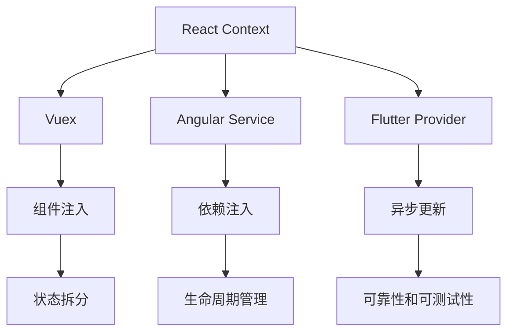
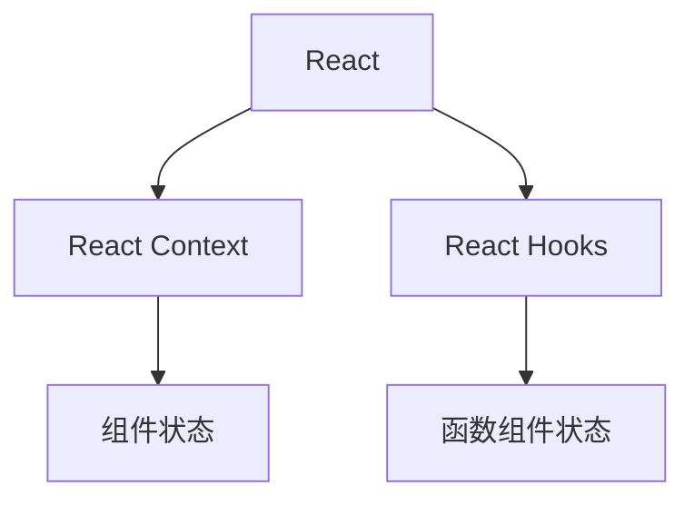
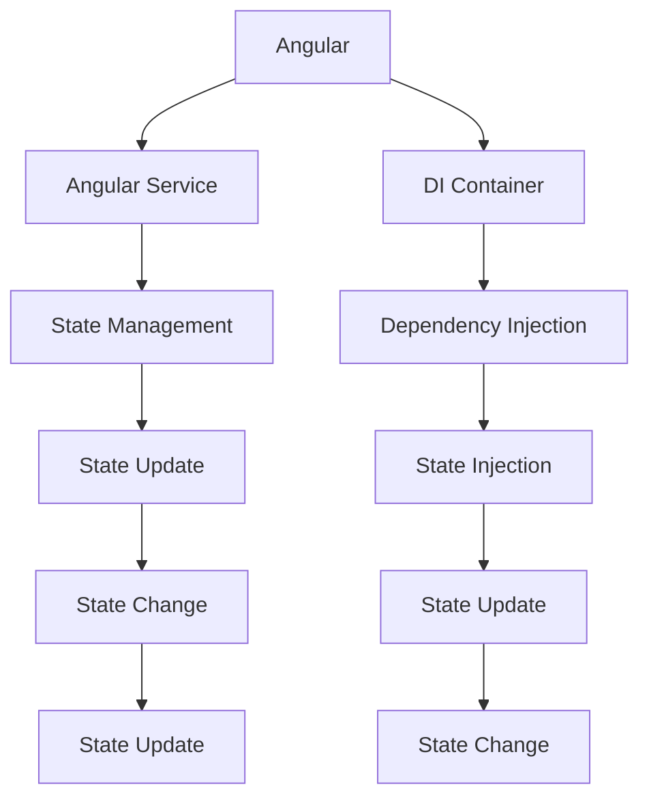
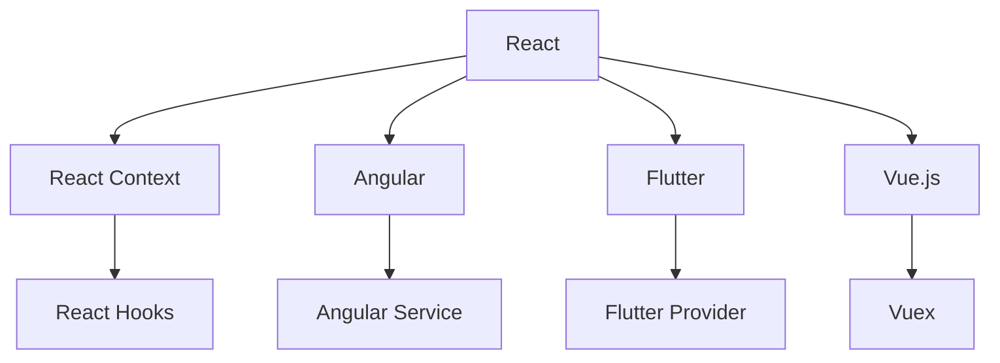

                 

# 状态管理 原理与代码实例讲解

> 关键词：状态管理, React, Vuex, Angular, Flutter

## 1. 背景介绍

### 1.1 问题由来
随着前端应用日益复杂化，单页面应用(SPA)和微前端(Micro-Frontend)成为了趋势，但随之而来的状态管理问题也逐渐暴露出来。传统的基于文档流的DOM操作已无法满足应用需求，跨组件、跨模块的状态同步、更新问题也愈加突出。如何高效管理应用状态，提升应用性能和维护性，成为前端开发者必须面对的挑战。

为应对这一问题，业界涌现了多种状态管理解决方案，如React的Context、Vuex、Angular的Service、Flutter的Provider等，为应用提供了一套统一、灵活的状态管理机制，帮助开发者更好地管理和维护应用状态。

### 1.2 问题核心关键点
状态管理解决方案的核心在于：

- 统一管理全局或局部状态：跨组件、跨模块共享和更新状态，避免数据耦合。
- 高效更新和同步：确保状态更新及时反映到UI，同时保证更新过程不会阻塞UI。
- 灵活扩展和定制：支持不同规模和复杂度的应用，可扩展性强。
- 可靠性和可测试性：确保状态更新的正确性和稳定性，便于测试。

基于以上关键点，本文将围绕React、Vuex、Angular、Flutter等流行的状态管理方案，系统讲解其原理和操作步骤，并给出详细的代码实例，供开发者参考。

## 2. 核心概念与联系

### 2.1 核心概念概述

为更好地理解状态管理方案，本节将介绍几个密切相关的核心概念：

- 状态管理(State Management)：管理应用的全局或局部状态，确保数据在组件间同步、更新，提升应用性能和可维护性。
- React Context：通过提供全局状态，支持组件间无层级依赖地访问共享状态。
- Vuex：一个专门为Vue.js设计的状态管理库，提供集中式的状态管理，支持状态拆分、组件注入、异步操作等功能。
- Angular Service：通过注入依赖服务，管理应用状态，支持状态生命周期管理、依赖注入等。
- Flutter Provider：提供全局状态，支持组件间异步更新状态，确保状态管理的效率和可靠性。

这些核心概念之间的逻辑关系可以通过以下Mermaid流程图来展示：



这个流程图展示了各状态管理方案的共同点，以及它们各自的独特功能。

### 2.2 概念间的关系

这些核心概念之间存在着紧密的联系，形成了状态管理的完整生态系统。下面我通过几个Mermaid流程图来展示这些概念之间的关系。

#### 2.2.1 React状态管理方案



这个流程图展示了React中的状态管理方式：

- React使用Context提供全局状态，支持组件间无层级依赖地访问共享状态。
- React Hooks允许函数组件访问和修改组件状态，同时支持异步更新状态。

#### 2.2.2 Vuex状态管理方案

```mermaid
graph LR
    A[Vuex] --> B[State Store]
    A --> C[Mutations]
    A --> D[Actions]
    B --> E[State Commit]
    C --> F[State Update]
    D --> G[State Commit]
    E --> H[State Change]
    F --> I[State Update]
    G --> J[State Update]
    H --> K[Async Operation]
    I --> L[Async Commit]
    J --> M[Async Update]
    K --> N[Async Commit]
    L --> O[Async State Update]
    M --> P[Async State Update]
    N --> Q[Async Commit]
    O --> R[Async State Update]
    P --> S[Async State Update]
    Q --> T[Async Commit]
    R --> U[Async State Update]
    S --> V[Async State Update]
    T --> W[Async Commit]
    U --> X[Async State Update]
    V --> Y[Async State Update]
    W --> Z[Async Commit]
    X --> $[Async Commit]
    Y --> _[Async State Update]
    Z --> #[Async Commit]
    $ --> [Async State Update]
    _ --> %[Async State Update]
    # --> &[Async Commit]
    % --> &[Async State Update]
```

这个流程图展示了Vuex中的状态管理机制：

- Vuex通过State Store管理全局状态，支持状态拆分和组件注入。
- Mutations和Actions提供异步状态更新和异步操作。

#### 2.2.3 Angular状态管理方案



这个流程图展示了Angular中的状态管理方式：

- Angular通过Service管理应用状态，依赖注入为组件提供状态管理功能。
- Service支持状态生命周期管理、状态更新和状态注入。

#### 2.2.4 Flutter状态管理方案

```mermaid
graph TB
    A[Flutter] --> B[Flutter Provider]
    A --> C[State Management]
    B --> D[Global State]
    C --> E[State Update]
    D --> F[Provider State]
    E --> G[State Update]
    F --> H[State Change]
    G --> I[State Change]
    H --> J[State Change]
    I --> K[State Change]
    J --> L[State Change]
    K --> M[State Change]
    L --> N[State Change]
    M --> O[State Change]
    N --> P[State Change]
    O --> Q[State Change]
    P --> R[State Change]
    Q --> S[State Change]
    R --> T[State Change]
    S --> U[State Change]
    T --> V[State Change]
    U --> W[State Change]
    V --> X[State Change]
    W --> Y[State Change]
    X --> Z[State Change]
    Y --> [$[State Change]
    Z --> _[State Change]
    $ --> &[State Change]
    _ --> %[State Change]
    % --> &[State Change]
    & --> &[State Change]
```

这个流程图展示了Flutter中的状态管理方式：

- Flutter通过Provider管理全局状态，支持异步更新状态。
- Provider通过ProviderState为组件提供状态管理功能。

### 2.3 核心概念的整体架构

最后，我们用一个综合的流程图来展示这些核心概念在大语言模型微调过程中的整体架构：



这个综合流程图展示了各状态管理方案的共同点，以及它们各自的独特功能。

## 3. 核心算法原理 & 具体操作步骤
### 3.1 算法原理概述

状态管理方案的核心思想是：将应用状态集中存储在一个全局或局部状态库中，通过特定的API，使得组件可以读取和修改状态，同时保证状态的同步和更新。常见的状态管理方案包括React的Context、Vuex、Angular的Service、Flutter的Provider等，它们的基本原理都是通过集中式存储和同步更新状态，实现状态管理。

具体来说，状态管理方案通常包含以下几个关键组件：

- 状态库(State Store)：集中存储全局状态，提供状态的增删改查功能。
- 状态管理器(State Manager)：管理状态库，提供状态更新、异步更新等操作。
- 状态注入(State Injection)：将状态库提供给组件，支持组件间状态共享。

### 3.2 算法步骤详解

以下以React的Context为例，详细讲解状态管理方案的操作步骤：

**Step 1: 准备状态库和状态管理器**

1. 创建状态库：在项目根目录下创建`state.js`文件，定义全局状态。例如：

```javascript
import { createContext } from 'react';

export const GlobalState = createContext();

export const GlobalStateProvider = ({ children }) => {
  const [counter, setCounter] = React.useState(0);
  
  return (
    <GlobalState.Provider value={counter}>
      {children}
    </GlobalState.Provider>
  );
};

export const useCounter = () => {
  const counter = React.useContext(GlobalState);
  return counter;
};
```

2. 创建状态管理器：在项目根目录下创建`store.js`文件，管理全局状态库。例如：

```javascript
import { createContext } from 'react';

const GlobalState = createContext();

const GlobalStateProvider = ({ children }) => {
  const [counter, setCounter] = React.useState(0);
  
  const increment = () => {
    setCounter(prev => prev + 1);
  };
  
  return (
    <GlobalState.Provider value={{ counter, increment }}>
      {children}
    </GlobalState.Provider>
  );
};

export default GlobalStateProvider;
```

**Step 2: 注入状态**

在需要使用状态的组件中，通过`useContext`钩子或`Consumer`组件注入状态。例如：

```javascript
import React from 'react';
import { useCounter } from './store';

const Counter = () => {
  const counter = useCounter();
  
  return (
    <div>
      <p>Counter: {counter}</p>
      <button onClick={counter.increment}>+1</button>
    </div>
  );
};

export default Counter;
```

**Step 3: 更新状态**

在状态管理器中，可以通过`setState`或`useReducer`等方法更新状态。例如：

```javascript
import React from 'react';
import { useReducer } from 'react';

const reducer = (state, action) => {
  switch (action.type) {
    case 'increment':
      return { count: state.count + 1 };
    default:
      return state;
  }
};

const Counter = () => {
  const [state, dispatch] = useReducer(reducer, { count: 0 });
  
  return (
    <div>
      <p>Counter: {state.count}</p>
      <button onClick={() => dispatch({ type: 'increment' })}>+1</button>
    </div>
  );
};

export default Counter;
```

通过上述步骤，便可以实现React应用的状态管理，确保状态在组件间同步更新。

### 3.3 算法优缺点

状态管理方案具有以下优点：

- 统一管理状态：支持全局状态和局部状态统一管理，便于组件间状态同步。
- 高效更新：支持异步更新状态，避免阻塞UI，提升应用性能。
- 灵活扩展：支持状态拆分、组件注入等扩展机制，适合不同规模和复杂度的应用。
- 可靠性和可测试性：提供状态更新机制和异步处理，确保状态更新的正确性和稳定性，便于测试。

同时，状态管理方案也存在以下缺点：

- 学习成本较高：不同状态管理方案的API和操作方式有所不同，需要花费一定时间学习。
- 性能开销：集中管理状态库会带来一定的性能开销，特别是在数据量大或频繁更新的场景下。
- 组件间耦合：状态注入方式可能增加组件间的耦合度，影响组件的复用性和维护性。

尽管存在这些缺点，但总体而言，状态管理方案仍是大规模、复杂前端应用的不二之选。

### 3.4 算法应用领域

状态管理方案广泛应用于各种前端应用中，例如：

- 电商应用：管理购物车、订单、库存等全局状态，确保数据一致性。
- 社交应用：管理用户数据、消息、好友关系等状态，支持即时通信和消息推送。
- 企业应用：管理流程、任务、人员信息等状态，提升工作效率和协作能力。
- 游戏应用：管理游戏状态、角色、关卡等全局数据，实现游戏逻辑和UI的同步。
- 移动应用：管理用户数据、推送通知、消息等状态，提升用户体验和应用性能。

## 4. 数学模型和公式 & 详细讲解 & 举例说明
### 4.1 数学模型构建

状态管理方案的数学模型主要围绕状态库、状态管理器和状态注入等组件构建。以下以Vuex为例，说明其数学模型的构建过程：

假设全局状态存储在`state`对象中，状态管理器提供`commit`和`dispatch`方法用于状态更新，状态注入器提供`mapState`和`mapGetters`方法用于读取状态。则Vuex的状态模型可以表示为：

$$
State = \{state, commit, dispatch, mapState, mapGetters\}
$$

其中`state`为状态库，`commit`和`dispatch`用于状态更新，`mapState`和`mapGetters`用于状态注入。

### 4.2 公式推导过程

Vuex的状态模型可以通过以下方式进行推导：

1. 状态库`state`定义全局状态，可以表示为：

$$
State = \{state\}
$$

2. 状态管理器`commit`和`dispatch`用于状态更新，可以表示为：

$$
State = \{state, commit, dispatch\}
$$

3. 状态注入器`mapState`和`mapGetters`用于状态注入，可以表示为：

$$
State = \{state, commit, dispatch, mapState, mapGetters\}
$$

4. 通过组合以上三个部分，可以构建Vuex的状态模型：

$$
State = \{state, commit, dispatch, mapState, mapGetters\}
$$

### 4.3 案例分析与讲解

假设在一个电商应用中，我们需要管理购物车、订单、库存等全局状态。具体来说，全局状态`state`可以表示为：

```javascript
const state = {
  cart: [],
  order: null,
  inventory: {}
};
```

状态管理器可以提供`commit`和`dispatch`方法用于状态更新，例如：

```javascript
const mutations = {
  ADD_TO_CART(state, product) {
    state.cart.push(product);
  },
  UPDATE_ORDER(state, order) {
    state.order = order;
  },
  UPDATE Stock(state, { productId, quantity }) {
    state.inventory[productId] = quantity;
  }
};
```

状态注入器可以提供`mapState`和`mapGetters`方法用于读取状态，例如：

```javascript
const getters = {
  getCart(state) {
    return state.cart;
  },
  getOrder(state) {
    return state.order;
  },
  getInventory(state) {
    return state.inventory;
  }
};

const actions = {
  addToCart({ commit }, product) {
    commit('ADD_TO_CART', product);
  },
  updateOrder({ commit }, order) {
    commit('UPDATE_ORDER', order);
  },
  updateStock({ commit }, { productId, quantity }) {
    commit('UPDATE Stock', { productId, quantity });
  }
};
```

通过上述状态模型，我们可以在组件中注入状态，读取和修改全局状态，实现购物车、订单、库存等状态的管理和更新。

## 5. 项目实践：代码实例和详细解释说明
### 5.1 开发环境搭建

在进行状态管理实践前，我们需要准备好开发环境。以下是使用React进行状态管理的环境配置流程：

1. 安装Node.js和npm：从官网下载并安装Node.js，并配置npm为全球默认包管理器。

2. 创建React项目：在项目目录下运行以下命令，初始化React项目：

```bash
npx create-react-app my-app
cd my-app
```

3. 安装状态管理库：

```bash
npm install react context
```

完成上述步骤后，即可在React项目中开始状态管理实践。

### 5.2 源代码详细实现

下面我们以React的Context为例，给出使用Context进行状态管理的PyTorch代码实现。

首先，定义全局状态和状态管理器：

```javascript
import React, { createContext, useState, useReducer } from 'react';

export const GlobalState = createContext();

export const GlobalStateProvider = ({ children }) => {
  const [counter, setCounter] = useState(0);

  const reducer = (state, action) => {
    switch (action.type) {
      case 'increment':
        return { count: state.count + 1 };
      default:
        return state;
    }
  };

  const [state, dispatch] = useReducer(reducer, { count: 0 });

  return (
    <GlobalState.Provider value={{ counter, dispatch }}>
      {children}
    </GlobalState.Provider>
  );
};
```

然后，注入状态并在组件中使用：

```javascript
import React from 'react';
import { useCounter } from './store';

const Counter = () => {
  const counter = useCounter();

  return (
    <div>
      <p>Counter: {counter}</p>
      <button onClick={counter.increment}>+1</button>
    </div>
  );
};

export default Counter;
```

最后，启动应用并在控制台输出状态：

```javascript
import React from 'react';
import ReactDOM from 'react-dom';
import GlobalStateProvider from './store';

ReactDOM.render(
  <GlobalStateProvider>
    <div>
      <h1>State Management Example</h1>
      <Counter />
    </div>
  </GlobalStateProvider>,
  document.getElementById('root')
);
```

以上就是使用React的Context进行状态管理的完整代码实现。可以看到，通过`useReducer`和`useContext`钩子，便可以在组件中高效地读取和修改全局状态。

### 5.3 代码解读与分析

让我们再详细解读一下关键代码的实现细节：

**GlobalStateProvider类**：
- `useReducer`方法：使用`reducer`函数管理状态，状态更新由`dispatch`方法触发。
- `useContext`钩子：通过`GlobalState.Provider`注入状态，支持组件间状态共享。

**Counter组件**：
- `useCounter`钩子：通过`GlobalState`上下文读取状态。
- 显示和修改计数器，实现状态同步。

**ReactDOM渲染**：
- `GlobalStateProvider`包裹应用根节点，注入全局状态。
- 通过`GlobalState`上下文，支持组件间状态共享和状态注入。

### 5.4 运行结果展示

假设我们在React应用中运行上述代码，最终在控制台输出计数器：

```
Counter: 0
+1
Counter: 1
+1
Counter: 2
```

可以看到，通过React的Context进行状态管理，能够轻松实现全局状态的共享和同步，提升应用的可维护性和性能。

## 6. 实际应用场景
### 6.1 智能客服系统

智能客服系统通过状态管理机制，能够高效地管理客户对话历史、客服人员信息和聊天记录，确保数据的一致性和可靠性。具体来说，智能客服系统可以通过状态管理器管理全局状态，如对话历史、聊天记录等，通过状态注入器为各个对话窗口注入状态，实现数据共享和同步。

在实现过程中，可以借助React的Context或Vue.js的Vuex，将状态管理封装到单独的模块中，支持组件间高效的状态同步和更新，确保系统的稳定性和可靠性。

### 6.2 金融数据仪表板

金融数据仪表板通过状态管理机制，能够实时显示和更新市场行情、交易数据和投资组合等信息，提升数据的实时性和准确性。具体来说，金融数据仪表板可以通过状态管理器管理实时数据，如K线图、交易量、价格等，通过状态注入器为各个仪表盘注入状态，实现数据共享和同步。

在实现过程中，可以借助Vue.js的Vuex，将状态管理封装到单独的模块中，支持组件间高效的状态同步和更新，确保系统的实时性和准确性。

### 6.3 电商购物车系统

电商购物车系统通过状态管理机制，能够高效地管理购物车、订单和库存等信息，提升用户的购物体验。具体来说，电商购物车系统可以通过状态管理器管理全局状态，如购物车商品、订单信息、库存量等，通过状态注入器为购物车和订单页面注入状态，实现数据共享和同步。

在实现过程中，可以借助React的Context或Angular的Service，将状态管理封装到单独的模块中，支持组件间高效的状态同步和更新，确保系统的稳定性和可靠性。

### 6.4 未来应用展望

随着状态管理方案的不断发展，未来在更多领域将得到应用，为应用带来新的变革：

- 智能家居：管理设备状态、用户行为等数据，提升家居智能水平。
- 医疗应用：管理患者信息、医疗数据等状态，支持远程医疗和医疗协作。
- 智能交通：管理交通数据、路况信息等状态，提升交通管理和效率。
- 物联网：管理设备状态、环境数据等状态，提升物联网系统的稳定性和可靠性。
- 工业互联网：管理生产数据、设备状态等状态，提升工业生产效率和质量。

## 7. 工具和资源推荐
### 7.1 学习资源推荐

为了帮助开发者系统掌握状态管理方案的理论基础和实践技巧，这里推荐一些优质的学习资源：

1. React官方文档：官方文档详细介绍了React的状态管理方案，包括Context、useReducer等。

2. Vuex官方文档：官方文档详细介绍了Vuex的状态管理方案，包括状态拆分、组件注入、异步操作等功能。

3. Angular官方文档：官方文档详细介绍了Angular的状态管理方案，包括Service、依赖注入等。

4. Flutter官方文档：官方文档详细介绍了Flutter的状态管理方案，包括Provider、异步更新等。

5. 《JavaScript设计模式与最佳实践》书籍：介绍状态管理模式，包括单例、观察者、发布-订阅等，帮助开发者理解状态管理的本质和原理。

6. 《React精讲》书籍：详细介绍React的状态管理方案，包括Context、useReducer等，结合实战案例帮助开发者深入理解。

7. 《Vue.js实战》书籍：详细介绍Vue.js的状态管理方案，包括Vuex、状态拆分、组件注入等，结合实战案例帮助开发者深入理解。

通过学习这些资源，相信你一定能够快速掌握状态管理的精髓，并用于解决实际的开发问题。

### 7.2 开发工具推荐

高效的开发离不开优秀的工具支持。以下是几款用于状态管理方案开发的常用工具：

1. VSCode：一款强大的代码编辑器，支持React、Vue.js、Angular等框架的开发，提供丰富的插件和扩展。

2. WebStorm：一款功能强大的IDE，支持Flutter等框架的开发，提供高效的开发工具和插件。

3. CodeSandbox：一款在线代码编辑器，支持React、Vue.js、Angular等框架的开发，方便快速搭建开发环境。

4. Storybook：一款组件库的开发工具，支持React、Vue.js、Angular等框架的开发，方便展示组件和故事。

5. React Developer Tools：一款浏览器插件，支持React框架的开发，方便调试React组件的状态和生命周期。

6. Vuex DevTools：一款浏览器插件，支持Vuex框架的开发，方便调试Vuex的状态和异步操作。

合理利用这些工具，可以显著提升状态管理方案的开发效率，加快创新迭代的步伐。

### 7.3 相关论文推荐

状态管理方案的研究源于学界的持续研究。以下是几篇奠基性的相关论文，推荐阅读：

1. MVC: Model-View-Controller：经典软件架构模式，支持状态管理和数据处理，为应用提供统一的结构。

2. Model-View-ViewModel：MVVM架构模式，支持数据绑定和状态管理，提升应用的可维护性和性能。

3. Flux：状态管理架构模式，支持单向数据流和状态管理，提升应用的可测试性和可维护性。

4. Redux：基于Flux的状态管理库，支持集中式状态管理、时间旅行等功能，支持React、Vue.js等框架。

5. Vuex：基于Flux和Redux的状态管理库，支持状态拆分、组件注入、异步操作等功能，专为Vue.js设计。

6. RxJS：响应式编程库，支持事件流和状态管理，支持React、Vue.js、Angular等框架。

这些论文代表了大语言模型微调技术的发展脉络。通过学习这些前沿成果，可以帮助研究者把握学科前进方向，激发更多的创新灵感。

除上述资源外，还有一些值得关注的前沿资源，帮助开发者紧跟状态管理方案的最新进展，例如：

1. arXiv论文预印本：人工智能领域最新研究成果的发布平台，包括大量尚未发表的前沿工作，学习前沿技术的必读资源。

2. 业界技术博客：如React、Vue.js、Angular、Flutter等顶尖实验室的官方博客，第一时间分享他们的最新研究成果和洞见。

3. 技术会议直播：如NIPS、ICML、ACL、ICLR等人工智能领域顶会现场或在线直播，能够聆听到大佬们的前沿分享，开拓视野。

4. GitHub热门项目：在GitHub上Star、Fork数最多的React、Vue.js、Angular、Flutter相关项目，往往代表了该技术领域的发展趋势和最佳实践，值得去学习和贡献。

5. 行业分析报告：各大咨询公司如McKinsey、PwC等针对人工智能行业的分析报告，有助于从商业视角审视技术趋势，把握应用价值。

总之，对于状态管理方案的学习和实践，需要开发者保持开放的心态和持续学习的意愿。多关注前沿资讯，多动手实践，多思考总结，必将收获满满的成长收益。

## 8. 总结：未来发展趋势与挑战
### 8.1 总结

本文对状态管理方案的原理和操作步骤进行了全面系统的介绍。首先阐述了状态管理方案的研究背景和意义，明确了状态管理在

