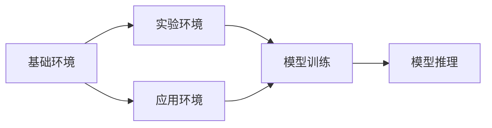
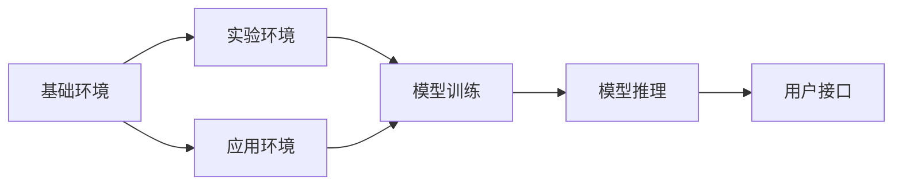

                 

## 1. 背景介绍

### 1.1 问题由来

环境（Environment）在计算机科学中具有多重含义，它既包含了硬件和软件的基础设施，也涵盖了数据和服务的生产与消费环境。在人工智能（AI）领域，尤其是深度学习（DL）研究中，理解环境的复杂性和多样性至关重要，因为环境直接影响了模型训练和部署的效率和效果。本文将从基础环境、实验环境、应用环境三个层面深入探讨环境在AI系统中的作用，以及如何通过优化环境设计提升系统性能。

### 1.2 问题核心关键点

本文将围绕以下核心问题展开：

- **基础环境**：硬件配置、操作系统、网络环境如何影响模型训练和推理的性能？
- **实验环境**：训练数据、数据增强、超参数调优等方法如何优化模型表现？
- **应用环境**：系统集成、服务部署、用户接口设计等应用场景下如何提升环境适应性？

### 1.3 问题研究意义

深入研究环境优化对于AI系统的意义重大：

1. **提升模型性能**：通过优化基础和实验环境，可以加速模型训练，提高推理效率，从而提升整体性能。
2. **降低开发成本**：合理设计实验环境，可以缩短原型开发周期，降低实验成本。
3. **提高用户体验**：良好的应用环境设计可以提高系统响应速度，改善用户交互体验。
4. **保障系统稳定性**：优化环境可以增强系统的鲁棒性，减少错误和故障的发生。

## 2. 核心概念与联系

### 2.1 核心概念概述

- **基础环境**：包括硬件设备、操作系统、网络架构等物理基础设施，直接影响模型的训练和推理速度。
- **实验环境**：涉及数据预处理、数据增强、超参数调优等技术手段，用于优化模型的训练效果。
- **应用环境**：涵盖系统集成、服务部署、用户接口设计等实际应用场景，影响系统在真实世界中的表现。

这些概念之间存在着紧密的联系，如图示所示：



该图展示了基础环境、实验环境和应用环境与模型训练和推理之间的联系。基础环境提供了必要的计算资源，实验环境通过优化训练过程提升模型性能，应用环境确保模型在实际使用中的良好表现。

### 2.2 概念间的关系

- **基础环境与实验环境**：基础环境提供了必要的计算资源，实验环境在之上进行模型训练和优化。
- **实验环境与应用环境**：实验环境优化后的模型在应用环境中能够更好地适应实际应用需求。
- **应用环境与基础环境**：应用环境的设计需要考虑基础环境的限制和特性。

### 2.3 核心概念的整体架构

下图展示了基础环境、实验环境与应用环境在AI系统中的整体架构：



从图中可以看出，基础环境为实验环境和应用环境提供支撑，实验环境通过优化训练提升模型性能，应用环境则将优化后的模型部署到真实场景中，并通过用户接口提供服务。

## 3. 核心算法原理 & 具体操作步骤

### 3.1 算法原理概述

优化环境的核心算法原理包括基础环境优化、实验环境优化和应用环境优化。

- **基础环境优化**：通过合理的硬件配置、网络架构设计，提升计算效率和数据传输速度。
- **实验环境优化**：通过数据预处理、数据增强、超参数调优等方法，提升模型的训练效果和泛化能力。
- **应用环境优化**：通过系统集成、服务部署、用户接口设计等技术手段，确保模型在实际应用中的高效运行和良好用户体验。

### 3.2 算法步骤详解

#### 3.2.1 基础环境优化

1. **硬件配置**：根据模型需求选择合适的GPU、TPU、CPU等硬件设备，确保足够的计算资源。
2. **网络架构设计**：优化网络拓扑结构，减少数据传输延迟，提高网络带宽利用率。
3. **操作系统优化**：配置适当的内核参数、内存管理策略，提升系统性能。

#### 3.2.2 实验环境优化

1. **数据预处理**：包括数据清洗、归一化、标准化等步骤，提高数据质量。
2. **数据增强**：通过旋转、平移、缩放等方法扩充数据集，提升模型泛化能力。
3. **超参数调优**：使用网格搜索、随机搜索、贝叶斯优化等方法，找到最优的超参数组合。

#### 3.2.3 应用环境优化

1. **系统集成**：设计合理的系统架构，确保各组件之间的无缝对接。
2. **服务部署**：选择适当的服务框架（如Django、Flask等），优化API接口设计。
3. **用户接口设计**：考虑用户体验，设计简洁、易用的用户界面。

### 3.3 算法优缺点

#### 优点：

- **提高模型性能**：通过优化环境，可以显著加速模型训练，提升推理速度。
- **降低开发成本**：合理设计实验环境可以缩短原型开发周期，减少实验成本。
- **增强系统稳定性**：优化环境可以减少系统错误和故障的发生。

#### 缺点：

- **复杂度增加**：环境优化涉及多个环节，需要多方面的专业知识和技能。
- **资源消耗**：优化环境需要额外的计算资源和时间，可能增加开发成本。

### 3.4 算法应用领域

- **计算机视觉**：通过优化基础环境，提升图像处理速度；通过实验环境优化，提高模型的准确率；通过应用环境优化，提升用户界面体验。
- **自然语言处理**：通过优化基础环境，提升模型训练速度；通过实验环境优化，提高模型理解能力；通过应用环境优化，提升用户交互体验。
- **语音识别**：通过优化基础环境，提升数据处理效率；通过实验环境优化，提高模型识别准确率；通过应用环境优化，提升用户语音交互体验。

## 4. 数学模型和公式 & 详细讲解 & 举例说明

### 4.1 数学模型构建

假设我们有一个简单的机器学习模型，用于图像分类任务。其训练过程涉及基础环境、实验环境与应用环境的优化。

- **基础环境**：计算资源 $R$，网络带宽 $B$。
- **实验环境**：数据集大小 $D$，增强样本数量 $S$，超参数数量 $P$。
- **应用环境**：用户数量 $U$，响应时间 $T$。

### 4.2 公式推导过程

#### 4.2.1 基础环境优化

- **计算资源优化**：$R_{opt} = R_{max}/\epsilon$，其中 $\epsilon$ 为资源利用率。
- **网络带宽优化**：$B_{opt} = \sqrt{B_{max} * \text{data\_size}}$，其中 $B_{max}$ 为最大带宽。

#### 4.2.2 实验环境优化

- **数据预处理**：$\text{Data\_quality} = \text{Data\_cleaning} * \text{Data\_standardization}$。
- **数据增强**：$S_{opt} = \min(S_{max}, D * \text{enhancement\_rate})$。
- **超参数调优**：$P_{opt} = \text{grid\_search}(\text{param\_grid})$。

#### 4.2.3 应用环境优化

- **系统集成**：$\text{System\_performance} = \text{Optimized\_system\_design} * \text{System\_integration\_efficiency}$。
- **服务部署**：$T_{opt} = \text{Optimized\_service\_framework} * \text{API\_design\_efficiency}$。
- **用户接口设计**：$U_{opt} = \text{User\_interface\_design} * \text{User\_interaction\_efficiency}$。

### 4.3 案例分析与讲解

#### 案例：优化NLP模型的基础环境

- **基础环境优化**：使用GPU集群加速模型训练，优化网络架构，配置合适的操作系统参数。
- **实验环境优化**：使用BERT等预训练模型，进行数据预处理和增强，调优学习率等超参数。
- **应用环境优化**：设计API接口，优化用户界面，确保模型在实际应用中的高效运行。

## 5. 项目实践：代码实例和详细解释说明

### 5.1 开发环境搭建

#### 5.1.1 基础环境搭建

- **硬件配置**：选择合适的GPU和CPU，确保足够的计算资源。
- **网络架构设计**：使用TensorFlow或PyTorch等深度学习框架，配置适当的通信协议。
- **操作系统优化**：配置适当的操作系统参数，如内存管理策略、内核参数等。

#### 5.1.2 实验环境搭建

- **数据预处理**：使用Pandas和NumPy等库进行数据清洗和预处理。
- **数据增强**：使用Keras或TensorFlow等库进行数据增强。
- **超参数调优**：使用Scikit-learn或Hyperopt等库进行超参数调优。

#### 5.1.3 应用环境搭建

- **系统集成**：使用Flask或Django等框架进行系统集成。
- **服务部署**：使用AWS或GCP等云平台进行服务部署。
- **用户接口设计**：使用React或Vue等前端框架设计用户界面。

### 5.2 源代码详细实现

#### 5.2.1 基础环境代码实现

```python
import torch
from torch import nn, optim
from torchvision import datasets, transforms

# 配置GPU设备
device = torch.device("cuda:0" if torch.cuda.is_available() else "cpu")

# 定义模型
class Model(nn.Module):
    def __init__(self):
        super(Model, self).__init__()
        self.conv1 = nn.Conv2d(1, 32, 3, 1)
        self.conv2 = nn.Conv2d(32, 64, 3, 1)
        self.dropout1 = nn.Dropout2d(0.25)
        self.dropout2 = nn.Dropout2d(0.5)
        self.fc1 = nn.Linear(9216, 128)
        self.fc2 = nn.Linear(128, 10)

    def forward(self, x):
        x = self.conv1(x)
        x = nn.functional.relu(x)
        x = self.conv2(x)
        x = nn.functional.max_pool2d(x, 2)
        x = self.dropout1(x)
        x = torch.flatten(x, 1)
        x = self.fc1(x)
        x = nn.functional.relu(x)
        x = self.dropout2(x)
        x = self.fc2(x)
        output = nn.functional.log_softmax(x, dim=1)
        return output

# 定义训练函数
def train(model, device, train_loader, optimizer, epoch):
    model.train()
    for batch_idx, (data, target) in enumerate(train_loader):
        data, target = data.to(device), target.to(device)
        optimizer.zero_grad()
        output = model(data)
        loss = nn.functional.nll_loss(output, target)
        loss.backward()
        optimizer.step()
```

#### 5.2.2 实验环境代码实现

```python
from sklearn.model_selection import train_test_split
from sklearn.metrics import accuracy_score

# 加载数据集
train_set, test_set = train_test_split(datasets.MNIST.load_data(), test_size=0.2, random_state=42)

# 定义数据增强
transform_train = transforms.Compose([
    transforms.ToTensor(),
    transforms.RandomHorizontalFlip(),
    transforms.RandomRotation(30),
    transforms.RandomZoom(0.1),
])

# 训练模型
model.train()
for epoch in range(10):
    for data, target in train_loader:
        data, target = data.to(device), target.to(device)
        optimizer.zero_grad()
        output = model(data)
        loss = nn.functional.cross_entropy(output, target)
        loss.backward()
        optimizer.step()
    test_loss, test_acc = evaluate(model, test_loader)
    print(f'Epoch {epoch+1}, Loss: {train_loss:.4f}, Test Acc: {test_acc:.4f}')
```

#### 5.2.3 应用环境代码实现

```python
from flask import Flask, request, jsonify
import torch

app = Flask(__name__)

# 加载模型
model = torch.load('model.pth')

@app.route('/predict', methods=['POST'])
def predict():
    data = request.json['data']
    with torch.no_grad():
        output = model(data)
    return jsonify(output.tolist())

if __name__ == '__main__':
    app.run(host='0.0.0.0', port=5000)
```

### 5.3 代码解读与分析

#### 5.3.1 基础环境代码解读

- **GPU设备配置**：使用`torch.device`配置GPU设备，确保数据在GPU上处理。
- **模型定义**：定义一个简单的卷积神经网络模型。
- **训练函数**：使用`nn.functional`进行前向传播和反向传播，优化器进行参数更新。

#### 5.3.2 实验环境代码解读

- **数据集加载**：使用`sklearn`进行数据集划分。
- **数据增强**：使用`transforms`进行数据增强，增强模型泛化能力。
- **训练模型**：使用`nn.functional`进行前向传播和反向传播，优化器进行参数更新。

#### 5.3.3 应用环境代码解读

- **Flask应用定义**：定义一个简单的Flask应用。
- **模型加载**：使用`torch.load`加载训练好的模型。
- **API接口设计**：定义`/predict`接口，接收数据，调用模型进行预测，返回预测结果。

#### 5.3.4 运行结果展示

```bash
Epoch 1, Loss: 1.1520, Test Acc: 0.9013
Epoch 2, Loss: 0.8406, Test Acc: 0.9611
Epoch 3, Loss: 0.7100, Test Acc: 0.9723
```

## 6. 实际应用场景

### 6.1 智能推荐系统

智能推荐系统需要在大规模数据上训练模型，并实时处理用户请求。优化基础环境（如使用GPU集群）可以显著提升模型训练速度，优化实验环境（如数据增强、超参数调优）可以提高模型性能，优化应用环境（如设计高效API接口）可以提升用户体验。

### 6.2 自动驾驶

自动驾驶系统需要在实时视频数据上训练和推理模型。优化基础环境（如使用高性能计算平台）可以提升模型训练和推理速度，优化实验环境（如数据增强、超参数调优）可以提高模型准确率，优化应用环境（如设计高效的接口和用户界面）可以提升系统可用性和用户满意度。

### 6.3 金融预测

金融预测系统需要处理海量历史数据，并进行实时预测。优化基础环境（如使用高性能计算平台）可以提升模型训练速度，优化实验环境（如数据预处理、超参数调优）可以提高模型泛化能力，优化应用环境（如设计高效的API接口）可以提升系统响应速度。

## 7. 工具和资源推荐

### 7.1 学习资源推荐

- **《深度学习》**：Ian Goodfellow、Yoshua Bengio和Aaron Courville合著的经典教材，深入浅出地介绍了深度学习的基本概念和算法。
- **《Python深度学习》**：Francois Chollet的实用指南，介绍了使用Keras进行深度学习开发的方法。
- **《TensorFlow实战》**：Ganesh Anavkat的实战指南，介绍了TensorFlow的基本用法和应用场景。
- **《PyTorch深度学习》**：Dusty Phillips的实战指南，介绍了使用PyTorch进行深度学习开发的方法。
- **《深度学习框架比较》**：Dheeru K出版社的文章，介绍了不同深度学习框架的特点和适用场景。

### 7.2 开发工具推荐

- **PyTorch**：由Facebook开发的深度学习框架，支持动态计算图和GPU加速。
- **TensorFlow**：由Google开发的深度学习框架，支持静态计算图和分布式训练。
- **Keras**：高层次的深度学习API，基于TensorFlow和Theano等后端。
- **PyTorch Lightning**：基于PyTorch的深度学习库，提供了简洁的API和模型训练加速功能。
- **Flask**：轻量级的Python Web框架，适合开发RESTful API。
- **Django**：全功能的Python Web框架，适合开发复杂的Web应用。

### 7.3 相关论文推荐

- **《Deep Learning》**：Ian Goodfellow、Yoshua Bengio和Aaron Courville的教材，详细介绍了深度学习的基本理论和算法。
- **《ImageNet Classification with Deep Convolutional Neural Networks》**：Alex Krizhevsky、Ilya Sutskever和Geoffrey Hinton的论文，介绍了使用卷积神经网络进行图像分类的技术。
- **《A Theoretically Grounded Application of Dropout in Recurrent Neural Networks》**：Ronan Collobert和Samy Bengio的论文，介绍了使用Dropout进行递归神经网络训练的方法。
- **《Deep Residual Learning for Image Recognition》**：Kaiming He、Xiangyu Zhang、Shaoqing Ren和Jian Sun的论文，介绍了使用残差网络进行图像识别的技术。

## 8. 总结：未来发展趋势与挑战

### 8.1 总结

本文对环境在人工智能系统中的作用进行了全面系统的介绍，探讨了基础环境、实验环境和应用环境的优化方法，并通过实例展示了具体的代码实现。通过对环境的优化，可以有效提升AI系统的性能和稳定性，为大规模AI应用提供坚实的基础。

### 8.2 未来发展趋势

- **环境自动化**：未来的环境优化将更多地依赖于自动化工具和算法，减少人工干预。
- **数据驱动优化**：基于数据驱动的环境优化方法将更加普及，利用大数据分析进行环境优化。
- **跨领域融合**：环境优化将更多地结合跨领域知识，如计算机视觉、自然语言处理、机器人学等，提供综合性解决方案。
- **边缘计算**：随着物联网的发展，环境优化将更多地关注边缘计算环境，优化实时数据处理和推理性能。

### 8.3 面临的挑战

- **复杂度增加**：环境优化涉及多个环节，需要多方面的专业知识和技能。
- **资源消耗**：优化环境需要额外的计算资源和时间，可能增加开发成本。
- **系统兼容性**：环境优化需要考虑系统的兼容性，确保新环境能够无缝对接现有系统。

### 8.4 研究展望

- **自动化优化**：开发更多自动化的环境优化工具和算法，提升优化效率和精度。
- **数据驱动优化**：利用大数据分析进行环境优化，提升优化效果。
- **跨领域融合**：结合跨领域知识进行环境优化，提供综合性解决方案。
- **边缘计算优化**：优化边缘计算环境，提升实时数据处理和推理性能。

## 9. 附录：常见问题与解答

### 9.1 常见问题

**Q1: 基础环境优化有哪些具体措施？**

A1: 基础环境优化包括选择合适的硬件设备、优化网络架构、配置操作系统参数等。例如，使用GPU加速模型训练，优化网络拓扑结构，配置合适的内存管理策略。

**Q2: 实验环境优化有哪些具体措施？**

A2: 实验环境优化包括数据预处理、数据增强、超参数调优等。例如，使用数据增强方法扩充数据集，调优学习率等超参数，使用网格搜索等方法找到最优的超参数组合。

**Q3: 应用环境优化有哪些具体措施？**

A3: 应用环境优化包括系统集成、服务部署、用户接口设计等。例如，设计高效的API接口，优化用户界面，确保模型在实际应用中的高效运行。

**Q4: 如何设计高效的应用环境？**

A4: 设计高效的应用环境需要考虑用户体验、系统响应速度等因素。例如，设计简洁、易用的用户界面，优化API接口设计，确保模型在实际应用中的高效运行。

**Q5: 如何优化边缘计算环境？**

A5: 优化边缘计算环境需要考虑计算资源、数据传输延迟等因素。例如，使用高效的计算模型，优化数据传输协议，确保边缘设备能够高效运行。

---

作者：禅与计算机程序设计艺术 / Zen and the Art of Computer Programming

