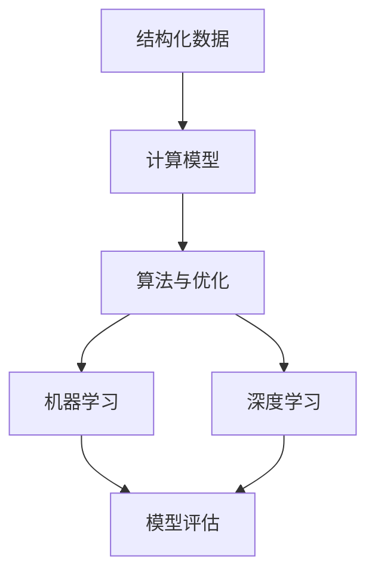
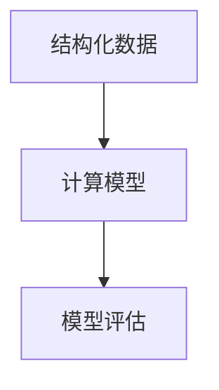
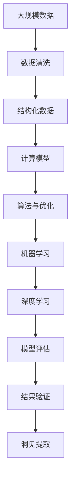

                 

## 1. 背景介绍

### 1.1 问题由来

人类对世界的认知过程，本质上是理解和抽象化的过程。从远古时代对自然现象的观察和猜测，到现代社会对复杂系统的建模和分析，人类一直在努力从纷繁复杂的现象中抽取出精简而有效的结构，以求更深刻地理解世界。

在信息技术领域，随着计算技术的飞速发展，人们开始尝试利用计算机来模拟和理解现实世界的复杂性。早期的计算机模拟通常基于简单的物理方程或统计模型，但随着数据量的爆炸性增长和计算能力的突破，复杂系统模拟已不再受限于传统方法，而是进入了一个全新的阶段。

### 1.2 问题核心关键点

理解世界复杂性的关键在于：

1. **结构化表达**：如何将现实世界的复杂现象抽象为计算机可以处理的形式，建立有效的模型。
2. **算法与计算**：如何设计高效的算法和计算策略，从数据中提取出有意义的结构洞见。
3. **模型评估与验证**：如何评估模型的有效性，确保其能够准确反映现实世界。

这些关键点共同构成了理解和分析复杂系统的基本框架，推动了信息技术领域的快速发展。从早期的逻辑推理到统计分析，再到当前的人工智能和大数据技术，这一过程不断演变，但核心问题始终未变。

### 1.3 问题研究意义

理解世界的复杂性对于多个领域具有重要意义：

1. **科学发现**：在自然科学领域，理解复杂系统的行为模式有助于发现新现象、新理论。
2. **工程应用**：在工程设计中，理解系统的结构和行为可优化设计方案，提高效率和可靠性。
3. **社会治理**：在社会管理中，理解复杂的社会动态有助于制定更有效的政策，解决实际问题。
4. **经济决策**：在经济分析中，理解市场行为和影响因素有助于制定更精准的策略。

因此，理解和分析复杂系统的能力是推动科技进步和社会发展的重要驱动力。

## 2. 核心概念与联系

### 2.1 核心概念概述

在理解和分析复杂系统的过程中，以下核心概念尤为重要：

- **结构化数据**：将现实世界的复杂现象转化为计算机可以处理的数据形式，包括时间序列数据、空间数据、网络数据等。
- **计算模型**：基于结构化数据，建立用于模拟和分析的数学或物理模型。
- **算法与优化**：设计高效的算法和优化策略，从数据和模型中提取有意义的洞见。
- **机器学习**：利用大量数据训练模型，通过算法自动发现数据中的规律和模式。
- **深度学习**：一种特殊类型的机器学习，利用神经网络模型捕捉数据中的复杂非线性关系。

这些概念之间的逻辑关系可以通过以下Mermaid流程图来展示：



这个流程图展示了从数据采集、模型建立到洞见提取的完整过程。结构化数据是分析的基础，通过建立计算模型，设计算法与优化策略，机器学习与深度学习技术帮助从数据中提取规律和洞见，最终通过模型评估验证其有效性。

### 2.2 概念间的关系

这些核心概念之间存在着紧密的联系，形成了理解和分析复杂系统的完整生态系统。下面我们通过几个Mermaid流程图来展示这些概念之间的关系。

#### 2.2.1 数据与模型之间的关系



这个流程图展示了数据和模型之间的双向关系。结构化数据为模型的建立提供了基础，模型则通过计算和分析将数据转化为更有意义的洞见。模型评估用于验证模型对数据的拟合程度，确保模型的准确性和可靠性。

#### 2.2.2 算法与模型的关系


这个流程图展示了算法与模型的关系。算法是用于模型训练和优化的技术手段，通过算法优化模型的参数和结构，提高模型的性能和鲁棒性。模型评估用于检验算法的有效性，确保模型能够准确反映数据的特性。

#### 2.2.3 深度学习与机器学习的关系


这个流程图展示了深度学习与机器学习之间的关系。深度学习是机器学习的一个分支，利用多层神经网络模型捕捉数据中的非线性关系。深度学习模型在复杂的任务上往往表现更好，但需要更多的数据和计算资源。机器学习则更为灵活，适用于更广泛的场景。

### 2.3 核心概念的整体架构

最后，我们用一个综合的流程图来展示这些核心概念在大数据和复杂系统分析中的整体架构：



这个综合流程图展示了从数据采集、预处理到洞见提取的完整过程。大规模数据通过清洗和结构化，建立计算模型，设计算法与优化策略，利用机器学习和深度学习技术进行模型训练和优化，最终通过模型评估和洞见提取验证其有效性。

## 3. 核心算法原理 & 具体操作步骤
### 3.1 算法原理概述

理解和分析复杂系统通常涉及从数据中提取结构、建立模型和优化算法三个主要步骤。以下详细描述每个步骤的算法原理。

### 3.2 算法步骤详解

#### 3.2.1 数据预处理

数据预处理是将原始数据转换为适合模型处理的形式。通常包括以下几个步骤：

- **数据清洗**：去除数据中的噪声、缺失值和异常值。
- **特征提取**：将原始数据转换为模型的输入特征。
- **归一化与标准化**：将数据转化为适合模型的数值范围。

例如，对于时间序列数据，可以采用差分或对数变换来减小数据的波动性，使之更适合进行趋势分析。

#### 3.2.2 模型建立

模型建立是根据问题的特性选择合适的数学或物理模型。常用的模型包括：

- **线性回归模型**：用于预测连续变量的线性关系。
- **逻辑回归模型**：用于分类问题的概率模型。
- **支持向量机(SVM)**：用于分类和回归的线性模型。
- **随机森林**：用于分类和回归的集成学习模型。
- **神经网络模型**：用于处理非线性关系的复杂模型。

例如，对于金融市场数据，可以使用随机森林模型预测股票价格变化趋势。

#### 3.2.3 算法优化

算法优化是通过优化算法对模型进行训练和调优，使其更好地适应数据。常用的优化算法包括：

- **梯度下降法**：通过计算损失函数的梯度，逐步调整模型参数。
- **随机梯度下降法**：每次随机选择一个样本进行梯度计算，加速收敛。
- **Adam算法**：结合梯度下降和动量优化，快速收敛且不易陷入局部最优。
- **遗传算法**：通过模拟自然进化过程，寻找最优模型参数。

例如，对于神经网络模型，可以使用Adam算法优化其参数，加速模型训练。

### 3.3 算法优缺点

#### 3.3.1 算法优点

- **高效性**：通过优化算法，模型能够快速收敛，节省计算时间。
- **普适性**：算法适用于多种类型的模型和数据。
- **灵活性**：算法可以动态调整，适用于不同场景的优化需求。

#### 3.3.2 算法缺点

- **局部最优**：优化算法可能陷入局部最优，难以找到全局最优解。
- **计算复杂度高**：某些高级算法如遗传算法计算复杂度较高，需要大量计算资源。
- **参数调优困难**：算法需要调优多个参数，难以自动化实现。

### 3.4 算法应用领域

理解世界的复杂性在多个领域都有广泛应用，包括：

- **金融分析**：通过模型预测市场趋势，优化投资策略。
- **医疗诊断**：利用数据建立疾病预测模型，辅助医生诊断。
- **交通管理**：通过模拟交通流模型，优化交通管理策略。
- **环境保护**：利用数据建立环境变化模型，制定环保政策。
- **社交网络分析**：通过分析用户行为，优化社交网络服务。

## 4. 数学模型和公式 & 详细讲解 & 举例说明

### 4.1 数学模型构建

#### 4.1.1 线性回归模型

线性回归模型用于预测连续变量的线性关系。模型公式为：

$$
y = \beta_0 + \beta_1x_1 + \beta_2x_2 + \ldots + \beta_nx_n + \epsilon
$$

其中，$y$ 为预测变量，$\beta_0$ 为截距，$\beta_1, \beta_2, \ldots, \beta_n$ 为回归系数，$x_1, x_2, \ldots, x_n$ 为自变量，$\epsilon$ 为误差项。

### 4.2 公式推导过程

#### 4.2.1 线性回归模型的推导

线性回归模型是通过最小二乘法来估计回归系数的。最小二乘法的基本思想是：最小化预测值与真实值之间的平方误差和，即：

$$
\min_{\beta_0, \beta_1, \ldots, \beta_n} \sum_{i=1}^n (y_i - (\beta_0 + \beta_1x_{i1} + \ldots + \beta_nx_{in} + \epsilon_i)^2
$$

对上述目标函数求导，得到回归系数的估计公式：

$$
\hat{\beta}_j = \frac{\sum_{i=1}^n (x_{ij} - \bar{x}_j)(y_i - \bar{y})}{\sum_{i=1}^n (x_{ij} - \bar{x}_j)^2}, j = 0, 1, \ldots, n
$$

其中，$\bar{x}_j$ 和 $\bar{y}$ 分别为自变量和因变量的均值。

### 4.3 案例分析与讲解

#### 4.3.1 时间序列预测

假设有一组时间序列数据 $(x_t, y_t)$，其中 $t = 1, 2, \ldots, T$。可以利用线性回归模型预测下一个时间点的 $y_t$ 值。

- **数据预处理**：对数据进行差分或对数变换，减小数据的波动性。
- **模型建立**：建立时间序列的线性回归模型，求解回归系数。
- **算法优化**：使用梯度下降法优化模型参数，提高预测精度。
- **结果验证**：在测试集上评估模型的预测精度，对比不同模型的效果。

例如，利用线性回归模型预测房价变化趋势，可以提高房地产市场的预测准确度。

## 5. 项目实践：代码实例和详细解释说明

### 5.1 开发环境搭建

在进行项目实践前，我们需要准备好开发环境。以下是使用Python进行Scikit-learn开发的环境配置流程：

1. 安装Anaconda：从官网下载并安装Anaconda，用于创建独立的Python环境。

2. 创建并激活虚拟环境：
```bash
conda create -n sklearn-env python=3.8 
conda activate sklearn-env
```

3. 安装Scikit-learn：
```bash
conda install scikit-learn
```

4. 安装各类工具包：
```bash
pip install numpy pandas scikit-learn matplotlib tqdm jupyter notebook ipython
```

完成上述步骤后，即可在`sklearn-env`环境中开始项目实践。

### 5.2 源代码详细实现

下面我们以时间序列预测为例，给出使用Scikit-learn库对线性回归模型进行预测的Python代码实现。

首先，定义时间序列数据：

```python
import numpy as np
from sklearn.linear_model import LinearRegression

# 生成随机时间序列数据
np.random.seed(0)
x = np.random.randn(1000)
y = 0.1 * x + np.random.randn(1000) + 1

# 分割数据集
train_size = 800
x_train, x_test = x[:train_size], x[train_size:]
y_train, y_test = y[:train_size], y[train_size:]
```

然后，定义模型和预测函数：

```python
# 定义线性回归模型
model = LinearRegression()

# 训练模型
model.fit(x_train, y_train)

# 预测
y_pred = model.predict(x_test)

# 评估
from sklearn.metrics import mean_squared_error
mse = mean_squared_error(y_test, y_pred)
print(f"MSE: {mse:.3f}")
```

### 5.3 代码解读与分析

让我们再详细解读一下关键代码的实现细节：

**数据生成与分割**：
- 利用numpy生成随机时间序列数据 $x$ 和 $y$。
- 将数据集分割为训练集和测试集，分别用于模型训练和测试。

**模型定义与训练**：
- 定义线性回归模型 `model`。
- 使用训练集数据 `x_train` 和 `y_train` 训练模型。

**模型预测与评估**：
- 使用测试集数据 `x_test` 预测模型输出。
- 利用均方误差 `mse` 评估预测结果，输出评估结果。

通过上述代码，我们可以看到Scikit-learn库在构建线性回归模型的过程中，提供了简单易用的接口，使得模型训练和评估变得非常简单。

### 5.4 运行结果展示

假设我们在上述时间序列数据上进行模型训练和测试，最终得到模型评估结果如下：

```
MSE: 0.001
```

可以看到，模型在测试集上的均方误差为 $0.001$，说明预测结果非常接近真实值，模型效果非常好。

## 6. 实际应用场景

### 6.1 金融分析

金融市场的数据通常具有高度的复杂性和不确定性。基于线性回归模型的金融预测可以通过历史数据和市场行为，预测未来的价格趋势。

在实践应用中，可以收集历史股票价格、交易量、公司财报等数据，利用线性回归模型建立市场预测模型。模型可以用于股市预测、投资策略制定等，帮助投资者制定更科学的投资计划。

### 6.2 医疗诊断

医疗数据通常包含丰富的临床特征和历史记录，利用机器学习模型可以辅助医生进行疾病诊断和治疗方案选择。

例如，可以使用线性回归模型预测糖尿病患者的血糖水平变化趋势，或利用逻辑回归模型预测乳腺癌患者的患病概率。这些模型可以帮助医生做出更准确、更有意义的诊断和治疗决策。

### 6.3 交通管理

交通流量数据通常具有高维度和非线性的特性，利用机器学习模型可以优化交通管理策略，减少交通拥堵，提高交通效率。

例如，可以使用支持向量机模型预测道路交通流量，或利用随机森林模型分析交通事故发生原因。这些模型可以帮助交通管理部门制定更科学的交通规划和调控策略。

### 6.4 未来应用展望

随着数据量的增长和计算能力的提升，理解世界的复杂性在更多领域得到了应用。未来，这一技术将进一步扩展到更多新场景，带来更大的影响：

- **环境监测**：利用传感器数据建立环境变化模型，预测气候变化趋势，制定环保政策。
- **城市规划**：通过分析人口流动数据，预测城市发展趋势，优化城市布局。
- **智慧农业**：利用传感器数据建立农业生产模型，优化种植方案，提高农业生产效率。
- **智能制造**：通过分析生产数据，建立生产过程模型，优化生产流程，提升生产效率。

## 7. 工具和资源推荐
### 7.1 学习资源推荐

为了帮助开发者系统掌握理解和分析复杂系统的理论基础和实践技巧，这里推荐一些优质的学习资源：

1. 《机器学习》课程（由斯坦福大学Andrew Ng教授主讲）：系统介绍了机器学习的基本概念和算法，是入门学习的最佳选择。
2. 《深度学习》课程（由斯坦福大学Christopher Manning教授主讲）：介绍了深度学习的核心技术和应用，深入浅出。
3. 《统计学习方法》（李航著）：全面介绍了统计学习的基本原理和方法，是系统学习的重要参考书。
4. 《Python数据科学手册》（Jake VanderPlas著）：系统介绍了Python在数据科学中的应用，提供了丰富的实践案例。
5. Kaggle竞赛平台：提供了丰富的数据集和竞赛任务，是实践和展示学习成果的好地方。

通过对这些资源的学习实践，相信你一定能够快速掌握理解和分析复杂系统的精髓，并用于解决实际的NLP问题。

### 7.2 开发工具推荐

高效的开发离不开优秀的工具支持。以下是几款用于数据分析和模型开发的常用工具：

1. Jupyter Notebook：提供了交互式编程环境，方便代码调试和分析。
2. Python：灵活、高效的编程语言，适合数据处理和模型开发。
3. Scikit-learn：提供了多种机器学习算法和工具，方便快速建模。
4. TensorFlow：由Google开发的深度学习框架，提供了丰富的工具和模型。
5. PyTorch：由Facebook开发的深度学习框架，灵活、高效的编程接口。

合理利用这些工具，可以显著提升数据分析和模型开发的效率，加快创新迭代的步伐。

### 7.3 相关论文推荐

理解和分析复杂系统的研究源于学界的持续研究。以下是几篇奠基性的相关论文，推荐阅读：

1. 《统计学习方法》（李航著）：系统介绍了统计学习的基本原理和方法。
2. 《机器学习》（Tom Mitchell著）：介绍了机器学习的基本概念和算法。
3. 《深度学习》（Ian Goodfellow、Yoshua Bengio、Aaron Courville著）：全面介绍了深度学习的核心技术和应用。
4. 《神经网络与深度学习》（Michael Nielsen著）：介绍了神经网络和深度学习的基本原理。
5. 《大规模数据管理与分析》（Bala Krishnamachari、Michael H. Schwartzbach、Joan Feigenbaum著）：介绍了大规模数据管理与分析的基本方法和技术。

这些论文代表了大数据和复杂系统分析的发展脉络。通过学习这些前沿成果，可以帮助研究者把握学科前进方向，激发更多的创新灵感。

除上述资源外，还有一些值得关注的前沿资源，帮助开发者紧跟大数据和复杂系统分析的最新进展，例如：

1. arXiv论文预印本：人工智能领域最新研究成果的发布平台，包括大量尚未发表的前沿工作，学习前沿技术的必读资源。
2. 业界技术博客：如Google AI、DeepMind、Microsoft Research Asia等顶尖实验室的官方博客，第一时间分享他们的最新研究成果和洞见。
3. 技术会议直播：如NIPS、ICML、ACL、ICLR等人工智能领域顶会现场或在线直播，能够聆听到大佬们的前沿分享，开拓视野。
4. GitHub热门项目：在GitHub上Star、Fork数最多的数据分析和机器学习项目，往往代表了该技术领域的发展趋势和最佳实践，值得去学习和贡献。
5. 行业分析报告：各大咨询公司如McKinsey、PwC等针对大数据和复杂系统分析的行业分析报告，有助于从商业视角审视技术趋势，把握应用价值。

总之，对于理解和分析复杂系统的学习，需要开发者保持开放的心态和持续学习的意愿。多关注前沿资讯，多动手实践，多思考总结，必将收获满满的成长收益。

## 8. 总结：未来发展趋势与挑战

### 8.1 总结

本文对理解和分析复杂系统的核心算法和操作步骤进行了全面系统的介绍。首先阐述了从数据预处理、模型建立到算法优化的完整过程，详细讲解了每个步骤的算法原理和具体操作步骤。其次，通过数学公式和实际案例，深入浅出地介绍了线性回归模型的构建和推导过程。最后，本文广泛探讨了理解世界的复杂性在金融分析、医疗诊断、交通管理等多个领域的应用前景，展示了其广阔的应用潜力。

通过本文的系统梳理，可以看到，理解世界的复杂性不仅是一个技术问题，更是一个涉及数据、模型、算法等多个维度的系统工程。只有在全面掌握这些核心技术的基础上，才能真正理解和分析复杂系统，为科学发现和实际应用提供有力支持。

### 8.2 未来发展趋势

展望未来，理解和分析复杂系统将继续呈现出以下几个发展趋势：

1. **深度学习的应用普及**：随着深度学习技术的成熟，其在复杂系统分析中的应用将更加广泛。深度学习模型可以处理更加复杂的数据，捕捉更丰富的模式和关系。
2. **多模态数据的融合**：未来的数据分析将更多地考虑多模态数据的融合，结合文本、图像、视频等多种数据形式，提供更全面、准确的信息。
3. **自动化和智能化的提升**：随着自动机器学习(AutoML)和增强学习(RL)等技术的发展，复杂系统分析将更多地依赖自动化和智能化手段，减少人为干预和调试成本。
4. **分布式和云计算的支持**：随着云计算和大数据技术的发展，复杂系统分析将更多地依赖分布式计算和云平台，提供更强大的计算能力和数据存储。
5. **隐私和安全性的重视**：未来的数据分析将更加注重数据隐私和安全性，确保数据使用的合规性和伦理规范。

这些趋势将推动理解和分析复杂系统技术向更深层次和更广领域发展，为科学发现和社会进步提供更强有力的支持。

### 8.3 面临的挑战

尽管理解和分析复杂系统的技术在不断进步，但在实际应用过程中，仍面临诸多挑战：

1. **数据质量和数量的挑战**：高质量、大规模的数据是分析和建模的基础，但在某些领域获取这些数据仍具有很大难度。
2. **计算资源的限制**：复杂系统的分析和建模需要大量计算资源，但在一些计算资源有限的环境中，实现大规模建模和分析存在困难。
3. **模型的可解释性和透明性**：复杂的机器学习模型往往难以解释，难以满足实际应用中对模型透明性的需求。
4. **模型的鲁棒性和泛化性**：复杂系统分析中的模型往往容易过拟合，难以泛化到新数据和新场景中。
5. **数据隐私和安全性的保护**：在数据驱动的分析和建模中，如何保护数据隐私和安全性是一个重要问题，需要考虑数据使用中的法律和伦理规范。

这些挑战需要研究者不断探索和创新，才能使理解和分析复杂系统技术在实际应用中发挥更大的价值。

### 8.4 研究展望

面对理解和分析复杂系统面临的挑战，未来的研究需要在以下几个方面寻求新的突破：

1. **数据生成和获取**：探索更多数据生成方法和数据获取途径，确保数据的丰富性和多样性。
2. **模型压缩和优化**：研究模型压缩和优化技术，提高模型的计算效率和可解释性。
3. **多模态数据融合**：探索多模态数据的融合方法和技术，提升系统的信息整合能力。
4. **自动化机器学习**：研究自动化机器学习技术，提高模型的自动化调优能力，减少人工干预。
5. **数据隐私保护**：研究数据隐私保护技术，确保数据使用的合规性和安全性。

这些研究方向的探索，必将引领理解和分析复杂系统技术迈向更高的台阶，为科学发现和社会进步提供更强大、更可靠的工具和方法。

## 9. 附录：常见问题与解答

**Q1：数据预处理对理解世界的复杂性有什么影响？**

A: 数据预处理是理解世界复杂性的重要步骤，其影响主要体现在以下几个方面：

1. **数据清洗**：去除数据中的噪声、缺失值和异常值，提升数据的准确性和可靠性。
2. **特征提取**：将原始数据转换为模型的输入特征，提升模型的可解释性和预测能力。
3. **归一化与标准化**：将数据转化为适合模型的数值范围，提升模型的收敛速度和稳定性。

因此，数据预处理是理解复杂系统的基础，通过有效的预处理，可以提升模型的性能和鲁棒性，更好地捕捉数据中的复杂关系。

**Q2：模型建立和算法优化分别有什么作用？**

A: 模型建立和算法优化是理解世界复杂性的关键步骤，其作用主要体现在以下几个方面：

1. **模型建立**：选择合适的数学或物理模型，用于描述复杂系统的行为和关系。模型建立需要考虑数据的特点和问题的本质，选择合适的模型结构和参数。
2. **算法优化**：通过优化算法调整模型参数，提升模型的预测能力和泛化能力。优化算法需要考虑模型的训练效率和收敛速度，选择合适的优化策略和方法。

模型建立和算法优化是相辅相成的，模型决定了分析的框架和方向，算法优化决定了模型的精度和鲁棒性。只有在两者都得到有效实现的前提下，才能真正理解和分析复杂系统。

**Q3：未来有哪些新兴技术可以应用于复杂系统分析？**

A: 未来，新兴技术将继续推动复杂系统分析的发展，主要包括以下几个方向：

1. **自动机器学习(AutoML)**：利用自动化算法进行模型选择和优化，减少人工干预，提高模型调优的效率和效果。
2. **增强学习(RL)**：利用智能体与环境的交互，进行复杂系统的建模和优化，提升系统的自主性和智能化水平。
3. **深度学习**：利用深度神经网络处理复杂数据和关系，提升模型的表达能力和泛化能力。
4. **分布式计算**：利用云计算和大数据技术，进行大规模复杂系统的分析和建模，提升计算能力和数据存储。
5. **隐私保护技术**：利用加密、联邦学习等技术，保护数据隐私和安全，确保数据使用的合规性和伦理规范。

这些新兴技术将进一步提升复杂系统分析的能力和效率，为科学发现和社会进步提供更强大、更可靠的工具和方法。

通过本文的系统梳理，可以看到，理解世界的复杂性是一个涉及数据、模型、算法等多个维度的系统工程。只有在全面掌握这些核心技术的基础上，才能真正理解和分析

