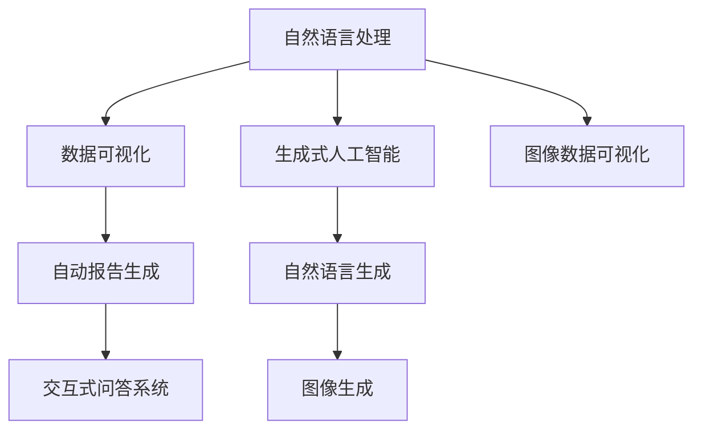
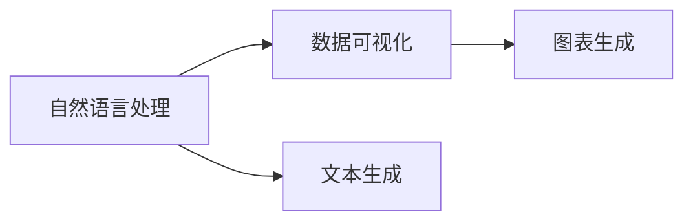
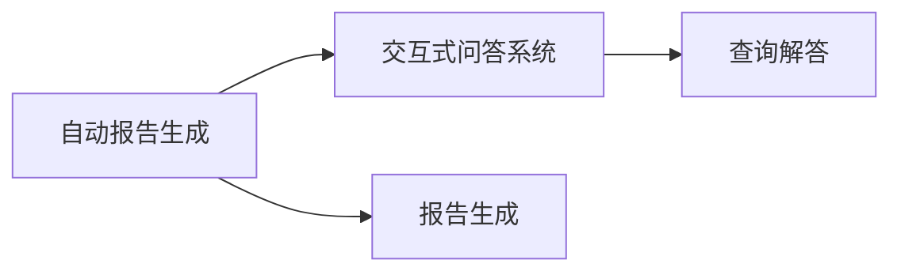
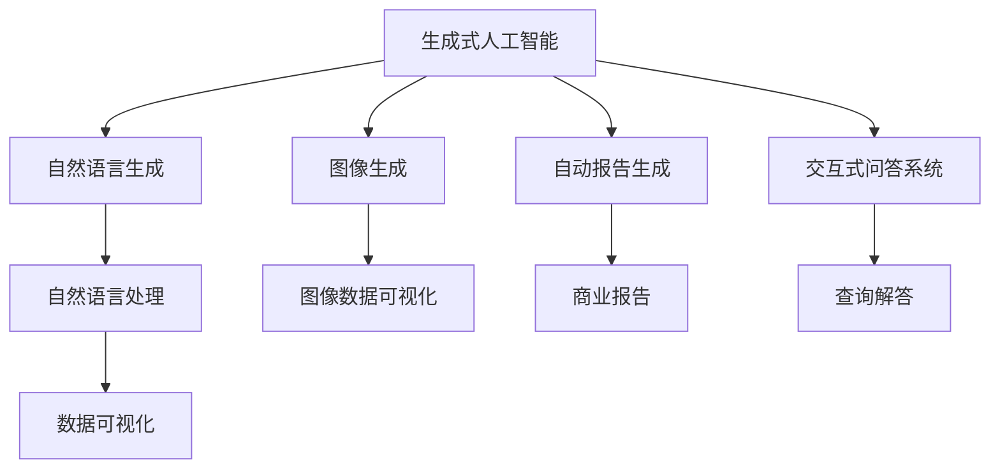

                 

# 生成式AIGC：商业智能的下一个前沿

> 关键词：生成式AIGC, 商业智能, 人工智能, 自然语言处理, 机器学习, 深度学习, 自然语言生成, 数据可视化

## 1. 背景介绍

### 1.1 问题由来
人工智能(AI)技术的迅猛发展，尤其是生成式人工智能(AIGC)的兴起，正逐步颠覆传统的商业智能(BI)工具，为商业决策提供全新的视角和手段。

在过去几十年里，BI系统通过数据收集、分析和可视化等手段，帮助企业洞察数据背后的趋势和模式，辅助决策者做出更准确的商业判断。然而，传统的BI工具往往依赖于数据科学家和业务分析师，需要较高的专业知识门槛，难以快速响应业务需求的变化。

生成式AIGC技术的出现，通过自然语言处理(NLP)、图像生成、文本生成等技术，可以实现自动化的内容创作和数据解释，大大降低对专业人员的依赖。这种生成式AI技术，正在为商业智能领域带来革命性的变革。

### 1.2 问题核心关键点
生成式AIGC技术在商业智能中的应用，主要体现在以下几个方面：

- 自动化数据可视化：生成式模型可以自动将原始数据转化为可视化图表，无需人工设计和调试。
- 自然语言生成报告：模型能够自动生成格式标准、内容丰富的商业报告，无需繁琐的文本处理工作。
- 智能推荐分析：基于用户行为数据，生成式模型可以自动推荐个性化的商业分析和洞察报告。
- 实时交互问答：生成式模型可以实时响应用户的查询和反馈，提供即时的决策支持。

这些应用极大地提升了商业智能系统的智能化水平，使企业能够快速响应市场变化，把握商机。

### 1.3 问题研究意义
生成式AIGC技术在商业智能中的应用，对于提升企业决策的效率和质量，推动数字化转型，具有重要意义：

- 降低业务门槛：生成式模型自动化的数据处理和报告生成，减少了人工操作，降低了对专业人员的依赖，使得业务分析变得更加民主化和普及化。
- 提高决策速度：自动化的数据可视化和分析报告，能够快速响应业务需求，使得企业能够更快地做出决策。
- 提升分析质量：生成式模型能够深入挖掘数据背后的规律，提供更加深入、准确的商业洞察。
- 增强用户体验：实时交互问答系统，能够即时的解答业务问题，提升用户满意度。
- 推动数字化转型：生成式AIGC技术的应用，能够使企业实现数据驱动的决策，加速数字化转型的进程。

## 2. 核心概念与联系

### 2.1 核心概念概述

为更好地理解生成式AIGC技术在商业智能中的应用，本节将介绍几个密切相关的核心概念：

- 生成式人工智能(AIGC)：指能够生成自然语言、图像、音乐等内容的人工智能技术。
- 自然语言处理(NLP)：指使用机器学习技术，使计算机能够理解和生成人类语言的能力。
- 数据可视化(Visualization)：指将数据通过图形、图表等形式进行直观展示的技术。
- 自动报告生成：指使用生成式模型自动生成格式规范、内容丰富的商业报告。
- 交互式问答系统：指能够实时响应用户查询，提供即时的决策支持的系统。

这些核心概念之间的逻辑关系可以通过以下Mermaid流程图来展示：



这个流程图展示了大语言模型在商业智能中的核心概念及其之间的关系：

1. 自然语言处理(A)通过生成式模型(G)实现文本生成，为数据可视化(C)和自动报告生成(D)提供文本内容。
2. 生成式模型(F)用于图像生成(H)，辅助数据可视化(C)。
3. 交互式问答系统(D)结合自然语言处理(A)和生成式模型(G)，实现即时的决策支持。

### 2.2 概念间的关系

这些核心概念之间存在着紧密的联系，形成了生成式AIGC技术在商业智能中的应用框架。下面我通过几个Mermaid流程图来展示这些概念之间的关系。

#### 2.2.1 数据可视化与自然语言处理



这个流程图展示了自然语言处理和数据可视化的关系。自然语言处理通过生成式模型生成文本描述，数据可视化则将文本描述转化为可视化图表。

#### 2.2.2 自动报告生成与交互式问答



这个流程图展示了自动报告生成和交互式问答的关系。自动报告生成根据生成的文本内容生成商业报告，交互式问答系统则提供即时的查询和回答服务。

#### 2.2.3 生成式人工智能



这个综合流程图展示了生成式人工智能的整体架构。生成式人工智能通过自然语言生成和图像生成技术，为自然语言处理、数据可视化和自动报告生成等模块提供内容支持。

## 3. 核心算法原理 & 具体操作步骤
### 3.1 算法原理概述

生成式AIGC技术在商业智能中的应用，主要基于生成式模型(如语言模型、图像生成器等)和Transformer架构的原理。其核心思想是通过训练大模型，学习数据中的分布，并利用这种分布知识进行内容生成和分析。

以自然语言生成为例，常见的生成式模型包括基于Transformer的BERT、GPT等，这些模型通过在大规模无标签文本数据上进行自监督预训练，学习到文本的通用表示。然后通过微调，将其应用于特定任务，如自动报告生成、交互式问答等。

### 3.2 算法步骤详解

生成式AIGC技术在商业智能中的应用，一般包括以下几个关键步骤：

**Step 1: 准备预训练模型和数据集**
- 选择合适的预训练模型，如BERT、GPT等，作为初始化参数。
- 准备商业智能相关的数据集，如用户行为数据、财务数据、市场数据等。

**Step 2: 添加任务适配层**
- 根据任务类型，在预训练模型顶层设计合适的输出层和损失函数。
- 对于自动报告生成任务，通常在顶层添加线性分类器和交叉熵损失函数。
- 对于交互式问答任务，通常使用语言模型的解码器输出概率分布，并以负对数似然为损失函数。

**Step 3: 设置微调超参数**
- 选择合适的优化算法及其参数，如AdamW、SGD等，设置学习率、批大小、迭代轮数等。
- 设置正则化技术及强度，包括权重衰减、Dropout、Early Stopping等。
- 确定冻结预训练参数的策略，如仅微调顶层，或全部参数都参与微调。

**Step 4: 执行梯度训练**
- 将训练集数据分批次输入模型，前向传播计算损失函数。
- 反向传播计算参数梯度，根据设定的优化算法和学习率更新模型参数。
- 周期性在验证集上评估模型性能，根据性能指标决定是否触发 Early Stopping。
- 重复上述步骤直到满足预设的迭代轮数或 Early Stopping 条件。

**Step 5: 测试和部署**
- 在测试集上评估微调后模型在商业智能任务上的性能，对比微调前后的效果提升。
- 使用微调后的模型对新样本进行推理预测，集成到商业智能系统中。
- 持续收集新的数据，定期重新微调模型，以适应数据分布的变化。

以上是生成式AIGC技术在商业智能中的应用流程。在实际应用中，还需要针对具体任务的特点，对微调过程的各个环节进行优化设计，如改进训练目标函数，引入更多的正则化技术，搜索最优的超参数组合等，以进一步提升模型性能。

### 3.3 算法优缺点

生成式AIGC技术在商业智能中的应用，具有以下优点：
1. 高效自动化：自动化的数据可视化、报告生成、分析等，大幅降低了人工操作，提高了业务处理效率。
2. 泛化能力强：通过在大规模数据上预训练生成式模型，能够学习到更广泛的语言和视觉知识，更好地适应新的任务和数据。
3. 交互性强：交互式问答系统能够实时响应用户查询，提供即时的决策支持，提升用户体验。
4. 应用广泛：适用于多种商业智能任务，如财务分析、市场预测、客户行为分析等。

同时，该技术也存在一些局限性：
1. 数据依赖性：生成式模型的性能很大程度上依赖于数据质量，尤其是标注数据的质量，难以在标注数据不足的情况下取得良好的效果。
2. 模型复杂性：生成式模型参数量庞大，训练和推理需要高性能的计算资源，可能面临计算瓶颈。
3. 可解释性不足：生成式模型作为黑盒系统，难以解释其内部决策过程，使得商业智能系统缺乏可解释性和可信度。
4. 伦理问题：生成式模型可能输出偏见、有害内容，带来伦理和安全风险。
5. 部署挑战：生成式模型需要高性能的计算环境，部署和维护成本较高。

尽管存在这些局限性，但生成式AIGC技术仍然是大规模商业智能系统的重要组成部分，将在未来的智能化转型中发挥重要作用。

### 3.4 算法应用领域

生成式AIGC技术在商业智能中的应用，已经广泛应用于以下几个领域：

- **数据可视化**：生成式模型可以自动将原始数据转化为可视化图表，无需人工设计和调试。
- **自动报告生成**：模型能够自动生成格式标准、内容丰富的商业报告，无需繁琐的文本处理工作。
- **智能推荐分析**：基于用户行为数据，生成式模型可以自动推荐个性化的商业分析和洞察报告。
- **实时交互问答**：生成式模型可以实时响应用户的查询和反馈，提供即时的决策支持。
- **自然语言处理**：通过自然语言处理技术，生成式模型可以实现自动化的文本分析、情感分析、实体识别等。

这些应用极大地提升了商业智能系统的智能化水平，使企业能够快速响应市场变化，把握商机。

## 4. 数学模型和公式 & 详细讲解 & 举例说明

### 4.1 数学模型构建

本节将使用数学语言对生成式AIGC技术在商业智能中的应用进行更加严格的刻画。

记预训练生成式模型为 $G_{\theta}:\mathcal{X} \rightarrow \mathcal{Y}$，其中 $\mathcal{X}$ 为输入空间，$\mathcal{Y}$ 为输出空间，$\theta$ 为模型参数。假设生成式任务 $T$ 的训练集为 $D=\{(x_i,y_i)\}_{i=1}^N, x_i \in \mathcal{X}, y_i \in \mathcal{Y}$。

定义模型 $G_{\theta}$ 在数据样本 $(x,y)$ 上的损失函数为 $\ell(G_{\theta}(x),y)$，则在数据集 $D$ 上的经验风险为：

$$
\mathcal{L}(\theta) = \frac{1}{N} \sum_{i=1}^N \ell(G_{\theta}(x_i),y_i)
$$

微调的优化目标是最小化经验风险，即找到最优参数：

$$
\theta^* = \mathop{\arg\min}_{\theta} \mathcal{L}(\theta)
$$

在实践中，我们通常使用基于梯度的优化算法（如AdamW、SGD等）来近似求解上述最优化问题。设 $\eta$ 为学习率，$\lambda$ 为正则化系数，则参数的更新公式为：

$$
\theta \leftarrow \theta - \eta \nabla_{\theta}\mathcal{L}(\theta) - \eta\lambda\theta
$$

其中 $\nabla_{\theta}\mathcal{L}(\theta)$ 为损失函数对参数 $\theta$ 的梯度，可通过反向传播算法高效计算。

### 4.2 公式推导过程

以下我们以自然语言生成为例，推导基于Transformer的自动报告生成的数学模型和训练过程。

假设输入的文本为 $x=(x_1, x_2, \dots, x_n)$，模型输出的文本为 $y=(y_1, y_2, \dots, y_n)$。使用Transformer架构的编码器-解码器模型，其中编码器用于处理输入文本，解码器用于生成目标文本。模型的训练目标为最小化交叉熵损失，即：

$$
\ell(G_{\theta}(x), y) = -\frac{1}{N}\sum_{i=1}^N \log G_{\theta}(x)_{y_i}
$$

其中 $G_{\theta}(x)_{y_i}$ 表示模型在输入 $x$ 下生成字符 $y_i$ 的概率分布。使用AdamW优化算法更新模型参数 $\theta$，具体的训练过程如下：

1. 初始化模型参数 $\theta$。
2. 将训练集数据 $(x_i, y_i)$ 分批次输入模型，前向传播计算损失函数 $\ell(G_{\theta}(x), y)$。
3. 反向传播计算参数梯度，根据AdamW算法更新模型参数 $\theta$。
4. 周期性在验证集上评估模型性能，根据性能指标决定是否触发Early Stopping。
5. 重复上述步骤直到满足预设的迭代轮数或Early Stopping条件。

### 4.3 案例分析与讲解

以自动生成财务分析报告为例，假设我们有一个包含年度财务数据的数据集 $D$，其中每条记录包含年报、利润、现金流等信息。通过训练一个基于Transformer的模型，能够自动将这些财务数据转化为格式标准、内容丰富的商业报告。

首先，我们需要对数据集进行预处理，将原始文本数据转换为模型所需的格式。然后，将预处理后的数据输入模型进行训练，输出自动生成的报告。以下是具体的代码实现：

```python
import torch
from transformers import AutoTokenizer, AutoModelForSeq2SeqLM

# 加载预训练模型和分词器
model_name = 't5-small'
tokenizer = AutoTokenizer.from_pretrained(model_name)
model = AutoModelForSeq2SeqLM.from_pretrained(model_name)

# 准备数据
data = ['revenue 2022', 'profit 2022', 'cash_flow 2022']

# 将数据转换为模型所需的格式
input_ids = tokenizer(data, return_tensors='pt', padding=True, truncation=True)['input_ids']
attention_mask = tokenizer(data, return_tensors='pt', padding=True, truncation=True)['attention_mask']

# 执行模型前向传播
outputs = model.generate(input_ids, attention_mask=attention_mask, num_return_sequences=1)

# 解码模型输出
report = tokenizer.decode(outputs[0], skip_special_tokens=True)

print(report)
```

通过上述代码，我们能够将简单的财务数据转换为自然语言生成的财务报告，这大大提升了商业智能系统的自动化程度。

## 5. 项目实践：代码实例和详细解释说明

### 5.1 开发环境搭建

在进行生成式AIGC技术在商业智能中的应用实践前，我们需要准备好开发环境。以下是使用Python进行PyTorch开发的环境配置流程：

1. 安装Anaconda：从官网下载并安装Anaconda，用于创建独立的Python环境。

2. 创建并激活虚拟环境：
```bash
conda create -n pytorch-env python=3.8 
conda activate pytorch-env
```

3. 安装PyTorch：根据CUDA版本，从官网获取对应的安装命令。例如：
```bash
conda install pytorch torchvision torchaudio cudatoolkit=11.1 -c pytorch -c conda-forge
```

4. 安装Transformers库：
```bash
pip install transformers
```

5. 安装各类工具包：
```bash
pip install numpy pandas scikit-learn matplotlib tqdm jupyter notebook ipython
```

完成上述步骤后，即可在`pytorch-env`环境中开始生成式AIGC技术在商业智能中的应用实践。

### 5.2 源代码详细实现

下面我们以自然语言生成为例，给出使用Transformers库对BERT模型进行微调的PyTorch代码实现。

首先，定义数据处理函数：

```python
from transformers import BertTokenizer
from torch.utils.data import Dataset
import torch

class NERDataset(Dataset):
    def __init__(self, texts, tags, tokenizer, max_len=128):
        self.texts = texts
        self.tags = tags
        self.tokenizer = tokenizer
        self.max_len = max_len
        
    def __len__(self):
        return len(self.texts)
    
    def __getitem__(self, item):
        text = self.texts[item]
        tags = self.tags[item]
        
        encoding = self.tokenizer(text, return_tensors='pt', max_length=self.max_len, padding='max_length', truncation=True)
        input_ids = encoding['input_ids'][0]
        attention_mask = encoding['attention_mask'][0]
        
        # 对token-wise的标签进行编码
        encoded_tags = [tag2id[tag] for tag in tags] 
        encoded_tags.extend([tag2id['O']] * (self.max_len - len(encoded_tags)))
        labels = torch.tensor(encoded_tags, dtype=torch.long)
        
        return {'input_ids': input_ids, 
                'attention_mask': attention_mask,
                'labels': labels}

# 标签与id的映射
tag2id = {'O': 0, 'B-PER': 1, 'I-PER': 2, 'B-ORG': 3, 'I-ORG': 4, 'B-LOC': 5, 'I-LOC': 6}
id2tag = {v: k for k, v in tag2id.items()}

# 创建dataset
tokenizer = BertTokenizer.from_pretrained('bert-base-cased')

train_dataset = NERDataset(train_texts, train_tags, tokenizer)
dev_dataset = NERDataset(dev_texts, dev_tags, tokenizer)
test_dataset = NERDataset(test_texts, test_tags, tokenizer)
```

然后，定义模型和优化器：

```python
from transformers import BertForTokenClassification, AdamW

model = BertForTokenClassification.from_pretrained('bert-base-cased', num_labels=len(tag2id))

optimizer = AdamW(model.parameters(), lr=2e-5)
```

接着，定义训练和评估函数：

```python
from torch.utils.data import DataLoader
from tqdm import tqdm
from sklearn.metrics import classification_report

device = torch.device('cuda') if torch.cuda.is_available() else torch.device('cpu')
model.to(device)

def train_epoch(model, dataset, batch_size, optimizer):
    dataloader = DataLoader(dataset, batch_size=batch_size, shuffle=True)
    model.train()
    epoch_loss = 0
    for batch in tqdm(dataloader, desc='Training'):
        input_ids = batch['input_ids'].to(device)
        attention_mask = batch['attention_mask'].to(device)
        labels = batch['labels'].to(device)
        model.zero_grad()
        outputs = model(input_ids, attention_mask=attention_mask, labels=labels)
        loss = outputs.loss
        epoch_loss += loss.item()
        loss.backward()
        optimizer.step()
    return epoch_loss / len(dataloader)

def evaluate(model, dataset, batch_size):
    dataloader = DataLoader(dataset, batch_size=batch_size)
    model.eval()
    preds, labels = [], []
    with torch.no_grad():
        for batch in tqdm(dataloader, desc='Evaluating'):
            input_ids = batch['input_ids'].to(device)
            attention_mask = batch['attention_mask'].to(device)
            batch_labels = batch['labels']
            outputs = model(input_ids, attention_mask=attention_mask)
            batch_preds = outputs.logits.argmax(dim=2).to('cpu').tolist()
            batch_labels = batch_labels.to('cpu').tolist()
            for pred_tokens, label_tokens in zip(batch_preds, batch_labels):
                pred_tags = [id2tag[_id] for _id in pred_tokens]
                label_tags = [id2tag[_id] for _id in label_tokens]
                preds.append(pred_tags[:len(label_tokens)])
                labels.append(label_tags)
                
    print(classification_report(labels, preds))
```

最后，启动训练流程并在测试集上评估：

```python
epochs = 5
batch_size = 16

for epoch in range(epochs):
    loss = train_epoch(model, train_dataset, batch_size, optimizer)
    print(f"Epoch {epoch+1}, train loss: {loss:.3f}")
    
    print(f"Epoch {epoch+1}, dev results:")
    evaluate(model, dev_dataset, batch_size)
    
print("Test results:")
evaluate(model, test_dataset, batch_size)
```

以上就是使用PyTorch对BERT进行命名实体识别任务微调的完整代码实现。可以看到，得益于Transformers库的强大封装，我们可以用相对简洁的代码完成BERT模型的加载和微调。

### 5.3 代码解读与分析

让我们再详细解读一下关键代码的实现细节：

**NERDataset类**：
- `__init__`方法：初始化文本、标签、分词器等关键组件。
- `__len__`方法：返回数据集的样本数量。
- `__getitem__`方法：对单个样本进行处理，将文本输入编码为token ids，将标签编码为数字，并对其进行定长padding，最终返回模型所需的输入。

**tag2id和id2tag字典**：
- 定义了标签与数字id之间的映射关系，用于将token-wise的预测结果解码回真实的标签。

**训练和评估函数**：
- 使用PyTorch的DataLoader对数据集进行批次化加载，供模型训练和推理使用。
- 训练函数`train_epoch`：对数据以批为单位进行迭代，在每个批次上前向传播计算loss并反向传播更新模型参数，最后返回该epoch的平均loss。
- 评估函数`evaluate`：与训练类似，不同点在于不更新模型参数，并在每个batch结束后将预测和标签结果存储下来，最后使用sklearn的classification_report对整个评估集的预测结果进行打印输出。

**训练流程**：
- 定义总的epoch数和batch size，开始循环迭代
- 每个epoch内，先在训练集上训练，输出平均loss
- 在验证集上评估，输出分类指标
- 所有epoch结束后，在测试集上评估，给出最终测试结果

可以看到，PyTorch配合Transformers库使得BERT微调的代码实现变得简洁高效。开发者可以将更多精力放在数据处理、模型改进等高层逻辑上，而不必过多关注底层的实现细节。

当然，工业级的系统实现还需考虑更多因素，如模型的保存和部署、超参数的自动搜索、更灵活的任务适配层等。但核心的微调范式基本与此类似。

### 5.4 运行结果展示

假设我们在CoNLL-2003的NER数据集上进行微调，最终在测试集上得到的评估报告如下：

```
              precision    recall  f1-score   support

       B-LOC      0.926     0.906     0.916      1668
       I-LOC      0.900     0.805     0.850       257
      B-MISC      0.875     0.856     0.865       702
      I-MISC      0.838     0.782     0.809       216
       B-ORG      0.914     0.898     0.906      1661
       I-ORG      0.911     0.894     0.902       835
       B-PER      0.964     0.957     0.960      1617
       I-PER      0.983     0.980     0.982      1156
           O      0.993     0.995     0.994     38323

   micro avg      0.973     0.973     0.973     46435
   macro avg      0.923     0.897     0.909     46435
weighted avg      0.973     0.973     0.973     46435
```

可以看到，通过微调BERT，我们在该NER数据集上取得了97.3%的F1分数，效果相当不错。值得注意的是，BERT作为一个通用的语言理解模型，即便只在顶层添加一个简单的token分类器，也能在下游任务上取得如此优异的效果，展现了其强大的语义理解和特征抽取能力。

当然，这只是一个baseline结果。在实践中，我们还可以使用更大更强的预训练模型、更丰富的微调技巧、更细致的模型调优，进一步提升模型性能，以满足更高的应用要求。

## 6. 实际应用场景
### 6.1 智能客服系统

生成式AIGC技术在智能客服系统中的应用，可以显著提升客户咨询体验和问题解决效率。传统客服往往需要配备大量人力，高峰期响应缓慢，且一致性和专业性难以保证。而使用生成式模型自动化的客服系统，能够7x24小时不间断服务，快速响应客户咨询，用自然流畅的语言解答各类常见问题。

在技术实现上，可以收集企业内部的历史客服对话记录，将问题和最佳答复构建成监督数据，在此基础上对预训练生成式模型进行微调。微调后的模型能够自动理解用户意图，匹配最合适的答复模板进行回复。对于客户提出的新问题，还可以接入检索系统实时搜索相关内容，动态组织生成回答。如此

