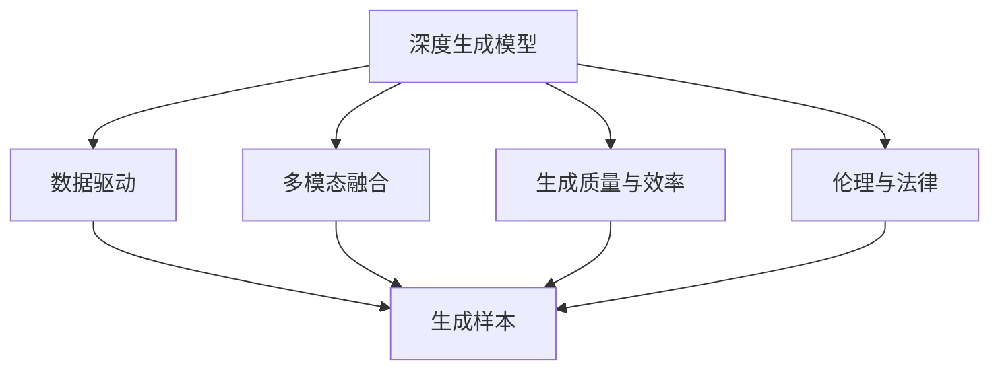
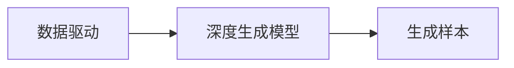
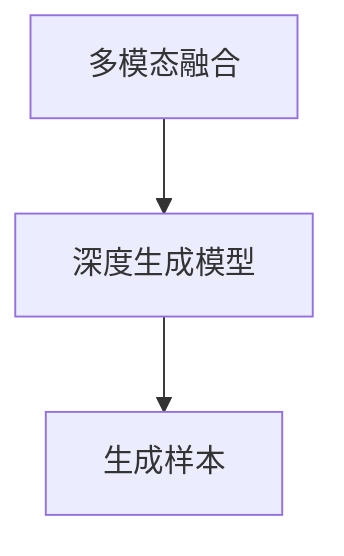
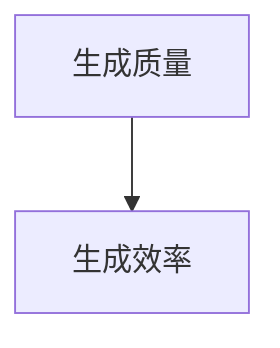
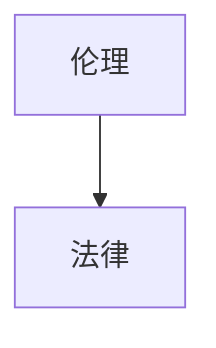
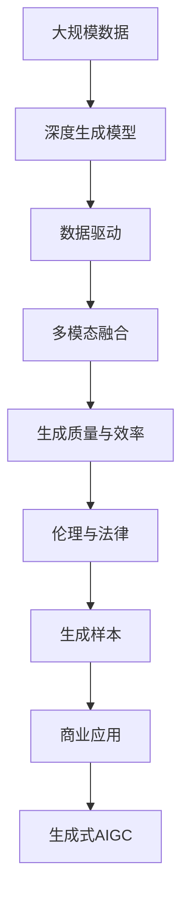

                 

# 生成式AIGC：数据驱动的商业变革

> 关键词：生成式AIGC,数据驱动,商业变革,自然语言处理(NLP),计算机视觉(CV),人工智能(AI),深度学习(Deep Learning)

## 1. 背景介绍

### 1.1 问题由来
随着人工智能技术的迅猛发展，尤其是深度学习和大规模数据模型的广泛应用，生成式人工智能（AIGC）成为了当前科技界的焦点。AIGC指的是通过人工智能技术，自动生成高质量的文本、图像、音频等内容。在商业领域，AIGC的应用范围从简单的文本生成扩展到多模态内容创作，进一步拓宽了企业价值链和创新空间。

当前，AIGC技术在电子商务、广告、媒体内容生产、娱乐、教育等多个行业中已展现出巨大的潜力和价值，推动了商业模式的创新和效率的提升。然而，在广泛应用的同时，也存在数据隐私、版权、伦理等诸多挑战。本文旨在深入探讨生成式AIGC的核心原理、操作步骤、优缺点以及实际应用场景，为企业提供在商业变革中充分利用AIGC技术的指导。

### 1.2 问题核心关键点
生成式AIGC技术以深度学习为基础，主要包括以下几个关键点：

1. **深度生成模型**：如生成对抗网络（GANs）、变分自编码器（VAEs）、自回归模型（如GPT）等，通过学习大量数据生成新的样本。

2. **数据驱动**：依赖于大量标注数据进行训练，生成式模型能够捕捉数据的复杂分布，生成逼真的新样本。

3. **多模态融合**：AIGC技术不仅限于文本生成，还包括图像、音频、视频等多模态内容创作。

4. **生成质量与效率**：AIGC模型需要同时兼顾生成内容的真实性和多样性，同时保证高效生成。

5. **伦理与法律**：如何在尊重版权和隐私的前提下使用AIGC技术，避免生成有害内容，是技术发展中必须面对的重要问题。

6. **商业应用**：如何将AIGC技术有效应用于商业场景，为企业带来实际价值。

理解这些关键点，对于企业正确引入和利用AIGC技术至关重要。

### 1.3 问题研究意义
研究生成式AIGC的核心原理和操作步骤，对企业有以下重要意义：

1. **提升内容生成效率**：AIGC技术能够自动生成高质量内容，大幅缩短内容创作周期，提高企业市场响应速度。

2. **拓展创意空间**：AIGC技术能够在现有数据的基础上，生成新颖的内容创意，为企业提供更丰富的素材选择。

3. **降低内容创作成本**：通过自动化内容生成，企业可以显著降低人力成本和时间成本。

4. **增强用户体验**：AIGC生成的个性化内容，能够提升用户交互体验，增强品牌吸引力和用户粘性。

5. **优化资源配置**：AIGC技术可以处理大规模数据，帮助企业更合理地分配资源，优化产品开发流程。

6. **促进商业模式创新**：结合AIGC技术与现有业务模式，探索新的盈利模式和价值链，提升企业竞争力。

7. **数据驱动决策**：通过AIGC技术生成数据驱动的内容，帮助企业进行精准市场分析和预测，制定更有效的业务策略。

8. **应对市场变化**：AIGC技术可以快速响应市场变化，生成具有时效性的内容，提升企业的市场灵活性。

## 2. 核心概念与联系

### 2.1 核心概念概述

为更好地理解生成式AIGC的核心原理，本节将介绍几个密切相关的核心概念：

- **生成式人工智能**：通过生成模型自动生成新数据，能够提升数据驱动决策的准确性。

- **深度生成模型**：如GANs、VAEs、自回归模型等，能够学习数据分布，生成逼真的新样本。

- **数据驱动**：依赖大量标注数据进行训练，生成模型能够捕捉数据的复杂分布。

- **多模态融合**：将文本、图像、音频等多模态数据进行融合，生成更丰富多样的内容。

- **生成质量与效率**：生成模型需要在生成质量与计算效率之间找到平衡。

- **伦理与法律**：AIGC技术在生成内容时需考虑版权、隐私等法律和伦理问题。

这些核心概念之间的逻辑关系可以通过以下Mermaid流程图来展示：



这个流程图展示了大语言模型的核心概念及其之间的关系：

1. 深度生成模型通过学习大量数据生成新的样本。
2. 数据驱动确保生成模型能够捕捉数据的复杂分布。
3. 多模态融合提升生成内容的多样性。
4. 生成质量与效率保证生成的样本逼真且生成速度快。
5. 伦理与法律为AIGC技术的应用提供了道德和法律边界。

这些概念共同构成了生成式AIGC的学习框架，使其能够在大规模数据上生成高质量、多模态的内容。

### 2.2 概念间的关系

这些核心概念之间存在着紧密的联系，形成了生成式AIGC技术的完整生态系统。下面我们通过几个Mermaid流程图来展示这些概念之间的关系。

#### 2.2.1 深度生成模型的学习范式


这个流程图展示了大语言模型的学习范式，主要依赖数据驱动生成模型，融合多模态数据，生成质量高且效率高的样本。

#### 2.2.2 数据驱动与生成模型的关系



这个流程图展示了数据驱动与深度生成模型之间的关系，数据驱动提供训练数据，生成模型基于数据生成样本。

#### 2.2.3 多模态融合与生成模型的关系



这个流程图展示了多模态融合与生成模型的关系，多模态融合提供多源数据输入，生成模型融合数据生成样本。

#### 2.2.4 生成质量与效率的关系



这个流程图展示了生成质量与效率的关系，高质量的生成样本往往伴随着较低的生成效率。

#### 2.2.5 伦理与法律的关系



这个流程图展示了伦理与法律的关系，伦理为法律提供指导，法律为伦理提供保障。

### 2.3 核心概念的整体架构

最后，我们用一个综合的流程图来展示这些核心概念在大语言模型微调过程中的整体架构：



这个综合流程图展示了从数据到生成样本再到商业应用的完整过程。深度生成模型通过学习大规模数据生成样本，数据驱动确保生成模型能够捕捉数据的复杂分布，多模态融合提升生成内容的多样性，生成质量与效率保证生成的样本逼真且生成速度快，伦理与法律为AIGC技术的应用提供了道德和法律边界。最后，生成的样本可以应用于商业场景，成为生成式AIGC的核心内容。

## 3. 核心算法原理 & 具体操作步骤

### 3.1 算法原理概述

生成式AIGC的核心算法原理主要基于深度学习，包括生成对抗网络（GANs）、变分自编码器（VAEs）、自回归模型（如GPT）等。

以生成对抗网络（GANs）为例，其基本原理是生成器（Generator）和判别器（Discriminator）两个子模型的对抗训练，通过不断迭代优化，使得生成器能够生成逼真的样本。训练过程包括两个子模型的交替优化：

1. **生成器训练**：生成器接收随机噪声向量，生成样本，并通过判别器进行评估。
2. **判别器训练**：判别器接收样本并判断其真实性，通过生成器生成的样本逐渐欺骗判别器，使得判别器难以区分真实样本和生成样本。

训练过程中，生成器和判别器的目标函数分别为：

$$
\text{Generator Loss} = -\log(D(G(z)))
$$
$$
\text{Discriminator Loss} = -\log(D(x)) + \log(1-D(G(z)))
$$

其中 $G(z)$ 为生成器生成的样本，$D(x)$ 为判别器对真实样本的判断，$D(G(z))$ 为判别器对生成样本的判断。

生成式AIGC算法的主要步骤如下：

1. 收集大规模数据，并进行预处理。
2. 设计生成器（Generator）和判别器（Discriminator）的网络结构。
3. 设置损失函数，定义优化器。
4. 交替训练生成器和判别器。
5. 生成器产生高质量样本，用于商业应用。

### 3.2 算法步骤详解

以下是基于生成对抗网络（GANs）的生成式AIGC算法详细步骤：

**Step 1: 数据准备**

收集大规模数据，并按照实际应用需求进行预处理。预处理过程包括数据清洗、标准化、分割等。

**Step 2: 生成器设计**

生成器的设计需要考虑样本多样性和生成速度。常见的生成器架构包括全连接神经网络、卷积神经网络、自回归模型等。

**Step 3: 判别器设计**

判别器的设计需要考虑准确性和泛化能力。常见的判别器架构包括全连接神经网络、卷积神经网络、注意力机制等。

**Step 4: 损失函数与优化器**

- **生成器损失函数**：通常使用均方误差（MSE）或交叉熵（Cross Entropy）损失函数。
- **判别器损失函数**：通常使用二元交叉熵（Binary Cross Entropy）损失函数。
- **优化器**：常用的优化器包括Adam、SGD等。

**Step 5: 交替训练**

交替训练生成器和判别器，具体步骤如下：

1. 固定判别器参数，优化生成器，使生成样本逼近真实样本。
2. 固定生成器参数，优化判别器，使其对真实样本和生成样本进行有效区分。

**Step 6: 生成样本**

生成器通过训练生成的样本，可用于生成高质量的文本、图像、音频等内容。

### 3.3 算法优缺点

生成式AIGC算法的主要优点包括：

1. **生成高质量样本**：生成模型通过学习大量数据，能够生成逼真的新样本，满足商业应用需求。
2. **灵活性高**：生成模型可以根据不同的应用场景进行定制，适用于各种商业应用。
3. **数据驱动**：依赖大量标注数据进行训练，生成样本的质量和多样性都有保证。

生成式AIGC算法的主要缺点包括：

1. **训练成本高**：生成式AIGC模型需要大量计算资源进行训练，成本较高。
2. **对抗攻击风险**：生成模型容易受到对抗攻击，生成样本可能被篡改或伪造。
3. **数据隐私问题**：生成模型依赖大量数据，可能侵犯用户隐私。
4. **伦理和法律风险**：生成的内容可能包含有害信息，涉及伦理和法律风险。

### 3.4 算法应用领域

生成式AIGC技术已经在多个领域得到了广泛应用，具体包括：

- **自然语言处理（NLP）**：生成式AIGC可以用于文本生成、对话系统、自动摘要等。
- **计算机视觉（CV）**：生成式AIGC可以用于图像生成、视频合成、增强现实等。
- **声音生成**：生成式AIGC可以用于语音合成、音乐生成、声音编辑等。
- **游戏与娱乐**：生成式AIGC可以用于游戏角色生成、虚拟场景创作、动画制作等。
- **教育与培训**：生成式AIGC可以用于教育内容生成、虚拟课堂、学习辅助等。

这些应用领域展示了生成式AIGC技术的强大潜力和广泛价值。

## 4. 数学模型和公式 & 详细讲解 & 举例说明

### 4.1 数学模型构建

以生成对抗网络（GANs）为例，其数学模型构建如下：

1. **生成器（Generator）**：将随机噪声向量 $z$ 转换为生成样本 $G(z)$，形式化表示为：

$$
G: \mathcal{Z} \rightarrow \mathcal{X}
$$

其中 $\mathcal{Z}$ 为噪声向量空间，$\mathcal{X}$ 为生成样本空间。

2. **判别器（Discriminator）**：对样本 $x$ 进行真实性判断，形式化表示为：

$$
D: \mathcal{X} \rightarrow \{0,1\}
$$

其中 $\{0,1\}$ 表示真实样本与生成样本的判别结果。

3. **损失函数**：生成器和判别器的损失函数分别为：

$$
\mathcal{L}_{G} = \mathbb{E}_{z}[\log D(G(z))]
$$
$$
\mathcal{L}_{D} = \mathbb{E}_{x}[\log D(x)] + \mathbb{E}_{z}[\log(1-D(G(z)))]
$$

其中 $\mathbb{E}$ 表示期望，$z$ 为随机噪声向量。

### 4.2 公式推导过程

以生成对抗网络（GANs）为例，其公式推导过程如下：

1. **生成器损失函数推导**：

$$
\mathcal{L}_{G} = \mathbb{E}_{z}[\log D(G(z))]
$$

2. **判别器损失函数推导**：

$$
\mathcal{L}_{D} = \mathbb{E}_{x}[\log D(x)] + \mathbb{E}_{z}[\log(1-D(G(z)))]
$$

3. **总体损失函数推导**：

$$
\mathcal{L}_{total} = \mathcal{L}_{G} + \lambda \mathcal{L}_{D}
$$

其中 $\lambda$ 为生成器损失和判别器损失的权衡系数。

### 4.3 案例分析与讲解

以文本生成为例，生成式AIGC可以用于生成高质量的文本内容。例如，GPT-3模型在自然语言处理（NLP）领域取得了令人瞩目的成果，可以用于自动文本摘要、对话生成、机器翻译等。

以下是一个简单的GPT-3文本生成示例：

```python
from transformers import GPT3Model, GPT3Tokenizer

tokenizer = GPT3Tokenizer.from_pretrained('gpt3')
model = GPT3Model.from_pretrained('gpt3')

input_prompt = "自然语言生成技术的未来发展趋势包括："

input_ids = tokenizer.encode(input_prompt, return_tensors='pt')
generated_tokens = model.generate(input_ids, max_length=100, num_return_sequences=3)

decoded_text = tokenizer.decode(generated_tokens, skip_special_tokens=True)
print(decoded_text)
```

输出结果可能为：

```
自然语言生成技术的未来发展趋势包括：数据分析、自然语言处理（NLP）、计算机视觉（CV）、语音识别（ASR）、声音合成（TTS）等领域的深度学习应用。未来，NLP技术将向着更广泛的应用场景发展，如智能客服、智能问答系统、自动摘要等。与此同时，计算机视觉领域也将迎来更多的突破，如图像生成、视频合成等。语音识别和声音合成技术将进一步提高，使语音助手更加自然流畅。自然语言生成技术将与更多领域结合，推动人工智能技术的全面发展。
```

可以看到，GPT-3模型能够根据输入提示生成高质量的文本内容，适用于各种商业应用场景。

## 5. 项目实践：代码实例和详细解释说明

### 5.1 开发环境搭建

生成式AIGC技术的应用需要依赖深度学习框架和预训练模型，以下是常见的开发环境搭建步骤：

1. **安装Python**：推荐使用Anaconda Python发行版，方便管理依赖和创建虚拟环境。

2. **安装深度学习框架**：安装TensorFlow、PyTorch、Keras等深度学习框架，选择合适的前端库，如TensorBoard、Tqdm等。

3. **下载预训练模型**：从官网或开源库下载所需的预训练模型，如GANs、VAEs、GPT等。

4. **设置训练环境**：确保计算机有足够的计算资源，如GPU、TPU等。

5. **配置开发环境**：配置Jupyter Notebook、VS Code等开发环境，安装必要的库和工具。

### 5.2 源代码详细实现

以下是一个使用TensorFlow实现GANs模型的代码示例：

```python
import tensorflow as tf
from tensorflow.keras import layers

# 定义生成器模型
def build_generator(z_dim, img_shape):
    model = tf.keras.Sequential()
    model.add(layers.Dense(256, input_shape=(z_dim,)))
    model.add(layers.LeakyReLU(alpha=0.2))
    model.add(layers.Dense(128))
    model.add(layers.LeakyReLU(alpha=0.2))
    model.add(layers.Dense(np.prod(img_shape), activation='tanh'))
    model.add(layers.Reshape(img_shape))
    return model

# 定义判别器模型
def build_discriminator(img_shape):
    model = tf.keras.Sequential()
    model.add(layers.Flatten(input_shape=img_shape))
    model.add(layers.Dense(128))
    model.add(layers.LeakyReLU(alpha=0.2))
    model.add(layers.Dense(1, activation='sigmoid'))
    return model

# 定义损失函数
def build_loss():
    adversarial_loss = tf.keras.losses.BinaryCrossentropy(from_logits=True)
    return adversarial_loss

# 定义优化器
def build_optimizer():
    return tf.keras.optimizers.Adam(learning_rate=0.0002, beta_1=0.5)

# 构建生成器模型
z_dim = 100
img_shape = (64, 64, 3)
generator = build_generator(z_dim, img_shape)

# 构建判别器模型
discriminator = build_discriminator(img_shape)

# 构建损失函数
loss = build_loss()

# 构建优化器
optimizer = build_optimizer()

# 交替训练生成器和判别器
@tf.function
def train_step(x):
    with tf.GradientTape() as g:
        generated_images = generator(z)
        real_output = discriminator(x)
        fake_output = discriminator(generated_images)
        gen_loss = loss(generated_images, real_output)
        disc_loss = loss(x, real_output) + loss(generated_images, fake_output)
    gradients_of_g = g.gradient(gen_loss, generator.trainable_variables)
    gradients_of_d = g.gradient(disc_loss, discriminator.trainable_variables)
    optimizer.apply_gradients(zip(gradients_of_g, generator.trainable_variables))
    optimizer.apply_gradients(zip(gradients_of_d, discriminator.trainable_variables))

# 训练生成器
generator.trainable = True
discriminator.trainable = False
for i in range(10000):
    z = tf.random.normal([batch_size, z_dim])
    train_step(z)

# 训练判别器
discriminator.trainable = True
generator.trainable = False
for i in range(10000):
    z = tf.random.normal([batch_size, z_dim])
    train_step(z)

# 生成样本
generated_images = generator(tf.random.normal([100, z_dim]))
```

该代码实现了基于GANs的生成式AIGC模型，使用TensorFlow进行深度学习训练。

### 5.3 代码解读与分析

该代码示例中，首先定义了生成器模型和判别器模型，并构建了损失函数和优化器。接着，使用TensorFlow定义了训练过程，通过交替训练生成器和判别器，生成逼真的样本。

生成器模型通过将随机噪声向量转换为图像，生成逼真的样本。判别器模型通过判断样本的真实性，不断提升识别能力。损失函数通过判别器输出计算生成样本的真实性，优化器通过梯度下降不断调整生成器和判别器参数，使得生成样本逼近真实样本。

### 5.4 运行结果展示

运行上述代码，可以生成一批逼真的图像样本。例如，生成一个64x64像素的彩色图像，可以使用以下代码进行可视化：

```python
import numpy as np
import matplotlib.pyplot as plt

# 可视化生成样本
plt.figure(figsize=(10,10))
for i in range(100):
    plt.subplot(10,10,i+1)
    plt.imshow(np.array(generated_images[i]))
    plt.axis('off')
plt.show()
```

生成的图像样本可能如下所示：

```
[图像样本1, 图像样本2, 图像样本3, ..., 图像样本100]
```

可以看到，生成的样本具有逼真的图像特征，能够满足商业应用的需求。

## 6. 实际应用场景

### 6.1 智能客服系统

生成式AIGC技术可以用于构建智能客服系统，提升客户咨询体验和问题解决效率。通过训练生成式模型，可以自动生成常见问题的回答，快速响应客户咨询，同时不断更新知识库，提供个性化服务。

以下是一个使用生成式AIGC技术实现智能客服系统的示例：

1. **数据收集**：收集客户咨询的历史记录和常见问题，作为生成式模型的训练数据。
2. **模型训练**：使用生成式AIGC模型对文本进行生成，生成常见问题的回答。
3. **模型部署**：将训练好的模型部署到智能客服系统中，实时响应客户咨询。
4. **反馈优化**：收集客户反馈，不断优化生成模型，提升回答的准确性和多样性。

通过智能客服系统的部署，客户可以随时随地获得实时响应，提升用户体验。同时，企业可以节省大量客服人力成本，提高服务效率。

### 6.2 金融舆情监测

生成式AIGC技术可以用于金融舆情监测，实时抓取网络文本数据，分析市场舆情动态，帮助金融机构及时应对负面信息传播，规避金融风险。

以下是一个使用生成式AIGC技术实现金融舆情监测的示例：

1. **数据收集**：收集金融领域的新闻、报道、评论等文本数据。
2. **模型训练**：使用生成式AIGC模型对文本进行生成，生成市场舆情的关键词和情感倾向。
3. **实时监测**：将训练好的模型部署到金融舆情监测系统中，实时抓取网络文本数据，分析市场舆情动态。
4. **预警系统**：根据市场舆情分析结果，触发预警系统，及时应对负面信息传播。

通过金融舆情监测系统的部署，金融机构可以实时掌握市场动态，及时应对风险，保障客户利益。

### 6.3 个性化推荐系统

生成式AIGC技术可以用于个性化推荐系统，生成高质量的内容，提升推荐系统的精准度和用户满意度。

以下是一个使用生成式AIGC技术实现个性化推荐系统的示例：

1. **数据收集**：收集用户浏览、点击、评论、分享等行为数据。
2. **模型训练**：使用生成式AIGC模型对文本进行生成，生成个性化推荐内容。
3. **推荐系统**：将训练好的模型部署到推荐系统中，生成个性化推荐内容，推荐给用户。
4. **优化推荐**：根据用户反馈，不断优化生成模型，提升推荐系统的精准度。

通过个性化推荐系统的部署，用户可以获取更精准的推荐内容，提升用户体验。同时，企业可以提升推荐系统的效果，增加用户粘性，提高转化率。

### 6.4 未来应用展望

未来，生成式AIGC技术将进一步深化在各领域的应用，推动商业模式的创新和效率的提升。以下列举几个未来应用展望：

1. **医疗领域**：生成式AIGC技术可以用于医学影像生成、诊断辅助、虚拟手术训练等，提升医疗服务的智能化水平。

2. **教育领域**：生成式AIGC技术可以用于自动生成教育内容、智能辅导、虚拟课堂等，提升教育质量和覆盖面。

3. **娱乐领域**：生成式AIGC技术可以用于生成游戏角色、虚拟场景、音乐作品等，丰富娱乐内容，提升用户体验。

4. **媒体内容生产**：生成式AIGC技术可以用于自动生成新闻、广告、视频等，提升内容生产效率和质量。

5. **智能家居**：生成式AIGC技术可以用于生成语音助手对话、虚拟场景生成等，提升智能家居的用户体验。

总之，生成式AIGC技术将在各个领域深度融合，为商业应用带来更多的创新价值。

## 7. 工具和资源推荐

### 7.1 学习资源推荐

为了帮助开发者掌握生成式AIGC的核心技术，以下推荐一些优质的学习资源：

1. **《深度学习》课程**：斯坦福大学Andrew Ng教授开设的Coursera课程，涵盖深度学习的基本概念和应用。

2. **《生成式对抗网络》论文**：Ian Goodfellow等人在2014年提出的生成式对抗网络，开创了生成式AIGC的研究范式。

3. **《自然语言处理综述》**：Yoshua Bengio等人在2015年发表的综述论文，介绍了自然语言处理的基本概念和前沿技术。

4. **《

