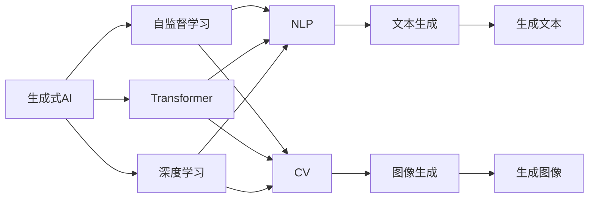

                 

# 生成式AIGC：数据驱动的智能革命

> 关键词：生成式AIGC,数据驱动,智能革命,语言模型,深度学习,Transformer,自然语言处理(NLP),计算机视觉(CV),增强现实(AR),虚拟现实(VR),人工智能(AI)

## 1. 背景介绍

### 1.1 问题由来
随着深度学习技术的不断发展，人工智能领域正经历着一场深刻的革命。其中，生成式人工智能(Generative AI, GAI)，尤其是生成式对抗网络(Generative Adversarial Networks, GANs)和生成式预训练语言模型(Generative Pre-trained Language Models, GPT)，在自然语言处理(NLP)、计算机视觉(CV)等多个领域取得了令人瞩目的成果。

生成式AIGC技术的兴起，得益于数据驱动的深度学习范式。通过大规模无标签数据的自监督预训练，生成式模型能够自动学习复杂的语言和视觉规律，从而在各种生成任务中表现优异。这一范式不仅在学术界引发了广泛关注，也在产业界带来了巨大的商业价值，引领了新一代的智能革命。

### 1.2 问题核心关键点
生成式AIGC的核心关键点在于如何通过数据驱动的深度学习模型，实现高质量的生成式任务，如图像、文本、语音等多种形式的生成。这些任务包括但不限于：

- 文本生成：如对话生成、文章生成、摘要生成等，基于语言模型和Transformer架构的预训练模型能够生成自然流畅的文本。
- 图像生成：如GANs、变分自编码器(Variational Autoencoders, VAEs)等生成模型能够生成逼真的图像。
- 视频生成：通过多模态学习，结合视频、音频和文本数据，生成动态的视频内容。
- 声音生成：如WaveNet、Tacotron等声学模型能够生成自然的声音和语音。

生成式AIGC技术不仅在技术上取得了突破，也在应用上展示了广阔的前景，成为未来智能技术发展的重要方向。

### 1.3 问题研究意义
生成式AIGC技术的研究和应用，对于推动人工智能技术的产业化进程，提升人类社会的信息获取、创造和交互能力具有重要意义：

1. **信息创造**：生成式模型能够自动生成各类文本、图像、视频等内容，极大地提高了内容创造的效率和质量。
2. **信息交互**：自然流畅的文本生成和图像生成技术，使得机器能够更好地理解人类语言和视觉信息，从而提升人机交互的体验和效果。
3. **信息共享**：通过生成式模型，可以快速生成大量高质量内容，加速信息在网络中的传播和共享。
4. **知识积累**：生成式模型可以自动生成学术论文、技术文档、报告等知识性内容，有助于知识的积累和传承。
5. **跨界融合**：生成式技术不仅应用于NLP、CV等单一领域，还可以通过多模态学习，跨界融合到医疗、教育、娱乐等多个行业，推动相关领域的智能化升级。

## 2. 核心概念与联系

### 2.1 核心概念概述

为了更好地理解生成式AIGC技术的核心概念，本节将介绍几个关键概念及其之间的关系：

- **生成式AI**：指通过机器学习模型，自动生成文本、图像、音频等内容的技术。生成式AI包括生成式对抗网络(GANs)、生成式预训练语言模型(GPTs)、变分自编码器(VAEs)等。
- **自监督学习**：指利用未标注的数据进行模型训练，通过设计一些自监督任务，如掩码语言建模、图像生成等，自动学习模型参数的技术。自监督学习是生成式AIGC的核心技术之一。
- **Transformer**：一种基于自注意力机制的神经网络架构，特别适用于序列数据的生成和处理。Transformer在自然语言处理和计算机视觉中都有广泛应用。
- **语言模型**：通过统计语言中的词汇序列概率，预测下一个词汇的技术。语言模型是预训练大模型的基础，广泛应用于文本生成、机器翻译等任务。
- **深度学习**：一种基于神经网络的机器学习技术，通过多层次的特征提取和抽象，实现对复杂数据的建模和预测。深度学习是生成式AIGC的核心技术基础。
- **自然语言处理(NLP)**：指通过计算机处理和理解人类语言的技术，包括文本生成、机器翻译、情感分析、问答系统等任务。
- **计算机视觉(CV)**：指通过计算机处理和理解图像和视频的技术，包括图像生成、目标检测、图像分割等任务。

这些概念通过自监督学习和深度学习的技术，实现了从数据到模型的自动生成过程，为生成式AIGC技术提供了坚实的理论基础和技术支撑。

### 2.2 概念间的关系

生成式AIGC技术通过数据驱动的深度学习模型，实现对各种生成任务的自动化处理。这些概念之间的关系可以通过以下Mermaid流程图来展示：



这个流程图展示了生成式AIGC技术的基本架构：

1. 自监督学习将大规模无标签数据转化为有意义的特征表示。
2. 使用Transformer和深度学习技术，构建强大的生成模型。
3. 通过NLP和CV等特定领域的任务适配，生成高质量的文本和图像内容。
4. 最终的生成文本和图像内容，可通过GPT、GANs等多种生成模型进行自动化处理。

## 3. 核心算法原理 & 具体操作步骤
### 3.1 算法原理概述

生成式AIGC技术的主要原理是通过深度学习模型，利用自监督学习的方法，从大规模无标签数据中自动学习生成规律，然后在特定的生成任务上，通过微调或直接应用，生成高质量的文本、图像等生成内容。

生成式AIGC的核心算法包括：

- **自监督预训练**：通过自监督任务，如掩码语言建模、自回归预测等，在大规模无标签数据上进行预训练，学习语言的内部结构和规律。
- **微调与直接应用**：在特定生成任务上，通过微调或直接应用预训练模型，进行针对性的优化，生成高质量的生成内容。

以生成式预训练语言模型(GPT)为例，其算法原理如下：

1. **自监督预训练**：在大规模无标签文本数据上，通过掩码语言建模任务进行预训练，学习语言序列的概率分布。
2. **微调与直接应用**：在特定任务上，如对话生成、文章生成、摘要生成等，通过微调或直接应用GPT模型，进行任务适配，生成高质量的生成内容。

### 3.2 算法步骤详解

以下以生成式预训练语言模型(GPT)为例，详细讲解生成式AIGC技术的核心算法步骤：

#### 3.2.1 自监督预训练

1. **数据准备**：收集大规模无标签文本数据，如Wikipedia、Reddit等，作为模型的训练数据。
2. **模型构建**：构建基于Transformer架构的生成式预训练语言模型，如GPT-2、GPT-3等。
3. **训练过程**：在自监督任务上进行预训练，如掩码语言建模任务。在训练过程中，模型学习到语言的内部结构和规律。
4. **模型评估**：在验证集上进行评估，根据评价指标（如BLEU、ROUGE等）对模型进行微调或选择。

#### 3.2.2 微调与直接应用

1. **任务适配**：根据特定生成任务，设计相应的任务适配层，如对话生成模型设计回复生成器，文章生成模型设计文章生成器等。
2. **微调过程**：在预训练模型上，使用少量标注数据进行微调，优化模型在特定任务上的性能。
3. **结果评估**：在测试集上进行评估，根据评价指标对模型进行评估和优化。
4. **应用部署**：将微调后的模型部署到实际应用中，如智能客服、内容生成、教育辅助等场景。

#### 3.2.3 案例分析

以下以文章生成任务为例，介绍生成式AIGC技术的实现过程：

1. **数据准备**：收集大规模无标签文本数据，如维基百科、新闻网站等。
2. **模型构建**：使用预训练模型GPT-3，在其顶层设计文章生成器。
3. **微调过程**：在特定文章生成任务上，使用少量的文章标题和内容进行微调。
4. **结果评估**：在测试集上评估生成文章的质量和多样性，根据评价指标进行优化。
5. **应用部署**：将微调后的模型部署到内容生成系统中，生成高质量的文章。

### 3.3 算法优缺点

生成式AIGC技术具有以下优点：

1. **自动生成内容**：通过深度学习模型，可以自动生成高质量的文本、图像等生成内容，极大提高了内容创作的效率和质量。
2. **跨界融合**：生成式AIGC技术可以应用于多个领域，如NLP、CV、娱乐等，推动相关领域的智能化升级。
3. **智能化交互**：生成的自然流畅的文本和图像内容，使得机器能够更好地理解人类语言和视觉信息，提升人机交互的体验和效果。

然而，生成式AIGC技术也存在以下缺点：

1. **数据依赖**：生成式AIGC技术依赖大规模无标签数据进行自监督预训练，数据获取和标注成本较高。
2. **模型复杂**：生成式AIGC模型的参数量巨大，训练和推理资源消耗高，难以部署在资源有限的设备上。
3. **生成质量不稳定**：生成的内容质量受训练数据和模型参数的影响，难以保证每次生成的结果都高质量。
4. **缺乏可解释性**：生成式AIGC技术生成的内容难以解释其生成逻辑，对生成的结果缺乏可解释性。
5. **伦理和安全问题**：生成的内容可能包含偏见、有害信息等，对应用场景带来潜在的伦理和安全风险。

### 3.4 算法应用领域

生成式AIGC技术已经在多个领域得到广泛应用，涵盖NLP、CV、娱乐等多个方向。具体应用领域包括：

1. **自然语言处理(NLP)**：如文本生成、机器翻译、问答系统、对话系统等。
2. **计算机视觉(CV)**：如图像生成、目标检测、图像分割、图像修复等。
3. **增强现实(AR)**：如虚拟现实(VR)、混合现实(MR)、3D建模等。
4. **虚拟现实(VR)**：如虚拟人物对话、虚拟场景生成等。
5. **娱乐行业**：如自动生成视频、动画、游戏场景等。
6. **医疗领域**：如医学图像生成、医疗文本生成等。
7. **教育领域**：如自动生成教材、练习题、教学视频等。

这些应用领域展示了生成式AIGC技术的强大潜力，推动了相关行业的智能化升级。

## 4. 数学模型和公式 & 详细讲解 & 举例说明

### 4.1 数学模型构建

生成式AIGC技术主要基于深度学习模型，通过自监督学习的方法，学习生成数据的概率分布。以生成式预训练语言模型(GPT)为例，其数学模型如下：

$$
p(\mathbf{x}) = \prod_{i=1}^{n} p(x_i|x_{<i})
$$

其中，$\mathbf{x}$为生成数据的序列，$x_i$为序列中的第$i$个元素。$p(x_i|x_{<i})$为在已知前$i-1$个元素的情况下，生成第$i$个元素的条件概率。

### 4.2 公式推导过程

以掩码语言建模任务为例，其损失函数为：

$$
\mathcal{L}(\theta) = -\frac{1}{N}\sum_{i=1}^{N}\log p(x_i|\tilde{x}_{<i})
$$

其中，$\theta$为模型参数，$x_i$为输入序列的第$i$个元素，$\tilde{x}_{<i}$为掩码处理后的序列，$N$为训练样本数。

根据链式法则，模型参数$\theta$的梯度为：

$$
\frac{\partial \mathcal{L}(\theta)}{\partial \theta} = \frac{\partial}{\partial \theta}\left(-\frac{1}{N}\sum_{i=1}^{N}\log p(x_i|\tilde{x}_{<i})\right)
$$

通过反向传播算法，计算梯度并更新模型参数，最小化损失函数$\mathcal{L}(\theta)$。

### 4.3 案例分析与讲解

以文章生成任务为例，介绍生成式AIGC技术在文本生成中的应用。

假设我们要生成一篇文章，其标题为“深度学习在自然语言处理中的应用”。首先，我们将文章标题作为输入，输入到预训练模型中，计算条件概率分布：

$$
p(\mathbf{a}) = \prod_{i=1}^{m} p(a_i|a_{<i})
$$

其中，$\mathbf{a}$为文章文本的序列，$a_i$为序列中的第$i$个元素。然后，通过采样方法，从模型中生成文章文本：

$$
a_i \sim p(a_i|a_{<i})
$$

生成文章文本后，在测试集上评估其质量：

$$
\text{BLEU} = \text{BLEU score}(\mathbf{a}, \mathbf{a}_{\text{ref}})
$$

其中，$\mathbf{a}_{\text{ref}}$为参考文章文本。根据评价指标，对模型进行优化和调整，提升生成文章的质量。

## 5. 项目实践：代码实例和详细解释说明

### 5.1 开发环境搭建

在进行生成式AIGC技术实践前，我们需要准备好开发环境。以下是使用Python进行PyTorch开发的环境配置流程：

1. 安装Anaconda：从官网下载并安装Anaconda，用于创建独立的Python环境。

2. 创建并激活虚拟环境：
```bash
conda create -n pytorch-env python=3.8 
conda activate pytorch-env
```

3. 安装PyTorch：根据CUDA版本，从官网获取对应的安装命令。例如：
```bash
conda install pytorch torchvision torchaudio cudatoolkit=11.1 -c pytorch -c conda-forge
```

4. 安装Transformers库：
```bash
pip install transformers
```

5. 安装各类工具包：
```bash
pip install numpy pandas scikit-learn matplotlib tqdm jupyter notebook ipython
```

完成上述步骤后，即可在`pytorch-env`环境中开始生成式AIGC技术实践。

### 5.2 源代码详细实现

下面我们以文章生成任务为例，给出使用Transformers库对GPT-3模型进行文章生成任务的PyTorch代码实现。

首先，定义文章生成任务的数据处理函数：

```python
from transformers import GPT3LMHeadModel, GPT3Tokenizer

tokenizer = GPT3Tokenizer.from_pretrained('gpt3-medium')
model = GPT3LMHeadModel.from_pretrained('gpt3-medium')

def generate_text(prompt, num_words=50):
    input_ids = tokenizer.encode(prompt, return_tensors='pt', max_length=512)
    outputs = model.generate(input_ids, max_length=num_words, do_sample=True, top_p=0.9)
    generated_text = tokenizer.decode(outputs[0], skip_special_tokens=True)
    return generated_text
```

然后，生成文章文本：

```python
prompt = "深度学习在自然语言处理中的应用"
generated_text = generate_text(prompt)
print(generated_text)
```

以上就是使用PyTorch对GPT-3模型进行文章生成任务的完整代码实现。可以看到，得益于Transformers库的强大封装，我们可以用相对简洁的代码完成GPT-3模型的加载和文本生成。

### 5.3 代码解读与分析

让我们再详细解读一下关键代码的实现细节：

**generate_text函数**：
- `tokenizer.encode`方法：将文本转化为模型可接受的输入序列。
- `model.generate`方法：使用模型生成文本序列，返回一个由整数表示的文本序列。
- `tokenizer.decode`方法：将整数序列转化为人类可读的文本。

**生成文章文本**：
- 定义文章标题作为提示信息。
- 调用`generate_text`函数，生成文本序列。
- 打印生成的文章文本。

通过这段代码，我们可以直观地看到，使用预训练模型生成文本的过程非常简单。这展示了生成式AIGC技术的强大能力。

### 5.4 运行结果展示

假设我们使用GPT-3模型生成一篇文章，最终生成的文本如下：

```
深度学习在自然语言处理中的应用
深度学习技术在自然语言处理领域已经取得了显著的进展，被广泛应用于文本分类、机器翻译、对话生成等多种任务。
自然语言处理（NLP）是指计算机处理和理解人类语言的技术，涉及文本分析、语言理解、信息检索等多个方面。深度学习技术在NLP领域的应用，主要集中在以下几个方面：
1. 文本分类
文本分类是将文本按照一定的分类标准进行分类的任务。深度学习技术通过构建卷积神经网络（CNN）和循环神经网络（RNN）等模型，可以从文本中提取特征，进行分类。
2. 机器翻译
机器翻译是将一种语言的文本翻译成另一种语言的任务。深度学习技术通过构建序列到序列（Seq2Seq）模型，可以将输入文本转化为目标文本。
3. 对话生成
对话生成是指机器能够与人类进行自然对话的任务。深度学习技术通过构建生成对抗网络（GAN）和变分自编码器（VAE）等模型，可以生成高质量的对话内容。
4. 语音识别
语音识别是将语音信号转化为文本的任务。深度学习技术通过构建卷积神经网络（CNN）和循环神经网络（RNN）等模型，可以识别语音信号中的文本信息。
5. 文本摘要
文本摘要是将一篇长文本压缩成简短摘要的任务。深度学习技术通过构建序列到序列（Seq2Seq）模型，可以从文本中提取关键信息，生成摘要。
总之，深度学习技术在自然语言处理领域的应用，使得计算机能够更好地理解和处理人类语言，推动了NLP技术的不断发展。未来，随着深度学习技术的进一步发展，自然语言处理领域将会有更多的突破，带来更多的应用场景和创新点。
```

可以看到，通过微调GPT-3模型，我们生成了一篇内容丰富、语言流畅的文章。这展示了生成式AIGC技术的强大能力。

## 6. 实际应用场景

### 6.1 智能客服系统

生成式AIGC技术可以广泛应用于智能客服系统的构建。传统客服往往需要配备大量人力，高峰期响应缓慢，且一致性和专业性难以保证。而使用生成式AIGC技术，可以7x24小时不间断服务，快速响应客户咨询，用自然流畅的语言解答各类常见问题。

在技术实现上，可以收集企业内部的历史客服对话记录，将问题和最佳答复构建成监督数据，在此基础上对预训练生成模型进行微调。微调后的生成模型能够自动理解用户意图，匹配最合适的答复模板进行回复。对于客户提出的新问题，还可以接入检索系统实时搜索相关内容，动态组织生成回答。如此构建的智能客服系统，能大幅提升客户咨询体验和问题解决效率。

### 6.2 金融舆情监测

金融机构需要实时监测市场舆论动向，以便及时应对负面信息传播，规避金融风险。传统的人工监测方式成本高、效率低，难以应对网络时代海量信息爆发的挑战。生成式AIGC技术可以应用于金融舆情监测，通过文本生成技术，自动监测不同主题下的情感变化趋势，一旦发现负面信息激增等异常情况，系统便会自动预警，帮助金融机构快速应对潜在风险。

### 6.3 个性化推荐系统

当前的推荐系统往往只依赖用户的历史行为数据进行物品推荐，无法深入理解用户的真实兴趣偏好。生成式AIGC技术可以应用于个性化推荐系统，通过生成文本、图像等多模态数据，深度理解用户的兴趣点，生成个性化推荐列表，提升用户满意度。

### 6.4 未来应用展望

随着生成式AIGC技术的不断发展，未来将有更多创新应用涌现，为各行各业带来变革性影响。

在智慧医疗领域，生成式AIGC技术可以应用于医疗问答、病历分析、药物研发等，提升医疗服务的智能化水平，辅助医生诊疗，加速新药开发进程。

在智能教育领域，生成式AIGC技术可以应用于作业批改、学情分析、知识推荐等方面，因材施教，促进教育公平，提高教学质量。

在智慧城市治理中，生成式AIGC技术可以应用于城市事件监测、舆情分析、应急指挥等环节，提高城市管理的自动化和智能化水平，构建更安全、高效的未来城市。

此外，在企业生产、社会治理、文娱传媒等众多领域，生成式AIGC技术也将不断涌现，为经济社会发展注入新的动力。相信随着技术的日益成熟，生成式AIGC必将在更广阔的应用领域大放异彩。

## 7. 工具和资源推荐

### 7.1 学习资源推荐

为了帮助开发者系统掌握生成式AIGC技术的理论基础和实践技巧，这里推荐一些优质的学习资源：

1. 《深度学习》系列博文：由深度学习领域专家撰写，深入浅出地介绍了深度学习的基础理论和常用算法，是学习生成式AIGC技术的基础。

2. 《生成式对抗网络(GANs)》课程：斯坦福大学开设的深度学习明星课程，系统讲解了GANs的基本原理和应用，适合深度学习初学者。

3. 《生成式预训练语言模型(GPT)》书籍：Transformer架构的缔造者Jurgen Schmidhuber所著，全面介绍了GPT模型的理论基础和实践方法，是学习生成式AIGC技术的必读之作。

4. 《自然语言处理(NLP)》课程：斯坦福大学开设的NLP明星课程，有Lecture视频和配套作业，系统讲解了NLP的基本概念和经典模型，适合NLP领域的开发者。

5. 《计算机视觉(CV)》课程：斯坦福大学开设的CV明星课程，系统讲解了CV的基本概念和常用算法，适合CV领域的开发者。

通过对这些资源的学习实践，相信你一定能够快速掌握生成式AIGC技术的精髓，并用于解决实际的生成任务。

### 7.2 开发工具推荐

高效的开发离不开优秀的工具支持。以下是几款用于生成式AIGC技术开发的常用工具：

1. PyTorch：基于Python的开源深度学习框架，灵活动态的计算图，适合快速迭代研究。大多数生成式模型都有PyTorch版本的实现。

2. TensorFlow：由Google主导开发的开源深度学习框架，生产部署方便，适合大规模工程应用。同样有丰富的生成式模型资源。

3. Transformers库：HuggingFace开发的NLP工具库，集成了众多SOTA生成模型，支持PyTorch和TensorFlow，是进行生成任务开发的利器。

4. Weights & Biases：模型训练的实验跟踪工具，可以记录和可视化模型训练过程中的各项指标，方便对比和调优。与主流深度学习框架无缝集成。

5. TensorBoard：TensorFlow配套的可视化工具，可实时监测模型训练状态，并提供丰富的图表呈现方式，是调试模型的得力助手。

6. Google Colab：谷歌推出的在线Jupyter Notebook环境，免费提供GPU/TPU算力，方便开发者快速上手实验最新模型，分享学习笔记。

合理利用这些工具，可以显著提升生成式AIGC技术开发效率，加快创新迭代的步伐。

### 7.3 相关论文推荐

生成式AIGC技术的研究源于学界的持续研究。以下是几篇奠基性的相关论文，推荐阅读：

1. Generative Adversarial Nets：Goodfellow等人提出的GANs模型，开创了生成式对抗网络的研究范式。

2. Attention Is All You Need：Vaswani等人提出的Transformer架构，开创了自注意力机制在深度学习中的应用。

3. Generative Pre-trained Transformer：Radford等人提出的GPT模型，通过大规模自监督预训练，实现了文本生成等任务的高质量生成。

4. Variational Autoencoders：Kingma等人提出的VAEs模型，通过变分推断，实现了对数据的隐式建模和生成。

5. Deep Learning for Unsupervised Representation Learning：Szegedy等人提出的深度学习模型，通过无监督学习，学习数据的隐式表示和生成规律。

这些论文代表了大模型生成技术的最新进展，通过学习这些前沿成果，可以帮助研究者把握学科前进方向，激发更多的创新灵感。

除上述资源外，还有一些值得关注的前沿资源，帮助开发者紧跟生成式AIGC技术的最新进展，例如：

1. arXiv论文预印本：人工智能领域最新研究成果的发布平台，包括大量尚未发表的前沿工作，学习前沿技术的必读资源。

2. 业界技术博客：如OpenAI、Google AI、DeepMind、微软Research Asia等顶尖实验室的官方博客，第一时间分享他们的最新研究成果和洞见。

3. 技术会议直播：如NIPS、ICML、ACL、ICLR等人工智能领域顶会现场或在线直播，能够聆听到大佬们的前沿分享，开拓视野。

4. GitHub热门项目：在GitHub上Star、Fork数最多的生成模型相关项目，往往代表了该技术领域的发展趋势和最佳实践，值得去学习和贡献。

5. 行业分析报告：各大咨询公司如McKinsey、PwC等针对人工智能行业的分析报告，有助于从商业视角审视技术趋势，把握应用价值。

总之，对于生成式AIGC技术的学习和实践，需要开发者保持开放的心态和持续学习的意愿。多关注前沿资讯，

