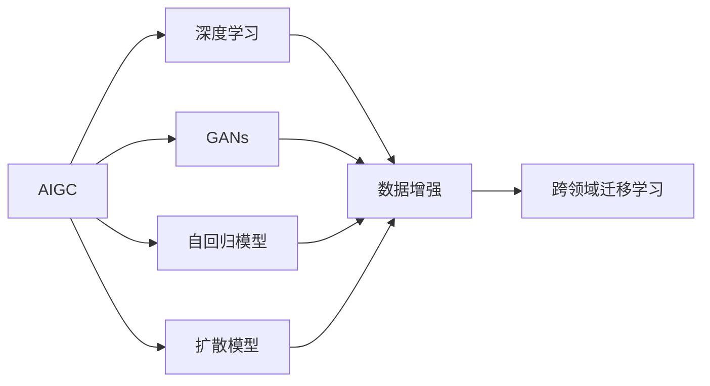
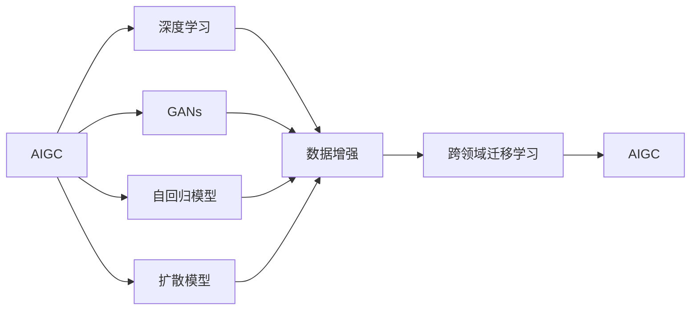
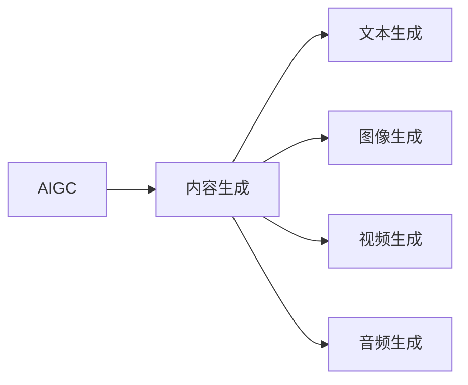
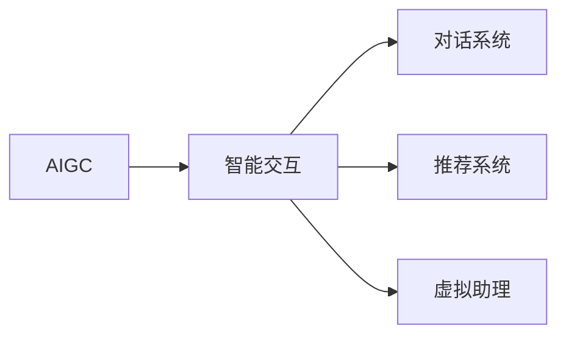
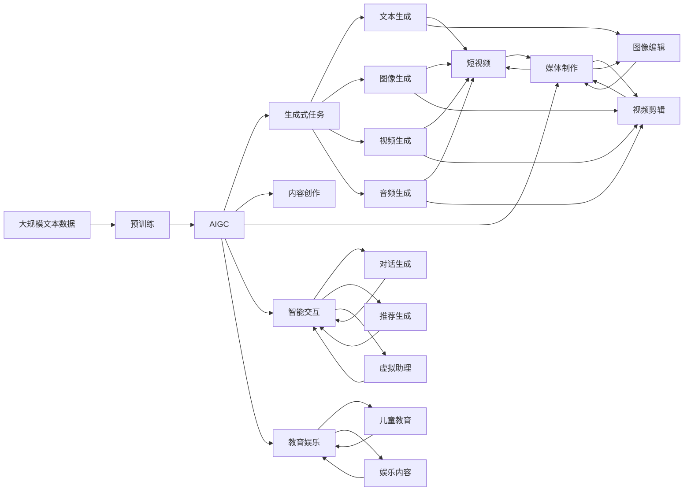

                 

# 生成式AI：金矿还是泡沫？第六部分：AIGC将是未来10年的长坡厚雪

## 1. 背景介绍

### 1.1 问题由来

随着AI技术的发展，生成式人工智能(AIGC)成为当前科技领域的热门话题。AIGC能够自动生成高质量、多样化的内容，如文本、图像、视频、音频等，极大地拓展了人工智能的边界。然而，随着AIGC技术的火热，关于其未来发展趋势、应用前景和潜在风险的讨论也愈发激烈，引发了业界对AIGC究竟是“金矿”还是“泡沫”的深度思考。

### 1.2 问题核心关键点

AIGC技术背后的核心技术包括深度学习、生成对抗网络(GANs)、自回归模型(如BERT)和扩散模型等，这些技术通过在大量无标签数据上预训练，然后利用小样本数据进行微调或直接生成内容，具有生成逼真度、多样性、可控性等特点。

AIGC技术在内容创作、媒体制作、智能交互、教育娱乐等多个领域展现出巨大潜力。但同时，也面临着数据质量、模型稳定性、隐私保护、版权归属等挑战。

### 1.3 问题研究意义

AIGC技术的探讨，不仅有助于了解当前AI技术的发展现状，还能为未来的技术创新和产业应用提供指导。通过深入分析AIGC技术，可以帮助业界明确其商业价值、社会影响和风险管理策略，为AIGC的健康发展奠定基础。

## 2. 核心概念与联系

### 2.1 核心概念概述

为更好地理解AIGC技术，本节将介绍几个密切相关的核心概念：

- 生成式人工智能(AIGC)：利用AI技术自动生成文本、图像、视频、音频等内容的通用框架。

- 深度学习：通过多层神经网络模型，自动学习输入数据中的特征和模式。

- 生成对抗网络(GANs)：包含生成器和判别器的两组神经网络，生成器用于生成逼真内容，判别器用于鉴别真伪。

- 自回归模型(如BERT)：通过前后文关联，预测下一个单词或词组的概率分布。

- 扩散模型：通过缓慢地引导数据分布，生成高质量的样本。

- 数据增强：通过对输入数据进行变换，扩充训练集，提升模型泛化能力。

- 跨领域迁移学习：将一个领域学到的知识迁移到另一个领域，提升模型在不同任务上的性能。

这些概念之间的逻辑关系可以通过以下Mermaid流程图来展示：



这个流程图展示了大语言模型微调过程中各个核心概念的关系和作用：

1. AIGC框架包含深度学习、GANs、自回归模型和扩散模型等，通过预训练和微调生成高质量内容。
2. 数据增强和跨领域迁移学习是AIGC技术的重要辅助手段，通过扩充训练数据和知识迁移，提升模型效果。
3. 深度学习是AIGC的基础技术，通过自动学习输入数据的特征，支持生成器的训练和判别器的鉴别。

### 2.2 概念间的关系

这些核心概念之间存在着紧密的联系，形成了AIGC技术的完整生态系统。下面我通过几个Mermaid流程图来展示这些概念之间的关系。

#### 2.2.1 AIGC的基本框架



这个流程图展示了AIGC技术的核心框架，包括深度学习、GANs、自回归模型和扩散模型，以及数据增强和跨领域迁移学习等辅助技术。

#### 2.2.2 AIGC在内容生成中的应用



这个流程图展示了AIGC在文本、图像、视频、音频等不同内容生成任务中的应用，每个任务都需要选择合适的生成模型进行训练和优化。

#### 2.2.3 AIGC在智能交互中的应用



这个流程图展示了AIGC在对话系统、推荐系统、虚拟助理等智能交互任务中的应用，通过生成自然流畅的对话内容或个性化推荐，提升用户体验。

### 2.3 核心概念的整体架构

最后，我们用一个综合的流程图来展示AIGC技术的整体架构：



这个综合流程图展示了AIGC技术的整体架构，从预训练到生成式任务，再到具体内容创作、媒体制作、智能交互、教育娱乐等多个应用场景。

## 3. 核心算法原理 & 具体操作步骤
### 3.1 算法原理概述

AIGC技术的核心算法包括深度学习、GANs、自回归模型和扩散模型等，其中深度学习模型通过在大量无标签数据上预训练，生成器通过小样本数据进行微调，从而生成高质量的内容。GANs通过对抗训练，提升生成器生成内容的逼真度。自回归模型和扩散模型则分别通过不同机制生成文本和图像。

### 3.2 算法步骤详解

AIGC技术的训练和应用主要包括以下几个步骤：

**Step 1: 准备预训练模型和数据集**

- 选择合适的深度学习模型（如GANs、自回归模型、扩散模型）作为初始化参数。
- 准备生成任务所需的数据集，划分为训练集、验证集和测试集。

**Step 2: 微调生成器**

- 将预训练模型作为生成器的初始化参数。
- 使用生成任务的数据集，对生成器进行微调，使其能够生成高质量的内容。

**Step 3: 评估和优化**

- 在验证集上评估生成器的性能，通过交叉验证等方法选择最优的微调参数。
- 根据评估结果，不断调整生成器的微调策略和超参数，提高生成内容的逼真度和多样性。

**Step 4: 部署和应用**

- 将优化后的生成器部署到实际应用中，生成高质量的内容。
- 实时监测生成器的性能，根据用户反馈进行动态优化和调整。

### 3.3 算法优缺点

AIGC技术具有以下优点：

1. 自动生成高质量内容。AIGC技术能够快速生成逼真、多样化的文本、图像、视频等，减少了人力成本和时间成本。
2. 跨领域应用广泛。AIGC技术在内容创作、媒体制作、智能交互等多个领域都有广泛应用。
3. 推动技术创新。AIGC技术的发展催生了新的技术方向，如对抗生成网络、扩散模型等，推动了深度学习领域的进步。

同时，AIGC技术也存在以下缺点：

1. 数据质量依赖。AIGC技术的性能很大程度上依赖于训练数据的质量和数量，获取高质量数据成本较高。
2. 生成内容质量不稳定。AIGC模型生成的内容质量受模型参数、训练数据、超参数等影响较大，生成内容不稳定。
3. 版权和隐私问题。AIGC技术生成的内容可能涉及版权归属和隐私保护，引发法律和伦理争议。

### 3.4 算法应用领域

AIGC技术在以下领域得到了广泛应用：

- 内容创作：如自动写作、自动翻译、自动摘要等，减少了人工创作的工作量，提高了创作效率。
- 媒体制作：如自动生成视频、音频、图像等，为媒体内容制作提供了新的思路和方法。
- 智能交互：如智能客服、虚拟助理、智能推荐等，提升了用户体验和互动质量。
- 教育娱乐：如自动生成儿童教育内容、娱乐节目等，推动了教育娱乐产业的数字化转型。
- 广告营销：如自动生成广告文案、视频广告等，提高了广告的创作效率和投放效果。

除了上述领域，AIGC技术还在游戏、金融、医疗等多个领域展现出巨大潜力，正在逐步拓展其应用边界。

## 4. 数学模型和公式 & 详细讲解 & 举例说明

### 4.1 数学模型构建

假设AIGC模型为 $M_{\theta}$，其中 $\theta$ 为模型的可训练参数。给定生成任务 $T$ 的训练数据集 $D=\{(x_i, y_i)\}_{i=1}^N$，生成器 $G_{\phi}$ 和判别器 $D_{\psi}$ 分别通过预训练和微调学习生成和鉴别任务。

定义生成器的损失函数为：

$$
\mathcal{L}_G = \frac{1}{N} \sum_{i=1}^N \log D(G_{\phi}(x_i))
$$

定义判别器的损失函数为：

$$
\mathcal{L}_D = \frac{1}{N} \sum_{i=1}^N (\log D(x_i) + \log (1-D(G_{\phi}(x_i))))
$$

在生成任务上，AIGC模型的目标是最小化总损失函数：

$$
\mathcal{L}(M_{\theta}) = \mathcal{L}_G + \mathcal{L}_D
$$

通过梯度下降等优化算法，最小化总损失函数，使生成器能够生成逼真、多样化的内容。

### 4.2 公式推导过程

以下以文本生成任务为例，推导GANs模型的损失函数及梯度计算公式。

假设生成器 $G_{\phi}$ 将文本 $x$ 映射为文本 $y$，判别器 $D_{\psi}$ 用于判断文本 $y$ 的真实性。定义生成器在文本 $x$ 上的损失函数为：

$$
\ell(G_{\phi}(x),y) = \log D_{\psi}(y)
$$

将文本 $x$ 输入生成器 $G_{\phi}$，得到生成文本 $y$，代入损失函数中，得到生成器在文本 $x$ 上的损失：

$$
\mathcal{L}_G = \frac{1}{N} \sum_{i=1}^N \log D_{\psi}(G_{\phi}(x_i))
$$

同样，定义判别器在文本 $y$ 上的损失函数为：

$$
\ell(y, D_{\psi}) = \log D_{\psi}(y) + \log (1-D_{\psi}(G_{\phi}(y)))
$$

将生成文本 $y$ 输入判别器 $D_{\psi}$，得到判别器在文本 $y$ 上的损失：

$$
\mathcal{L}_D = \frac{1}{N} \sum_{i=1}^N (\log D_{\psi}(x_i) + \log (1-D_{\psi}(G_{\phi}(y_i))))
$$

生成任务的总损失函数为生成器和判别器的损失函数之和：

$$
\mathcal{L}(M_{\theta}) = \mathcal{L}_G + \mathcal{L}_D
$$

通过反向传播算法计算损失函数对参数 $\theta$、$\phi$、$\psi$ 的梯度，更新模型参数：

$$
\theta \leftarrow \theta - \eta \nabla_{\theta}\mathcal{L}(M_{\theta})
$$

$$
\phi \leftarrow \phi - \eta \nabla_{\phi}\mathcal{L}_G
$$

$$
\psi \leftarrow \psi - \eta \nabla_{\psi}\mathcal{L}_D
$$

其中 $\eta$ 为学习率，$\nabla_{\theta}\mathcal{L}(M_{\theta})$、$\nabla_{\phi}\mathcal{L}_G$、$\nabla_{\psi}\mathcal{L}_D$ 为损失函数对各自参数的梯度。

### 4.3 案例分析与讲解

以图片生成任务为例，展示GANs模型的训练过程。

假设生成器 $G_{\phi}$ 将噪声 $z$ 映射为图像 $y$，判别器 $D_{\psi}$ 用于判断图像 $y$ 的真实性。定义生成器在噪声 $z$ 上的损失函数为：

$$
\ell(G_{\phi}(z),y) = \log D_{\psi}(y)
$$

将噪声 $z$ 输入生成器 $G_{\phi}$，得到生成图像 $y$，代入损失函数中，得到生成器在噪声 $z$ 上的损失：

$$
\mathcal{L}_G = \frac{1}{N} \sum_{i=1}^N \log D_{\psi}(G_{\phi}(z_i))
$$

同样，定义判别器在图像 $y$ 上的损失函数为：

$$
\ell(y, D_{\psi}) = \log D_{\psi}(y) + \log (1-D_{\psi}(G_{\phi}(y)))
$$

将生成图像 $y$ 输入判别器 $D_{\psi}$，得到判别器在图像 $y$ 上的损失：

$$
\mathcal{L}_D = \frac{1}{N} \sum_{i=1}^N (\log D_{\psi}(x_i) + \log (1-D_{\psi}(G_{\phi}(y_i))))
$$

图片生成任务的总损失函数为生成器和判别器的损失函数之和：

$$
\mathcal{L}(M_{\theta}) = \mathcal{L}_G + \mathcal{L}_D
$$

通过反向传播算法计算损失函数对参数 $\theta$、$\phi$、$\psi$ 的梯度，更新模型参数：

$$
\theta \leftarrow \theta - \eta \nabla_{\theta}\mathcal{L}(M_{\theta})
$$

$$
\phi \leftarrow \phi - \eta \nabla_{\phi}\mathcal{L}_G
$$

$$
\psi \leftarrow \psi - \eta \nabla_{\psi}\mathcal{L}_D
$$

其中 $\eta$ 为学习率，$\nabla_{\theta}\mathcal{L}(M_{\theta})$、$\nabla_{\phi}\mathcal{L}_G$、$\nabla_{\psi}\mathcal{L}_D$ 为损失函数对各自参数的梯度。

## 5. 项目实践：代码实例和详细解释说明
### 5.1 开发环境搭建

在进行AIGC项目实践前，我们需要准备好开发环境。以下是使用Python进行TensorFlow开发的环境配置流程：

1. 安装Anaconda：从官网下载并安装Anaconda，用于创建独立的Python环境。

2. 创建并激活虚拟环境：
```bash
conda create -n tf-env python=3.8 
conda activate tf-env
```

3. 安装TensorFlow：根据CUDA版本，从官网获取对应的安装命令。例如：
```bash
conda install tensorflow==2.8 -c tf -c conda-forge
```

4. 安装各类工具包：
```bash
pip install numpy pandas scikit-learn matplotlib tqdm jupyter notebook ipython
```

完成上述步骤后，即可在`tf-env`环境中开始AIGC实践。

### 5.2 源代码详细实现

这里我们以GANs模型为例，展示如何利用TensorFlow进行图片生成任务的AIGC项目开发。

首先，定义图片生成任务的GANs模型：

```python
import tensorflow as tf
from tensorflow.keras import layers

class Generator(tf.keras.Model):
    def __init__(self, latent_dim=100, num_filters=64):
        super(Generator, self).__init__()
        self.latent_dim = latent_dim
        self.num_filters = num_filters
        
        # 定义生成器结构
        self.dense = layers.Dense(num_filters * 8 * 8, activation='relu', input_shape=(latent_dim,))
        self.reshape = layers.Reshape((num_filters, 8, 8))
        self.up_conv1 = layers.Conv2DTranspose(num_filters, 4, strides=2, padding='same')
        self.up_conv2 = layers.Conv2DTranspose(num_filters // 2, 4, strides=2, padding='same')
        self.up_conv3 = layers.Conv2DTranspose(num_filters // 4, 4, strides=2, padding='same')
        self.out_conv = layers.Conv2D(1, 3, activation='sigmoid')
        
    def call(self, inputs):
        x = self.dense(inputs)
        x = self.reshape(x)
        x = self.up_conv1(x)
        x = self.up_conv2(x)
        x = self.up_conv3(x)
        x = self.out_conv(x)
        return x

class Discriminator(tf.keras.Model):
    def __init__(self, num_filters=64):
        super(Discriminator, self).__init__()
        self.num_filters = num_filters
        
        # 定义判别器结构
        self.conv1 = layers.Conv2D(num_filters, 3, strides=2, padding='same')
        self.conv2 = layers.Conv2D(num_filters*2, 3, strides=2, padding='same')
        self.conv3 = layers.Conv2D(num_filters*4, 3, strides=2, padding='same')
        self.flatten = layers.Flatten()
        self.dense = layers.Dense(1, activation='sigmoid')
        
    def call(self, inputs):
        x = self.conv1(inputs)
        x = self.conv2(x)
        x = self.conv3(x)
        x = self.flatten(x)
        x = self.dense(x)
        return x
```

然后，定义训练函数：

```python
def train_gan(data, batch_size=16, epochs=50, latent_dim=100):
    generator = Generator(latent_dim=latent_dim)
    discriminator = Discriminator()
    
    generator.compile(optimizer=tf.keras.optimizers.Adam(learning_rate=0.0002), loss='binary_crossentropy')
    discriminator.compile(optimizer=tf.keras.optimizers.Adam(learning_rate=0.0002), loss='binary_crossentropy')
    
    # 将数据集划分为训练集、验证集和测试集
    train_dataset = tf.data.Dataset.from_tensor_slices((data.train)).batch(batch_size).shuffle(1000).repeat()
    val_dataset = tf.data.Dataset.from_tensor_slices((data.val)).batch(batch_size).shuffle(1000).repeat()
    test_dataset = tf.data.Dataset.from_tensor_slices((data.test)).batch(batch_size).shuffle(1000).repeat()
    
    # 定义损失函数
    generator_loss = tf.keras.losses.BinaryCrossentropy()
    discriminator_loss = tf.keras.losses.BinaryCrossentropy()
    
    # 定义评估指标
    generator_accuracy = tf.keras.metrics.BinaryAccuracy()
    discriminator_accuracy = tf.keras.metrics.BinaryAccuracy()
    
    # 训练过程
    for epoch in range(epochs):
        # 训练生成器
        for batch in train_dataset:
            latent_vectors = tf.random.normal([batch_size, latent_dim])
            fake_images = generator(latent_vectors, training=True)
            real_images = tf.image.convert_image_dtype(batch, tf.float32)
            generator_loss.update_state(tf.math.log(discriminator(tf.concat([real_images, fake_images], axis=0)))
            generator_accuracy.update_state(tf.math.log(discriminator(tf.concat([real_images, fake_images], axis=0)))
        generator_loss.reset_states()
        generator_accuracy.reset_states()
        
        # 训练判别器
        for batch in train_dataset:
            real_images = tf.image.convert_image_dtype(batch, tf.float32)
            fake_images = generator(latent_vectors, training=True)
            discriminator_loss.update_state(tf.math.log(discriminator(tf.concat([real_images, fake_images], axis=0)))
            discriminator_accuracy.update_state(tf.math.log(discriminator(tf.concat([real_images, fake_images], axis=0))))
        discriminator_loss.reset_states()
        discriminator_accuracy.reset_states()
        
        # 输出训练结果
        print(f"Epoch {epoch+1}, generator loss: {generator_loss.result()}, discriminator loss: {discriminator_loss.result()}, generator accuracy: {generator_accuracy.result()}, discriminator accuracy: {discriminator_accuracy.result()}")
        
        # 评估验证集性能
        val_generator_loss = tf.keras.metrics.BinaryCrossentropy()
        val_generator_accuracy = tf.keras.metrics.BinaryAccuracy()
        val_discriminator_loss = tf.keras.metrics.BinaryCrossentropy()
        val_discriminator_accuracy = tf.keras.metrics.BinaryAccuracy()
        
        for batch in val_dataset:
            latent_vectors = tf.random.normal([batch_size, latent_dim])
            fake_images = generator(latent_vectors, training=False)
            real_images = tf.image.convert_image_dtype(batch, tf.float32)
            val_generator_loss.update_state(tf.math.log(discriminator(tf.concat([real_images, fake_images], axis=0))))
            val_generator_accuracy.update_state(tf.math.log(discriminator(tf.concat([real_images, fake_images], axis=0))))
            val_discriminator_loss.update_state(tf.math.log(discriminator(tf.concat([real_images, fake_images], axis=0))))
            val_discriminator_accuracy.update_state(tf.math.log(discriminator(tf.concat([real_images, fake_images], axis=0))))
        
        val_generator_loss.reset_states()
        val_generator_accuracy.reset_states()
        val_discriminator_loss.reset_states()
        val_discriminator_accuracy.reset_states()
        
        # 输出验证集结果
        print(f"Epoch {epoch+1}, val generator loss: {val_generator_loss.result()}, val generator accuracy: {val_generator_accuracy.result()}, val discriminator loss: {val_discriminator_loss.result()}, val discriminator accuracy: {val_discriminator_accuracy.result()}")
        
        # 保存模型
        generator.save_weights(f'generator_epoch_{epoch+1}.h5')
        discriminator.save_weights(f'discriminator_epoch_{epoch+1}.h5')
        
        # 每10个epoch评估一次测试集
        if (epoch+1) % 10 == 0:
            test_generator_loss = tf.keras.metrics.BinaryCrossentropy()
            test_generator_accuracy = tf.keras.metrics.BinaryAccuracy()
            test_discriminator_loss = tf.keras.metrics.BinaryCrossentropy()
            test_discriminator_accuracy = tf.keras.metrics.BinaryAccuracy()
            
            for batch in test_dataset:
                latent_vectors = tf.random.normal([batch_size, latent_dim])
                fake_images = generator(latent_vectors, training=False)
                real_images = tf.image.convert_image_dtype(batch, tf.float32)
                test_generator_loss.update_state(tf.math.log(discriminator(tf.concat([real_images, fake_images], axis=0))))
                test_generator_accuracy.update_state(tf.math.log(discriminator(tf.concat([real_images, fake_images], axis=0))))
                test_discriminator_loss.update_state(tf.math.log(discriminator(tf.concat([real_images, fake_images], axis=0))))
                test_discriminator_accuracy.update_state(tf.math.log(discriminator(tf.concat([real_images, fake_images], axis=0))))
            
            test_generator_loss.reset_states()
            test_generator_accuracy.reset_states()
            test_discriminator_loss.reset_states()
            test_discriminator_accuracy.reset_states()
            
            # 输出测试集结果
            print(f"Epoch {epoch+1}, test generator loss: {test_generator_loss.result()}, test generator accuracy: {test_generator_accuracy.result()}, test discriminator loss: {test_discriminator_loss.result()}, test discriminator accuracy: {test_discriminator_accuracy.result()}")
```

然后，准备数据集并进行训练：

```python
from tensorflow.keras.datasets import mnist

# 加载MNIST数据集
(x_train, y_train), (x_test, y_test) = mnist.load_data()

# 将数据集归一化到[-1, 1]范围内
x_train = (x_train - 127.5) / 127.5
x_test = (x_test - 127.5) / 127.5

# 将数据集转换为TensorFlow tensor格式
x_train = tf.constant(x_train.reshape(-1, 28, 28, 1))
x_test = tf.constant(x_test.reshape(-1, 28, 28, 1))
y_train = tf.constant(y_train.reshape(-1, 1))
y_test = tf.constant

