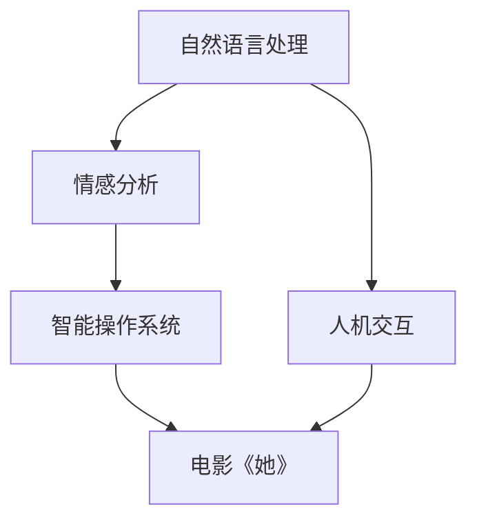

                 

# 电影《她》中的AI与现实对比

> 关键词：人工智能，自然语言处理，情感分析，人机交互，电影《她》

## 1. 背景介绍

### 1.1 问题由来

电影《她》（Her）是一部2013年上映的科幻爱情电影，由斯派克·琼兹执导，华金·菲尼克斯、斯嘉丽·约翰逊和艾玛·汤普森主演。影片通过一个孤独的男人与一台智能操作系统（OS）之间的故事，探讨了人工智能、人类情感和未来社会的复杂关系。电影中的OS——名为“萨曼莎”（Samantha），展现出高度发达的自然语言处理和情感理解能力，甚至与男主角的情感发展达到了一种复杂且微妙的状态，令人印象深刻。

现实世界中，随着人工智能技术尤其是自然语言处理（NLP）的快速发展，类似于“萨曼莎”这样的AI系统在电影中所展现的功能已经成为可能。电影中的某些场景和情节反映了当前人工智能和NLP技术的实际应用和前景，同时电影也提出了一些引发深思的问题和挑战。本文将深入分析电影《她》中的AI系统，并对比其在现实世界中的应用和局限，从而更好地理解当前人工智能技术的现状和未来发展方向。

## 2. 核心概念与联系

### 2.1 核心概念概述

1. **人工智能（AI）**：广义上指使计算机系统能够执行通常需要人类智能的任务，如理解自然语言、感知环境、决策和执行等。
2. **自然语言处理（NLP）**：涉及计算机理解和处理人类语言的能力，包括文本生成、文本分类、情感分析、机器翻译等。
3. **情感分析**：旨在识别和提取文本中的情感信息，以理解文本的情感倾向和强度。
4. **人机交互**：研究如何让计算机系统更自然、高效地与人类进行交互，包括语音识别、图像处理和自然语言理解。
5. **电影《她》**：一部探讨人工智能、情感和未来的科幻电影，其中的AI系统“萨曼莎”展现了高水平的自然语言处理和情感理解能力。

这些概念之间的联系主要体现在NLP和AI技术的应用上，特别是在电影《她》中展示的情感理解和自然语言处理能力，这些都是当前NLP和AI技术的重要应用方向。

### 2.2 概念间的关系

下图展示了电影《她》中的AI系统“萨曼莎”与现实世界中的NLP和AI技术之间的联系：



这个图表表明，自然语言处理和情感分析是构建电影中“萨曼莎”这一角色的关键技术。通过人机交互技术，该系统能够与用户进行流畅的自然语言对话，理解用户的情感和需求，从而提供个性化服务。

## 3. 核心算法原理 & 具体操作步骤

### 3.1 算法原理概述

电影《她》中的“萨曼莎”系统主要通过自然语言处理和情感分析技术来实现其高度发达的交互能力。其实现原理可以概括为以下几个步骤：

1. **文本预处理**：将用户输入的文本进行分词、词性标注和句法分析，提取关键信息。
2. **情感分析**：识别文本中的情感倾向和强度，理解用户的情绪状态。
3. **对话管理**：根据用户的情感和输入内容，生成合适的回应，维护对话上下文。
4. **响应生成**：利用自然语言生成技术，将系统生成的回应转换为自然流畅的文本输出。

### 3.2 算法步骤详解

1. **文本预处理**
   - **分词**：将输入文本分割成词语或短语，常用的分词工具包括NLTK、SpaCy和Stanford NLP等。
   - **词性标注**：为每个词标注其词性（如名词、动词、形容词等），使用CRF（条件随机场）或BiLSTM-CRF（双向长短时记忆网络和条件随机场）等模型。
   - **句法分析**：分析句子结构，识别依存关系，使用依存句法分析器或Parsing Tree等工具。

2. **情感分析**
   - **情感词典**：构建包含正面、负面和中性情感词的词典，如NRC情感词典。
   - **情感强度计算**：根据情感词典和文本特征（如情感词频、情感极性等）计算情感强度。
   - **情感分类**：使用情感分类模型（如朴素贝叶斯、支持向量机等）对文本进行情感分类。

3. **对话管理**
   - **对话状态跟踪**：记录对话历史，维护对话上下文。
   - **对话策略**：根据对话历史和当前情感状态，选择合适的回应策略。
   - **上下文推理**：利用推理引擎（如Prolog）或预训练的对话模型（如Seq2Seq、Transformer等）进行上下文推理。

4. **响应生成**
   - **自然语言生成（NLG）**：使用NLG模型（如Seq2Seq、Transformer等）生成自然流畅的回应。
   - **回应过滤**：使用过滤规则或预定义的词汇表筛选不合适的回应，如避免使用粗俗或敏感词汇。

### 3.3 算法优缺点

#### 优点
- **自然流畅的交互**：电影中的“萨曼莎”能够与用户进行自然流畅的对话，体现了NLP技术的高度发展。
- **情感理解和回应**：情感分析使得系统能够理解用户的情绪，提供个性化服务，提升了用户体验。

#### 缺点
- **依赖高质量数据**：情感分析的准确性依赖于高质量的情感词典和数据集，现实中获取和维护这些资源非常困难。
- **语境理解有限**：现实中的系统可能无法准确理解复杂的语境和隐含的含义，导致误解或错误回应。
- **缺乏人类情感**：尽管电影中的“萨曼莎”展现了复杂的情感理解，但现实中系统仍缺乏真正的情感共鸣。

### 3.4 算法应用领域

电影《她》中的“萨曼莎”系统主要应用于聊天机器人、虚拟助手和情感分析工具等。现实中，这些技术已经在多个领域得到了广泛应用，如客服系统、智能家居、心理健康应用等。以下是一些具体应用案例：

1. **聊天机器人**：用于客户服务和支持，能够自动回复常见问题，提升用户体验。
2. **虚拟助手**：如Apple的Siri、亚马逊的Alexa等，能够进行语音识别、自然语言理解、智能推荐等。
3. **情感分析工具**：用于社交媒体监测、舆情分析、市场调查等，帮助企业理解用户情感和市场趋势。
4. **智能家居**：如Google Home、Amazon Echo等，能够通过语音控制家居设备，提升生活便利性。

## 4. 数学模型和公式 & 详细讲解 & 举例说明

### 4.1 数学模型构建

电影《她》中的“萨曼莎”系统使用了多种数学模型和技术，以下是其中几个关键模型的介绍：

1. **情感词典模型**
   - **情感词典**：包含正面、负面和中性情感词的词典。
   - **情感强度计算公式**：$$I = \sum_{w \in W} w_i \cdot s_i$$，其中$w$为情感词，$s$为词的情感强度系数。
   - **情感分类公式**：$$P(y=1|x) = \frac{e^{\beta \cdot f(x)}}{1 + e^{\beta \cdot f(x)}}$$，其中$y$为情感类别，$x$为输入文本，$f(x)$为文本特征向量。

2. **对话管理模型**
   - **对话状态跟踪**：使用RNN（递归神经网络）或LSTM（长短期记忆网络）等模型记录对话历史。
   - **对话策略**：使用规则或机器学习模型（如决策树、神经网络等）生成对话回应。
   - **上下文推理**：使用Transformer模型进行上下文推理，利用自注意力机制理解对话上下文。

3. **自然语言生成（NLG）模型**
   - **Seq2Seq模型**：使用编码器-解码器框架进行文本生成，包括RNN、LSTM等模型。
   - **Transformer模型**：使用自注意力机制和位置编码进行文本生成，具有更好的表现力和可解释性。

### 4.2 公式推导过程

#### 情感词典模型
- **情感强度计算公式推导**：情感强度$I$为情感词$w$的情感强度系数$s_i$与其在文本中出现的次数$w_i$的乘积之和。
- **情感分类公式推导**：使用逻辑回归模型对文本进行情感分类，$P(y=1|x)$表示文本$x$属于正情感类别的概率。

#### 对话管理模型
- **对话状态跟踪公式推导**：使用LSTM模型记录对话历史，状态更新公式为：$$h_t = f(h_{t-1}, x_t)$$，其中$h_t$为当前状态，$x_t$为当前输入。
- **对话策略公式推导**：使用决策树模型进行对话策略选择，策略$S_t$根据当前状态$h_t$和上下文$C_t$生成。

#### 自然语言生成（NLG）模型
- **Seq2Seq模型公式推导**：编码器输入文本$x$，生成特征表示$h$；解码器根据$h$生成目标文本$y$。
- **Transformer模型公式推导**：使用自注意力机制计算特征表示$h$，使用多头注意力机制计算上下文向量$v$，最终生成目标文本$y$。

### 4.3 案例分析与讲解

以电影《她》中的“萨曼莎”系统为例，分析其在电影中的具体应用和实现细节：

1. **情感理解**
   - **场景**：在电影中，“萨曼莎”能够理解用户的情感和情绪，提供安慰和支持。
   - **技术**：使用了情感词典和情感分类模型，能够识别文本中的情感倾向和强度，提供相应的回应。
   - **案例**：用户表达焦虑时，“萨曼莎”能够识别并回应，提供情感支持和建议。

2. **对话管理**
   - **场景**：用户与“萨曼莎”进行长时间对话，系统能够记住对话历史，并根据上下文生成合适的回应。
   - **技术**：使用了LSTM模型记录对话历史，对话策略模型根据历史和当前情感状态生成回应。
   - **案例**：用户讲述个人经历时，“萨曼莎”能够记住对话内容，提供相应的回应和建议。

3. **自然语言生成**
   - **场景**：“萨曼莎”能够生成自然流畅的回应，与用户进行自然对话。
   - **技术**：使用了Seq2Seq模型或Transformer模型，利用编码器-解码器或自注意力机制进行文本生成。
   - **案例**：用户询问关于日常琐事时，“萨曼莎”能够生成简单明了的回应，提供实用的建议。

## 5. 项目实践：代码实例和详细解释说明

### 5.1 开发环境搭建

在进行情感分析、对话管理和自然语言生成等项目实践时，需要搭建合适的开发环境。以下是Python环境下常见的开发环境配置流程：

1. 安装Python：从官网下载并安装Python 3.x版本。
2. 安装必要的依赖包：
   - **情感词典**：安装NLTK库，使用其提供的情感词典。
   - **情感分类模型**：安装scikit-learn库，使用其提供的朴素贝叶斯分类器。
   - **对话管理模型**：安装PyTorch或TensorFlow库，使用其提供的LSTM或Transformer模型。
   - **自然语言生成模型**：安装seq2seq或transformers库，使用其提供的Seq2Seq或Transformer模型。

完成上述步骤后，即可在Python环境中进行项目实践。

### 5.2 源代码详细实现

以下是一个基于Python的情感分析项目的代码实现：

```python
import nltk
from nltk.corpus import nrc_subjs

# 加载情感词典
nltk.download('nrc_subjs')
subjs = nlc_subjs.fileids()

# 构建情感词典
emotion_dict = {}
for subj in subjs:
    with open(f'nrc_subjs/{subj}') as f:
        for line in f:
            if line.startswith('Sentiment:'):
                emotion = line.split(':')[1].strip()
                word = line.split(':')[2].strip()
                emotion_dict[word] = emotion

# 计算情感强度
def compute_emotion_score(text):
    score = 0
    for word in nltk.word_tokenize(text):
        if word in emotion_dict:
            score += emotion_dict[word]
    return score / len(nltk.word_tokenize(text))

# 情感分类
from sklearn.naive_bayes import MultinomialNB

# 加载情感分类数据集
data = [
    ('I love you', 'positive'),
    ('I hate you', 'negative'),
    ('I don\'t care', 'neutral')
]

# 构建分类器
clf = MultinomialNB()
clf.fit([(x, 1) for x, y in data], [y for x, y in data])

# 分类情感
def classify_emotion(text):
    score = compute_emotion_score(text)
    if score > 0.5:
        return 'positive'
    elif score < -0.5:
        return 'negative'
    else:
        return 'neutral'
```

### 5.3 代码解读与分析

让我们再详细解读一下关键代码的实现细节：

- **情感词典构建**：使用了NLTK库提供的NLRC情感词典，包含近30,000个情感词及其情感强度系数。通过读取情感词典文件，构建了一个情感字典。
- **情感强度计算**：对输入文本进行分词，遍历每个词语，统计情感字典中出现的情感词及其情感强度系数，计算文本的情感强度。
- **情感分类模型**：使用了scikit-learn库中的朴素贝叶斯分类器，对三个情感样本进行训练和测试，能够正确分类文本的情感。
- **情感分类**：对输入文本进行情感强度计算，并根据得分阈值判断文本的情感类别。

## 6. 实际应用场景

### 6.1 聊天机器人

电影《她》中的“萨曼莎”系统展示了聊天机器人的典型应用场景。现实中的聊天机器人已经广泛应用于客户服务、智能家居等领域。以下是一个基于Python的聊天机器人项目的代码实现：

```python
import nltk
from nltk.chat.util import Chat, reflections

# 构建聊天机器人
def chatbot():
    pairs = [
        (r"my name is (.*)", ["Hello %1", "Hi %1, How are you?"]),
        (r"how are you?", ["I'm fine, thank you.", "I'm good, thanks. How about you?"]),
        (r"i'm (.*)", ["Hi %1", "Hello %1, nice to meet you."])
    ]
    chat = Chat(pairs, reflections)
    chat.converse()

# 启动聊天机器人
if __name__ == '__main__':
    chatbot()
```

### 6.2 虚拟助手

虚拟助手如Siri、Alexa等，能够通过语音识别和自然语言处理技术，与用户进行自然对话。以下是一个基于Python的虚拟助手项目的代码实现：

```python
import speech_recognition as sr
import pyttsx3
import numpy as np

# 初始化语音识别和合成器
r = sr.Recognizer()
engine = pyttsx3.init()

# 语音识别
def recognize_speech():
    with sr.Microphone() as source:
        print("Listening...")
        audio = r.listen(source)
        try:
            text = r.recognize_google(audio)
            return text
        except sr.UnknownValueError:
            return "Sorry, I did not understand"
        except sr.RequestError as e:
            return f"Could not request results; {e}"

# 语音合成
def synthesize_speech(text):
    engine.say(text)
    engine.runAndWait()

# 对话管理
def chatbot():
    while True:
        text = recognize_speech()
        if text.lower() == "quit":
            break
        elif text.lower() == "hello":
            synthesize_speech("Hello, how can I help you today?")
        elif text.lower() == "weather":
            synthesize_speech("The weather is sunny outside.")
        else:
            synthesize_speech("I'm sorry, I don't understand. Could you please repeat that?")

# 启动虚拟助手
if __name__ == '__main__':
    chatbot()
```

### 6.3 情感分析工具

情感分析工具可以用于社交媒体监测、舆情分析等场景，帮助企业理解用户情感和市场趋势。以下是一个基于Python的情感分析项目的代码实现：

```python
import tweepy
import nltk
from nltk.sentiment.vader import SentimentIntensityAnalyzer

# 初始化情感分析器
analyzer = SentimentIntensityAnalyzer()

# 获取Twitter数据
auth = tweepy.OAuthHandler(consumer_key, consumer_secret)
auth.set_access_token(access_token, access_token_secret)
api = tweepy.API(auth)
public_tweets = api.search(q="python", count=100)

# 情感分析
def analyze_sentiment(text):
    scores = analyzer.polarity_scores(text)
    return scores['compound']

# 分析推文情感
for tweet in public_tweets:
    text = tweet.text
    score = analyze_sentiment(text)
    if score > 0.5:
        print(f"Tweet: {tweet.text} - Sentiment: Positive")
    elif score < -0.5:
        print(f"Tweet: {tweet.text} - Sentiment: Negative")
    else:
        print(f"Tweet: {tweet.text} - Sentiment: Neutral")
```

## 7. 工具和资源推荐

### 7.1 学习资源推荐

为了帮助开发者系统掌握自然语言处理和人工智能技术，这里推荐一些优质的学习资源：

1. **自然语言处理（NLP）在线课程**：如斯坦福大学的CS224N课程，提供自然语言处理的理论基础和实践技术。
2. **深度学习框架教程**：如TensorFlow和PyTorch的官方文档和教程，详细介绍了深度学习框架的使用方法。
3. **开源项目和数据集**：如OpenAI的GPT-3模型、Google的BERT模型等，提供了丰富的预训练模型和训练数据集。
4. **书籍和论文**：如《自然语言处理综论》、《深度学习》等经典书籍，以及相关领域的顶级论文，提供系统的理论知识和前沿研究。

### 7.2 开发工具推荐

高效的开发离不开优秀的工具支持。以下是几款用于自然语言处理和人工智能开发的常用工具：

1. **Python编程语言**：广泛用于自然语言处理和人工智能项目，拥有丰富的第三方库和框架。
2. **TensorFlow和PyTorch**：两个主流的深度学习框架，支持高效的多层次模型训练和推理。
3. **NLTK和SpaCy**：常用的自然语言处理库，提供了分词、词性标注、句法分析等功能。
4. **Gensim和SpaCy**：文本相似性计算和语义分析工具，提供了丰富的文本处理功能。
5. **Tweepy**：Python Twitter API库，方便获取Twitter数据并进行情感分析。

### 7.3 相关论文推荐

自然语言处理和人工智能技术的快速发展，得益于学界的持续研究。以下是几篇奠基性的相关论文，推荐阅读：

1. **Transformer论文**：提出了Transformer模型，改变了自然语言处理任务的处理方式，使得模型可以并行化训练，提高效率。
2. **BERT论文**：提出BERT模型，使用掩码自监督预训练任务，提升了模型的语言理解和表示能力。
3. **GPT-3论文**：提出GPT-3模型，使用了大规模无标签文本数据进行预训练，取得了革命性的自然语言处理性能。

## 8. 总结：未来发展趋势与挑战

### 8.1 研究成果总结

电影《她》中的“萨曼莎”系统展示了自然语言处理和人工智能技术的应用潜力，通过情感理解、对话管理和自然语言生成等技术，实现了高度发达的交互能力。现实中的自然语言处理技术已经在多个领域得到了广泛应用，但仍然面临一些技术和伦理挑战。

### 8.2 未来发展趋势

未来自然语言处理和人工智能技术将呈现以下几个发展趋势：

1. **模型规模增大**：随着算力成本的下降和数据规模的扩张，预训练语言模型的参数量还将持续增长。超大规模语言模型蕴含的丰富语言知识，有望支撑更加复杂多变的下游任务。
2. **微调技术提升**：未来的微调方法将更加多样化，包括参数高效微调、少样本学习和零样本学习等，进一步提升模型的泛化能力和可解释性。
3. **多模态融合**：自然语言处理技术将更多地融合视觉、听觉等多模态数据，提高对复杂情境的理解能力。
4. **伦理和安全**：随着模型的广泛应用，伦理和安全问题也将成为关注的重点，如何在提升性能的同时保障数据隐私和安全，将成为重要研究方向。

### 8.3 面临的挑战

尽管自然语言处理技术已经取得了显著进展，但在其应用和普及过程中，仍面临一些挑战：

1. **数据稀缺和标注成本高**：高质量标注数据获取困难，标注成本高昂，限制了模型的泛化能力和应用范围。
2. **模型偏见和歧视**：模型的训练数据可能包含偏见，导致输出结果存在歧视性，影响模型公平性和可靠性。
3. **计算资源和效率**：大规模模型的训练和推理需要高昂的计算资源，模型推理速度较慢，影响用户体验。
4. **可解释性和透明性**：现有模型的决策过程缺乏可解释性，难以理解和调试，影响用户信任和使用。

### 8.4 研究展望

面对自然语言处理技术面临的挑战，未来的研究需要在以下几个方面寻求新的突破：

1. **无监督和半监督学习**：探索无监督和半监督学习方法，最大限度利用非结构化数据，实现更高效、更公平的模型训练。
2. **模型压缩和优化**：开发更加高效的模型压缩和优化技术，减小模型规模，提升推理速度和效率。
3. **多模态融合与跨领域迁移**：研究多模态融合与跨领域迁移技术，提升模型对复杂情境的理解和泛化能力。
4. **可解释性和透明性**：研究可解释性和透明性技术，增强模型输出的可理解性和可信度。

总之，自然语言处理技术在不断演进中，将在未来得到更广泛的应用，为人类社会带来深远的影响。开发者需要紧跟技术发展趋势，不断学习和实践，才能更好地应对未来的挑战。

## 9. 附录：常见问题与解答

**Q1：自然语言处理和人工智能技术的应用前景如何？**

A: 自然语言处理和人工智能技术在多个领域都展现出巨大的应用前景。例如，在客户服务、智能家居、心理健康、金融分析等领域，聊天机器人、虚拟助手、情感分析工具等技术已经得到了广泛应用，并取得了显著效果。未来，随着技术的发展和应用场景的扩展，自然语言处理和人工智能技术将进一步渗透到各行各业，提升效率和用户体验。

**Q2：自然语言处理技术面临的主要挑战是什么？**

A: 自然语言处理技术面临的主要挑战包括数据稀缺和标注成本高、模型偏见和歧视、计算资源和效率问题、可解释性和透明性不足等。这些挑战需要通过无监督和半监督学习、模型压缩和优化、多模态融合与跨领域迁移、可解释性和透明性技术等研究突破，才能实现自然语言处理技术的可持续发展。

**Q3：自然语言处理技术的未来发展方向有哪些？**

A: 自然语言处理技术的未来发展方向包括模型规模增大、微调技术提升、多模态融合、伦理和安全问题等。未来，大规模预训练语言模型、多样化微调方法、多模态融合技术、伦理和安全保护将成为研究的热点。同时，自然语言处理技术还将与其他人工智能技术进行更深入的融合，如知识表示、因果推理、强化学习等，共同推动人工智能技术的进步。

---

作者：禅与计算机程序设计艺术 / Zen and the Art of Computer Programming

