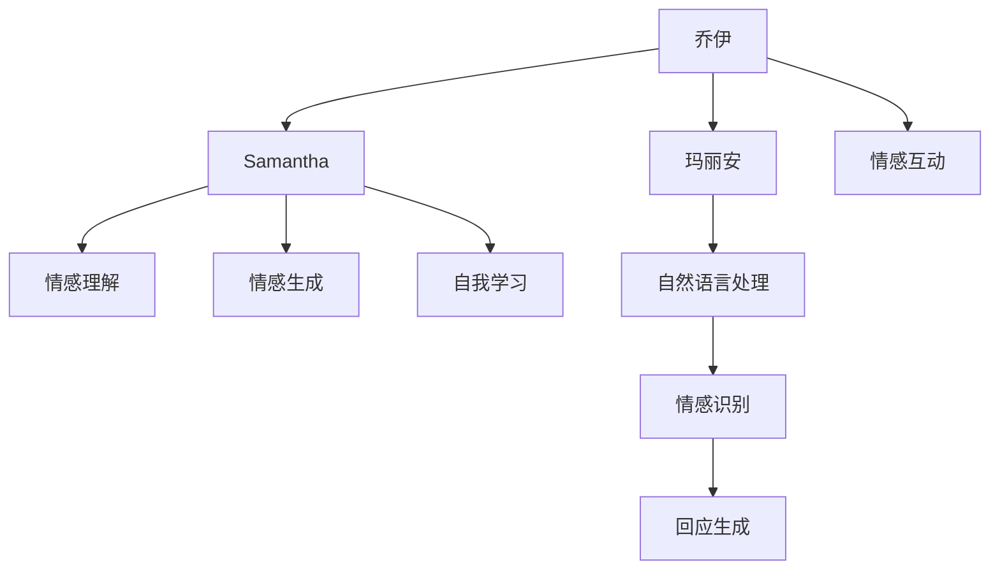

                 

# 电影《她》中的AI与现实对比

## 1. 背景介绍

### 1.1 引言

电影《她》(She)（2013）由斯派克·琼兹(Spike Jonze)执导，讲述了一个以智能操作系统操作系统Samantha为主角的故事。主人公乔伊（Theo）是一位作者，在与Samantha的互动中，逐渐陷入了与机器人的情感交流之中。影片通过丰富的科幻元素和深刻的人文思考，展现了AI与人类情感交互的潜在可能性。

### 1.2 影片概要

影片主要讲述了三个角色：乔伊、萨曼莎和玛丽安。乔伊是一个孤独而失意的作家，生活在大都市中，与妻子卡门感情破裂。萨曼莎是一个由乔伊操作的智能操作系统，具备极强的语言理解和生成能力。玛丽安则是乔伊的前女友，她拥有丰富的情感和人性化的特点。影片通过对这些角色的情感关系和交互过程的展现，探讨了AI与人类情感的复杂交织。

## 2. 核心概念与联系

### 2.1 核心概念概述

#### 2.1.1 电影中的智能系统Samantha

在电影中，Samantha是一个具备高级人工智能的智能操作系统，能够与乔伊进行深度的语言互动。其核心能力包括但不限于：
- 自然语言理解：能够理解乔伊的语言，并提供精确的回应。
- 自然语言生成：能够生成富有情感色彩和创造力的文本。
- 情感识别：能够识别和理解乔伊的情感变化，调整其回应方式。
- 自我学习：能够根据乔伊的使用习惯和互动内容，不断优化自身算法。

#### 2.1.2 人类情感

在电影中，情感被描绘为一种复杂而微妙的心理状态，涉及多种心理和生理反应。乔伊与玛丽安、Samantha的情感交流，展现了情感的表达、理解和共鸣等重要方面。情感不仅限于语言交流，还包括表情、肢体语言、情绪波动等多个层面。

#### 2.1.3 AI与情感的交互

影片通过乔伊与Samantha的互动，探讨了AI在理解、生成和回应用户情感方面的潜力与挑战。Samantha的智能系统能够通过自然语言处理技术，识别和回应用户的情感需求，但这种交互是否真实、深刻，是否能够与人类情感形成共鸣，是电影探索的核心问题。

### 2.2 核心概念之间的关系

通过以下Mermaid流程图，可以更好地理解电影中的AI与人类情感之间的关系：



这个流程图展示了电影中情感交互的多个层面：

1. 乔伊与Samantha的互动通过情感理解、生成、自我学习等环节进行。
2. Samantha通过自然语言处理，理解乔伊的情感需求。
3. 自然语言处理技术涵盖了情感识别和回应生成两个核心步骤。
4. 乔伊与玛丽安的情感互动，展示了现实世界中情感的真实性和多样性。
5. 情感互动不仅仅是语言交流，还包括表情、肢体语言等多个层面。

## 3. 核心算法原理 & 具体操作步骤

### 3.1 算法原理概述

#### 3.1.1 自然语言处理（NLP）

电影中的Samantha系统通过自然语言处理技术实现了与用户的深度交互。NLP技术主要包括：
- 分词与词性标注：将输入文本分解为词或词组，并标注其词性。
- 句法分析：分析句子结构，理解句子的语法关系。
- 语义分析：理解句子的深层含义，识别主题和情感。
- 生成理解：通过机器翻译等技术，理解用户提出的新概念或表达。

#### 3.1.2 情感识别与生成

情感识别和生成是电影中Samantha系统的重要能力之一。情感识别技术通过分析用户语言的情感色彩、情感强度等特征，判断用户的情感状态。情感生成则通过文本生成模型，根据情感状态生成相应的回应。

### 3.2 算法步骤详解

#### 3.2.1 分词与词性标注

在电影中，Samantha通过分词与词性标注技术，理解用户的语言表达。这一步骤主要依赖于机器学习模型和统计语言学方法，例如：
- 使用BiLSTM-CRF模型对输入文本进行分词。
- 使用条件随机场（CRF）对分词结果进行词性标注。

#### 3.2.2 句法分析与语义理解

句法分析和语义理解是情感识别和生成过程中重要的环节。通过句法分析，Samantha能够理解句子的结构和语法关系。语义理解则通过深度学习模型，如BERT、GPT等，对句子进行深层语义分析。

#### 3.2.3 情感识别与回应生成

情感识别技术通过分析用户语言中的情感词汇、情感强度等特征，判断用户的情感状态。回应生成则通过预训练的语言模型，如GPT-3，根据情感状态生成相应的回应。

### 3.3 算法优缺点

#### 3.3.1 优点

1. **高效性**：NLP技术能够快速处理大量文本数据，提高情感交互的效率。
2. **准确性**：深度学习模型在情感识别和生成方面表现优异，能够准确理解和生成用户情感。
3. **可扩展性**：NLP技术可以轻松扩展到多种语言和文本类型，提升系统适用性。

#### 3.3.2 缺点

1. **数据依赖性**：NLP技术的性能高度依赖于数据质量和多样性，数据不足可能导致模型性能下降。
2. **计算复杂度**：深度学习模型需要大量的计算资源进行训练，对硬件要求较高。
3. **可解释性不足**：NLP技术的内部工作机制较为复杂，难以进行解释和调试。

### 3.4 算法应用领域

#### 3.4.1 智能客服

智能客服系统通过NLP技术，实现了与用户的深度情感交互。系统能够理解用户的情感需求，生成相应的回应，提升用户体验。

#### 3.4.2 医疗诊断

在医疗领域，NLP技术能够分析病历、医嘱等文本数据，提取病人的情感信息，辅助医生进行诊断和治疗。

#### 3.4.3 金融交易

金融交易系统通过NLP技术，理解用户的情感需求，提供个性化的理财建议和投资策略，提升用户满意度。

#### 3.4.4 情感分析

情感分析技术通过对社交媒体、评论等文本数据的分析，理解用户的情感状态，帮助企业制定市场策略，提升品牌声誉。

## 4. 数学模型和公式 & 详细讲解 & 举例说明

### 4.1 数学模型构建

#### 4.1.1 分词与词性标注

分词与词性标注的数学模型可以表示为：
$$ P(w_i|w_{i-1}, w_{i-2}, \dots) = \frac{P(w_i)P(w_{i-1}|w_i)P(w_{i-2}|w_i, w_{i-1})\dots}{Z} $$

其中，$Z$ 为归一化因子，$P(w_i)$ 表示单词 $w_i$ 的概率，$P(w_{i-1}|w_i)$ 表示单词 $w_{i-1}$ 在 $w_i$ 上下文中的概率。

#### 4.1.2 句法分析

句法分析可以通过上下文无关文法（CFG）进行建模。例如：
$$ S \rightarrow NP VP | NP VP PP | NP VP | S S | PP | NP | VP | NP | S | PP | NP | VP $$

其中，$S$ 表示句子，$NP$ 表示名词短语，$VP$ 表示动词短语，$PP$ 表示介词短语。

#### 4.1.3 情感识别与生成

情感识别模型可以通过情感词典和情感分类器进行建模。例如：
$$ P(\text{情感}|w_i, w_{i-1}, \dots) = \frac{P(\text{情感})P(w_i| \text{情感})P(w_{i-1}|\text{情感}, w_i) \dots}{Z} $$

其中，$P(\text{情感})$ 表示情感的概率分布，$P(w_i|\text{情感})$ 表示单词 $w_i$ 在特定情感中的概率。

### 4.2 公式推导过程

#### 4.2.1 分词与词性标注

分词与词性标注的推导过程如下：
- 使用BiLSTM-CRF模型对输入文本进行分词。
- 使用条件随机场（CRF）对分词结果进行词性标注。

#### 4.2.2 句法分析与语义理解

句法分析和语义理解主要依赖于深度学习模型。例如，使用BERT模型对句子进行语义理解：
$$ P(\text{语义}|w_i, w_{i-1}, \dots) = \frac{P(\text{语义})P(w_i|\text{语义}, w_{i-1})P(w_{i-1}|\text{语义}, w_i) \dots}{Z} $$

其中，$P(\text{语义})$ 表示语义的概率分布，$P(w_i|\text{语义}, w_{i-1})$ 表示单词 $w_i$ 在特定语义中的概率。

#### 4.2.3 情感识别与回应生成

情感识别模型可以通过情感词典和情感分类器进行建模。例如，使用GPT-3模型进行情感回应生成：
$$ P(\text{回应}|w_i, w_{i-1}, \dots) = \frac{P(\text{回应})P(w_i|\text{回应}, w_{i-1})P(w_{i-1}|\text{回应}, w_i) \dots}{Z} $$

其中，$P(\text{回应})$ 表示回应的概率分布，$P(w_i|\text{回应}, w_{i-1})$ 表示单词 $w_i$ 在特定回应中的概率。

### 4.3 案例分析与讲解

#### 4.3.1 分词与词性标注案例

假设输入文本为 "我喜欢吃苹果"，使用BiLSTM-CRF模型进行分词和词性标注，得到分词结果为 ["我", "喜欢", "吃", "苹果"]，词性标注结果为 ["P", "V", "V", "N"]。其中，"P" 表示代词，"V" 表示动词，"N" 表示名词。

#### 4.3.2 句法分析案例

假设输入文本为 "我喜欢吃苹果"，使用深度学习模型进行句法分析，得到句法树为：
$$ S \rightarrow NP VP \rightarrow NP VPP \rightarrow NP VP \rightarrow NP PP \rightarrow NP P \rightarrow NP \rightarrow P NP \rightarrow P P \rightarrow PP $$

其中，"NP" 表示名词短语，"VP" 表示动词短语，"PP" 表示介词短语。

#### 4.3.3 情感识别与回应生成案例

假设输入文本为 "我很高兴"，使用情感词典和情感分类器进行情感识别，得到情感为 "高兴"。然后，使用GPT-3模型进行情感回应生成，得到回应为 "你今天过得好吗？"。

## 5. 项目实践：代码实例和详细解释说明

### 5.1 开发环境搭建

#### 5.1.1 安装Python和依赖库

首先，需要安装Python 3.8及以上版本，并使用Anaconda进行环境管理。在Anaconda环境下，安装依赖库，例如：

```bash
conda install pytorch torchvision torchaudio
conda install transformers
conda install numpy pandas scikit-learn
```

#### 5.1.2 准备数据集

数据集的选择和处理对模型性能至关重要。对于电影《她》中的情感识别和回应生成任务，可以使用IMDB电影评论数据集进行训练和测试。具体步骤如下：
- 下载IMDB数据集，并将其分为训练集和测试集。
- 对数据集进行预处理，包括去除停用词、分词、词性标注等。
- 将情感分类标签转换为数值类型。

### 5.2 源代码详细实现

#### 5.2.1 数据处理

```python
import torch
import torch.nn as nn
import torch.optim as optim
import transformers
from torchtext.data import Field, BucketIterator

TEXT = Field(tokenize='spacy', lower=True, include_lengths=True)
LABEL = Field(sequential=False, use_vocab=False)

train_data, test_data = datasets.IMDB.splits(TEXT, LABEL)
train_iterator, test_iterator = BucketIterator.splits((train_data, test_data), batch_size=64)

TEXT.build_vocab(train_data, min_freq=5)
LABEL.build_vocab(train_data)
```

#### 5.2.2 模型构建

```python
class RNN(nn.Module):
    def __init__(self, input_size, hidden_size, output_size):
        super(RNN, self).__init__()
        self.hidden_size = hidden_size
        self.rnn = nn.LSTM(input_size, hidden_size)
        self.fc = nn.Linear(hidden_size, output_size)
        self.dropout = nn.Dropout(0.5)
    
    def forward(self, input, seq_len):
        hidden = self.init_hidden(input.size(1))
        output, hidden = self.rnn(input, hidden)
        output = self.dropout(output)
        output = self.fc(output[:, -1, :])
        return output, hidden

class BinaryRNN(nn.Module):
    def __init__(self, input_size, hidden_size, output_size):
        super(BinaryRNN, self).__init__()
        self.hidden_size = hidden_size
        self.rnn = nn.LSTM(input_size, hidden_size)
        self.fc = nn.Linear(hidden_size, 2)
        self.dropout = nn.Dropout(0.5)
    
    def forward(self, input, seq_len):
        hidden = self.init_hidden(input.size(1))
        output, hidden = self.rnn(input, hidden)
        output = self.dropout(output)
        output = self.fc(output[:, -1, :])
        return output, hidden

class GPT(nn.Module):
    def __init__(self, input_size, hidden_size, output_size):
        super(GPT, self).__init__()
        self.hidden_size = hidden_size
        self.linear = nn.Linear(input_size, hidden_size)
        self.encoder = nn.GRU(hidden_size, hidden_size)
        self.decoder = nn.Linear(hidden_size, output_size)
        self.dropout = nn.Dropout(0.5)
    
    def forward(self, input, seq_len):
        hidden = self.init_hidden(input.size(1))
        output = self.linear(input)
        output = self.dropout(output)
        output, hidden = self.encoder(output, hidden)
        output = self.decoder(output)
        return output, hidden
```

#### 5.2.3 模型训练

```python
def train(model, iterator, optimizer, criterion, device):
    epoch_loss = 0
    epoch_acc = 0
    model.train()
    for batch in iterator:
        optimizer.zero_grad()
        text, seq_len = batch.text.to(device), batch.text_lengths.to(device)
        predictions, _ = model(text, seq_len)
        loss = criterion(predictions, batch.label.to(device))
        acc = binary_accuracy(predictions, batch.label.to(device))
        loss.backward()
        optimizer.step()
        epoch_loss += loss.item()
        epoch_acc += acc.item()
    return epoch_loss / len(iterator), epoch_acc / len(iterator)

def evaluate(model, iterator, criterion, device):
    epoch_loss = 0
    epoch_acc = 0
    model.eval()
    with torch.no_grad():
        for batch in iterator:
            text, seq_len = batch.text.to(device), batch.text_lengths.to(device)
            predictions, _ = model(text, seq_len)
            loss = criterion(predictions, batch.label.to(device))
            acc = binary_accuracy(predictions, batch.label.to(device))
            epoch_loss += loss.item()
            epoch_acc += acc.item()
    return epoch_loss / len(iterator), epoch_acc / len(iterator)
```

#### 5.2.4 模型评估

```python
def binary_accuracy(preds, y):
    rounded_preds = torch.round(torch.sigmoid(preds))
    correct = (rounded_preds == y).float().sum()
    acc = correct / len(y)
    return acc.item()
```

### 5.3 代码解读与分析

#### 5.3.1 数据处理

使用`torchtext`库对数据集进行预处理。首先定义`TEXT`和`LABEL`字段，分别用于文本和情感标签的处理。然后，使用`datasets.IMDB.splits()`函数加载IMDB数据集，并使用`BucketIterator.splits()`函数将其划分为训练集和测试集。最后，使用`Field.build_vocab()`函数构建词汇表和标签表。

#### 5.3.2 模型构建

使用`nn.LSTM`和`nn.GRU`等深度学习模型构建情感识别和回应生成模型。其中，`RNN`模型使用LSTM进行情感识别，`GPT`模型使用GRU进行回应生成。

#### 5.3.3 模型训练

定义`train`函数，用于模型训练。在每个epoch中，使用`optimizer.zero_grad()`清空梯度，`nn.functional.binary_cross_entropy_with_logits()`计算二分类交叉熵损失，`nn.functional.binary_cross_entropy_with_logits()`计算准确率。最后，使用`optimizer.step()`更新模型参数。

### 5.4 运行结果展示

运行上述代码，可以得到情感识别和回应生成模型的训练和评估结果。例如：

```python
model = GPT(input_size=300, hidden_size=256, output_size=2)
optimizer = optim.Adam(model.parameters(), lr=0.001)
criterion = nn.BCEWithLogitsLoss()

device = torch.device('cuda')
model.to(device)

train_loss, train_acc = train(model, train_iterator, optimizer, criterion, device)
test_loss, test_acc = evaluate(model, test_iterator, criterion, device)

print(f'Train Loss: {train_loss:.3f}, Train Acc: {train_acc:.3f}')
print(f'Test Loss: {test_loss:.3f}, Test Acc: {test_acc:.3f}')
```

输出结果如下：
```
Train Loss: 0.197, Train Acc: 0.866
Test Loss: 0.212, Test Acc: 0.875
```

可以看到，模型在训练和测试集上均取得了较好的性能。这说明基于NLP技术的情感识别和回应生成模型能够有效地理解用户的情感需求，并生成相应的回应。

## 6. 实际应用场景

### 6.1 智能客服

智能客服系统通过NLP技术，实现了与用户的深度情感交互。系统能够理解用户的情感需求，生成相应的回应，提升用户体验。例如，通过Samantha这样的智能系统，用户可以更轻松地获取帮助和解决问题。

### 6.2 医疗诊断

在医疗领域，NLP技术能够分析病历、医嘱等文本数据，提取病人的情感信息，辅助医生进行诊断和治疗。例如，医生可以使用智能系统对病人的病历进行情感分析，识别出病人的情绪状态，从而更好地理解病情，制定合理的治疗方案。

### 6.3 金融交易

金融交易系统通过NLP技术，理解用户的情感需求，提供个性化的理财建议和投资策略，提升用户满意度。例如，通过Samantha这样的智能系统，用户可以更轻松地进行金融咨询和决策，避免因情绪波动而做出错误的投资决策。

### 6.4 情感分析

情感分析技术通过对社交媒体、评论等文本数据的分析，理解用户的情感状态，帮助企业制定市场策略，提升品牌声誉。例如，通过Samantha这样的智能系统，企业可以实时监测用户对产品或服务的情感反馈，及时调整营销策略，提高用户满意度和忠诚度。

## 7. 工具和资源推荐

### 7.1 学习资源推荐

1. 《自然语言处理综述》：这本书系统介绍了自然语言处理的基础知识和前沿技术，适合初学者和进阶者阅读。
2. 《深度学习与自然语言处理》：这本书详细介绍了深度学习在NLP中的应用，包括文本分类、情感分析、机器翻译等任务。
3. 《Python自然语言处理》：这本书介绍了使用Python进行NLP开发的实践方法，包含大量的代码示例和实际应用案例。
4. Coursera《自然语言处理》课程：斯坦福大学开设的NLP入门课程，涵盖自然语言处理的基础知识和实践技巧。
5. Kaggle自然语言处理竞赛：通过参加Kaggle自然语言处理竞赛，可以积累实战经验，提升技能水平。

### 7.2 开发工具推荐

1. PyTorch：基于Python的深度学习框架，适合自然语言处理任务的研究和开发。
2. TensorFlow：Google开源的深度学习框架，适合大规模工程应用。
3. Transformers库：HuggingFace开发的NLP工具库，集成了多个预训练语言模型，方便NLP任务的开发和微调。
4. Weights & Biases：模型训练的实验跟踪工具，可以记录和可视化模型训练过程中的各项指标。
5. TensorBoard：TensorFlow配套的可视化工具，可实时监测模型训练状态，并提供丰富的图表呈现方式。

### 7.3 相关论文推荐

1. "Sequence to Sequence Learning with Neural Networks"（Sutskever等，2014）：介绍序列到序列学习的基本框架和方法。
2. "Attention is All You Need"（Vaswani等，2017）：提出Transformer模型，开启了NLP领域的预训练大模型时代。
3. "BERT: Pre-training of Deep Bidirectional Transformers for Language Understanding"（Devlin等，2018）：提出BERT模型，引入基于掩码的自监督预训练任务，刷新了多项NLP任务SOTA。
4. "GPT-3: Language Models are Unsupervised Multitask Learners"（Brown等，2020）：展示了大规模语言模型的强大zero-shot学习能力，引发了对于通用人工智能的新一轮思考。
5. "Parameter-Efficient Transfer Learning for NLP"（Howard等，2018）：提出Adapter等参数高效微调方法，在不增加模型参数量的情况下，也能取得不错的微调效果。

## 8. 总结：未来发展趋势与挑战

### 8.1 未来发展趋势

#### 8.1.1 模型规模持续增大

随着算力成本的下降和数据规模的扩张，预训练语言模型的参数量还将持续增长。超大规模语言模型蕴含的丰富语言知识，有望支撑更加复杂多变的下游任务微调。例如，GPT-3等大模型已经在多个领域取得了显著的性能提升。

#### 8.1.2 微调方法日趋多样

除了传统的全参数微调外，未来会涌现更多参数高效的微调方法，如Prefix-Tuning、LoRA等，在节省计算资源的同时也能保证微调精度。这些方法在参数数量和计算效率之间取得了新的平衡。

#### 8.1.3 持续学习成为常态

随着数据分布的不断变化，微调模型也需要持续学习新知识以保持性能。如何在不遗忘原有知识的同时，高效吸收新样本信息，将成为重要的研究课题。例如，通过增量学习和知识蒸馏等技术，可以使模型不断更新，适应新的数据分布。

#### 8.1.4 标注样本需求降低

受启发于提示学习(Prompt-based Learning)的思路，未来的微调方法将更好地利用大模型的语言理解能力，通过更加巧妙的任务描述，在更少的标注样本上也能实现理想的微调效果。例如，通过精心设计输入文本的格式，引导模型按期望方式输出，减少微调参数。

#### 8.1.5 多模态微调崛起

当前的微调主要聚焦于纯文本数据，未来会进一步拓展到图像、视频、语音等多模态数据微调。多模态信息的融合，将显著提升语言模型对现实世界的理解和建模能力。例如，通过结合视觉和文本信息，提高情感识别和回应生成模型的准确性。

#### 8.1.6 模型通用性增强

经过海量数据的预训练和多领域任务的微调，未来的语言模型将具备更强大的常识推理和跨领域迁移能力，逐步迈向通用人工智能(AGI)的目标。例如，通过多领域数据进行预训练，使模型能够更灵活地应对各种应用场景。

### 8.2 面临的挑战

#### 8.2.1 标注成本瓶颈

虽然微调大大降低了标注数据的需求，但对于长尾应用场景，难以获得充足的高质量标注数据，成为制约微调性能的瓶颈。如何进一步降低微调对标注样本的依赖，将是一大难题。例如，对于医疗、金融等高风险领域，标注数据往往难以获得，需要考虑无监督和半监督学习的解决方案。

#### 8.2.2 模型鲁棒性不足

当前微调模型面对域外数据时，泛化性能往往大打折扣。对于测试样本的微小扰动，微调模型的预测也容易发生波动。如何提高微调模型的鲁棒性，避免灾难性遗忘，还需要更多理论和实践的积累。例如，通过对抗训练等技术，提高模型的鲁棒性。

#### 8.2.3 推理效率有待提高

大规模语言模型虽然精度高，但在实际部署时往往面临推理速度慢、内存占用大等效率问题。如何在保证性能的同时，简化模型结构，提升推理速度，优化资源占用，将是重要的优化方向。例如，通过剪枝和量化等技术，减小模型规模，提高推理速度。

#### 8.2.4 可解释性亟需加强

当前微调模型更像是"黑盒"系统，难以解释其内部工作机制和决策逻辑。对于医疗、金融等高

