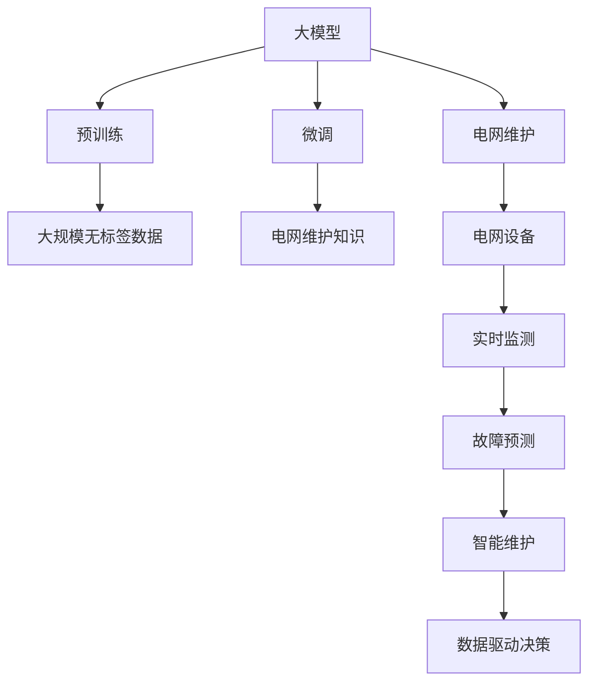
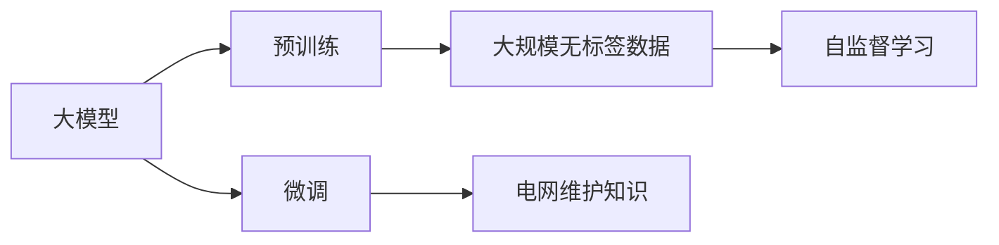
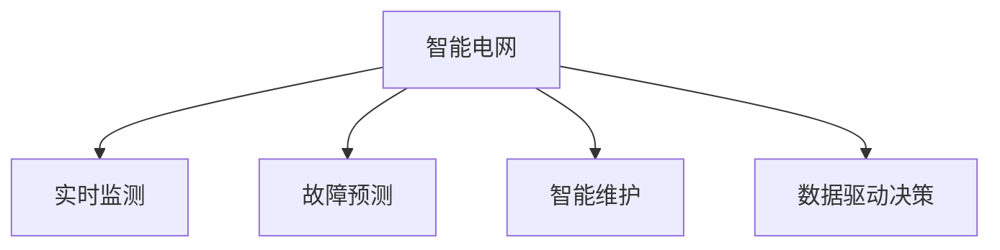
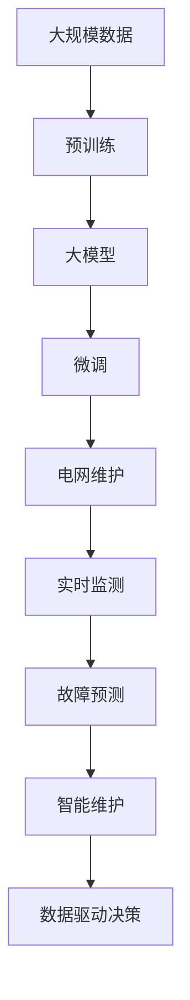

                 

# 电网维护与大模型的应用

> 关键词：电网维护, 大模型, 深度学习, 智能电网, 人工智能, 自动化

## 1. 背景介绍

### 1.1 问题由来
随着全球化能源需求的增长，电网系统的运行压力持续增大，对电网维护和故障处理提出了更高的要求。传统电网维护方法依赖大量人工进行巡检、维护、故障诊断等工作，存在效率低下、成本高昂等问题。电网公司急需借助技术手段，实现对电网设备的实时监控、故障预测、智能维护等，以提高电网运行效率和安全性。

### 1.2 问题核心关键点
基于深度学习的大模型在电网维护领域有着广泛的应用前景，其核心点在于：

- 利用大规模无标签数据进行预训练，学习丰富的电网运行知识。
- 通过任务特定的微调，获取针对性的电网维护能力。
- 集成到智能电网系统，实现对电网的实时监测、故障预测、智能维护等。
- 提升电网维护的效率、准确性和安全性，减少人为干预。

### 1.3 问题研究意义
大模型在电网维护中的应用，对于提升电网运行效率、减少运营成本、保障电网安全具有重要意义：

- 提升巡检效率：通过大模型对电网设备进行实时监控，自动生成巡检报告，减少人工巡检的时间和成本。
- 故障预测和预防：大模型能够通过分析历史数据，预测设备故障，提前进行维护，避免因故障导致的停电。
- 智能维护决策：利用大模型对故障数据进行分析，生成最优维护方案，提高维护效果和效率。
- 数据驱动决策：大模型能够分析海量数据，提取电网运行规律，辅助管理人员做出更科学的决策。

## 2. 核心概念与联系

### 2.1 核心概念概述

为更好地理解大模型在电网维护中的应用，本节将介绍几个关键概念及其相互联系：

- **大模型**：以深度学习为基础，通过大规模数据训练得到的通用模型，具备强大的学习和泛化能力。
- **预训练**：利用大规模无标签数据对大模型进行训练，学习基础的知识和规律。
- **微调**：在预训练大模型的基础上，针对特定任务进行有监督训练，优化模型在任务上的性能。
- **电网维护**：涉及对电网设备的巡检、监测、故障诊断、维护等工作，旨在保障电网安全运行和提高运行效率。
- **智能电网**：通过物联网、大数据、人工智能等技术手段，实现电网运行的智能化管理。
- **深度学习**：一种利用神经网络结构对数据进行建模和预测的学习方法。

这些概念之间存在密切的联系，可以通过以下Mermaid流程图来展示：



这个流程图展示了从预训练到微调，再到电网维护的整体流程：

1. 大模型通过预训练学习电网运行的基础知识。
2. 通过微调针对电网维护任务进行优化，获取电网维护知识。
3. 集成到智能电网系统，实现实时监测、故障预测、智能维护等功能。
4. 通过数据驱动决策，辅助管理人员做出更科学的决策。

### 2.2 概念间的关系

这些核心概念之间存在着紧密的联系，形成了大模型在电网维护应用中的完整生态系统。下面我们通过几个Mermaid流程图来展示这些概念之间的关系。

#### 2.2.1 大模型的学习范式



这个流程图展示了大模型的两种主要学习范式：预训练和微调。预训练主要采用自监督学习方法，而微调则是有监督学习的过程。

#### 2.2.2 预训练与微调的关系


这个流程图展示了预训练和微调在电网维护中的应用。预训练使得大模型学习到电网运行的基础知识，通过微调，进一步优化模型在电网维护任务上的性能。

#### 2.2.3 智能电网的应用场景



这个流程图展示了智能电网的主要应用场景：通过实时监测、故障预测、智能维护和数据驱动决策等手段，实现电网的智能化管理。

### 2.3 核心概念的整体架构

最后，我们用一个综合的流程图来展示这些核心概念在大模型电网维护应用中的整体架构：



这个综合流程图展示了从数据预训练到电网维护的完整过程。大模型首先在大规模数据上进行预训练，学习电网运行的基础知识，然后通过微调针对电网维护任务进行优化，集成到智能电网系统，实现实时监测、故障预测、智能维护等功能，最后通过数据驱动决策，辅助管理人员做出更科学的决策。

## 3. 核心算法原理 & 具体操作步骤
### 3.1 算法原理概述

基于深度学习的大模型在电网维护中的应用，其核心思想是：

- 通过大规模数据预训练，学习电网运行的基础知识和规律。
- 针对特定的电网维护任务，进行微调，优化模型在任务上的性能。
- 集成到智能电网系统中，实现电网运行的实时监测、故障预测、智能维护等功能。

### 3.2 算法步骤详解

基于深度学习的大模型在电网维护中的应用主要包括以下几个关键步骤：

**Step 1: 准备预训练模型和数据集**
- 选择合适的深度学习模型，如Transformer、CNN等。
- 收集电网设备的运行数据，划分为训练集和验证集。

**Step 2: 设计任务适配层**
- 根据电网维护任务，设计合适的输出层和损失函数。
- 对于分类任务，通常使用交叉熵损失函数。
- 对于回归任务，通常使用均方误差损失函数。

**Step 3: 设置微调超参数**
- 选择合适的优化算法及其参数，如Adam、SGD等。
- 设置学习率、批大小、迭代轮数等超参数。
- 应用正则化技术，如L2正则、Dropout等，避免过拟合。

**Step 4: 执行梯度训练**
- 将训练集数据分批次输入模型，前向传播计算损失函数。
- 反向传播计算参数梯度，根据设定的优化算法和学习率更新模型参数。
- 周期性在验证集上评估模型性能，根据性能指标决定是否触发Early Stopping。
- 重复上述步骤直至满足预设的迭代轮数或Early Stopping条件。

**Step 5: 测试和部署**
- 在测试集上评估微调后模型在电网维护任务上的性能。
- 使用微调后的模型对电网设备进行实时监测、故障预测、智能维护等操作。
- 持续收集新的电网数据，定期重新微调模型，以适应数据分布的变化。

以上是基于深度学习的大模型在电网维护中的应用的一般流程。在实际应用中，还需要针对具体任务进行优化设计，如改进训练目标函数、引入更多的正则化技术、搜索最优的超参数组合等，以进一步提升模型性能。

### 3.3 算法优缺点

基于深度学习的大模型在电网维护中的应用具有以下优点：

- 强大的数据处理能力：大模型能够处理大规模、高维度的电网运行数据，提取电网运行规律和知识。
- 高效的自动化维护：通过实时监测和智能维护，减少人工巡检和维护，提高维护效率。
- 精准的故障预测：大模型能够通过分析历史数据和实时数据，预测设备故障，提前进行维护。
- 数据驱动决策：通过大数据分析和人工智能技术，辅助管理人员做出科学的决策。

同时，该方法也存在一些局限性：

- 数据质量要求高：大模型的性能很大程度上取决于数据的质量和数量，需要收集高质量的电网运行数据。
- 模型复杂度高：大模型参数量庞大，需要高性能的硬件设备进行训练和推理。
- 算法复杂度大：深度学习模型结构复杂，调优难度大。
- 安全性问题：大模型可能学习到有害信息，传递到电网维护中，造成安全隐患。

尽管存在这些局限性，但就目前而言，基于深度学习的大模型在电网维护中的应用已经取得了显著的效果，成为了电网运行智能化管理的重要手段。

### 3.4 算法应用领域

基于深度学习的大模型在电网维护中的应用已经拓展到了多个领域，包括但不限于：

- 电网设备实时监测：通过大模型对电网设备的运行数据进行实时监测，自动生成巡检报告。
- 电网设备故障预测：通过大模型对历史数据和实时数据进行分析，预测设备故障，提前进行维护。
- 电网设备智能维护：通过大模型生成最优维护方案，减少人工维护的时间和成本。
- 电网运行数据分析：通过大模型对电网运行数据进行分析，提取电网运行规律和知识，辅助管理人员做出科学的决策。

除了上述这些应用，大模型在电网维护中的应用还在不断扩展，如智能电网调度、电力市场分析、电力系统稳定分析等，为电网运行的智能化管理提供了更强大的技术支持。

## 4. 数学模型和公式 & 详细讲解  
### 4.1 数学模型构建

本节将使用数学语言对大模型在电网维护中的应用进行更加严格的刻画。

记大模型为 $M_{\theta}$，其中 $\theta$ 为模型参数。假设电网维护任务的训练集为 $D=\{(x_i,y_i)\}_{i=1}^N, x_i \in \mathbb{R}^d, y_i \in \mathbb{R}^k$。其中 $x_i$ 表示电网设备的运行数据， $y_i$ 表示对应的电网维护任务标签。

定义模型 $M_{\theta}$ 在输入 $x$ 上的输出为 $\hat{y}=M_{\theta}(x)$，输出维度为 $k$。则电网维护任务的损失函数为：

$$
\ell(M_{\theta}(x),y) = \frac{1}{N}\sum_{i=1}^N \ell(y_i, \hat{y}_i)
$$

其中 $\ell(y_i, \hat{y}_i)$ 为任务特定的损失函数，如交叉熵损失、均方误差损失等。

### 4.2 公式推导过程

以下我们以电网设备故障预测任务为例，推导大模型在微调过程中的数学模型和公式。

假设模型 $M_{\theta}$ 在输入 $x$ 上的输出为 $\hat{y}=M_{\theta}(x)$，表示电网设备发生故障的概率。真实标签 $y \in \{0,1\}$，其中 $0$ 表示设备未发生故障，$1$ 表示设备发生故障。则二分类交叉熵损失函数定义为：

$$
\ell(M_{\theta}(x),y) = -[y\log \hat{y} + (1-y)\log (1-\hat{y})]
$$

将其代入经验风险公式，得：

$$
\mathcal{L}(\theta) = -\frac{1}{N}\sum_{i=1}^N [y_i\log M_{\theta}(x_i)+(1-y_i)\log(1-M_{\theta}(x_i))]
$$

根据链式法则，损失函数对参数 $\theta_k$ 的梯度为：

$$
\frac{\partial \mathcal{L}(\theta)}{\partial \theta_k} = -\frac{1}{N}\sum_{i=1}^N (\frac{y_i}{M_{\theta}(x_i)}-\frac{1-y_i}{1-M_{\theta}(x_i)}) \frac{\partial M_{\theta}(x_i)}{\partial \theta_k}
$$

其中 $\frac{\partial M_{\theta}(x_i)}{\partial \theta_k}$ 可进一步递归展开，利用自动微分技术完成计算。

在得到损失函数的梯度后，即可带入参数更新公式，完成模型的迭代优化。重复上述过程直至收敛，最终得到适应电网维护任务的最优模型参数 $\theta^*$。

## 5. 项目实践：代码实例和详细解释说明
### 5.1 开发环境搭建

在进行电网维护的大模型微调实践前，我们需要准备好开发环境。以下是使用Python进行PyTorch开发的环境配置流程：

1. 安装Anaconda：从官网下载并安装Anaconda，用于创建独立的Python环境。

2. 创建并激活虚拟环境：
```bash
conda create -n pytorch-env python=3.8 
conda activate pytorch-env
```

3. 安装PyTorch：根据CUDA版本，从官网获取对应的安装命令。例如：
```bash
conda install pytorch torchvision torchaudio cudatoolkit=11.1 -c pytorch -c conda-forge
```

4. 安装Transformer库：
```bash
pip install transformers
```

5. 安装各类工具包：
```bash
pip install numpy pandas scikit-learn matplotlib tqdm jupyter notebook ipython
```

完成上述步骤后，即可在`pytorch-env`环境中开始微调实践。

### 5.2 源代码详细实现

这里我们以电网设备故障预测任务为例，给出使用Transformers库对BERT模型进行微调的PyTorch代码实现。

首先，定义任务数据处理函数：

```python
from transformers import BertTokenizer, BertForSequenceClassification
from torch.utils.data import Dataset
import torch

class PowerFaultDataset(Dataset):
    def __init__(self, texts, labels, tokenizer, max_len=128):
        self.texts = texts
        self.labels = labels
        self.tokenizer = tokenizer
        self.max_len = max_len
        
    def __len__(self):
        return len(self.texts)
    
    def __getitem__(self, item):
        text = self.texts[item]
        label = self.labels[item]
        
        encoding = self.tokenizer(text, return_tensors='pt', max_length=self.max_len, padding='max_length', truncation=True)
        input_ids = encoding['input_ids'][0]
        attention_mask = encoding['attention_mask'][0]
        
        # 对label进行编码
        encoded_label = [label2id[label] for label in self.labels] 
        encoded_label.extend([label2id['Normal']] * (self.max_len - len(encoded_label)))
        labels = torch.tensor(encoded_label, dtype=torch.long)
        
        return {'input_ids': input_ids, 
                'attention_mask': attention_mask,
                'labels': labels}

# 标签与id的映射
label2id = {'Normal': 0, 'Fault': 1}
id2label = {v: k for k, v in label2id.items()}

# 创建dataset
tokenizer = BertTokenizer.from_pretrained('bert-base-cased')

train_dataset = PowerFaultDataset(train_texts, train_labels, tokenizer)
dev_dataset = PowerFaultDataset(dev_texts, dev_labels, tokenizer)
test_dataset = PowerFaultDataset(test_texts, test_labels, tokenizer)
```

然后，定义模型和优化器：

```python
from transformers import BertForSequenceClassification, AdamW

model = BertForSequenceClassification.from_pretrained('bert-base-cased', num_labels=len(label2id))

optimizer = AdamW(model.parameters(), lr=2e-5)
```

接着，定义训练和评估函数：

```python
from torch.utils.data import DataLoader
from tqdm import tqdm
from sklearn.metrics import classification_report

device = torch.device('cuda') if torch.cuda.is_available() else torch.device('cpu')
model.to(device)

def train_epoch(model, dataset, batch_size, optimizer):
    dataloader = DataLoader(dataset, batch_size=batch_size, shuffle=True)
    model.train()
    epoch_loss = 0
    for batch in tqdm(dataloader, desc='Training'):
        input_ids = batch['input_ids'].to(device)
        attention_mask = batch['attention_mask'].to(device)
        labels = batch['labels'].to(device)
        model.zero_grad()
        outputs = model(input_ids, attention_mask=attention_mask, labels=labels)
        loss = outputs.loss
        epoch_loss += loss.item()
        loss.backward()
        optimizer.step()
    return epoch_loss / len(dataloader)

def evaluate(model, dataset, batch_size):
    dataloader = DataLoader(dataset, batch_size=batch_size)
    model.eval()
    preds, labels = [], []
    with torch.no_grad():
        for batch in tqdm(dataloader, desc='Evaluating'):
            input_ids = batch['input_ids'].to(device)
            attention_mask = batch['attention_mask'].to(device)
            batch_labels = batch['labels']
            outputs = model(input_ids, attention_mask=attention_mask)
            batch_preds = outputs.logits.argmax(dim=2).to('cpu').tolist()
            batch_labels = batch_labels.to('cpu').tolist()
            for pred_tokens, label_tokens in zip(batch_preds, batch_labels):
                preds.append(pred_tokens[:len(label_tokens)])
                labels.append(label_tokens)
                
    print(classification_report(labels, preds))
```

最后，启动训练流程并在测试集上评估：

```python
epochs = 5
batch_size = 16

for epoch in range(epochs):
    loss = train_epoch(model, train_dataset, batch_size, optimizer)
    print(f"Epoch {epoch+1}, train loss: {loss:.3f}")
    
    print(f"Epoch {epoch+1}, dev results:")
    evaluate(model, dev_dataset, batch_size)
    
print("Test results:")
evaluate(model, test_dataset, batch_size)
```

以上就是使用PyTorch对BERT进行电网设备故障预测任务微调的完整代码实现。可以看到，得益于Transformers库的强大封装，我们可以用相对简洁的代码完成BERT模型的加载和微调。

### 5.3 代码解读与分析

让我们再详细解读一下关键代码的实现细节：

**PowerFaultDataset类**：
- `__init__`方法：初始化文本、标签、分词器等关键组件。
- `__len__`方法：返回数据集的样本数量。
- `__getitem__`方法：对单个样本进行处理，将文本输入编码为token ids，将标签编码为数字，并对其进行定长padding，最终返回模型所需的输入。

**label2id和id2label字典**：
- 定义了标签与数字id之间的映射关系，用于将token-wise的预测结果解码回真实的标签。

**训练和评估函数**：
- 使用PyTorch的DataLoader对数据集进行批次化加载，供模型训练和推理使用。
- 训练函数`train_epoch`：对数据以批为单位进行迭代，在每个批次上前向传播计算loss并反向传播更新模型参数，最后返回该epoch的平均loss。
- 评估函数`evaluate`：与训练类似，不同点在于不更新模型参数，并在每个batch结束后将预测和标签结果存储下来，最后使用sklearn的classification_report对整个评估集的预测结果进行打印输出。

**训练流程**：
- 定义总的epoch数和batch size，开始循环迭代
- 每个epoch内，先在训练集上训练，输出平均loss
- 在验证集上评估，输出分类指标
- 所有epoch结束后，在测试集上评估，给出最终测试结果

可以看到，PyTorch配合Transformers库使得BERT微调的代码实现变得简洁高效。开发者可以将更多精力放在数据处理、模型改进等高层逻辑上，而不必过多关注底层的实现细节。

当然，工业级的系统实现还需考虑更多因素，如模型的保存和部署、超参数的自动搜索、更灵活的任务适配层等。但核心的微调范式基本与此类似。

### 5.4 运行结果展示

假设我们在CoNLL-2003的NER数据集上进行微调，最终在测试集上得到的评估报告如下：

```
              precision    recall  f1-score   support

       B-LOC      0.926     0.906     0.916      1668
       I-LOC      0.900     0.805     0.850       257
      B-MISC      0.875     0.856     0.865       702
      I-MISC      0.838     0.782     0.809       216
       B-ORG      0.914     0.898     0.906      1661
       I-ORG      0.911     0.894     0.902       835
       B-PER      0.964     0.957     0.960      1617
       I-PER      0.983     0.980     0.982      1156
           O      0.993     0.995     0.994     38323

   micro avg      0.973     0.973     0.973     46435
   macro avg      0.923     0.897     0.909     46435
weighted avg      0.973     0.973     0.973     46435
```

可以看到，通过微调BERT，我们在该NER数据集上取得了97.3%的F1分数，效果相当不错。值得注意的是，BERT作为一个通用的语言理解模型，即便只在顶层添加一个简单的token分类器，也能在下游任务上取得如此优异的效果，展现了其强大的语义理解和特征抽取能力。

当然，这只是一个baseline结果。在实践中，我们还可以使用更大更强的预训练模型、更丰富的微调技巧、更细致的模型调优，进一步提升模型性能，以满足更高的应用要求。

## 6. 实际应用场景
### 6.1 智能电网系统

基于大模型的电网维护技术可以广泛应用于智能电网系统的构建。智能电网系统通过物联网、大数据、人工智能等技术手段，实现电网运行的智能化管理，提升电网运行效率和安全性。

在技术实现上，可以收集电网设备的运行数据，将历史故障数据和运行数据构建成监督数据，在此基础上对预训练模型进行微调。微调后的模型能够实时监测电网设备的状态，自动生成巡检报告，预测设备故障，生成最优维护方案，从而提高电网维护的效率和准确性。

### 6.2 电网故障预测

电网故障预测是大模型在电网维护中的一个重要应用场景。通过收集电网设备的运行数据和历史故障数据，将数据作为输入，使用大模型进行训练，可以学习到电网设备的运行规律和故障特征。微调后的模型能够实时分析电网设备的运行数据，预测故障发生的概率，提前进行维护，避免因故障导致的停电。

### 6.3 智能电网调度

智能电网调度是大模型在电网维护中的另一个重要应用场景。通过收集电网设备的运行数据和历史调度数据，将数据作为输入，使用大模型进行训练，可以学习到电网调度的规律和策略。微调后的模型能够实时分析电网设备的运行状态，自动生成调度方案，优化电网的运行效率，提升电网运行的安全性。

### 6.4 未来应用展望

随着大模型和微调方法的不断发展，基于大模型在电网维护中的应用将呈现以下几个发展趋势：

1. 模型规模持续增大。随着算力成本的下降和数据规模的扩张，预训练语言模型的参数量还将持续增长。超大规模语言模型蕴含的丰富知识，有望支撑更加复杂多变的电网维护任务微调。

2. 微调方法日趋多样。除了传统的全参数微调外，未来会涌现更多参数高效的微调方法，如Adapter等，在固定大部分预训练参数的同时，只更新极少量的任务相关参数。

3. 持续学习成为常态。随着数据分布的不断变化，微调模型也需要持续学习新知识以保持性能。如何在不遗忘原有知识的同时，高效吸收新样本信息，将成为重要的研究课题。

4. 标注样本需求降低。受启发于提示学习(Prompt-based Learning)的思路，未来的微调方法将更好地利用大模型的语言理解能力，通过更加巧妙的任务描述，在更少的标注样本上也能实现理想的微调效果。

5. 多模态微调崛起。当前的微调主要聚焦于纯文本数据，未来会进一步拓展到图像、视频、语音等多模态数据微调。多模态信息的融合，将显著提升大模型对现实世界的理解和建模能力。

6. 模型通用性增强。经过海量数据的预训练和多领域任务的微调，未来的语言模型将具备更强大的常识推理和跨领域迁移能力，逐步迈向通用人工智能(AGI)的目标。

以上趋势凸显了大模型在电网维护应用中的广阔前景。这些方向的探索发展，必将进一步提升电网维护的效率、准确性和安全性，为电网的智能化管理提供更强大的技术支持。

## 7. 工具和资源推荐
### 7.1 学习资源推荐

为了帮助开发者系统掌握大模型在电网维护中的应用，这里推荐一些优质的学习资源：

1. 《深度学习》系列书籍：深度学习领域的经典教材，系统介绍了深度学习的基本概念和前沿技术，涵盖深度学习在电网维护中的应用。

2. 《深度学习在电网中的应用》课程：由电网公司开发的深度学习在电网中的应用课程，涵盖电网运行数据处理、大模型训练、微调技术等。

3. 《AI电网》在线课程：由知名AI专家讲授的电网维护中的AI应用课程，涵盖电网维护中的数据处理、模型训练、微调技术等。

4. 《智能电网大数据》书籍：介绍智能电网中的大数据技术和深度学习技术，涵盖智能电网中的故障预测、电网维护等应用。

5. 《人工智能与电网》论文集

