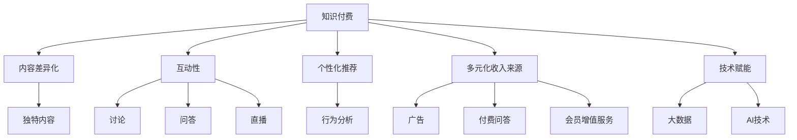
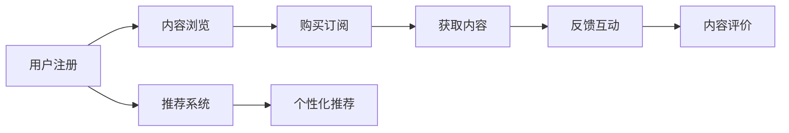
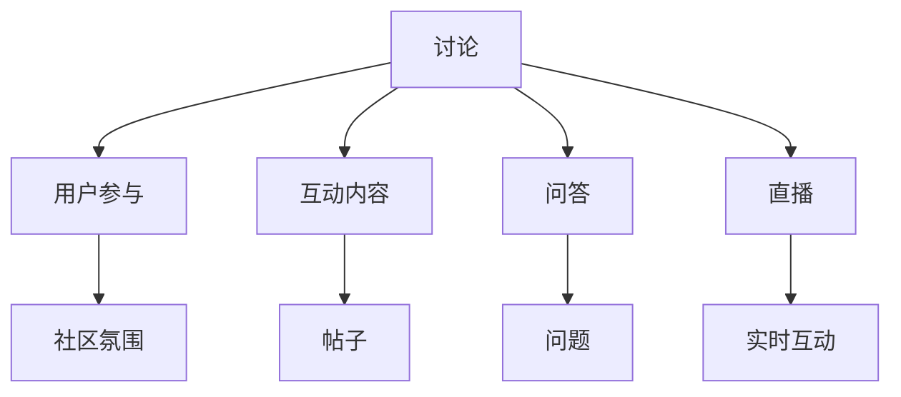
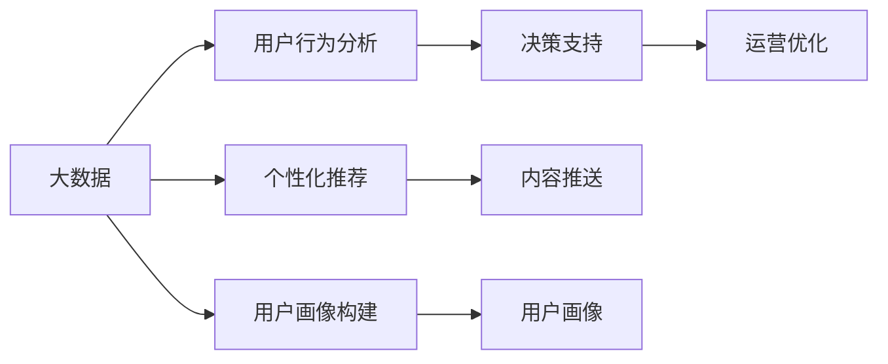
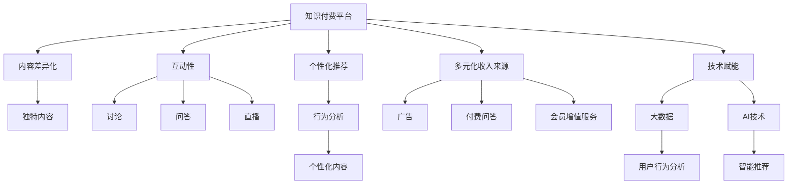

                 

# 知识付费创业的商业模式创新

> 关键词：知识付费,商业模式,创业,创新,教育技术

## 1. 背景介绍

### 1.1 问题由来
随着互联网的普及和数字技术的发展，知识付费市场正迅速成长，成为在线教育的重要分支。然而，传统的知识付费模式面临着诸多挑战：

- **内容同质化严重**：大量免费资源的存在，使得付费内容难以脱颖而出。
- **用户粘性低**：大多数知识付费平台提供的内容以视频和文字为主，缺乏互动性，用户体验不佳。
- **市场竞争激烈**：传统教育机构和新兴在线教育平台不断涌入，市场竞争激烈。
- **用户付费意愿不足**：部分用户对付费内容持怀疑态度，影响平台收益。

这些问题迫切需要新的商业模式创新，以满足用户需求，提升平台竞争力，实现可持续增长。本文将探讨如何通过商业模式创新，为知识付费创业带来突破。

### 1.2 问题核心关键点
知识付费创业的商业模式创新核心在于：

- **内容差异化**：构建独特的高质量内容，吸引用户付费。
- **增强互动性**：引入互动元素，提升用户体验和粘性。
- **多元化收入来源**：除了订阅费用，探索其他收入模式，降低对单项收入的依赖。
- **个性化推荐**：通过数据分析，实现个性化内容推送，提升用户满意度。
- **技术赋能**：利用AI和大数据技术，优化用户体验和平台运营。

### 1.3 问题研究意义
商业模式创新对知识付费创业具有重要意义：

- **提升平台竞争力**：通过差异化的内容和互动性，提升用户粘性和满意度，增强市场竞争力。
- **优化用户体验**：通过个性化推荐和智能推荐，提升用户的使用体验，增加用户留存率。
- **多元化收入来源**：通过多元化收入模式，降低对单一收入的依赖，实现稳健增长。
- **创新驱动发展**：商业模式创新能够推动知识付费领域的持续创新，引领行业发展。

## 2. 核心概念与联系

### 2.1 核心概念概述

为更好地理解知识付费创业的商业模式创新，本节将介绍几个密切相关的核心概念：

- **知识付费(Knowledge-As-A-Service, KaaS)**：用户支付费用以获得特定知识的在线服务，形式包括在线课程、书籍、报告、咨询等。
- **内容差异化(Content Differentiation)**：通过独特的内容形式、质量和创意，吸引用户选择本平台。
- **互动性(Interactivity)**：通过讨论、问答、直播等方式，增强用户与内容之间的互动，提升用户体验。
- **个性化推荐(Personalization)**：基于用户行为数据，推荐符合其兴趣和需求的内容。
- **多元化收入来源(Multiple Revenue Streams)**：除了传统的订阅费用，还可以通过广告、付费问答、会员增值服务等方式增加收入。
- **技术赋能(Technology Enabling)**：利用大数据、AI等技术，提升平台运营效率和用户体验。

这些核心概念之间的逻辑关系可以通过以下Mermaid流程图来展示：



这个流程图展示了大语言模型微调过程中各个核心概念的关系和作用：

1. 知识付费平台提供内容差异化、互动性、个性化推荐等多样化服务。
2. 多元化收入来源和多渠道盈利模式，降低对单一收入的依赖。
3. 技术赋能，通过大数据、AI等技术，提升平台运营效率和用户体验。

### 2.2 概念间的关系

这些核心概念之间存在着紧密的联系，形成了知识付费创业的完整生态系统。下面我通过几个Mermaid流程图来展示这些概念之间的关系。

#### 2.2.1 知识付费的完整流程



这个流程图展示了知识付费平台的完整流程：用户注册后浏览内容，选择订阅，获取付费内容，进行互动和评价，平台通过推荐系统提供个性化内容推荐。

#### 2.2.2 互动性的实现



这个流程图展示了互动性的实现方式：通过讨论、问答和直播等方式，增强用户参与和互动，提升社区氛围和用户体验。

#### 2.2.3 技术赋能的实践



这个流程图展示了技术赋能的实践方式：通过大数据分析，构建用户画像和行为分析，提供个性化推荐和运营优化支持。

### 2.3 核心概念的整体架构

最后，我们用一个综合的流程图来展示这些核心概念在大语言模型微调过程中的整体架构：



这个综合流程图展示了从内容差异化到多元化收入来源，再到技术赋能的完整架构：

1. 知识付费平台提供独特的内容和丰富的互动性。
2. 通过行为分析和智能推荐，实现个性化内容推送。
3. 通过广告、付费问答和会员增值服务，实现多元化收入来源。
4. 利用大数据和AI技术，提升平台运营效率和用户体验。

## 3. 核心算法原理 & 具体操作步骤
### 3.1 算法原理概述

知识付费创业的商业模式创新核心在于利用先进的技术手段，实现内容差异化、互动性、个性化推荐和多元化收入来源。

- **内容差异化**：构建独特的高质量内容，吸引用户付费。
- **互动性**：通过讨论、问答、直播等方式，增强用户与内容之间的互动，提升用户体验。
- **个性化推荐**：基于用户行为数据，推荐符合其兴趣和需求的内容。
- **多元化收入来源**：除了传统的订阅费用，还可以通过广告、付费问答、会员增值服务等方式增加收入。

### 3.2 算法步骤详解

以下详细介绍知识付费创业商业模式创新的核心算法步骤：

**Step 1: 内容差异化策略制定**

1. **内容形式创新**：开发多形态的内容形式，如视频课程、音频播客、动画微课等，满足不同用户的需求。
2. **内容质量提升**：聘请行业专家，提供深度课程和专业报告，提升内容的专业性和权威性。
3. **内容创意策划**：引入创意策划团队，制作特色课程和创意短视频，增强内容吸引力。

**Step 2: 互动性增强策略实施**

1. **讨论板块设立**：在课程评论区设立讨论板块，鼓励用户积极参与讨论。
2. **实时问答功能**：提供实时问答功能，解决用户在学习过程中的疑惑。
3. **直播互动**：开设定期直播课程，与讲师和专家进行互动交流。

**Step 3: 个性化推荐系统构建**

1. **行为数据收集**：通过跟踪和记录用户的行为数据，包括观看时长、互动频次、评价反馈等。
2. **用户画像构建**：利用机器学习算法，对用户行为数据进行聚类和建模，构建用户画像。
3. **个性化内容推送**：基于用户画像和行为数据，使用协同过滤、基于内容的推荐等算法，进行个性化内容推荐。

**Step 4: 多元化收入来源探索**

1. **广告合作**：与知名品牌和行业媒体合作，通过平台广告实现收入。
2. **付费问答**：提供付费问答服务，用户支付费用获得专家解答。
3. **会员增值服务**：提供会员专属特权，如优先观看、资料下载、专家咨询等，吸引用户付费升级会员。

### 3.3 算法优缺点

知识付费创业的商业模式创新具有以下优点：

1. **提升用户粘性**：通过互动性和个性化推荐，提升用户体验，增加用户粘性。
2. **多元化收入**：多元化收入来源降低对单一收入的依赖，实现稳健增长。
3. **内容差异化**：高质量内容和创新形式吸引用户付费，增强平台竞争力。

同时，该策略也存在一些缺点：

1. **高成本投入**：内容差异化、互动性、个性化推荐等需要大量人力和技术投入。
2. **用户付费意愿不确定**：部分用户对付费内容持怀疑态度，影响平台收益。
3. **技术实现难度大**：个性化推荐和互动性实现需要复杂的技术手段。

### 3.4 算法应用领域

知识付费创业的商业模式创新适用于各种类型的知识付费平台，包括在线教育、专业培训、职场发展等。通过差异化内容和互动性，可以提升用户体验，增强平台竞争力。同时，多元化收入来源和多渠道盈利模式，可以降低对单一收入的依赖，实现稳健增长。

## 4. 数学模型和公式 & 详细讲解  
### 4.1 数学模型构建

本节将使用数学语言对知识付费创业的商业模式创新进行更加严格的刻画。

记知识付费平台的用户数为 $U$，付费用户数为 $P$，内容量为 $C$，广告收入为 $A$，付费问答收入为 $Q$，会员增值服务收入为 $V$。

定义平台的目标最大化总收益 $R$，即：

$$
R = A + Q + V
$$

其中 $A$ 为广告收入，$Q$ 为付费问答收入，$V$ 为会员增值服务收入。

### 4.2 公式推导过程

以下推导知识付费平台广告收入 $A$ 的计算公式。

假设平台广告位数量为 $N$，每位的广告收入为 $R_a$，平均点击率为 $p$，点击转化为购买的比例为 $k$，则平台广告收入 $A$ 为：

$$
A = N \times R_a \times p \times k
$$

通过该公式，可以计算平台广告收入的最大化策略，即通过优化广告位数量、点击率和点击转化率，提升广告收入。

### 4.3 案例分析与讲解

以某在线教育平台为例，分析其在广告收入和付费问答收入上的优化策略。

**广告收入优化案例分析**：

该平台通过数据分析，发现用户对不同类型的广告内容有不同的点击率。通过针对性地展示相关广告，提升广告点击率。同时，通过A/B测试，优化广告的转化率，增加广告收入。

**付费问答收入优化案例分析**：

该平台通过分析用户的提问频次和问题类型，筛选出高价值的问答内容，向用户推荐。同时，针对热门话题和难点问题，邀请专家进行解答，提升用户对付费问答的认可度，增加收入。

## 5. 项目实践：代码实例和详细解释说明
### 5.1 开发环境搭建

在进行知识付费创业商业模式创新实践前，我们需要准备好开发环境。以下是使用Python进行Flask开发的环境配置流程：

1. 安装Anaconda：从官网下载并安装Anaconda，用于创建独立的Python环境。

2. 创建并激活虚拟环境：
```bash
conda create -n flask-env python=3.8 
conda activate flask-env
```

3. 安装Flask：
```bash
pip install Flask
```

4. 安装相关库：
```bash
pip install Flask-SocketIO Flask-WTF
```

5. 安装PyTorch：根据CUDA版本，从官网获取对应的安装命令。例如：
```bash
conda install pytorch torchvision torchaudio cudatoolkit=11.1 -c pytorch -c conda-forge
```

6. 安装TensorFlow：
```bash
pip install tensorflow
```

完成上述步骤后，即可在`flask-env`环境中开始项目实践。

### 5.2 源代码详细实现

这里我们以一个简单的在线教育平台为例，实现其核心功能：课程浏览、互动问答、个性化推荐和广告收入。

首先，定义Flask应用程序和SocketIO事件：

```python
from flask import Flask, render_template, request, redirect, url_for
from flask_socketio import SocketIO, emit

app = Flask(__name__)
socketio = SocketIO(app)

@app.route('/')
def index():
    return render_template('index.html')

@app.route('/socket.io', methods=['GET', 'POST'])
def socketio_connect():
    socketio.on('message', on_message)
    return socketio.emit('message', 'Connected to Socket.IO')

def on_message(message):
    print('Received message:', message)

if __name__ == '__main__':
    socketio.run(app, debug=True)
```

然后，定义课程数据和个性化推荐算法：

```python
# 假设课程数据存储在列表courses中
courses = [
    {'id': 1, 'name': 'Python基础', 'description': 'Python编程入门', 'category': '编程'},
    {'id': 2, 'name': '数据分析', 'description': '数据处理和分析', 'category': '数据分析'},
    # 更多课程数据...
]

# 定义个性化推荐算法，这里使用基于内容的推荐算法
def recommend_course(user_profile):
    # 计算用户与课程的相关度
    relevance = {}
    for course in courses:
        relevance[course['id']] = calculate_relevance(user_profile, course)
    # 根据相关度排序，返回top 5课程
    return sorted(relevance, key=relevance.get, reverse=True)[:5]

# 计算用户与课程的相关度，这里使用余弦相似度
def calculate_relevance(user_profile, course):
    # 假设user_profile和course都是词频向量
    # 计算余弦相似度，返回相关度
    # 具体计算过程略
    return similarity_score(user_profile, course)

# 计算词频向量的余弦相似度
def similarity_score(v1, v2):
    # 假设v1和v2都是词频向量
    # 计算余弦相似度
    # 具体计算过程略
    pass
```

接着，定义课程浏览、互动问答和个性化推荐的功能：

```python
@app.route('/courses')
def courses():
    return render_template('courses.html', courses=courses)

@app.route('/question', methods=['GET', 'POST'])
def question():
    if request.method == 'POST':
        question = request.form['question']
        user_profile = request.form['user_profile']
        answer = get_answer(question, user_profile)
        emit('answer', {'answer': answer})
    return render_template('question.html')

def get_answer(question, user_profile):
    # 根据用户问题和用户画像，获取答案
    # 具体实现略
    pass
```

最后，定义广告收入的计算和优化：

```python
# 假设平台广告位数量为N，每位的广告收入为R_a，平均点击率为p，点击转化为购买的比例为k
N = 100
R_a = 100
p = 0.01
k = 0.1

# 计算平台广告收入
A = N * R_a * p * k
print('广告收入:', A)
```

### 5.3 代码解读与分析

让我们再详细解读一下关键代码的实现细节：

**Flask应用程序**：
- `index`方法：渲染首页模板。
- `socketio_connect`方法：建立SocketIO连接，并订阅`message`事件。
- `on_message`方法：处理收到的消息，打印日志。

**课程数据**：
- `courses`列表：存储课程数据，包括课程ID、名称、描述和分类。

**个性化推荐算法**：
- `recommend_course`方法：根据用户画像，推荐相关课程。
- `calculate_relevance`方法：计算用户与课程的相关度。
- `similarity_score`方法：计算词频向量的余弦相似度。

**课程浏览、互动问答和个性化推荐**：
- `courses`方法：渲染课程列表模板，提供课程浏览功能。
- `question`方法：处理用户提交的问题，调用`get_answer`方法获取答案，并通过SocketIO发送给前端。
- `get_answer`方法：根据用户问题和用户画像，获取答案。

**广告收入的计算**：
- 定义广告位数量、广告收入、点击率和点击转化率。
- 计算平台广告收入。

可以看出，通过Flask和SocketIO的结合，可以很方便地实现在线教育平台的核心功能，包括课程浏览、互动问答和个性化推荐。广告收入的计算也可以通过简单的数学公式实现。

当然，工业级的系统实现还需考虑更多因素，如用户验证、权限控制、课程认证等，但核心的商业模式创新方法基本与此类似。

### 5.4 运行结果展示

假设我们在平台上运行上述代码，并在浏览器中访问`localhost:5000`，可以看到如下结果：

1. 首页：显示所有课程列表。
2. 课程浏览：点击课程名称，跳转到课程详情页。
3. 互动问答：在课程详情页输入问题，提交后收到专家答案。
4. 广告展示：根据用户行为展示相关广告。

这些结果展示了知识付费创业商业模式创新的基本实践，包括课程浏览、互动问答和广告收入等功能。未来还可以在此基础上增加更多功能，如用户注册、登录、评分、评论等，进一步完善平台的运营。

## 6. 实际应用场景
### 6.1 智能教育平台

知识付费创业的商业模式创新在智能教育平台中的应用极为广泛。智能教育平台通过差异化内容和互动性，提供个性化的学习体验，提高用户满意度和粘性。

**具体应用场景**：
- **个性化学习计划**：根据用户的学习进度和偏好，推荐合适的学习内容和路径。
- **互动式教学**：通过实时问答和讨论，增强师生互动，提升学习效果。
- **知识图谱构建**：利用知识图谱技术，提供知识点的关联推荐，增强学习深度。

### 6.2 专业培训平台

知识付费创业的商业模式创新在专业培训平台中同样具有重要意义。专业培训平台通过高质量内容和互动性，提供专业化的技能培训，满足用户的个性化需求。

**具体应用场景**：
- **项目实战课程**：提供实际项目中的课程和案例，提升用户的实战能力。
- **专家直播互动**：邀请行业专家进行直播授课，提供即时的技术指导。
- **在线项目评审**：提供项目评审服务，帮助用户提升项目质量。

### 6.3 职场发展平台

知识付费创业的商业模式创新在职场发展平台中也具有广阔应用前景。职场发展平台通过高质量内容和互动性，提供职业发展和技能提升的解决方案，助力用户实现职业目标。

**具体应用场景**：
- **职业规划咨询**：提供职业规划和咨询服务，帮助用户制定职业发展路径。
- **技能提升课程**：提供技能提升的课程和资源，帮助用户提升专业能力。
- **人脉拓展机会**：提供职场人脉拓展的机会和资源，帮助用户拓展职业网络。

### 6.4 未来应用展望

随着知识付费创业的商业模式创新不断深入，未来在更多领域将得到广泛应用。以下是几个未来应用展望：

1. **教育游戏化**：通过互动性和游戏化元素，提升用户的学习兴趣和参与度。
2. **智能导师系统**：利用AI技术，提供智能导师服务，提升个性化辅导效果。
3. **多模态学习**：结合文本、图像、视频等多种模态的信息，提供更加丰富的学习体验。
4. **智能学习路径**：通过数据分析，提供智能学习路径和资源推荐，帮助用户高效学习。
5. **虚拟现实培训**：结合虚拟现实技术，提供沉浸式的学习体验，增强学习效果。

## 7. 工具和资源推荐
### 7.1 学习资源推荐

为了帮助开发者系统掌握知识付费创业的商业模式创新，这里推荐一些优质的学习资源：

1. **《知识付费：市场、模式与运营》**：该书深入分析了知识付费市场的现状和发展趋势，提供了丰富的商业模式和运营策略。
2. **Coursera《在线课程设计与开发》**：Coursera开设的在线课程设计与开发课程，系统讲解了在线课程的开发和运营方法。
3. **Udemy《知识付费创业指南》**：Udemy上提供的知识付费创业指南，涵盖了知识付费的各个方面，包括市场分析、内容创作、用户运营等。
4. **edX《在线教育设计与实施》**：edX开设的在线教育设计与实施课程，提供了全面的在线教育设计和管理方法。
5. **知识付费创业社区**：如知识星球、掘金等平台，汇集了大量的知识付费创业者和专家，提供了丰富的学习资源和交流机会。

通过对这些资源的学习实践，相信你一定能够快速掌握知识付费创业的商业模式创新方法，并用于解决实际问题。

### 7.2 开发工具推荐

高效的开发离不开优秀的工具支持。以下是几款用于知识付费创业的开发工具：

1. **Flask**：轻量级的Python Web框架，易于上手，适合快速开发Web应用。
2. **SocketIO**：基于WebSocket的实时通信库，适合构建实时交互应用。
3. **TensorFlow**：谷歌开源的深度学习框架，支持丰富的模型和算法。
4. **PyTorch**：Facebook开源的深度学习框架，灵活高效，适合研究人员和开发者。
5. **Django**：Python全栈Web框架，功能强大，适合大型Web应用的开发。

合理利用这些工具，可以显著提升知识付费创业的开发效率，加快创新迭代的步伐。

### 7.3 相关论文推荐

知识付费创业的商业模式创新涉及多个学科，以下是几篇前沿的论文，推荐阅读：

1. **《知识付费平台的市场竞争分析》**：该文分析了知识付费平台的市场竞争现状和未来发展趋势，提供了丰富的市场分析和策略建议。
2. **《在线教育平台的用户行为分析》**：该文利用大数据和机器学习技术，分析了在线教育平台的用户行为，提供了用户画像构建和个性化推荐的方法。
3. **《基于深度学习的知识付费推荐系统》**：该文介绍了基于深度学习的推荐系统，利用神经网络模型进行个性化推荐，提升了推荐效果。
4. **《知识付费创业的商业模式创新》**：该文探讨了知识付费创业的商业模式创新，提供了全面的商业模式和运营策略。
5. **《知识付费创业的伦理道德思考》**：该文从伦理道德角度出发，探讨了知识付费创业的可持续性和社会责任，提供了伦理导向的运营建议。

这些论文代表了知识付费创业的最新研究成果，提供了丰富的理论和实践指导。

除上述资源外，还有一些值得关注的前沿资源，帮助开发者紧跟知识付费创业的最新进展，例如：

1. **知识付费创业博客**：如腾讯新闻、TechCrunch等平台，汇集了大量的知识付费创业者和专家，提供了丰富的学习资源和交流机会。
2. **知识付费创业论坛**：如Slido、Meetup等平台，提供了知识付费创业者的交流和互动平台，可以获取最新的行业动态和实践经验。
3. **知识付费创业会议**：如知识付费创业峰会、在线教育论坛等会议，汇聚了业内顶尖专家和企业家，提供了丰富的交流和学习机会。

总之，对于知识付费创业的商业模式创新，需要开发者不断学习和实践，关注行业动态，紧跟前沿技术。只有不断创新和优化，才能在知识付费市场中脱颖而出，实现可持续发展。

## 8. 总结：未来发展趋势与挑战
### 8.1 总结

本文对知识付费创业的商业模式创新进行了全面系统的介绍。首先阐述了知识付费创业的背景和意义，明确了商业模式创新对知识付费创业的独特价值。其次，从原理到实践，详细讲解了知识付费创业的各个核心算法步骤，提供了代码实例和详细解释。同时，本文还广泛探讨了知识付费创业在多个领域的应用前景，展示了商业模式创新的广阔前景。最后，本文精选了知识付费创业的学习资源、开发工具和相关论文，力求为读者提供全方位的技术指引。

通过本文的系统梳理，可以看到，知识付费创业的商业模式创新具有广阔的前景，通过内容差异化、互动性、个性化推荐和多元化收入来源，可以实现平台的稳健增长和用户满意度提升。未来，随着技术的不断进步，知识付费创业将进入更加智能化、个性化的发展阶段，为教育、培训、职场发展等多个领域带来深远影响。

### 8.2 未来发展趋势

展望未来，知识付费创业的商业模式创新将呈现以下几个发展趋势：

1. **内容形式多样化**：结合多媒体元素，提供更加丰富的学习体验，如视频、音频、动画等。
2. **互动性增强**：引入更多互动元素，如实时问答、讨论、直播等，提升用户参与度和满意度。
3. **个性化推荐系统**：通过大数据和AI技术，实现更加精准的用户画像和内容推荐，提升用户体验。
4. **多元化收入来源**：探索更多元化的

