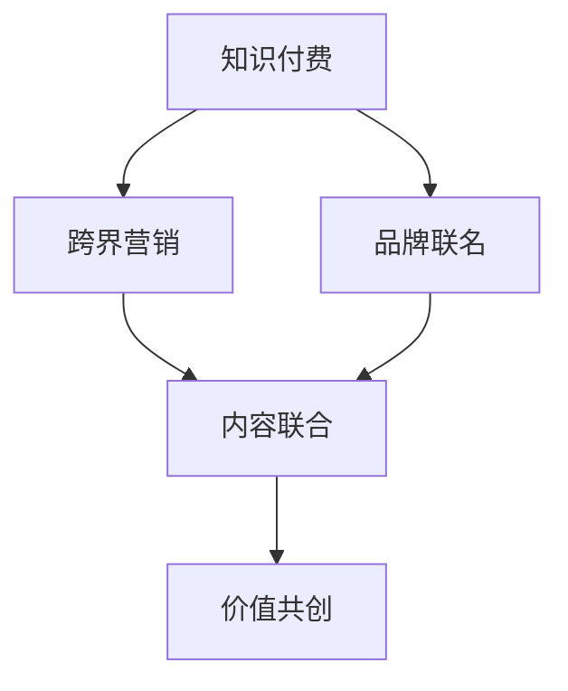
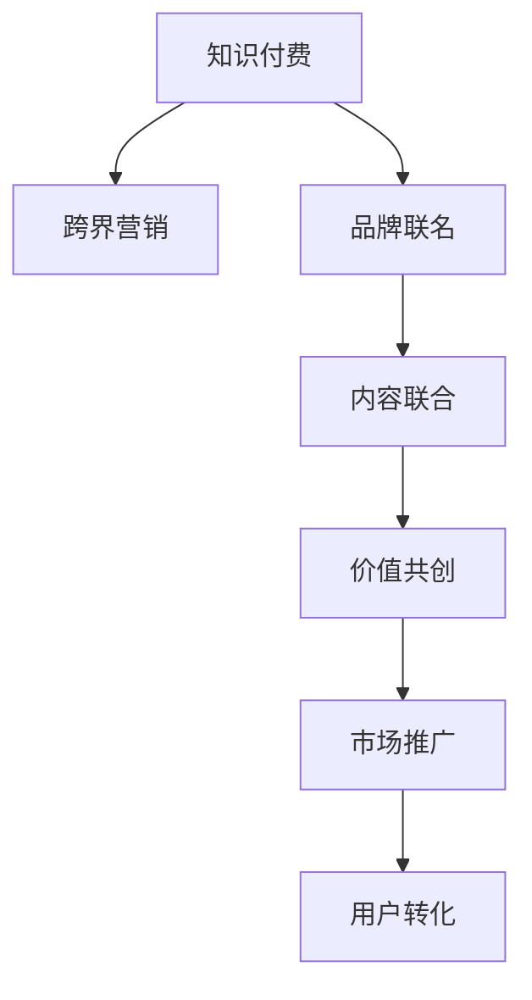

                 

# 知识付费如何实现跨界营销与品牌联名？

在互联网信息爆炸的时代，知识付费作为连接知识创造者与消费者的桥梁，已逐渐成为内容消费的重要模式。越来越多的企业和品牌开始探索利用知识付费平台进行跨界营销与品牌联名，以实现资源共享和价值最大化。本文将详细探讨知识付费如何实现跨界营销与品牌联名的策略和方法，希望能为相关从业者提供有益的参考。

## 1. 背景介绍

### 1.1 知识付费的兴起与发展
知识付费的兴起源于人们对高效、精准、个性化的知识需求。通过付费获取高质量的在线课程、电子书、报告、音频等，用户可以更快地掌握新知识、提升技能。近年来，各大知识付费平台（如得到、喜马拉雅、知乎live等）迅速崛起，累积了大量活跃用户。知识付费作为一种新兴的付费模式，不仅满足了用户对知识的需求，还带动了知识产业的快速发展。

### 1.2 跨界营销与品牌联名的现状
跨界营销与品牌联名是品牌营销的重要手段之一，旨在通过不同品牌之间的合作，互相借助对方的资源与影响力，拓展市场份额，提升品牌知名度。在知识付费领域，跨界营销与品牌联名同样具备巨大的潜力，能够实现资源共享、优势互补。然而，相比于传统商品品牌的跨界，知识付费品牌的联名面临着更多挑战，需要精心策划与执行。

## 2. 核心概念与联系

### 2.1 核心概念概述

- **知识付费**：以知识为付费对象，通过在线平台提供各种课程、文章、音频等内容，满足用户的学习需求。
- **跨界营销**：不同行业或领域之间的品牌合作，通过互相利用对方的资源和渠道，实现双赢或多赢。
- **品牌联名**：两个或多个品牌联合推广，通过共同的营销活动、产品联名等方式，提升品牌形象和市场影响力。
- **内容联合**：知识付费平台与线下品牌、其他线上品牌进行内容合作，共同创作和分享知识，扩大知识传播范围。
- **价值共创**：通过知识付费平台的品牌联名，双方共同创造新的产品或服务，增加用户粘性和品牌价值。

### 2.2 概念间的关系

知识付费的跨界营销与品牌联名，本质上是一种内容联合与价值共创的过程。通过平台与品牌之间的深度合作，可以共同创造高质量的知识内容，提升品牌形象，增加用户价值。这种模式不仅有助于品牌的市场拓展和用户积累，还能够推动知识付费平台的长期发展，实现双赢或多赢的局面。

这些概念之间的逻辑关系可以通过以下Mermaid流程图来展示：



这个流程图展示了大语言模型微调过程中各个核心概念之间的关系：

1. 知识付费与跨界营销、品牌联名的关系：知识付费作为内容平台，可以通过跨界营销与品牌联名，拓展品牌影响力。
2. 跨界营销与品牌联名之间的联系：跨界营销通过品牌合作，实现资源共享和价值提升。
3. 内容联合与价值共创的关系：内容联合是跨界营销和品牌联名的基础，通过内容合作实现价值共创。

### 2.3 核心概念的整体架构

最后，我们用一个综合的流程图来展示这些核心概念在大语言模型微调过程中的整体架构：



这个综合流程图展示了从知识付费到跨界营销、品牌联名，再到内容联合、价值共创、市场推广和用户转化的完整过程。通过这些环节的有机结合，品牌能够在知识付费平台上实现更大范围的传播和更深的用户连接。

## 3. 核心算法原理 & 具体操作步骤
### 3.1 算法原理概述

知识付费的跨界营销与品牌联名，主要依赖于知识内容的高质量与多样性，以及品牌的资源整合与价值传递。这种营销模式的关键在于通过高质量的内容吸引用户，再通过品牌合作进行深度推广，最终实现用户转化和品牌增值。

具体来说，知识付费平台可以通过以下步骤实现跨界营销与品牌联名：

1. **筛选合作伙伴**：根据品牌特点、目标受众、市场定位等要素，筛选出合适的合作伙伴。
2. **策划联合内容**：与品牌联合策划具有品牌特色和知识价值的内容，包括课程、音频、文章、视频等。
3. **推广与引流**：利用知识付费平台的流量优势，通过内容分发、社交媒体推广等方式，吸引目标用户关注。
4. **深度互动**：与品牌共同开展互动活动，如问答、直播、线上课程等，增强用户粘性和参与感。
5. **品牌联名产品**：推出品牌联名的知识付费产品，如联合课程、联名音频、限量版电子书等，增加用户粘性。
6. **市场推广与用户转化**：通过市场推广活动，提升品牌知名度，最终实现用户转化和品牌价值的提升。

### 3.2 算法步骤详解

以下是知识付费跨界营销与品牌联名的详细步骤：

**Step 1: 筛选合作伙伴**

- 目标受众分析：确定目标用户群体，了解其兴趣、需求和消费习惯。
- 品牌筛选标准：根据品牌在目标用户中的知名度、美誉度和市场定位，筛选合适的合作伙伴。
- 合作方式确定：确定合作方式，如内容联合、产品联名、市场推广等。

**Step 2: 策划联合内容**

- 内容选题策划：结合品牌特点与知识付费平台的内容特色，策划具有吸引力的选题。
- 内容创作与审核：品牌联合知识付费平台共同创作内容，并进行审核和优化。
- 内容发布计划：制定内容发布计划，包括发布时间、频次、渠道等。

**Step 3: 推广与引流**

- 内容分发策略：利用知识付费平台的推荐算法，将联合内容精准推送给目标用户。
- 社交媒体推广：在各大社交媒体平台上进行内容推广，吸引更多用户关注。
- KOL合作推广：与知名意见领袖合作，通过直播、文章、视频等方式进行推广。

**Step 4: 深度互动**

- 互动活动设计：设计互动活动，如问答、直播、线上课程等，增强用户粘性和参与感。
- 用户反馈收集：通过问卷、评论等方式收集用户反馈，优化内容和服务。
- 社区建设：构建品牌与用户之间的社区，增加用户粘性和品牌忠诚度。

**Step 5: 品牌联名产品**

- 联名课程设计：设计品牌联名的课程，结合品牌特点和知识付费平台的特色。
- 限量版产品发布：推出限量版电子书、音频课程等，增加用户粘性。
- 联合宣传推广：通过多渠道进行联合宣传，提升品牌联名产品的知名度。

**Step 6: 市场推广与用户转化**

- 市场推广活动：开展市场推广活动，如品牌联名课程的免费试听、限时优惠等，吸引更多用户关注。
- 用户转化策略：通过优惠政策、联合活动等方式，提高用户转化率。
- 效果评估与优化：对市场推广和用户转化效果进行评估，优化策略和方法。

### 3.3 算法优缺点

**优点：**

1. **资源整合**：通过跨界营销与品牌联名，可以实现资源整合，提升品牌影响力。
2. **内容丰富**：与品牌联合创作高质量内容，满足用户多样化的知识需求。
3. **用户粘性增强**：通过互动活动和品牌联名产品，增强用户粘性和参与感。
4. **市场推广效果显著**：品牌通过知识付费平台进行市场推广，可以更快地提升知名度和用户基数。

**缺点：**

1. **内容创作难度高**：高质量内容创作需要品牌与知识付费平台的深度合作，难度较大。
2. **合作成本较高**：品牌合作需要投入大量人力、物力和财力，成本较高。
3. **品牌冲突风险**：品牌联名需考虑品牌间的匹配度和价值观，避免品牌冲突。
4. **用户期望高**：用户对品牌联名内容有较高期望，品牌需保持高水准的内容质量。

### 3.4 算法应用领域

知识付费的跨界营销与品牌联名方法，已经广泛应用于多个领域，包括：

- **教育培训**：与教育机构合作，推出联合课程、在线直播等，提升品牌知名度。
- **健康医疗**：与健康品牌合作，推出健康知识课程、音频讲解等，推广健康知识。
- **科技产品**：与科技公司合作，推出科技类知识课程、产品评测等，增加产品曝光度。
- **金融理财**：与金融品牌合作，推出理财知识课程、投资策略讲解等，提升品牌形象。
- **文化艺术**：与文化艺术品牌合作，推出文化知识课程、艺术讲解等，推广文化艺术。

## 4. 数学模型和公式 & 详细讲解  
### 4.1 数学模型构建

知识付费的跨界营销与品牌联名，本质上是一个多目标优化问题。假设知识付费平台的目标是最大化品牌知名度、用户参与度和内容质量。设品牌知名度为 $B$，用户参与度为 $U$，内容质量为 $C$，则数学模型可表示为：

$$
\max_{(B, U, C)} \alpha B + \beta U + \gamma C
$$

其中，$\alpha$、$\beta$、$\gamma$ 分别为品牌知名度、用户参与度和内容质量的权重系数。

### 4.2 公式推导过程

基于上述数学模型，我们可以通过优化算法（如拉格朗日乘子法）求解最优解。设品牌知名度 $B$、用户参与度 $U$、内容质量 $C$ 的初始值分别为 $B_0$、$U_0$、$C_0$，则优化目标为：

$$
\max_{(B, U, C)} \alpha (B - B_0) + \beta (U - U_0) + \gamma (C - C_0)
$$

令 $B - B_0 = x$、$U - U_0 = y$、$C - C_0 = z$，则优化目标变为：

$$
\max_{(x, y, z)} \alpha x + \beta y + \gamma z
$$

这是一个典型的多目标优化问题，可以通过构建拉格朗日乘子函数，求解如下：

$$
L(x, y, z, \lambda, \mu, \nu) = \alpha x + \beta y + \gamma z - \lambda (x - \frac{\partial F}{\partial B}) - \mu (y - \frac{\partial F}{\partial U}) - \nu (z - \frac{\partial F}{\partial C})
$$

其中，$\lambda$、$\mu$、$\nu$ 为拉格朗日乘子，$F$ 为品牌知名度、用户参与度和内容质量的度量函数。

### 4.3 案例分析与讲解

假设某知识付费平台与健康品牌合作，推出健康知识课程。设课程内容质量为 $C$，用户参与度为 $U$，品牌知名度为 $B$。根据用户反馈，课程内容质量 $C$ 为 3，用户参与度 $U$ 为 2，品牌知名度 $B$ 为 1。则数学模型为：

$$
\max_{(B, U, C)} 2B + 3U + 5C
$$

设 $\alpha = 2$、$\beta = 3$、$\gamma = 5$，则优化目标为：

$$
\max_{(x, y, z)} 2x + 3y + 5z
$$

其中 $x = B - B_0$、$y = U - U_0$、$z = C - C_0$。

假设 $\lambda = 1$、$\mu = 2$、$\nu = 3$，则拉格朗日乘子函数为：

$$
L(x, y, z, \lambda, \mu, \nu) = 2x + 3y + 5z - \lambda (x - \frac{\partial F}{\partial B}) - \mu (y - \frac{\partial F}{\partial U}) - \nu (z - \frac{\partial F}{\partial C})
$$

通过求解上述优化问题，可以找到最优的 $x$、$y$、$z$ 值，即 $B - B_0$、$U - U_0$、$C - C_0$，从而提升品牌知名度、用户参与度和内容质量。

## 5. 项目实践：代码实例和详细解释说明
### 5.1 开发环境搭建

在进行知识付费跨界营销与品牌联名实践前，我们需要准备好开发环境。以下是使用Python进行Django开发的环境配置流程：

1. 安装Anaconda：从官网下载并安装Anaconda，用于创建独立的Python环境。

2. 创建并激活虚拟环境：
```bash
conda create -n django-env python=3.8 
conda activate django-env
```

3. 安装Django：使用pip安装Django。
```bash
pip install django
```

4. 安装相关库：安装需要的第三方库，如Pandas、Django REST framework、TQDM等。
```bash
pip install pandas django-rest-framework tqdm
```

完成上述步骤后，即可在`django-env`环境中开始项目开发。

### 5.2 源代码详细实现

我们以知识付费平台与健康品牌合作的例子，给出使用Django框架开发知识付费的代码实现。

首先，创建一个名为`health_course`的Django应用：

```bash
python manage.py startapp health_course
```

然后，在应用的`settings.py`文件中添加`health_course`应用：

```python
INSTALLED_APPS = [
    ...
    'health_course',
    ...
]
```

接着，定义`health_course`应用的数据模型：

```python
from django.db import models

class HealthCourse(models.Model):
    title = models.CharField(max_length=100)
    description = models.TextField()
    instructor = models.CharField(max_length=100)
    duration = models.IntegerField()

    def __str__(self):
        return self.title
```

接下来，定义视图和URL路由：

```python
from django.shortcuts import render
from rest_framework.views import APIView
from rest_framework.response import Response
from .models import HealthCourse

class HealthCourseView(APIView):
    def get(self, request):
        courses = HealthCourse.objects.all()
        serialized_courses = HealthCourseSerializer(courses, many=True)
        return Response(serialized_courses.data)

    def post(self, request):
        serializer = HealthCourseSerializer(data=request.data)
        if serializer.is_valid():
            serializer.save()
            return Response(serializer.data, status=201)
        return Response(serializer.errors, status=400)
```

在应用的`urls.py`文件中，定义URL路由：

```python
from django.urls import path
from .views import HealthCourseView

urlpatterns = [
    path('courses/', HealthCourseView.as_view(), name='courses'),
]
```

最后，在项目的主`urls.py`文件中添加`health_course`应用的路由：

```python
from django.urls import include

urlpatterns = [
    path('api/', include('health_course.urls')),
]
```

完成上述代码实现后，即可通过Django框架搭建知识付费平台的API接口，与健康品牌合作，实现课程内容共享、用户互动等。

### 5.3 代码解读与分析

让我们再详细解读一下关键代码的实现细节：

**HealthCourse类**：
- 定义了健康课程的基本属性，包括课程标题、描述、讲师和时长。

**HealthCourseView类**：
- 定义了API接口的视图函数，包括获取课程列表和创建课程的API。
- `get`方法：获取所有课程列表，并返回JSON格式的数据。
- `post`方法：创建新的健康课程，验证并保存后返回JSON格式的数据。

**urls.py文件**：
- 定义了API接口的路由，将请求映射到相应的视图函数。
- `path('courses/', HealthCourseView.as_view(), name='courses')`：定义了`/courses/`路径，对应的视图函数为`HealthCourseView`。

**主urls.py文件**：
- 定义了项目的总体路由，将`health_course`应用的路由包含在内。
- `path('api/', include('health_course.urls'))`：定义了`/api/`路径，包含`health_course`应用的路由。

通过上述代码实现，我们可以看到Django框架的高效性和易用性。在实际应用中，还可以根据需要添加更多功能，如用户管理、课程推荐、付费机制等，以满足复杂的需求。

## 6. 实际应用场景
### 6.1 智能医疗咨询

知识付费平台可以与医疗健康品牌合作，推出健康咨询课程、健康知识讲座等，帮助用户解答健康问题，提升健康素养。例如，可以与知名医院、健康机构合作，推出由专家讲解的健康课程，涵盖疾病预防、饮食调理、心理健康等主题。通过知识付费平台进行推广，吸引更多用户关注，提升品牌知名度。

### 6.2 在线教育培训

知识付费平台可以与教育培训机构合作，推出各类在线课程、习题讲解、学习社群等，提供高质量的教育资源。例如，可以与知名高校、教育机构合作，推出名师讲授的学术课程、专业技能课程等，满足用户的学习需求。通过知识付费平台进行推广，提高课程曝光度，吸引更多用户参与。

### 6.3 文化艺术推广

知识付费平台可以与文化艺术品牌合作，推出文化艺术课程、艺术讲解、艺术展览等，提升用户的文化艺术素养。例如，可以与知名艺术家、博物馆合作，推出绘画、音乐、舞蹈等艺术课程，增加用户的艺术兴趣和参与感。通过知识付费平台进行推广，扩大文化艺术的影响力。

### 6.4 金融理财普及

知识付费平台可以与金融理财品牌合作，推出金融知识课程、理财策略讲解、投资理财指南等，提升用户的理财水平。例如，可以与知名金融机构、财经专家合作，推出理财课程、投资策略、财务规划等，帮助用户理清理财思路，提升财富管理能力。通过知识付费平台进行推广，提高品牌知名度，吸引更多用户参与。

## 7. 工具和资源推荐
### 7.1 学习资源推荐

为了帮助开发者掌握知识付费的跨界营销与品牌联名技术，这里推荐一些优质的学习资源：

1. **《知识付费：内容、运营与商业模式》**：一本书系统介绍知识付费行业的发展现状、运营策略和商业模式，为品牌联名提供理论基础。
2. **《内容营销：从零到一》**：一本书介绍内容营销的方法和技巧，包括如何与品牌合作，进行联合推广。
3. **《数字营销基础》**：一门在线课程介绍数字营销的基本原理和实践技巧，包括SEO、社交媒体、内容营销等。
4. **《知识付费课程开发与运营》**：一节系列课程介绍知识付费课程的开发、推广和运营，涵盖内容策划、用户互动、付费机制等。
5. **《品牌联名策略与执行》**：一节线上讲座介绍品牌联名的策略和执行方法，包括如何选择合作伙伴、设计联合内容等。

通过这些学习资源，开发者可以深入理解知识付费的跨界营销与品牌联名技术，掌握实际操作的方法和技巧。

### 7.2 开发工具推荐

高效的工具是知识付费开发的重要保障。以下是几款用于知识付费开发的工具：

1. **Django**：一个开源的Python Web框架，适合快速开发和部署Web应用。
2. **Django REST framework**：一个用于构建API的Django库，支持RESTful风格API的设计和开发。
3. **Flask**：一个轻量级的Python Web框架，适合构建小型、高效的应用程序。
4. **React**：一个用于构建Web前端界面的JavaScript库，适合制作交互性强的用户界面。
5. **Figma**：一个在线设计工具，适合团队协作设计UI界面和用户体验。

合理利用这些工具，可以显著提升知识付费平台的开发效率，提高用户体验和品牌影响力。

### 7.3 相关论文推荐

知识付费的跨界营销与品牌联名技术涉及多学科的交叉，以下几篇论文提供了理论支持：

1. **《内容营销的跨界合作研究》**：研究内容营销中的跨界合作策略，提出品牌联名的优势和执行方法。
2. **《知识付费平台的用户行为分析》**：分析知识付费平台的用户行为，提出内容推荐和用户体验优化的策略。
3. **《知识付费平台的市场推广研究》**：研究知识付费平台的市场推广方法，提出联合营销和品牌联名的方案。
4. **《人工智能在知识付费中的应用》**：探讨人工智能技术在知识付费中的应用，包括内容生成、智能推荐等。
5. **《跨界营销的案例分析》**：通过对多个成功案例的分析，提出跨界营销的策略和执行方法。

这些论文代表了大语言模型微调技术的发展脉络，为知识付费的跨界营销与品牌联名提供了理论基础和实践指南。

## 8. 总结：未来发展趋势与挑战
### 8.1 研究成果总结

本文对知识付费的跨界营销与品牌联名方法进行了全面系统的介绍。首先，阐述了知识付费的兴起与发展背景，明确了跨界营销与品牌联名的重要性。其次，从原理到实践，详细讲解了知识付费跨界营销与品牌联名的数学模型和操作步骤，给出了具体的代码实现。同时，本文还广泛探讨了跨界营销与品牌联名在教育培训、健康医疗、文化艺术、金融理财等多个领域的应用场景，展示了其广阔的应用前景。最后，本文精选了相关的学习资源、开发工具和学术论文，为读者提供了全方位的技术指引。

通过本文的系统梳理，可以看到，知识付费的跨界营销与品牌联名技术在大数据时代具备巨大的发展潜力。这种营销模式不仅能够提升品牌知名度和用户粘性，还能实现资源的共享和价值的最大化。未来的发展方向包括利用人工智能技术进行内容推荐、用户行为分析、智能营销等，将进一步提升知识付费平台的竞争力。

### 8.2 未来发展趋势

展望未来，知识付费的跨界营销与品牌联名技术将呈现以下几个发展趋势：

1. **内容多样化**：知识付费平台将推出更多类型的内容，涵盖音频、视频、文章、互动直播等多种形式，满足用户的多样化需求。
2. **用户个性化**：利用AI技术进行用户画像分析，实现个性化的内容推荐和定制化服务，提高用户满意度和粘性。
3. **品牌多样化**：知识付费平台将与更多领域的企业和品牌合作，推出跨界联合内容，扩大品牌影响力。
4. **市场多元化**：知识付费平台将拓展海外市场，与国际品牌和教育机构合作，实现全球化推广。
5. **技术创新**：利用最新的AI技术和区块链技术，实现内容版权保护、知识付费和付费知识交易，提升平台的安全性和可信赖度。

以上趋势将推动知识付费平台向更加智能化、个性化的方向发展，为品牌提供更多元的合作方式和更大的市场空间。

### 8.3 面临的挑战

尽管知识付费的跨界营销与品牌联名技术已经取得了一定的成果，但在迈向更加智能化、普适化应用的过程中，它仍面临着诸多挑战：

1. **内容版权问题**：品牌联名内容可能涉及版权问题，品牌方和知识付费平台需共同解决版权授权和保护的问题。
2. **用户信任度**：知识付费平台需提升平台可信度和用户信任度，确保内容质量和品牌信誉。
3. **市场竞争**：知识付费平台需面对激烈的市场竞争，提升平台的用户粘性和市场份额。
4. **技术实现难度**：品牌联名需要多学科、多技术的深度整合，技术实现难度较高。
5. **运营成本**：品牌联名需投入大量资源进行推广和运营，成本较高。

### 8.4 研究展望

面对知识付费跨界营销与品牌联名所面临的种种挑战，未来的研究需要在以下几个方面寻求新的突破：

1. **内容版权保护**：利用区块链等技术，确保品牌联名内容的版权和授权，避免侵权风险。
2. **用户信任机制**：建立用户信任机制，提升平台可信度和用户粘性，增强用户信任。
3. **市场推广策略**：制定科学的市场推广策略，提高品牌知名度和用户转化率。
4. **技术协同创新**：加强跨界合作，实现多学科、多技术的深度融合，提升技术创新能力。
5. **用户互动体验**：提升用户互动体验，增加用户粘性和参与感，实现品牌与用户的深度互动。

这些研究方向的探索，必将引领知识付费平台向更高的台阶发展，为品牌提供更优质的服务，为知识付费行业带来新的活力和增长点。

## 9. 附录：常见问题与解答

**Q1：如何选择合适的合作伙伴？**

A: 选择合作伙伴需考虑品牌特点、目标受众、市场定位等要素。优先选择与知识付费平台目标用户群体匹配度高的品牌，以提高用户转化率。

**Q2：如何进行品牌联名产品的设计？**

A: 品牌联名产品需结合品牌特点和知识付费平台的特色，设计具有吸引力的产品。可以通过联合课程、联名音频、限量版电子书等方式实现。

**Q3：如何进行市场推广活动？**

A: 市场推广活动需结合品牌特点和目标用户，制定科学的市场推广策略。可以通过线上线下多渠道推广、KOL合作推广等方式提升品牌知名度。

**Q4：如何进行用户互动和反馈收集？**

A: 通过问答、直播、线上课程等互动活动，增强用户粘性和参与感。同时，通过问卷、评论等方式收集用户反馈，优化内容和服务。

**Q5：如何进行内容版权保护？**

A: 利用区块链等

