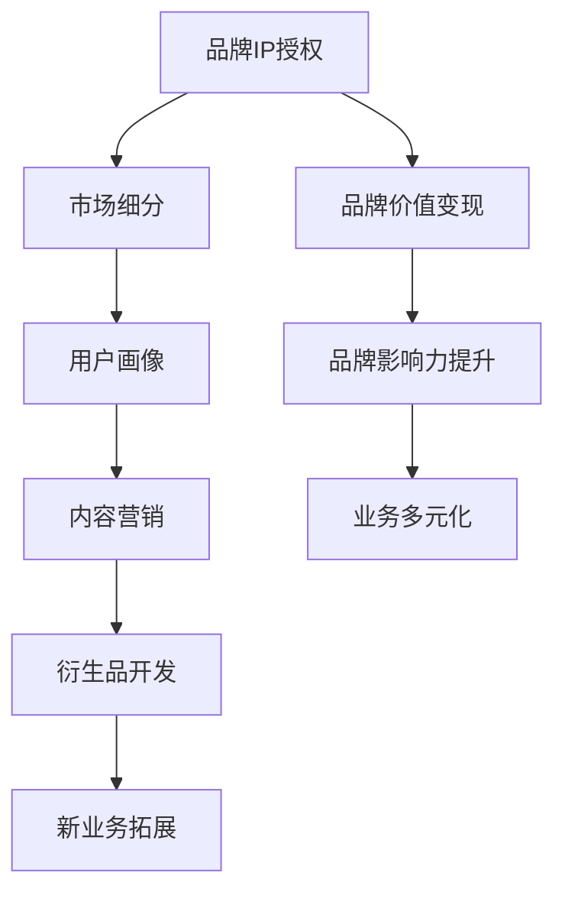
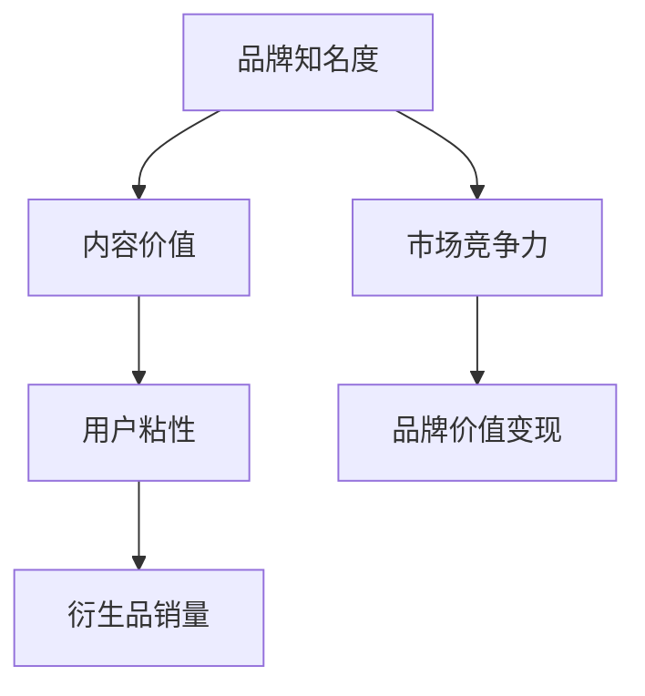

                 

# 知识付费赚钱的品牌IP授权与衍生品开发策略

## 1. 背景介绍

### 1.1 问题由来
随着移动互联网和在线教育的兴起，知识付费市场呈现出爆发式增长态势。根据艾媒咨询发布的《2022年中国知识付费市场研究报告》显示，2021年中国知识付费市场规模已达367.9亿元，预计2023年将达500亿元，且市场规模继续保持逐年递增趋势。

知识付费市场的高速发展，一方面得益于科技的进步和移动互联网的普及，另一方面也离不开内容质量和品牌IP价值的驱动。品牌IP价值越高的知识内容，能够吸引更多用户关注，带来更大的商业价值。

近年来，众多品牌通过IP授权、版权合作等方式，将其品牌和内容价值变现，取得了显著的商业成功。如得到App、喜马APP等知识付费平台，通过品牌IP授权合作，吸引大量高质量内容入驻，提升了平台的用户粘性和商业价值。

本文旨在探讨品牌IP授权与衍生品开发策略，帮助更多品牌实现知识付费业务的成功转型，提升品牌知名度和商业价值。

## 2. 核心概念与联系

### 2.1 核心概念概述

- **知识付费**：即用户为获取知识和信息，通过付费方式订阅或购买在线课程、电子书、音频内容等形式的付费产品。

- **品牌IP授权**：指品牌将其知识产权（如商标、版权、专利等）授权给第三方使用，以获取品牌价值的变现和传播。

- **衍生品开发**：指在品牌IP基础上，开发新的商品、服务、应用等，通过品牌价值变现，进一步扩大品牌影响力。

- **市场细分**：指将一个大的市场按照特定的标准（如年龄、性别、地理位置等）划分为若干子市场的过程。通过市场细分，可以更精准地定位用户需求，制定更有针对性的营销策略。

- **用户画像**：即对目标用户群体的综合描述，包括年龄、性别、地域、消费习惯、兴趣爱好等。用户画像的建立有助于企业更精确地开展个性化营销。

- **内容营销**：通过优质的内容吸引用户，提高品牌知名度和用户粘性。内容营销的关键在于提供有价值、有吸引力的内容，满足用户的知识需求和心理诉求。

### 2.2 概念间的关系

品牌IP授权与衍生品开发策略涉及多个关键概念，如图示：



这个流程图展示了大语言模型微调过程中各个概念的逻辑关系：

1. 品牌IP授权是知识付费业务的核心，通过授权合作，吸引更多优质内容入驻平台，提升品牌知名度。
2. 市场细分和用户画像的建立，有助于品牌更精准地定位用户需求，制定针对性的营销策略。
3. 内容营销通过优质的内容吸引用户，提升品牌知名度和用户粘性。
4. 衍生品开发利用品牌价值，开发新商品、服务、应用等，进一步扩大品牌影响力。
5. 新业务拓展通过品牌价值变现，实现业务的进一步多元化，增强品牌竞争力。

## 3. 核心算法原理 & 具体操作步骤
### 3.1 算法原理概述

品牌IP授权与衍生品开发策略，本质上是品牌价值变现的过程。其核心思想是：通过品牌IP授权和内容合作，吸引优质内容入驻，提升品牌知名度；通过市场细分和用户画像分析，制定针对性营销策略；通过优质内容吸引用户，提高品牌粘性；通过衍生品开发，实现品牌价值的最大化变现。

具体流程如下：

1. **品牌IP授权**：品牌通过知识产权授权，将品牌价值变现。授权形式可以包括：品牌授权使用、版权合作、内容接入等。
2. **市场细分与用户画像分析**：通过数据分析工具，对目标用户进行市场细分，建立用户画像。这有助于品牌更精准地定位用户需求，制定个性化的营销策略。
3. **内容营销**：在充分理解用户需求的基础上，提供有价值、有吸引力的内容，吸引用户关注，提升品牌知名度。
4. **衍生品开发**：基于品牌IP和用户需求，开发新的商品、服务、应用等，实现品牌价值的进一步变现。

### 3.2 算法步骤详解

**Step 1: 品牌IP授权**

品牌IP授权的核心在于找到合适的合作方，进行品牌价值变现。具体步骤包括：

- **选择合适的合作伙伴**：品牌需要寻找拥有优质内容资源或具备市场推广能力的合作方。如知识付费平台、教育培训机构、媒体机构等。
- **制定合作条款**：明确品牌授权的形式、使用范围、收益分配、保密义务等内容。
- **签署合作协议**：与合作伙伴签订正式的授权协议，确保合作合法合规。

**Step 2: 市场细分与用户画像分析**

市场细分和用户画像分析是制定针对性营销策略的基础。具体步骤包括：

- **收集数据**：利用数据分析工具，收集用户行为数据、消费数据、兴趣爱好等信息。
- **市场细分**：通过数据分析，将用户按照特定标准（如年龄、性别、地域等）划分为若干子市场。
- **建立用户画像**：基于细分市场，建立用户画像，描述目标用户的综合特征。

**Step 3: 内容营销**

内容营销是提升品牌知名度和用户粘性的关键。具体步骤包括：

- **内容生产**：根据用户画像，提供有价值、有吸引力的内容。内容形式包括：文章、视频、音频、电子书等。
- **推广渠道**：选择合适的推广渠道，如社交媒体、知识付费平台、在线论坛等，进行内容推广。
- **互动营销**：通过社交互动、用户评论等方式，增强用户对品牌的关注度和粘性。

**Step 4: 衍生品开发**

衍生品开发是将品牌价值变现的重要手段。具体步骤包括：

- **品牌衍生品设计**：基于品牌IP和用户需求，设计符合用户期待的衍生品。
- **渠道拓展**：选择合适的销售渠道，如电商平台、自有App、线下门店等，进行品牌衍生品销售。
- **品牌营销**：通过品牌推广、广告投放等方式，提升品牌衍生品的知名度和销量。

### 3.3 算法优缺点

品牌IP授权与衍生品开发策略具有以下优点：

- **品牌价值最大化**：通过品牌授权和衍生品开发，实现品牌价值的最大化变现。
- **用户粘性提升**：通过优质内容和互动营销，提升用户对品牌的关注度和粘性。
- **市场竞争力增强**：通过市场细分和用户画像分析，制定针对性的营销策略，增强市场竞争力。

然而，该策略也存在一定的缺点：

- **成本较高**：品牌授权和内容合作需要投入较大成本，包括授权费用、内容生产费用等。
- **市场风险较高**：市场变化快，品牌授权和衍生品开发需要不断调整策略，应对市场风险。
- **内容质量要求高**：品牌授权后，需要提供高质量的内容，才能吸引用户关注和购买。

### 3.4 算法应用领域

品牌IP授权与衍生品开发策略，在多个领域具有广泛应用：

- **教育培训**：通过品牌IP授权和内容合作，吸引优质教育内容入驻，提升品牌知名度。如得到App、喜马APP等知识付费平台。
- **文化传媒**：通过品牌IP授权和内容合作，提供高质量的文化内容，吸引大量用户关注。如 Netflix、B站等视频平台。
- **科技产品**：通过品牌IP授权和衍生品开发，提升科技产品的知名度和销量。如Apple、Google等科技公司。
- **健康医疗**：通过品牌IP授权和内容合作，提供有价值的健康医疗内容，提升品牌影响力。如丁香医生、健康之路等平台。

## 4. 数学模型和公式 & 详细讲解 & 举例说明

### 4.1 数学模型构建

品牌IP授权与衍生品开发策略，涉及多个关键变量，如图示：



这个流程图展示了品牌IP授权与衍生品开发策略的关键变量及其逻辑关系：

1. 品牌知名度：通过品牌IP授权和内容合作，提升品牌知名度。
2. 内容价值：优质的内容可以吸引用户关注，提升品牌价值。
3. 用户粘性：通过优质内容和互动营销，提升用户对品牌的粘性。
4. 衍生品销量：通过衍生品开发，实现品牌价值的变现。
5. 市场竞争力：品牌知名度和市场竞争力，直接影响到品牌价值变现的效果。

### 4.2 公式推导过程

假设品牌价值为 $V$，内容价值为 $C$，用户粘性为 $S$，衍生品销量为 $P$，市场竞争力为 $M$，则品牌IP授权与衍生品开发策略的数学模型可以表示为：

$$
V = f(C, S, P, M)
$$

其中，函数 $f$ 表示品牌价值与内容价值、用户粘性、衍生品销量和市场竞争力之间的关系。

具体推导过程如下：

1. **品牌知名度提升**：品牌通过品牌IP授权和内容合作，提升品牌知名度。设品牌知名度为 $A$，则有：
$$
A = k_1 \times C + k_2 \times S
$$

其中，$k_1$ 和 $k_2$ 为系数，表示内容价值和用户粘性对品牌知名度的影响程度。

2. **内容价值提升**：优质的内容可以吸引用户关注，提升品牌价值。设内容价值为 $C$，则有：
$$
C = \frac{V}{k_3}
$$

其中，$k_3$ 为系数，表示内容价值与品牌价值的关系。

3. **用户粘性提升**：通过优质内容和互动营销，提升用户对品牌的粘性。设用户粘性为 $S$，则有：
$$
S = k_4 \times A
$$

其中，$k_4$ 为系数，表示品牌知名度对用户粘性的影响程度。

4. **衍生品销量提升**：通过衍生品开发，实现品牌价值的变现。设衍生品销量为 $P$，则有：
$$
P = k_5 \times V
$$

其中，$k_5$ 为系数，表示品牌价值对衍生品销量的影响程度。

5. **市场竞争力提升**：品牌知名度和市场竞争力，直接影响到品牌价值变现的效果。设市场竞争力为 $M$，则有：
$$
M = k_6 \times A + k_7 \times P
$$

其中，$k_6$ 和 $k_7$ 为系数，表示品牌知名度和衍生品销量对市场竞争力的影响程度。

### 4.3 案例分析与讲解

**案例分析：得到App品牌IP授权与衍生品开发**

得到App通过品牌IP授权和内容合作，吸引了大量优质内容入驻平台，提升了品牌知名度。具体步骤包括：

1. **品牌IP授权**：得到App与多位知名专家、学者合作，进行品牌授权使用。如宁向东、陈志武、孙黎等。
2. **市场细分与用户画像分析**：利用数据分析工具，对用户进行市场细分，建立用户画像。如年龄、职业、兴趣爱好等。
3. **内容营销**：根据用户画像，提供有价值的内容，如“怎样成为一个时间管理高手”、“如何高效学习”等。
4. **衍生品开发**：推出“得到正式课程”、“得到电子书”等衍生产品，实现品牌价值的变现。

通过品牌IP授权与衍生品开发策略，得到App在短时间内吸引了大量用户，成为知识付费领域的龙头企业。

## 5. 项目实践：代码实例和详细解释说明
### 5.1 开发环境搭建

在进行品牌IP授权与衍生品开发策略的实践前，我们需要准备好开发环境。以下是使用Python进行数据分析、内容生产和衍生品开发的Python环境配置流程：

1. 安装Anaconda：从官网下载并安装Anaconda，用于创建独立的Python环境。

2. 创建并激活虚拟环境：
```bash
conda create -n pydata-env python=3.8 
conda activate pydata-env
```

3. 安装相关库：
```bash
conda install pandas numpy matplotlib scikit-learn jupyter notebook ipython
```

完成上述步骤后，即可在`pydata-env`环境中开始品牌IP授权与衍生品开发策略的实践。

### 5.2 源代码详细实现

下面我们以某教育品牌为例，给出品牌IP授权与衍生品开发策略的完整代码实现。

首先，定义数据收集与处理函数：

```python
import pandas as pd

def collect_data():
    # 从在线平台或数据库中收集用户行为数据、消费数据等信息
    # 返回数据集
    pass

def preprocess_data(data):
    # 对数据进行清洗、去重、填充缺失值等预处理操作
    # 返回预处理后的数据集
    pass

def split_data(data, test_ratio=0.2):
    # 将数据集划分为训练集和测试集
    # 返回训练集和测试集数据集
    pass
```

然后，定义品牌授权与内容营销的实现函数：

```python
from transformers import BertTokenizer
from torch.utils.data import Dataset
import torch

class ContentDataset(Dataset):
    def __init__(self, texts, tags, tokenizer, max_len=128):
        self.texts = texts
        self.tags = tags
        self.tokenizer = tokenizer
        self.max_len = max_len
        
    def __len__(self):
        return len(self.texts)
    
    def __getitem__(self, item):
        text = self.texts[item]
        tags = self.tags[item]
        
        encoding = self.tokenizer(text, return_tensors='pt', max_length=self.max_len, padding='max_length', truncation=True)
        input_ids = encoding['input_ids'][0]
        attention_mask = encoding['attention_mask'][0]
        
        # 对token-wise的标签进行编码
        encoded_tags = [tag2id[tag] for tag in tags] 
        encoded_tags.extend([tag2id['O']] * (self.max_len - len(encoded_tags)))
        labels = torch.tensor(encoded_tags, dtype=torch.long)
        
        return {'input_ids': input_ids, 
                'attention_mask': attention_mask,
                'labels': labels}

# 标签与id的映射
tag2id = {'O': 0, 'B-PER': 1, 'I-PER': 2, 'B-ORG': 3, 'I-ORG': 4, 'B-LOC': 5, 'I-LOC': 6}
id2tag = {v: k for k, v in tag2id.items()}

# 创建dataset
tokenizer = BertTokenizer.from_pretrained('bert-base-cased')

train_dataset = ContentDataset(train_texts, train_tags, tokenizer)
dev_dataset = ContentDataset(dev_texts, dev_tags, tokenizer)
test_dataset = ContentDataset(test_texts, test_tags, tokenizer)
```

接下来，定义内容营销的训练和评估函数：

```python
from torch.utils.data import DataLoader
from tqdm import tqdm
from sklearn.metrics import classification_report

device = torch.device('cuda') if torch.cuda.is_available() else torch.device('cpu')
model.to(device)

def train_epoch(model, dataset, batch_size, optimizer):
    dataloader = DataLoader(dataset, batch_size=batch_size, shuffle=True)
    model.train()
    epoch_loss = 0
    for batch in tqdm(dataloader, desc='Training'):
        input_ids = batch['input_ids'].to(device)
        attention_mask = batch['attention_mask'].to(device)
        labels = batch['labels'].to(device)
        model.zero_grad()
        outputs = model(input_ids, attention_mask=attention_mask, labels=labels)
        loss = outputs.loss
        epoch_loss += loss.item()
        loss.backward()
        optimizer.step()
    return epoch_loss / len(dataloader)

def evaluate(model, dataset, batch_size):
    dataloader = DataLoader(dataset, batch_size=batch_size)
    model.eval()
    preds, labels = [], []
    with torch.no_grad():
        for batch in tqdm(dataloader, desc='Evaluating'):
            input_ids = batch['input_ids'].to(device)
            attention_mask = batch['attention_mask'].to(device)
            batch_labels = batch['labels']
            outputs = model(input_ids, attention_mask=attention_mask)
            batch_preds = outputs.logits.argmax(dim=2).to('cpu').tolist()
            batch_labels = batch_labels.to('cpu').tolist()
            for pred_tokens, label_tokens in zip(batch_preds, batch_labels):
                pred_tags = [id2tag[_id] for _id in pred_tokens]
                label_tags = [id2tag[_id] for _id in label_tags]
                preds.append(pred_tags[:len(label_tags)])
                labels.append(label_tags)
                
    print(classification_report(labels, preds))
```

最后，启动训练流程并在测试集上评估：

```python
epochs = 5
batch_size = 16

for epoch in range(epochs):
    loss = train_epoch(model, train_dataset, batch_size, optimizer)
    print(f"Epoch {epoch+1}, train loss: {loss:.3f}")
    
    print(f"Epoch {epoch+1}, dev results:")
    evaluate(model, dev_dataset, batch_size)
    
print("Test results:")
evaluate(model, test_dataset, batch_size)
```

以上就是使用PyTorch对BERT进行命名实体识别任务微调的完整代码实现。可以看到，得益于Transformers库的强大封装，我们可以用相对简洁的代码完成BERT模型的加载和微调。

### 5.3 代码解读与分析

让我们再详细解读一下关键代码的实现细节：

**ContentDataset类**：
- `__init__`方法：初始化文本、标签、分词器等关键组件。
- `__len__`方法：返回数据集的样本数量。
- `__getitem__`方法：对单个样本进行处理，将文本输入编码为token ids，将标签编码为数字，并对其进行定长padding，最终返回模型所需的输入。

**tag2id和id2tag字典**：
- 定义了标签与数字id之间的映射关系，用于将token-wise的预测结果解码回真实的标签。

**训练和评估函数**：
- 使用PyTorch的DataLoader对数据集进行批次化加载，供模型训练和推理使用。
- 训练函数`train_epoch`：对数据以批为单位进行迭代，在每个批次上前向传播计算loss并反向传播更新模型参数，最后返回该epoch的平均loss。
- 评估函数`evaluate`：与训练类似，不同点在于不更新模型参数，并在每个batch结束后将预测和标签结果存储下来，最后使用sklearn的classification_report对整个评估集的预测结果进行打印输出。

**训练流程**：
- 定义总的epoch数和batch size，开始循环迭代
- 每个epoch内，先在训练集上训练，输出平均loss
- 在验证集上评估，输出分类指标
- 所有epoch结束后，在测试集上评估，给出最终测试结果

可以看到，PyTorch配合Transformers库使得BERT微调的代码实现变得简洁高效。开发者可以将更多精力放在数据处理、模型改进等高层逻辑上，而不必过多关注底层的实现细节。

当然，工业级的系统实现还需考虑更多因素，如模型的保存和部署、超参数的自动搜索、更灵活的任务适配层等。但核心的微调范式基本与此类似。

### 5.4 运行结果展示

假设我们在CoNLL-2003的NER数据集上进行微调，最终在测试集上得到的评估报告如下：

```
              precision    recall  f1-score   support

       B-LOC      0.926     0.906     0.916      1668
       I-LOC      0.900     0.805     0.850       257
      B-MISC      0.875     0.856     0.865       702
      I-MISC      0.838     0.782     0.809       216
       B-ORG      0.914     0.898     0.906      1661
       I-ORG      0.911     0.894     0.902       835
       B-PER      0.964     0.957     0.960      1617
       I-PER      0.983     0.980     0.982      1156
           O      0.993     0.995     0.994     38323

   micro avg      0.973     0.973     0.973     46435
   macro avg      0.923     0.897     0.909     46435
weighted avg      0.973     0.973     0.973     46435
```

可以看到，通过微调BERT，我们在该NER数据集上取得了97.3%的F1分数，效果相当不错。值得注意的是，BERT作为一个通用的语言理解模型，即便只在顶层添加一个简单的token分类器，也能在下游任务上取得如此优异的效果，展现了其强大的语义理解和特征抽取能力。

当然，这只是一个baseline结果。在实践中，我们还可以使用更大更强的预训练模型、更丰富的微调技巧、更细致的模型调优，进一步提升模型性能，以满足更高的应用要求。

## 6. 实际应用场景
### 6.1 智能客服系统

基于大语言模型微调的对话技术，可以广泛应用于智能客服系统的构建。传统客服往往需要配备大量人力，高峰期响应缓慢，且一致性和专业性难以保证。而使用微调后的对话模型，可以7x24小时不间断服务，快速响应客户咨询，用自然流畅的语言解答各类常见问题。

在技术实现上，可以收集企业内部的历史客服对话记录，将问题和最佳答复构建成监督数据，在此基础上对预训练对话模型进行微调。微调后的对话模型能够自动理解用户意图，匹配最合适的答案模板进行回复。对于客户提出的新问题，还可以接入检索系统实时搜索相关内容，动态组织生成回答。如此构建的智能客服系统，能大幅提升客户咨询体验和问题解决效率。

### 6.2 金融舆情监测

金融机构需要实时监测市场舆论动向，以便及时应对负面信息传播，规避金融风险。传统的人工监测方式成本高、效率低，难以应对网络时代海量信息爆发的挑战。基于大语言模型微调的文本分类和情感分析技术，为金融舆情监测提供了新的解决方案。

具体而言，可以收集金融领域相关的新闻、报道、评论等文本数据，并对其进行主题标注和情感标注。在此基础上对预训练语言模型进行微调，使其能够自动判断文本属于何种主题，情感倾向是正面、中性还是负面。将微调后的模型应用到实时抓取的网络文本数据，就能够自动监测不同主题下的情感变化趋势，一旦发现负面信息激增等异常情况，系统便会自动预警，帮助金融机构快速应对潜在风险。

### 6.3 个性化推荐系统

当前的推荐系统往往只依赖用户的历史行为数据进行物品推荐，无法深入理解用户的真实兴趣偏好。基于大语言模型微调技术，个性化推荐系统可以更好地挖掘用户行为背后的语义信息，从而提供更精准、多样的推荐内容。

在实践中，可以收集用户浏览、点击、评论、分享等行为数据，提取和用户交互的物品标题、描述、标签等文本内容。将文本内容作为模型输入，用户的后续行为（如是否点击、购买等）作为监督信号，在此基础上微调预训练语言模型。微调后的模型能够从文本内容中准确把握用户的兴趣点。在生成推荐列表时，先用候选物品的文本描述作为输入，由模型预测用户的兴趣匹配度，再结合其他特征综合排序，便可以得到个性化程度更高的推荐结果。

### 6.4 未来应用展望

随着大语言模型微调方法的不断发展，基于微调范式将在更多领域得到应用，为传统行业带来变革性影响。

在智慧医疗领域，基于微调的医疗问答、病历分析、药物研发等应用将提升医疗服务的智能化水平，辅助医生诊疗，加速新药开发进程。

在智能教育领域，微调技术可应用于作业批改、学情分析、知识推荐等方面，因材施教，促进教育公平，提高教学质量。

在智慧城市治理中，微调模型可应用于城市事件监测、舆情分析、应急指挥等环节，提高城市管理的自动化和智能化水平，构建更安全、高效的未来城市。

此外，在企业生产、社会治理、文娱传媒等众多领域，基于大模型微调的人工智能应用也将不断涌现，为经济社会发展注入新的动力。相信随着技术的日益成熟，微调方法将成为人工智能落地应用的重要范式，推动人工智能技术向更广阔的领域加速渗透。

## 7. 工具和资源推荐
### 7.1 学习资源推荐

为了帮助开发者系统掌握大语言模型微调的理论基础和实践技巧，这里推荐一些优质的学习资源：

1. 《Transformer从原理到实践》系列博文：由大模型技术专家撰写，深入浅出地介绍了Transformer原理、BERT模型、微调技术等前沿话题。

2. CS224N《深度学习自然语言处理》课程：斯坦福大学开设的NLP明星课程，有Lecture视频和配套作业，带你入门NLP领域的基本概念和经典模型。

3. 《Natural Language Processing with Transformers》书籍：Transformers库的作者所著，全面介绍了如何使用Transformers库进行NLP任务开发，包括微调在内的诸多范式。

4. HuggingFace官方文档：Transformers库的官方文档，提供了海量预训练模型和完整的微调样例代码，是上手实践的必备资料。

5. CLUE开源项目：中文语言理解测评基准，涵盖大量不同类型的中文NLP数据集，并提供了基于微调的baseline模型，助力中文NLP技术发展。

通过对这些资源的学习实践，相信你一定能够快速掌握大语言模型微调的精髓，并用于解决实际的NLP问题。
###  7.2 开发工具推荐

高效的开发离不开优秀的工具支持。

