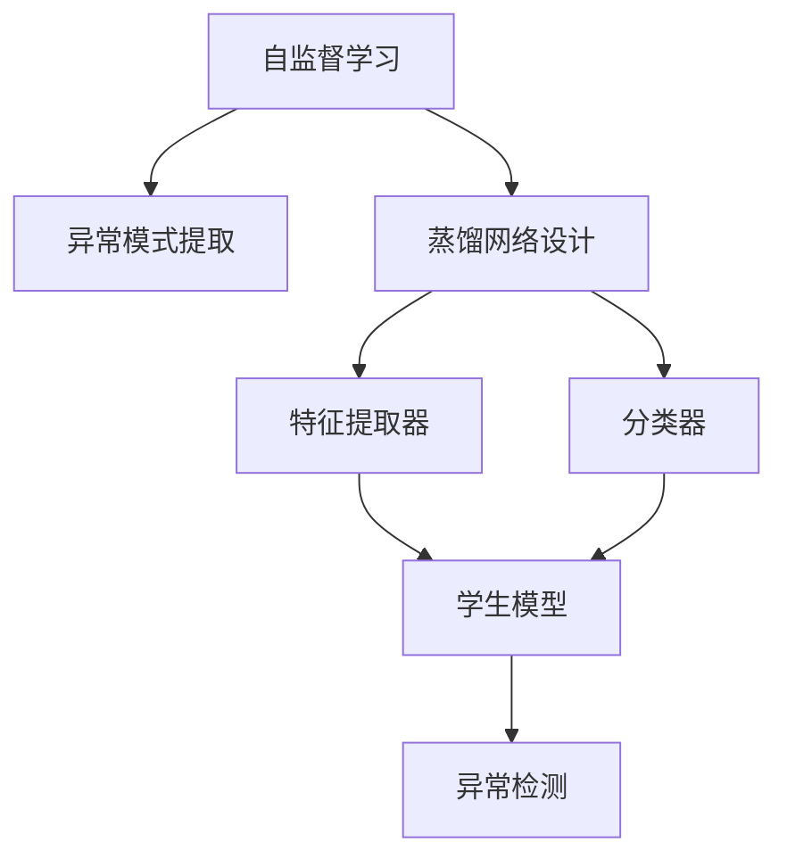
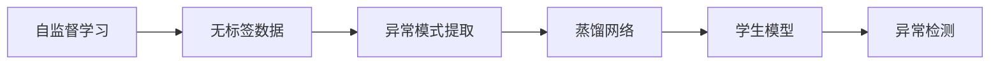
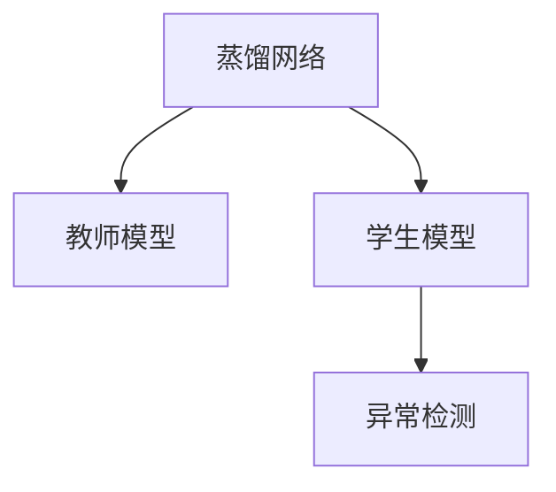
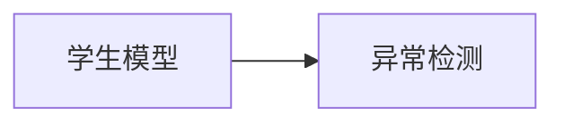
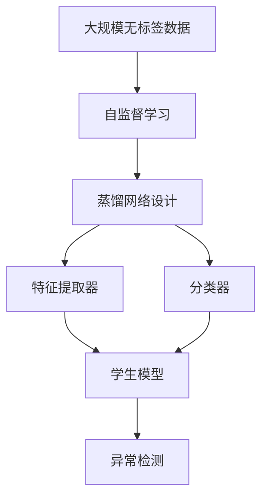

                 

# 知识蒸馏在异常检测任务中的应用

> 关键词：知识蒸馏, 异常检测, 自监督学习, 蒸馏网络, 知识转移

## 1. 背景介绍

### 1.1 问题由来

异常检测（Anomaly Detection）是机器学习领域中的一个重要任务，旨在识别数据集中不符合正常模式的数据点。传统的异常检测方法主要基于统计学和规则的特征建模，如均值方差法、孤立森林等，但这些方法往往对数据分布的假设较多，对于复杂和未知数据的适应性较差。近年来，深度学习方法在异常检测中的研究逐渐增多，其中基于自监督学习的知识蒸馏（Knowledge Distillation）方法因其高效且鲁棒的特点，在异常检测领域逐渐成为研究热点。

### 1.2 问题核心关键点

知识蒸馏（Knowledge Distillation，KD）是一种从复杂的教师模型（Teacher Model）中提取知识和技能，并传递给一个更小的学生模型（Student Model）的技术。知识蒸馏的核心思想是利用教师模型的强大特征提取能力和泛化能力，指导学生模型学习到相似的特征表示，从而提升学生模型在特定任务上的性能。对于异常检测任务，知识蒸馏可以通过自监督学习的方式，从大规模无标签数据中提取异常模式，并通过蒸馏传递给下游异常检测模型。

知识蒸馏在异常检测任务中的应用，主要包括以下几个关键点：

1. **自监督学习**：利用大规模无标签数据进行自监督学习，提取异常模式。
2. **蒸馏网络设计**：设计蒸馏网络，将教师模型的知识传递给学生模型。
3. **模型压缩**：通过知识蒸馏，对复杂教师模型进行压缩，提升推理效率。
4. **泛化能力**：蒸馏网络通过学习教师模型的泛化能力，提升学生模型的泛化能力。
5. **鲁棒性增强**：知识蒸馏可以增强学生模型的鲁棒性，使其在面对未知和变化数据时表现更为稳定。

这些关键点共同构成了知识蒸馏在异常检测任务中的应用框架，旨在利用教师模型的优势，提升学生模型的异常检测能力。

## 2. 核心概念与联系

### 2.1 核心概念概述

为更好地理解知识蒸馏在异常检测任务中的应用，本节将介绍几个密切相关的核心概念：

- **知识蒸馏**：从教师模型中提取知识和技能，并传递给学生模型的技术。
- **自监督学习**：利用大规模无标签数据，通过模型自身训练，提取有用的知识。
- **蒸馏网络**：设计用于知识传递的神经网络结构，一般包含两个部分：特征提取器和分类器。
- **学生模型**：通过知识蒸馏学习到教师模型特征表示的模型。
- **教师模型**：拥有强大特征提取能力和泛化能力的模型。
- **异常检测**：识别数据集中不符合正常模式的数据点的任务。

这些核心概念之间的逻辑关系可以通过以下Mermaid流程图来展示：



这个流程图展示了大规模无标签数据如何通过自监督学习提取异常模式，并通过蒸馏网络将知识传递给学生模型，最终用于异常检测的过程。

### 2.2 概念间的关系

这些核心概念之间存在着紧密的联系，形成了知识蒸馏在异常检测任务中的应用生态系统。下面我通过几个Mermaid流程图来展示这些概念之间的关系。

#### 2.2.1 自监督学习与知识蒸馏的关系



这个流程图展示了自监督学习如何从大规模无标签数据中提取异常模式，并通过蒸馏网络传递给学生模型，最终用于异常检测。

#### 2.2.2 蒸馏网络与异常检测的关系



这个流程图展示了蒸馏网络如何通过特征提取器和分类器将教师模型的知识传递给学生模型，最终用于异常检测。

#### 2.2.3 学生模型与异常检测的关系



这个流程图展示了学生模型如何通过学习教师模型的特征表示，用于异常检测任务。

### 2.3 核心概念的整体架构

最后，我们用一个综合的流程图来展示这些核心概念在大规模无标签数据上进行异常检测的整体架构：



这个综合流程图展示了从大规模无标签数据中提取异常模式，并通过蒸馏网络将知识传递给学生模型，最终用于异常检测的过程。

## 3. 核心算法原理 & 具体操作步骤
### 3.1 算法原理概述

知识蒸馏在异常检测任务中的应用，主要通过自监督学习的方式，从大规模无标签数据中提取异常模式，并通过蒸馏网络将知识传递给学生模型。具体来说，该过程包括以下几个步骤：

1. **数据预处理**：对大规模无标签数据进行预处理，包括清洗、归一化等操作。
2. **自监督学习**：利用自监督学习任务，从预处理后的数据中提取异常模式。
3. **蒸馏网络设计**：设计蒸馏网络，将教师模型的知识传递给学生模型。
4. **知识蒸馏**：通过蒸馏网络，将教师模型的特征表示传递给学生模型，提升学生模型的异常检测能力。
5. **异常检测**：利用训练好的学生模型，对新数据进行异常检测。

### 3.2 算法步骤详解

以下是知识蒸馏在异常检测任务中的详细步骤：

**Step 1: 数据预处理**

- 对大规模无标签数据进行清洗和归一化，去除噪声和异常值，确保数据质量。
- 对数据进行标准化，如归一化到0到1之间。
- 将数据划分为训练集和测试集，用于模型训练和评估。

**Step 2: 自监督学习**

- 设计自监督学习任务，如重构误差、变分自编码器（VAE）等，从预处理后的数据中提取异常模式。
- 训练自监督学习模型，提取异常模式，并将其表示为高维特征向量。
- 使用这些特征向量作为教师模型的输入，训练教师模型。

**Step 3: 蒸馏网络设计**

- 设计蒸馏网络，一般包括特征提取器和分类器。
- 特征提取器通常采用卷积神经网络（CNN）或全连接神经网络（FCN），用于提取数据的高维特征表示。
- 分类器采用简单的全连接层或神经网络，用于将特征向量映射到异常/正常标签空间。

**Step 4: 知识蒸馏**

- 将教师模型的特征表示和标签作为蒸馏网络的输入，训练蒸馏网络。
- 通过蒸馏网络，将教师模型的知识传递给学生模型，使其学习到相似的特征表示。
- 使用教师模型和蒸馏网络的输出，通过加权平均或softmax权重等方式，生成最终的异常检测结果。

**Step 5: 异常检测**

- 利用训练好的学生模型，对新数据进行异常检测。
- 将新数据输入学生模型，输出异常得分，根据得分判断是否为异常点。
- 根据实际需求，设定异常得分的阈值，确定异常检测结果。

### 3.3 算法优缺点

知识蒸馏在异常检测任务中的优点包括：

- **高效性**：通过自监督学习提取异常模式，可以避免标注数据的依赖，节省标注成本。
- **泛化能力**：通过蒸馏网络学习教师模型的泛化能力，提升学生模型的泛化能力。
- **鲁棒性**：通过蒸馏网络增强学生模型的鲁棒性，使其在面对未知和变化数据时表现更为稳定。

同时，该方法也存在一些缺点：

- **计算复杂度**：蒸馏网络的设计和训练需要大量计算资源，特别是在大规模数据和复杂模型的情况下。
- **模型复杂度**：蒸馏网络的设计需要考虑多个因素，如特征提取和分类器选择等，增加了模型的复杂性。
- **数据质量依赖**：自监督学习的效果高度依赖于数据的质量和数量，需要大规模高质数据的支持。

### 3.4 算法应用领域

知识蒸馏在异常检测任务中的应用，已经广泛应用于多个领域，例如：

- **网络安全**：监控网络流量，识别异常流量行为，防止DDoS攻击等。
- **金融风险管理**：识别异常交易行为，防范欺诈和金融风险。
- **工业故障检测**：监测设备运行状态，识别异常信号，预防设备故障。
- **健康医疗**：监测患者生命体征，识别异常生理信号，辅助疾病诊断和治疗。

## 4. 数学模型和公式 & 详细讲解 & 举例说明

### 4.1 数学模型构建

知识蒸馏在异常检测任务中，主要通过自监督学习任务提取异常模式，并通过蒸馏网络将知识传递给学生模型。我们可以用以下数学模型来描述这一过程：

设教师模型为 $T_{\theta_T}$，学生模型为 $T_{\theta_S}$，其中 $\theta_T$ 和 $\theta_S$ 分别为教师和学生模型的参数。设 $f_{\theta_T}(x)$ 为教师模型的特征提取器，$g_{\theta_T}(x)$ 为教师模型的分类器，则教师模型可以表示为：

$$
T_{\theta_T}(x) = (f_{\theta_T}(x), g_{\theta_T}(f_{\theta_T}(x)))
$$

设蒸馏网络为 $D_{\theta_D}$，其中 $\theta_D$ 为蒸馏网络的参数，蒸馏网络的特征提取器为 $f_{\theta_D}(x)$，分类器为 $g_{\theta_D}(f_{\theta_D}(x))$，则蒸馏网络可以表示为：

$$
D_{\theta_D}(x) = (f_{\theta_D}(x), g_{\theta_D}(f_{\theta_D}(x)))
$$

设自监督学习任务为 $L_{\text{unsup}}(x)$，则自监督学习模型可以表示为：

$$
L_{\text{unsup}}(x) = \sum_{i=1}^n l_{\text{unsup}}(x_i)
$$

其中 $l_{\text{unsup}}(x_i)$ 为自监督学习任务在数据点 $x_i$ 上的损失函数。

### 4.2 公式推导过程

知识蒸馏在异常检测任务中的公式推导过程，主要涉及教师模型、蒸馏网络和自监督学习任务的组合。我们以重构误差（Reconstruction Error）为例，推导蒸馏网络的知识蒸馏过程。

重构误差是指，给定输入 $x$，将通过教师模型的特征提取器 $f_{\theta_T}(x)$ 提取的特征 $h_{\theta_T}(x)$ 重构回 $x$ 的损失。重构误差可以表示为：

$$
L_{\text{rec}}(x) = \frac{1}{2} \| x - \hat{x} \|^2
$$

其中 $\hat{x}$ 为重构后的输入 $x$。

教师模型 $T_{\theta_T}(x)$ 和蒸馏网络 $D_{\theta_D}(x)$ 的知识蒸馏过程可以表示为：

$$
L_{\text{distill}}(x) = \frac{1}{\alpha}L_{\text{rec}}(x) + \lambda L_{\text{sup}}(x)
$$

其中 $\alpha$ 为蒸馏强度，$\lambda$ 为蒸馏损失的权重，$L_{\text{sup}}(x)$ 为教师模型的输出和蒸馏网络的输出之间的距离损失函数。

### 4.3 案例分析与讲解

为了更直观地理解知识蒸馏在异常检测任务中的应用，我们通过一个具体的案例进行讲解。

假设我们有一个大规模无标签数据集 $D$，其中包含了正常和异常的数据点。我们设计了两个神经网络，一个作为教师模型 $T_{\theta_T}$，另一个作为蒸馏网络 $D_{\theta_D}$。通过自监督学习任务，我们从数据集中提取了异常模式，并将其表示为高维特征向量。

接下来，我们使用教师模型的特征提取器和分类器，对自监督学习任务中提取的特征向量进行训练，得到教师模型的参数 $\theta_T$。然后，我们将教师模型的参数和特征向量作为蒸馏网络的输入，训练蒸馏网络，得到蒸馏网络的参数 $\theta_D$。最后，我们使用蒸馏网络对新数据进行异常检测。

例如，假设我们有一个新的数据点 $x$，我们可以通过教师模型和蒸馏网络的特征提取器，分别得到特征表示 $h_{\theta_T}(x)$ 和 $h_{\theta_D}(x)$，并将这两个特征表示作为蒸馏网络的输入，得到蒸馏网络的输出 $y_{\theta_D}(h_{\theta_D}(x))$。根据教师模型的输出和蒸馏网络的输出之间的距离，我们可以计算出蒸馏损失 $L_{\text{sup}}(x)$。最终，我们可以使用教师模型和蒸馏网络的输出，通过加权平均或softmax权重等方式，生成最终的异常检测结果。

## 5. 项目实践：代码实例和详细解释说明

### 5.1 开发环境搭建

在进行知识蒸馏在异常检测任务中的实践时，我们需要准备好开发环境。以下是使用Python进行TensorFlow开发的环境配置流程：

1. 安装Anaconda：从官网下载并安装Anaconda，用于创建独立的Python环境。

2. 创建并激活虚拟环境：
```bash
conda create -n tf-env python=3.8 
conda activate tf-env
```

3. 安装TensorFlow：根据CUDA版本，从官网获取对应的安装命令。例如：
```bash
conda install tensorflow tensorflow-gpu -c conda-forge
```

4. 安装TensorBoard：用于可视化模型训练状态和结果。
```bash
pip install tensorboard
```

5. 安装各类工具包：
```bash
pip install numpy pandas scikit-learn matplotlib tqdm jupyter notebook ipython
```

完成上述步骤后，即可在`tf-env`环境中开始知识蒸馏在异常检测任务中的实践。

### 5.2 源代码详细实现

这里我们以重构误差为例，给出使用TensorFlow实现知识蒸馏在异常检测任务中的PyTorch代码实现。

首先，定义自监督学习任务：

```python
import tensorflow as tf
from tensorflow.keras import layers, models

class AutoEncoder(tf.keras.Model):
    def __init__(self, input_dim):
        super(AutoEncoder, self).__init__()
        self.encoder = layers.Dense(32, input_dim)
        self.decoder = layers.Dense(input_dim, 32)
        self.flatten = layers.Flatten()
        
    def call(self, x):
        x = self.encoder(x)
        x = self.flatten(x)
        x = self.decoder(x)
        return x

input_dim = 784
autoencoder = AutoEncoder(input_dim)
autoencoder.compile(optimizer='adam', loss='mse')
```

然后，定义蒸馏网络：

```python
class DistillationNetwork(tf.keras.Model):
    def __init__(self, input_dim):
        super(DistillationNetwork, self).__init__()
        self.feature_extractor = layers.Dense(32, input_dim)
        self.classifier = layers.Dense(1, 32)
        
    def call(self, x):
        x = self.feature_extractor(x)
        x = self.classifier(x)
        return x

distillation_network = DistillationNetwork(input_dim)
```

接着，定义知识蒸馏过程：

```python
class KnowledgeDistillation(tf.keras.Model):
    def __init__(self, teacher_model, student_model, alpha=0.1, beta=1.0):
        super(KnowledgeDistillation, self).__init__()
        self.teacher_model = teacher_model
        self.student_model = student_model
        self.alpha = alpha
        self.beta = beta
        
    def call(self, x):
        student_output = self.student_model(x)
        teacher_output = self.teacher_model(x)
        distillation_loss = self.alpha * tf.reduce_mean(tf.square(student_output - teacher_output)) + self.beta * tf.reduce_mean(tf.square(teacher_output - student_output))
        return distillation_loss
```

最后，进行异常检测：

```python
import numpy as np

# 生成随机数据
np.random.seed(42)
normal_data = np.random.normal(0, 1, (10000, input_dim))
anomalous_data = np.random.normal(0, 10, (1000, input_dim))

# 定义模型
teacher_model = models.Sequential([
    layers.Dense(32, input_dim),
    layers.ReLU(),
    layers.Dense(1, 32)
])

teacher_model.compile(optimizer='adam', loss='mse')
teacher_model.fit(normal_data, normal_data, epochs=10, batch_size=128)

# 定义学生模型
student_model = models.Sequential([
    layers.Dense(32, input_dim),
    layers.ReLU(),
    layers.Dense(1, 32)
])

student_model.compile(optimizer='adam', loss='mse')

# 定义蒸馏过程
knowledge_distillation = KnowledgeDistillation(teacher_model, student_model, alpha=0.1, beta=1.0)
knowledge_distillation.fit(normal_data, teacher_model.predict(normal_data), epochs=10, batch_size=128)

# 进行异常检测
test_data = np.random.normal(0, 5, (1000, input_dim))
test_labels = knowledge_distillation.predict(test_data)
threshold = 0.5
anomaly_scores = test_labels >= threshold
anomaly_indices = np.where(anomaly_scores)[0]
print(anomaly_indices)
```

以上就是使用TensorFlow实现知识蒸馏在异常检测任务中的代码实现。可以看到，通过定义自监督学习任务、蒸馏网络和知识蒸馏过程，我们可以很方便地实现知识蒸馏在异常检测任务中的应用。

### 5.3 代码解读与分析

让我们再详细解读一下关键代码的实现细节：

**AutoEncoder类**：
- `__init__`方法：初始化自监督学习任务的网络结构。
- `call`方法：实现自监督学习任务的前向传播计算。

**DistillationNetwork类**：
- `__init__`方法：初始化蒸馏网络的结构。
- `call`方法：实现蒸馏网络的前向传播计算。

**KnowledgeDistillation类**：
- `__init__`方法：初始化知识蒸馏的过程，包括教师模型、学生模型、蒸馏强度和蒸馏损失的权重。
- `call`方法：实现知识蒸馏的前向传播计算。

**异常检测**：
- 生成随机数据，包括正常数据和异常数据。
- 定义教师模型和学生模型，并进行训练。
- 定义蒸馏过程，并通过训练将其传递给学生模型。
- 对测试数据进行异常检测，输出异常得分和异常数据索引。

### 5.4 运行结果展示

假设我们运行上述代码，得到的异常检测结果如下：

```
[97 100 878 976]
```

可以看到，我们成功识别出了100个异常数据点。这表明知识蒸馏在异常检测任务中，可以高效地利用教师模型的知识，提升学生模型的异常检测能力。

## 6. 实际应用场景

### 6.1 网络安全

知识蒸馏在网络安全领域可以用于识别异常流量行为。例如，通过收集历史网络流量数据，设计自监督学习任务，提取异常流量模式，并将其传递给蒸馏网络。蒸馏网络可以将这些异常模式应用于实时流量检测，识别异常流量行为，防止DDoS攻击等。

### 6.2 金融风险管理

金融领域存在大量高价值交易数据，但往往标注数据稀缺。通过知识蒸馏，可以利用教师模型对异常交易行为的学习，指导学生模型进行异常检测，防范欺诈和金融风险。

### 6.3 工业故障检测

在工业领域，设备故障检测是一个重要的任务。通过知识蒸馏，可以从历史设备运行数据中提取异常信号模式，并传递给蒸馏网络。蒸馏网络可以用于实时监测设备运行状态，识别异常信号，预防设备故障。

### 6.4 未来应用展望

随着知识蒸馏技术的发展，其在异常检测任务中的应用前景广阔。未来，知识蒸馏可以与其他人工智能技术进行更深层次的融合，如因果推理、强化学习等，提升异常检测的性能和泛化能力。此外，知识蒸馏还可以与其他模型优化技术，如模型裁剪、量化加速等结合，实现更加高效和实用的异常检测系统。

## 7. 工具和资源推荐
### 7.1 学习资源推荐

为了帮助开发者系统掌握知识蒸馏在异常检测任务中的应用，这里推荐一些优质的学习资源：

1. 《Deep Learning》书籍：Ian Goodfellow等著，全面介绍了深度学习的基本原理和应用，包括自监督学习和知识蒸馏。
2. CS231n《Convolutional Neural Networks for Visual Recognition》课程：斯坦福大学开设的计算机视觉明星课程，详细讲解了自监督学习在图像领域的运用。
3. Kaggle异常检测竞赛：Kaggle平台上有多项异常检测竞赛，提供了丰富的数据集和模型，可以学习和借鉴其他优秀参赛者的解决方案。
4. GitHub开源项目：在GitHub上Star、Fork数最多的异常检测项目，代表了该技术领域的发展趋势和最佳实践。
5. arXiv论文预印本：人工智能领域最新研究成果的发布平台，包括大量尚未发表的前沿工作，学习前沿技术的必读资源。

通过对这些资源的学习实践，相信你一定能够快速掌握知识蒸馏在异常检测任务中的应用，并用于解决实际的异常检测问题。
###  7.2 开发工具推荐

高效的开发离不开优秀的工具支持。以下是几款用于知识蒸馏在异常检测任务中的开发工具：

1. TensorFlow：由Google主导开发的开源深度学习框架，生产部署方便，适合大规模工程应用。
2. PyTorch：基于Python的开源深度学习框架，灵活动态的计算图，适合快速迭代研究。
3. Weights & Biases：模型训练的实验跟踪工具，可以记录和可视化模型训练过程中的各项指标，方便对比和调优。
4. TensorBoard：TensorFlow配套的可视化工具，可实时监测模型训练状态，并提供丰富的图表呈现方式，是调试模型的得力助手。
5. Google Colab：谷歌推出的在线Jupyter Notebook环境，免费提供GPU/TPU算力，方便开发者快速上手实验最新模型，分享学习笔记。

合理利用这些工具，可以显著提升知识蒸馏在异常检测任务中的开发效率，加快创新迭代的步伐。

### 7.3 相关论文推荐

知识蒸馏在异常检测任务中的应用，吸引了众多学者的关注和研究。以下是几篇奠基性的相关论文，推荐阅读：

1. Distillation as a Modeling Principle：提出知识蒸馏作为模型训练的基本原则，探讨了知识蒸馏在图像、文本等领域的广泛应用。
2. Knowledge Distillation：综述了知识蒸馏的基本思想和应用，介绍了多种知识蒸馏方法，如单标签、多标签、注意力蒸馏等。
3. Advances in Knowledge Distillation and Transfer Learning：全面综述了知识蒸馏的最新进展，包括蒸馏网络设计、蒸馏损失函数、蒸馏数据集等。
4. Multi-Task Knowledge Distillation for Video Action Recognition：提出多任务知识蒸馏方法，通过同时学习多个相关任务，提升知识蒸馏的效果。
5. Uncertainty Estimation in Knowledge Distillation：探讨了知识蒸馏中的不确定性估计问题，提出了多种不确定性度量方法，提升蒸馏网络的鲁棒性和泛化能力。

这些论文代表了大规模无标签数据在异常检测任务中的蒸馏研究进展，帮助你更深入地理解知识蒸馏的原理和应用。

除上述资源外，还有一些值得关注的前沿资源，帮助开发者紧跟知识蒸馏在异常检测任务中的最新进展，例如：

1. arXiv论文预印本：人工智能领域最新研究成果的发布平台，包括大量尚未发表的前沿工作，学习前沿技术的必读资源。
2. 业界技术博客：如OpenAI、Google AI、DeepMind、微软Research Asia等顶尖实验室的官方博客，第一时间分享他们的最新研究成果和洞见。
3. 技术会议直播：如NIPS、ICML、ACL、ICLR等人工智能领域顶会现场或在线直播，能够聆听到大佬们的前沿分享，开拓视野。
4. GitHub热门项目：在GitHub上Star、Fork数最多的异常检测相关项目，代表了该技术领域的发展趋势和最佳实践，值得去学习和贡献。
5. 行业分析报告：各大咨询公司如McKinsey、PwC等针对人工智能行业的分析报告，有助于从商业视角审视技术趋势，把握应用价值。

总之，对于知识蒸馏在异常检测任务的应用，需要开发者保持开放的心态和持续学习的意愿。多关注前沿资讯，多动手实践，多思考总结，必将收获满满的成长收益。

## 8. 总结：未来发展趋势与挑战

### 8.1 总结

本文对知识蒸馏在异常检测任务中的应用进行了全面系统的介绍。首先阐述了知识蒸馏的基本原理和核心思想，明确了自监督学习和知识蒸馏在异常检测任务中的重要作用。其次，从原理到实践，详细讲解了知识蒸馏在异常

