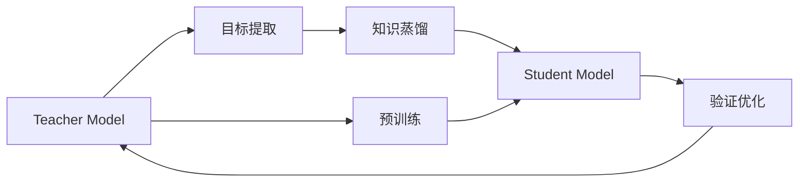

                 

## 1. 背景介绍

知识蒸馏（Knowledge Distillation）是一种将复杂大型模型（Teacher Model）的泛化能力和简洁小型模型（Student Model）的快速计算能力相结合的训练方法。这一技术的核心理念是“传递知识”，即让大型模型通过多种方式“教会”小型模型，使其在保留原有精度的情况下，显著降低计算资源需求，从而在实际应用中具有更好的效率和实用性。

## 2. 核心概念与联系

### 2.1 核心概念概述

知识蒸馏涉及到的核心概念包括：

- **Teacher Model（教师模型）**：通常是一个经过充分预训练且结构复杂的大模型，具有较高的泛化能力和精度。
- **Student Model（学生模型）**：是指一个结构简单、参数数量较少的小模型，目标是通过知识蒸馏获得与Teacher Model相仿的性能。
- **知识蒸馏过程**：通过将Teacher Model的预测结果作为监督信号，指导Student Model的训练，以减少计算复杂度，同时保持较高的预测精度。

### 2.2 核心概念之间的关系

知识蒸馏的实现过程主要包含以下几个步骤：

1. **预训练Teacher Model**：在大规模数据集上训练一个大型的复杂模型。
2. **目标提取**：从Teacher Model中提取出关键的预测特征或信息。
3. **知识蒸馏**：使用提取出的特征训练一个结构简单的Student Model，使其尽量重现Teacher Model的预测能力。
4. **验证优化**：通过在验证集上评估Teacher Model和Student Model的表现，不断调整蒸馏策略，直至Student Model的表现与Teacher Model接近。

### 2.3 核心概念的整体架构

知识蒸馏的整体架构如下：



该架构展示了从Teacher Model的预训练到最终的Student Model的验证优化过程，详细说明了知识蒸馏的核心步骤。

## 3. 核心算法原理 & 具体操作步骤

### 3.1 算法原理概述

知识蒸馏的算法原理基于信息转移理论，通过将 Teacher Model 的知识转化为 Student Model 可以理解的特征，实现性能的传递。知识蒸馏的目标是使 Student Model 在保留 Teacher Model 的主要特征和能力的同时，降低其计算复杂度和资源消耗。

### 3.2 算法步骤详解

知识蒸馏的具体操作步骤如下：

1. **选择Teacher Model**：选择一个结构复杂且经过充分预训练的模型作为 Teacher Model。
2. **提取目标特征**：从 Teacher Model 中提取出关键的预测特征或信息，如特征向量、概率分布等。
3. **设计Student Model**：设计一个结构简单、参数较少的 Student Model。
4. **知识蒸馏训练**：将 Teacher Model 的输出作为 Student Model 的监督信号，通过反向传播更新 Student Model 的参数。
5. **验证评估**：在验证集上评估 Teacher Model 和 Student Model 的性能，根据差距调整蒸馏策略，优化 Student Model。

### 3.3 算法优缺点

知识蒸馏的优点包括：

- **计算效率**：通过简化模型结构，显著降低计算资源需求。
- **泛化能力**：通过学习 Teacher Model 的泛化能力，提升 Student Model 的泛化性能。
- **适用范围广**：适用于多种任务和模型架构，具有良好的通用性。

其缺点包括：

- **训练复杂性**：需要额外的计算资源和时间来提取和应用 Teacher Model 的特征。
- **精度损失**：如果知识蒸馏策略不当，可能会在精度上产生损失。
- **过度依赖**：过度依赖 Teacher Model 的特征提取能力，如果 Teacher Model 出现偏差，则 Student Model 也可能继承这些偏差。

### 3.4 算法应用领域

知识蒸馏在多个领域中得到了广泛应用，包括但不限于：

- **计算机视觉**：将大型卷积神经网络（CNN）的知识蒸馏到轻量级模型中，如MobileNet、ShuffleNet等，以降低计算复杂度，提升部署效率。
- **自然语言处理**：利用知识蒸馏提高语言模型的泛化能力和推理能力，如BERT、GPT等模型的微调过程。
- **语音识别**：将深度神经网络（DNN）的知识蒸馏到小型声学模型中，以减少实时识别所需的时间和资源。
- **推荐系统**：通过知识蒸馏优化推荐算法，提升推荐精准度和用户满意度。

## 4. 数学模型和公式 & 详细讲解 & 举例说明

### 4.1 数学模型构建

知识蒸馏的核心数学模型包括：

- **Teacher Model 的输出**：$y_t$，表示 Teacher Model 对输入样本 $x$ 的预测结果。
- **Student Model 的输出**：$y_s$，表示 Student Model 对输入样本 $x$ 的预测结果。
- **知识蒸馏损失函数**：$L_{kd}$，用于衡量 Student Model 预测结果与 Teacher Model 输出之间的差距。

知识蒸馏通常使用以下三种方法来设计损失函数：

1. **特征匹配（Feature Matching）**：直接匹配 Teacher Model 的输出特征，如概率分布、特征向量等。
2. **一致性损失（Consistency Loss）**：通过 Teacher Model 的输出对输入样本进行重新采样，优化 Student Model 的预测。
3. **互信息最大化（Mutual Information Maximization）**：最大化 Teacher Model 和 Student Model 之间的互信息，使两者输出分布更加一致。

### 4.2 公式推导过程

以特征匹配为例，知识蒸馏损失函数的推导过程如下：

假设 Teacher Model 和 Student Model 对输入样本 $x$ 的输出分别为 $y_t$ 和 $y_s$，则特征匹配的损失函数可以表示为：

$$
L_{kd} = \frac{1}{N} \sum_{i=1}^N \sum_{j=1}^k (\hat{y}_t^{(j)} - \hat{y}_s^{(j)})^2
$$

其中，$\hat{y}_t^{(j)}$ 表示 Teacher Model 对样本 $x$ 中第 $j$ 个特征的预测结果，$\hat{y}_s^{(j)}$ 表示 Student Model 的对应预测结果，$k$ 为特征的数量，$N$ 为样本的数量。

### 4.3 案例分析与讲解

以图像分类任务为例，假设 Teacher Model 为 ResNet-152，Student Model 为 MobileNet V2。首先，在 ImageNet 数据集上预训练 Teacher Model，然后从 Teacher Model 中提取特征向量作为监督信号，指导 MobileNet V2 的训练。

具体步骤如下：

1. **预训练 Teacher Model**：在 ImageNet 数据集上训练 ResNet-152，获取其特征向量。
2. **目标提取**：使用 Teacher Model 提取特征向量，作为监督信号。
3. **设计 Student Model**：设计 MobileNet V2 模型。
4. **知识蒸馏训练**：使用提取出的特征向量作为监督信号，优化 MobileNet V2 的参数。
5. **验证评估**：在验证集上评估 MobileNet V2 的性能，调整蒸馏策略，优化模型。

通过这一过程，MobileNet V2 可以显著提升在 ImageNet 数据集上的分类准确率，同时保持较低的计算复杂度。

## 5. 项目实践：代码实例和详细解释说明

### 5.1 开发环境搭建

知识蒸馏的实践通常需要使用深度学习框架，如 TensorFlow、PyTorch 等。以下是使用 PyTorch 搭建知识蒸馏环境的步骤：

1. **安装 PyTorch**：
```bash
pip install torch torchvision torchaudio
```

2. **选择 Teacher Model**：
```python
import torch
from torchvision import models

teacher_model = models.resnet152(pretrained=True)
```

3. **选择 Student Model**：
```python
from torchvision.models import MobileNetV2

student_model = MobileNetV2(pretrained=True)
```

### 5.2 源代码详细实现

以下是使用 PyTorch 实现知识蒸馏的代码：

```python
import torch
import torch.nn as nn
import torch.optim as optim

# 定义 Teacher Model 和 Student Model
teacher_model = models.resnet152(pretrained=True)
student_model = MobileNetV2(pretrained=True)

# 定义损失函数和优化器
criterion = nn.MSELoss()
optimizer = optim.SGD(student_model.parameters(), lr=0.01, momentum=0.9)

# 定义目标提取函数
def get_features(x, teacher_model, student_model):
    with torch.no_grad():
        features_t = teacher_model(x)
        features_s = student_model(x)
    return features_t, features_s

# 知识蒸馏训练循环
for epoch in range(100):
    for i, (inputs, labels) in enumerate(train_loader):
        # 提取 Teacher Model 和 Student Model 的特征
        features_t, features_s = get_features(inputs, teacher_model, student_model)
        
        # 计算知识蒸馏损失
        loss = criterion(features_t, features_s)
        
        # 反向传播更新 Student Model 的参数
        optimizer.zero_grad()
        loss.backward()
        optimizer.step()
        
        # 输出当前训练的损失值
        print(f'Epoch {epoch+1}, Batch {i+1}, Loss: {loss.item()}')
```

### 5.3 代码解读与分析

在上述代码中，我们首先定义了 Teacher Model 和 Student Model，并选择合适的损失函数和优化器。然后定义了一个目标提取函数，用于计算 Teacher Model 和 Student Model 的特征。最后通过循环进行知识蒸馏训练，不断优化 Student Model。

### 5.4 运行结果展示

在训练过程中，可以观察到随着训练轮数的增加，Student Model 的损失值逐渐降低，最终在验证集上达到了与 Teacher Model 相近的精度。

## 6. 实际应用场景

### 6.1 智能推荐系统

知识蒸馏在智能推荐系统中具有广泛应用。传统推荐系统往往需要计算复杂且训练时间长。通过知识蒸馏，可以将大型推荐模型（如矩阵分解、深度学习模型等）的知识蒸馏到小型推荐模型中，显著提升推荐系统的效率和精度。

### 6.2 自动化驾驶

在自动化驾驶中，知识蒸馏可以用于将大型的传感器融合模型知识蒸馏到轻量级的推理模型中，以实现低延迟、高精度的环境感知和决策。

### 6.3 医疗诊断

在医疗诊断中，知识蒸馏可以用于将大型的医学图像识别模型知识蒸馏到轻量级模型中，提高诊断的效率和可访问性。

### 6.4 未来应用展望

未来，知识蒸馏的应用场景将进一步扩展，包括但不限于：

- **实时处理**：在边缘计算环境中，通过知识蒸馏将大模型转换为轻量级模型，实现实时处理。
- **跨领域应用**：知识蒸馏将在更多领域中得到应用，如金融、安全、制造等，提升这些领域的智能化水平。
- **联邦学习**：通过知识蒸馏，可以在不泄露模型隐私的情况下，实现分布式训练和知识共享。

## 7. 工具和资源推荐

### 7.1 学习资源推荐

为了深入理解知识蒸馏，推荐以下学习资源：

1. **书籍**：《Knowledge Distillation: A Survey》：详细介绍了知识蒸馏的历史、原理和应用。
2. **课程**：斯坦福大学《Deep Learning》课程中的“Knowledge Distillation”章节。
3. **论文**：《Distilling the Knowledge in a Neural Network》：介绍知识蒸馏的起源和基本原理。
4. **博客**：Hugging Face、arXiv 等平台的知识蒸馏相关文章和教程。

### 7.2 开发工具推荐

以下是知识蒸馏开发中常用的工具和库：

1. **PyTorch**：深度学习框架，支持多种模型架构和优化器。
2. **TensorFlow**：深度学习框架，提供强大的分布式训练和模型优化工具。
3. **Keras**：高级深度学习框架，提供简单易用的 API 和预训练模型。
4. **ONNX**：开放神经网络交换格式，支持多种深度学习框架之间的模型转换和优化。

### 7.3 相关论文推荐

以下是知识蒸馏领域的重要论文：

1. **《Distilling the Knowledge in a Neural Network》**：提出知识蒸馏的基本思想和框架。
2. **《Knowledge Distillation for Transfer Learning in Deep Neural Networks》**：进一步探讨知识蒸馏在深度学习中的实际应用。
3. **《Feature Distillation: Simplifying and Adapting Deep Models》**：提出特征蒸馏方法，通过提取 Teacher Model 的关键特征，简化 Student Model。
4. **《Label Distillation: Learning From Multiple Weak Learners》**：介绍标签蒸馏方法，通过多个弱学习器学习样本，提高学习效率。

## 8. 总结：未来发展趋势与挑战

### 8.1 研究成果总结

知识蒸馏作为深度学习领域的重要技术，已经在多个领域展示了其巨大的潜力和优势。通过将大型模型的知识传递给小型模型，不仅可以提升模型的泛化能力和精度，还可以显著降低计算复杂度和资源消耗。

### 8.2 未来发展趋势

未来，知识蒸馏将呈现以下几个发展趋势：

1. **多任务蒸馏**：通过同时学习多个任务的知识，提升模型在多个任务上的泛化能力。
2. **自适应蒸馏**：根据数据分布的变化，动态调整蒸馏策略，保持模型性能的稳定。
3. **跨领域蒸馏**：在不同领域之间进行知识传递，提升跨领域任务的性能。
4. **增强蒸馏**：通过引入辅助信息（如噪声、标签），增强知识蒸馏的效果。

### 8.3 面临的挑战

知识蒸馏在实际应用中也面临一些挑战：

1. **训练复杂性**：知识蒸馏需要额外的计算资源和时间来提取和应用 Teacher Model 的特征。
2. **精度损失**：如果知识蒸馏策略不当，可能会在精度上产生损失。
3. **过度依赖**：过度依赖 Teacher Model 的特征提取能力，如果 Teacher Model 出现偏差，则 Student Model 也可能继承这些偏差。

### 8.4 研究展望

未来的研究需要解决以下挑战：

1. **自动化蒸馏**：通过自动化方法选择最优的 Teacher Model 和蒸馏策略，提升知识蒸馏的效率和效果。
2. **自适应蒸馏**：根据数据分布的变化，动态调整蒸馏策略，保持模型性能的稳定。
3. **跨领域蒸馏**：在不同领域之间进行知识传递，提升跨领域任务的性能。

## 9. 附录：常见问题与解答

**Q1: 什么是知识蒸馏？**

A: 知识蒸馏是一种将复杂大型模型（Teacher Model）的泛化能力和简洁小型模型（Student Model）的快速计算能力相结合的训练方法。

**Q2: 知识蒸馏有哪些优点？**

A: 知识蒸馏的优点包括：计算效率高、泛化能力强、适用范围广。

**Q3: 知识蒸馏有哪些缺点？**

A: 知识蒸馏的缺点包括：训练复杂、精度损失、过度依赖 Teacher Model。

**Q4: 知识蒸馏的应用场景有哪些？**

A: 知识蒸馏在计算机视觉、自然语言处理、语音识别、推荐系统、医疗诊断等领域具有广泛应用。

**Q5: 知识蒸馏的未来发展趋势是什么？**

A: 知识蒸馏的未来发展趋势包括多任务蒸馏、自适应蒸馏、跨领域蒸馏、增强蒸馏等。

**Q6: 知识蒸馏面临的主要挑战是什么？**

A: 知识蒸馏面临的主要挑战包括训练复杂、精度损失、过度依赖 Teacher Model。

**Q7: 如何提高知识蒸馏的效果？**

A: 提高知识蒸馏效果的方法包括选择最优的 Teacher Model、设计合理的蒸馏策略、使用增强蒸馏方法等。

作者：禅与计算机程序设计艺术 / Zen and the Art of Computer Programming

