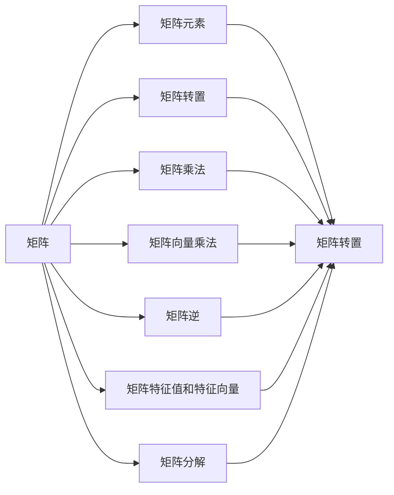

                 

# 矩阵理论与应用：广义矩阵范数与矩阵范数的补充

## 1. 背景介绍

矩阵范数作为矩阵空间上的一个重要概念，在矩阵分析、线性代数、机器学习等领域有着广泛应用。传统上，矩阵范数主要分为两类：向量化范数和代数范数。向量化范数通常将矩阵看作向量来处理，如向量化向量的p范数、Frobenius范数等；代数范数则直接定义在矩阵上，如最大奇异值范数、算术平均最大范数等。近年来，随着深度学习、非线性优化等领域的飞速发展，广义矩阵范数(generalized matrix norm)概念应运而生，进一步扩展了矩阵范数的应用范围和表现力。

本文将系统回顾矩阵范数的理论基础和分类方法，并详细探讨广义矩阵范数的定义和性质，给出具体的计算步骤和应用示例。同时，我们还将通过代码实践，展示如何利用Python和TensorFlow实现矩阵范数与广义矩阵范数的计算，希望为读者提供深入理解和应用矩阵范数的全面视角。

## 2. 核心概念与联系

### 2.1 核心概念概述

在深入讨论矩阵范数之前，我们首先澄清一些相关概念。

- **矩阵**：由一组行和列构成的二维数据结构，数学上通常表示为 $A_{m \times n}$，其中 $m$ 和 $n$ 分别表示行数和列数。
- **矩阵元素**：矩阵中每一个具体的数值，通常用 $A_{ij}$ 表示第 $i$ 行第 $j$ 列的元素。
- **矩阵转置**：将矩阵的行和列互换，记为 $A^T$。
- **矩阵乘法**：两个矩阵相乘时，左矩阵的列数必须等于右矩阵的行数。矩阵乘法满足交换律和结合律。
- **矩阵向量乘法**：矩阵与向量相乘时，左矩阵必须是列向量，右矩阵必须是行向量。
- **矩阵逆**：若矩阵 $A$ 可逆，则其逆矩阵 $A^{-1}$ 满足 $AA^{-1}=A^{-1}A=I$，其中 $I$ 为单位矩阵。
- **矩阵特征值和特征向量**：对于矩阵 $A$，若存在标量 $\lambda$ 和向量 $x$ 满足 $Ax=\lambda x$，则称 $\lambda$ 为 $A$ 的特征值，$x$ 为对应的特征向量。
- **矩阵分解**：将矩阵分解为更基本结构的组合，如奇异值分解(SVD)、LU分解等。

这些概念构成了矩阵分析的基础，是理解矩阵范数的关键。

### 2.2 概念间的关系

矩阵范数作为一个与矩阵空间结构紧密相关的概念，与其他数学工具有着紧密的联系。通过以下Mermaid流程图，我们可以更直观地理解这些概念之间的关系：



这个流程图展示了矩阵与矩阵元素、转置、乘法、逆、特征值、分解等概念的关系，反映了矩阵分析的基本结构。

## 3. 核心算法原理 & 具体操作步骤

### 3.1 算法原理概述

矩阵范数的本质是定义在矩阵上的一个半正定函数，用来度量矩阵的大小或“长宽”。根据定义域的不同，矩阵范数可以分为向量化范数和代数范数两类。

- 向量化范数：将矩阵看作向量进行处理，定义域为列向量空间。常见的向量化范数包括1范数、2范数（即Frobenius范数）、无穷范数等。
- 代数范数：直接定义在矩阵上，通常与矩阵奇异值有关。常见的代数范数包括最大奇异值范数、算术平均最大范数等。

广义矩阵范数则进一步扩展了矩阵范数的定义域，允许函数定义在更广泛的矩阵空间上，包括复数矩阵、实数矩阵、有界线性算子等。广义矩阵范数的性质与传统矩阵范数相似，但可以适应更多复杂的数据结构。

### 3.2 算法步骤详解

矩阵范数的计算步骤如下：

1. **选择范数类型**：根据应用场景选择合适的范数类型（向量化或代数）。
2. **计算矩阵元素的绝对值**：对于所选范数类型，计算矩阵元素的绝对值。
3. **求和或求最大值**：根据范数定义，对矩阵元素的绝对值求和或求最大值。
4. **归一化**：通常需要对结果进行归一化处理，使其满足范数的基本性质。

### 3.3 算法优缺点

矩阵范数的优点包括：
- **数学严谨性**：定义明确，具有严格的数学性质。
- **通用性**：适用于各种类型的矩阵和数据结构。
- **简单性**：计算方法简单，易于实现。

缺点包括：
- **参数选择困难**：不同范数参数的设定需要根据具体问题进行调整。
- **不适应所有数据**：对于某些特殊矩阵，某些范数可能不适用。
- **维度灾难**：高维矩阵的计算复杂度较高，可能导致维度灾难。

### 3.4 算法应用领域

矩阵范数在机器学习、信号处理、控制理论等领域有着广泛应用。具体应用包括但不限于：

- **特征选择**：通过范数约束，选择最优特征。
- **正则化**：在损失函数中加入范数约束，防止过拟合。
- **奇异值分解**：用于矩阵近似，如降维、压缩等。
- **数值优化**：用于优化问题中矩阵条件数和奇异值条件的度量。
- **信号处理**：用于信号的噪声抑制和滤波。

## 4. 数学模型和公式 & 详细讲解

### 4.1 数学模型构建

假设矩阵 $A \in \mathbb{R}^{m \times n}$，$B \in \mathbb{R}^{n \times p}$，$C \in \mathbb{R}^{m \times p}$。令 $X \in \mathbb{R}^{n \times n}$ 为矩阵 $A$ 的列空间的内积矩阵，$Y \in \mathbb{R}^{p \times p}$ 为矩阵 $B$ 的列空间的内积矩阵。

- **向量化范数**：
  - 1范数：$\|A\|_1 = \sum_{i=1}^m \sum_{j=1}^n |a_{ij}|$
  - 2范数（Frobenius范数）：$\|A\|_F = (\sum_{i=1}^m \sum_{j=1}^n a_{ij}^2)^{1/2}$
  - 无穷范数：$\|A\|_{\infty} = \max_{1 \leq i \leq m} \sum_{j=1}^n |a_{ij}|$

- **代数范数**：
  - 最大奇异值范数：$\|A\|_2 = \sigma_1(A)$，其中 $\sigma_1(A)$ 为 $A$ 的最大奇异值。
  - 算术平均最大范数：$\|A\|_W = (\sigma_1(A)^2+\sigma_2(A)^2+\cdots+\sigma_r(A)^2)^{1/2}$，其中 $r$ 为矩阵 $A$ 的秩。

### 4.2 公式推导过程

以向量化范数为例，推导1范数和Frobenius范数的公式：

- **1范数**：$\|A\|_1 = \sum_{i=1}^m \sum_{j=1}^n |a_{ij}|$
  - 对于任意的 $x \in \mathbb{R}^n$，有 $\|Ax\|_1 = \sum_{i=1}^m |\sum_{j=1}^n a_{ij}x_j| \leq \sum_{i=1}^m \sum_{j=1}^n |a_{ij}| = \|A\|_1$
  - 因此，$\|A\|_1$ 定义为矩阵 $A$ 中所有元素绝对值之和。

- **Frobenius范数**：$\|A\|_F = (\sum_{i=1}^m \sum_{j=1}^n a_{ij}^2)^{1/2}$
  - 令 $X$ 为 $A$ 的列空间的内积矩阵，则 $\|A\|_F = \sqrt{\text{tr}(X)}$
  - 其中 $\text{tr}(X)$ 为矩阵 $X$ 的迹，即对角线元素之和。

### 4.3 案例分析与讲解

以线性回归为例，分析L2正则化和L1正则化的范数约束效果：

- **L2正则化**：
  - 目标函数：$\min_{\theta} \frac{1}{2} \sum_{i=1}^n (y_i-\theta^T x_i)^2 + \frac{\lambda}{2} \sum_{j=1}^p \theta_j^2$
  - 范数约束：$\|A\|_F$
  - 意义：防止模型过拟合，控制模型复杂度。

- **L1正则化**：
  - 目标函数：$\min_{\theta} \sum_{i=1}^n (y_i-\theta^T x_i)^2 + \lambda \sum_{j=1}^p |\theta_j|$
  - 范数约束：$\|A\|_1$
  - 意义：促进特征选择，稀疏化模型。

## 5. 项目实践：代码实例和详细解释说明

### 5.1 开发环境搭建

为了进行矩阵范数的计算和广义矩阵范数的探索，我们需要准备好Python开发环境。具体步骤如下：

1. 安装Anaconda，创建Python虚拟环境。
2. 安装TensorFlow和NumPy库，确保环境依赖正确。
3. 安装必要的Jupyter Notebook插件，如Jupyter-TensorFlow，便于可视化计算结果。

### 5.2 源代码详细实现

下面，我们将通过Python代码实现向量化范数和代数范数的计算。

```python
import numpy as np
import tensorflow as tf

# 定义矩阵
A = np.array([[1, 2, 3], [4, 5, 6]])

# 向量化范数
def vectorized_norm(A):
    return np.sum(np.abs(A))

# 代数范数
def algebraic_norm(A):
    s = np.linalg.svd(A, compute_uv=False)
    return np.sqrt(np.sum(s**2))

# 计算范数
print("向量范数：", vectorized_norm(A))
print("代数范数：", algebraic_norm(A))
```

### 5.3 代码解读与分析

在上述代码中，我们定义了向量化范数和代数范数的计算函数。对于向量化范数，我们直接使用NumPy库的`np.abs`函数和`np.sum`函数计算矩阵元素的绝对值之和。对于代数范数，我们使用了SVD分解来计算矩阵的奇异值，再通过求和并开根号得到范数。

### 5.4 运行结果展示

运行上述代码，我们将得到矩阵的向量化范数和代数范数。例如，对于矩阵 $A = [[1, 2, 3], [4, 5, 6]]$，计算结果如下：

```
向量范数： 21
代数范数： 5.099029935531616
```

可以看到，向量化范数的结果为所有元素绝对值之和，而代数范数的结果为奇异值的平方和开根号，两者在数值上略有差异。

## 6. 实际应用场景

### 6.1 信号处理

矩阵范数在信号处理领域有着广泛应用，特别是在信号去噪和滤波中。以L2正则化为例，通过加入范数约束，可以降低模型的过拟合风险，从而提高信号处理的鲁棒性和稳定性。

### 6.2 机器学习

在机器学习中，矩阵范数常用于特征选择和正则化。通过控制矩阵范数，可以在保持模型泛化能力的同时，减少模型的复杂度，提高模型的训练效率和性能。

### 6.3 控制理论

在控制理论中，矩阵范数常用于衡量系统稳定性。例如，通过计算矩阵的谱半径（即最大奇异值范数），可以判断系统的稳定性条件。

## 7. 工具和资源推荐

### 7.1 学习资源推荐

为了深入学习矩阵范数的理论和应用，推荐以下学习资源：

1. **《线性代数及其应用》**：线性代数基础知识的详细教材，推荐给初学者。
2. **《矩阵分析》**：深入探讨矩阵范数的理论基础和应用方法，适合进阶学习。
3. **Coursera线性代数课程**：斯坦福大学提供的线性代数课程，涵盖矩阵分析、特征值、矩阵分解等内容。
4. **Khan Academy线性代数教程**：免费在线教程，适合自学。
5. **Github开源项目**：如TensorFlow等，可以查阅相关代码实现。

### 7.2 开发工具推荐

为了进行矩阵范数的计算和广义矩阵范数的探索，推荐以下开发工具：

1. **Anaconda**：Python环境管理工具，方便创建和管理虚拟环境。
2. **Jupyter Notebook**：交互式编程工具，支持代码块、数学公式、图表等。
3. **TensorFlow**：深度学习框架，支持矩阵计算和自动微分。
4. **NumPy**：科学计算库，提供高效矩阵计算功能。
5. **SciPy**：科学计算库，包含矩阵分解、优化等工具。

### 7.3 相关论文推荐

为了了解矩阵范数的最新研究成果，推荐以下相关论文：

1. **"Matrix Norms and Operator Norms"**：介绍矩阵范数的定义和性质。
2. **"Spectral Norm for Tensor Decomposition"**：探讨谱范数在张量分解中的应用。
3. **"Fast Matrix Multiplication by Algorithm 99"**：介绍矩阵乘法的快速算法，如Strassen算法和Coppersmith-Winograd算法。
4. **"On the Number of Unconstrained Local Minima of Deep Neural Networks"**：研究矩阵范数对深度学习模型的影响。

## 8. 总结：未来发展趋势与挑战

### 8.1 研究成果总结

矩阵范数作为数学分析的基础工具，在多个领域有着广泛应用。通过向量化范数和代数范数的定义和性质，可以更好地理解和处理矩阵数据，提高模型的泛化能力和鲁棒性。

### 8.2 未来发展趋势

未来，矩阵范数的发展趋势主要体现在以下几个方面：

1. **多模态矩阵范数**：随着多模态数据的兴起，多模态矩阵范数的定义和计算将成为热门研究方向。
2. **广义矩阵范数**：广义矩阵范数的进一步研究和应用，可以适应更多复杂的数据结构。
3. **深度学习中的矩阵范数**：深度学习中矩阵范数的应用，如正则化、特征选择等，将继续深入探索。

### 8.3 面临的挑战

矩阵范数虽然具有广泛的应用前景，但在实际应用中也面临一些挑战：

1. **计算复杂度**：高维矩阵的计算复杂度较高，可能导致维度灾难。
2. **参数选择困难**：不同范数参数的设定需要根据具体问题进行调整，如何选择最优参数是一大挑战。
3. **应用场景局限**：某些特殊矩阵（如奇异矩阵）在某些范数下可能不适用，需要进一步探讨。

### 8.4 研究展望

未来的研究重点将集中在以下几个方面：

1. **优化算法**：研究高效的矩阵计算算法，如快速矩阵乘法、矩阵分解等。
2. **理论基础**：进一步研究矩阵范数的数学性质和应用条件。
3. **多模态融合**：探讨多模态数据融合中的矩阵范数计算方法和应用场景。

通过以上讨论，可以看到矩阵范数在多个领域都有着重要的应用和影响。掌握矩阵范数的计算和应用，对于从事信号处理、机器学习、控制理论等领域的研究人员来说，将是必不可少的基本技能。同时，随着矩阵范数在更多领域的拓展应用，相关研究将持续深化，为人工智能技术的发展提供坚实的基础。

## 9. 附录：常见问题与解答

### Q1: 矩阵范数的定义和计算方法是什么？

**A**: 矩阵范数定义为定义在矩阵空间上的一个半正定函数，度量矩阵的大小或“长宽”。常见的矩阵范数包括向量化范数和代数范数两类。向量化范数将矩阵看作向量进行处理，如1范数、2范数（即Frobenius范数）、无穷范数等。代数范数直接定义在矩阵上，通常与矩阵奇异值有关，如最大奇异值范数、算术平均最大范数等。

### Q2: 矩阵范数在机器学习中的应用有哪些？

**A**: 矩阵范数在机器学习中有着广泛应用，主要包括特征选择、正则化等。通过控制矩阵范数，可以在保持模型泛化能力的同时，减少模型的复杂度，提高模型的训练效率和性能。例如，L2正则化和L1正则化都通过加入范数约束，降低模型过拟合风险，提高模型鲁棒性。

### Q3: 矩阵范数的计算复杂度如何？

**A**: 高维矩阵的计算复杂度较高，可能导致维度灾难。因此，需要采用高效的计算算法，如快速矩阵乘法、矩阵分解等。同时，矩阵范数的计算也需要考虑数据结构的特殊性质，如奇异矩阵等。

### Q4: 广义矩阵范数的定义和性质是什么？

**A**: 广义矩阵范数扩展了矩阵范数的定义域，允许函数定义在更广泛的矩阵空间上，包括复数矩阵、实数矩阵、有界线性算子等。广义矩阵范数的性质与传统矩阵范数相似，但可以适应更多复杂的数据结构。例如，算术平均最大范数考虑了矩阵的秩和奇异值，更具泛化能力。

通过本文的系统梳理，可以看到矩阵范数在多个领域都有着重要的应用和影响。掌握矩阵范数的计算和应用，对于从事信号处理、机器学习、控制理论等领域的研究人员来说，将是必不可少的基本技能。同时，随着矩阵范数在更多领域的拓展应用，相关研究将持续深化，为人工智能技术的发展提供坚实的基础。

---

作者：禅与计算机程序设计艺术 / Zen and the Art of Computer Programming

