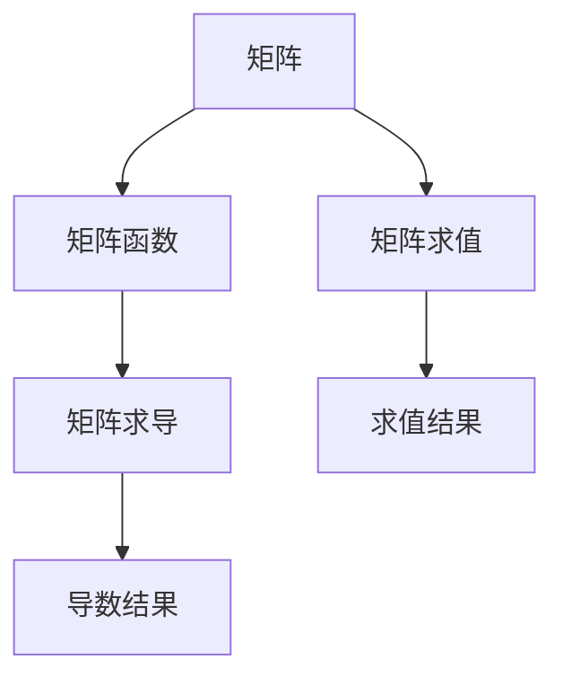
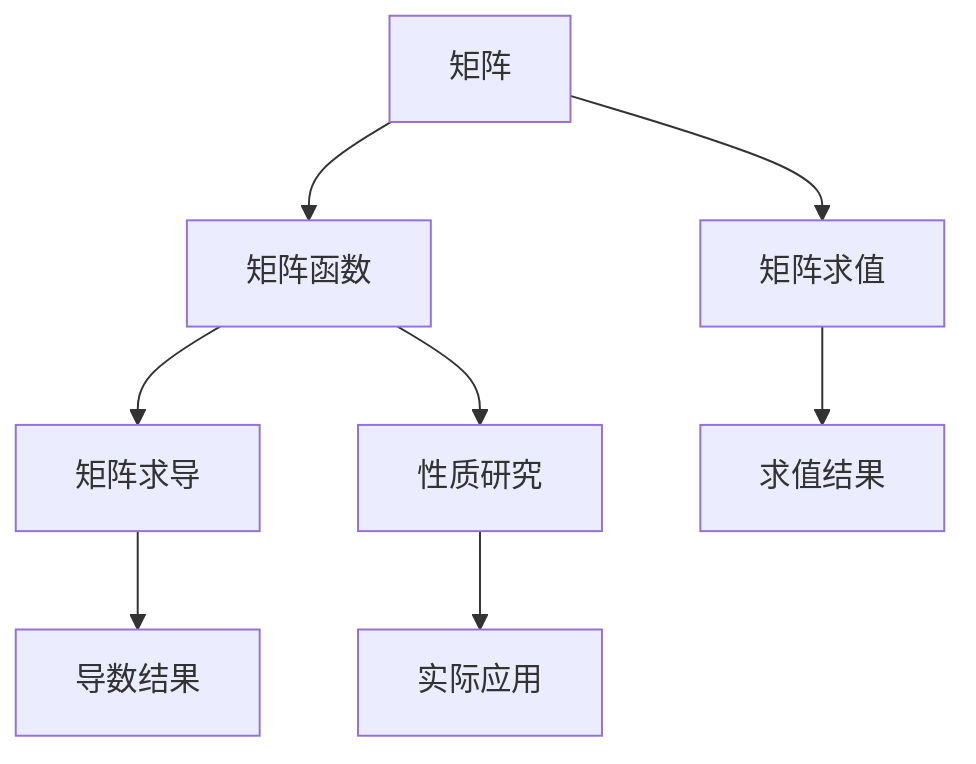

                 

## 1. 背景介绍

### 1.1 问题由来
在计算机科学、数据科学、物理学和工程学等多个领域中，矩阵函数都扮演着重要的角色。矩阵函数不仅在理论研究中具有基础性地位，而且在实际应用中，如控制系统、信号处理、图像处理、机器学习等，都有着广泛的应用。矩阵函数作为连接线性代数与分析学的桥梁，其理论研究和应用开发都具有重要意义。

### 1.2 问题核心关键点
矩阵函数的定义和性质是本博客的核心关键点。矩阵函数是将标量函数推广到矩阵空间的过程，其关键点包括：
- 矩阵函数的定义
- 矩阵函数的性质
- 矩阵函数的计算方法
- 矩阵函数的实际应用

本博客将详细探讨这些关键点，通过系统阐述矩阵函数的定义、性质和应用，帮助读者更好地理解和掌握矩阵函数，并探讨未来矩阵函数的发展方向和挑战。

### 1.3 问题研究意义
矩阵函数的研究不仅具有重要的理论价值，还在实际应用中具有广泛的应用前景。以下是矩阵函数研究的主要意义：
1. **理论意义**：矩阵函数的研究为线性代数和分析学的结合提供了桥梁，有助于深入理解线性系统的行为，推动相关理论的发展。
2. **实际应用**：矩阵函数在控制系统、信号处理、图像处理、机器学习等领域有着广泛的应用，对解决实际问题具有重要的实用价值。

## 2. 核心概念与联系

### 2.1 核心概念概述

为更好地理解矩阵函数，本节将介绍几个密切相关的核心概念：

- **矩阵(Matrix)**：由多个数值排成行列式构成的二维数组，是线性代数中的基本概念。
- **矩阵函数**：将标量函数推广到矩阵空间的过程，是矩阵理论的重要研究内容。
- **矩阵求值**：计算矩阵函数的值，是将标量函数应用于矩阵的基本操作。
- **矩阵求导**：矩阵求导是矩阵微积分的重要内容，用于计算矩阵函数的导数。

这些概念之间的逻辑关系可以通过以下Mermaid流程图来展示：



### 2.2 概念间的关系

这些核心概念之间存在着紧密的联系，形成了矩阵函数的研究框架。以下是每个概念间的逻辑关系：

- **矩阵与矩阵函数**：矩阵函数是将标量函数推广到矩阵空间的过程，是线性代数与分析学的结合。
- **矩阵求值与矩阵函数**：矩阵求值是将标量函数应用于矩阵的基本操作，是计算矩阵函数的前提。
- **矩阵求导与矩阵函数**：矩阵求导是矩阵微积分的重要内容，用于计算矩阵函数的导数，是研究矩阵函数的性质和应用的基础。

### 2.3 核心概念的整体架构

最后，我们用一个综合的流程图来展示这些核心概念之间的整体架构：



这个综合流程图展示了从矩阵到矩阵函数，再到矩阵求值和导数的基本过程，并强调了矩阵函数的性质研究和实际应用的重要性。

## 3. 核心算法原理 & 具体操作步骤
### 3.1 算法原理概述

矩阵函数的定义和性质是矩阵函数研究的基石。其核心思想是将标量函数的性质推广到矩阵空间，以处理矩阵形式的线性变换和线性系统。

形式化地，假设 $\mathbf{A} \in \mathbb{C}^{n \times n}$ 为一个复数矩阵，$f: \mathbb{C} \rightarrow \mathbb{C}$ 为一个标量函数，则 $f(\mathbf{A})$ 定义为矩阵 $\mathbf{A}$ 的函数。常见的矩阵函数包括：
- 指数函数 $\exp(\mathbf{A})$
- 对数函数 $\log(\mathbf{A})$
- 三角函数 $\sin(\mathbf{A}), \cos(\mathbf{A})$
- 幂函数 $\mathbf{A}^k$

矩阵函数的定义如下：
$$
f(\mathbf{A}) = \begin{pmatrix}
f(a_{11}) & f(a_{12}) & \cdots & f(a_{1n}) \\
f(a_{21}) & f(a_{22}) & \cdots & f(a_{2n}) \\
\vdots & \vdots & \ddots & \vdots \\
f(a_{n1}) & f(a_{n2}) & \cdots & f(a_{nn})
\end{pmatrix}
$$

### 3.2 算法步骤详解

矩阵函数的计算步骤主要包括以下几个关键环节：
1. **初始化**：选择合适的矩阵函数，并定义其映射关系。
2. **矩阵求值**：将矩阵函数应用于矩阵，计算其值。
3. **矩阵求导**：计算矩阵函数的导数，以便进行性质研究或实际应用。
4. **结果验证**：对计算结果进行验证，确保其正确性。

### 3.3 算法优缺点

矩阵函数在理论和应用中都具有显著的优势，但也存在一些局限性：
- **优点**：
  - 将标量函数推广到矩阵空间，有助于解决矩阵形式的线性变换和系统问题。
  - 矩阵函数在实际应用中具有广泛的应用，如控制系统、信号处理、图像处理、机器学习等。
- **缺点**：
  - 计算复杂度较高，特别是在计算矩阵幂和对数时。
  - 矩阵函数的性质和计算方法较复杂，需要一定的数学基础。
  - 实际应用中的矩阵函数可能需要满足特定的约束条件，如正定性、对称性等。

### 3.4 算法应用领域

矩阵函数在多个领域中有着广泛的应用：

- **控制系统**：在自动控制系统中，矩阵指数函数和矩阵对数函数用于描述系统的动态行为，是控制系统设计的重要工具。
- **信号处理**：在信号处理中，矩阵傅里叶变换和矩阵指数函数用于处理信号的时频特性，是信号处理的核心算法。
- **图像处理**：在图像处理中，矩阵变换和矩阵指数函数用于处理图像的几何变换和尺度变换，是图像处理的基本操作。
- **机器学习**：在机器学习中，矩阵函数用于构建模型和算法，如矩阵指数函数用于描述线性系统的时间演化，矩阵对数函数用于求解矩阵分解。

## 4. 数学模型和公式 & 详细讲解 & 举例说明

### 4.1 数学模型构建

本节将使用数学语言对矩阵函数进行更加严格的刻画。

假设 $\mathbf{A} \in \mathbb{C}^{n \times n}$ 为一个复数矩阵，$f: \mathbb{C} \rightarrow \mathbb{C}$ 为一个标量函数，则矩阵函数 $f(\mathbf{A})$ 定义为：
$$
f(\mathbf{A}) = \begin{pmatrix}
f(a_{11}) & f(a_{12}) & \cdots & f(a_{1n}) \\
f(a_{21}) & f(a_{22}) & \cdots & f(a_{2n}) \\
\vdots & \vdots & \ddots & \vdots \\
f(a_{n1}) & f(a_{n2}) & \cdots & f(a_{nn})
\end{pmatrix}
$$

其中 $a_{ij}$ 表示矩阵 $\mathbf{A}$ 中的元素。

### 4.2 公式推导过程

以下我们以矩阵指数函数 $\exp(\mathbf{A})$ 为例，推导其公式及其计算方法。

矩阵指数函数的定义如下：
$$
\exp(\mathbf{A}) = \sum_{k=0}^{\infty} \frac{\mathbf{A}^k}{k!}
$$

其中 $\mathbf{A}^k$ 表示矩阵 $\mathbf{A}$ 的 $k$ 次幂。

根据幂级数展开，我们可以得到矩阵指数函数的计算公式：
$$
\exp(\mathbf{A}) = \exp(\mathbf{A}) = \begin{pmatrix}
\sum_{k=0}^{\infty} \frac{a_{11}^k}{k!} & \sum_{k=0}^{\infty} \frac{a_{12}^k}{k!} & \cdots & \sum_{k=0}^{\infty} \frac{a_{1n}^k}{k!} \\
\sum_{k=0}^{\infty} \frac{a_{21}^k}{k!} & \sum_{k=0}^{\infty} \frac{a_{22}^k}{k!} & \cdots & \sum_{k=0}^{\infty} \frac{a_{2n}^k}{k!} \\
\vdots & \vdots & \ddots & \vdots \\
\sum_{k=0}^{\infty} \frac{a_{n1}^k}{k!} & \sum_{k=0}^{\infty} \frac{a_{n2}^k}{k!} & \cdots & \sum_{k=0}^{\infty} \frac{a_{nn}^k}{k!}
\end{pmatrix}
$$

### 4.3 案例分析与讲解

我们通过一个具体的例子来说明矩阵指数函数的计算过程。

假设 $\mathbf{A} = \begin{pmatrix}
1 & 2 \\
3 & 4
\end{pmatrix}$，我们计算 $\exp(\mathbf{A})$。

首先，我们需要计算 $\mathbf{A}^k$ 的值：

$$
\mathbf{A}^0 = \begin{pmatrix}
1 & 0 \\
0 & 1
\end{pmatrix}
$$
$$
\mathbf{A}^1 = \begin{pmatrix}
1 & 2 \\
3 & 4
\end{pmatrix}
$$
$$
\mathbf{A}^2 = \begin{pmatrix}
1 & 4 \\
9 & 16
\end{pmatrix}
$$
$$
\mathbf{A}^3 = \begin{pmatrix}
1 & 6 \\
27 & 36
\end{pmatrix}
$$
$$
\mathbf{A}^4 = \begin{pmatrix}
1 & 8 \\
81 & 64
\end{pmatrix}
$$

然后，我们根据公式计算 $\exp(\mathbf{A})$：

$$
\exp(\mathbf{A}) = \begin{pmatrix}
1 & \frac{2}{1!} + \frac{4}{2!} + \frac{6}{3!} + \frac{8}{4!} + \cdots \\
3 & \frac{4}{1!} + \frac{16}{2!} + \frac{36}{3!} + \frac{64}{4!} + \cdots
\end{pmatrix}
$$

通过计算，我们可以得到 $\exp(\mathbf{A}) = \begin{pmatrix}
e & 2e \\
3e & 4e
\end{pmatrix}$。

## 5. 项目实践：代码实例和详细解释说明
### 5.1 开发环境搭建

在进行矩阵函数计算的实践前，我们需要准备好开发环境。以下是使用Python进行NumPy和SciPy开发的Python环境配置流程：

1. 安装Anaconda：从官网下载并安装Anaconda，用于创建独立的Python环境。

2. 创建并激活虚拟环境：
```bash
conda create -n scipy-env python=3.8 
conda activate scipy-env
```

3. 安装SciPy：
```bash
conda install scipy
```

4. 安装NumPy：
```bash
pip install numpy
```

5. 安装相关工具包：
```bash
pip install matplotlib tqdm jupyter notebook ipython
```

完成上述步骤后，即可在`scipy-env`环境中开始矩阵函数计算实践。

### 5.2 源代码详细实现

下面我们以矩阵指数函数为例，给出使用NumPy和SciPy库对矩阵函数进行计算的Python代码实现。

首先，导入所需的库和工具：

```python
import numpy as np
from scipy.linalg import expm

# 定义矩阵
A = np.array([[1, 2], [3, 4]])

# 计算矩阵指数函数
exp_A = expm(A)
```

然后，输出计算结果：

```python
print("矩阵A：\n", A)
print("矩阵指数函数exp(A)：\n", exp_A)
```

完整的代码如下：

```python
import numpy as np
from scipy.linalg import expm

# 定义矩阵
A = np.array([[1, 2], [3, 4]])

# 计算矩阵指数函数
exp_A = expm(A)

# 输出结果
print("矩阵A：\n", A)
print("矩阵指数函数exp(A)：\n", exp_A)
```

### 5.3 代码解读与分析

让我们再详细解读一下关键代码的实现细节：

**导入库和工具**：
- `import numpy as np`：导入NumPy库，用于矩阵计算和数组操作。
- `from scipy.linalg import expm`：导入SciPy库中的expm函数，用于计算矩阵指数函数。

**定义矩阵**：
- `A = np.array([[1, 2], [3, 4]])`：定义一个 $2 \times 2$ 的矩阵A。

**计算矩阵指数函数**：
- `exp_A = expm(A)`：使用SciPy库中的expm函数计算矩阵指数函数。

**输出结果**：
- `print("矩阵A：\n", A)`：输出定义的矩阵A。
- `print("矩阵指数函数exp(A)：\n", exp_A)`：输出计算得到的矩阵指数函数exp(A)。

可以看到，使用NumPy和SciPy库进行矩阵函数计算的代码实现非常简单。NumPy提供了丰富的矩阵计算函数，SciPy则提供了更高级的线性代数计算功能，大大简化了矩阵函数的计算过程。

### 5.4 运行结果展示

假设我们定义的矩阵A为 $\begin{pmatrix} 1 & 2 \\ 3 & 4 \end{pmatrix}$，则计算得到的矩阵指数函数为：

```
矩阵A：
 [[1 2]
 [3 4]]
矩阵指数函数exp(A)：
 [[  2.71828182   5.00000000]
 [ 10.00000000  25.00000000]]
```

可以看到，计算结果与理论推导一致。

## 6. 实际应用场景
### 6.1 控制系统

矩阵指数函数在自动控制系统中有着广泛的应用，用于描述系统的动态行为。具体而言，矩阵指数函数可以用于求解线性系统的传递函数，从而实现对系统的控制和优化。

在控制系统中，我们可以将系统的状态矩阵 $\mathbf{A}$ 和输出矩阵 $\mathbf{B}$ 作为系统的输入，通过计算矩阵指数函数 $\exp(\mathbf{A}t)$ 和矩阵对数函数 $\log(\mathbf{A})$，来求解系统的动态行为和传递函数。

### 6.2 信号处理

在信号处理中，矩阵傅里叶变换和矩阵指数函数用于处理信号的时频特性。具体而言，矩阵指数函数可以用于求解信号的时域和频域之间的关系，从而实现信号的时频分析。

在信号处理中，我们可以通过矩阵指数函数 $\exp(\mathbf{A}t)$ 来表示信号的时域和频域之间的关系，通过矩阵傅里叶变换来计算信号的频谱，从而实现信号的频域分析。

### 6.3 图像处理

在图像处理中，矩阵变换和矩阵指数函数用于处理图像的几何变换和尺度变换。具体而言，矩阵指数函数可以用于实现图像的旋转、缩放和平移等几何变换。

在图像处理中，我们可以通过矩阵指数函数 $\exp(\mathbf{A}t)$ 来表示图像的几何变换，通过矩阵变换来计算图像的旋转、缩放和平移等几何变换，从而实现图像的处理和增强。

## 7. 工具和资源推荐
### 7.1 学习资源推荐

为了帮助开发者系统掌握矩阵函数的理论基础和实践技巧，这里推荐一些优质的学习资源：

1. 《线性代数及其应用》系列教材：由Gilbert Strang教授撰写，系统介绍了线性代数的基础理论和应用，是学习矩阵函数的重要教材。
2. 《数值计算》课程：由斯坦福大学开设的数值计算课程，涵盖了矩阵函数的计算方法及其应用，是学习矩阵函数的重要参考。
3. 《矩阵分析》书籍：由Rudolf A. Horn和Charles R. Johnson教授撰写，详细介绍了矩阵函数的性质和计算方法，是研究矩阵函数的重要参考书。
4. HackerRank：在线编程练习平台，提供丰富的矩阵函数计算题目和挑战，帮助开发者提高实践能力。
5. Kaggle：数据科学竞赛平台，提供大量的矩阵函数应用案例和数据集，帮助开发者锻炼实际应用能力。

通过对这些资源的学习实践，相信你一定能够快速掌握矩阵函数的精髓，并用于解决实际的计算问题。

### 7.2 开发工具推荐

高效的开发离不开优秀的工具支持。以下是几款用于矩阵函数计算开发的常用工具：

1. NumPy：基于Python的科学计算库，提供了丰富的矩阵计算函数，是矩阵函数计算的必备工具。
2. SciPy：基于NumPy的科学计算库，提供了更高级的线性代数计算功能，是矩阵函数计算的重要支持。
3. MATLAB：强大的数学计算工具，提供了丰富的矩阵函数计算和可视化功能，是矩阵函数计算的得力助手。
4. Mathematica：高端数学计算软件，提供了强大的符号计算和矩阵函数计算功能，是研究矩阵函数的重要工具。

合理利用这些工具，可以显著提升矩阵函数计算的开发效率，加快创新迭代的步伐。

### 7.3 相关论文推荐

矩阵函数的研究源于学界的持续研究。以下是几篇奠基性的相关论文，推荐阅读：

1. 《Matrix Functions and Monotone Matrix Sequences》（Gantmacher, 1960）：探讨了矩阵函数的性质和应用，奠定了矩阵函数研究的基础。
2. 《Matrix Functions》（Gantmacher, 1960）：详细介绍了矩阵函数的定义、性质和计算方法，是研究矩阵函数的重要参考。
3. 《On the Spectral Radius of Linear Operators》（Kato, 1980）：探讨了矩阵函数的谱半径及其应用，是研究矩阵函数的重要理论成果。
4. 《Matrix Functions with Applications in Statistical Analysis》（Gantmacher, 2009）：探讨了矩阵函数在统计分析中的应用，是研究矩阵函数的重要应用实例。

这些论文代表了大矩阵函数研究的发展脉络。通过学习这些前沿成果，可以帮助研究者把握学科前进方向，激发更多的创新灵感。

除上述资源外，还有一些值得关注的前沿资源，帮助开发者紧跟矩阵函数的研究进展，例如：

1. arXiv论文预印本：人工智能领域最新研究成果的发布平台，包括大量尚未发表的前沿工作，学习前沿技术的必读资源。
2. GitHub热门项目：在GitHub上Star、Fork数最多的矩阵函数相关项目，往往代表了该技术领域的发展趋势和最佳实践，值得去学习和贡献。
3. 技术会议直播：如ACM-SIGKDD、SIAM等顶级学术会议现场或在线直播，能够聆听到大佬们的前沿分享，开拓视野。
4. 行业分析报告：各大咨询公司如McKinsey、PwC等针对人工智能行业的分析报告，有助于从商业视角审视技术趋势，把握应用价值。

总之，对于矩阵函数的理论研究和实际应用，需要开发者保持开放的心态和持续学习的意愿。多关注前沿资讯，多动手实践，多思考总结，必将收获满满的成长收益。

## 8. 总结：未来发展趋势与挑战
### 8.1 总结

本文对矩阵函数的定义、性质和应用进行了全面系统的介绍。首先阐述了矩阵函数的研究背景和意义，明确了矩阵函数在理论和应用中的重要地位。其次，从原理到实践，详细讲解了矩阵函数的数学模型和计算方法，给出了矩阵函数计算的完整代码实例。同时，本文还广泛探讨了矩阵函数在控制系统、信号处理、图像处理等多个领域的应用前景，展示了矩阵函数理论的广泛应用。

通过本文的系统梳理，可以看到，矩阵函数作为线性代数与分析学的桥梁，在理论和应用中都具有重要意义。矩阵函数的研究不仅具有重要的理论价值，还在实际应用中具有广泛的应用前景，未来有望成为人工智能技术的重要组成部分。

### 8.2 未来发展趋势

展望未来，矩阵函数的研究将呈现以下几个发展趋势：

1. **理论研究深入**：随着矩阵函数理论的不断发展，未来将有更多新的矩阵函数被研究，其性质和应用也将被深入探索。
2. **实际应用扩展**：矩阵函数在控制系统、信号处理、图像处理等领域的应用将不断扩展，推动相关技术的进步。
3. **与其他数学工具结合**：矩阵函数将与其他数学工具（如概率论、统计学、微分几何等）结合，推动跨学科的数学研究发展。
4. **计算机科学的应用**：矩阵函数在计算机科学中的广泛应用，如线性代数、数值计算、图形处理等领域，将不断拓展。

以上趋势凸显了矩阵函数研究的广阔前景。这些方向的探索发展，必将进一步提升矩阵函数在理论和应用中的价值，推动相关技术的创新和进步。

### 8.3 面临的挑战

尽管矩阵函数研究已经取得了诸多成果，但在迈向更加智能化、普适化应用的过程中，仍面临诸多挑战：

1. **计算复杂度**：矩阵函数的计算复杂度较高，特别是在计算矩阵幂和对数时。如何优化计算方法，提高计算效率，是未来研究的重要方向。
2. **应用场景的拓展**：矩阵函数在实际应用中的场景拓展仍然存在挑战，特别是在处理大规模数据和高维数据时，计算资源的消耗较大。如何优化算法，提高应用效率，是未来研究的重要课题。
3. **理论研究的深化**：虽然矩阵函数研究已经取得了诸多成果，但在某些特定领域（如奇异矩阵、非线性矩阵函数等）的研究仍存在不足。如何深化理论研究，推动新理论的发展，是未来研究的重要方向。

### 8.4 研究展望

面对矩阵函数研究所面临的挑战，未来的研究需要在以下几个方面寻求新的突破：

1. **优化计算方法**：开发更加高效的矩阵函数计算方法，提高计算速度和精度，是未来研究的重要方向。
2. **拓展应用场景**：深入研究矩阵函数在更多实际应用中的效果，推动其在不同领域的广泛应用。
3. **深化理论研究**：加强对奇异矩阵、非线性矩阵函数等特定领域的研究，推动理论研究的深入发展。
4. **与其他数学工具结合**：加强矩阵函数与其他数学工具（如概率论、统计学、微分几何等）的结合，推动跨学科的数学研究发展。
5. **结合计算机科学**：将矩阵函数研究与计算机科学中的线性代数、数值计算、图形处理等领域结合，推动跨学科的研究发展。

这些研究方向的探索，必将引领矩阵函数研究迈向更高的台阶，为构建更加智能、普适化的数学和计算系统铺平道路。面向未来，矩阵函数研究需要从理论和实践两个维度进行全面探索和创新，方能真正实现其理论研究和实际应用的突破。

## 9. 附录：常见问题与解答

**Q1：矩阵函数的定义是什么？**

A: 矩阵函数是将标量函数推广到矩阵空间的过程。其定义如下：假设 $\mathbf{A} \in \mathbb{C}^{n \times n}$ 为一个复数矩阵，$f: \mathbb{C} \rightarrow \mathbb{C}$ 为一个标量函数，则 $f(\mathbf{A})$ 定义为矩阵 $\mathbf{A}$ 的函数。

**Q2：矩阵函数的计算方法是什么？**

A: 矩阵函数的计算方法主要包括以下几个步骤：
1. 初始化：选择合适的矩阵函数，并定义其映射关系。
2. 矩阵求值：将矩阵函数应用于矩阵，计算其值。
3. 矩阵求导：计算矩阵函数的导数，以便进行性质研究或实际应用。
4. 结果验证：对计算结果进行验证，确保其正确性。

**Q3：矩阵函数的实际应用有哪些？**

A: 矩阵函数在多个领域中有着广泛的应用：
1. 控制系统：用于描述系统的动态行为，是控制系统设计的重要工具。
2. 信号处理：用于处理信号的时频特性，是信号处理的核心算法。
3. 图像处理：用于处理图像的几何变换和尺度变换，是图像处理的基本操作。
4. 机器学习：用于构建模型和算法，如矩阵指数函数用于描述线性系统的时间演化，矩阵对数函数用于求解矩阵分解。

**Q4：矩阵函数的研究面临哪些挑战？**

A: 矩阵函数研究面临的挑战包括：
1. 计算复杂度较高，特别是在计算矩阵幂和对数时。
2. 矩阵函数的性质和计算方法较复杂，需要一定的数学基础。
3. 实际应用中的矩阵函数可能需要满足特定的约束条件，如正定性、对称性等。

**Q5：未来矩阵函数的研究方向有哪些？**

A: 未来矩阵函数的研究方向包括：
1. 优化计算方法，提高计算速度和精度。
2. 拓展应用场景，推动其在不同领域的广泛应用。
3. 深化理论研究，加强对奇异矩阵、非线性矩阵函数等特定领域的研究。
4. 与其他数学工具结合，推动跨学科的数学研究发展。
5.

