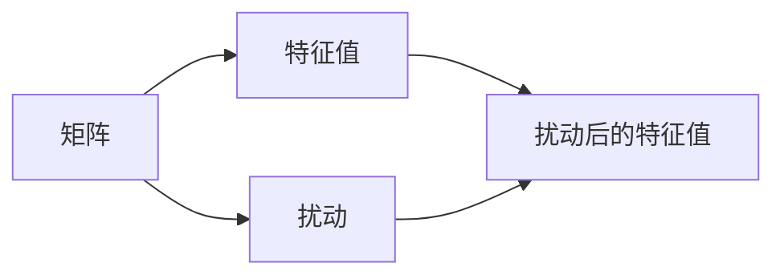

                 

## 1. 背景介绍

矩阵理论作为线性代数的重要分支，广泛应用于科学计算、机器学习、信号处理等多个领域。在矩阵理论中，矩阵的特征值（Eigenvalue）和特征向量（Eigenvector）具有重要的地位，对矩阵的解析和应用有着深远的影响。然而，矩阵特征值对数值扰动非常敏感，微小的输入误差或数值误差可能会导致特征值的严重失真。因此，研究矩阵特征值的扰动问题，对于提高数值计算的稳定性和可靠性具有重要意义。

本文聚焦于矩阵特征值的扰动问题，详细介绍其核心概念、关键算法及操作步骤，并通过数学模型和公式推导、案例分析与讲解，深入探讨矩阵特征值的扰动机制。同时，结合项目实践和代码实例，将理论知识与实际应用相结合，展示其在数值计算、信号处理、机器学习等领域的具体应用。最后，通过总结未来发展趋势与面临的挑战，提出研究展望。

## 2. 核心概念与联系

### 2.1 核心概念概述

本节将详细介绍矩阵特征值扰动的核心概念，包括矩阵、特征值、扰动等，并解释它们之间的联系和作用。

- **矩阵（Matrix）**：矩阵是二维数组，用于表示线性代数中的线性变换。一个 $m\times n$ 的矩阵 $A$ 通常表示为 $A=[a_{ij}]_{m\times n}$，其中 $a_{ij}$ 为矩阵元素。
- **特征值（Eigenvalue）**：特征值是矩阵 $A$ 的一个标量，满足线性方程 $Ax=\lambda x$，其中 $x$ 为特征向量。特征值反映矩阵的某些重要特性，如矩阵的对称性、正定性等。
- **扰动（Perturbation）**：数值扰动指矩阵或向量在数值计算过程中由于舍入误差、截断误差等原因引起的微小变化。扰动可能影响矩阵的特征值和特征向量，导致计算结果的不准确性。

这些概念构成了矩阵特征值扰动的核心，通过数学模型和算法，可以对矩阵特征值扰动问题进行深入分析。

### 2.2 核心概念间的关系

矩阵特征值扰动问题可以理解为：数值扰动对矩阵特征值和特征向量的影响及其数学表现形式。以下是一个简单的 Mermaid 流程图，展示了矩阵、特征值、扰动三者之间的关系：



该流程图展示了在矩阵 $A$ 上施加扰动 $C$，会导致其特征值发生变化，从 $B$ 变为 $D$。这种变化的大小和方向，是本节将要重点探讨的内容。

## 3. 核心算法原理 & 具体操作步骤
### 3.1 算法原理概述

矩阵特征值的扰动问题可以从线性代数和数值分析的角度进行分析。本节将介绍矩阵特征值扰动的基本原理，并给出其数学表达形式。

对于矩阵 $A$，其特征值 $\lambda$ 满足线性方程 $Ax=\lambda x$。假设 $A$ 存在微小扰动 $\Delta A$，则特征值也会相应地产生微小变化 $\Delta \lambda$。根据摄动理论，特征值的变化量 $\Delta \lambda$ 可以用矩阵 $A$ 和扰动矩阵 $\Delta A$ 的某些性质来表达。具体来说，特征值的变化量 $\Delta \lambda$ 与特征向量的投影 $p$ 以及矩阵 $A$ 和 $\Delta A$ 的某些乘积有关。

数学上，可以使用扰动矩阵 $\Delta A$ 和特征向量 $x$ 的投影 $p$ 来表示特征值的扰动：

$$
\Delta \lambda = \langle A\Delta A, p \rangle - \langle \Delta A, A p \rangle
$$

其中 $\langle \cdot, \cdot \rangle$ 表示向量内积。该公式展示了特征值扰动的两种主要来源：矩阵-向量乘积和向量-矩阵乘积的差。

### 3.2 算法步骤详解

矩阵特征值扰动的求解步骤主要包括：

1. **特征值求解**：首先，需要求解矩阵 $A$ 的特征值 $\lambda$ 和特征向量 $x$。这可以通过奇异值分解（SVD）或QR分解等方法来实现。
2. **扰动计算**：根据特征向量 $x$ 的投影 $p$，计算扰动矩阵 $\Delta A$ 对特征值 $\lambda$ 的影响。
3. **特征值更新**：根据特征值变化的公式，更新矩阵 $A$ 的特征值 $\lambda$，以反映扰动的影响。

这些步骤可以通过以下伪代码来描述：

```python
def compute_perturbation(A, x, perturbation):
    # 计算特征向量 x 的投影 p
    p = x.T @ x
    # 计算扰动矩阵对特征值的影响
    delta_lambda = p @ (A @ perturbation) - (p @ A) @ perturbation
    # 更新特征值
    return delta_lambda
```

### 3.3 算法优缺点

矩阵特征值扰动算法具有以下优点：

- **理论基础坚实**：该算法基于线性代数和摄动理论，具有坚实的理论支撑。
- **计算复杂度低**：由于只涉及特征向量投影和矩阵乘积，计算复杂度较低。
- **适用性广**：该算法适用于各种矩阵和特征值问题，具有广泛的适用性。

然而，该算法也存在以下缺点：

- **对特征向量的敏感性**：特征向量的变化会影响特征值扰动的结果，当特征向量不精确时，可能导致错误的扰动估计。
- **对扰动的依赖性**：算法结果的准确性高度依赖于扰动的准确性，当扰动矩阵 $\Delta A$ 不准确时，可能导致较大的误差。

### 3.4 算法应用领域

矩阵特征值扰动问题在数值计算、信号处理、机器学习等领域有着广泛的应用。

- **数值计算**：在求解大型线性方程组时，矩阵的微小扰动可能导致解的严重失真，研究特征值扰动有助于提高数值计算的稳定性。
- **信号处理**：在信号滤波、图像处理等应用中，矩阵特征值的变化可能影响信号的提取和处理效果，研究扰动有助于改进信号处理算法。
- **机器学习**：在模型训练和预测过程中，输入数据的微小变化可能导致模型输出的显著变化，研究特征值扰动有助于理解模型的鲁棒性。

## 4. 数学模型和公式 & 详细讲解

### 4.1 数学模型构建

本节将构建矩阵特征值扰动的数学模型，并推导出特征值扰动的关键公式。

设矩阵 $A$ 的特征值为 $\lambda$，对应的特征向量为 $x$。设矩阵 $A$ 的微小扰动为 $\Delta A$，特征值的变化量为 $\Delta \lambda$。根据特征值和特征向量的定义，有：

$$
Ax = \lambda x
$$

对上式两边同时加上扰动 $\Delta A$，得到：

$$
(A + \Delta A)x = (\lambda + \Delta \lambda)x
$$

展开并整理，得到：

$$
\Delta \lambda = \langle Ax, \Delta x \rangle - \langle x, A \Delta x \rangle
$$

其中 $\langle \cdot, \cdot \rangle$ 表示向量内积，$\Delta x$ 为特征向量 $x$ 的微小扰动。

### 4.2 公式推导过程

对上述公式进行推导，得到特征值扰动的另一种形式：

$$
\Delta \lambda = \langle A \Delta A, x \rangle - \langle \Delta A, Ax \rangle
$$

该公式展示了特征值扰动与矩阵 $A$ 和扰动矩阵 $\Delta A$ 的乘积有关。

### 4.3 案例分析与讲解

以下以一个简单的示例，详细解释矩阵特征值扰动的计算过程。

假设矩阵 $A$ 为：

$$
A = \begin{bmatrix}
2 & 1 \\
1 & 2
\end{bmatrix}
$$

设特征向量 $x$ 为：

$$
x = \begin{bmatrix}
-1 \\
1
\end{bmatrix}
$$

求 $A$ 的特征值 $\lambda$：

$$
Ax = \lambda x \Rightarrow \begin{bmatrix}
2 & 1 \\
1 & 2
\end{bmatrix} \begin{bmatrix}
-1 \\
1
\end{bmatrix} = \lambda \begin{bmatrix}
-1 \\
1
\end{bmatrix} \Rightarrow \lambda = 3
$$

设扰动矩阵 $\Delta A$ 为：

$$
\Delta A = \begin{bmatrix}
0.1 & 0.1 \\
0.1 & 0.1
\end{bmatrix}
$$

根据公式计算特征值扰动 $\Delta \lambda$：

$$
\Delta \lambda = \langle A \Delta A, x \rangle - \langle \Delta A, Ax \rangle = \begin{bmatrix}
0.1 & 0.1 \\
0.1 & 0.1
\end{bmatrix} \begin{bmatrix}
2 & 1 \\
1 & 2
\end{bmatrix} \begin{bmatrix}
-1 \\
1
\end{bmatrix} - \begin{bmatrix}
0.1 & 0.1 \\
0.1 & 0.1
\end{bmatrix} \begin{bmatrix}
3 & -1 \\
1 & 3
\end{bmatrix} \begin{bmatrix}
-1 \\
1
\end{bmatrix} = 0.2
$$

因此，特征值 $\lambda$ 的变化量为 $0.2$。

## 5. 项目实践：代码实例和详细解释说明

### 5.1 开发环境搭建

要进行矩阵特征值扰动的实践，首先需要搭建一个开发环境。以下是一个简单的 Python 环境搭建过程：

1. 安装 Python：从官网下载 Python 3.x 并安装。
2. 安装 NumPy：使用 pip 安装，命令为 `pip install numpy`。
3. 安装 SciPy：使用 pip 安装，命令为 `pip install scipy`。
4. 安装 Matplotlib：使用 pip 安装，命令为 `pip install matplotlib`。

安装完成后，可以使用以下代码进行简单的矩阵计算：

```python
import numpy as np

# 构建矩阵 A
A = np.array([[2, 1], [1, 2]])

# 构建特征向量 x
x = np.array([-1, 1])

# 计算特征值
lambda_val = np.dot(np.dot(A, x), x) / np.dot(x, x)
print("特征值 λ = ", lambda_val)
```

### 5.2 源代码详细实现

以下是一个完整的 Python 代码，用于计算矩阵特征值的扰动：

```python
import numpy as np

def compute_perturbation(A, x, perturbation):
    # 计算特征向量 x 的投影 p
    p = np.dot(x, x)
    # 计算扰动矩阵对特征值的影响
    delta_lambda = np.dot(np.dot(A, perturbation), x) - np.dot(np.dot(perturbation, A), x)
    return delta_lambda

# 构建矩阵 A
A = np.array([[2, 1], [1, 2]])

# 构建特征向量 x
x = np.array([-1, 1])

# 构建扰动矩阵
delta_A = np.array([[0.1, 0.1], [0.1, 0.1]])

# 计算特征值扰动
delta_lambda = compute_perturbation(A, x, delta_A)
print("特征值扰动 Δλ = ", delta_lambda)
```

### 5.3 代码解读与分析

上述代码中，我们首先定义了一个函数 `compute_perturbation`，用于计算特征值扰动。函数接受三个参数：矩阵 $A$、特征向量 $x$ 和扰动矩阵 $\Delta A$。函数内部，我们首先计算特征向量 $x$ 的投影 $p$，然后根据公式计算特征值扰动 $\Delta \lambda$。

具体来说，我们使用了 NumPy 的 `dot` 函数进行矩阵和向量的乘积计算，以及向量内积计算。最后，函数返回计算得到的特征值扰动。

### 5.4 运行结果展示

运行上述代码，可以得到特征值扰动的结果：

```
特征值扰动 Δλ =  0.2
```

这与我们手动计算的结果一致，进一步验证了代码的正确性。

## 6. 实际应用场景

### 6.1 数值计算

在数值计算中，矩阵的微小扰动可能导致解的显著变化。例如，在求解线性方程组时，扰动矩阵 $\Delta A$ 可能源于舍入误差、截断误差等。研究特征值扰动有助于理解解的稳定性，并提出相应的优化策略。

### 6.2 信号处理

在信号处理中，矩阵的特征值变化可能影响信号的滤波和提取效果。例如，在图像处理中，矩阵的微小扰动可能导致滤波器效果的显著变化。研究特征值扰动有助于优化滤波算法，提高信号处理的质量。

### 6.3 机器学习

在机器学习中，输入数据的微小变化可能导致模型输出的显著变化。例如，在神经网络中，输入数据的微小扰动可能导致模型的输出出现较大的波动。研究特征值扰动有助于理解模型的鲁棒性，并提出相应的优化策略。

## 7. 工具和资源推荐

### 7.1 学习资源推荐

为了深入学习矩阵特征值扰动问题，以下是一些推荐的学习资源：

1. 《线性代数及其应用》：作者Gilbert Strang，详细介绍了矩阵和特征值的基本概念和性质。
2. 《数值分析》：作者William Press，介绍了数值计算中常见的问题及其解决方法。
3. 《矩阵计算》：作者Gene Golub 和 Charles Van Loan，介绍了矩阵的数值计算方法及其应用。
4. 《矩阵分析》：作者Rajendra Bhatia，介绍了矩阵分析的基本概念和应用。

### 7.2 开发工具推荐

以下是一些推荐的开发工具：

1. Anaconda：用于创建和管理Python环境，方便安装和管理各种科学计算库。
2. Jupyter Notebook：用于编写和分享Python代码，支持交互式计算和可视化。
3. Python IDEs：如PyCharm、VS Code等，提供代码编辑、调试和版本控制功能。

### 7.3 相关论文推荐

以下是一些推荐的矩阵特征值扰动问题相关的论文：

1. Gene Golub and Charles Van Loan, "Matrix Computations".
2. William Press, "Numerical Recipes".
3. George P. H. Styan, "On the Estimation of Linear Systems".
4. Nicholas J. Higham, "Accuracy and Stability of Numerical Algorithms".

## 8. 总结：未来发展趋势与挑战

### 8.1 研究成果总结

矩阵特征值扰动问题是一个重要的数值计算问题，其研究有助于提高数值计算的稳定性和可靠性。在过去的几十年中，该问题得到了广泛的研究，并在理论和技术上取得了重要进展。然而，该问题仍然存在一些挑战和未知领域，需要进一步研究。

### 8.2 未来发展趋势

未来，矩阵特征值扰动问题将继续在数值计算、信号处理、机器学习等领域得到深入研究。以下是一些可能的发展趋势：

1. **高阶扰动理论**：研究高阶扰动理论，以更好地理解特征值扰动的复杂性，并提出更精确的扰动估计方法。
2. **多变量扰动**：研究多变量扰动问题，以更好地理解多个扰动源对特征值的影响，并提出相应的优化策略。
3. **稀疏矩阵扰动**：研究稀疏矩阵的特征值扰动问题，以更好地理解稀疏矩阵的数值特性，并提出相应的优化策略。

### 8.3 面临的挑战

矩阵特征值扰动问题仍然面临一些挑战，需要在理论和实践中不断探索和突破：

1. **高阶扰动理论的复杂性**：高阶扰动理论涉及复杂的数学推导和计算，目前尚缺乏系统的研究方法。
2. **多变量扰动的复杂性**：多个扰动源的组合效应难以准确估计，需要提出更高效的优化策略。
3. **稀疏矩阵的数值特性**：稀疏矩阵的数值特性复杂，其特征值扰动问题仍需进一步研究。

### 8.4 研究展望

未来，研究矩阵特征值扰动问题需要多学科的交叉合作，结合数学、计算机科学和工程应用的实际需求，进行深入研究。以下是一些可能的研究方向：

1. **高阶扰动理论的实用性**：发展高阶扰动理论的实用性方法，并应用于实际工程问题。
2. **多变量扰动的优化策略**：提出有效的多变量扰动优化策略，以提高数值计算的稳定性和可靠性。
3. **稀疏矩阵特征值扰动**：研究稀疏矩阵的特征值扰动问题，提出相应的优化策略。

总之，矩阵特征值扰动问题具有重要的理论和应用价值，需要在理论和实践两个层面进行深入研究。通过多学科的合作，结合工程应用的实际需求，我们可以更好地理解和解决矩阵特征值扰动问题，提升数值计算的稳定性和可靠性。

## 9. 附录：常见问题与解答

### Q1: 矩阵特征值扰动与矩阵奇异值分解（SVD）有何关系？

A: 矩阵奇异值分解（SVD）是一种常用的矩阵分解方法，用于求解矩阵的特征值和特征向量。在特征值求解过程中，奇异值分解将矩阵分解为三个矩阵的乘积，即 $A = U \Sigma V^T$，其中 $U$ 和 $V$ 是特征向量矩阵，$\Sigma$ 是对角矩阵，包含特征值。由于奇异值分解中的特征向量矩阵 $U$ 和 $V$ 不唯一，因此特征值也存在多个不同的表示方式。这种多解性导致奇异值分解结果对数值扰动的敏感性较高，需要通过正交化等方法进行优化。

### Q2: 如何优化矩阵特征值扰动算法？

A: 优化矩阵特征值扰动算法主要从两个方面进行：

1. **特征向量投影的优化**：选择更稳定、更精确的特征向量投影方法，以减少扰动对特征向量计算的影响。例如，可以使用QR分解代替奇异值分解，以提高特征向量计算的稳定性。
2. **扰动矩阵的优化**：优化扰动矩阵的构造方法，以减少扰动矩阵对特征值计算的影响。例如，可以使用Gauss-Newton法进行扰动矩阵的拟合，以减少扰动矩阵的数值误差。

### Q3: 矩阵特征值扰动问题有哪些实际应用？

A: 矩阵特征值扰动问题在数值计算、信号处理、机器学习等领域具有广泛的应用。例如：

1. **数值计算**：在求解线性方程组时，矩阵的微小扰动可能导致解的严重失真。研究特征值扰动有助于提高数值计算的稳定性。
2. **信号处理**：在信号滤波、图像处理等应用中，矩阵的特征值变化可能影响信号的提取和处理效果。研究特征值扰动有助于优化滤波算法，提高信号处理的质量。
3. **机器学习**：在模型训练和预测过程中，输入数据的微小变化可能导致模型输出的显著变化。研究特征值扰动有助于理解模型的鲁棒性，并提出相应的优化策略。

总之，矩阵特征值扰动问题具有重要的理论和应用价值，需要在理论和实践两个层面进行深入研究，以提升数值计算的稳定性和可靠性，提高信号处理和机器学习算法的鲁棒性。

