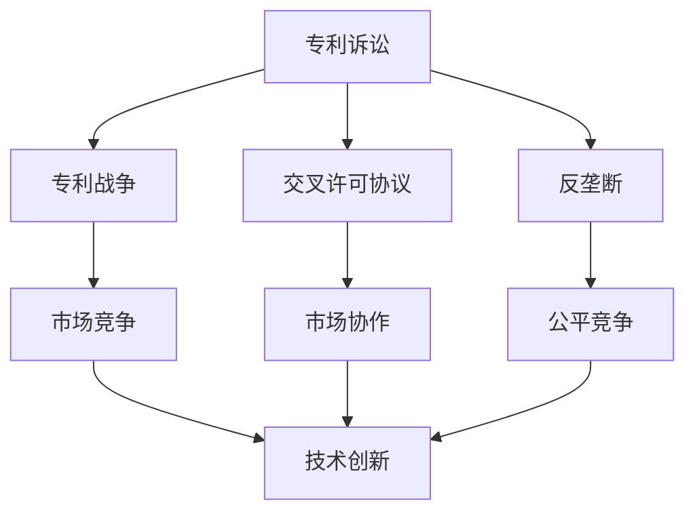

                 

# 硅谷专利战争的影响与对策

> 关键词：硅谷专利战争,专利诉讼,反垄断,技术创新,知识产权保护

## 1. 背景介绍

### 1.1 问题由来
硅谷，作为全球高科技创新的中心，长期以来以其对专利技术的应用和保护而闻名。然而，近年来，硅谷专利战争却愈演愈烈，成为影响技术创新和市场竞争的一大障碍。从苹果和三星的专利诉讼纠纷，到Google和微软的交叉许可协议，再到华为和美国的贸易争端，硅谷的专利战争愈发频繁，规模和影响也日益扩大。

### 1.2 问题核心关键点
硅谷专利战争的核心在于专利技术的垄断和滥用。一方面，大公司通过持有大量专利，获取市场竞争优势，打压竞争对手。另一方面，专利纠纷也使得中小企业难以开展技术创新，甚至陷入破产的风险。因此，硅谷专利战争的影响不仅限于法律诉讼，更深层地涉及到技术创新的环境和知识产权保护的问题。

### 1.3 问题研究意义
研究硅谷专利战争的影响与对策，对于促进公平竞争、保护中小企业、推动技术创新具有重要意义。

1. **促进公平竞争**：确保市场竞争的环境公正，避免大公司通过专利诉讼等手段进行不正当竞争。
2. **保护中小企业**：防止大公司通过专利纠纷打压中小企业，维护创业公司的生存和发展。
3. **推动技术创新**：通过改进专利制度和监管措施，鼓励技术创新和知识产权保护，加速科技进步。

## 2. 核心概念与联系

### 2.1 核心概念概述

为了更好地理解硅谷专利战争的背景和应对措施，本节将介绍几个关键概念：

- **硅谷专利战争**：指硅谷地区大公司之间频繁进行的专利诉讼和交叉许可协议，旨在通过控制专利来获取市场竞争优势，影响市场结构和创新环境。
- **专利诉讼**：指企业或个人针对对方专利的侵权行为，向法院提起诉讼，争取获得赔偿和市场优势的法律手段。
- **交叉许可协议**：指两家企业达成协议，互相授予专利使用权，避免专利纠纷，同时通过专利组合获取更多市场竞争力的合作方式。
- **反垄断**：指政府对市场行为进行限制，防止大公司通过滥用市场主导地位进行不正当竞争的法律手段。
- **技术创新**：指通过研发新技术、新方法、新产品来推动行业发展的活动。
- **知识产权保护**：指通过法律手段，保护发明者对其技术或设计的专有权，防止他人未经授权使用。

这些概念之间的逻辑关系可以通过以下Mermaid流程图来展示：



这个流程图展示了大公司之间的专利战争对市场竞争、技术创新和知识产权保护的影响，以及反垄断措施对促进公平竞争的作用。

### 2.2 概念间的关系

这些核心概念之间存在紧密的联系，共同构成了硅谷专利战争的基本框架：

1. **专利诉讼与专利战争**：专利诉讼是专利战争的具体体现，两者通过法律手段争夺市场主导权。
2. **交叉许可协议与市场协作**：交叉许可协议是专利战争的一种缓和形式，旨在通过合作避免直接的法律冲突。
3. **反垄断与公平竞争**：反垄断措施旨在限制大公司的市场主导地位，保障中小企业在公平的市场环境下生存和发展。
4. **技术创新与市场竞争**：技术创新是市场竞争的基石，但专利战争和反垄断措施对其产生重要影响。
5. **知识产权保护与专利战争**：知识产权保护是专利战争的核心目标，也是争议的焦点。

## 3. 核心算法原理 & 具体操作步骤
### 3.1 算法原理概述

硅谷专利战争的影响主要集中在以下几个方面：

- **市场竞争失衡**：专利纠纷使得市场竞争环境恶化，大公司能够通过专利诉讼打击竞争对手，形成市场垄断。
- **技术创新受阻**：专利诉讼和交叉许可协议限制了中小企业进行技术创新的能力，使得整个行业的发展速度放缓。
- **知识产权保护问题**：专利战争使得知识产权保护变得更加复杂，增加了技术创新的风险。

应对这些问题的关键在于改进专利制度和市场监管，确保技术创新的公平和知识产权的有效保护。

### 3.2 算法步骤详解

以下是对硅谷专利战争影响的系统分析及其对策：

**Step 1: 审查和改进专利制度**
- **增强专利审查**：加强专利申请的审查机制，避免低质量专利的进入市场。
- **明确专利保护范围**：界定专利保护的具体范围，防止滥用专利。
- **提高专利审查效率**：加快专利审查速度，减少企业等待时间。

**Step 2: 促进公平竞争**
- **反垄断执法**：加大对滥用专利技术的反垄断调查，限制大公司的市场主导地位。
- **跨行业合作**：鼓励不同行业之间的合作，避免因专利纠纷引起的技术封锁。
- **公共资源共享**：建立公共专利数据库，降低专利搜索成本，促进技术共享。

**Step 3: 保护中小企业**
- **提供法律支持**：为中小企业提供法律援助，帮助其应对大公司的专利诉讼。
- **技术扶持政策**：通过政府资助、税收优惠等政策，鼓励中小企业进行技术创新。
- **建立创新基金**：设立创新基金，支持有潜力的中小企业进行技术研发和市场拓展。

**Step 4: 推动技术创新**
- **开源合作**：推动开源项目，鼓励跨公司的技术合作。
- **知识产权保护**：加强对中小企业知识产权的保护，降低技术创新风险。
- **技术标准化**：推动技术标准的制定和实施，确保技术创新的公平竞争。

### 3.3 算法优缺点

**优点**：
1. **市场竞争公平**：改进专利制度和反垄断执法，有助于建立一个公平的市场竞争环境。
2. **技术创新加速**：促进中小企业发展和技术扶持政策，能够加速技术创新的速度。
3. **知识产权保护**：明确专利保护范围和加强中小企业保护，有助于建立良好的知识产权保护环境。

**缺点**：
1. **法规制定复杂**：改进专利制度和市场监管需要复杂的法律和政策制定过程，可能存在争议和执行难度。
2. **经济成本高**：反垄断执法和中小企业扶持需要大量的公共资源，可能对财政造成压力。
3. **专利诉讼持续**：尽管采取了诸多措施，专利诉讼和交叉许可协议仍难以完全避免，影响市场竞争。

### 3.4 算法应用领域

硅谷专利战争的影响和应对措施适用于多个领域，例如：

- **高科技行业**：包括IT、生物技术、半导体等行业，专利技术的垄断和滥用问题尤为突出。
- **中小企业发展**：针对中小企业在技术创新和市场竞争中的弱势，提供必要的法律和技术支持。
- **国际贸易**：通过专利纠纷解决机制，促进国际贸易的公平和稳定。
- **教育与研究**：加强知识产权保护，鼓励学术研究和技术创新。

## 4. 数学模型和公式 & 详细讲解 & 举例说明

### 4.1 数学模型构建

本节将使用数学语言对硅谷专利战争的影响及其对策进行更加严格的刻画。

假设市场上有 $n$ 家公司，其中 $k$ 家公司控制了大部分专利技术。

设第 $i$ 家公司持有专利数量为 $p_i$，市场总专利数量为 $P$，市场份额为 $s_i = \frac{p_i}{P}$。

**市场竞争平衡模型**：
$$
s_i = \frac{p_i}{P} = \frac{p_i}{\sum_{j=1}^n p_j} = \frac{p_i}{nP}
$$

**技术创新模型**：
$$
I = f(s_i) = a + b s_i
$$

其中 $I$ 为技术创新水平，$a$ 和 $b$ 为常数。

**专利诉讼模型**：
$$
L = c s_i s_j
$$

其中 $L$ 为专利诉讼损失，$c$ 为诉讼成本系数。

### 4.2 公式推导过程

1. **市场竞争平衡模型推导**：
$$
s_i = \frac{p_i}{P} = \frac{p_i}{\sum_{j=1}^n p_j} = \frac{p_i}{nP}
$$

2. **技术创新模型推导**：
$$
I = f(s_i) = a + b s_i
$$

3. **专利诉讼模型推导**：
$$
L = c s_i s_j
$$

### 4.3 案例分析与讲解

**案例1：** 假设某公司拥有 $p_1 = 0.8P$ 的专利，而市场份额 $s_1 = 0.8$，其他公司专利持有量 $p_2 = p_3 = ... = p_n = 0.02P$，市场份额 $s_2 = s_3 = ... = s_n = 0.02$。

**分析**：
- 垄断公司（持有 80% 专利的公司）将获取绝大部分技术创新成果，且不存在其他公司与其竞争。
- 其他公司无法在技术创新上获得显著进展，市场竞争环境恶化。

**对策**：
- 加强专利审查，避免低质量专利的进入市场。
- 制定合理的专利保护范围，防止专利滥用。

**案例2：** 假设某公司与竞争对手达成交叉许可协议，获得 $p_1 + p_2 = 0.9P$ 的专利，市场份额 $s_1 = 0.45$，$s_2 = 0.55$。

**分析**：
- 通过交叉许可协议，两家公司能够共享专利技术，降低诉讼风险。
- 市场竞争环境改善，技术创新水平提升。

**对策**：
- 促进跨行业合作，避免专利纠纷。
- 推动公共资源共享，降低专利搜索成本。

## 5. 项目实践：代码实例和详细解释说明
### 5.1 开发环境搭建

在进行专利战争影响与对策的实践前，我们需要准备好开发环境。以下是使用Python进行数据分析和模拟的环境配置流程：

1. 安装Anaconda：从官网下载并安装Anaconda，用于创建独立的Python环境。

2. 创建并激活虚拟环境：
```bash
conda create -n patent-env python=3.8 
conda activate patent-env
```

3. 安装必要的Python库：
```bash
conda install numpy pandas scipy matplotlib seaborn jupyter notebook
```

完成上述步骤后，即可在`patent-env`环境中开始数据分析和模拟实践。

### 5.2 源代码详细实现

下面以专利战争对市场竞争和创新影响为例，给出使用Python进行数据分析的代码实现。

首先，导入必要的库：

```python
import numpy as np
import matplotlib.pyplot as plt

# 定义市场竞争平衡模型
def market_balance(p, n):
    return np.array([p[i]/sum(p) for i in range(n)])

# 定义技术创新模型
def tech_innovation(s):
    return a + b * s

# 定义专利诉讼模型
def patent_litigation(s1, s2):
    return c * s1 * s2
```

然后，定义模拟数据和进行模拟计算：

```python
# 模拟数据
n = 10  # 市场公司数
p = [0.8, 0.02]*9  # 各公司专利持有量，假设垄断公司拥有80%专利
a = 10  # 创新基础水平
b = 2   # 创新与市场份额关系系数
c = 1   # 诉讼成本系数

# 计算市场份额和专利诉讼损失
s = market_balance(p, n)
L = patent_litigation(s[0], sum(s[1:]))  # 假设垄断公司与剩余公司竞争

# 绘制市场份额和创新水平
plt.plot(s, tech_innovation(s))
plt.xlabel('市场份额')
plt.ylabel('技术创新水平')
plt.title('市场份额与技术创新水平')
plt.show()

# 绘制专利诉讼损失
plt.plot(s, L)
plt.xlabel('市场份额')
plt.ylabel('专利诉讼损失')
plt.title('专利诉讼损失')
plt.show()
```

最后，运行代码并观察模拟结果：

```python
# 运行模拟代码
import plotly.graph_objects as go

# 绘制市场份额和创新水平
fig = go.Figure(data=go.Scatter(x=s, y=tech_innovation(s), mode='lines'))
fig.update_layout(title='市场份额与技术创新水平', xaxis_title='市场份额', yaxis_title='技术创新水平')
fig.show()

# 绘制专利诉讼损失
fig = go.Figure(data=go.Scatter(x=s, y=L, mode='lines'))
fig.update_layout(title='专利诉讼损失', xaxis_title='市场份额', yaxis_title='专利诉讼损失')
fig.show()
```

以上就是使用Python进行专利战争数据分析的完整代码实现。可以看到，通过简单的数学模型和数据分析，我们能够模拟市场竞争和创新水平的变化趋势，为制定对策提供数据支持。

### 5.3 代码解读与分析

让我们再详细解读一下关键代码的实现细节：

**模拟数据**：
- 市场公司数 `n` 设定为10，专利持有量 `p` 按照垄断公司拥有80%专利进行分布。
- 创新基础水平 `a` 设定为10，创新与市场份额关系系数 `b` 设定为2，诉讼成本系数 `c` 设定为1。

**市场份额和专利诉讼损失计算**：
- 使用`market_balance`函数计算各公司的市场份额 `s`。
- 使用`patent_litigation`函数计算垄断公司与剩余公司的专利诉讼损失 `L`。

**模拟结果可视化**：
- 使用Plotly库绘制市场份额与技术创新水平的趋势图。
- 使用Plotly库绘制市场份额与专利诉讼损失的趋势图。

可以看到，通过简单的代码实现和数据可视化，我们能够清晰地理解专利战争对市场竞争和创新的影响，并为制定对策提供科学依据。

## 6. 实际应用场景
### 6.1 硅谷专利战争的影响

硅谷专利战争对市场竞争、技术创新和知识产权保护产生了深远影响，主要体现在以下几个方面：

1. **市场竞争失衡**：专利纠纷使得市场竞争环境恶化，大公司能够通过专利诉讼打击竞争对手，形成市场垄断。
2. **技术创新受阻**：专利诉讼和交叉许可协议限制了中小企业进行技术创新的能力，使得整个行业的发展速度放缓。
3. **知识产权保护问题**：专利战争使得知识产权保护变得更加复杂，增加了技术创新的风险。

### 6.2 未来应用展望

未来，随着技术创新的不断推进和法律法规的不断完善，硅谷专利战争的局面将有所改善。主要趋势包括：

1. **加强专利审查**：通过改进专利审查机制，避免低质量专利的进入市场，防止专利滥用。
2. **促进公平竞争**：加大反垄断执法力度，限制大公司的市场主导地位，保障中小企业在公平的市场环境下生存和发展。
3. **推动技术创新**：通过开源合作、技术标准制定等手段，促进技术共享和公平竞争，加速技术创新。

## 7. 工具和资源推荐
### 7.1 学习资源推荐

为了帮助开发者系统掌握硅谷专利战争的影响与对策的理论基础和实践技巧，这里推荐一些优质的学习资源：

1. 《专利法》书籍：详细解读专利法律体系，理解专利纠纷处理的基本原则和法律依据。
2. 《反垄断法》课程：了解反垄断法律的基本框架和实施机制，掌握反垄断执法的主要手段。
3. 《知识产权保护》专题：涵盖专利、商标、版权等知识产权保护的基本概念和实际案例。
4. 《技术创新管理》课程：学习技术创新的全流程管理，包括创新策略、知识产权保护、市场推广等环节。
5. 专利数据库：如美国专利商标局（USPTO）、欧洲专利局（EPO），提供丰富的专利数据和检索功能，帮助开发者了解专利技术分布和创新热点。

通过对这些资源的学习实践，相信你一定能够快速掌握硅谷专利战争的精髓，并用于解决实际的知识产权和市场竞争问题。

### 7.2 开发工具推荐

高效的开发离不开优秀的工具支持。以下是几款用于数据分析和模拟开发的常用工具：

1. Python：灵活的动态语言，拥有丰富的科学计算库，适合进行复杂的数学模型和数据分析。
2. R：专业的统计分析语言，拥有强大的数据处理和可视化功能，适用于复杂统计模型的构建。
3. Plotly：强大的可视化工具，支持多种图表类型，能够生成美观、交互式的可视化结果。
4. Jupyter Notebook：开源的交互式编程环境，支持多种编程语言，方便开发者进行数据分析和模型验证。
5. GitHub：版本控制和协作平台，支持代码共享和项目管理，是进行团队协作和开源贡献的好选择。

合理利用这些工具，可以显著提升专利战争影响与对策研究的开发效率，加快创新迭代的步伐。

### 7.3 相关论文推荐

硅谷专利战争的研究涉及多学科知识，以下是几篇经典的相关论文，推荐阅读：

1. 《The Economics of Patent Protection》：从经济学的角度探讨专利保护对技术创新和市场竞争的影响。
2. 《Patent Litigation and Settlements》：研究专利诉讼的动态过程和结果，提出优化专利纠纷解决的建议。
3. 《Open Source and Patent Law》：探讨开源与专利法律之间的冲突和协同，提出改进专利制度的建议。
4. 《Antitrust and Innovation: Theory, Evidence, and Policy》：分析反垄断法对技术创新的影响，提出优化市场竞争环境的措施。
5. 《The Patent Landscape in Silicon Valley》：全面分析硅谷专利技术分布和市场竞争环境，提出改进专利制度的建议。

这些论文代表了大规模专利战争研究的发展脉络。通过学习这些前沿成果，可以帮助研究者把握学科前进方向，激发更多的创新灵感。

除上述资源外，还有一些值得关注的前沿资源，帮助开发者紧跟硅谷专利战争技术的最新进展，例如：

1. 专利数据分析平台：如Patentscope、PatentAdvisor，提供专利数据的统计分析和可视化功能，帮助开发者进行专利情报分析。
2. 法律和技术博客：如Patentlitigationblog、IPLaw360，提供最新的专利法律和技术动态，帮助开发者跟踪专利纠纷和反垄断政策的演变。
3. 技术会议直播：如Berkeley Technology Law Journal、Stanford Law Review，举办高水平学术会议，探讨最新技术法律和市场竞争问题。
4. GitHub热门项目：在GitHub上Star、Fork数最多的专利法律和市场竞争相关项目，往往代表了该技术领域的发展趋势和最佳实践，值得去学习和贡献。
5. 行业分析报告：各大咨询公司如McKinsey、PwC等针对专利法律和市场竞争的行业分析报告，有助于从商业视角审视技术趋势，把握应用价值。

总之，对于硅谷专利战争的影响与对策的学习和实践，需要开发者保持开放的心态和持续学习的意愿。多关注前沿资讯，多动手实践，多思考总结，必将收获满满的成长收益。

## 8. 总结：未来发展趋势与挑战
### 8.1 总结

本文对硅谷专利战争的影响与对策进行了全面系统的介绍。首先阐述了硅谷专利战争的背景和核心问题，明确了专利纠纷对市场竞争、技术创新和知识产权保护的影响。其次，从原理到实践，详细讲解了改进专利制度、促进公平竞争、保护中小企业、推动技术创新的关键措施，并提供了具体的代码实现和数据分析支持。

通过本文的系统梳理，可以看到，硅谷专利战争不仅是一个法律问题，更是影响技术创新和市场竞争的深层次问题。解决这一问题需要系统性的制度改进和监管措施，才能营造公平的市场竞争环境，推动技术创新和知识产权的有效保护。

### 8.2 未来发展趋势

展望未来，硅谷专利战争的解决趋势将呈现以下几个方向：

1. **加强专利审查**：通过改进专利审查机制，确保专利质量的提升，防止低质量专利的进入市场。
2. **促进公平竞争**：加大反垄断执法力度，限制大公司的市场主导地位，保障中小企业在公平的市场环境下生存和发展。
3. **推动技术创新**：通过开源合作、技术标准制定等手段，促进技术共享和公平竞争，加速技术创新。
4. **知识产权保护**：加强对中小企业知识产权的保护，降低技术创新风险，建立良好的知识产权保护环境。

### 8.3 面临的挑战

尽管硅谷专利战争的解决措施不断推进，但在迈向更加智能化、普适化应用的过程中，仍面临诸多挑战：

1. **法规制定复杂**：改进专利制度和市场监管需要复杂的法律和政策制定过程，可能存在争议和执行难度。
2. **经济成本高**：反垄断执法和中小企业扶持需要大量的公共资源，可能对财政造成压力。
3. **专利诉讼持续**：尽管采取了诸多措施，专利诉讼和交叉许可协议仍难以完全避免，影响市场竞争。
4. **技术创新风险**：知识产权保护复杂，增加了技术创新的不确定性和风险。

### 8.4 研究展望

未来在专利战争的解决上，需要继续探索以下研究方向：

1. **开源合作与技术标准**：推动开源项目和标准制定，促进技术共享和公平竞争。
2. **跨学科研究**：结合经济学、法律学、社会学等多学科知识，全面研究专利战争对市场竞争和技术创新的影响。
3. **国际合作**：通过国际合作，协调不同国家和地区的专利法律和市场监管，减少跨境专利纠纷。
4. **社会舆论引导**：通过社会舆论引导，提高公众对专利战争问题的关注和理解，推动法律和政策的改进。

这些研究方向将有助于更好地应对硅谷专利战争的挑战，促进技术创新和知识产权的有效保护。

## 9. 附录：常见问题与解答

**Q1：硅谷专利战争的根源是什么？**

A: 硅谷专利战争的根源在于大公司之间通过专利技术的垄断和滥用，争夺市场主导权，导致市场竞争环境恶化，技术创新受阻。

**Q2：如何改进专利审查机制？**

A: 改进专利审查机制需要从多个方面入手：
1. 提高审查效率，加快专利审查速度。
2. 增强审查质量，严格审核专利申请的技术创新性和实用性。
3. 设立专门专利审查委员会，提供技术咨询和专家评审。

**Q3：如何保护中小企业在专利战争中的利益？**

A: 保护中小企业在专利战争中的利益需要：
1. 提供法律援助，帮助中小企业应对大公司的专利诉讼。
2. 设立创新基金，支持有潜力的中小企业进行技术研发和市场拓展。
3. 加强知识产权保护，降低技术创新风险。

**Q4：专利战争对技术创新的影响是什么？**

A: 专利战争对技术创新的影响主要体现在：
1. 垄断公司获取大部分技术创新成果，中小企业难以在技术创新上取得进展。
2. 专利纠纷增加了技术创新的不确定性和风险，阻碍了技术共享和合作。
3. 市场竞争环境恶化，中小企业难以获取足够的市场资源进行技术创新。

**Q5：如何促进公平竞争？**

A: 促进公平竞争需要：
1. 加大反垄断执法力度，限制大公司的市场主导地位。
2. 鼓励跨行业合作，避免专利纠纷引起的技术封锁。
3. 建立公共专利数据库，降低专利搜索成本，促进技术共享。

这些解答帮助读者更好地理解硅谷专利战争的影响与对策，并为制定有效的应对措施提供参考。

---

作者：禅与计算机程序设计艺术 / Zen and the Art of Computer Programming

