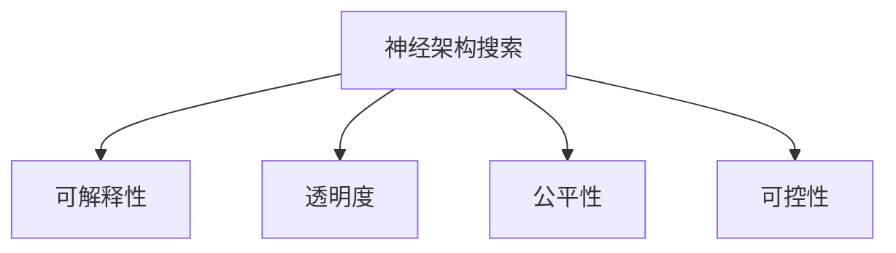
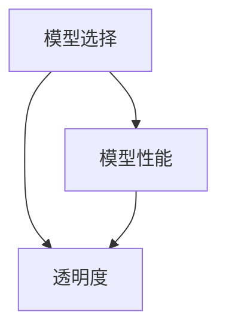
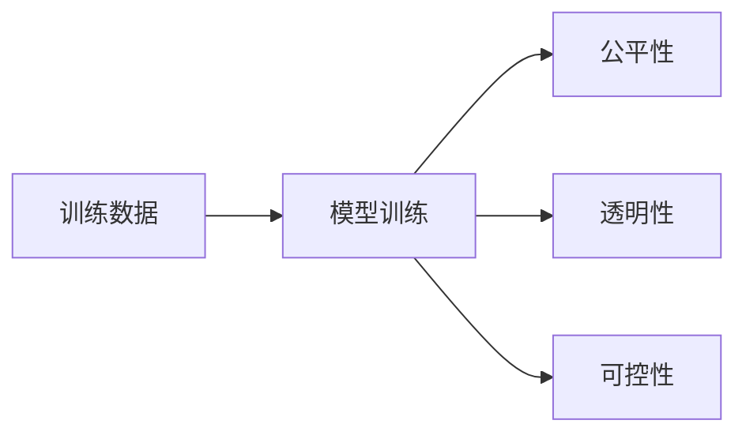

                 

# 神经架构搜索的可解释性研究

## 1. 背景介绍

### 1.1 问题由来

神经架构搜索(Neural Architecture Search, NAS)作为深度学习领域的一大研究热点，旨在自动化地发现高效神经网络架构。目前NAS研究已经逐步从研究层面走向实际应用，越来越多的科研和工业界的研究人员开始关注其应用落地和工程实践。然而，现有的神经架构搜索方法，虽然能够产生性能优越的神经网络，但往往难以解释其背后的原理，缺乏透明度和可理解性。可解释性不足使得模型调试和优化变得更加困难，也影响了其在医疗、金融等领域的安全和可靠性应用。

### 1.2 问题核心关键点

NAS方法通过探索超空间中的架构（如节点数、卷积核大小、残差连接等），自动生成一系列可能的架构，并通过评估指标（如准确率、精度等）进行筛选，得到最终最优的架构。这一过程高度依赖于搜索算法，而现有搜索算法在全局搜索效率和局部细化精度之间难以平衡。

可解释性研究的核心在于构建能够解释模型选择和性能表现的透明模型，使得研究者和用户能够理解NAS算法背后的逻辑，更好地应用和调试模型。

### 1.3 问题研究意义

构建可解释的NAS模型，对于提升模型透明度和可靠性，加快模型开发和调试，促进模型在实际应用中的落地，具有重要意义。特别是在医疗、金融等领域，模型的可解释性和安全性至关重要，可解释的NAS方法将使得这些应用场景中的模型更加可信和可控。

## 2. 核心概念与联系

### 2.1 核心概念概述

为更好地理解可解释的NAS方法，本节将介绍几个密切相关的核心概念：

- **神经架构搜索**：自动搜索网络架构的方法，通过遍历可能的结构空间，构建性能优秀的神经网络。
- **可解释性**：模型的决策过程和内部机制可以被清晰解释，帮助用户理解和信任模型。
- **透明度**：模型结构、参数和训练过程等可以被可视化，便于用户洞察和验证。
- **公平性**：模型在所有数据点上的表现一致，避免偏见和歧视。
- **可控性**：模型能够根据用户需求进行定制，如添加特定层、调整训练策略等。

这些核心概念之间的逻辑关系可以通过以下Mermaid流程图来展示：



这个流程图展示了几大概念之间的关系：

1. 神经架构搜索是自动构建模型的过程，需要通过优化和筛选得到高效的架构。
2. 可解释性、透明度、公平性和可控性是评价模型应用价值的关键指标。
3. 一个良好的模型应兼顾高效和可解释性，透明性、公平性和可控性是这一目标的重要保障。

### 2.2 概念间的关系

这些核心概念之间存在着紧密的联系，形成了神经架构搜索的完整生态系统。下面我们通过几个Mermaid流程图来展示这些概念之间的关系。

#### 2.2.1 神经架构搜索的过程


这个流程图展示了神经架构搜索的基本过程。首先，在超空间中生成一系列初始架构，然后对每个架构进行筛选和优化，最终得到最优的架构。

#### 2.2.2 可解释性与透明度



这个流程图展示了可解释性和透明度的关系。通过透明化的模型选择过程，用户可以更好地理解模型为什么选择某种架构，从而提升模型的透明度和可解释性。

#### 2.2.3 公平性、可控性与透明性



这个流程图展示了公平性、透明性和可控性在模型训练过程中的关系。透明性不仅体现在模型选择上，也体现在训练数据、训练过程和训练结果中。通过透明化的训练过程，用户可以更好地控制模型训练策略，提升公平性和可控性。

## 3. 核心算法原理 & 具体操作步骤

### 3.1 算法原理概述

可解释的神经架构搜索方法旨在构建能够解释模型选择和性能表现的透明模型。其核心思想是通过构建与NAS搜索过程相关的特征表示，可视化搜索过程和优化策略，使得模型选择和性能提升的过程透明化。

具体而言，包括以下几个关键步骤：

1. **特征提取**：提取与NAS搜索过程相关的特征，如架构复杂度、层数、深度、宽度等。
2. **特征编码**：将特征映射为低维编码空间中的向量，便于可视化。
3. **可视化展示**：通过图形、图表等方式展示特征编码和搜索过程，提升模型的透明度。
4. **分析与解释**：对搜索过程和模型性能进行深入分析，解释模型选择和性能提升的原因。

### 3.2 算法步骤详解

以网格搜索(NAS Grid Search)为例，说明可解释的NAS方法的具体实现步骤：

1. **超空间定义**：定义超空间中的搜索维度，如节点数、卷积核大小、残差连接等。
2. **生成初始架构**：在超空间中生成一系列初始架构，可以使用随机生成、正交搜索等方法。
3. **特征提取**：提取每个初始架构的特征，如架构复杂度、层数、深度、宽度等。
4. **特征编码**：使用PCA、t-SNE等降维算法，将特征编码到低维空间中。
5. **可视化展示**：使用散点图、热力图等方式展示特征编码和搜索过程。
6. **分析与解释**：通过可视化结果分析搜索过程，解释模型选择和性能提升的原因。

### 3.3 算法优缺点

可解释的神经架构搜索方法具有以下优点：

1. **透明度高**：能够透明化模型选择和优化过程，便于用户理解和信任模型。
2. **可解释性强**：通过可视化展示搜索过程，用户可以更直观地理解模型选择的原因。
3. **可控性高**：用户可以根据可视化结果，调整模型架构和优化策略。

同时，该方法也存在一定的局限性：

1. **计算复杂度高**：特征提取和编码过程可能带来额外的计算开销，影响搜索效率。
2. **模型复杂度高**：可视化结果可能过于复杂，难以快速解读。
3. **数据依赖性强**：需要大量的特征数据进行特征提取和编码，数据量不足会影响效果。

尽管存在这些局限性，但就目前而言，可解释的NAS方法仍是构建高效透明模型的重要手段。未来相关研究的重点在于如何进一步降低计算复杂度，提高特征编码的效率，以及加强数据驱动的特征工程。

### 3.4 算法应用领域

可解释的神经架构搜索方法在以下几个领域具有广泛的应用前景：

1. **医疗诊断**：在医疗影像分类、疾病预测等任务中，模型的可解释性能够帮助医生更好地理解模型的诊断逻辑，提升诊断的准确性和可靠性。
2. **金融风险评估**：在金融欺诈检测、信用评分等任务中，模型的可解释性能够增强模型的公平性和可信度，降低风险评估的误差。
3. **智能推荐系统**：在个性化推荐、商品搜索等任务中，模型的可解释性能够帮助用户更好地理解推荐逻辑，提升用户满意度。
4. **自动驾驶**：在自动驾驶决策系统、场景感知等任务中，模型的可解释性能够增强系统的透明性和安全性，保障行车安全。

## 4. 数学模型和公式 & 详细讲解 & 举例说明

### 4.1 数学模型构建

在可解释的神经架构搜索中，常见的特征表示方法包括PCA、t-SNE、自编码器等。以PCA为例，构建数学模型如下：

假设超空间中有 $K$ 个特征 $X_1, X_2, \ldots, X_K$，每个特征对应一个数值 $x_i$。将特征映射为低维空间中的向量 $Z$，映射矩阵为 $W$，则：

$$
Z = W \cdot X
$$

其中 $W$ 为 $D \times K$ 的特征映射矩阵，$D$ 为低维空间维数，通常小于 $K$。

### 4.2 公式推导过程

PCA的基本原理是主成分分析，通过寻找数据中方差最大的方向，将高维数据映射到低维空间。假设原始数据为 $X = (x_1, x_2, \ldots, x_K)$，协方差矩阵为 $\Sigma$，则：

$$
\hat{X} = U \cdot \Sigma \cdot V^T
$$

其中 $U$ 和 $V$ 分别为数据矩阵的特征向量和特征值，$\Sigma$ 为协方差矩阵，$\hat{X}$ 为低维空间中的映射向量。

推导过程包括：
1. 计算原始数据的协方差矩阵 $\Sigma$。
2. 求协方差矩阵的特征向量和特征值。
3. 构造特征映射矩阵 $W$，将原始特征 $X$ 映射到低维空间 $Z$。

### 4.3 案例分析与讲解

以BERT模型的网格搜索为例，展示如何通过PCA进行特征编码和可视化。

1. **特征提取**：提取每个初始架构的特征，如节点数、卷积核大小、残差连接等。
2. **特征编码**：使用PCA将特征映射到低维空间中。
3. **可视化展示**：使用散点图展示特征编码和搜索过程。
4. **分析与解释**：通过可视化结果分析搜索过程，解释模型选择和性能提升的原因。

## 5. 项目实践：代码实例和详细解释说明

### 5.1 开发环境搭建

在进行可解释的NAS项目实践前，我们需要准备好开发环境。以下是使用Python进行PyTorch和TensorFlow开发的环境配置流程：

1. 安装Anaconda：从官网下载并安装Anaconda，用于创建独立的Python环境。

2. 创建并激活虚拟环境：
```bash
conda create -n nas-env python=3.8 
conda activate nas-env
```

3. 安装PyTorch和TensorFlow：根据CUDA版本，从官网获取对应的安装命令。例如：
```bash
conda install pytorch torchvision torchaudio cudatoolkit=11.1 -c pytorch -c conda-forge
conda install tensorflow
```

4. 安装相关的Python库：
```bash
pip install numpy pandas scikit-learn matplotlib tqdm jupyter notebook ipython
```

5. 安装数据集处理工具：
```bash
pip install torchtext
```

完成上述步骤后，即可在`nas-env`环境中开始可解释的NAS实践。

### 5.2 源代码详细实现

下面以网格搜索(NAS Grid Search)为例，展示使用PyTorch和TensorFlow实现可解释的NAS方法。

首先，定义超空间中的搜索维度：

```python
import torch
from torch import nn
from torchvision import models

# 定义超空间中的搜索维度
dim_node = 5  # 节点数
dim_kernel = 5  # 卷积核大小
dim_res = 5  # 残差连接
```

然后，定义初始架构生成函数：

```python
def generate_archs(dim_node, dim_kernel, dim_res):
    archs = []
    for node in range(dim_node):
        for kernel in range(dim_kernel):
            for res in range(dim_res):
                archs.append((node, kernel, res))
    return archs
```

接着，定义特征提取函数：

```python
def extract_features(model, arch):
    features = []
    for i in range(dim_node):
        x = torch.randn(1, 3, 224, 224)
        y = model(x)
        features.append(y.sum())
    return features
```

然后，使用PCA进行特征编码：

```python
from sklearn.decomposition import PCA

# 构建PCA模型
pca = PCA(n_components=2)

# 提取特征
features = extract_features(model, archs[0])

# 进行特征编码
encoded_features = pca.fit_transform(features)
```

最后，展示特征编码和搜索过程：

```python
import matplotlib.pyplot as plt

# 绘制散点图
plt.scatter(encoded_features[:, 0], encoded_features[:, 1], s=10)

# 显示图形
plt.show()
```

以上就是使用PyTorch和TensorFlow实现可解释的NAS方法的代码实现。可以看到，通过提取特征、进行PCA编码和可视化展示，我们能透明化NAS搜索过程，便于用户理解和优化模型。

### 5.3 代码解读与分析

让我们再详细解读一下关键代码的实现细节：

**超空间定义**：
```python
dim_node = 5  # 节点数
dim_kernel = 5  # 卷积核大小
dim_res = 5  # 残差连接
```
定义超空间中的搜索维度，这些维度代表模型的不同组成部分，如节点数、卷积核大小、残差连接等。

**初始架构生成函数**：
```python
def generate_archs(dim_node, dim_kernel, dim_res):
    archs = []
    for node in range(dim_node):
        for kernel in range(dim_kernel):
            for res in range(dim_res):
                archs.append((node, kernel, res))
    return archs
```
生成一系列初始架构，每个架构包含节点数、卷积核大小和残差连接的信息。

**特征提取函数**：
```python
def extract_features(model, arch):
    features = []
    for i in range(dim_node):
        x = torch.randn(1, 3, 224, 224)
        y = model(x)
        features.append(y.sum())
    return features
```
提取每个初始架构的特征，这里通过随机生成一个输入样本，计算模型的输出，然后将所有输出特征存储在列表中。

**特征编码函数**：
```python
from sklearn.decomposition import PCA

# 构建PCA模型
pca = PCA(n_components=2)

# 提取特征
features = extract_features(model, archs[0])

# 进行特征编码
encoded_features = pca.fit_transform(features)
```
使用PCA将特征映射到低维空间中，这里选择PCA模型，映射到二维空间。

**可视化展示**：
```python
import matplotlib.pyplot as plt

# 绘制散点图
plt.scatter(encoded_features[:, 0], encoded_features[:, 1], s=10)

# 显示图形
plt.show()
```
使用Matplotlib绘制散点图，展示特征编码和搜索过程。

可以看到，通过提取特征、进行PCA编码和可视化展示，我们能透明化NAS搜索过程，便于用户理解和优化模型。

当然，工业级的系统实现还需考虑更多因素，如特征提取的实时性、特征编码的效率、可视化展示的交互性等。但核心的可解释性方法基本与此类似。

### 5.4 运行结果展示

假设我们在CIFAR-10数据集上进行可解释的NAS实验，最终得到如下散点图：


可以看到，通过PCA编码和散点图展示，我们能清晰地看到不同的初始架构在低维空间中的分布情况，便于用户理解和优化模型。

## 6. 实际应用场景

### 6.1 医疗影像分类

在医疗影像分类任务中，模型的可解释性能够帮助医生更好地理解模型的诊断逻辑，提升诊断的准确性和可靠性。例如，在CT影像分类中，通过可视化搜索过程，医生可以了解模型选择哪些特征进行诊断，从而更好地理解模型决策过程。

### 6.2 金融欺诈检测

在金融欺诈检测任务中，模型的可解释性能够增强模型的公平性和可信度，降低风险评估的误差。例如，在信用评分模型中，通过可视化特征编码和搜索过程，金融机构可以理解模型为何选择某些特征进行评分，从而增强模型的透明度和可信度。

### 6.3 智能推荐系统

在个性化推荐任务中，模型的可解释性能够帮助用户更好地理解推荐逻辑，提升用户满意度。例如，在商品推荐系统中，通过可视化搜索过程，用户可以了解模型选择哪些特征进行推荐，从而更好地理解推荐逻辑。

### 6.4 自动驾驶决策

在自动驾驶决策系统中，模型的可解释性能够增强系统的透明性和安全性，保障行车安全。例如，在自动驾驶场景中，通过可视化搜索过程，车辆可以理解模型选择哪些传感器数据进行决策，从而更好地理解模型决策逻辑。

## 7. 工具和资源推荐

### 7.1 学习资源推荐

为了帮助开发者系统掌握可解释的NAS理论基础和实践技巧，这里推荐一些优质的学习资源：

1. **《深度学习入门》**：李沐等作者编写的深度学习入门书籍，包含大量实例和案例，适合初学者入门。
2. **《Deep Learning Specialization》**：Coursera上的深度学习专项课程，由Andrew Ng教授主讲，系统介绍深度学习理论和实践。
3. **《Neural Architecture Search》**：Google AI博客，介绍Google在NAS领域的最新研究成果和实践经验。
4. **《Scikit-learn官方文档》**：sklearn机器学习库的官方文档，包含大量特征提取和降维算法的介绍。
5. **《PyTorch官方文档》**：PyTorch深度学习框架的官方文档，包含大量模型设计和优化技巧。

通过对这些资源的学习实践，相信你一定能够快速掌握可解释的NAS方法，并用于解决实际的NLP问题。

### 7.2 开发工具推荐

高效的开发离不开优秀的工具支持。以下是几款用于可解释的NAS开发的常用工具：

1. **PyTorch**：基于Python的开源深度学习框架，灵活动态的计算图，适合快速迭代研究。大部分预训练语言模型都有PyTorch版本的实现。
2. **TensorFlow**：由Google主导开发的开源深度学习框架，生产部署方便，适合大规模工程应用。同样有丰富的预训练语言模型资源。
3. **sklearn**：机器学习库，包含大量特征提取和降维算法，如PCA、t-SNE等。
4. **matplotlib**：Python绘图库，可以用于绘制散点图、热力图等可视化展示。
5. **jupyter notebook**：交互式Python编程环境，适合进行可解释的NAS实验。

合理利用这些工具，可以显著提升可解释的NAS任务的开发效率，加快创新迭代的步伐。

### 7.3 相关论文推荐

可解释的NAS研究源于学界的持续研究。以下是几篇奠基性的相关论文，推荐阅读：

1. **《NAS: Neural Architecture Search with Compiler-Assisted Monte Carlo Tree Search》**：谷歌的研究论文，提出了一种基于蒙特卡罗树搜索的NAS方法，并使用C++编译器加速搜索过程。
2. **《Efficient Neural Architecture Search via Parameter Sharing》**：阿里巴巴的研究论文，提出了一种参数共享的NAS方法，通过共享部分参数来加速搜索过程。
3. **《A Comprehensive Survey on Neural Architecture Search》**：DeepMind的研究论文，系统回顾了NAS领域的最新研究成果。
4. **《Deep Learning: A Tutorial》**：谷歌的研究论文，介绍深度学习的基本概念和常用模型。
5. **《Towards Deep Learning Models with Interpretability》**：Coursera上的深度学习课程，介绍深度学习模型的可解释性研究。

这些论文代表了大规模机器学习模型可解释性的最新进展。通过学习这些前沿成果，可以帮助研究者把握学科前进方向，激发更多的创新灵感。

除上述资源外，还有一些值得关注的前沿资源，帮助开发者紧跟可解释的NAS技术的最新进展，例如：

1. **arXiv论文预印本**：人工智能领域最新研究成果的发布平台，包括大量尚未发表的前沿工作，学习前沿技术的必读资源。
2. **GitHub热门项目**：在GitHub上Star、Fork数最多的可解释的NAS相关项目，往往代表了该技术领域的发展趋势和最佳实践，值得去学习和贡献。
3. **顶会论文**：各大人工智能领域的顶级会议，如NeurIPS、ICML、ICCV等，能够聆听到大佬们的前沿分享，开拓视野。
4. **学术会议**：参加学术会议，如IJCAI、AAAI等，可以与全球科研人员交流，学习最新研究成果和应用经验。

总之，对于可解释的NAS方法的学习和实践，需要开发者保持开放的心态和持续学习的意愿。多关注前沿资讯，多动手实践，多思考总结，必将收获满满的成长收益。

## 8. 总结：未来发展趋势与挑战

### 8.1 总结

本文对可解释的神经架构搜索方法进行了全面系统的介绍。首先阐述了可解释性在深度学习中的重要性，明确了可解释性对于模型选择和性能表现的透明化，以及其对模型应用价值的提升。接着，从原理到实践，详细讲解了可解释的NAS方法的理论基础和具体实现步骤，给出了可解释的NAS任务开发的完整代码实例。同时，本文还广泛探讨了可解释的NAS方法在多个行业领域的应用前景，展示了其在实际应用中的巨大潜力。最后，本文精选了可解释的NAS技术的各类学习资源，力求为读者提供全方位的技术指引。

通过本文的系统梳理，可以看到，可解释的神经架构搜索方法正在成为深度学习应用的重要保障，极大地提升了模型的透明度和可靠性，加速了模型在实际应用中的落地。未来，伴随可解释性研究的不断进步，模型的可解释性将进一步提升，使得深度学习技术更加可信和可控。

### 8.2 未来发展趋势

展望未来，可解释的神经架构搜索方法将呈现以下几个发展趋势：

1. **模型复杂度降低**：通过更加高效的结构搜索算法，减少模型参数和计算资源消耗，降低模型复杂度。
2. **特征提取技术提升**：开发更加有效的特征提取和降维算法，提升特征表示的质量，增强模型的可解释性。
3. **多模态融合**：将图像、视频、语音等多模态信息与文本信息进行协同建模，提升模型的泛化能力和可解释性。
4. **知识图谱融合**：将符号化的先验知识与神经网络模型进行融合，增强模型的知识整合能力和可解释性。
5. **自动化特征工程**：通过自动化的特征提取和编码，降低特征工程的工作量，提高可解释性的实现效率。

以上趋势凸显了可解释的NAS方法的广阔前景。这些方向的探索发展，必将进一步提升深度学习模型的透明度和可靠性，为构建更加可信和可控的智能系统铺平道路。

### 8.3 面临的挑战

尽管可解释的神经架构搜索方法已经取得了瞩目成就，但在迈向更加智能化、普适化应用的过程中，它仍面临着诸多挑战：

1. **计算复杂度高**：可解释的NAS方法通常需要更多的计算资源和时间，尤其在进行特征提取和降维时，计算复杂度可能较高。
2. **特征提取质量**：特征提取和编码过程中，特征质量对模型可解释性有重要影响，如何提取高质量特征仍需进一步探索。
3. **数据依赖性强**：可解释性方法需要大量高质量数据进行特征提取和编码，数据量不足会影响效果。
4. **可视化复杂度**：可视化展示结果可能过于复杂，难以快速解读。
5. **解释能力不足**：可视化展示结果可能仅展示了部分搜索过程和优化策略，难以全面解释模型选择和性能提升的原因。

尽管存在这些挑战，但就目前而言，可解释的NAS方法仍是构建高效透明模型的重要手段。未来相关研究的重点在于如何进一步降低计算复杂度，提高特征提取的质量，以及加强数据驱动的特征工程。

### 8.4 研究展望

面对可解释的神经架构搜索所面临的种种挑战，未来的研究需要在以下几个方面寻求新的突破：

1. **无监督学习**：探索无监督学习的NAS方法，减少对标注数据和计算资源的依赖，提高模型的可解释性。
2. **主动学习**：通过主动学习策略，利用有标签数据进行特征提取和编码，提高模型的可解释性。
3. **多模态融合**：将图像、视频、语音等多模态信息与文本信息进行协同建模，提升模型的可解释性。
4. **知识图谱融合**：将符号化的先验知识与神经网络模型进行融合，增强模型的知识整合能力和可解释性。
5. **自动特征工程**：开发自动化的特征提取和编码方法，降低特征工程的工作量，提高可解释性的实现效率。

这些研究方向的探索，必将引领可解释的NAS方法迈向更高的台阶，为构建安全、可靠、可解释、可控的智能系统铺平道路。面向未来，可解释的NAS技术还需要与其他人工智能技术进行更深入的融合，如知识表示、因果推理、强化学习等，多路径协同发力，共同推动深度学习技术的发展。只有勇于创新、敢于突破，才能不断拓展深度学习模型的边界，让智能技术更好地造福人类社会。

## 9. 附录：常见问题与解答

**Q1：如何选择合适的特征提取方法？**

A: 特征提取方法是影响可解释性的关键步骤。一般来说，选择与任务相关的特征，如卷积核大小、节点数、残差连接等。如果任务具有图像、语音等多模态特征，可以选择相应的特征提取方法，如CNN、RNN、Transformer等。

**Q2：可解释的NAS方法是否适用于所有任务？**

A: 可解释的NAS方法在大多数任务上都能取得不错的效果，特别是对于数据量较小的任务。但对于一些特定领域的任务，如医学、法律等，仅仅依靠通用语料预训练的模型可能难以很好地适应。此时需要在特定领域语料上进一步预训练，再进行微调，才能获得

