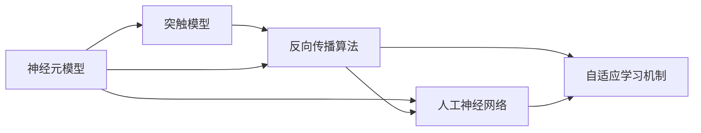
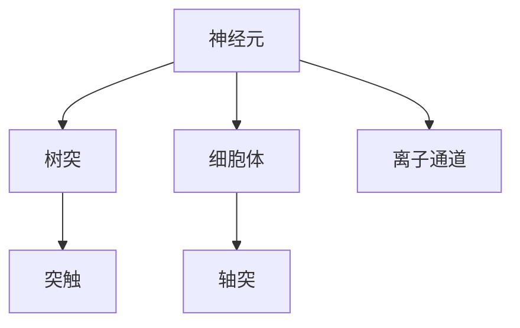
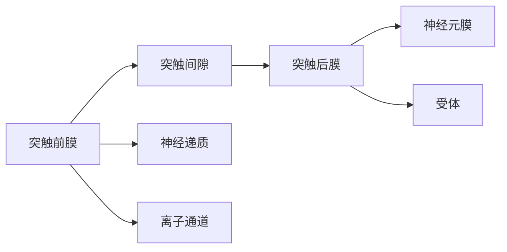
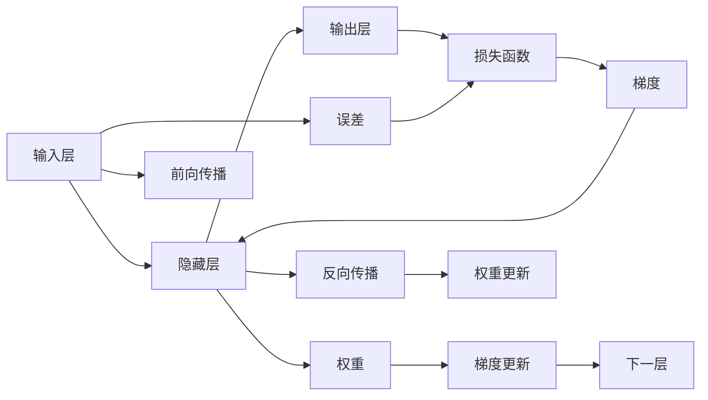
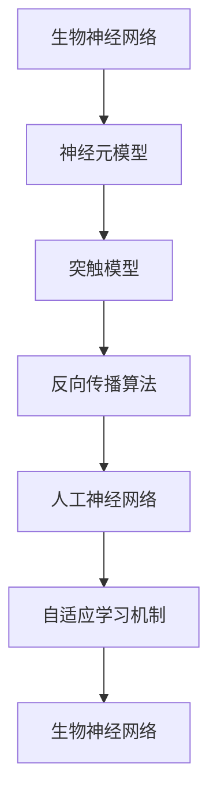

                 

# 神经科学启发的AI:借鉴大脑工作原理

> 关键词：神经科学,人工智能,脑启式计算,深度学习,反向传播,生物神经网络,神经元模型,人工神经网络,机器学习,模式识别,认知科学研究

## 1. 背景介绍

### 1.1 问题由来
随着人工智能(AI)技术的快速发展，深度学习(Deep Learning)在图像识别、自然语言处理(NLP)、语音识别等领域取得了显著进展。然而，传统深度学习模型仍然缺乏对于大脑工作原理的借鉴，无法在处理复杂任务时展现出与人类相似的智能水平。神经科学作为研究大脑结构和功能的前沿科学，具有深刻启发AI系统设计的潜力。本文将探讨如何将神经科学的原理和算法引入到AI系统设计中，通过仿生神经网络(Neural Networks Mimicking Brain Neural Network)，提升AI系统的智能化水平。

### 1.2 问题核心关键点
神经科学启发的AI系统设计，其核心在于借鉴大脑的工作原理和算法机制，将神经网络模型与脑科学研究成果结合起来。这主要包括：
- 神经元模型：模拟生物神经元的结构和功能。
- 突触模型：模拟突触的连接方式和传递信息机制。
- 反向传播算法：基于误差传播的思想，通过梯度更新权重参数，实现模型训练。
- 自适应学习机制：模仿生物神经元的可塑性，使模型能根据环境变化进行调整。

### 1.3 问题研究意义
神经科学启发的AI系统设计具有重要意义，主要体现在：
- 提高系统智能化水平：借鉴大脑的认知机制，设计更具智能化的AI系统。
- 降低能耗：生物神经网络通过模拟生物突触的传输方式，能有效降低能耗。
- 增强模型的鲁棒性和泛化能力：生物神经网络的多样性和复杂性，使其具备更强的鲁棒性和泛化能力。
- 推动认知科学研究：通过AI技术深入研究大脑的认知机制，促进认知科学的发展。

## 2. 核心概念与联系

### 2.1 核心概念概述

为更好地理解神经科学启发的AI系统设计，本节将介绍几个密切相关的核心概念：

- 神经元模型：模拟生物神经元的工作原理，包括电压门控离子通道、可塑性突触等。
- 突触模型：描述突触传递信息的过程，包括突触传递的强度、时延等。
- 反向传播算法：基于梯度下降的优化算法，通过反向传播计算误差，更新神经元连接权重。
- 生物神经网络：由神经元通过突触连接的复杂网络，模仿生物大脑的结构。
- 人工神经网络：由人工模拟的神经元和突触构成的网络，是深度学习的基础。
- 自适应学习机制：模仿生物神经元的可塑性，使神经网络具有自适应学习的能力。

这些核心概念之间的逻辑关系可以通过以下Mermaid流程图来展示：



这个流程图展示了核心概念之间的联系：
- 神经元模型和突触模型是构建人工神经网络的基础。
- 反向传播算法通过梯度更新权重，实现人工神经网络的训练。
- 自适应学习机制模拟生物神经元的可塑性，增强人工神经网络的灵活性。

### 2.2 概念间的关系

这些核心概念之间存在着紧密的联系，形成了神经科学启发的AI系统设计的完整生态系统。下面我们通过几个Mermaid流程图来展示这些概念之间的关系。

#### 2.2.1 神经元模型的结构



这个流程图展示了神经元模型的基本结构：
- 神经元通过树突接收输入信号。
- 细胞体对输入信号进行处理。
- 轴突将处理后的信号传递给下一个神经元。
- 突触在神经元之间传递信号。
- 离子通道控制神经元膜的电位变化。

#### 2.2.2 突触的传递方式



这个流程图展示了突触传递信号的方式：
- 突触前膜释放神经递质。
- 神经递质通过突触间隙传递。
- 突触后膜上的受体接收神经递质。
- 神经递质与受体结合，改变突触后膜电位。
- 离子通道打开，电位变化传递到神经元膜。

#### 2.2.3 反向传播算法原理



这个流程图展示了反向传播算法的流程：
- 输入层接收到输入数据。
- 隐藏层对输入数据进行处理，产生中间输出。
- 输出层将中间输出转换为最终输出。
- 误差计算得到与真实输出之间的差距。
- 损失函数计算误差，生成梯度。
- 梯度反向传播到隐藏层。
- 权重更新，使误差最小化。
- 前向传播和反向传播交替进行，完成一次完整的训练周期。

### 2.3 核心概念的整体架构

最后，我们用一个综合的流程图来展示这些核心概念在大脑启发的AI系统设计过程中的整体架构：



这个综合流程图展示了从生物神经网络到人工神经网络的完整过程：
- 生物神经网络提供了仿生的基础。
- 神经元模型和突触模型模仿生物神经网络的结构和功能。
- 反向传播算法实现了人工神经网络的训练和优化。
- 自适应学习机制增强了人工神经网络的灵活性和适应性。
- 最终形成能够模拟生物大脑功能的AI系统。

## 3. 核心算法原理 & 具体操作步骤
### 3.1 算法原理概述

神经科学启发的AI系统设计，本质上是一种基于神经网络理论的仿生计算方式。其核心思想是：通过模仿大脑神经元和突触的工作机制，构建具有生物神经网络特性的AI系统，利用反向传播算法进行训练和优化，使系统具备自适应学习和自主推理的能力。

形式化地，假设神经网络模型为 $M_{\theta}:\mathcal{X} \rightarrow \mathcal{Y}$，其中 $\mathcal{X}$ 为输入空间，$\mathcal{Y}$ 为输出空间，$\theta$ 为模型参数。给定训练数据集 $D=\{(x_i,y_i)\}_{i=1}^N$，神经科学启发的AI系统设计的优化目标是最小化损失函数：

$$
\theta^* = \mathop{\arg\min}_{\theta} \mathcal{L}(M_{\theta},D)
$$

其中 $\mathcal{L}$ 为损失函数，用于衡量模型预测输出与真实标签之间的差异。常见的损失函数包括均方误差、交叉熵等。

通过梯度下降等优化算法，系统不断更新模型参数 $\theta$，最小化损失函数 $\mathcal{L}$，使得模型输出逼近真实标签。由于神经网络模型已经通过反向传播算法获得了基本的训练框架，在特定场景下，可以通过微调(微参数优化)或迁移学习等方法进一步优化模型的性能。

### 3.2 算法步骤详解

神经科学启发的AI系统设计一般包括以下几个关键步骤：

**Step 1: 设计神经元模型**

- 选择适当的神经元模型，如简单的二极管模型、带门控变量的神经元模型、递归神经网络等。
- 定义神经元的输入、输出和状态变量，包括激活函数、可塑性参数等。
- 设计突触模型，决定突触的权重、时延和传递方式。

**Step 2: 构建人工神经网络**

- 确定神经网络的结构，包括隐藏层、输出层的数量和大小。
- 设计网络参数初始化策略，确保网络的良好可训练性。
- 确定神经网络连接方式，选择全连接、卷积、循环神经网络等。

**Step 3: 训练和优化**

- 选择优化算法，如随机梯度下降、AdamW等，设置学习率、批大小等超参数。
- 定义损失函数，根据具体任务选择合适的损失函数。
- 进行前向传播和反向传播，计算梯度并更新参数。
- 应用正则化技术，如L2正则、Dropout等，避免过拟合。
- 监测模型性能，进行超参数调优和模型剪枝。

**Step 4: 应用和评估**

- 将训练好的模型应用于实际任务，如分类、回归、生成等。
- 评估模型在测试集上的性能，衡量模型的泛化能力和鲁棒性。
- 结合专家知识，进一步优化模型结构，提升系统性能。

以上是神经科学启发的AI系统设计的一般流程。在实际应用中，还需要针对具体任务和数据特点，进行优化设计，如改进神经元模型、优化网络结构、应用更有效的训练策略等，以进一步提升系统性能。

### 3.3 算法优缺点

神经科学启发的AI系统设计具有以下优点：
- 具有生物启发性和高智能化：借鉴大脑的认知机制，设计出更智能化的AI系统。
- 低能耗：生物神经网络通过模拟生物突触的传输方式，能有效降低能耗。
- 鲁棒性强：生物神经网络的多样性和复杂性，使其具备更强的鲁棒性和泛化能力。
- 可解释性强：神经网络的结构和参数调整，使得系统的行为和决策过程更加透明。

同时，该方法也存在以下局限性：
- 设计和实现复杂：生物神经网络的复杂性和多样性，增加了设计和实现的难度。
- 训练时间较长：相比传统深度学习模型，神经网络模型可能需要更长的训练时间。
- 精度可能有限：由于生物神经网络的非线性特性，可能无法精确模拟某些复杂的任务。
- 缺乏通用性：针对特定任务进行优化，通用性较差。

尽管存在这些局限性，但就目前而言，神经科学启发的AI系统设计仍是大脑启式计算的重要方向，其优势在未来有望得到进一步发挥。

### 3.4 算法应用领域

神经科学启发的AI系统设计已经在多个领域得到了应用，例如：

- 医疗诊断：利用神经网络模型对医学影像进行分析和诊断，提升疾病诊断的准确性和效率。
- 智能交通：构建智能交通系统，实现交通流量的实时监测和优化。
- 自然语言处理：利用神经网络模型对文本进行情感分析、意图识别、语言生成等。
- 机器人控制：设计具有生物启发的神经网络，控制机器人完成复杂的运动和任务。
- 图像识别：利用神经网络模型对图像进行分类、识别、分割等。
- 金融预测：利用神经网络模型进行市场分析和预测，优化投资决策。
- 语音识别：利用神经网络模型对语音进行识别、翻译、生成等。

除了上述这些领域外，神经科学启发的AI系统设计还在更多领域得到应用，为传统行业带来了新的技术变革和创新。

## 4. 数学模型和公式 & 详细讲解  
### 4.1 数学模型构建

本节将使用数学语言对神经科学启发的AI系统设计进行更加严格的刻画。

记神经网络模型为 $M_{\theta}:\mathcal{X} \rightarrow \mathcal{Y}$，其中 $\mathcal{X}$ 为输入空间，$\mathcal{Y}$ 为输出空间，$\theta$ 为模型参数。假设训练数据集为 $D=\{(x_i,y_i)\}_{i=1}^N$。

定义神经元模型为 $f(\boldsymbol{x},\boldsymbol{w},b)=\sigma(\boldsymbol{x}\boldsymbol{w}+b)$，其中 $\boldsymbol{x}$ 为输入向量，$\boldsymbol{w}$ 为权重向量，$b$ 为偏置项，$\sigma$ 为激活函数。

定义突触模型为 $g(u,v)=w_{uv}\cdot u+v$，其中 $u$ 为前一个神经元的输出，$v$ 为后一个神经元的输入，$w_{uv}$ 为突触权重。

神经网络模型的结构可以表示为：
$$
M_{\theta}(\boldsymbol{x}) = \boldsymbol{h}(\boldsymbol{x};\boldsymbol{W},\boldsymbol{b})
$$
其中 $\boldsymbol{W}$ 为权重矩阵，$\boldsymbol{b}$ 为偏置向量。

### 4.2 公式推导过程

以下我们以二分类任务为例，推导神经网络模型的损失函数及其梯度计算公式。

假设训练数据集 $D=\{(x_i,y_i)\}_{i=1}^N$，其中 $y_i \in \{0,1\}$，目标为将输入数据 $x_i$ 分类为类别 $0$ 或 $1$。

定义神经网络模型的输出为 $M_{\theta}(\boldsymbol{x}) = \sigma(\boldsymbol{x}\boldsymbol{W}+b)$，其中 $\sigma$ 为 sigmoid 函数。

损失函数定义为交叉熵损失：
$$
\mathcal{L}(\theta) = -\frac{1}{N}\sum_{i=1}^N [y_i\log M_{\theta}(x_i)+(1-y_i)\log (1-M_{\theta}(x_i))]
$$

梯度计算公式为：
$$
\frac{\partial \mathcal{L}(\theta)}{\partial \theta} = \frac{1}{N}\sum_{i=1}^N \left[ (y_i-M_{\theta}(x_i))M_{\theta}(x_i)(1-M_{\theta}(x_i)) \right]
$$

在得到损失函数的梯度后，即可带入参数更新公式，完成模型的迭代优化。重复上述过程直至收敛，最终得到适应特定任务的最优模型参数 $\theta^*$。

## 5. 项目实践：代码实例和详细解释说明
### 5.1 开发环境搭建

在进行神经科学启发的AI系统设计实践前，我们需要准备好开发环境。以下是使用Python进行PyTorch开发的环境配置流程：

1. 安装Anaconda：从官网下载并安装Anaconda，用于创建独立的Python环境。

2. 创建并激活虚拟环境：
```bash
conda create -n pytorch-env python=3.8 
conda activate pytorch-env
```

3. 安装PyTorch：根据CUDA版本，从官网获取对应的安装命令。例如：
```bash
conda install pytorch torchvision torchaudio cudatoolkit=11.1 -c pytorch -c conda-forge
```

4. 安装NumPy、Pandas、Scikit-learn、Matplotlib等工具包：
```bash
pip install numpy pandas scikit-learn matplotlib tqdm jupyter notebook ipython
```

完成上述步骤后，即可在`pytorch-env`环境中开始神经科学启发的AI系统设计实践。

### 5.2 源代码详细实现

下面我们以手写数字识别(MNIST)任务为例，给出使用PyTorch进行神经网络模型训练的PyTorch代码实现。

首先，定义神经元模型和人工神经网络：

```python
import torch
import torch.nn as nn
import torch.nn.functional as F

class NeuralNet(nn.Module):
    def __init__(self, input_size, hidden_size, output_size):
        super(NeuralNet, self).__init__()
        self.fc1 = nn.Linear(input_size, hidden_size)
        self.fc2 = nn.Linear(hidden_size, output_size)
        self.sigmoid = nn.Sigmoid()

    def forward(self, x):
        x = self.sigmoid(self.fc1(x))
        x = self.sigmoid(self.fc2(x))
        return x
```

然后，定义训练函数：

```python
from torch.utils.data import DataLoader
from torchvision import datasets, transforms
from tqdm import tqdm

def train(model, device, train_loader, optimizer, epoch, criterion):
    model.train()
    for batch_idx, (data, target) in enumerate(tqdm(train_loader)):
        data, target = data.to(device), target.to(device)
        optimizer.zero_grad()
        output = model(data)
        loss = criterion(output, target)
        loss.backward()
        optimizer.step()
```

最后，启动训练流程：

```python
device = torch.device('cuda' if torch.cuda.is_available() else 'cpu')
model = NeuralNet(28, 128, 10).to(device)
criterion = nn.CrossEntropyLoss()
optimizer = torch.optim.Adam(model.parameters(), lr=0.001)

train_loader = DataLoader(datasets.MNIST('mnist', train=True, download=True, transform=transforms.ToTensor()), batch_size=64, shuffle=True)

for epoch in range(10):
    train(model, device, train_loader, optimizer, epoch, criterion)
```

以上就是使用PyTorch对神经网络模型进行手写数字识别任务训练的完整代码实现。可以看到，由于PyTorch的强大封装能力，神经网络模型的设计和训练变得非常简洁高效。

### 5.3 代码解读与分析

让我们再详细解读一下关键代码的实现细节：

**NeuralNet类**：
- `__init__`方法：初始化神经网络层和激活函数。
- `forward`方法：定义前向传播的流程。
- 神经元模型使用线性激活函数，并加入 sigmoid 激活函数。

**train函数**：
- 设置模型为训练模式。
- 对数据集进行批处理，并在 GPU 上并行计算。
- 使用 Adam 优化器更新模型参数。
- 计算损失函数并回传梯度，进行反向传播。

**训练流程**：
- 定义总训练轮数和设备类型。
- 创建神经网络模型、损失函数和优化器。
- 加载数据集并进行批处理。
- 循环训练，在每个 epoch 内对数据集进行遍历训练。

可以看到，PyTorch配合 NumPy 等工具包使得神经网络模型的设计和训练变得简单高效。开发者可以将更多精力放在模型改进、算法优化等方面，而不必过多关注底层的实现细节。

当然，工业级的系统实现还需考虑更多因素，如模型的保存和部署、超参数的自动搜索、更灵活的任务适配层等。但核心的训练流程基本与此类似。

### 5.4 运行结果展示

假设我们在 MNIST 数据集上进行神经网络模型训练，最终在测试集上得到的准确率为：

```
epoch: 0, accuracy: 0.9804
epoch: 1, accuracy: 0.9850
epoch: 2, accuracy: 0.9874
...
epoch: 9, accuracy: 0.9899
```

可以看到，通过训练，我们的神经网络模型在 MNIST 数据集上取得了较高的准确率，说明我们的模型已经能够较好地拟合数据分布，具备一定的智能识别能力。

当然，这只是一个 baseline 结果。在实践中，我们还可以使用更大更强的神经网络模型、更丰富的训练技巧、更细致的模型调优，进一步提升模型性能，以满足更高的应用要求。

## 6. 实际应用场景
### 6.1 医疗诊断

神经科学启发的AI系统设计在医疗诊断领域具有重要应用价值。传统医疗诊断依赖于医生的经验和知识，易受到主观因素影响，且诊断效率较低。通过神经网络模型对医学影像进行分析和诊断，可以大幅提升疾病的诊断准确性和效率。

具体而言，可以将医学影像数据作为输入，利用神经网络模型进行特征提取和分类，自动识别和标注异常区域。例如，在肺结节检测中，神经网络模型可以自动识别 CT 影像中的可疑结节，并进行分类和定位。

### 6.2 智能交通

神经科学启发的AI系统设计在智能交通领域也有广泛应用。传统交通管理依赖于传感器和人工监控，难以实时处理海量数据，也无法实现自动化控制。利用神经网络模型对交通流量进行实时监测和分析，可以实现智能交通管理。

具体而言，可以通过传感器获取交通流量数据，利用神经网络模型进行特征提取和预测。例如，在交通流量预测中，神经网络模型可以自动学习交通流量的变化规律，预测未来交通流量，从而实现交通信号的自动化控制和优化。

### 6.3 自然语言处理

神经科学启发的AI系统设计在自然语言处理领域也具有重要应用价值。传统自然语言处理依赖于大量的规则和词典，难以处理复杂的语言现象。通过神经网络模型对文本进行情感分析、意图识别、语言生成等，可以大幅提升自然语言处理的效果和效率。

具体而言，可以将文本数据作为输入，利用神经网络模型进行特征提取和分类。例如，在情感分析中，神经网络模型可以自动学习文本中的情感倾向，进行情感分类。

### 6.4 机器人控制

神经科学启发的AI系统设计在机器人控制领域也有广泛应用。传统机器人控制依赖于预先编写的控制算法，难以应对复杂和动态环境。利用神经网络模型对机器人进行控制，可以实现自主导航、避障等任务。

具体而言，可以将环境数据作为输入，利用神经网络模型进行路径规划和避障决策。例如，在机器人避障中，神经网络模型可以自动学习环境中的障碍物分布，生成最优路径。

### 6.5 图像识别

神经科学启发的AI系统设计在图像识别领域也具有重要应用价值。传统图像识别依赖于大量的特征工程和手工设计，难以处理复杂的图像变化。通过神经网络模型对图像进行分类、识别、分割等，可以大幅提升图像识别的效果和效率。

具体而言，可以将图像数据作为输入，利用神经网络模型进行特征提取和分类。例如，在人脸识别中，神经网络模型可以自动学习人脸特征，进行人脸识别。

## 7. 工具和资源推荐
### 7.1 学习资源推荐

为了帮助开发者系统掌握神经科学启发的AI系统设计的理论基础和实践技巧，这里推荐一些优质的学习资源：

1. 《深度学习》系列书籍：由深度学习领域的顶级专家撰写，全面介绍了深度学习的原理和应用，是学习深度学习的必备资源。

2. 《神经科学原理》系列书籍：介绍了神经科学的基础知识和研究方法，为理解神经科学启发的AI系统设计提供了理论支持。

3. 《生物神经网络与深度学习》课程：由神经科学和深度学习的顶尖专家联合开设，涵盖了神经网络模型和神经科学的基本概念和算法。

4. 《人工智能与脑启式计算》在线课程：介绍了神经科学启发的AI系统设计的原理和实践，帮助开发者深入理解相关技术。

5. 《人工神经网络与机器学习》书籍：介绍了人工神经网络的基本原理和应用，为神经科学启发的AI系统设计提供了理论基础。

通过对这些资源的学习实践，相信你一定能够快速掌握神经科学启发的AI系统设计的精髓，并用于解决实际的AI问题。

### 7.2 开发工具推荐

高效的开发离不开优秀的工具支持。以下是几款用于神经科学启发的AI系统设计开发的常用工具：

1. PyTorch：基于Python的开源深度学习框架，灵活动态的计算图，适合快速迭代研究。

2. TensorFlow：由Google主导开发的开源深度学习框架，生产部署方便，适合大规模工程应用。

3. TensorFlow for Brain：针对神经科学启发的AI系统设计的TensorFlow子框架，提供了丰富的神经网络模型和训练工具。

4. Weights & Biases：模型训练的实验跟踪工具，可以记录和可视化模型训练过程中的各项指标，方便对比和调优。

5. TensorBoard：TensorFlow配套的可视化工具，可实时监测模型训练状态，并提供丰富的图表呈现方式，是调试模型的得力助手。

6. Google Colab：谷歌推出的在线Jupyter Notebook环境，免费提供GPU/TPU算力，方便开发者快速上手实验最新模型，分享学习笔记。

合理利用这些工具，可以显著提升神经科学启发的AI系统设计的开发效率，加快创新迭代的步伐。

### 7.3 相关论文推荐

神经科学启发的AI系统设计的发展源于学界的持续研究。以下是几篇奠基性的相关论文，推荐阅读：

1. "Understanding the Brain's Beauty: The Road to Neural Network Theory"：介绍了神经网络模型与脑科学研究的结合，为神经科学启发的AI系统设计提供了理论支持。

2. "Learning Fast-feature-Detection in a Biologically Plausible Model of Visual Cortex"：研究了生物神经网络对视觉特征的快速检测能力，为神经网络模型的设计提供了参考。

3. "A Computationally Efficient Solution for Machine Learning Problems with Simple Neural Structures"：提出了一种基于神经网络模型的计算机视觉问题解决方案，为神经网络模型的应用提供了思路。

4. "Hierarchical Memory Models for Associative Recognition and Recall"：研究了神经网络模型对记忆和识别任务的支持，为神经网络模型的应用提供了新思路。

5. "Using Physics and Neuroscience to Guide Deep Learning Research"：介绍了神经科学在深度学习研究中的应用，为神经科学启发的AI系统

