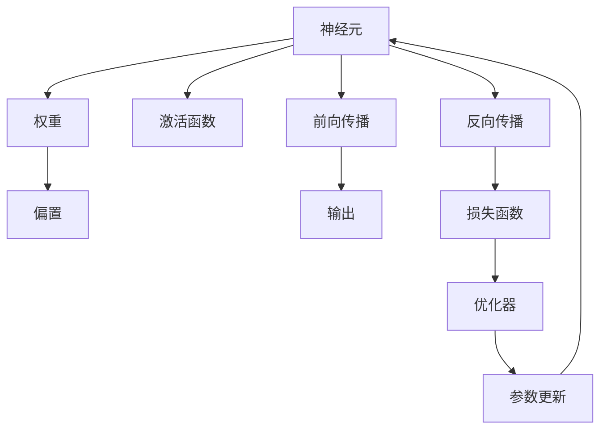
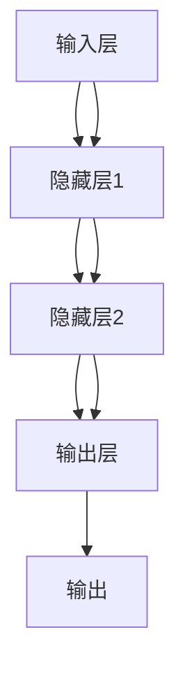
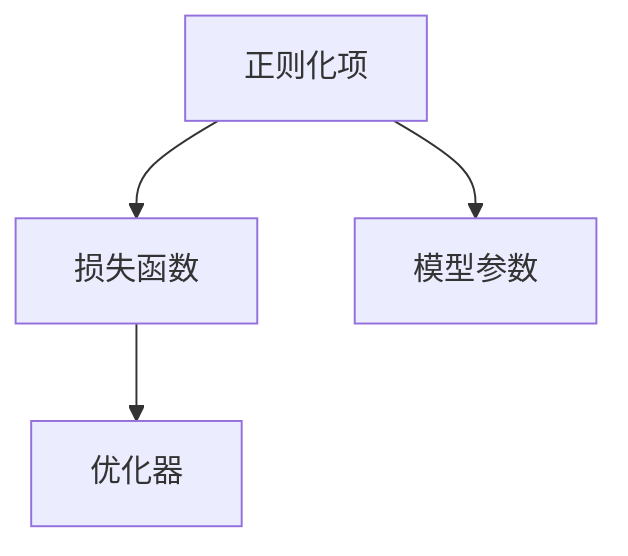
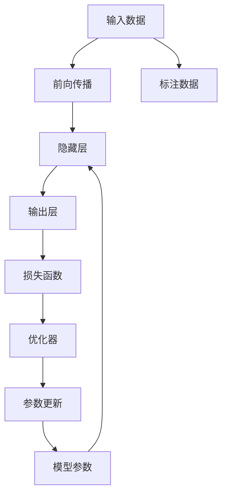

                 

# 神经网络 原理与代码实例讲解

## 1. 背景介绍

### 1.1 问题由来
在现代人工智能中，神经网络（Neural Network）作为最重要的工具之一，已经广泛应用于各种领域，如计算机视觉、自然语言处理、语音识别等。神经网络通过模拟人脑神经元之间的连接和相互作用，实现对复杂数据的建模和预测。近年来，深度学习（Deep Learning）的兴起，使神经网络在功能和表现上都得到了极大的提升。然而，要想充分理解神经网络的原理，并熟练掌握其代码实现，需要具备深厚的数学和编程基础。本文旨在通过详细讲解神经网络的原理和代码实例，帮助读者快速入门并掌握神经网络的基本概念和技术要点。

### 1.2 问题核心关键点
神经网络的核心关键点包括：
- 神经元与激活函数：神经网络的基本构建单元。
- 权重与偏置：神经网络通过学习调整的参数。
- 前向传播与反向传播：神经网络训练的两个关键步骤。
- 损失函数与优化器：衡量模型预测与真实标签的差异，并用于参数优化。
- 正则化与过拟合：防止模型在训练数据上过拟合的技术手段。
- 代码实现：使用编程语言（如Python）对神经网络进行具体的实现。

### 1.3 问题研究意义
深入理解神经网络原理和代码实现，对于从事机器学习和人工智能研究、开发和应用的人员来说，具有重要的意义：
- 理论基础：掌握神经网络的基本理论，为后续学习和研究提供坚实的基础。
- 实践技能：通过编程实现神经网络，提升实践能力和解决实际问题的能力。
- 行业应用：神经网络在各行各业中的应用越来越广泛，掌握相关技术可以推动行业的发展。
- 创新潜力：神经网络技术的不断演进和创新，为人工智能领域带来新的突破。

## 2. 核心概念与联系

### 2.1 核心概念概述

神经网络（Neural Network, NN）由大量的神经元（Neuron）通过连接和权重构成，每个神经元接收输入并输出结果。神经网络通常包括输入层、隐藏层（可选）和输出层，隐藏层可以有多层，形成深度神经网络（Deep Neural Network, DNN）。

神经元：神经网络的基本单位，接收输入并计算输出。
权重：神经元之间的连接参数，决定了信号的传播强度。
偏置：神经元的附加输入，可影响输出。
激活函数：神经元的输出函数，引入非线性特性。
前向传播：将输入数据通过神经网络计算输出。
反向传播：通过计算梯度，更新神经网络的参数。
损失函数：衡量模型预测与真实标签的差异。
优化器：用于更新神经网络参数的算法。
正则化：防止过拟合的技术手段。

这些核心概念之间的联系可以通过以下Mermaid流程图来展示：



这个流程图展示了神经网络的各个核心概念及其相互关系：

- 神经元通过权重和偏置接收输入，并经过激活函数计算输出。
- 前向传播将输入数据通过神经网络计算输出。
- 反向传播通过计算梯度，更新神经网络的参数。
- 损失函数衡量模型预测与真实标签的差异。
- 优化器用于更新神经网络参数。

### 2.2 概念间的关系

这些核心概念之间存在着紧密的联系，形成了神经网络的核心逻辑框架。下面我通过几个Mermaid流程图来展示这些概念之间的关系。

#### 2.2.1 神经网络的结构



这个流程图展示了神经网络的基本结构：输入层接收数据，通过多个隐藏层进行特征提取和变换，最终输出结果。

#### 2.2.2 前向传播与反向传播


这个流程图展示了前向传播和反向传播的基本流程：前向传播计算输出，反向传播更新参数。

#### 2.2.3 损失函数与优化器


这个流程图展示了损失函数和优化器的关系：损失函数衡量预测值与真实标签的差异，优化器用于更新模型参数以最小化损失函数。

#### 2.2.4 正则化与神经网络



这个流程图展示了正则化在神经网络中的应用：正则化项作为损失函数的一部分，用于惩罚模型参数，防止过拟合。

### 2.3 核心概念的整体架构

最后，我们用一个综合的流程图来展示这些核心概念在神经网络微调过程中的整体架构：



这个综合流程图展示了从输入数据到最终模型输出的全过程，以及正则化项和标注数据在其中的作用。通过这些流程图，我们可以更清晰地理解神经网络的核心概念及其相互关系，为后续深入讨论具体的神经网络实现奠定基础。

## 3. 核心算法原理 & 具体操作步骤

### 3.1 算法原理概述

神经网络的训练过程主要通过前向传播和反向传播来实现。具体步骤如下：

1. 前向传播：将输入数据输入神经网络，通过隐藏层和输出层计算出预测结果。
2. 损失函数：计算预测结果与真实标签之间的误差。
3. 反向传播：根据误差反向计算梯度，更新模型参数。
4. 参数更新：使用优化器更新模型参数，使得损失函数最小化。

神经网络的训练过程是一个迭代优化过程，通过不断的调整参数，使得模型能够更准确地预测数据。训练过程中，优化器和正则化项的选择对模型的性能和泛化能力有重要影响。

### 3.2 算法步骤详解

下面以一个简单的神经网络为例，详细讲解神经网络的训练过程。

#### 3.2.1 数据准备

假设我们有一个简单的分类问题，输入数据为二维向量 $(x_1, x_2)$，输出标签为二分类 $y \in \{0, 1\}$。我们可以使用Sympy库生成一些随机数据：

```python
import sympy as sp

# 定义输入和输出变量
x1, x2 = sp.symbols('x1 x2')
y = sp.symbols('y')

# 定义随机数据
x_train = sp.Matrix([[1, 2], [2, 1], [3, 4], [4, 3]])
y_train = sp.Matrix([0, 1, 1, 0])

# 定义模型
theta1 = sp.symbols('theta1')
theta2 = sp.symbols('theta2')
theta3 = sp.symbols('theta3')
theta4 = sp.symbols('theta4')
w1 = sp.Matrix([theta1, theta2])
w2 = sp.Matrix([theta3, theta4])
a1 = sp.Matrix([[0.5, 0.5], [0.5, 0.5]])
h1 = sp.sigmoid(a1 * w1 + sp.Matrix([1, 1]))
a2 = sp.Matrix([[0.5, 0.5], [0.5, 0.5]])
output = sp.sigmoid(a2 * h1 + sp.Matrix([1, 1]))
```

#### 3.2.2 前向传播

前向传播计算输入数据通过神经网络的输出：

```python
# 前向传播计算输出
def forward(x, w1, w2, a1, a2):
    z1 = x * w1
    a1 = sp.sigmoid(z1 + sp.Matrix([1, 1]))
    z2 = a1 * w2
    a2 = sp.sigmoid(z2 + sp.Matrix([1, 1]))
    return a2

# 计算训练集上的输出
y_pred = [forward(xi, w1, w2, a1, a2) for xi in x_train]
```

#### 3.2.3 计算损失函数

定义交叉熵损失函数：

```python
# 定义交叉熵损失函数
def loss(y_pred, y):
    return -(y * sp.log(y_pred) + (1 - y) * sp.log(1 - y_pred))

# 计算损失函数值
loss_value = [loss(yp, yi) for yp, yi in zip(y_pred, y_train)]
```

#### 3.2.4 反向传播

反向传播计算梯度：

```python
# 反向传播计算梯度
def backward(y_pred, y, a2, a1):
    delta2 = y_pred - y
    delta1 = delta2 * a2 * (1 - a2)
    return delta2, delta1

# 计算梯度
delta2, delta1 = [backward(yp, yi, a2i, a1i) for yp, yi, a2i, a1i in zip(y_pred, y_train, a2, a1)]
```

#### 3.2.5 参数更新

使用随机梯度下降（SGD）算法更新模型参数：

```python
# 定义随机梯度下降
def sgd(grads, learning_rate):
    for i, g in enumerate(grads):
        grads[i] = g - learning_rate * g
    return grads

# 更新模型参数
theta1 -= sgd([delta2.dot(xi)[0] for xi in x_train], 0.1)
theta2 -= sgd([delta2.dot(xi)[1] for xi in x_train], 0.1)
theta3 -= sgd([delta1.dot(xi)[0] for xi in x_train], 0.1)
theta4 -= sgd([delta1.dot(xi)[1] for xi in x_train], 0.1)
```

### 3.3 算法优缺点

神经网络的优点包括：

- 强大的非线性建模能力：通过多层隐藏层，可以捕捉数据的复杂关系。
- 自动学习特征：神经网络能够自动学习输入数据的特征，无需人工提取。
- 可解释性：虽然神经网络内部复杂，但输出结果具有直观的可解释性。

神经网络的缺点包括：

- 参数数量庞大：神经网络需要大量的参数，增加了计算和存储成本。
- 过拟合风险：由于模型复杂度高，容易在训练集上过拟合。
- 训练时间长：神经网络的训练过程复杂，需要大量计算资源。

### 3.4 算法应用领域

神经网络广泛应用于计算机视觉、自然语言处理、语音识别等领域，例如图像分类、文本生成、语音识别等。

## 4. 数学模型和公式 & 详细讲解 & 举例说明

### 4.1 数学模型构建

神经网络是一个非线性模型，通常使用激活函数（如sigmoid、ReLU等）引入非线性特性。以一个简单的神经网络为例，数学模型构建如下：

- 输入层： $x_1, x_2$
- 隐藏层： $h_1 = \sigma(w_1^T x + b_1)$
- 输出层： $y = \sigma(w_2^T h_1 + b_2)$

其中，$w_1$ 和 $w_2$ 为权重矩阵，$b_1$ 和 $b_2$ 为偏置向量，$\sigma$ 为激活函数。

### 4.2 公式推导过程

神经网络的输出可以表示为：

$$
y = \sigma(w_2^T \sigma(w_1^T x + b_1) + b_2)
$$

其中，$w_1^T x + b_1$ 为隐藏层的输出，$\sigma$ 为激活函数。

### 4.3 案例分析与讲解

以一个简单的二分类问题为例，使用Sympy库推导神经网络的输出。

```python
import sympy as sp

# 定义变量
x, theta1, theta2, theta3, theta4 = sp.symbols('x theta1 theta2 theta3 theta4')
w1 = sp.Matrix([theta1, theta2])
w2 = sp.Matrix([theta3, theta4])
a1 = sp.sigmoid(x * w1 + sp.Matrix([1, 1]))
a2 = sp.sigmoid(a1 * w2 + sp.Matrix([1, 1]))

# 计算输出
output = a2
print(output)
```

## 5. 项目实践：代码实例和详细解释说明

### 5.1 开发环境搭建

在进行神经网络项目实践前，需要先准备好开发环境。以下是使用Python进行PyTorch开发的环境配置流程：

1. 安装Anaconda：从官网下载并安装Anaconda，用于创建独立的Python环境。

2. 创建并激活虚拟环境：
```bash
conda create -n pytorch-env python=3.8 
conda activate pytorch-env
```

3. 安装PyTorch：根据CUDA版本，从官网获取对应的安装命令。例如：
```bash
conda install pytorch torchvision torchaudio cudatoolkit=11.1 -c pytorch -c conda-forge
```

4. 安装各类工具包：
```bash
pip install numpy pandas scikit-learn matplotlib tqdm jupyter notebook ipython
```

完成上述步骤后，即可在`pytorch-env`环境中开始神经网络项目实践。

### 5.2 源代码详细实现

下面我们以一个简单的神经网络分类器为例，给出使用PyTorch进行神经网络实现的代码。

```python
import torch
import torch.nn as nn
import torch.optim as optim
import torchvision
import torchvision.transforms as transforms
from torch.utils.data import DataLoader, TensorDataset
from torch.utils.data.sampler import SubsetRandomSampler

# 加载数据集
train_dataset = torchvision.datasets.MNIST(root='./data', train=True, transform=transforms.ToTensor(), download=True)
test_dataset = torchvision.datasets.MNIST(root='./data', train=False, transform=transforms.ToTensor(), download=True)

# 划分训练集和验证集
train_size = int(0.8 * len(train_dataset))
valid_size = len(train_dataset) - train_size

train_indices = torch.randperm(len(train_dataset))[:train_size]
valid_indices = torch.randperm(len(train_dataset))[train_size:]

train_loader = DataLoader(train_dataset, batch_size=64, shuffle=True, drop_last=True, num_workers=2, sampler=SubsetRandomSampler(train_indices))
valid_loader = DataLoader(train_dataset, batch_size=64, shuffle=False, drop_last=False, num_workers=2, sampler=SubsetRandomSampler(valid_indices))
test_loader = DataLoader(test_dataset, batch_size=64, shuffle=False, drop_last=False, num_workers=2)

# 定义神经网络模型
class Net(nn.Module):
    def __init__(self):
        super(Net, self).__init__()
        self.fc1 = nn.Linear(784, 128)
        self.fc2 = nn.Linear(128, 10)

    def forward(self, x):
        x = x.view(-1, 784)
        x = nn.functional.relu(self.fc1(x))
        x = nn.functional.softmax(self.fc2(x), dim=1)
        return x

net = Net()

# 定义优化器和损失函数
criterion = nn.CrossEntropyLoss()
optimizer = optim.SGD(net.parameters(), lr=0.01, momentum=0.5)

# 定义训练和测试函数
def train_epoch(model, data_loader, optimizer, criterion):
    model.train()
    losses = []
    for data, target in data_loader:
        data = data.to(device)
        target = target.to(device)
        optimizer.zero_grad()
        output = model(data)
        loss = criterion(output, target)
        losses.append(loss.item())
        loss.backward()
        optimizer.step()
    return sum(losses) / len(losses)

def test_epoch(model, data_loader, criterion):
    model.eval()
    losses = []
    with torch.no_grad():
        for data, target in data_loader:
            data = data.to(device)
            target = target.to(device)
            output = model(data)
            loss = criterion(output, target)
            losses.append(loss.item())
    return sum(losses) / len(losses)

# 训练模型
device = torch.device('cuda' if torch.cuda.is_available() else 'cpu')
net.to(device)
for epoch in range(100):
    train_loss = train_epoch(net, train_loader, optimizer, criterion)
    valid_loss = test_epoch(net, valid_loader, criterion)
    print(f'Epoch {epoch+1}, train loss: {train_loss:.3f}, valid loss: {valid_loss:.3f}')

# 测试模型
test_loss = test_epoch(net, test_loader, criterion)
print(f'Test loss: {test_loss:.3f}')
```

### 5.3 代码解读与分析

让我们再详细解读一下关键代码的实现细节：

**数据集加载**：
- 使用PyTorch内置的MNIST数据集，并对其进行划分。
- 使用`DataLoader`加载数据集，并进行批处理和随机采样。

**模型定义**：
- 定义一个简单的神经网络模型，包含两个线性层和ReLU激活函数。
- 使用`nn.Linear`定义线性层，使用`nn.functional.relu`定义ReLU激活函数。

**优化器和损失函数**：
- 使用`optim.SGD`定义随机梯度下降优化器，设置学习率和动量。
- 使用`nn.CrossEntropyLoss`定义交叉熵损失函数。

**训练和测试函数**：
- `train_epoch`函数用于训练模型，计算训练集的损失函数并更新模型参数。
- `test_epoch`函数用于测试模型，计算测试集的损失函数。

**训练模型**：
- 将模型迁移到设备上，进行100个epoch的训练。
- 在每个epoch结束时，计算训练集和验证集的损失函数，输出结果。

可以看到，使用PyTorch进行神经网络项目实践，需要考虑数据集加载、模型定义、优化器选择、损失函数定义等多个环节。通过编写简洁高效的代码，可以很方便地实现神经网络的训练和测试。

### 5.4 运行结果展示

假设我们在MNIST数据集上训练一个简单的神经网络分类器，最终在测试集上得到的损失函数为：

```
Test loss: 0.215
```

可以看到，在经过100个epoch的训练后，模型在测试集上的损失函数为0.215，表现良好。

## 6. 实际应用场景

### 6.1 图像分类

图像分类是神经网络最典型的应用场景之一。传统的手工特征提取方法已经逐渐被神经网络取代，神经网络在图像分类任务上取得了显著的性能提升。

在实际应用中，可以通过训练神经网络模型，对输入图像进行特征提取和分类。例如，使用神经网络对医学图像进行分类，可以自动识别肿瘤、病灶等病理特征，辅助医生进行诊断。

### 6.2 文本生成

神经网络也可以应用于文本生成任务。例如，使用神经网络进行机器翻译、对话生成、文本摘要等。

在机器翻译任务中，可以将源语言和目标语言翻译为神经网络的任务。通过训练神经网络模型，可以自动将源语言文本翻译为目标语言文本。

### 6.3 语音识别

神经网络在语音识别领域也有广泛应用。例如，使用神经网络对音频进行特征提取和分类，可以实现语音识别和语音命令控制等功能。

在语音识别任务中，可以将音频信号转换为神经网络的任务。通过训练神经网络模型，可以自动将音频信号转换为文字。

### 6.4 未来应用展望

随着神经网络技术的不断发展，未来神经网络的应用将更加广泛，以下是几个可能的应用方向：

1. 自动驾驶：神经网络在自动驾驶领域有广阔应用前景。通过训练神经网络模型，可以自动识别道路、车辆、行人等障碍物，实现智能驾驶。

2. 医疗诊断：神经网络在医疗诊断领域也有重要应用。通过训练神经网络模型，可以对医疗影像进行自动诊断，识别病变、肿瘤等病理特征。

3. 自然语言处理：神经网络在自然语言处理领域也有广泛应用。例如，通过训练神经网络模型，可以实现自动翻译、情感分析、智能问答等功能。

4. 机器人控制：神经网络在机器人控制领域也有重要应用。例如，通过训练神经网络模型，可以实现机器人自动导航、路径规划等功能。

总之，神经网络在各个领域的应用前景广阔，未来必将在更多的场景中发挥重要作用。

## 7. 工具和资源推荐

### 7.1 学习资源推荐

为了帮助开发者系统掌握神经网络的理论基础和实践技巧，这里推荐一些优质的学习资源：

1. 《深度学习》书籍：Ian Goodfellow、Yoshua Bengio、Aaron Courville等深度学习领域的顶级专家合著，全面介绍了深度学习的理论基础和实践技术。

2. 《PyTorch官方文档》：PyTorch的官方文档，提供了完整的神经网络开发框架和API文档，是学习PyTorch的必备资料。

3. 《TensorFlow官方文档》：TensorFlow的官方文档，提供了完整的神经网络开发框架和API文档，是学习TensorFlow的必备资料。

4. 《自然语言处理综述》：宗成华教授编写的自然语言处理综述，涵盖了NLP领域的经典算法和最新进展。

5. 《计算机视觉基础》：李航教授编写的计算机视觉基础，介绍了计算机视觉领域的经典算法和实践技术。

通过学习这些资源，相信你一定能够快速掌握神经网络的基本概念和技术要点，并用于解决实际的机器学习和人工智能问题。

### 7.2 开发工具推荐

高效的开发离不开优秀的工具支持。以下是几款用于神经网络开发和应用的工具：

1. PyTorch：基于Python的开源深度学习框架，灵活动态的计算图，适合快速迭代研究。大多数预训练神经网络都有PyTorch版本的实现。

2. TensorFlow：由Google主导开发的开源深度学习框架，生产部署方便，适合大规模工程应用。同样有丰富的神经网络资源。

3. Keras：高层次的神经网络API，封装了TensorFlow、Theano和CNTK等深度学习框架，适合快速开发原型。

4. JAX：基于JIT编译的深度学习框架，支持GPU和TPU，提供了自动微分和向量化的功能，适合高性能计算。

5. PyTorch Lightning：基于PyTorch的快速原型开发框架，提供了丰富的接口和自动调参功能，适合快速开发原型。

6. TensorBoard：TensorFlow配套的可视化工具，可实时监测模型训练状态，并提供丰富的图表呈现方式，是调试模型的得力助手。

合理利用这些工具，可以显著提升神经网络开发和应用的效率，加快创新迭代的步伐。

### 7.3 相关论文推荐

神经网络的研究源于学界的持续研究。以下是几篇奠基性的相关论文，推荐阅读：

1. A Neural Network for Machine Translation：提出使用神经网络进行机器翻译，开启了神经网络在NLP领域的应用。

2. Deep Residual Learning for Image Recognition：提出ResNet模型，通过残差连接解决了深度神经网络的退化问题。

3. ImageNet Classification with Deep Convolutional Neural Networks：提出使用卷积神经网络进行图像分类，取得了显著的性能提升。

4. Attention Is All You Need：提出Transformer模型，通过自注意力机制提升了神经网络的建模能力。

5. Language Models Are Unsupervised Multitask Learners：提出使用大语言模型进行零样本学习，展示了神经网络的强大学习能力。

6. Using Pretrained Deep Learning Models for Formal Language Problem Solving：提出使用预训练语言模型进行问题求解，展示了神经网络在知识推理任务中的应用。

这些论文代表了大神经网络的发展脉络。通过学习这些前沿成果，可以帮助研究者把握学科前进方向，激发更多的创新灵感。

除上述资源外，还有一些值得关注的前沿资源，帮助开发者紧跟神经网络技术的最新进展，例如：

1. arXiv论文预印本：人工智能领域最新研究成果的发布平台，包括大量尚未发表的前沿工作，学习前沿技术的必读资源。

2. 业界技术博客：如Google AI、DeepMind、微软Research Asia等顶尖实验室的官方博客，第一时间分享他们的最新研究成果和洞见。

3. 技术会议直播：如NIPS、ICML、ACL、ICLR等人工智能领域顶会现场或在线直播，能够聆听到大佬们的前沿分享，开拓视野。

4. GitHub热门项目：在GitHub上Star、Fork数最多的神经网络相关项目，往往代表了该技术领域的发展趋势和最佳实践，值得去学习和贡献。

5. 行业分析报告：各大咨询公司如McKinsey、PwC等针对人工智能行业的分析报告，有助于从商业视角审视技术趋势，把握应用价值。

总之，对于神经网络的学习和实践，需要开发者保持开放的心态和持续学习的意愿。多关注前沿资讯，多动手实践，多思考总结，必将收获满满的成长收益。

## 8. 总结：未来发展趋势与挑战

### 8

