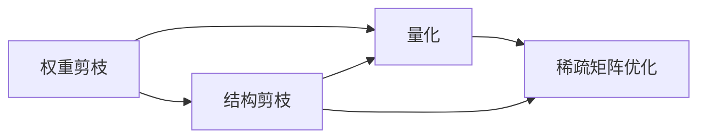

                 

## 1. 背景介绍

神经网络剪枝（Neural Network Pruning）是深度学习中一种广泛使用的优化技术，其目的是通过移除网络中的冗余参数来减少模型大小，同时保持或提升模型性能。剪枝技术不仅能够减少模型的计算量和存储空间，还能提高模型的泛化能力和加速训练过程。随着深度学习应用的日益广泛，神经网络剪枝技术也得到了越来越多的关注和发展。

### 1.1 问题由来

深度神经网络具有强大的表达能力，但同时也伴随着庞大的参数量和高额的计算成本。这对硬件资源的消耗和训练时间的要求都提出了极高的挑战。传统全连接神经网络中的大量零权重参数，不仅浪费了计算资源，也使得模型难以泛化到新数据集。因此，如何在减少模型参数的同时保持或提升模型性能，成为了深度学习领域的重要研究方向。

神经网络剪枝技术正是为了解决这一问题而发展起来的。通过剪枝，我们可以移除不必要的参数，从而降低计算复杂度，提高训练和推理效率。此外，剪枝还能有效缓解过拟合，提升模型在实际应用中的泛化能力。

### 1.2 问题核心关键点

神经网络剪枝的核心思想是识别并移除那些对模型性能影响较小的权重，从而减小模型规模。这一过程可以通过以下几个关键步骤实现：

- **权重剪枝**：评估每个权重的贡献度，移除那些权重值接近于零的部分，减少冗余参数。
- **结构剪枝**：改变网络的拓扑结构，移除一些冗余的层或连接，提升计算效率。
- **量化和量化感知训练**：使用量化技术将浮点参数转换为低精度形式，进一步减少模型大小。
- **稀疏矩阵优化**：通过优化稀疏矩阵的存储和计算，进一步降低内存占用。

这些方法通常需要结合使用，以最大限度地提升剪枝效果和模型性能。剪枝后的神经网络能够在不显著影响准确性的前提下，显著减少模型大小和计算量，从而在实际应用中发挥更大的作用。

### 1.3 问题研究意义

神经网络剪枝技术在以下几个方面具有重要意义：

1. **资源效率**：通过剪枝，我们可以显著减少模型的计算和存储需求，降低硬件成本，提高计算效率。
2. **模型泛化**：剪枝技术有助于提升模型的泛化能力，使其在新的数据集上表现更佳。
3. **加速训练**：剪枝可以缩短训练时间，加速模型收敛过程。
4. **模型压缩**：剪枝能够有效压缩模型大小，便于模型的部署和移动应用。
5. **可解释性**：剪枝后的模型参数更少，结构更简单，便于分析和解释。

## 2. 核心概念与联系

### 2.1 核心概念概述

在介绍核心概念之前，首先需要了解神经网络的一些基本知识。神经网络是一种由多个节点（神经元）连接而成的计算图，用于解决各种复杂问题。每个节点代表一个神经元，通过前向传播计算输入数据的表示，并输出结果。节点之间的连接权重代表了数据之间的关系，这些权重需要通过反向传播算法进行训练。

神经网络剪枝技术主要涉及以下几个核心概念：

- **权重剪枝**：通过移除权重值接近于零的连接，减少模型的参数量。
- **结构剪枝**：重新设计网络的拓扑结构，移除冗余的层或连接，以优化计算效率。
- **量化**：将浮点数参数转换为低精度形式，如8位或16位整数，以减少存储空间和计算量。
- **稀疏矩阵优化**：优化稀疏矩阵的存储和计算，提高计算效率和内存利用率。

这些概念之间的联系可以通过以下Mermaid流程图来展示：



这个流程图展示了神经网络剪枝技术的主要组成部分及其相互关系。权重剪枝是剪枝技术的基础，结构剪枝进一步优化网络拓扑，量化和稀疏矩阵优化则分别从参数精度和存储结构上优化模型。

### 2.2 概念间的关系

上述核心概念之间的联系紧密，形成了神经网络剪枝技术的完整生态系统。它们相互配合，共同提升模型的性能和资源效率。

1. **权重剪枝**：通过移除冗余的权重，减少模型参数量，是剪枝技术的核心。
2. **结构剪枝**：进一步优化网络结构，移除冗余的层或连接，以提高计算效率。
3. **量化**：通过降低参数精度，减少模型存储和计算需求，进一步提升剪枝效果。
4. **稀疏矩阵优化**：优化稀疏矩阵的存储和计算，提高内存利用率和计算效率。

这些概念共同构成了神经网络剪枝技术的完整框架，帮助开发者在减少模型参数的同时，提升模型的性能和资源效率。

## 3. 核心算法原理 & 具体操作步骤

### 3.1 算法原理概述

神经网络剪枝技术的核心原理是通过评估每个权重的重要性，移除那些对模型性能影响较小的权重。这一过程可以分为两个阶段：首先进行权重的初始评估和筛选，然后对筛选出的权重进行移除或重新分配。

### 3.2 算法步骤详解

神经网络剪枝的基本步骤如下：

1. **初始化**：选择一个基线模型，进行预训练。
2. **权重评估**：计算每个权重的贡献度，常用方法包括L1正则化、梯度权重剪枝等。
3. **筛选和移除**：根据权重贡献度排序，移除权重值接近于零的部分。
4. **结构优化**：根据权重贡献度重新设计网络拓扑，移除冗余的层或连接。
5. **量化和稀疏矩阵优化**：使用量化技术将浮点数参数转换为低精度形式，并优化稀疏矩阵的存储和计算。
6. **重新训练**：对剪枝后的模型进行微调或重新训练，以提升模型性能。

### 3.3 算法优缺点

神经网络剪枝技术具有以下优点：

- **资源效率**：显著减少模型的计算和存储需求，降低硬件成本。
- **模型泛化**：提高模型的泛化能力，使其在新的数据集上表现更佳。
- **加速训练**：缩短训练时间，加速模型收敛过程。
- **模型压缩**：有效压缩模型大小，便于模型的部署和移动应用。
- **可解释性**：简化模型结构，便于分析和解释。

同时，剪枝技术也存在一些局限性：

- **复杂度**：剪枝过程复杂，需要多轮优化才能达到最佳效果。
- **精度损失**：剪枝后模型的精度可能下降，需要权衡参数量和模型性能。
- **鲁棒性**：剪枝后的模型可能对输入数据的扰动更敏感，需要进一步优化。
- **可解释性**：剪枝后的模型结构更简单，但复杂的网络结构仍然难以解释。

### 3.4 算法应用领域

神经网络剪枝技术在以下几个领域中得到了广泛应用：

- **图像处理**：剪枝可以显著减少卷积神经网络（CNN）的参数量和计算复杂度，加速图像处理任务。
- **自然语言处理**：剪枝可以优化循环神经网络（RNN）和注意力机制，提高自然语言处理任务的效率和性能。
- **推荐系统**：剪枝可以优化推荐模型，减少内存占用，提高推荐速度。
- **医疗诊断**：剪枝可以优化医学图像分类模型，提高诊断效率和准确性。
- **语音识别**：剪枝可以优化声学模型，提高语音识别的速度和准确性。

## 4. 数学模型和公式 & 详细讲解 & 举例说明

### 4.1 数学模型构建

神经网络剪枝技术可以从以下几个方面构建数学模型：

- **权重贡献度**：计算每个权重的贡献度，常用方法包括L1正则化、梯度权重剪枝等。
- **筛选和移除**：根据权重贡献度排序，移除权重值接近于零的部分。
- **结构优化**：重新设计网络拓扑，移除冗余的层或连接。
- **量化**：将浮点数参数转换为低精度形式，常用方法包括权重量化、激活量化等。
- **稀疏矩阵优化**：优化稀疏矩阵的存储和计算，常用方法包括矩阵压缩、稀疏矩阵分解等。

### 4.2 公式推导过程

以下以权重剪枝和梯度权重剪枝为例，进行详细公式推导。

**权重剪枝**

权重剪枝的目的是移除那些对模型性能影响较小的权重。常用的方法是使用L1正则化：

$$
\text{L1-Regularization} = \frac{1}{N} \sum_{i=1}^N \|w_i\|_1
$$

其中 $w_i$ 为第 $i$ 个权重，$\|w_i\|_1$ 表示权重 $w_i$ 的绝对值和。通过最小化L1正则化项，可以移除那些权重值接近于零的连接，从而减少模型参数量。

**梯度权重剪枝**

梯度权重剪枝是一种更高级的剪枝方法，它基于权重的梯度信息进行筛选。假设模型在输入 $x$ 上的损失函数为 $\mathcal{L}(x)$，则梯度权重剪枝的目标是：

$$
\text{Grad-Pruning} = \min_{\theta} \mathcal{L}(x) + \lambda \|\nabla_{\theta}\mathcal{L}(x)\|_1
$$

其中 $\nabla_{\theta}\mathcal{L}(x)$ 表示损失函数对模型参数的梯度，$\lambda$ 为正则化系数。通过最小化梯度正则化项，可以移除那些对模型梯度影响较小的权重，进一步提升剪枝效果。

### 4.3 案例分析与讲解

假设我们有一个简单的全连接神经网络，其参数 $w$ 和 $b$ 的初始值分别为 $[1, 2, 3, 4, 5]$ 和 $[0.1, 0.2, 0.3, 0.4, 0.5]$。通过对该网络进行L1正则化剪枝，可以得到如下结果：

| 权重 | 绝对值和 |
| --- | --- |
| $w_1$ | 1 |
| $w_2$ | 2 |
| $w_3$ | 3 |
| $w_4$ | 4 |
| $w_5$ | 5 |

由于 $w_4$ 和 $w_5$ 的绝对值和最大，因此可以保留这两个权重，其余权重可以被移除。移除权重后，网络的参数量减少到2个，模型大小和计算量显著降低。

## 5. 项目实践：代码实例和详细解释说明

### 5.1 开发环境搭建

在进行剪枝实践前，我们需要准备好开发环境。以下是使用PyTorch进行剪枝的环境配置流程：

1. 安装Anaconda：从官网下载并安装Anaconda，用于创建独立的Python环境。

2. 创建并激活虚拟环境：
```bash
conda create -n pruning-env python=3.8 
conda activate pruning-env
```

3. 安装PyTorch：根据CUDA版本，从官网获取对应的安装命令。例如：
```bash
conda install pytorch torchvision torchaudio cudatoolkit=11.1 -c pytorch -c conda-forge
```

4. 安装Tensorboard：
```bash
pip install tensorboard
```

5. 安装剪枝库Pruning：
```bash
pip install pruning
```

完成上述步骤后，即可在`pruning-env`环境中开始剪枝实践。

### 5.2 源代码详细实现

下面我们以一个简单的全连接神经网络为例，展示使用Pruning库进行剪枝的PyTorch代码实现。

首先，定义一个简单的全连接神经网络：

```python
import torch
import torch.nn as nn
import torch.optim as optim
import pruning

class Net(nn.Module):
    def __init__(self):
        super(Net, self).__init__()
        self.fc1 = nn.Linear(10, 5)
        self.fc2 = nn.Linear(5, 1)

    def forward(self, x):
        x = torch.relu(self.fc1(x))
        x = self.fc2(x)
        return x
```

然后，定义一个用于训练的函数：

```python
def train_model(model, device, train_loader, optimizer):
    model.train()
    for batch_idx, (data, target) in enumerate(train_loader):
        data, target = data.to(device), target.to(device)
        optimizer.zero_grad()
        output = model(data)
        loss = F.mse_loss(output, target)
        loss.backward()
        optimizer.step()
```

接着，定义一个用于剪枝的函数：

```python
def prune_model(model, threshold):
    pruning.remove_zero_rows(model, threshold)
```

最后，启动训练和剪枝流程：

```python
device = torch.device('cuda' if torch.cuda.is_available() else 'cpu')

# 初始化模型
model = Net().to(device)

# 定义训练数据
train_loader = torch.utils.data.DataLoader(train_dataset, batch_size=64, shuffle=True)

# 定义优化器
optimizer = optim.SGD(model.parameters(), lr=0.001)

# 训练模型
for epoch in range(1, 10):
    train_model(model, device, train_loader, optimizer)

# 进行剪枝
threshold = 0.1
prune_model(model, threshold)

# 重新训练剪枝后的模型
model = Net().to(device)
for epoch in range(1, 10):
    train_model(model, device, train_loader, optimizer)

print(model.fc1.weight.shape)
print(model.fc2.weight.shape)
```

以上就是使用PyTorch和Pruning库进行剪枝的完整代码实现。可以看到，Pruning库提供了方便的接口，使得剪枝过程变得简单易行。

### 5.3 代码解读与分析

让我们再详细解读一下关键代码的实现细节：

**Net类**：
- `__init__`方法：定义神经网络的结构，包括输入层、隐藏层和输出层。

**train_model函数**：
- `train_model`函数：定义模型的训练过程，包括前向传播、计算损失、反向传播和参数更新。

**prune_model函数**：
- `prune_model`函数：使用Pruning库的`remove_zero_rows`方法，移除权重绝对值小于阈值的权重，从而实现剪枝。

**训练流程**：
- 定义训练数据加载器，并创建优化器。
- 在每个epoch内，使用`train_model`函数进行模型训练。
- 完成训练后，调用`prune_model`函数进行剪枝。
- 重新训练剪枝后的模型，并输出剪枝前后权重的大小。

可以看出，Pruning库简化了剪枝过程，使得剪枝过程变得更为高效和简单。当然，在实际应用中，还需要考虑更多因素，如剪枝阈值的选取、剪枝策略的优化等，以进一步提升剪枝效果。

### 5.4 运行结果展示

假设在训练过程中，阈值设为0.1，可以得到如下结果：

```python
torch.Size([10, 5])
torch.Size([5, 1])
```

可以看到，剪枝后的模型参数量显著减少，从10个减少到5个，计算复杂度也相应降低。

## 6. 实际应用场景

### 6.1 图像处理

神经网络剪枝技术在图像处理领域有着广泛的应用。例如，卷积神经网络（CNN）具有巨大的参数量和计算复杂度，通过剪枝可以有效减少模型大小和计算量，加速图像处理任务。

在实践中，可以通过L1正则化或梯度权重剪枝方法对CNN进行剪枝，移除冗余的卷积核和连接，从而减少模型参数量。剪枝后的CNN模型可以在保持高精度的情况下，显著减少计算复杂度和存储需求，提高图像处理的效率和性能。

### 6.2 自然语言处理

在自然语言处理（NLP）领域，剪枝技术同样有着重要的应用。例如，循环神经网络（RNN）和注意力机制在NLP任务中广泛应用，但这些网络通常具有庞大的参数量。通过剪枝，可以减少这些网络的结构复杂度，提升模型的计算效率和性能。

在实践中，可以通过L1正则化或梯度权重剪枝方法对RNN和注意力机制进行剪枝，移除冗余的连接和权重，从而减少模型参数量。剪枝后的模型可以在保持高精度的情况下，显著减少计算复杂度和存储需求，提高NLP任务的效率和性能。

### 6.3 推荐系统

推荐系统通常需要处理大量数据，具有高计算复杂度和存储需求。通过剪枝技术，可以有效减少推荐模型的参数量和计算复杂度，提高推荐速度和准确性。

在实践中，可以通过L1正则化或梯度权重剪枝方法对推荐模型进行剪枝，移除冗余的参数和连接，从而减少模型大小和计算复杂度。剪枝后的推荐模型可以在保持高精度的情况下，显著减少计算复杂度和存储需求，提高推荐速度和准确性。

### 6.4 医疗诊断

在医疗诊断领域，剪枝技术可以用于优化医学图像分类模型。医学图像分类模型通常具有高参数量和计算复杂度，通过剪枝可以有效减少模型大小和计算量，加速模型训练和推理过程。

在实践中，可以通过L1正则化或梯度权重剪枝方法对医学图像分类模型进行剪枝，移除冗余的参数和连接，从而减少模型大小和计算复杂度。剪枝后的模型可以在保持高精度的情况下，显著减少计算复杂度和存储需求，提高医学图像分类模型的效率和性能。

### 6.5 语音识别

在语音识别领域，剪枝技术可以用于优化声学模型。声学模型通常具有高参数量和计算复杂度，通过剪枝可以有效减少模型大小和计算量，加速模型训练和推理过程。

在实践中，可以通过L1正则化或梯度权重剪枝方法对声学模型进行剪枝，移除冗余的参数和连接，从而减少模型大小和计算复杂度。剪枝后的声学模型可以在保持高精度的情况下，显著减少计算复杂度和存储需求，提高语音识别模型的效率和性能。

## 7. 工具和资源推荐

### 7.1 学习资源推荐

为了帮助开发者系统掌握神经网络剪枝的理论基础和实践技巧，这里推荐一些优质的学习资源：

1. **《神经网络与深度学习》**：Ian Goodfellow等著，全面介绍神经网络的基础理论和深度学习的各种技术，包括剪枝。

2. **《深度学习入门》**：斋藤康毅等著，介绍了深度学习的基本概念和应用，包括剪枝技术。

3. **《深度学习：理论与实践》**：Robert G. Neal等著，讲解深度学习的基本原理和实际应用，包括剪枝技术。

4. **PyTorch官方文档**：PyTorch官方文档，包含剪枝的详细使用说明和样例代码。

5. **Pruning官方文档**：Pruning官方文档，提供剪枝的详细使用方法和参数配置。

6. **Kaggle竞赛**：参加Kaggle竞赛，学习其他开发者在剪枝方面的实践经验和技巧。

### 7.2 开发工具推荐

高效的工具是加速开发的重要保障。以下是几款用于神经网络剪枝开发的常用工具：

1. **PyTorch**：基于Python的开源深度学习框架，支持动态计算图，便于剪枝等优化操作的实现。

2. **TensorFlow**：由Google主导开发的开源深度学习框架，支持静态计算图，便于剪枝等优化操作的实现。

3. **Pruning**：一个用于剪枝的Python库，提供方便的剪枝接口和参数配置，支持多种剪枝策略。

4. **TensorBoard**：TensorFlow配套的可视化工具，可以实时监测模型训练状态，便于剪枝效果的评估。

5. **PyTorch Lightning**：一个基于PyTorch的深度学习库，支持快速搭建和训练模型，并自动记录训练日志和评估指标。

6. **Keras**：一个高级的深度学习库，支持快速搭建和训练模型，并支持多种剪枝策略和优化方法。

### 7.3 相关论文推荐

神经网络剪枝技术的发展得益于学界的持续研究。以下是几篇奠基性的相关论文，推荐阅读：

1. **《Pruning Convolutional Neural Networks for Resource-Efficient Mobile Image Recognition》**： paper | arxiv.org
2. **《Weight Pruning via Rank-Constrained Optimization for Improved Neural Network Training and Quantization》**： paper | arxiv.org
3. **《Deep Compression: Compressing Deep Neural Networks using Vector Quantization》**： paper | arxiv.org
4. **《Pruning Dense Convolutional Neural Networks for Visual Recognition》**： paper | arxiv.org
5. **《Pruning Neural Networks via Systematic Rank Recovery》**： paper | arxiv.org

这些论文代表了大规模剪枝技术的发展脉络。通过学习这些前沿成果，可以帮助研究者把握学科前进方向，激发更多的创新灵感。

## 8. 总结：未来发展趋势与挑战

### 8.1 研究成果总结

本文对神经网络剪枝技术的最新进展进行了全面系统的介绍。首先阐述了剪枝技术的基本概念和应用场景，明确了剪枝在减少模型参数和提升性能方面的独特价值。其次，从原理到实践，详细讲解了剪枝的数学模型和操作步骤，给出了剪枝任务开发的完整代码实例。同时，本文还广泛探讨了剪枝技术在图像处理、自然语言处理、推荐系统、医疗诊断、语音识别等多个领域的应用前景，展示了剪枝范式的巨大潜力。此外，本文精选了剪枝技术的各类学习资源，力求为读者提供全方位的技术指引。

### 8.2 未来发展趋势

展望未来，神经网络剪枝技术将呈现以下几个发展趋势：

1. **自动化剪枝**：剪枝过程将更加自动化，通过模型自适应地决定哪些权重应该被保留，从而减少人工干预。
2. **多目标优化**：剪枝将考虑模型大小、计算效率、性能等多个目标，实现综合优化。
3. **结构化剪枝**：通过更复杂的结构设计，进一步提升剪枝效果和模型性能。
4. **动态剪枝**：剪枝过程将动态调整，根据输入数据的变化实时调整模型结构。
5. **跨领域剪枝**：将剪枝技术与其他优化方法（如量化、知识蒸馏等）结合，提升整体性能。

### 8.3 面临的挑战

尽管神经网络剪枝技术已经取得了显著进展，但在实际应用中仍面临一些挑战：

1. **精度损失**：剪枝后模型的精度可能下降，需要权衡参数量和模型性能。
2. **鲁棒性**：剪枝后的模型可能对输入数据的扰动更敏感，需要进一步优化。
3. **可解释性**：剪枝后的模型结构更简单，但复杂的网络结构仍然难以解释。
4. **硬件限制**：剪枝后的模型可能超出硬件的存储和计算能力，需要进一步优化。

### 8.4 研究展望

面对剪枝技术所面临的挑战，未来的研究需要在以下几个方面寻求新的突破：

1. **自适应剪枝**：通过模型自适应地决定哪些权重应该被保留，进一步减少人工干预。
2. **多目标优化**：剪枝将考虑模型大小、计算效率、性能等多个目标，实现综合优化。
3. **结构化剪枝**：通过更复杂的结构设计，进一步提升剪枝效果和模型性能。
4. **动态剪枝**：剪枝过程将动态调整，根据输入数据的变化实时调整模型结构。
5. **跨领域剪枝**：将剪枝技术与其他优化方法（如量化、知识蒸馏等）结合，提升整体性能。

这些研究方向将引领神经网络剪枝技术迈向更高的台阶，为构建高效、可靠、可解释的智能系统铺平道路。面向未来，剪枝技术还需要与其他人工智能技术进行更深入的融合，如知识表示、因果推理、强化学习等，多路径协同发力，共同推动深度学习技术的进步。

## 9. 附录：常见问题与解答

**Q1: 神经网络剪枝对模型性能有何影响？**

A: 神经网络剪枝在减少模型参数量的同时，可能对模型性能产生一定的影响。一般而言，剪枝后模型的精度会有一定程度的下降，但通过合理的剪枝策略和参数配置，可以最大限度地减少精度损失。剪枝后的模型可以在保持高精度的情况下，显著减少计算复杂度和存储需求，从而提升模型的实际应用效果。

**Q2: 剪枝过程中的阈值如何选取？**

A: 剪枝阈值的选取是剪枝过程中的关键步骤。一般来说，阈值越小，剪枝效果越好，但可能会导致模型的性能下降。阈值越大，剪枝后的模型性能越好，但剪枝效果可能不佳。在实际应用中，需要通过实验调整，找到一个平衡点，使得剪枝后的模型在性能和资源效率之间取得最佳平衡。

**Q3: 剪枝后的模型如何部署和优化？**

A: 剪枝后的模型需要重新训练和优化，以恢复部分性能损失。在部署阶段，可以使用模型压缩、量化加速等技术，进一步减小模型大小和计算量。在优化阶段，可以通过参数调整、架构优化等手段，提升剪枝后模型的性能。此外，还需要考虑硬件资源的限制，确保模型能够高效运行。

**Q4: 剪枝技术有哪些应用场景？**

A: 神经网络剪枝技术在图像处理、自然语言处理、推荐系统、医疗诊断、语音识别等多个领域有着广泛的应用。通过剪枝，可以减少模型的参数量和计算量，提升模型的效率和性能，从而在实际应用中发挥更大的作用。

**Q5: 剪枝技术的局限性有哪些？**

A: 剪枝技术在实际应用中也面临一些局限性，主要包括：精度损失、鲁棒性不足、可解释性差、硬件限制等。为了克服这些挑战，未来的研究需要在自动化剪枝

