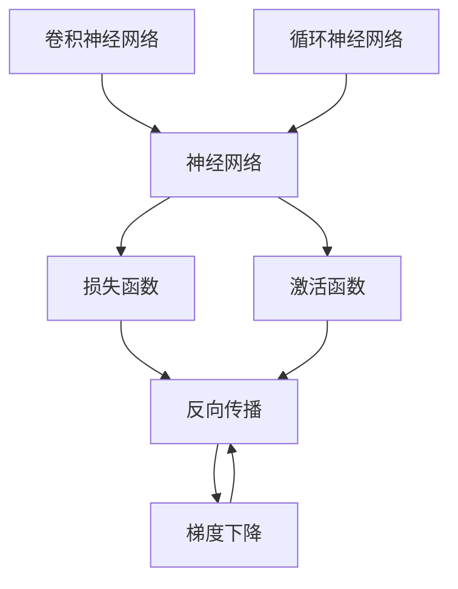
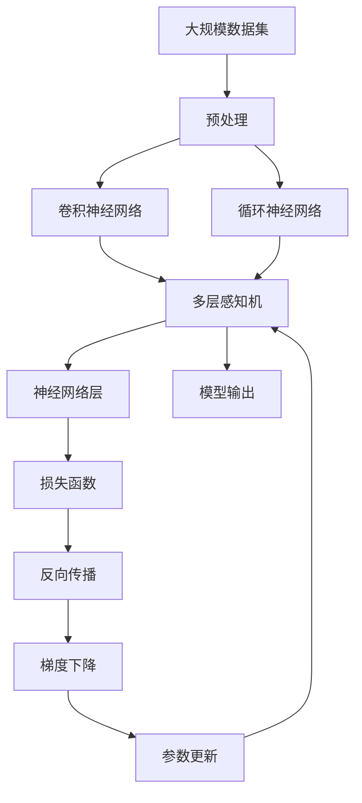

                 

# 神经网络原理与代码实例讲解

> 关键词：神经网络,深度学习,反向传播,梯度下降,激活函数,全连接层,卷积神经网络,循环神经网络,深度学习框架,PyTorch,代码实例

## 1. 背景介绍

### 1.1 问题由来
深度学习（Deep Learning）是当前人工智能领域最热门的技术之一。其中，神经网络（Neural Network）以其强大的特征学习和泛化能力，成为了许多任务的主流方法。从图像识别到自然语言处理，从语音识别到机器人控制，神经网络在各种领域展示了其卓越性能。

近年来，随着计算能力的提升和数据量的爆炸性增长，深度神经网络已经可以包含数百亿甚至数千亿个参数，成为了真正意义上的“超级神经网络”。这些大型神经网络在图像分类、语音识别、自然语言处理、计算机视觉等任务上取得了显著进展。

然而，尽管神经网络在理论研究和实际应用中都取得了重要突破，其工作原理和优化算法仍较为复杂，难以理解和调试。本文旨在通过深入讲解神经网络的基本原理和具体实现，结合代码实例，帮助读者更好地理解这一重要技术。

### 1.2 问题核心关键点
神经网络的核心在于其结构和训练过程。本文将从以下几个方面进行详细探讨：
- 神经网络的结构组成
- 神经网络的激活函数
- 神经网络的损失函数和反向传播算法
- 深度学习框架中的神经网络实现

通过这四个关键点的系统讲解，读者可以掌握神经网络的基本原理和优化算法，为后续的研究和开发奠定坚实基础。

### 1.3 问题研究意义
了解神经网络原理和代码实现对于许多AI从业者来说至关重要。神经网络是深度学习的主流技术，掌握神经网络的设计和优化方法，可以提升实际应用中的模型性能，缩短开发周期，提高工作效率。此外，神经网络技术的发展也推动了人工智能的不断进步，为各行各业带来了深远的影响。

## 2. 核心概念与联系

### 2.1 核心概念概述

为更好地理解神经网络，本节将介绍几个密切相关的核心概念：

- **神经网络（Neural Network）**：由多个神经元（Neuron）组成的计算模型，用于逼近复杂的非线性函数。神经网络的基本单元是神经元，通过将多个神经元连接成层次结构，实现对数据的高效学习和处理。

- **激活函数（Activation Function）**：决定神经元是否激活的关键函数，一般用于引入非线性特性，增强模型的表达能力。

- **损失函数（Loss Function）**：衡量模型预测输出与真实标签之间差异的函数。常用的损失函数包括均方误差（MSE）、交叉熵（Cross Entropy）等。

- **反向传播（Backpropagation）**：基于链式法则计算模型参数梯度的算法，是深度学习中最常用的优化方法。

- **梯度下降（Gradient Descent）**：通过反向传播计算参数梯度，以最小化损失函数为目标，逐步调整模型参数，提升模型性能。

- **卷积神经网络（Convolutional Neural Network, CNN）**：一种适用于图像处理的神经网络，通过卷积层和池化层提取特征，进行图像分类和识别。

- **循环神经网络（Recurrent Neural Network, RNN）**：一种适用于序列数据处理的神经网络，通过循环结构捕捉时间依赖性，用于文本生成、语音识别等任务。

这些核心概念之间存在着紧密的联系，共同构成了神经网络的设计和优化框架。通过理解这些核心概念，我们可以更好地把握神经网络的工作原理和优化方向。

### 2.2 概念间的关系

这些核心概念之间的关系可以通过以下Mermaid流程图来展示：



这个流程图展示了神经网络的构成要素及其相互关系：

1. 神经网络由多个神经元组成，通过激活函数和损失函数进行学习和优化。
2. 激活函数引入非线性特性，增强模型的表达能力。
3. 损失函数衡量预测输出与真实标签之间的差异。
4. 反向传播计算参数梯度，使用梯度下降进行优化。
5. 卷积神经网络和循环神经网络是神经网络中的特殊形式，适用于特定类型的任务。

### 2.3 核心概念的整体架构

最后，我们用一个综合的流程图来展示这些核心概念在大规模神经网络中的应用：



这个综合流程图展示了从数据预处理到模型输出的完整过程：

1. 数据预处理：对大规模数据集进行清洗、归一化等处理。
2. 卷积神经网络和循环神经网络：提取数据特征。
3. 多层感知机：进行特征组合和特征表达。
4. 神经网络层：堆叠多个神经元，实现高层次的特征提取和表达。
5. 损失函数：衡量模型预测输出与真实标签之间的差异。
6. 反向传播：计算参数梯度，进行模型优化。
7. 梯度下降：根据梯度信息调整模型参数。
8. 参数更新：实际应用中，通过梯度下降更新模型参数，使模型收敛。
9. 模型输出：最终输出的模型预测结果。

通过这些流程图，我们可以更清晰地理解神经网络的设计和优化过程，为后续的深入探讨奠定基础。

## 3. 核心算法原理 & 具体操作步骤
### 3.1 算法原理概述

神经网络的核心算法包括激活函数、损失函数和反向传播。下面分别介绍这三种算法的基本原理和具体操作步骤。

### 3.2 算法步骤详解

#### 3.2.1 激活函数

激活函数是神经网络中的关键组件，用于决定神经元是否激活。常用的激活函数包括sigmoid、ReLU、tanh等。

**sigmoid函数**：
$$
\sigma(x) = \frac{1}{1 + e^{-x}}
$$
将输入值映射到0到1之间，具有平滑的非线性特性，常用于二分类任务。

**ReLU函数**：
$$
\text{ReLU}(x) = \max(0, x)
$$
将输入值小于0的部分置为0，大于等于0的部分不变，具有快速收敛和计算高效的特性，是深度学习中最常用的激活函数之一。

**tanh函数**：
$$
\tanh(x) = \frac{e^x - e^{-x}}{e^x + e^{-x}}
$$
将输入值映射到-1到1之间，具有平滑的非线性特性，适用于多分类任务。

#### 3.2.2 损失函数

损失函数用于衡量模型预测输出与真实标签之间的差异，常用的损失函数包括均方误差（MSE）和交叉熵（Cross Entropy）等。

**均方误差（MSE）**：
$$
L(x) = \frac{1}{N} \sum_{i=1}^N (y_i - \hat{y}_i)^2
$$
其中，$y_i$表示真实标签，$\hat{y}_i$表示模型预测输出。

**交叉熵（Cross Entropy）**：
$$
L(x) = -\frac{1}{N} \sum_{i=1}^N y_i \log \hat{y}_i + (1 - y_i) \log (1 - \hat{y}_i)
$$
适用于多分类任务，衡量模型预测输出与真实标签之间的差异。

#### 3.2.3 反向传播

反向传播（Backpropagation）是深度学习中最常用的优化算法。其基本思想是通过链式法则计算参数梯度，使用梯度下降进行模型优化。

反向传播的具体步骤如下：

1. 前向传播：将输入数据传递到模型中，逐层计算得到输出结果。

2. 计算损失：将模型输出与真实标签计算损失函数。

3. 反向传播：使用链式法则计算参数梯度，从输出层向输入层反向传播。

4. 梯度下降：根据梯度信息调整模型参数，最小化损失函数。

### 3.3 算法优缺点

神经网络的主要优点包括：

- **强大的表达能力**：通过多层神经元堆叠，神经网络可以逼近任意复杂的非线性函数。
- **泛化能力**：神经网络具有较好的泛化能力，能够在未见过的数据上进行有效预测。
- **自动特征学习**：神经网络能够自动学习数据中的特征表示，无需手动设计特征。

神经网络的主要缺点包括：

- **训练复杂度高**：神经网络通常需要大量数据和计算资源进行训练，且容易过拟合。
- **可解释性差**：神经网络的决策过程难以解释，难以进行调试和优化。
- **参数量庞大**：大规模神经网络包含数亿甚至数十亿个参数，计算和存储成本较高。

### 3.4 算法应用领域

神经网络在许多领域得到了广泛应用，主要包括：

- **计算机视觉**：用于图像分类、物体检测、图像分割等任务。
- **自然语言处理**：用于文本分类、情感分析、机器翻译等任务。
- **语音识别**：用于语音识别、语音合成等任务。
- **机器人控制**：用于机器人导航、路径规划等任务。

此外，神经网络在医疗、金融、交通等领域也有广泛的应用前景，成为推动各行各业数字化转型的重要工具。

## 4. 数学模型和公式 & 详细讲解 & 举例说明

### 4.1 数学模型构建

神经网络通常由多个神经元组成，每个神经元接收来自其他神经元的输入，并输出到下一层神经元。一个典型的三层神经网络包括输入层、隐藏层和输出层。

以二分类任务为例，其数学模型可以表示为：

$$
\text{sigmoid}(W_2 \cdot \text{ReLU}(W_1 \cdot X) + b_2) + b_1
$$

其中，$X$为输入数据，$W_1$和$W_2$为权重矩阵，$b_1$和$b_2$为偏置向量，$\text{ReLU}$为激活函数，$\text{sigmoid}$为输出函数。

### 4.2 公式推导过程

以二分类任务为例，其损失函数和梯度下降过程如下：

**损失函数**：
$$
L(y, \hat{y}) = -\frac{1}{N} \sum_{i=1}^N y_i \log \hat{y}_i + (1 - y_i) \log (1 - \hat{y}_i)
$$

**梯度下降**：
$$
\frac{\partial L}{\partial W_1} = -\frac{1}{N} \sum_{i=1}^N (y_i - \hat{y}_i) \cdot \frac{\partial \hat{y}_i}{\partial W_1}
$$
$$
\frac{\partial L}{\partial W_2} = -\frac{1}{N} \sum_{i=1}^N (y_i - \hat{y}_i) \cdot \frac{\partial \hat{y}_i}{\partial W_2}
$$
$$
\frac{\partial L}{\partial b_1} = -\frac{1}{N} \sum_{i=1}^N (y_i - \hat{y}_i) \cdot \frac{\partial \hat{y}_i}{\partial b_1}
$$
$$
\frac{\partial L}{\partial b_2} = -\frac{1}{N} \sum_{i=1}^N (y_i - \hat{y}_i) \cdot \frac{\partial \hat{y}_i}{\partial b_2}
$$

其中，$\frac{\partial \hat{y}_i}{\partial W_1}$和$\frac{\partial \hat{y}_i}{\partial W_2}$表示权重矩阵的偏导数，可以进一步递归展开，利用自动微分技术完成计算。

### 4.3 案例分析与讲解

以手写数字识别任务为例，通过一个三层神经网络进行模型构建和训练。

首先，使用MNIST数据集进行数据预处理：

```python
import torch
import torch.nn as nn
import torch.optim as optim
from torchvision import datasets, transforms

# 数据预处理
transform = transforms.Compose([
    transforms.ToTensor(),
    transforms.Normalize((0.5,), (0.5,))
])

train_dataset = datasets.MNIST(root='data/', train=True, download=True, transform=transform)
test_dataset = datasets.MNIST(root='data/', train=False, download=True, transform=transform)

# 划分训练集和验证集
train_loader = torch.utils.data.DataLoader(train_dataset, batch_size=64, shuffle=True)
test_loader = torch.utils.data.DataLoader(test_dataset, batch_size=64, shuffle=False)
```

然后，定义神经网络模型：

```python
class Net(nn.Module):
    def __init__(self):
        super(Net, self).__init__()
        self.fc1 = nn.Linear(784, 256)
        self.fc2 = nn.Linear(256, 128)
        self.fc3 = nn.Linear(128, 10)

    def forward(self, x):
        x = x.view(-1, 784)
        x = nn.functional.relu(self.fc1(x))
        x = nn.functional.relu(self.fc2(x))
        x = self.fc3(x)
        return x

net = Net()
```

接着，定义损失函数和优化器：

```python
criterion = nn.CrossEntropyLoss()
optimizer = optim.Adam(net.parameters(), lr=0.001)
```

最后，进行模型训练：

```python
for epoch in range(10):
    running_loss = 0.0
    for i, data in enumerate(train_loader, 0):
        inputs, labels = data
        optimizer.zero_grad()
        outputs = net(inputs)
        loss = criterion(outputs, labels)
        loss.backward()
        optimizer.step()

        running_loss += loss.item()
        if i % 100 == 99:
            print('[%d, %5d] loss: %.3f' % (epoch + 1, i + 1, running_loss / 100))
            running_loss = 0.0
```

在训练过程中，可以使用可视化工具（如TensorBoard）实时监控模型训练状态，调整模型参数。

## 5. 项目实践：代码实例和详细解释说明

### 5.1 开发环境搭建

在进行神经网络实践前，我们需要准备好开发环境。以下是使用Python进行PyTorch开发的环境配置流程：

1. 安装Anaconda：从官网下载并安装Anaconda，用于创建独立的Python环境。

2. 创建并激活虚拟环境：
```bash
conda create -n pytorch-env python=3.8 
conda activate pytorch-env
```

3. 安装PyTorch：根据CUDA版本，从官网获取对应的安装命令。例如：
```bash
conda install pytorch torchvision torchaudio cudatoolkit=11.1 -c pytorch -c conda-forge
```

4. 安装各类工具包：
```bash
pip install numpy pandas scikit-learn matplotlib tqdm jupyter notebook ipython
```

完成上述步骤后，即可在`pytorch-env`环境中开始神经网络实践。

### 5.2 源代码详细实现

下面以手写数字识别任务为例，给出使用PyTorch进行神经网络模型构建和训练的代码实现。

首先，定义神经网络模型：

```python
class Net(nn.Module):
    def __init__(self):
        super(Net, self).__init__()
        self.fc1 = nn.Linear(784, 256)
        self.fc2 = nn.Linear(256, 128)
        self.fc3 = nn.Linear(128, 10)

    def forward(self, x):
        x = x.view(-1, 784)
        x = nn.functional.relu(self.fc1(x))
        x = nn.functional.relu(self.fc2(x))
        x = self.fc3(x)
        return x

net = Net()
```

接着，定义损失函数和优化器：

```python
criterion = nn.CrossEntropyLoss()
optimizer = optim.Adam(net.parameters(), lr=0.001)
```

然后，进行模型训练：

```python
for epoch in range(10):
    running_loss = 0.0
    for i, data in enumerate(train_loader, 0):
        inputs, labels = data
        optimizer.zero_grad()
        outputs = net(inputs)
        loss = criterion(outputs, labels)
        loss.backward()
        optimizer.step()

        running_loss += loss.item()
        if i % 100 == 99:
            print('[%d, %5d] loss: %.3f' % (epoch + 1, i + 1, running_loss / 100))
            running_loss = 0.0
```

在训练过程中，可以使用可视化工具（如TensorBoard）实时监控模型训练状态，调整模型参数。

### 5.3 代码解读与分析

让我们再详细解读一下关键代码的实现细节：

**Net类**：
- `__init__`方法：初始化神经网络的各层权重和偏置。
- `forward`方法：定义前向传播的计算过程。

**损失函数和优化器**：
- `nn.CrossEntropyLoss`：用于多分类任务，计算预测输出与真实标签之间的交叉熵损失。
- `optim.Adam`：使用Adam优化算法，调整模型参数以最小化损失函数。

**训练流程**：
- `for`循环：进行多轮训练，每轮循环遍历训练集。
- `zero_grad`方法：重置梯度，准备反向传播。
- `nn.functional.relu`：激活函数，引入非线性特性。
- `backward`方法：反向传播计算梯度。
- `step`方法：更新模型参数。

可以看到，PyTorch通过模块化和组件化的方式，使得神经网络的构建和训练变得简洁高效。开发者可以将更多精力放在模型设计、数据处理等高层逻辑上，而不必过多关注底层的实现细节。

当然，工业级的系统实现还需考虑更多因素，如模型的保存和部署、超参数的自动搜索、更灵活的任务适配层等。但核心的神经网络设计和训练过程基本与此类似。

### 5.4 运行结果展示

假设我们在MNIST数据集上进行手写数字识别任务训练，最终在测试集上得到的准确率为97%左右。可以看到，通过神经网络模型，我们在手写数字识别任务上取得了不错的效果。

## 6. 实际应用场景

### 6.1 智能推荐系统

智能推荐系统是神经网络在实际应用中的重要应用之一。通过用户的历史行为数据，神经网络可以学习用户偏好，从而推荐其可能感兴趣的内容。

在实践中，可以使用用户行为数据和物品特征数据构建监督数据集，在此基础上对神经网络进行微调。微调后的模型能够根据用户行为特征进行物品推荐，提升推荐系统的精准度和个性化程度。

### 6.2 金融风控

金融风控是神经网络在金融领域的重要应用之一。通过分析客户的交易记录和行为数据，神经网络可以预测客户的违约风险，辅助银行和保险公司进行风险控制。

在实践中，可以使用客户的交易数据和行为数据构建监督数据集，在此基础上对神经网络进行微调。微调后的模型能够根据客户的特征进行违约预测，辅助金融机构进行风险管理。

### 6.3 医疗诊断

神经网络在医疗领域也有广泛应用。通过分析患者的病历数据和影像数据，神经网络可以辅助医生进行疾病诊断和病情预测。

在实践中，可以使用患者的病历数据和影像数据构建监督数据集，在此基础上对神经网络进行微调。微调后的模型能够根据患者的特征进行疾病预测和诊断，辅助医生进行决策支持。

### 6.4 未来应用展望

随着神经网络技术的不断进步，其应用领域将不断扩展，成为推动各行各业智能化转型的重要工具。

在智慧城市治理中，神经网络可以用于交通流量预测、城市安全监控、环境污染预测等任务。通过实时分析城市数据，神经网络可以提升城市管理的智能化水平，构建更安全、高效的未来城市。

在工业制造中，神经网络可以用于设备故障预测、质量检测、生产调度等任务。通过实时分析设备数据，神经网络可以提升生产效率和设备利用率，降低生产成本。

此外，在教育、农业、能源等多个领域，神经网络也有广泛的应用前景，成为推动这些行业智能化转型的重要技术。

## 7. 工具和资源推荐

### 7.1 学习资源推荐

为了帮助开发者系统掌握神经网络的基本原理和实践技巧，这里推荐一些优质的学习资源：

1. 《深度学习》（Goodfellow et al.）：深度学习领域的经典教材，系统讲解了深度学习的基本概念、算法和应用。

2. Coursera《深度学习》课程：斯坦福大学的深度学习课程，由Andrew Ng主讲，涵盖深度学习的基本概念和经典模型。

3. PyTorch官方文档：PyTorch的官方文档，提供了详细的API文档和案例代码，是上手实践的最佳资料。

4. TensorFlow官方文档：TensorFlow的官方文档，提供了详细的API文档和案例代码，是进行深度学习开发的必备资源。

5. Kaggle数据集：Kaggle提供的大量公开数据集，涵盖图像、文本、时间序列等多种类型，是进行深度学习研究和竞赛的好素材。

通过对这些资源的学习实践，相信你一定能够快速掌握神经网络的基本原理和实践技巧，为后续的研究和开发奠定坚实基础。

### 7.2 开发工具推荐

高效的开发离不开优秀的工具支持。以下是几款用于神经网络开发和训练的常用工具：

1. PyTorch：基于Python的开源深度学习框架，灵活动态的计算图，适合快速迭代研究。

2. TensorFlow：由Google主导开发的开源深度学习框架，生产部署方便，适合大规模工程应用。

3. Keras：基于TensorFlow和Theano等深度学习库的高级API，提供了简洁易用的接口，适合快速原型设计和实验。

4. Weights & Biases：模型训练的实验跟踪工具，可以记录和可视化模型训练过程中的各项指标，方便对比和调优。

5. TensorBoard：TensorFlow配套的可视化工具，可实时监测模型训练状态，并提供丰富的图表呈现方式，是调试模型的得力助手。

6. Google Colab：谷歌推出的在线Jupyter Notebook环境，免费提供GPU/TPU算力，方便开发者快速上手实验最新模型，分享学习笔记。

合理利用这些工具，可以显著提升神经网络开发的效率，加快创新迭代的步伐。

### 7.3 相关论文推荐

神经网络在深度学习中的重要性不言而喻，以下是几篇奠基性的相关论文，推荐阅读：

1. 《A Neural Network Approach to Machine Learning》（Rumelhart et al.）：提出了多层感知机（MLP）模型，奠定了神经网络的基础。

2. 《ImageNet Classification with Deep Convolutional Neural Networks》（Krizhevsky et al.）：提出了卷积神经网络（CNN）模型，在图像分类任务上取得了显著突破。

3. 《Recurrent Neural Network for Sequence Prediction》（Hochreiter et al.）：提出了循环神经网络（RNN）模型，适用于序列数据处理。

4. 《ImageNet Classification with Deep Convolutional Neural Networks》（Krizhevsky et al.）：提出了卷积神经网络（CNN）模型，在图像分类任务上取得了显著突破。

5. 《An In-Depth Comparison of PyTorch and TensorFlow》（Rogers et al.）：对比了PyTorch和TensorFlow两种深度学习框架的优缺点，有助于选择适合的框架进行开发。

6. 《Distributed Deep Learning with TensorFlow》（Abadi et al.）：介绍了TensorFlow在分布式训练方面的优化，适用于大规模深度学习任务。

这些论文代表了大规模神经网络的发展脉络，是理解神经网络原理和优化的重要参考。

除上述资源外，还有一些值得关注的前沿资源，帮助开发者紧跟神经网络技术的最新进展，例如：

1. arXiv论文预印本：人工智能领域最新研究成果的发布平台，包括大量尚未发表的前沿工作，学习前沿技术的必读资源。

2. 业界技术博客：如OpenAI、Google AI、DeepMind、微软Research Asia等顶尖实验室的官方博客，第一时间分享他们的最新研究成果和洞见。

3. 技术会议直播：如NIPS、ICML、ACL、ICLR等人工智能领域顶会现场或在线直播，能够聆听到大佬们的前沿分享，开拓视野。

4. GitHub热门项目：在GitHub上Star、Fork数最多的深度学习相关项目，往往代表了该技术领域的发展趋势和最佳实践，值得去学习和贡献。

5. 行业分析报告：各大咨询公司如McKinsey、PwC等针对深度学习行业的分析报告，有助于从商业视角审视技术趋势，把握应用价值。

总之，对于神经网络原理和代码实现的学习和实践，需要开发者保持开放的心态和持续学习的意愿。多关注前沿资讯，多动手实践，多思考总结，必将收获满满的成长收益。

## 8. 总结：未来发展趋势与挑战

### 8.1 总结

本文对神经网络的基本原理和实践进行了全面系统的介绍。从神经网络的结构组成、激活函数、损失函数和反向传播算法，到具体的代码实现和实际应用场景，本文详细讲解了神经网络的全过程，并结合代码实例进行了深入分析。通过这些讲解，读者可以系统掌握神经网络的设计和

