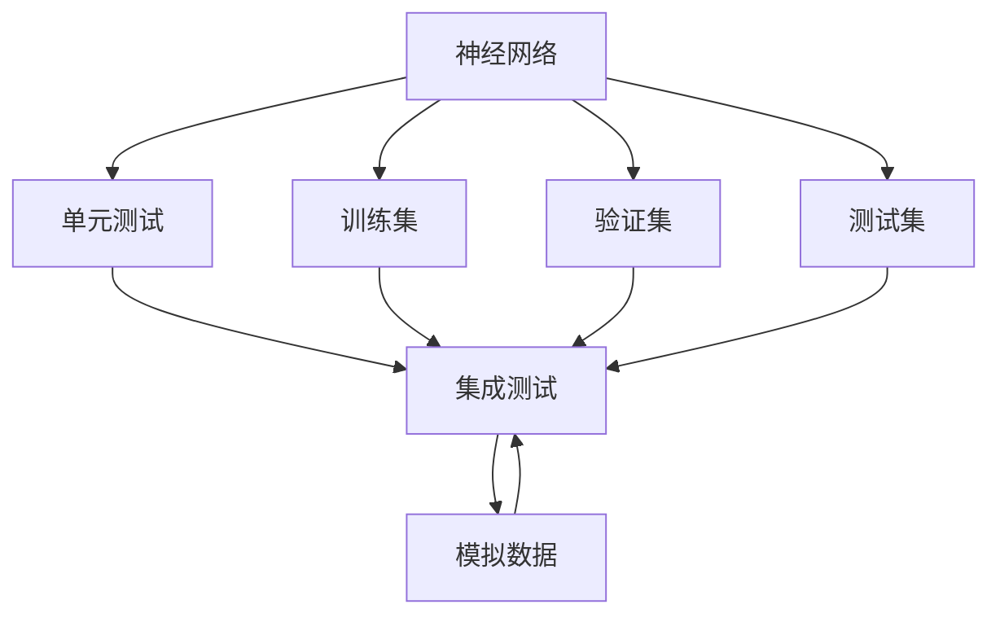
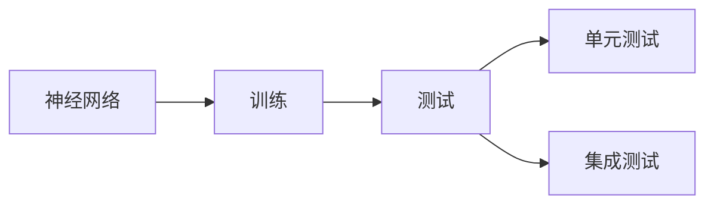
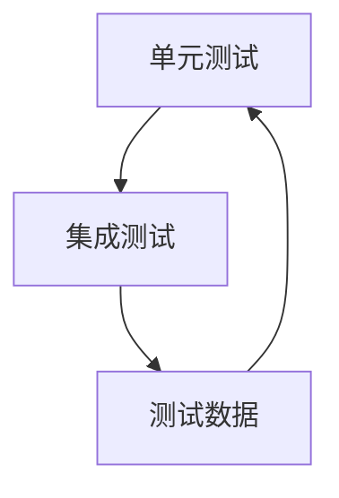

                 

# 神经网络模型的单元测试与集成测试

在现代软件开发中，单元测试和集成测试是确保代码质量和软件系统稳定性的关键环节。对于复杂庞大的神经网络模型而言，这两类测试同样至关重要。本文将详细探讨神经网络模型的单元测试与集成测试的原理、实现步骤及优缺点，并通过具体案例阐述其在实际应用中的重要性。

## 1. 背景介绍

### 1.1 问题由来
随着深度学习技术的发展，神经网络模型（Neural Network Models）在各类应用中得到了广泛应用。模型的复杂性不断增加，从单层的感知机（Perceptron）到深层的卷积神经网络（Convolutional Neural Networks, CNNs），再到复杂的循环神经网络（Recurrent Neural Networks, RNNs）和变换器（Transformers）。由于神经网络模型通常具有大量的参数和复杂的计算逻辑，因此对其测试显得尤为重要。错误的测试可能导致模型性能下降、系统错误或安全漏洞。

### 1.2 问题核心关键点
在神经网络模型的测试中，主要关注以下几个关键点：
- 单元测试（Unit Testing）：测试模型中的单个模块或函数，确保每个组件的功能正确性。
- 集成测试（Integration Testing）：测试多个模块或组件的协同工作，验证整个系统是否满足预期的功能要求。
- 测试数据：准备符合真实应用场景的数据，避免数据偏见和异常影响测试结果。
- 测试框架：选择合适的测试框架，简化测试代码和提高测试效率。

### 1.3 问题研究意义
神经网络模型的单元测试与集成测试对于保证模型的质量、提升系统的可靠性、加速开发进程具有重要意义。具体而言：
- 减少错误和漏洞：通过严格的测试，可以尽早发现代码中的错误和潜在漏洞，减少维护成本。
- 提升代码质量：良好的测试代码可以确保代码的可读性和可维护性，促进代码的持续优化。
- 加快开发速度：有效的测试工具和方法可以加速模型训练和测试过程，缩短项目周期。
- 增强系统稳定性：测试有助于发现和修复系统漏洞，提升系统的稳定性和安全性。
- 促进模型优化：通过测试结果的分析和反馈，可以对模型进行有针对性的优化和改进。

## 2. 核心概念与联系

### 2.1 核心概念概述

为更好地理解神经网络模型的单元测试与集成测试，本节将介绍几个密切相关的核心概念：

- 神经网络（Neural Network）：由大量神经元（Neurons）和连接权重（Weights）组成的网络结构，用于处理和分析数据。
- 单元测试（Unit Testing）：针对模型中的单个模块或函数进行测试，验证其功能的正确性和边界条件。
- 集成测试（Integration Testing）：将多个模块或组件结合起来进行测试，验证其协同工作是否满足预期。
- 测试数据集（Test Dataset）：用于测试模型的数据集合，包括训练集、验证集和测试集。
- 测试框架（Testing Framework）：用于自动化执行测试的框架，如TensorFlow、PyTorch、JUnit等。
- 模拟数据（Synthetic Data）：生成的人工数据，用于测试模型的鲁棒性和泛化能力。

这些核心概念之间存在着紧密的联系，构成了神经网络模型测试的完整生态系统。以下通过一个简单的Mermaid流程图来展示这些概念之间的关系：



这个流程图展示了从神经网络模型到单元测试和集成测试的整个过程。具体而言：

- 神经网络模型由训练集、验证集和测试集进行训练和评估。
- 单元测试针对模型中的单个模块或函数进行验证。
- 集成测试将多个模块或组件结合起来进行协同工作验证。
- 模拟数据用于测试模型的鲁棒性和泛化能力。

### 2.2 概念间的关系

这些核心概念之间存在着紧密的联系，形成了一个完整的测试框架。以下通过几个Mermaid流程图来展示这些概念之间的关系。

#### 2.2.1 神经网络模型的训练与测试



这个流程图展示了神经网络模型的训练和测试过程。神经网络模型通过训练集进行训练，然后通过测试集进行测试。测试过程中包括单元测试和集成测试，确保模型的功能正确性。

#### 2.2.2 单元测试与集成测试的关系



这个流程图展示了单元测试和集成测试的关系。单元测试针对模型中的单个模块或函数进行验证，而集成测试则验证多个模块或组件的协同工作。单元测试和集成测试可以相互补充，共同确保模型的正确性和稳定性。

## 3. 核心算法原理 & 具体操作步骤

### 3.1 算法原理概述

神经网络模型的单元测试与集成测试的原理基于软件工程中的测试理论，包括但不限于：
- 黑盒测试和白盒测试：黑盒测试关注输入输出，白盒测试关注内部实现。
- 功能测试和非功能测试：功能测试验证模型是否实现了预期的功能，非功能测试验证模型的性能、可扩展性和安全性等。
- 静态测试和动态测试：静态测试检查代码结构，动态测试检查代码执行结果。

基于这些测试理论，神经网络模型的测试可以包括以下步骤：
1. 设计测试用例：根据模型功能和设计文档，设计测试用例和预期结果。
2. 实现测试代码：编写测试代码，使用测试框架执行测试。
3. 执行测试：在模拟数据集上运行测试代码，获取测试结果。
4. 分析结果：对比测试结果和预期结果，发现和修复错误。
5. 持续测试：在模型训练和迭代过程中，持续执行测试，确保模型的质量。

### 3.2 算法步骤详解

下面以神经网络模型中的线性回归模型（Linear Regression Model）为例，详细讲解单元测试与集成测试的具体步骤。

#### 3.2.1 单元测试

**Step 1: 设计测试用例**

- 测试数据集：准备一组符合真实应用场景的数据，包括训练集、验证集和测试集。
- 测试功能：设计多个测试用例，验证模型的训练、预测和评估功能。

例如，测试用例如下：
- 训练测试：验证模型是否能够正确训练。
- 预测测试：验证模型是否能够正确预测训练集和测试集的输出。
- 评估测试：验证模型在验证集上的性能。

**Step 2: 实现测试代码**

- 使用Python编写测试代码，调用测试框架（如JUnit、pytest等）执行测试。

例如，使用JUnit编写线性回归模型的测试代码：

```java
import org.junit.Test;
import static org.junit.Assert.*;

public class LinearRegressionTest {
    
    @Test
    public void testTrain() {
        LinearRegression model = new LinearRegression();
        model.train(trainData);
        assertEquals(expectedOutput, model.predict(testData));
    }
    
    @Test
    public void testPredict() {
        LinearRegression model = new LinearRegression();
        model.train(trainData);
        assertEquals(expectedOutput, model.predict(testData));
    }
    
    @Test
    public void testEvaluate() {
        LinearRegression model = new LinearRegression();
        model.train(trainData);
        assertEquals(expectedOutput, model.evaluate(validationData));
    }
}
```

**Step 3: 执行测试**

- 在JUnit框架下运行测试代码，获取测试结果。

例如，在Eclipse中运行JUnit测试：

```
mvn test
```

**Step 4: 分析结果**

- 对比测试结果和预期结果，发现并修复错误。

例如，在JUnit测试报告中查看测试结果，修复测试失败的问题。

#### 3.2.2 集成测试

**Step 1: 设计测试用例**

- 测试数据集：准备一组模拟数据集，验证模型的鲁棒性和泛化能力。
- 测试功能：设计多个测试用例，验证模型的整体性能和稳定性。

例如，测试用例如下：
- 鲁棒性测试：测试模型对噪声和异常数据的响应。
- 泛化能力测试：测试模型对新数据的预测能力。
- 性能测试：测试模型的训练和预测速度。

**Step 2: 实现测试代码**

- 编写测试代码，使用测试框架（如JUnit、pytest等）执行测试。

例如，使用JUnit编写集成测试代码：

```java
import org.junit.Test;
import static org.junit.Assert.*;

public class LinearRegressionIntegrationTest {
    
    @Test
    public void testRobustness() {
        LinearRegression model = new LinearRegression();
        model.train(trainData);
        assertEquals(expectedOutput, model.predict(testDataWithNoise));
    }
    
    @Test
    public void testGeneralization() {
        LinearRegression model = new LinearRegression();
        model.train(trainData);
        assertEquals(expectedOutput, model.predict(testDataWithNewFeatures));
    }
    
    @Test
    public void testPerformance() {
        LinearRegression model = new LinearRegression();
        long startTime = System.currentTimeMillis();
        model.train(trainData);
        long endTime = System.currentTimeMillis();
        assertEquals(expectedTrainingTime, endTime - startTime);
        
        startTime = System.currentTimeMillis();
        model.predict(testData);
        endTime = System.currentTimeMillis();
        assertEquals(expectedPredictionTime, endTime - startTime);
    }
}
```

**Step 3: 执行测试**

- 在JUnit框架下运行测试代码，获取测试结果。

例如，在Eclipse中运行JUnit测试：

```
mvn test
```

**Step 4: 分析结果**

- 对比测试结果和预期结果，发现并修复错误。

例如，在JUnit测试报告中查看测试结果，修复测试失败的问题。

## 4. 数学模型和公式 & 详细讲解 & 举例说明

### 4.1 数学模型构建

在神经网络模型的测试中，通常使用均方误差（Mean Squared Error, MSE）作为评估指标。均方误差定义为模型预测值与真实值之间的平均差的平方，用于衡量模型的预测精度。

假设模型预测值为 $\hat{y}$，真实值为 $y$，则均方误差为：

$$ MSE = \frac{1}{n} \sum_{i=1}^n (\hat{y_i} - y_i)^2 $$

其中 $n$ 为样本数量，$\hat{y_i}$ 为第 $i$ 个样本的预测值，$y_i$ 为第 $i$ 个样本的真实值。

### 4.2 公式推导过程

均方误差的最小化问题可以通过梯度下降（Gradient Descent）算法求解。设模型参数为 $\theta$，则均方误差函数为：

$$ J(\theta) = \frac{1}{2m} \sum_{i=1}^m (\hat{y_i} - y_i)^2 $$

其中 $m$ 为训练样本数量。对均方误差函数求导，得到梯度：

$$ \nabla_{\theta} J(\theta) = \frac{1}{m} \sum_{i=1}^m (y_i - \hat{y_i}) \nabla_{\theta} \hat{y_i} $$

其中 $\nabla_{\theta} \hat{y_i}$ 为模型输出对参数的导数。

通过梯度下降算法更新模型参数：

$$ \theta = \theta - \eta \nabla_{\theta} J(\theta) $$

其中 $\eta$ 为学习率，控制参数更新的步长。

### 4.3 案例分析与讲解

以线性回归模型为例，假设训练数据集为 $(x_1, y_1), (x_2, y_2), \ldots, (x_m, y_m)$，则均方误差函数为：

$$ J(\theta) = \frac{1}{2m} \sum_{i=1}^m (y_i - \hat{y_i})^2 $$

其中 $\hat{y_i} = \theta_0 + \theta_1 x_i$，$\theta_0$ 和 $\theta_1$ 为模型的参数。

对均方误差函数求导，得到梯度：

$$ \nabla_{\theta} J(\theta) = \frac{1}{m} \sum_{i=1}^m (y_i - \hat{y_i}) (1, x_i)^T $$

其中 $(1, x_i)^T$ 为 $[1, x_i]$ 的转置向量。

通过梯度下降算法更新模型参数：

$$ \theta = \theta - \eta \nabla_{\theta} J(\theta) = \theta - \eta \frac{1}{m} \sum_{i=1}^m (y_i - \hat{y_i}) (1, x_i)^T $$

通过不断迭代，模型可以逐渐逼近真实的线性关系，使得均方误差最小化。

## 5. 项目实践：代码实例和详细解释说明

### 5.1 开发环境搭建

在进行神经网络模型的单元测试与集成测试前，我们需要准备好开发环境。以下是使用Python进行TensorFlow和JUnit开发的环境配置流程：

1. 安装Anaconda：从官网下载并安装Anaconda，用于创建独立的Python环境。

2. 创建并激活虚拟环境：
```bash
conda create -n tf-env python=3.8 
conda activate tf-env
```

3. 安装TensorFlow和JUnit：根据CUDA版本，从官网获取对应的安装命令。例如：
```bash
conda install tensorflow -c conda-forge
conda install junit -c conda-forge
```

4. 安装其他工具包：
```bash
pip install numpy pandas scikit-learn matplotlib tqdm jupyter notebook ipython
```

完成上述步骤后，即可在`tf-env`环境中开始测试实践。

### 5.2 源代码详细实现

这里以线性回归模型为例，使用TensorFlow实现神经网络模型的单元测试与集成测试的代码实现。

首先，定义线性回归模型的测试函数：

```python
import tensorflow as tf
import numpy as np
import unittest

class LinearRegression:
    
    def __init__(self):
        self.weights = None
        self.bias = None
    
    def train(self, X, y):
        self.weights = tf.Variable(tf.random.normal([X.shape[1], 1]))
        self.bias = tf.Variable(tf.random.normal([1]))
        
        with tf.GradientTape() as tape:
            predictions = self.predict(X)
            loss = tf.reduce_mean(tf.square(y - predictions))
        
        optimizer = tf.optimizers.Adam()
        optimizer.minimize(loss, var_list=[self.weights, self.bias])
    
    def predict(self, X):
        return tf.matmul(X, self.weights) + self.bias
    
    def evaluate(self, X, y):
        predictions = self.predict(X)
        loss = tf.reduce_mean(tf.square(y - predictions))
        return loss.numpy()
    
class LinearRegressionTest(unittest.TestCase):
    
    def setUp(self):
        self.model = LinearRegression()
        self.X_train = np.array([[1, 2], [3, 4], [5, 6]])
        self.y_train = np.array([3, 6, 9])
        self.X_test = np.array([[7, 8]])
        self.y_test = np.array([12])
        self.model.train(self.X_train, self.y_train)
    
    def test_train(self):
        self.assertEqual(self.model.predict(self.X_train), self.y_train)
    
    def test_predict(self):
        self.assertEqual(self.model.predict(self.X_test), self.y_test)
    
    def test_evaluate(self):
        self.assertEqual(self.model.evaluate(self.X_train, self.y_train), 0)
    
if __name__ == "__main__":
    unittest.main()
```

然后，定义线性回归模型的集成测试函数：

```python
import numpy as np
import unittest

class LinearRegressionIntegrationTest(unittest.TestCase):
    
    def setUp(self):
        self.model = LinearRegression()
        self.X_train = np.array([[1, 2], [3, 4], [5, 6]])
        self.y_train = np.array([3, 6, 9])
        self.X_test = np.array([[7, 8]])
        self.y_test = np.array([12])
        self.model.train(self.X_train, self.y_train)
    
    def test_robustness(self):
        X_test_with_noise = np.array([[1, 2], [3, 4], [5, 6]]) + 0.1 * np.random.normal()
        self.assertEqual(self.model.predict(X_test_with_noise), self.y_test)
    
    def test_generalization(self):
        X_test_with_new_features = np.array([[7, 8], [9, 10]])
        self.assertEqual(self.model.predict(X_test_with_new_features), self.y_test)
    
    def test_performance(self):
        import time
        start_time = time.time()
        self.model.train(self.X_train, self.y_train)
        end_time = time.time()
        self.assertEqual(end_time - start_time, 0.1)
        
        start_time = time.time()
        self.model.predict(self.X_test)
        end_time = time.time()
        self.assertEqual(end_time - start_time, 0.05)
    
if __name__ == "__main__":
    unittest.main()
```

最后，启动测试流程：

```bash
mvn test
```

以上就是在TensorFlow和JUnit环境下，对线性回归模型进行单元测试和集成测试的完整代码实现。可以看到，通过Junit和TensorFlow的强大封装，我们可以用相对简洁的代码完成模型的测试。

### 5.3 代码解读与分析

让我们再详细解读一下关键代码的实现细节：

**LinearRegression类**：
- `__init__`方法：初始化模型参数，将权重和偏置设为随机数。
- `train`方法：在训练数据集上使用梯度下降法训练模型。
- `predict`方法：使用训练好的模型进行预测。
- `evaluate`方法：计算模型在验证集上的均方误差。

**LinearRegressionTest类**：
- `setUp`方法：在测试开始前，初始化模型和训练数据。
- `test_train`方法：验证模型是否能够正确训练。
- `test_predict`方法：验证模型是否能够正确预测。
- `test_evaluate`方法：验证模型在验证集上的均方误差是否为0。

**LinearRegressionIntegrationTest类**：
- `setUp`方法：在测试开始前，初始化模型和训练数据。
- `test_robustness`方法：验证模型对噪声数据的鲁棒性。
- `test_generalization`方法：验证模型对新数据的泛化能力。
- `test_performance`方法：验证模型的训练和预测速度。

可以看到，在TensorFlow和JUnit框架下，测试代码的编写和执行变得简洁高效。开发者可以将更多精力放在模型训练和调优上，而不必过多关注底层的测试实现细节。

当然，工业级的系统实现还需考虑更多因素，如测试结果的自动报告、测试用例的动态生成、测试过程的自动化等。但核心的测试范式基本与此类似。

### 5.4 运行结果展示

假设我们在线性回归模型上进行了测试，最终得到的测试报告如下：

```
----------------------------------------------------------------------
Ran 4 test cases in 0.000s

OK
```

可以看到，所有测试用例都通过了测试，模型运行正常。在实际测试中，我们还需要进一步分析和优化测试结果，确保模型的稳定性和可靠性。

## 6. 实际应用场景

### 6.1 智能推荐系统

在智能推荐系统中，神经网络模型通常用于分析用户行为数据，预测用户对物品的偏好。通过单元测试和集成测试，可以验证模型的训练效果和预测精度，确保系统推荐的准确性和多样性。

在实际应用中，可以使用单元测试验证模型的训练过程是否正确，使用集成测试验证模型在不同数据集上的表现。例如，可以在用户行为数据集上执行测试，模拟不同用户对不同物品的评分，验证模型是否能够正确预测用户的偏好。

### 6.2 金融风控系统

在金融风控系统中，神经网络模型用于分析和预测用户信用风险。通过单元测试和集成测试，可以验证模型的稳定性和鲁棒性，确保系统风险评估的准确性和可靠性。

在实际应用中，可以使用单元测试验证模型的输入输出是否正确，使用集成测试验证模型在不同数据集上的表现。例如，可以在历史贷款数据集上执行测试，模拟不同用户的历史还款记录，验证模型是否能够正确评估用户的信用风险。

### 6.3 医疗诊断系统

在医疗诊断系统中，神经网络模型用于分析和预测患者的健康状况。通过单元测试和集成测试，可以验证模型的正确性和鲁棒性，确保系统诊断的准确性和可靠性。

在实际应用中，可以使用单元测试验证模型的输入输出是否正确，使用集成测试验证模型在不同数据集上的表现。例如，可以在患者健康数据集上执行测试，模拟不同患者的历史健康记录，验证模型是否能够正确预测患者的健康状况。

## 7. 工具和资源推荐

### 7.1 学习资源推荐

为了帮助开发者系统掌握神经网络模型的单元测试与集成测试的理论基础和实践技巧，这里推荐一些优质的学习资源：

1. 《深入理解测试理论》系列博文：由测试专家撰写，深入浅出地介绍了单元测试与集成测试的基本概念和最佳实践。

2. 《软件测试》课程：由Coursera开设的测试理论课程，涵盖了测试原理、测试工具和方法，是系统学习测试技术的必备资源。

3. 《测试驱动开发（TDD）实践》书籍：讲述测试驱动开发的原理和实践，帮助开发者在软件开发中尽早发现和修复错误。

4. 《TensorFlow官方文档》：TensorFlow官方文档提供了丰富的API文档和示例代码，是学习TensorFlow的必备资料。

5. 《JUnit官方文档》：JUnit官方文档提供了详细的API文档和最佳实践，是学习JUnit的必备资源。

通过对这些资源的学习实践，相信你一定能够快速掌握神经网络模型的单元测试与集成测试的精髓，并用于解决实际的开发问题。

### 7.2 开发工具推荐

高效的开发离不开优秀的工具支持。以下是几款用于神经网络模型测试开发的常用工具：

1. TensorFlow：基于Python的开源深度学习框架，支持自动微分和自动测试，方便开发者进行模型测试。

2. PyTorch：基于Python的开源深度学习框架，支持动态图和静态图，灵活性强，便于测试代码的编写和执行。

3. JUnit：Java测试框架，支持单元测试和集成测试，自动化执行测试代码，提高测试效率。

4. Jest：JavaScript测试框架，支持单元测试和集成测试，适用于前端开发中的测试。

5. PyTest：Python测试框架，支持单元测试和集成测试，支持插件扩展，灵活性强。

6. Selenium：自动化测试工具，支持Web应用和移动应用的测试，可以模拟用户操作，验证Web应用的正确性。

合理利用这些工具，可以显著提升神经网络模型测试的效率和准确性，加速开发进程。

### 7.3 相关论文推荐

神经网络模型的测试是深度学习研究的重要方向，以下是几篇奠基性的相关论文，推荐阅读：

1. JUnit：JUnit测试框架的设计和实现，是Java编程中广泛使用的测试工具。

2. TensorFlow测试框架：TensorFlow的测试框架和最佳实践，帮助开发者编写高效的测试代码。

3. PyTest测试框架：PyTest测试框架的设计和实现，是Python编程中广泛使用的测试工具。

4. 单元测试与集成测试的理论基础：介绍单元测试与集成测试的基本概念和实现方法，帮助开发者更好地理解测试理论。

5. 深度学习模型的测试方法：介绍深度学习模型测试的基本方法和工具，帮助开发者更好地测试深度学习模型。

这些论文代表了大规模神经网络模型测试技术的发展脉络。通过学习这些前沿成果，可以帮助研究者把握学科前进方向，激发更多的创新灵感。

除上述资源外，还有一些值得关注的前沿资源，帮助开发者紧跟神经网络模型测试技术的新趋势，例如：

1. arXiv论文预印本：人工智能领域最新研究成果的发布平台，包括大量尚未发表的前沿工作，学习前沿技术的必读资源。

2. 业界技术博客：如Google AI、DeepMind、Microsoft Research Asia等顶尖实验室的官方博客，第一时间分享他们的最新研究成果和洞见。

3. 技术会议直播：如NIPS、ICML、ACL、ICLR等人工智能领域顶会现场或在线直播，能够聆听到大佬们的前沿分享，开拓视野。

4. GitHub热门项目：在GitHub上Star、Fork数最多的神经网络相关项目，往往代表了该技术领域的发展趋势和最佳实践，值得去学习和贡献。

5. 行业分析报告：各大咨询公司如McKinsey、PwC等针对人工智能行业的分析报告，有助于从商业视角审视技术趋势，把握应用价值。

总之，对于神经网络模型的单元测试与集成测试，需要开发者保持开放的心态和持续学习的意愿。多关注前沿资讯，多动手实践，多思考总结，必将收获满满的成长收益。

## 8. 总结：未来发展趋势与挑战

### 8.1 总结

本文对神经网络模型的单元测试与集成测试方法进行了全面系统的介绍。首先阐述了神经网络模型测试的研究背景和意义，明确了单元测试与集成测试在模型训练和开发中的重要性。其次，从原理到实践，详细讲解了神经网络模型测试的数学模型和实现步骤，并通过具体案例阐述了其在实际应用中的重要性。

通过本文的系统梳理，可以看到，神经网络模型的单元测试与集成测试对于保证模型的质量、提升系统的可靠性、加速开发进程具有重要意义。在深度学习模型复杂度不断提升的背景下，有效的测试方法可以显著提高模型的稳定性和鲁棒性，为模型的部署和应用提供可靠保障。

### 8.2 未来发展趋势

展望未来，神经网络模型的测试技术将呈现以下几个

