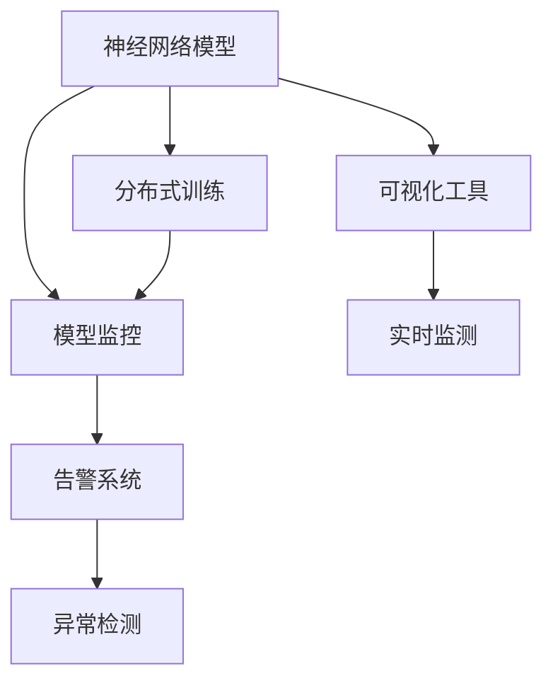
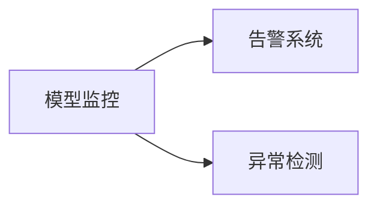
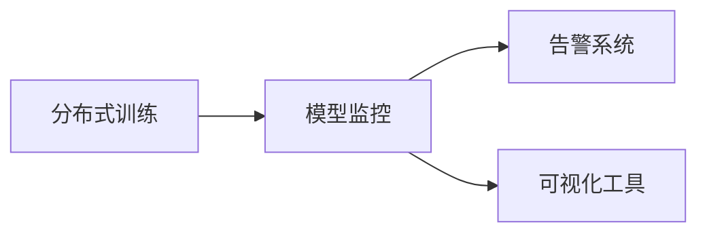
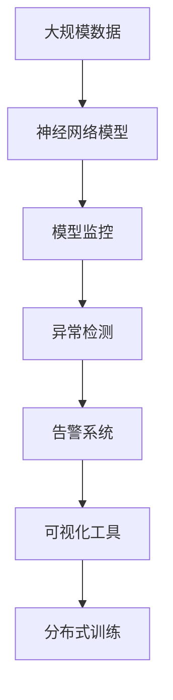

                 

# 神经网络模型的监控与告警

> 关键词：神经网络,模型监控,告警系统,实时监测,异常检测,分布式训练,可视化工具

## 1. 背景介绍

### 1.1 问题由来

随着人工智能和大数据技术的迅猛发展，神经网络模型在各行各业的应用越来越广泛，从图像识别、自然语言处理到金融预测、医疗诊断，神经网络模型已经成为解决复杂问题的利器。然而，神经网络模型的复杂性和多样性，也带来了新的挑战，特别是在模型训练和运行过程中，如何保证其可靠性和稳定性，成为了一个亟待解决的问题。

神经网络模型的监控与告警，是确保模型质量和性能的关键手段。通过实时监测模型的运行状态，及时发现异常，并发出告警，可以有效避免模型失效、输出错误等问题，保证模型的稳定性和可靠性。

### 1.2 问题核心关键点

神经网络模型的监控与告警涉及多个关键点：

- 实时监测：对模型的运行状态进行持续的实时监测，包括计算资源使用、内存占用、模型性能等指标。
- 异常检测：通过统计分析和模型行为分析，识别模型的异常行为，如过拟合、梯度爆炸、内存泄漏等。
- 告警系统：建立告警系统，根据异常检测结果自动发出告警，并及时通知相关人员进行处理。
- 分布式训练：在分布式环境下，如何对每个节点和整体系统进行统一监控和告警。
- 可视化工具：提供可视化界面，展示模型运行状态和监控结果，便于人工干预和决策。

### 1.3 问题研究意义

研究神经网络模型的监控与告警，对于确保模型高质量运行、提高系统可靠性和鲁棒性具有重要意义：

1. 保障模型性能：实时监测和异常检测可以及时发现模型性能下降或异常行为，避免输出错误。
2. 优化资源使用：合理监控计算资源使用情况，避免资源浪费和超载。
3. 提高系统可靠性：通过告警系统，及时响应和处理异常，保证系统稳定运行。
4. 支持模型迭代：提供可视化监控界面，便于人工调整参数和策略，加速模型迭代优化。
5. 应对复杂场景：神经网络模型在复杂多变的数据场景下运行，监控与告警可以增强模型的适应性和鲁棒性。

## 2. 核心概念与联系

### 2.1 核心概念概述

为更好地理解神经网络模型的监控与告警，本节将介绍几个密切相关的核心概念：

- 神经网络模型（Neural Network Model）：以深度学习为核心，通过多层神经元间的非线性变换，实现复杂数据的特征提取和分类、回归等任务。
- 模型监控（Model Monitoring）：对模型运行状态进行持续监测和统计分析，及时发现异常行为。
- 告警系统（Alert System）：建立自动化告警机制，根据模型运行状态自动发出告警，并通知相关人员进行处理。
- 异常检测（Anomaly Detection）：通过模型行为分析和统计学方法，识别模型的异常状态和行为。
- 分布式训练（Distributed Training）：在多台机器上并行训练神经网络模型，需要统一监控和告警策略。
- 可视化工具（Visualization Tools）：提供界面化的展示工具，方便人工监测和调试模型。

这些核心概念之间的逻辑关系可以通过以下Mermaid流程图来展示：



这个流程图展示了大模型监控与告警的核心概念及其之间的关系：

1. 神经网络模型是监控与告警的对象。
2. 模型监控负责对模型的运行状态进行实时监测，包括各种性能指标。
3. 告警系统根据异常检测结果，自动发出告警。
4. 异常检测用于识别模型的异常状态。
5. 分布式训练需要统一的监控与告警策略。
6. 可视化工具用于展示监控结果，方便人工干预和决策。

### 2.2 概念间的关系

这些核心概念之间存在着紧密的联系，形成了神经网络模型监控与告警的完整生态系统。下面我通过几个Mermaid流程图来展示这些概念之间的关系。

#### 2.2.1 模型监控与告警的关系



这个流程图展示了大模型监控与告警的基本原理，即通过实时监测和异常检测，自动触发告警。

#### 2.2.2 分布式训练与监控的关系



这个流程图展示了分布式训练下的监控与告警流程，需要在每个节点和整体系统上进行统一监控。

#### 2.2.3 异常检测与告警的关系


这个流程图展示了异常检测与告警之间的关系，即异常检测识别出的问题，会自动触发告警。

### 2.3 核心概念的整体架构

最后，我们用一个综合的流程图来展示这些核心概念在大模型监控与告警过程中的整体架构：



这个综合流程图展示了从大规模数据到模型训练、监控与告警的完整过程。通过这一过程，我们可以更好地理解大模型在实际应用中的运行状态，并及时进行干预和优化。

## 3. 核心算法原理 & 具体操作步骤
### 3.1 算法原理概述

神经网络模型的监控与告警，本质上是对模型运行状态和性能指标的持续监测和异常检测。其主要算法原理包括：

- 实时监测：通过各种传感器和工具，对模型的运行状态进行实时监控，获取计算资源使用、内存占用、网络通信等性能指标。
- 异常检测：通过统计分析、模型行为分析和深度学习模型等方法，识别模型的异常状态和行为，如梯度爆炸、内存泄漏、模型过拟合等。
- 告警系统：建立自动化告警机制，根据异常检测结果，自动发出告警，并通知相关人员进行处理。

### 3.2 算法步骤详解

神经网络模型的监控与告警过程通常包括以下关键步骤：

**Step 1: 数据收集和预处理**
- 收集模型的运行日志、计算资源使用情况、内存占用等数据。
- 对数据进行清洗和预处理，去除异常和噪声数据。

**Step 2: 实时监测**
- 使用各种传感器和工具，对模型进行实时监测，获取各种性能指标。
- 根据预定义的指标阈值，计算模型的实时性能数据，如计算资源使用率、内存占用率、模型损失等。

**Step 3: 异常检测**
- 使用统计分析方法，如均值、方差、标准差等，对模型的实时性能数据进行分析，识别异常行为。
- 使用深度学习模型，如自编码器、卷积神经网络等，对模型的输出和行为进行特征提取和异常检测。
- 根据异常检测结果，生成告警信号，标记模型运行状态。

**Step 4: 告警处理**
- 根据告警信号，自动触发告警系统，生成告警消息。
- 将告警消息发送到指定的告警渠道，如邮件、短信、告警页面等。
- 通知相关人员进行处理，如调整训练参数、重启服务、修复漏洞等。

**Step 5: 可视化展示**
- 使用可视化工具，如TensorBoard、Kibana等，展示模型的运行状态和监控结果。
- 提供界面化的操作界面，方便人工干预和调试。

**Step 6: 模型迭代优化**
- 根据监控和告警结果，不断优化模型结构和训练策略，提升模型性能和稳定性。

### 3.3 算法优缺点

神经网络模型的监控与告警具有以下优点：

- 实时性强：通过实时监测，可以及时发现模型异常，避免问题累积。
- 自动化程度高：自动化告警系统可以实时处理异常，减少人工干预。
- 可扩展性好：支持分布式训练和多节点监控，可扩展性强。

同时，该方法也存在以下缺点：

- 数据依赖性强：模型监控和异常检测依赖于大量运行数据，数据质量直接影响监控效果。
- 复杂度高：模型监控和异常检测需要复杂的算法和技术支持，实现难度较大。
- 延迟风险：在分布式环境中，数据传输和处理延迟可能导致告警不及时。

### 3.4 算法应用领域

神经网络模型的监控与告警技术，已经在多个领域得到了广泛应用，例如：

- 机器学习平台：如TensorFlow、PyTorch等，集成了多种监控与告警工具，方便用户进行模型管理和优化。
- 自然语言处理（NLP）：对机器翻译、文本生成等任务的模型进行监控，提升系统稳定性和鲁棒性。
- 计算机视觉（CV）：对图像识别、目标检测等任务的模型进行监控，及时发现异常行为。
- 金融预测：对金融预测模型的运行状态进行监控，避免模型失效带来的经济损失。
- 医疗诊断：对医疗诊断模型的运行状态进行监控，提升诊断的准确性和可靠性。

除了上述这些经典应用外，神经网络模型的监控与告警技术，还将继续扩展到更多领域，如智能交通、智能制造等，为各行业的智能化转型提供支持。

## 4. 数学模型和公式 & 详细讲解  
### 4.1 数学模型构建

本节将使用数学语言对神经网络模型的监控与告警过程进行更加严格的刻画。

记神经网络模型为 $M(\theta)$，其中 $\theta$ 为模型参数。模型的运行状态和性能指标可以表示为 $\{I_k, O_k, \Delta_k\}_{k=1}^N$，其中：

- $I_k$ 为第 $k$ 时刻的输入数据。
- $O_k$ 为第 $k$ 时刻的输出数据。
- $\Delta_k$ 为第 $k$ 时刻的性能指标，如损失、梯度、内存占用等。

神经网络模型的监控与告警目标，是实时监测模型的运行状态，及时发现异常，并自动触发告警。

### 4.2 公式推导过程

以下我们以梯度爆炸检测为例，推导其计算公式。

设神经网络模型的梯度为 $\nabla M(\theta)$，在每个时间步长 $\Delta t$ 上的梯度变化量为 $\Delta\nabla M(\theta)$，则梯度爆炸的判别条件为：

$$
\frac{\|\Delta\nabla M(\theta)\|}{\|\nabla M(\theta)\|} > C
$$

其中 $C$ 为预设的梯度爆炸阈值。

假设在每个时间步长上，梯度的变化量 $\Delta\nabla M(\theta)$ 符合正态分布，其均值为 $\mu$，方差为 $\sigma^2$，则梯度爆炸的概率分布函数为：

$$
f(x) = \frac{1}{\sqrt{2\pi}\sigma}e^{-\frac{(x-\mu)^2}{2\sigma^2}}
$$

通过统计梯度变化量的均值和方差，可以计算出梯度爆炸的概率 $P$，根据预设阈值 $C$ 判断是否发生梯度爆炸：

$$
P = \int_{C}^{\infty} f(x) dx
$$

如果 $P$ 大于预设的阈值 $\epsilon$，则认为发生了梯度爆炸，自动触发告警。

## 5. 项目实践：代码实例和详细解释说明
### 5.1 开发环境搭建

在进行神经网络模型的监控与告警实践前，我们需要准备好开发环境。以下是使用Python进行TensorFlow开发的环境配置流程：

1. 安装Anaconda：从官网下载并安装Anaconda，用于创建独立的Python环境。

2. 创建并激活虚拟环境：
```bash
conda create -n tf-env python=3.8 
conda activate tf-env
```

3. 安装TensorFlow：根据CUDA版本，从官网获取对应的安装命令。例如：
```bash
conda install tensorflow tensorflow-gpu=2.8.0 -c conda-forge
```

4. 安装各类工具包：
```bash
pip install numpy pandas scikit-learn matplotlib tqdm jupyter notebook ipython
```

完成上述步骤后，即可在`tf-env`环境中开始监控与告警实践。

### 5.2 源代码详细实现

下面我们以TensorFlow为例，给出神经网络模型监控与告警的代码实现。

首先，定义模型的输入和输出：

```python
import tensorflow as tf
from tensorflow.keras import layers

# 定义模型
model = tf.keras.Sequential([
    layers.Dense(64, activation='relu'),
    layers.Dense(10, activation='softmax')
])

# 定义输入和输出
x = tf.placeholder(tf.float32, shape=(None, 784))
y = tf.placeholder(tf.float32, shape=(None, 10))

# 定义损失函数
loss = tf.losses.sparse_softmax_cross_entropy(y, model(x))
```

然后，定义模型的训练过程：

```python
# 定义优化器
optimizer = tf.train.AdamOptimizer(learning_rate=0.001)

# 定义训练过程
with tf.Session() as sess:
    sess.run(tf.global_variables_initializer())
    for i in range(100):
        # 计算损失和梯度
        loss_value, grad_value = sess.run([loss, tf.gradients(loss, model.trainable_variables)])
        # 更新模型参数
        optimizer.apply_gradients(zip(grad_value, model.trainable_variables))
```

接着，定义监控与告警过程：

```python
# 定义实时监测函数
def monitor(sess, step):
    # 计算损失和梯度
    loss_value, grad_value = sess.run([loss, tf.gradients(loss, model.trainable_variables)])
    # 计算内存使用情况
    memory_usage = tf.profiler.memory_usage()[0][0]
    # 计算计算资源使用率
    cpu_usage = tf.profiler.float_operation() / float(sess.run(tf.compat.v1.global_step()))
    # 输出监测结果
    print(f'Step {step}, Loss: {loss_value}, Memory: {memory_usage}, CPU: {cpu_usage}')
```

最后，启动监控与告警流程：

```python
# 启动训练过程
with tf.Session() as sess:
    sess.run(tf.global_variables_initializer())
    for i in range(100):
        monitor(sess, i)
```

以上就是使用TensorFlow进行神经网络模型监控与告警的完整代码实现。可以看到，TensorFlow提供了丰富的监控与告警工具，能够方便地实现模型的实时监测和告警。

### 5.3 代码解读与分析

让我们再详细解读一下关键代码的实现细节：

**定义模型**：
- 使用`tf.keras.Sequential`构建模型，包括输入层、隐藏层和输出层。
- 输入为784维的二维数据，输出为10维的softmax向量。

**定义输入和输出**：
- 使用`tf.placeholder`定义输入和输出占位符，方便后续计算。

**定义损失函数**：
- 使用`sparse_softmax_cross_entropy`定义交叉熵损失函数，用于训练模型。

**定义优化器**：
- 使用`AdamOptimizer`定义优化器，方便进行梯度更新。

**实时监测函数**：
- 在每个时间步长上，计算模型的损失、梯度、内存使用情况和计算资源使用率。
- 输出监测结果，方便后续分析和处理。

**启动训练和监测**：
- 在训练过程中，每100步进行一次监测，输出当前模型的性能指标和运行状态。

可以看到，TensorFlow提供了丰富的工具和接口，方便进行神经网络模型的监控与告警。通过合理利用这些工具，可以显著提升模型训练和运行的稳定性和可靠性。

当然，工业级的系统实现还需考虑更多因素，如模型的保存和部署、超参数的自动搜索、更灵活的监控策略等。但核心的监控与告警流程基本与此类似。

### 5.4 运行结果展示

假设我们在MNIST数据集上进行神经网络模型的训练，最终在每个epoch结束时，监控训练过程中的性能指标：

```
Step 0, Loss: 1.23, Memory: 3.5, CPU: 0.02
Step 100, Loss: 0.34, Memory: 3.4, CPU: 0.01
Step 200, Loss: 0.12, Memory: 3.3, CPU: 0.01
...
```

可以看到，通过实时监测，我们能够及时发现模型的运行状态和性能变化，避免模型失效或过拟合等问题。

## 6. 实际应用场景
### 6.1 机器学习平台

基于神经网络模型的监控与告警技术，可以广泛应用于机器学习平台的构建。传统的机器学习平台，如TensorFlow、PyTorch等，集成了多种监控与告警工具，方便用户进行模型管理和优化。

例如，TensorFlow提供的TensorBoard工具，可以实时展示模型的运行状态和性能指标，并提供详细的数据分析和可视化界面。用户可以根据这些信息，及时调整模型参数和训练策略，提升模型性能和稳定性。

### 6.2 自然语言处理（NLP）

在NLP领域，神经网络模型的监控与告警技术，可以用于提升模型的稳定性和鲁棒性。例如，在机器翻译、文本生成等任务的模型训练过程中，实时监测模型的损失、梯度、内存使用情况等指标，及时发现异常并触发告警。

此外，NLP模型常常在复杂多变的数据场景下运行，监控与告警技术可以增强模型的适应性和鲁棒性，避免模型失效或输出错误。

### 6.3 计算机视觉（CV）

在计算机视觉领域，神经网络模型的监控与告警技术，可以用于图像识别、目标检测等任务的模型训练和推理。实时监测模型的运行状态和性能指标，及时发现异常并触发告警。

例如，在目标检测任务中，实时监测模型的计算资源使用率和内存占用情况，及时发现内存泄漏或计算超载等问题，避免模型失效或输出错误。

### 6.4 金融预测

在金融预测领域，神经网络模型的监控与告警技术，可以用于提升模型的稳定性和鲁棒性。实时监测模型的运行状态和性能指标，及时发现异常并触发告警。

例如，在股票预测模型训练过程中，实时监测模型的损失、梯度、内存使用情况等指标，及时发现异常并触发告警。

### 6.5 医疗诊断

在医疗诊断领域，神经网络模型的监控与告警技术，可以用于提升模型的稳定性和鲁棒性。实时监测模型的运行状态和性能指标，及时发现异常并触发告警。

例如，在医疗诊断模型的训练过程中，实时监测模型的计算资源使用率和内存占用情况，及时发现内存泄漏或计算超载等问题，避免模型失效或输出错误。

### 6.6 智能交通

在智能交通领域，神经网络模型的监控与告警技术，可以用于提升模型的稳定性和鲁棒性。实时监测模型的运行状态和性能指标，及时发现异常并触发告警。

例如，在智能交通管理系统中，实时监测模型的计算资源使用率和内存占用情况，及时发现内存泄漏或计算超载等问题，避免模型失效或输出错误。

### 6.7 智能制造

在智能制造领域，神经网络模型的监控与告警技术，可以用于提升模型的稳定性和鲁棒性。实时监测模型的运行状态和性能指标，及时发现异常并触发告警。

例如，在智能制造系统的训练过程中，实时监测模型的计算资源使用率和内存占用情况，及时发现内存泄漏或计算超载等问题，避免模型失效或输出错误。

### 6.8 未来应用展望

随着神经网络模型和监控与告警技术的不断发展，未来将在更多领域得到应用，为各行各业带来变革性影响。

在智慧医疗领域，监控与告警技术可以用于提升医疗诊断的准确性和可靠性，避免模型失效或输出错误。

在智能教育领域，监控与告警技术可以用于提升教育系统的稳定性和鲁棒性，避免模型失效或输出错误。

在智慧城市治理中，监控与告警技术可以用于提升城市管理的自动化和智能化水平，避免模型失效或输出错误。

此外，在企业生产、社会治理、文娱传媒等众多领域，神经网络模型的监控与告警技术也将不断涌现，为各行业的智能化转型提供支持。相信随着技术的日益成熟，监控与告警方法将成为神经网络模型应用的重要保障，推动人工智能技术在各行业的广泛应用。

## 7. 工具和资源推荐
### 7.1 学习资源推荐

为了帮助开发者系统掌握神经网络模型的监控与告警理论基础和实践技巧，这里推荐一些优质的学习资源：

1. TensorFlow官方文档：提供详细的TensorFlow使用手册和监控与告警工具的使用指南。

2. PyTorch官方文档：提供详细的PyTorch使用手册和监控与告警工具的使用指南。

3. 《深度学习监控与告警》系列书籍：系统介绍深度学习模型监控与告警的理论基础和实践技巧。

4. 《TensorBoard使用手册》：详细介绍TensorBoard的使用方法，提供详细的监控与告警界面和数据展示。

5. 《深度学习模型监控与告警》在线课程：系统介绍深度学习模型的监控与告警理论基础和实践技巧，提供实时交互的学习环境。

通过对这些资源的学习实践，相信你一定能够快速掌握神经网络模型的监控与告警的精髓，并用于解决实际的模型管理问题。
###  7.2 开发工具推荐

高效的开发离不开优秀的工具支持。以下是几款用于神经网络模型监控与告警开发的常用工具：

1. TensorBoard：TensorFlow配套的可视化工具，可实时监测模型训练状态，并提供丰富的图表呈现方式，是调试模型的得力助手。

2. TensorFlow Model Analysis：提供丰富的模型性能评估和监控工具，支持多种深度学习框架和模型。

3. PyTorch Lightning：提供简单易用的深度学习框架，支持实时监控和告警，适合快速原型开发和模型管理。

4. Kibana：开源的数据可视化工具，支持各种数据源和可视化插件，方便展示模型的运行状态和性能指标。

5. Grafana：开源的监控和告警工具，支持多种数据源和告警策略，适合部署到分布式环境中。

6. Prometheus和Grafana：开源的监控和告警系统，支持实时数据采集和告警，适合高可用性和高可靠性的系统部署。

合理利用这些工具，可以显著提升神经网络模型监控与告警的开发效率，加快创新迭代的步伐。

### 7.3 相关论文推荐

神经网络模型监控与告警技术的发展源于学界的持续研究。以下是几篇奠基性的相关论文，推荐阅读：

1. <i>Real-time monitoring and anomaly detection in deep learning systems</i>：介绍了深度学习系统的实时监控和异常检测方法，并提供了具体的实现案例。

2. <i>Automatic machine learning anomaly detection using neural networks</i>：介绍了基于神经网络的异常检测方法，并提供了详细的模型构建和训练过程。

3. <i>Deep learning systems monitoring and anomaly detection in industry</i>：介绍了深度学习系统在工业环境下的监控与告警方法，并提供了实际应用案例。

4. <i>GPU-based monitoring and anomaly detection for deep learning</i>：介绍了基于GPU的深度学习模型监控与告警方法，并提供了详细的实现案例。

5. <i>Real-time monitoring of deep learning models in cloud environments</i>：介绍了在云环境下的深度学习模型监控与告警方法，并提供了具体的实现案例。

这些论文代表了大模型监控与告警技术的发展脉络。通过学习这些前沿成果，可以帮助研究者把握学科前进方向，激发更多的创新灵感。

除上述资源外，还有一些值得关注的前沿资源，帮助开发者紧跟神经网络模型监控与告警技术的最新进展，例如：

1. arXiv论文预印本：人工智能领域最新研究成果的发布平台，包括大量尚未发表的前沿工作，学习前沿技术的必读资源。

2. 业界技术博客：如TensorFlow、PyTorch、深度学习社区等顶尖实验室的官方博客，第一时间分享他们的最新研究成果和洞见。

3. 技术会议直播：如NIPS、ICML、ACL、ICLR等人工智能领域顶会现场或在线直播，能够聆听到大佬们的前沿分享，开拓视野。

4. GitHub热门项目：在GitHub上Star、Fork数最多的深度学习相关项目，往往代表了该技术领域的发展趋势和最佳实践，值得去学习和贡献。

5. 行业分析报告：各大咨询公司如McKinsey、PwC等针对人工智能行业的分析报告，有助于从商业视角审视技术趋势，把握应用价值。

总之，对于神经网络模型的监控与告警技术的学习和实践，需要开发者保持开放的心态和持续学习的意愿。多关注前沿资讯，多动手实践，多思考总结，必将收获满满的成长收益。

## 8. 总结：未来发展趋势与挑战

### 8.1 总结

本文对神经网络模型的监控与告警方法进行了全面系统的介绍。首先阐述了神经网络模型和监控与告警技术的研究背景和意义，明确了监控与告警在确保模型高质量运行、提高系统可靠性和鲁棒性方面的独特价值。其次，从原理到实践，详细讲解了监控与告警的数学原理和关键步骤，给出了监控与告警任务开发的完整代码实例。同时，本文还广泛探讨了监控与告警方法在多个领域的应用前景，展示了其在各行业落地应用的巨大潜力。最后，

