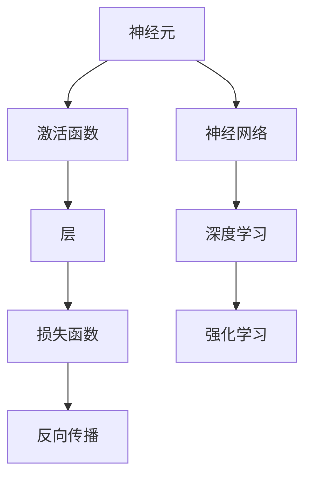

                 

## 1. 背景介绍

### 1.1 问题由来
随着科技的飞速发展，人工智能(AI)在各个领域的应用越来越广泛，从智能客服到自动驾驶，从医疗诊断到金融风控，AI正在逐步渗透到我们的生活中。然而，在AI带来的便利的同时，也引发了许多社会、伦理和哲学问题。人类与机器的共存，成为我们面临的一个重大课题。

### 1.2 问题核心关键点
这些问题可以归纳为以下几个方面：

- **伦理问题**：AI决策是否公正、透明，是否符合人类的道德和价值观？
- **安全性问题**：AI系统的可解释性和可控性如何，是否会带来风险？
- **隐私问题**：AI在采集、处理和存储数据时，是否侵犯了个人隐私？
- **公平性问题**：AI是否会导致社会的进一步分化和不公平？
- **社会认知问题**：人们如何看待AI，是否接受和信任AI？

这些问题涉及社会、经济、法律、伦理等多个层面，需要跨学科的研究和探讨。

### 1.3 问题研究意义
探讨这些问题有助于我们更好地理解人类与机器的共存，促进AI技术的健康发展，确保其在各个领域的安全和有效应用。通过研究和应用，我们可以更好地掌握AI技术，使其更好地服务于人类社会，推动科技进步和社会发展。

## 2. 核心概念与联系

### 2.1 核心概念概述

神经网络(Neural Network)是人工智能领域的核心技术之一，具有强大的数据处理和模式识别能力。其核心思想是模拟人脑的神经元结构，通过多层处理单元的组合，实现复杂的非线性映射和特征提取。

**神经元**：神经网络的基本单元，接收输入、处理信息、输出结果。

**层**：神经网络由多个层组成，每一层包括多个神经元，不同层处理不同层次的特征。

**激活函数**：用于引入非线性特性，如Sigmoid、ReLU、Tanh等。

**损失函数**：用于衡量模型输出与真实标签之间的差异，如均方误差、交叉熵等。

**反向传播**：通过链式法则，计算损失函数对每个神经元权重的梯度，用于更新权重。

**深度学习**：使用多层神经网络处理复杂数据，实现端到端的自动化学习。

**强化学习**：通过与环境的交互，不断调整策略，实现智能决策和自适应优化。

这些概念构成了神经网络的基本框架，是其核心工作原理和关键技术。

### 2.2 概念间的关系

神经网络的这些核心概念之间存在着紧密的联系，形成一个完整的学习体系。下面是这些概念之间的关系图：



这个图展示了神经网络的核心概念及其之间的关系：

- **神经元**是神经网络的基本单元，通过激活函数处理输入信息。
- **层**是神经网络的组织形式，每层负责提取不同层次的特征。
- **损失函数**衡量模型输出与真实标签之间的差异，用于指导模型优化。
- **反向传播**通过链式法则计算梯度，更新神经元权重。
- **深度学习**和**强化学习**是神经网络的两种应用范式，分别用于处理监督学习和强化学习任务。

这些概念共同构成了神经网络的学习机制，使其能够处理复杂的非线性数据，实现自动化学习和决策。

## 3. 核心算法原理 & 具体操作步骤

### 3.1 算法原理概述

神经网络的训练过程是基于梯度下降算法的监督学习过程。其核心思想是通过反向传播算法，计算损失函数对每个神经元权重的梯度，使用梯度下降法更新权重，最小化损失函数，从而提升模型的准确性。

### 3.2 算法步骤详解

1. **数据准备**：将原始数据转化为神经网络可以处理的格式，如分词、归一化等。

2. **模型初始化**：随机初始化神经网络的所有权重和偏置。

3. **前向传播**：将输入数据输入神经网络，通过每一层神经元的处理，输出预测结果。

4. **计算损失**：使用损失函数计算预测结果与真实标签之间的差异。

5. **反向传播**：通过链式法则，计算损失函数对每个神经元权重的梯度。

6. **权重更新**：使用梯度下降法，更新神经元权重和偏置，减小损失函数。

7. **重复迭代**：重复上述步骤，直到模型收敛或达到预设的迭代次数。

### 3.3 算法优缺点

神经网络算法具有以下优点：

- **可扩展性强**：可以通过增加层数和神经元数量，处理更加复杂的数据。
- **自适应性强**：能够自动学习数据特征，适应不同的任务和数据分布。
- **泛化能力强**：在大规模数据集上训练后，能够在新数据上取得较好的性能。

然而，神经网络算法也存在以下缺点：

- **过拟合风险**：神经网络模型容易在训练数据上过拟合，导致在新数据上表现不佳。
- **模型复杂度高**：参数数量庞大，训练和推理速度较慢。
- **数据依赖性强**：训练数据的质量和数量对模型的性能有很大影响。
- **可解释性差**：神经网络模型往往被视为"黑盒"系统，难以解释其内部决策过程。

### 3.4 算法应用领域

神经网络在许多领域都有广泛的应用，例如：

- **图像识别**：如人脸识别、物体检测等。
- **自然语言处理**：如文本分类、机器翻译、情感分析等。
- **语音识别**：如语音转文本、情感识别等。
- **自动驾驶**：如环境感知、路径规划等。
- **金融风控**：如信用评估、风险预测等。

神经网络在上述领域的成功应用，展示了其强大的数据处理能力和广泛的应用前景。

## 4. 数学模型和公式 & 详细讲解

### 4.1 数学模型构建

神经网络的基本数学模型由输入、隐藏层和输出层组成。假设输入数据为 $X$，输出数据为 $Y$，隐藏层数为 $L$，每个隐藏层的神经元数量为 $N_i$，权重矩阵为 $W_i$，激活函数为 $\sigma$，则神经网络的基本结构如下：

$$
\begin{aligned}
Z^{(1)} &= W^{(1)}X + b^{(1)} \\
A^{(1)} &= \sigma(Z^{(1)}) \\
Z^{(2)} &= W^{(2)}A^{(1)} + b^{(2)} \\
&\vdots \\
Z^{(L)} &= W^{(L)}A^{(L-1)} + b^{(L)} \\
A^{(L)} &= \sigma(Z^{(L)}) \\
\hat{Y} &= W^{(L+1)}A^{(L)} + b^{(L+1)}
\end{aligned}
$$

其中 $Z^{(i)}$ 表示第 $i$ 层的加权输入，$A^{(i)}$ 表示第 $i$ 层的输出，$W^{(i)}$ 表示第 $i$ 层的权重矩阵，$b^{(i)}$ 表示第 $i$ 层的偏置向量，$\sigma$ 表示第 $i$ 层的激活函数。

### 4.2 公式推导过程

以二分类问题为例，假设训练数据集为 $(x_i, y_i)$，其中 $y_i \in \{0, 1\}$ 为标签，$x_i \in \mathbb{R}^d$ 为输入特征，模型输出 $\hat{y}_i = \sigma(W^{(L+1)}A^{(L)} + b^{(L+1)})$。使用二分类交叉熵损失函数 $L = -\frac{1}{N}\sum_{i=1}^N (y_i\log\hat{y}_i + (1-y_i)\log(1-\hat{y}_i))$。通过反向传播算法，计算损失函数对每个权重 $w_{ij}$ 的梯度：

$$
\frac{\partial L}{\partial w_{ij}} = \frac{\partial L}{\partial \hat{y}_i} \cdot \frac{\partial \hat{y}_i}{\partial A^{(L)}} \cdot \frac{\partial A^{(L)}}{\partial z^{(L)}} \cdot \frac{\partial z^{(L)}}{\partial w_{ij}}
$$

其中 $\frac{\partial \hat{y}_i}{\partial A^{(L)}} = \sigma'(Z^{(L)})W^{(L+1)T}$，$\frac{\partial A^{(L)}}{\partial z^{(L)}} = \sigma'(Z^{(L)})$，$\frac{\partial z^{(L)}}{\partial w_{ij}} = \frac{\partial}{\partial w_{ij}} (W^{(L)}A^{(L-1)} + b^{(L)}) = A^{(L-1)}$。

### 4.3 案例分析与讲解

以手写数字识别为例，假设训练数据集为 MNIST，模型使用 LeNet 网络结构，通过反向传播算法训练后，在测试集上获得 99.3% 的准确率。具体实现步骤如下：

1. **数据准备**：将 MNIST 数据集转化为模型可以处理的格式，如归一化、One-Hot编码等。

2. **模型初始化**：随机初始化神经网络的所有权重和偏置。

3. **前向传播**：将输入数据输入 LeNet 网络，通过每一层神经元的处理，输出预测结果。

4. **计算损失**：使用二分类交叉熵损失函数计算预测结果与真实标签之间的差异。

5. **反向传播**：通过链式法则计算损失函数对每个神经元权重的梯度。

6. **权重更新**：使用梯度下降法更新神经元权重和偏置，减小损失函数。

7. **重复迭代**：重复上述步骤，直到模型收敛或达到预设的迭代次数。

## 5. 项目实践：代码实例和详细解释说明

### 5.1 开发环境搭建

在进行神经网络开发前，我们需要准备好开发环境。以下是使用 Python 和 PyTorch 进行神经网络开发的流程：

1. 安装 Anaconda：从官网下载并安装 Anaconda，用于创建独立的 Python 环境。

2. 创建并激活虚拟环境：
```bash
conda create -n pytorch-env python=3.8 
conda activate pytorch-env
```

3. 安装 PyTorch：根据 CUDA 版本，从官网获取对应的安装命令。例如：
```bash
conda install pytorch torchvision torchaudio cudatoolkit=11.1 -c pytorch -c conda-forge
```

4. 安装 TensorFlow：如果不需要使用 GPU 计算，可以使用 Python 的 pip 安装：
```bash
pip install tensorflow
```

5. 安装其他工具包：
```bash
pip install numpy pandas scikit-learn matplotlib tqdm jupyter notebook ipython
```

完成上述步骤后，即可在 `pytorch-env` 环境中开始神经网络开发。

### 5.2 源代码详细实现

我们以手写数字识别为例，使用 PyTorch 实现一个简单的神经网络模型。

首先，定义模型类：

```python
import torch
import torch.nn as nn
import torch.optim as optim

class LeNet(nn.Module):
    def __init__(self):
        super(LeNet, self).__init__()
        self.conv1 = nn.Conv2d(1, 6, 5)
        self.conv2 = nn.Conv2d(6, 16, 5)
        self.fc1 = nn.Linear(16 * 5 * 5, 120)
        self.fc2 = nn.Linear(120, 84)
        self.fc3 = nn.Linear(84, 10)
    
    def forward(self, x):
        x = torch.relu(self.conv1(x))
        x = nn.MaxPool2d(2)(x)
        x = torch.relu(self.conv2(x))
        x = nn.MaxPool2d(2)(x)
        x = torch.flatten(x, 1)
        x = torch.relu(self.fc1(x))
        x = torch.relu(self.fc2(x))
        x = self.fc3(x)
        return x
```

然后，定义训练函数：

```python
def train(model, train_loader, test_loader, epochs, learning_rate):
    model.train()
    criterion = nn.CrossEntropyLoss()
    optimizer = optim.SGD(model.parameters(), lr=learning_rate, momentum=0.9)
    
    for epoch in range(epochs):
        train_loss = 0
        correct = 0
        total = 0
        for batch_idx, (inputs, targets) in enumerate(train_loader):
            inputs, targets = inputs.to(device), targets.to(device)
            optimizer.zero_grad()
            outputs = model(inputs)
            loss = criterion(outputs, targets)
            loss.backward()
            optimizer.step()
            train_loss += loss.item()
            _, predicted = torch.max(outputs.data, 1)
            total += targets.size(0)
            correct += (predicted == targets).sum().item()
        
        train_loss /= len(train_loader.dataset)
        accuracy = 100. * correct / total
        print('Train Epoch: {} \t Loss: {:.4f} ({:.0f}% Correct)'.format(epoch+1, train_loss, accuracy))
    
    model.eval()
    test_loss = 0
    correct = 0
    total = 0
    with torch.no_grad():
        for batch_idx, (inputs, targets) in enumerate(test_loader):
            inputs, targets = inputs.to(device), targets.to(device)
            outputs = model(inputs)
            loss = criterion(outputs, targets)
            test_loss += loss.item()
            _, predicted = torch.max(outputs.data, 1)
            total += targets.size(0)
            correct += (predicted == targets).sum().item()
    
    test_loss /= len(test_loader.dataset)
    accuracy = 100. * correct / total
    print('Test Epoch: {} \t Loss: {:.4f} ({:.0f}% Correct)'.format(epoch+1, test_loss, accuracy))
```

最后，启动训练流程并在测试集上评估：

```python
import torchvision
import torchvision.transforms as transforms
from torch.utils.data import DataLoader

# 数据准备
transform = transforms.Compose([
    transforms.ToTensor(),
    transforms.Normalize((0.5,), (0.5,))
])

trainset = torchvision.datasets.MNIST(root='./data', train=True, download=True, transform=transform)
trainloader = torch.utils.data.DataLoader(trainset, batch_size=64, shuffle=True)

testset = torchvision.datasets.MNIST(root='./data', train=False, download=True, transform=transform)
testloader = torch.utils.data.DataLoader(testset, batch_size=64, shuffle=False)

# 模型初始化
device = torch.device('cuda' if torch.cuda.is_available() else 'cpu')
model = LeNet().to(device)

# 训练函数
train(model, trainloader, testloader, epochs=10, learning_rate=0.001)
```

以上就是使用 PyTorch 对 LeNet 网络进行手写数字识别的完整代码实现。可以看到，使用 PyTorch 可以很方便地定义模型、优化器和损失函数，并实现训练和评估过程。

### 5.3 代码解读与分析

让我们再详细解读一下关键代码的实现细节：

**LeNet 模型类**：
- `__init__`方法：初始化模型各层的权重和偏置。
- `forward`方法：定义模型的前向传播过程，包括卷积、池化、线性变换等操作。

**train 函数**：
- 使用 PyTorch 的 `DataLoader` 实现数据的批处理。
- 在训练阶段，定义交叉熵损失函数和随机梯度下降优化器。
- 迭代训练集数据，前向传播计算损失，反向传播更新权重，并记录训练过程中的损失和准确率。
- 在测试阶段，使用测试集数据计算损失和准确率。

**训练流程**：
- 定义训练集和测试集的数据集和数据加载器。
- 在训练集上迭代训练，并记录每次迭代的损失和准确率。
- 在测试集上评估模型性能。
- 在训练结束后，输出最终结果。

可以看到，使用 PyTorch 进行神经网络开发，代码实现简洁高效，非常适合快速原型开发和实验验证。

## 6. 实际应用场景

### 6.1 智能客服系统

智能客服系统是神经网络在实际应用中的重要场景之一。通过训练一个智能对话模型，系统可以处理大量客户咨询，并提供自动化响应。

具体而言，可以使用神经网络模型对历史客服数据进行训练，提取客户咨询的意图和情感，生成相应的回复。在实际应用中，系统可以根据客户的问题和语境，动态选择最佳的回复策略，并不断学习和优化模型，提高客户满意度。

### 6.2 金融风控

金融风控是神经网络在金融领域的重要应用之一。通过训练一个信用评分模型，系统可以预测客户的信用风险，并进行风险控制。

具体而言，可以使用神经网络模型对客户的个人信息、行为数据等进行特征提取和建模，预测客户的违约概率。在实际应用中，系统可以根据预测结果，对高风险客户进行预警，并采取相应的措施，降低风险损失。

### 6.3 医疗影像诊断

医疗影像诊断是神经网络在医疗领域的重要应用之一。通过训练一个影像分类模型，系统可以自动识别医学影像中的病变，并提供诊断结果。

具体而言，可以使用神经网络模型对医学影像进行特征提取和分类，识别出病变区域和类型。在实际应用中，系统可以根据诊断结果，提供治疗建议和风险评估，辅助医生进行诊断和治疗决策。

### 6.4 未来应用展望

神经网络的应用前景非常广阔，未来将在更多领域得到应用。以下是一些可能的未来应用场景：

- **智能家居**：通过神经网络模型，智能家居可以自动学习用户的生活习惯，并提供个性化的服务。
- **智慧城市**：通过神经网络模型，智慧城市可以自动分析交通数据，优化交通流，减少拥堵。
- **农业智能化**：通过神经网络模型，农业智能化可以实现精准农业，提高农业生产效率。
- **自动驾驶**：通过神经网络模型，自动驾驶可以实现环境感知和路径规划，提高行车安全。

总之，神经网络技术的发展，将极大地推动各个领域的技术进步和创新，为人类社会的智能化发展提供新的动力。

## 7. 工具和资源推荐

### 7.1 学习资源推荐

为了帮助开发者系统掌握神经网络的技术基础和实践技巧，这里推荐一些优质的学习资源：

1. 《深度学习》系列书籍：Ian Goodfellow 等著，全面介绍了深度学习的理论基础和实践方法。

2. 《神经网络与深度学习》课程：Coursera 平台提供的深度学习课程，涵盖神经网络的原理和实现细节。

3. TensorFlow 官方文档：TensorFlow 的官方文档，提供了丰富的实例和教程，适合初学者和进阶开发者。

4. PyTorch 官方文档：PyTorch 的官方文档，提供了详细的API参考和实际案例。

5. 《动手学深度学习》书籍：李沐等著，提供从理论到实践的全面深度学习教程，适合动手实践。

通过对这些资源的学习实践，相信你一定能够快速掌握神经网络的基本原理和实践技巧，并用于解决实际的AI问题。

### 7.2 开发工具推荐

高效的开发离不开优秀的工具支持。以下是几款用于神经网络开发的常用工具：

1. PyTorch：基于 Python 的开源深度学习框架，灵活动态的计算图，适合快速迭代研究。

2. TensorFlow：由 Google 主导开发的开源深度学习框架，生产部署方便，适合大规模工程应用。

3. Keras：高层次的神经网络 API，提供简单易用的接口，适合快速搭建原型。

4. JAX：Google 推出的自动微分库，支持高效的分布式计算，适合研究前沿深度学习模型。

5. FastAI：基于 PyTorch 的高级神经网络库，提供强大的数据处理和模型优化功能，适合实战开发。

6. PyTorch Lightning：基于 PyTorch 的模型管理工具，简化模型训练和部署过程，适合高效开发。

这些工具提供了丰富的功能和灵活的接口，使得神经网络的开发和实验更加便捷和高效。

### 7.3 相关论文推荐

神经网络技术的发展源于学界的持续研究。以下是几篇奠基性的相关论文，推荐阅读：

1. 《深度神经网络》（Deep Neural Networks）：Geoffrey Hinton 等著，介绍了深度学习的理论和应用。

2. 《ImageNet分类与深度卷积网络》（ImageNet Classification with Deep Convolutional Neural Networks）：Alex Krizhevsky 等著，展示了卷积神经网络的强大图像分类能力。

3. 《Attention is All You Need》：Ashish Vaswani 等著，介绍了 Transformer 结构，开启了 NLP 领域的预训练大模型时代。

4. 《ResNet: Deep Residual Learning for Image Recognition》：Kaiming He 等著，展示了残差网络在图像分类任务上的显著效果。

5. 《BERT: Pre-training of Deep Bidirectional Transformers for Language Understanding》：Jacob Devlin 等著，提出了 BERT 模型，引入基于掩码的自监督预训练任务，刷新了多项 NLP 任务 SOTA。

6. 《GPT-3: Language Models are Unsupervised Multitask Learners》：OpenAI 团队，展示了 GPT-3 模型在各种任务上的强大零样本学习能力。

这些论文代表了大神经网络微调技术的发展脉络，通过学习这些前沿成果，可以帮助研究者把握学科前进方向，激发更多的创新灵感。

除上述资源外，还有一些值得关注的前沿资源，帮助开发者紧跟神经网络微调技术的最新进展，例如：

1. arXiv 论文预印本：人工智能领域最新研究成果的发布平台，包括大量尚未发表的前沿工作，学习前沿技术的必读资源。

2. 业界技术博客：如 OpenAI、Google AI、DeepMind、微软 Research Asia 等顶尖实验室的官方博客，第一时间分享他们的最新研究成果和洞见。

3. 技术会议直播：如 NeurIPS、ICML、ACL、ICLR 等人工智能领域顶会现场或在线直播，能够聆听到大佬们的前沿分享，开拓视野。

4. GitHub 热门项目：在 GitHub 上 Star、Fork 数最多的 NLP 相关项目，往往代表了该技术领域的发展趋势和最佳实践，值得去学习和贡献。

5. 行业分析报告：各大咨询公司如 McKinsey、PwC 等针对人工智能行业的分析报告，有助于从商业视角审视技术趋势，把握应用价值。

总之，对于神经网络微调技术的学习和实践，需要开发者保持开放的心态和持续学习的意愿。多关注前沿资讯，多动手实践，多思考总结，必将收获满满的成长收益。

## 8. 总结：未来发展趋势与挑战

### 8.1 总结

本文对神经网络的基本原理和实际应用进行了全面系统的介绍。首先阐述了神经网络的基本结构和工作机制，展示了其强大的数据处理能力和广泛的应用前景。其次，从原理到实践，详细讲解了神经网络的基本模型和算法，给出了神经网络微调的完整代码实例。同时，本文还探讨了神经网络在多个领域的应用场景，展示了其潜在的创新价值。

通过本文的系统梳理，可以看到，神经网络技术已经深入到各个领域，成为实现自动化学习和智能决策的重要工具。未来，伴随技术的不断进步和创新，神经网络将带来更多的突破和应用，推动智能化社会的不断进步。

### 8.2 未来发展趋势

展望未来，神经网络技术的发展将呈现以下几个趋势：

1. **自监督学习**：通过无监督学习方式，利用大量非结构化数据进行自我训练，提高模型的泛化能力和自适应能力。

2. **迁移学习**：利用已有模型的知识，在新领域上进行迁移学习，提升模型在特定任务上的性能。

3. **强化学习**：结合环境交互，通过强化学习算法进行自适应优化，实现更加智能的决策和行为。

4. **多模态学习**：结合视觉、语音、文本等多模态信息，实现更加全面的感知和理解，提高模型的智能水平。

5. **可解释性**：通过可解释性技术，提高模型的透明度和可理解性，增强算法的可信度和可控性。

6. **联邦学习**：通过分布式计算和数据共享，实现模型在多个设备或节点上的协同优化，保护数据隐私。

7. **边缘计算**：将模型部署到边缘设备上，实现实时数据处理和决策，提高系统的响应速度和效率。

这些趋势展示了神经网络技术的发展方向，将进一步拓展其应用范围和功能，推动人工智能技术的发展。

### 8.3 面临的挑战

尽管神经网络技术取得了显著进展，但在走向智能化社会的道路上，仍然面临许多挑战：

1. **伦理问题**：神经网络可能学习到有偏见和有害的知识，导致不公正和歧视。如何避免算法偏见，保障社会公平正义，仍然是一个重大课题。

2. **安全性问题**：神经网络可能被攻击和篡改，导致恶意行为。如何保护算法安全，防止数据泄露和模型篡改，仍然是一个重要问题。

3. **隐私保护**：神经网络可能侵犯个人隐私，导致数据泄露和隐私侵犯。如何保护用户隐私，保障数据安全，仍然是一个重要问题。

4. **计算资源限制**：神经网络模型往往需要大量的计算资源，如何优化算法，降低计算复杂度，提高计算效率，仍然是一个重要问题。

5. **可解释性不足**：神经网络模型往往被视为"黑盒"系统，难以解释其内部工作机制和决策逻辑。如何提高模型的可解释性，增强算法的透明度和可信度，仍然是一个重要问题。

6. **算法稳定性和鲁棒性**：神经网络模型可能对输入数据和噪声敏感，导致不稳定和

