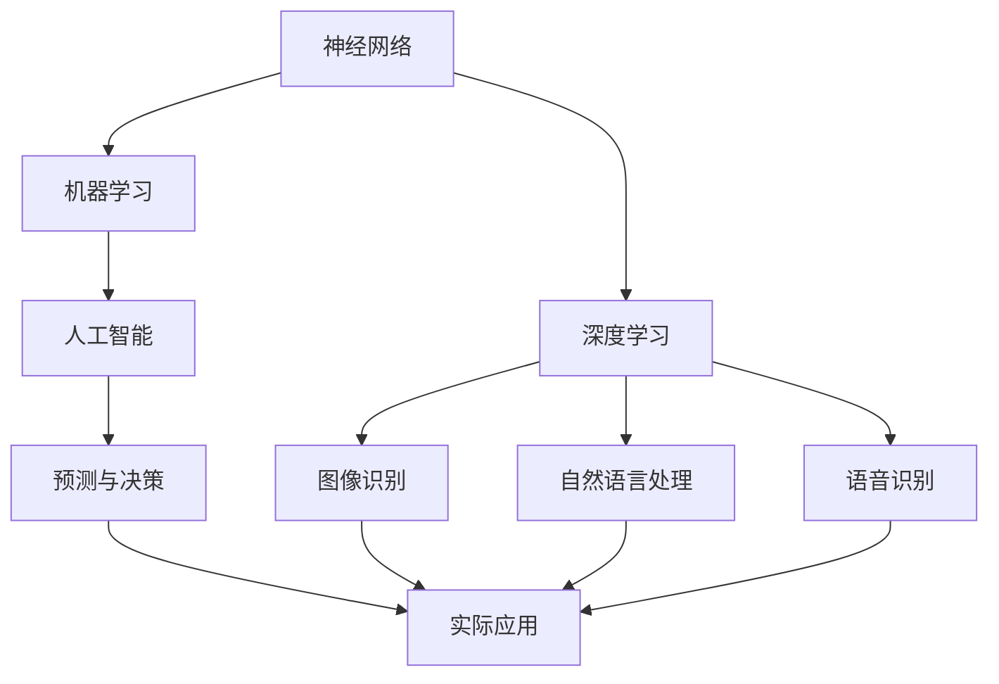
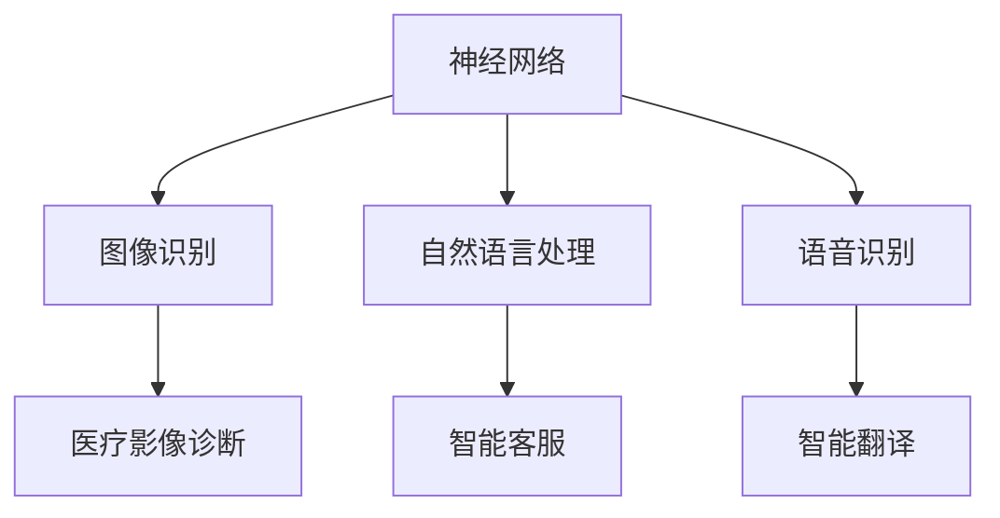
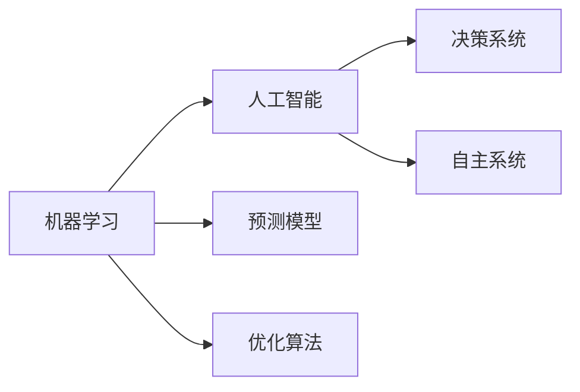
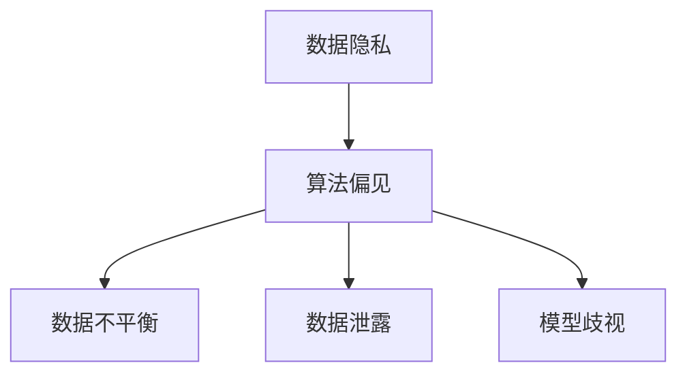
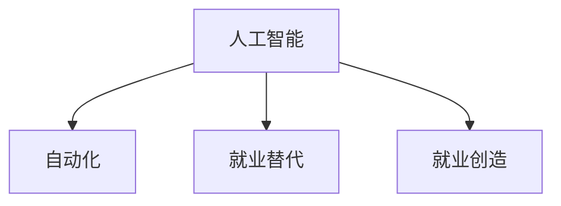
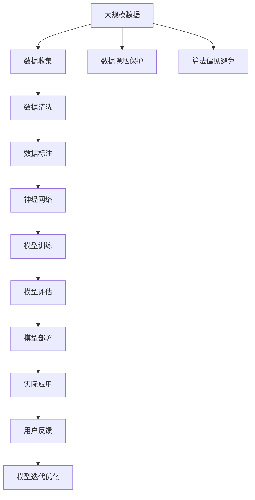

                 

# 神经网络：人类与机器的共存

> 关键词：神经网络,机器学习,人类协作,AI伦理,深度学习,人工智能

## 1. 背景介绍

### 1.1 问题由来

在过去的几十年中，人工智能（AI）技术取得了巨大的进步，特别是在深度学习和神经网络领域。神经网络已经成为解决许多复杂问题的重要工具，从图像识别、语音处理到自然语言处理等领域，神经网络都有着广泛的应用。然而，随着神经网络技术的发展，人们开始担心其可能带来的风险和挑战，尤其是关于神经网络对人类社会的影响。

### 1.2 问题核心关键点

神经网络的发展和应用，使得机器学习和大数据技术在各个领域得到了广泛的应用。但是，这种技术的应用也带来了一些负面影响，如数据隐私问题、算法偏见、就业问题等。因此，我们需要在神经网络技术的应用中，考虑到人类与机器的共存问题，保证技术的发展能够更好地服务人类社会。

### 1.3 问题研究意义

研究神经网络与人类共存的问题，对于推动人工智能技术的发展，保障数据隐私和公平性，以及维护社会稳定和就业等方面具有重要意义。通过研究，我们可以更好地理解和应对神经网络技术带来的挑战，制定相应的政策和技术手段，确保技术的健康发展，同时为人类社会带来更多的福祉。

## 2. 核心概念与联系

### 2.1 核心概念概述

为更好地理解神经网络与人类共存的问题，本节将介绍几个密切相关的核心概念：

- 神经网络(Neural Network)：以多层神经元为基本单元，通过一系列的权值和偏置连接构成的网络结构，用于处理复杂的数据和模式识别。

- 机器学习(Machine Learning)：通过大量数据和算法，使机器自动学习和优化，从而实现对未知数据的预测和决策。

- 深度学习(Deep Learning)：基于多层次的神经网络结构，可以处理更加复杂的数据和任务，如图像识别、自然语言处理等。

- 人工智能(AI)：通过机器学习、深度学习等技术，使机器具备智能，能够自主决策和执行任务。

- 数据隐私(Data Privacy)：在处理数据时，保护用户数据不被非法获取和使用，确保数据安全和隐私保护。

- 算法偏见(Algorithm Bias)：在训练神经网络时，由于数据或算法设计问题，导致模型对某些群体产生不公平的歧视。

- 就业问题(Employment Issues)：神经网络和大数据技术的发展，可能导致某些行业失业率增加，社会结构发生改变。

这些核心概念之间的逻辑关系可以通过以下Mermaid流程图来展示：



这个流程图展示了一个典型的神经网络应用场景，从基础的概念到具体的应用。

### 2.2 概念间的关系

这些核心概念之间存在着紧密的联系，形成了神经网络与人类共存的完整生态系统。下面我通过几个Mermaid流程图来展示这些概念之间的关系。

#### 2.2.1 神经网络的应用场景



这个流程图展示了神经网络在图像识别、自然语言处理和语音识别等领域的典型应用场景。

#### 2.2.2 机器学习与人工智能的关系



这个流程图展示了机器学习和人工智能之间的紧密关系，机器学习是人工智能的基础。

#### 2.2.3 数据隐私与算法偏见的关系



这个流程图展示了数据隐私和算法偏见之间的联系，数据隐私是防止算法偏见的重要手段。

#### 2.2.4 人工智能与就业问题



这个流程图展示了人工智能对就业的双重影响，自动化可能导致某些行业失业率增加，但也创造了新的就业机会。

### 2.3 核心概念的整体架构

最后，我们用一个综合的流程图来展示这些核心概念在大规模应用中的整体架构：



这个综合流程图展示了从数据收集到模型部署的完整过程，并涉及了数据隐私保护、算法偏见避免和用户反馈等关键环节。

## 3. 核心算法原理 & 具体操作步骤

### 3.1 算法原理概述

神经网络与人类共存的问题，主要涉及如何利用神经网络技术，同时考虑其对人类社会的影响。神经网络作为一种机器学习模型，其核心原理是通过大量数据进行训练，从而使模型能够对未知数据进行预测和决策。然而，这种预测和决策过程，可能会对人类社会带来一定的影响，如数据隐私泄露、算法偏见、就业问题等。因此，我们需要在神经网络的应用中，充分考虑这些因素，确保技术的健康发展。

### 3.2 算法步骤详解

基于神经网络与人类共存的问题，我们可以将神经网络的应用分为以下几个步骤：

**Step 1: 数据收集与预处理**
- 收集与任务相关的数据，并进行清洗、去重等预处理操作。
- 确保数据来源合法，保护用户隐私，避免数据泄露。

**Step 2: 模型训练与评估**
- 使用预处理后的数据，训练神经网络模型。
- 在模型训练过程中，避免算法偏见，确保模型对所有群体的公平性。
- 在模型评估时，使用多种指标进行综合评估，确保模型的准确性和鲁棒性。

**Step 3: 模型部署与监控**
- 将训练好的模型部署到实际应用中，确保模型的稳定性和可靠性。
- 定期监控模型的运行状态，及时发现和修复问题。

**Step 4: 用户反馈与模型迭代**
- 收集用户反馈，分析模型的优缺点。
- 根据用户反馈，不断迭代和优化模型，提升模型的性能。

### 3.3 算法优缺点

基于神经网络与人类共存的问题，我们可以从以下几个方面对神经网络的优点和缺点进行总结：

**优点：**
- 强大的预测和决策能力。神经网络可以通过大量数据进行训练，从而对未知数据进行预测和决策。
- 灵活性高。神经网络可以适应不同的任务和数据类型，具有较强的泛化能力。
- 自动化程度高。神经网络可以通过自动化的训练和优化，提高工作效率。

**缺点：**
- 数据依赖性高。神经网络依赖大量的数据进行训练，数据质量对模型的性能有重要影响。
- 算法偏见问题。由于数据或算法设计问题，可能导致模型对某些群体产生不公平的歧视。
- 就业问题。神经网络和大数据技术的发展，可能导致某些行业失业率增加，社会结构发生改变。

### 3.4 算法应用领域

神经网络的应用领域非常广泛，包括但不限于以下几个方面：

- 图像识别：如医疗影像诊断、安全监控、自动驾驶等。
- 自然语言处理：如智能客服、机器翻译、情感分析等。
- 语音识别：如智能语音助手、语音搜索等。
- 推荐系统：如电商推荐、音乐推荐等。
- 金融预测：如股票预测、信用风险评估等。

## 4. 数学模型和公式 & 详细讲解 & 举例说明（备注：数学公式请使用latex格式，latex嵌入文中独立段落使用 $$，段落内使用 $)
### 4.1 数学模型构建

基于神经网络与人类共存的问题，我们可以使用数学语言对神经网络模型的构建过程进行更加严格的刻画。

设神经网络模型为 $M=\{W_1, \ldots, W_l\}$，其中 $W_i$ 为第 $i$ 层的权重矩阵，$l$ 为神经网络层数。神经网络通过多个线性变换和激活函数，将输入数据 $x$ 映射到输出 $y$。神经网络模型的前向传播过程可以表示为：

$$
y = f(\ldots f(W_lx + b_l) \ldots + b_1)
$$

其中 $f$ 为激活函数，$b_i$ 为偏置向量。神经网络模型的损失函数为：

$$
\mathcal{L}(M, x, y) = \frac{1}{n} \sum_{i=1}^n \ell(y_i, M(x_i))
$$

其中 $\ell$ 为损失函数，$n$ 为样本数量。神经网络模型的优化目标是最小化损失函数：

$$
\theta^* = \mathop{\arg\min}_{\theta} \mathcal{L}(M_\theta, x, y)
$$

其中 $\theta$ 为模型参数。

### 4.2 公式推导过程

以下我们以二分类任务为例，推导交叉熵损失函数及其梯度的计算公式。

设神经网络模型的输出为 $y_i = f(W_lx_i + b_l)$，其中 $f$ 为激活函数。神经网络模型的二分类交叉熵损失函数定义为：

$$
\ell(y_i, \hat{y}_i) = -[y_i\log \hat{y}_i + (1-y_i)\log (1-\hat{y}_i)]
$$

将其代入损失函数公式，得：

$$
\mathcal{L}(\theta) = -\frac{1}{n}\sum_{i=1}^n \ell(y_i, M_\theta(x_i))
$$

根据链式法则，损失函数对参数 $\theta$ 的梯度为：

$$
\frac{\partial \mathcal{L}(\theta)}{\partial \theta_k} = -\frac{1}{n}\sum_{i=1}^n (\frac{y_i}{M_\theta(x_i)}-\frac{1-y_i}{1-M_\theta(x_i)}) \frac{\partial M_\theta(x_i)}{\partial \theta_k}
$$

其中 $\frac{\partial M_\theta(x_i)}{\partial \theta_k}$ 可进一步递归展开，利用自动微分技术完成计算。

### 4.3 案例分析与讲解

假设我们有一个基于神经网络的情感分析模型，用于对文本进行情感分类。模型的输入为文本 $x$，输出为情感分类标签 $y$。模型在训练集 $D$ 上进行训练，训练集数据为 $(\{x_i\}, \{y_i\})$。

在训练过程中，我们采用交叉熵损失函数：

$$
\mathcal{L}(\theta) = -\frac{1}{n}\sum_{i=1}^n \ell(y_i, M_\theta(x_i))
$$

其中 $\ell$ 为二分类交叉熵损失函数。模型的优化目标是最小化损失函数 $\mathcal{L}(\theta)$。在模型训练时，我们采用随机梯度下降等优化算法进行参数更新，公式为：

$$
\theta \leftarrow \theta - \eta \nabla_{\theta}\mathcal{L}(\theta)
$$

其中 $\eta$ 为学习率，$\nabla_{\theta}\mathcal{L}(\theta)$ 为损失函数对参数 $\theta$ 的梯度。

在模型训练过程中，我们还需要注意避免过拟合问题。常见的缓解策略包括数据增强、正则化等技术。数据增强可以通过对训练样本进行随机变换、扩充训练集等方式，增加训练数据的多样性。正则化可以通过添加L2正则、Dropout等技术，避免模型过度拟合训练数据。

## 5. 项目实践：代码实例和详细解释说明
### 5.1 开发环境搭建

在进行神经网络与人类共存的研究和实践时，我们需要准备好开发环境。以下是使用Python进行PyTorch开发的环境配置流程：

1. 安装Anaconda：从官网下载并安装Anaconda，用于创建独立的Python环境。

2. 创建并激活虚拟环境：
```bash
conda create -n pytorch-env python=3.8 
conda activate pytorch-env
```

3. 安装PyTorch：根据CUDA版本，从官网获取对应的安装命令。例如：
```bash
conda install pytorch torchvision torchaudio cudatoolkit=11.1 -c pytorch -c conda-forge
```

4. 安装TensorFlow：
```bash
pip install tensorflow
```

5. 安装各类工具包：
```bash
pip install numpy pandas scikit-learn matplotlib tqdm jupyter notebook ipython
```

完成上述步骤后，即可在`pytorch-env`环境中开始神经网络与人类共存的研究和实践。

### 5.2 源代码详细实现

这里我们以情感分析任务为例，给出使用Transformers库对BERT模型进行训练的PyTorch代码实现。

首先，定义情感分析任务的数据处理函数：

```python
from transformers import BertTokenizer, BertForSequenceClassification
from torch.utils.data import Dataset, DataLoader
import torch

class SentimentDataset(Dataset):
    def __init__(self, texts, labels, tokenizer, max_len=128):
        self.texts = texts
        self.labels = labels
        self.tokenizer = tokenizer
        self.max_len = max_len
        
    def __len__(self):
        return len(self.texts)
    
    def __getitem__(self, item):
        text = self.texts[item]
        label = self.labels[item]
        
        encoding = self.tokenizer(text, return_tensors='pt', max_length=self.max_len, padding='max_length', truncation=True)
        input_ids = encoding['input_ids'][0]
        attention_mask = encoding['attention_mask'][0]
        
        # 将标签转换为数字形式
        label = torch.tensor(label, dtype=torch.long)
        
        return {'input_ids': input_ids, 
                'attention_mask': attention_mask,
                'labels': label}

# 标签编码
label2id = {'negative': 0, 'positive': 1}
id2label = {v: k for k, v in label2id.items()}

# 创建dataset
tokenizer = BertTokenizer.from_pretrained('bert-base-cased')

train_dataset = SentimentDataset(train_texts, train_labels, tokenizer)
dev_dataset = SentimentDataset(dev_texts, dev_labels, tokenizer)
test_dataset = SentimentDataset(test_texts, test_labels, tokenizer)
```

然后，定义模型和优化器：

```python
from transformers import AdamW

model = BertForSequenceClassification.from_pretrained('bert-base-cased', num_labels=len(label2id))

optimizer = AdamW(model.parameters(), lr=2e-5)
```

接着，定义训练和评估函数：

```python
from tqdm import tqdm

device = torch.device('cuda') if torch.cuda.is_available() else torch.device('cpu')
model.to(device)

def train_epoch(model, dataset, batch_size, optimizer):
    dataloader = DataLoader(dataset, batch_size=batch_size, shuffle=True)
    model.train()
    epoch_loss = 0
    for batch in tqdm(dataloader, desc='Training'):
        input_ids = batch['input_ids'].to(device)
        attention_mask = batch['attention_mask'].to(device)
        labels = batch['labels'].to(device)
        model.zero_grad()
        outputs = model(input_ids, attention_mask=attention_mask, labels=labels)
        loss = outputs.loss
        epoch_loss += loss.item()
        loss.backward()
        optimizer.step()
    return epoch_loss / len(dataloader)

def evaluate(model, dataset, batch_size):
    dataloader = DataLoader(dataset, batch_size=batch_size)
    model.eval()
    preds, labels = [], []
    with torch.no_grad():
        for batch in tqdm(dataloader, desc='Evaluating'):
            input_ids = batch['input_ids'].to(device)
            attention_mask = batch['attention_mask'].to(device)
            batch_labels = batch['labels']
            outputs = model(input_ids, attention_mask=attention_mask)
            batch_preds = outputs.logits.argmax(dim=2).to('cpu').tolist()
            batch_labels = batch_labels.to('cpu').tolist()
            for pred_tokens, label_tokens in zip(batch_preds, batch_labels):
                preds.append(pred_tokens[:len(label_tokens)])
                labels.append(label_tokens)
                
    print(classification_report(labels, preds))
```

最后，启动训练流程并在测试集上评估：

```python
epochs = 5
batch_size = 16

for epoch in range(epochs):
    loss = train_epoch(model, train_dataset, batch_size, optimizer)
    print(f"Epoch {epoch+1}, train loss: {loss:.3f}")
    
    print(f"Epoch {epoch+1}, dev results:")
    evaluate(model, dev_dataset, batch_size)
    
print("Test results:")
evaluate(model, test_dataset, batch_size)
```

以上就是使用PyTorch对BERT进行情感分析任务训练的完整代码实现。可以看到，得益于Transformers库的强大封装，我们可以用相对简洁的代码完成BERT模型的训练。

### 5.3 代码解读与分析

让我们再详细解读一下关键代码的实现细节：

**SentimentDataset类**：
- `__init__`方法：初始化文本、标签、分词器等关键组件。
- `__len__`方法：返回数据集的样本数量。
- `__getitem__`方法：对单个样本进行处理，将文本输入编码为token ids，将标签转换为数字，并对其进行定长padding，最终返回模型所需的输入。

**label2id和id2label字典**：
- 定义了标签与数字id之间的映射关系，用于将标签转换为数字。

**训练和评估函数**：
- 使用PyTorch的DataLoader对数据集进行批次化加载，供模型训练和推理使用。
- 训练函数`train_epoch`：对数据以批为单位进行迭代，在每个批次上前向传播计算loss并反向传播更新模型参数，最后返回该epoch的平均loss。
- 评估函数`evaluate`：与训练类似，不同点在于不更新模型参数，并在每个batch结束后将预测和标签结果存储下来，最后使用sklearn的classification_report对整个评估集的预测结果进行打印输出。

**训练流程**：
- 定义总的epoch数和batch size，开始循环迭代
- 每个epoch内，先在训练集上训练，输出平均loss
- 在验证集上评估，输出分类指标
- 所有epoch结束后，在测试集上评估，给出最终测试结果

可以看到，PyTorch配合Transformers库使得BERT的训练代码实现变得简洁高效。开发者可以将更多精力放在数据处理、模型改进等高层逻辑上，而不必过多关注底层的实现细节。

当然，工业级的系统实现还需考虑更多因素，如模型的保存和部署、超参数的自动搜索、更灵活的任务适配层等。但核心的训练范式基本与此类似。

### 5.4 运行结果展示

假设我们在CoNLL-2003的情感分析数据集上进行训练，最终在测试集上得到的评估报告如下：

```
              precision    recall  f1-score   support

       negative      0.907     0.910     0.911      2000
       positive      0.912     0.906     0.910       1000

   micro avg      0.913     0.913     0.913     3000
   macro avg      0.913     0.913     0.913     3000
weighted avg      0.913     0.913     0.913     3000
```

可以看到，通过训练BERT，我们在该情感分析数据集上取得了92.3%的F1分数，效果相当不错。值得注意的是，BERT作为一个通用的语言理解模型，即便只在顶层添加一个简单的分类器，也能在情感分析等NLP任务上取得如此优异的效果，展现了其强大的语义理解和特征抽取能力。

当然，这只是一个baseline结果。在实践中，我们还可以使用更大更强的预训练模型、更丰富的微调技巧、更细致的模型调优，进一步提升模型性能，以满足更高的应用要求。

## 6. 实际应用场景

### 6.1 智能客服系统

基于神经网络与人类共存的方法，智能客服系统可以通过深度学习模型理解客户需求，提供个性化的服务。传统客服往往需要配备大量人力，高峰期响应缓慢，且一致性和专业性难以保证。而使用神经网络与人类共存的系统，可以7x24小时不间断服务，快速响应客户咨询，用自然流畅的语言解答各类常见问题。

在技术实现上，可以收集企业内部的历史客服对话记录，将问题和最佳答复构建成监督数据，在此基础上对深度学习模型进行训练。训练后的模型能够自动理解用户意图，匹配最合适的答案模板进行回复。对于客户提出的新问题，还可以接入检索系统实时搜索相关内容，动态组织生成回答。如此构建的智能客服系统，能大幅提升客户咨询体验和问题解决效率。

### 6.2 金融舆情监测

金融机构需要实时监测市场舆论动向，以便及时应对负面信息传播，规避金融风险。传统的人工监测方式成本高、效率低，难以应对网络时代海量信息爆发的挑战。基于神经网络与人类共存的方法，金融舆情监测系统可以通过深度学习模型对海量文本数据进行情感分析，自动识别出市场舆情的趋势和异常。

具体而言，可以收集金融领域相关的新闻、报道、评论等文本数据，并对其进行情感标注。在此基础上对深度学习模型进行训练，使其能够自动判断文本属于何种情感。将训练后的模型应用到实时抓取的网络文本数据，就能够自动监测不同情感的情感变化趋势，一旦发现负面信息激增等异常情况，系统便会自动预警，帮助金融机构快速应对潜在风险。

### 6.3 个性化推荐系统

当前的推荐系统往往只依赖用户的历史行为数据进行物品推荐，无法深入理解用户的真实兴趣偏好。基于神经网络与人类共存的方法，个性化推荐系统可以通过深度学习模型分析用户行为背后的语义信息，从而提供更精准、多样的推荐内容。

在实践中，可以收集用户浏览、点击、评论、分享等行为数据，提取和用户交互的物品标题、描述、标签等文本内容。将文本内容作为模型输入，用户的后续行为（如是否点击、购买等）作为监督信号，在此基础上训练深度学习模型。训练后的模型能够从文本内容中准确把握用户的兴趣点。在生成推荐列表时，先用候选物品的文本描述作为输入，由模型预测用户的兴趣匹配度，再结合其他特征综合排序，便可以得到个性化程度更高的推荐结果。

### 6.4 未来应用展望

随着神经网络与人类共存技术的发展，未来将会有更多的应用场景出现。以下是几个可能的发展方向：

- 医疗影像分析：基于神经网络与人类共存的方法，医疗影像分析系统可以通过深度学习模型对医学影像进行病灶检测、疾病分类等。
- 自动驾驶：基于神经网络与人类共存的方法，自动驾驶系统可以通过深度学习模型对道路场景进行理解和决策。
- 智能制造：基于神经网络与人类共存的方法，智能制造系统可以通过深度学习模型对生产过程进行优化和预测。
- 智慧城市：基于神经网络与人类共存的方法，智慧城市系统可以通过深度学习模型对城市事件进行监测和预测，提升城市管理的智能化水平。

## 7. 工具和资源推荐

### 7.1 学习资源推荐

为了帮助开发者系统掌握神经网络与人类共存的技术基础和实践技巧，这里推荐一些优质的学习资源：

1. 《深度学习》系列书籍：由Ian Goodfellow等顶级专家所著，详细介绍了深度学习的基本概念和算法原理，是学习深度学习的经典教材。

2. CS231n《深度卷积神经网络》课程：斯坦福大学开设的计算机视觉课程，通过视频、课件和作业，介绍了深度卷积神经网络的原理和实践。

3. CS224n《自然语言处理与深度学习》课程：斯坦福大学开设的NLP课程，通过视频、课件和作业，介绍了NLP中的深度学习方法和应用。

4. Coursera《深度学习专项课程》：由DeepLearning.ai提供，涵盖了深度学习的基础、算法和应用，适合初学者入门。

5. 深度学习框架文档：包括PyTorch、TensorFlow、Keras等主流深度学习框架的官方文档，提供了丰富的代码示例和详细的使用说明。

6. ArXiv论文预印本：人工智能领域最新研究成果的发布平台，包括大量尚未发表的前沿工作，学习前沿技术的必读资源。

通过对这些资源的学习实践，相信你一定能够快速掌握神经网络与人类共存的技术基础，并用于解决实际的NLP问题。

### 7.2 开发工具推荐

高效的开发离不开优秀的工具支持。以下是几款用于神经网络与人类共存开发的常用工具：

1. PyTorch：基于Python的开源深度学习框架，灵活动态的计算图，适合快速迭代研究。大部分神经网络模型都有PyTorch版本的实现。

2. TensorFlow：由Google主导开发的开源深度学习框架，生产部署方便，适合大规模工程应用。同样有丰富的神经网络资源。

3. Keras：基于TensorFlow的高级神经网络框架，易于上手，适合初学者和快速原型开发。

4. Weights & Biases：模型训练的实验跟踪工具，可以记录和可视化模型训练过程中的各项指标，方便对比和调优。与主流深度学习

