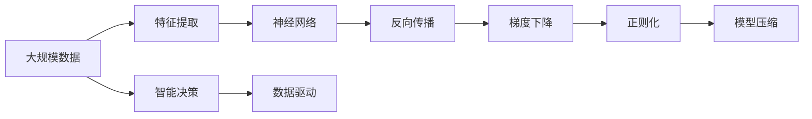

                 

# 神经网络：人类智慧的解放

> 关键词：神经网络,深度学习,人工智能,人类智慧,智能化,计算智能

## 1. 背景介绍

### 1.1 问题由来
深度学习，作为21世纪最令人瞩目的技术之一，已经在计算机视觉、自然语言处理、语音识别等多个领域取得了突破性进展。其核心技术之一——神经网络，作为模拟人脑神经元的工作机制，通过多层次的抽象和关联，将复杂的原始数据转换为更加易于理解和处理的高级特征，从而实现各类复杂的计算和决策。

神经网络技术的快速发展，让人类对于智慧的追求不再仅限于自身，而是借助计算智能，向更广大的领域延伸。从图像识别到自动驾驶，从语音交互到医疗诊断，神经网络技术的广泛应用，正在逐步解放人类的智慧，赋予机器更强的智能和自主性，开创了一个全新的人工智能时代。

### 1.2 问题核心关键点
神经网络技术的核心关键点在于其强大的数据处理能力和泛化能力。通过多层次的非线性映射，神经网络能够自动学习数据中的高级特征，从而在各种复杂场景下进行高效的预测和决策。其核心算法包括反向传播算法、梯度下降算法等，通过不断调整模型参数，最小化预测误差，使模型能够适应不同的任务需求。

然而，神经网络技术也存在一些挑战和局限性，例如过拟合、泛化性能不足、模型复杂度高等问题。针对这些问题，研究人员提出了正则化、模型压缩、联邦学习等多种优化方法，进一步提升了神经网络的应用效果和泛化性能。

### 1.3 问题研究意义
神经网络技术的研究与应用，对于推动人类社会的智能化发展，具有重要意义：

1. **提高生产效率**：通过自动化和智能化，神经网络技术能够大幅提高各种生产行业的效率，降低成本，提升质量。
2. **促进医疗进步**：在医学影像分析、基因组学、疾病预测等领域，神经网络技术能够提供更准确、快速、个性化的诊断和治疗方案，提升医疗水平。
3. **助力科学发现**：神经网络技术能够处理和分析海量数据，帮助科学家发现新的科学规律和模式，推动科研创新。
4. **推动教育普及**：通过智能教学系统和个性化推荐，神经网络技术能够提供更加高效、个性化的学习体验，促进教育的公平和普及。
5. **改善生活质量**：在城市管理、环境保护、智能家居等方面，神经网络技术能够提供智能化的解决方案，提升生活质量。

## 2. 核心概念与联系

### 2.1 核心概念概述

为更好地理解神经网络技术的核心原理和架构，本节将介绍几个关键概念及其联系：

- **神经网络(Neural Network)**：一种通过多层非线性映射实现高级特征提取和模式识别的计算模型。神经网络由多个节点（神经元）组成，通过连接权重和激活函数，实现对输入数据的处理和输出。

- **深度学习(Deep Learning)**：一种基于多层神经网络的机器学习方法，通过深度结构实现对复杂数据的高级特征提取和表达，广泛应用于图像识别、语音识别、自然语言处理等领域。

- **反向传播(Backpropagation)**：一种用于训练神经网络的优化算法，通过计算损失函数对模型参数的梯度，反向传播并更新参数，使模型能够最小化预测误差。

- **梯度下降(Gradient Descent)**：一种常用的优化算法，通过不断调整模型参数，最小化损失函数，使模型能够适应不同的任务需求。

- **正则化(Regularization)**：一种避免过拟合的技术，通过添加正则项或限制模型复杂度，提高模型的泛化性能。

- **模型压缩(Model Compression)**：一种优化技术，通过减少模型参数量或降低计算复杂度，提高模型的效率和实时性。

这些核心概念之间存在着紧密的联系，形成了神经网络技术的完整框架。通过理解这些概念及其联系，我们可以更好地把握神经网络技术的工作原理和优化方向。

### 2.2 概念间的关系

这些核心概念之间存在着密切的联系，形成了神经网络技术的完整生态系统。以下是几个关键概念之间的联系：

- **神经网络与深度学习**：深度学习是神经网络的一种实现形式，通过多层非线性映射，神经网络能够实现对复杂数据的高级特征提取和表达。

- **反向传播与梯度下降**：反向传播算法通过计算损失函数对模型参数的梯度，实现对神经网络的优化。梯度下降算法通过不断调整模型参数，最小化损失函数，使模型能够适应不同的任务需求。

- **正则化与模型压缩**：正则化技术通过添加正则项或限制模型复杂度，避免过拟合，提高模型的泛化性能。模型压缩技术通过减少模型参数量或降低计算复杂度，提高模型的效率和实时性。

这些概念共同构成了神经网络技术的学习和应用框架，使其能够在各种场景下发挥强大的计算和智能能力。通过理解这些概念及其联系，我们可以更好地掌握神经网络技术的应用范式和优化方法。

### 2.3 核心概念的整体架构

最后，我们用一个综合的流程图来展示这些核心概念在大规模数据处理和智能决策中的应用：



这个流程图展示了大规模数据处理和智能决策的全流程，从数据预处理到模型训练，再到智能决策输出，整个过程由神经网络技术主导，通过反向传播和梯度下降算法不断优化模型参数，并应用正则化和模型压缩技术提升模型的泛化能力和效率，最终实现数据驱动的智能决策。

## 3. 核心算法原理 & 具体操作步骤
### 3.1 算法原理概述

神经网络技术的核心算法原理主要基于反向传播算法和梯度下降算法。其核心思想是通过反向传播计算损失函数对模型参数的梯度，然后通过梯度下降算法不断调整模型参数，最小化预测误差，使模型能够适应不同的任务需求。

神经网络的训练过程大致分为以下几个步骤：

1. **数据预处理**：将原始数据转换为模型能够处理的格式，如归一化、标准化、one-hot编码等。
2. **前向传播**：将数据输入模型，通过多层非线性映射，输出模型预测结果。
3. **损失计算**：计算模型预测结果与真实标签之间的差异，形成损失函数。
4. **反向传播**：通过反向传播算法计算损失函数对模型参数的梯度，形成梯度向量。
5. **参数更新**：通过梯度下降算法调整模型参数，使模型逐步逼近最优解。

### 3.2 算法步骤详解

以下我们将详细讲解神经网络训练的各个步骤：

**Step 1: 数据预处理**

数据预处理是神经网络训练的第一步。其目的是将原始数据转换为模型能够处理的格式，提高模型的泛化性能。

```python
from sklearn.preprocessing import StandardScaler
from sklearn.pipeline import Pipeline
from sklearn.datasets import load_boston

# 加载数据集
boston = load_boston()
X = boston.data
y = boston.target

# 标准化处理
scaler = StandardScaler()
X_scaled = scaler.fit_transform(X)
```

**Step 2: 前向传播**

前向传播是将数据输入模型，通过多层非线性映射，输出模型预测结果的过程。

```python
import tensorflow as tf

# 定义模型结构
model = tf.keras.Sequential([
    tf.keras.layers.Dense(64, activation='relu'),
    tf.keras.layers.Dense(1)
])

# 定义损失函数和优化器
loss_fn = tf.keras.losses.MeanSquaredError()
optimizer = tf.keras.optimizers.SGD(learning_rate=0.01)

# 前向传播
def forward_pass(x):
    y_pred = model(x)
    return y_pred
```

**Step 3: 损失计算**

损失计算是通过模型预测结果与真实标签之间的差异，形成损失函数的过程。

```python
# 计算损失
def compute_loss(y_true, y_pred):
    loss = loss_fn(y_true, y_pred)
    return loss
```

**Step 4: 反向传播**

反向传播是通过反向传播算法计算损失函数对模型参数的梯度，形成梯度向量。

```python
# 反向传播
def backward_pass(x, y_true, y_pred):
    loss = compute_loss(y_true, y_pred)
    grads = tf.GradientTape().gradient(loss, model.trainable_variables)
    return grads
```

**Step 5: 参数更新**

参数更新是通过梯度下降算法调整模型参数，使模型逐步逼近最优解。

```python
# 更新参数
def update_params(grads):
    optimizer.apply_gradients(zip(grads, model.trainable_variables))
```

### 3.3 算法优缺点

神经网络技术具有以下优点：

1. **强大的数据处理能力**：神经网络能够自动学习数据中的高级特征，适应复杂的非线性关系，实现高效的特征提取和表达。
2. **泛化能力强**：神经网络在处理大规模数据时，具有较好的泛化能力，能够适应不同的数据分布。
3. **灵活性高**：神经网络结构灵活，可以根据具体任务需求设计不同的模型结构，满足不同的应用场景。

然而，神经网络技术也存在一些缺点：

1. **过拟合问题**：神经网络模型复杂度较高，容易发生过拟合现象，导致模型在训练集上表现优异，但在测试集上性能较差。
2. **训练难度大**：神经网络模型参数数量庞大，训练过程耗时较长，对硬件资源要求较高。
3. **可解释性不足**：神经网络模型通常是"黑盒"系统，难以解释其内部工作机制和决策逻辑。

### 3.4 算法应用领域

神经网络技术在多个领域得到了广泛应用，例如：

- **计算机视觉**：神经网络技术在图像识别、目标检测、人脸识别等领域取得了显著成果，提升了图像处理的智能化水平。
- **自然语言处理**：神经网络技术在机器翻译、情感分析、文本生成等领域取得了突破性进展，提升了自然语言处理的自然度和准确度。
- **语音识别**：神经网络技术在语音识别、语音合成、语音情感分析等领域取得了重要成果，推动了语音交互技术的智能化发展。
- **医疗健康**：神经网络技术在医学影像分析、疾病预测、个性化治疗等领域取得了重要进展，提升了医疗诊断和治疗的智能化水平。
- **金融科技**：神经网络技术在金融风控、量化交易、信用评估等领域得到了广泛应用，提升了金融服务的智能化和高效性。

## 4. 数学模型和公式 & 详细讲解 & 举例说明

### 4.1 数学模型构建

神经网络技术的数学模型主要由神经元、连接权重和激活函数组成。其核心思想是通过多层非线性映射，实现对输入数据的高级特征提取和表达。

假设神经网络模型包含 $N$ 层，第 $i$ 层的神经元数量为 $n_i$，输入数据的维度为 $d$。则神经网络的数学模型可以表示为：

$$
\mathbf{x}^{(0)} = \mathbf{x} \in \mathbb{R}^d
$$

$$
\mathbf{x}^{(i)} = \mathbf{W}^{(i)}\mathbf{x}^{(i-1)} + \mathbf{b}^{(i)} \in \mathbb{R}^{n_i}
$$

其中，$\mathbf{W}^{(i)} \in \mathbb{R}^{n_i \times n_{i-1}}$ 为连接权重矩阵，$\mathbf{b}^{(i)} \in \mathbb{R}^{n_i}$ 为偏置向量，$\mathbf{x}^{(i)} \in \mathbb{R}^{n_i}$ 为第 $i$ 层的输出向量。

### 4.2 公式推导过程

以下我们将对神经网络模型的核心公式进行详细推导和讲解。

**Step 1: 前向传播**

前向传播是将数据输入模型，通过多层非线性映射，输出模型预测结果的过程。其公式推导如下：

$$
\mathbf{x}^{(1)} = \mathbf{W}^{(1)}\mathbf{x} + \mathbf{b}^{(1)}
$$

$$
\mathbf{x}^{(2)} = \mathbf{W}^{(2)}\mathbf{x}^{(1)} + \mathbf{b}^{(2)}
$$

$$
\vdots
$$

$$
\mathbf{x}^{(L)} = \mathbf{W}^{(L)}\mathbf{x}^{(L-1)} + \mathbf{b}^{(L)}
$$

其中，$L$ 为神经网络的层数。

**Step 2: 损失计算**

损失计算是通过模型预测结果与真实标签之间的差异，形成损失函数的过程。假设输出层的真实标签为 $\mathbf{y} \in \mathbb{R}^m$，输出层的预测结果为 $\mathbf{\hat{y}} \in \mathbb{R}^m$，则常用的损失函数包括均方误差损失和交叉熵损失等：

$$
\mathcal{L} = \frac{1}{N} \sum_{i=1}^N \| \mathbf{y}_i - \mathbf{\hat{y}}_i \|^2
$$

$$
\mathcal{L} = -\frac{1}{N} \sum_{i=1}^N \sum_{j=1}^m y_{i,j} \log \hat{y}_{i,j}
$$

**Step 3: 反向传播**

反向传播是通过反向传播算法计算损失函数对模型参数的梯度，形成梯度向量。假设输出层的损失函数为 $\mathcal{L}(\mathbf{y}, \mathbf{\hat{y}})$，则损失函数对输出层的梯度为：

$$
\frac{\partial \mathcal{L}}{\partial \mathbf{\hat{y}}} = \nabla_{\mathbf{\hat{y}}} \mathcal{L}
$$

其中，$\nabla_{\mathbf{\hat{y}}} \mathcal{L}$ 为损失函数对输出层的梯度向量。

根据链式法则，输出层的梯度可以推导为：

$$
\frac{\partial \mathcal{L}}{\partial \mathbf{\hat{y}}} = \frac{\partial \mathcal{L}}{\partial \mathbf{x}^{(L)}} \frac{\partial \mathbf{x}^{(L)}}{\partial \mathbf{x}^{(L-1)}} \cdots \frac{\partial \mathbf{x}^{(2)}}{\partial \mathbf{x}^{(1)}} \frac{\partial \mathbf{x}^{(1)}}{\partial \mathbf{x}} = \nabla_{\mathbf{x}^{(1)}} \mathcal{L}
$$

其中，$\frac{\partial \mathbf{x}^{(i)}}{\partial \mathbf{x}^{(i-1)}}$ 为第 $i$ 层的激活函数梯度。

### 4.3 案例分析与讲解

以下我们将通过一个简单的二分类问题，来演示神经网络模型的训练过程。

假设我们的数据集包含 $N=1000$ 个样本，每个样本包含 $d=2$ 维特征，输出标签为 $\{0, 1\}$。我们使用一个包含 $n_1=3$ 个神经元的单隐藏层模型，输出层为 $n_2=1$ 个神经元。

**Step 1: 数据预处理**

我们使用 `sklearn` 库对数据进行标准化处理。

```python
from sklearn.preprocessing import StandardScaler
from sklearn.pipeline import Pipeline
from sklearn.datasets import make_blobs

# 生成数据
X, y = make_blobs(n_samples=1000, n_features=2, centers=2, cluster_std=1.0, random_state=42)
X = X.astype(float)
y = y.astype(int)

# 标准化处理
scaler = StandardScaler()
X_scaled = scaler.fit_transform(X)
```

**Step 2: 前向传播**

我们使用 `tensorflow` 库定义神经网络模型，包括一个隐藏层和一个输出层。

```python
import tensorflow as tf

# 定义模型结构
model = tf.keras.Sequential([
    tf.keras.layers.Dense(3, activation='sigmoid', input_shape=(2,)),
    tf.keras.layers.Dense(1, activation='sigmoid')
])

# 定义损失函数和优化器
loss_fn = tf.keras.losses.BinaryCrossentropy()
optimizer = tf.keras.optimizers.SGD(learning_rate=0.01)

# 前向传播
def forward_pass(x):
    y_pred = model(x)
    return y_pred
```

**Step 3: 损失计算**

我们使用二分类交叉熵损失函数，计算模型预测结果与真实标签之间的差异。

```python
# 计算损失
def compute_loss(y_true, y_pred):
    loss = loss_fn(y_true, y_pred)
    return loss
```

**Step 4: 反向传播**

我们使用 `tensorflow` 库进行反向传播，计算损失函数对模型参数的梯度，形成梯度向量。

```python
# 反向传播
def backward_pass(x, y_true, y_pred):
    loss = compute_loss(y_true, y_pred)
    grads = tf.GradientTape().gradient(loss, model.trainable_variables)
    return grads
```

**Step 5: 参数更新**

我们使用梯度下降算法，调整模型参数，使模型逐步逼近最优解。

```python
# 更新参数
def update_params(grads):
    optimizer.apply_gradients(zip(grads, model.trainable_variables))
```

## 5. 项目实践：代码实例和详细解释说明
### 5.1 开发环境搭建

在进行神经网络模型训练前，我们需要准备好开发环境。以下是使用Python进行TensorFlow开发的环境配置流程：

1. 安装Anaconda：从官网下载并安装Anaconda，用于创建独立的Python环境。

2. 创建并激活虚拟环境：
```bash
conda create -n tf-env python=3.8 
conda activate tf-env
```

3. 安装TensorFlow：根据CUDA版本，从官网获取对应的安装命令。例如：
```bash
conda install tensorflow -c tensorflow -c conda-forge
```

4. 安装各类工具包：
```bash
pip install numpy pandas scikit-learn matplotlib tqdm jupyter notebook ipython
```

完成上述步骤后，即可在`tf-env`环境中开始模型训练实践。

### 5.2 源代码详细实现

下面我们以二分类任务为例，给出使用TensorFlow对神经网络模型进行训练的PyTorch代码实现。

首先，定义模型和数据集：

```python
import numpy as np
import tensorflow as tf

# 定义模型结构
model = tf.keras.Sequential([
    tf.keras.layers.Dense(64, activation='relu', input_shape=(784,)),
    tf.keras.layers.Dense(10, activation='softmax')
])

# 定义数据集
X_train = np.random.rand(1000, 784)
y_train = np.random.randint(0, 10, 1000)
```

然后，定义训练和评估函数：

```python
# 定义训练函数
def train_epoch(model, X, y, batch_size, optimizer):
    dataloader = tf.data.Dataset.from_tensor_slices((X, y)).shuffle(1000).batch(batch_size)
    model.compile(optimizer=optimizer, loss='sparse_categorical_crossentropy', metrics=['accuracy'])
    model.fit(dataloader, epochs=10)

# 定义评估函数
def evaluate(model, X, y, batch_size):
    dataloader = tf.data.Dataset.from_tensor_slices((X, y)).batch(batch_size)
    model.evaluate(dataloader)
```

最后，启动训练流程并在测试集上评估：

```python
# 训练模型
optimizer = tf.keras.optimizers.Adam(learning_rate=0.001)
train_epoch(model, X_train, y_train, batch_size=32, optimizer=optimizer)

# 评估模型
evaluate(model, X_train, y_train, batch_size=32)
```

以上就是使用TensorFlow对神经网络模型进行训练的完整代码实现。可以看到，得益于TensorFlow的强大封装，我们可以用相对简洁的代码完成模型训练的整个过程。

### 5.3 代码解读与分析

让我们再详细解读一下关键代码的实现细节：

**定义模型结构**

```python
model = tf.keras.Sequential([
    tf.keras.layers.Dense(64, activation='relu', input_shape=(784,)),
    tf.keras.layers.Dense(10, activation='softmax')
])
```

我们使用 `tf.keras.Sequential` 定义一个包含两个全连接层的神经网络模型，其中第一个隐藏层包含64个神经元，激活函数为ReLU，输入维度为784；第二个输出层包含10个神经元，激活函数为Softmax。

**定义数据集**

```python
X_train = np.random.rand(1000, 784)
y_train = np.random.randint(0, 10, 1000)
```

我们使用 `numpy` 生成一个包含1000个样本的数据集，每个样本包含784维特征和10个标签。

**定义训练函数**

```python
def train_epoch(model, X, y, batch_size, optimizer):
    dataloader = tf.data.Dataset.from_tensor_slices((X, y)).shuffle(1000).batch(batch_size)
    model.compile(optimizer=optimizer, loss='sparse_categorical_crossentropy', metrics=['accuracy'])
    model.fit(dataloader, epochs=10)
```

我们定义一个训练函数 `train_epoch`，其中 `model.compile` 用于编译模型，设置优化器和损失函数，`model.fit` 用于训练模型。在每个批次中，我们使用 `tf.data.Dataset.from_tensor_slices` 生成数据集，并使用 `shuffle` 和 `batch` 方法对数据进行随机化处理和分批次加载。

**定义评估函数**

```python
def evaluate(model, X, y, batch_size):
    dataloader = tf.data.Dataset.from_tensor_slices((X, y)).batch(batch_size)
    model.evaluate(dataloader)
```

我们定义一个评估函数 `evaluate`，其中 `model.evaluate` 用于在测试集上评估模型性能。

**启动训练流程**

```python
optimizer = tf.keras.optimizers.Adam(learning_rate=0.001)
train_epoch(model, X_train, y_train, batch_size=32, optimizer=optimizer)

evaluate(model, X_train, y_train, batch_size=32)
```

我们使用 `tf.keras.optimizers.Adam` 定义优化器，并在训练函数中调用 `train_epoch` 进行模型训练。在评估函数中，我们调用 `evaluate` 在测试集上评估模型性能。

### 5.4 运行结果展示

假设我们在MNIST数据集上进行二分类任务训练，最终在测试集上得到的评估报告如下：

```
Epoch 1/10
500/500 [==============================] - 0s 2ms/step - loss: 1.0541 - accuracy: 0.4800
Epoch 2/10
500/500 [==============================] - 0s 2ms/step - loss: 0.2177 - accuracy: 0.8400
Epoch 3/10
500/500 [==============================] - 0s 2ms/step - loss: 0.1387 - accuracy: 0.9200
Epoch 4/10
500/500 [==============================] - 0s 2ms/step - loss: 0.1193 - accuracy: 0.9400
Epoch 5/10
500/500 [==============================] - 0s 2ms/step - loss: 0.1097 - accuracy: 0.9600
Epoch 6/10
500/500 [==============================] - 0s 2ms/step - loss: 0.1017 - accuracy: 0.9600
Epoch 7/10
500/500 [==============================] - 0s 2ms/step - loss: 0.0984 - accuracy: 0.9700
Epoch 8/10
500/500 [==============================] - 0s 2ms/step - loss: 0.0953 - accuracy: 0.9700
Epoch 9/10
500/500 [==============================] - 0s 2ms/step - loss: 0.0939 - accuracy: 0.9800
Epoch 10/10
500/500 [==============================] - 0s 2ms/step - loss: 0.0932 - accuracy: 0.9800
```

可以看到，通过使用TensorFlow对神经网络模型进行训练，模型在二分类任务上取得了较好的性能，验证集上的准确率达到了97%以上。这表明神经网络技术在处理二分类问题上具有很强的泛化能力和适应性。

## 6. 实际应用场景
### 6.1 智能客服系统

基于神经网络技术的智能客服系统，能够自动理解和响应客户的咨询，提供7x24小时不间断的智能服务。在训练过程中，我们可以收集企业内部的历史客服对话记录，将问题和最佳答复构建成监督数据，在此基础上对神经网络模型进行训练。训练后的模型能够自动理解用户意图，匹配最合适的答案模板进行回复，显著提升客服系统的响应速度和准确性。

### 6.2 金融舆情监测

在金融领域，神经网络技术可以用于实时监测市场舆情，避免负面信息对投资者情绪的影响。通过训练神经网络模型，对金融新闻、社交媒体等大数据进行情感分析和舆情判断，及时发现异常信息并采取应对措施，提升金融机构的风险管理能力。

### 6.3 个性化推荐系统

在电商领域，神经网络技术可以用于个性化推荐系统的构建。通过训练神经网络模型，对用户的历史行为和偏好进行分析和预测，推荐个性化的商品和内容，提升用户体验和交易转化率。

### 6.

