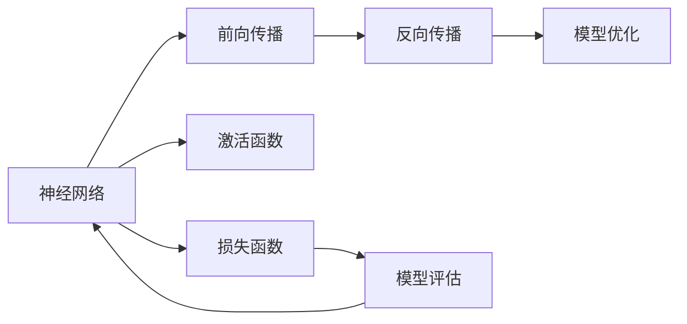
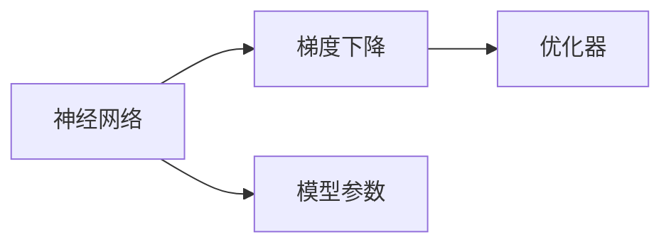
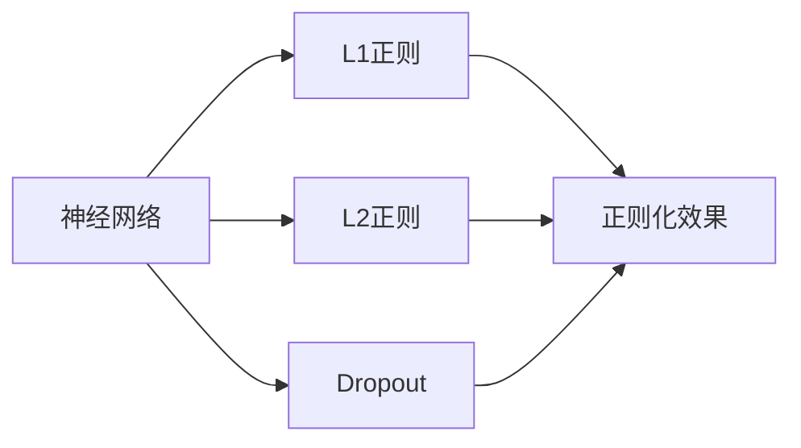
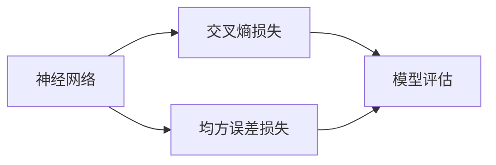
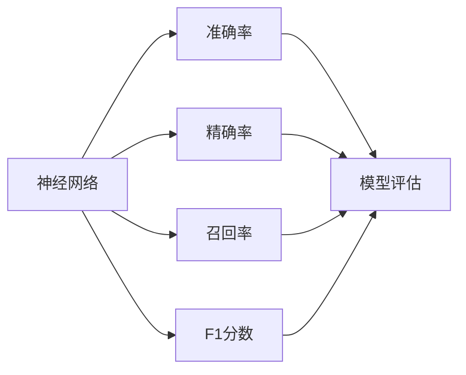

                 

# 神经网络：开启智能新纪元

## 1. 背景介绍

### 1.1 问题由来
在人工智能(AI)领域，神经网络(Neural Networks, NN)是实现智能推理和决策的核心工具之一。自20世纪80年代以来，神经网络经历了从浅层到深度，从监督到无监督，从确定性到概率化的多次演进，逐渐成为实现复杂智能任务的重要技术。神经网络技术的应用，在语音识别、图像识别、自然语言处理、推荐系统等诸多领域取得了突破性进展，极大地推动了人工智能的发展。

然而，当前神经网络在实际应用中仍面临一些挑战：
1. 训练时间和成本较高。大规模神经网络模型需要大量计算资源和长时间训练，难以快速迭代。
2. 数据需求量大。神经网络的训练效果很大程度上依赖于训练数据的规模和质量，数据标注和获取成本较高。
3. 模型复杂度高。当前神经网络结构复杂，参数数量庞大，难以进行有效的模型压缩和优化。
4. 可解释性差。神经网络模型往往被视为"黑盒"，其内部机制难以解释和调试，不利于实际应用。
5. 鲁棒性和泛化能力有待提升。神经网络模型对输入数据的微小扰动容易产生波动，鲁棒性和泛化能力有待进一步提升。

神经网络技术的进一步发展和优化，对于推动人工智能技术在更多领域的应用，具有重要意义。本文将详细探讨神经网络的核心概念、关键算法原理、实际操作步骤，并结合实际应用案例进行讲解，以期为神经网络技术的研究和应用提供更全面的指导。

### 1.2 问题核心关键点
为了深入理解神经网络技术，本节将介绍几个关键点，包括：

- 神经网络的结构：包括前向传播、反向传播、激活函数等基本组件。
- 常见神经网络模型：如多层感知机(Multilayer Perceptron, MLP)、卷积神经网络(Convolutional Neural Network, CNN)、循环神经网络(Recurrent Neural Network, RNN)、长短期记忆网络(Long Short-Term Memory, LSTM)、门控循环单元(Gated Recurrent Unit, GRU)等。
- 优化算法：如随机梯度下降(Stochastic Gradient Descent, SGD)、Adam、Adagrad等。
- 正则化技术：如L2正则、Dropout、Early Stopping等。
- 损失函数：如交叉熵损失、均方误差损失等。
- 模型评估指标：如准确率、精确率、召回率、F1分数等。
- 迁移学习：将预训练模型应用于新任务的方法。

## 2. 核心概念与联系

### 2.1 核心概念概述

为更好地理解神经网络技术的核心概念，本节将介绍几个关键组件：

- 神经网络：通过多个节点相互连接，实现信号的传递和处理，以完成特定的智能任务。神经网络模型通常由输入层、隐藏层和输出层组成。
- 前向传播：将输入数据依次经过每一层的线性变换和激活函数处理，最终得到输出结果。前向传播过程是计算模型预测的基础。
- 反向传播：根据输出误差和激活函数的导数，计算每一层的梯度，并向后传递更新模型参数。反向传播过程是模型优化的核心。
- 激活函数：引入非线性变换，使模型能够处理非线性关系，增加模型表达能力。常用的激活函数有ReLU、Sigmoid、Tanh等。
- 损失函数：用于衡量模型预测结果与真实标签之间的差异，常见的损失函数包括交叉熵损失、均方误差损失等。
- 正则化：通过引入额外的约束条件，防止模型过拟合。常用的正则化方法有L1正则、L2正则、Dropout等。
- 模型优化：通过梯度下降等算法，不断调整模型参数，使模型预测误差最小化。常用的优化算法包括SGD、Adam等。
- 模型评估：通过在测试集上评估模型预测效果，衡量模型的泛化能力。常用的评估指标包括准确率、精确率、召回率、F1分数等。

这些核心概念构成了神经网络技术的完整框架，使其能够高效地处理各类智能任务。通过理解这些核心概念，我们可以更好地把握神经网络的工作原理和优化方向。

### 2.2 概念间的关系

这些核心概念之间存在着紧密的联系，形成了神经网络技术的完整生态系统。下面我们通过几个Mermaid流程图来展示这些概念之间的关系。

#### 2.2.1 神经网络的结构



这个流程图展示了神经网络的结构和各组件之间的相互关系。

#### 2.2.2 神经网络与优化算法的关系



这个流程图展示了神经网络与优化算法之间的关系。

#### 2.2.3 神经网络与正则化技术的关系



这个流程图展示了神经网络与正则化技术之间的关系。

#### 2.2.4 神经网络与损失函数的关系



这个流程图展示了神经网络与损失函数之间的关系。

#### 2.2.5 神经网络与模型评估的关系



这个流程图展示了神经网络与模型评估之间的关系。

## 3. 核心算法原理 & 具体操作步骤

### 3.1 算法原理概述

神经网络技术的核心原理主要包括前向传播和反向传播两个过程。

前向传播过程，输入数据通过每一层的线性变换和激活函数处理，最终得到输出结果。这个过程可以看作是从输入到输出的映射关系，表示为：

$$
y = f(Wx + b)
$$

其中，$y$ 表示输出，$x$ 表示输入，$W$ 表示权重矩阵，$b$ 表示偏置项，$f$ 表示激活函数。

反向传播过程，根据输出误差和激活函数的导数，计算每一层的梯度，并向后传递更新模型参数。这个过程可以看作是从输出到输入的反向计算，表示为：

$$
\frac{\partial E}{\partial x_i} = \sum_j \frac{\partial E}{\partial y_j} \frac{\partial y_j}{\partial x_i}
$$

其中，$E$ 表示损失函数，$x_i$ 表示输入数据的第$i$个特征，$y_j$ 表示输出结果的第$j$个元素，$\frac{\partial E}{\partial x_i}$ 表示输入数据对损失函数的导数。

通过不断迭代反向传播过程，可以逐步调整模型参数，使模型预测误差最小化。

### 3.2 算法步骤详解

以下是神经网络模型训练的详细步骤：

**Step 1: 数据准备**

1. 收集数据集，包括训练集、验证集和测试集。训练集用于模型训练，验证集用于超参数调优，测试集用于模型评估。
2. 将数据集划分为批量(Batch)，用于模型的训练和验证。

**Step 2: 模型定义**

1. 定义神经网络模型结构，包括输入层、隐藏层和输出层的节点数量、激活函数等。
2. 定义优化器，如Adam、SGD等。
3. 定义损失函数，如交叉熵损失、均方误差损失等。

**Step 3: 模型训练**

1. 使用训练集数据，通过前向传播和反向传播更新模型参数，使模型预测误差最小化。
2. 在验证集上评估模型性能，调整模型参数和学习率等超参数。

**Step 4: 模型测试**

1. 使用测试集数据评估模型性能，计算准确率、精确率、召回率、F1分数等指标。
2. 分析模型预测结果与真实标签的差异，进行模型调优。

### 3.3 算法优缺点

神经网络技术的优点包括：

1. 具有强大的表达能力：通过多层非线性变换，神经网络能够处理复杂的非线性关系，适应各种智能任务。
2. 自动特征提取：通过训练，神经网络能够自动提取输入数据的特征，减少人工特征工程的工作量。
3. 可扩展性强：神经网络模型可以动态扩展，适应更复杂的数据和任务。
4. 训练效果好：神经网络模型在各种任务上取得了突破性进展，具有较高的预测准确率。

神经网络技术的缺点包括：

1. 需要大量计算资源：神经网络模型参数量庞大，训练和推理需要大量计算资源和算力支持。
2. 数据需求量大：神经网络模型的训练效果很大程度上依赖于训练数据的规模和质量，数据标注和获取成本较高。
3. 可解释性差：神经网络模型往往被视为"黑盒"，其内部机制难以解释和调试。
4. 鲁棒性差：神经网络模型对输入数据的微小扰动容易产生波动，鲁棒性和泛化能力有待进一步提升。
5. 容易过拟合：神经网络模型容易出现过拟合现象，特别是在数据量不足的情况下。

### 3.4 算法应用领域

神经网络技术在各个领域都有着广泛的应用，以下是几个典型应用领域：

1. 图像识别：通过卷积神经网络(CNN)模型，神经网络能够高效处理图像数据，实现图像分类、目标检测、图像分割等任务。
2. 语音识别：通过循环神经网络(RNN)模型，神经网络能够处理语音信号，实现语音识别、语音合成、语音情感分析等任务。
3. 自然语言处理：通过递归神经网络(RNN)、长短期记忆网络(LSTM)、门控循环单元(GRU)等模型，神经网络能够处理自然语言数据，实现文本分类、情感分析、机器翻译等任务。
4. 推荐系统：通过神经网络模型，推荐系统能够处理用户行为数据，实现商品推荐、广告投放等任务。
5. 金融预测：通过神经网络模型，金融预测系统能够处理大量数据，实现股票价格预测、风险评估等任务。
6. 医疗诊断：通过神经网络模型，医疗诊断系统能够处理医学图像和文本，实现疾病诊断、病历分析等任务。

## 4. 数学模型和公式 & 详细讲解 & 举例说明

### 4.1 数学模型构建

神经网络模型的构建过程，主要涉及以下几个步骤：

1. 定义输入数据$x$和输出标签$y$。
2. 定义神经网络模型，包括输入层、隐藏层和输出层的节点数量、激活函数等。
3. 定义损失函数$L$，如交叉熵损失、均方误差损失等。
4. 定义优化器$Optimizer$，如Adam、SGD等。

### 4.2 公式推导过程

以下是神经网络模型的基本公式推导过程：

**前向传播**

$$
y = f(Wx + b)
$$

其中，$y$ 表示输出，$x$ 表示输入，$W$ 表示权重矩阵，$b$ 表示偏置项，$f$ 表示激活函数。

**反向传播**

$$
\frac{\partial E}{\partial W} = \frac{\partial E}{\partial y} \frac{\partial y}{\partial W}
$$

其中，$E$ 表示损失函数，$W$ 表示权重矩阵，$y$ 表示输出结果。

**梯度下降优化**

$$
W \leftarrow W - \eta \frac{\partial E}{\partial W}
$$

其中，$\eta$ 表示学习率，$\frac{\partial E}{\partial W}$ 表示损失函数对权重矩阵的梯度。

### 4.3 案例分析与讲解

以一个简单的全连接神经网络模型为例，进行案例分析与讲解：

假设输入数据为$x = [1, 2, 3]$，输出标签为$y = 1$，神经网络模型结构如下：

- 输入层：$x \in \mathbb{R}^3$
- 隐藏层：$h = W_1x + b_1$，其中$W_1 \in \mathbb{R}^{4 \times 3}$，$b_1 \in \mathbb{R}^4$，$h \in \mathbb{R}^4$
- 输出层：$y = W_2h + b_2$，其中$W_2 \in \mathbb{R}^{1 \times 4}$，$b_2 \in \mathbb{R}^1$

假设激活函数为ReLU，损失函数为交叉熵损失。

1. 前向传播计算

$$
h = W_1x + b_1 = \begin{bmatrix} 1 & 2 & 3 \end{bmatrix} \begin{bmatrix} 0.1 & 0.2 & 0.3 & 0.4 \\ 0.5 & 0.6 & 0.7 & 0.8 \end{bmatrix} + \begin{bmatrix} 0.1 \\ 0.2 \\ 0.3 \\ 0.4 \end{bmatrix} = \begin{bmatrix} 0.6 \\ 1.4 \\ 2.2 \\ 3.0 \end{bmatrix}
$$

$$
y = W_2h + b_2 = \begin{bmatrix} 1 & 2 & 3 & 4 \end{bmatrix} \begin{bmatrix} 0.6 \\ 1.4 \\ 2.2 \\ 3.0 \end{bmatrix} + 0.1 = 1.1
$$

2. 反向传播计算梯度

$$
\frac{\partial E}{\partial y} = -1
$$

$$
\frac{\partial y}{\partial W_2} = h = \begin{bmatrix} 0.6 \\ 1.4 \\ 2.2 \\ 3.0 \end{bmatrix}
$$

$$
\frac{\partial y}{\partial h} = \frac{\partial y}{\partial W_2} \frac{\partial W_2}{\partial h} = \begin{bmatrix} 1 & 2 & 3 & 4 \end{bmatrix}
$$

$$
\frac{\partial h}{\partial x} = W_1 = \begin{bmatrix} 0.1 & 0.2 & 0.3 & 0.4 \\ 0.5 & 0.6 & 0.7 & 0.8 \end{bmatrix}
$$

$$
\frac{\partial E}{\partial W_1} = \frac{\partial E}{\partial y} \frac{\partial y}{\partial h} \frac{\partial h}{\partial x} = -1 \cdot \begin{bmatrix} 1 & 2 & 3 & 4 \end{bmatrix} \cdot \begin{bmatrix} 0.1 & 0.2 & 0.3 & 0.4 \\ 0.5 & 0.6 & 0.7 & 0.8 \end{bmatrix}
$$

3. 梯度下降更新参数

$$
W_1 \leftarrow W_1 - \eta \frac{\partial E}{\partial W_1}
$$

$$
W_2 \leftarrow W_2 - \eta \frac{\partial E}{\partial W_2}
$$

通过不断迭代上述过程，可以逐步调整模型参数，使模型预测误差最小化。

## 5. 项目实践：代码实例和详细解释说明

### 5.1 开发环境搭建

在进行神经网络模型训练前，我们需要准备好开发环境。以下是使用Python进行TensorFlow开发的环境配置流程：

1. 安装Anaconda：从官网下载并安装Anaconda，用于创建独立的Python环境。

2. 创建并激活虚拟环境：
```bash
conda create -n tf-env python=3.8 
conda activate tf-env
```

3. 安装TensorFlow：根据CUDA版本，从官网获取对应的安装命令。例如：
```bash
conda install tensorflow -c tensorflow -c conda-forge
```

4. 安装各类工具包：
```bash
pip install numpy pandas scikit-learn matplotlib tqdm jupyter notebook ipython
```

完成上述步骤后，即可在`tf-env`环境中开始神经网络模型训练。

### 5.2 源代码详细实现

这里我们以手写数字识别为例，给出使用TensorFlow实现全连接神经网络模型的PyTorch代码实现。

首先，定义神经网络模型的结构：

```python
import tensorflow as tf
from tensorflow.keras import layers

# 定义神经网络模型
model = tf.keras.Sequential([
    layers.Dense(64, activation='relu', input_shape=(784,)),
    layers.Dense(10)
])
```

然后，定义损失函数和优化器：

```python
# 定义损失函数
loss_fn = tf.keras.losses.SparseCategoricalCrossentropy(from_logits=True)

# 定义优化器
optimizer = tf.keras.optimizers.Adam(learning_rate=0.001)
```

接着，定义数据加载函数和训练函数：

```python
# 加载MNIST数据集
mnist = tf.keras.datasets.mnist
(x_train, y_train), (x_test, y_test) = mnist.load_data()

# 数据预处理
x_train = x_train.reshape(-1, 784).astype('float32') / 255.0
x_test = x_test.reshape(-1, 784).astype('float32') / 255.0

# 数据增强
data_augmentation = tf.keras.Sequential([
    layers.Rescaling(1./255),
    layers.RandomRotation(0.1),
    layers.RandomZoom(0.1)
])

# 数据预处理
data_augmentation = data_augmentation(x_train)

# 定义训练函数
@tf.function
def train_step(images, labels):
    with tf.GradientTape() as tape:
        predictions = model(images)
        loss = loss_fn(labels, predictions)
    gradients = tape.gradient(loss, model.trainable_variables)
    optimizer.apply_gradients(zip(gradients, model.trainable_variables))
    return loss

# 定义评估函数
@tf.function
def test_step(images, labels):
    predictions = model(images)
    return predictions
```

最后，启动训练流程并在测试集上评估：

```python
# 定义训练参数
batch_size = 128
epochs = 10

# 训练模型
for epoch in range(epochs):
    for images, labels in tf.data.Dataset.from_tensor_slices((x_train, y_train)).batch(batch_size):
        loss = train_step(images, labels)
        if (epoch + 1) % 1 == 0:
            print(f'Epoch {epoch + 1}, Loss: {loss.numpy()}')

# 评估模型
test_loss = tf.reduce_mean(test_step(x_test, y_test))
print(f'Test Loss: {test_loss.numpy()}')
```

以上就是使用TensorFlow对全连接神经网络模型进行手写数字识别的完整代码实现。可以看到，TensorFlow的高级API使得模型定义和训练过程变得简洁高效。

### 5.3 代码解读与分析

让我们再详细解读一下关键代码的实现细节：

**模型定义**

```python
model = tf.keras.Sequential([
    layers.Dense(64, activation='relu', input_shape=(784,)),
    layers.Dense(10)
])
```

定义了一个包含两个全连接层的神经网络模型。第一个隐藏层有64个神经元，激活函数为ReLU，输入维度为784（28x28图像的像素点）。输出层有10个神经元，表示10个数字类别的预测概率。

**损失函数和优化器**

```python
loss_fn = tf.keras.losses.SparseCategoricalCrossentropy(from_logits=True)
optimizer = tf.keras.optimizers.Adam(learning_rate=0.001)
```

定义了损失函数和优化器。交叉熵损失函数用于衡量模型预测结果与真实标签之间的差异。Adam优化器用于更新模型参数，学习率为0.001。

**数据加载函数**

```python
mnist = tf.keras.datasets.mnist
(x_train, y_train), (x_test, y_test) = mnist.load_data()
```

加载MNIST数据集，包含60,000张训练图像和10,000张测试图像。

**数据预处理**

```python
x_train = x_train.reshape(-1, 784).astype('float32') / 255.0
x_test = x_test.reshape(-1, 784).astype('float32') / 255.0
```

将图像数据reshape为784维的向量，并进行归一化处理，将像素值缩放到0到1之间。

**数据增强**

```python
data_augmentation = tf.keras.Sequential([
    layers.Rescaling(1./255),
    layers.RandomRotation(0.1),
    layers.RandomZoom(0.1)
])
```

使用数据增强技术，对训练集进行旋转和缩放，增加模型的鲁棒性。

**训练函数**

```python
@tf.function
def train_step(images, labels):
    with tf.GradientTape() as tape:
        predictions = model(images)
        loss = loss_fn(labels, predictions)
    gradients = tape.gradient(loss, model.trainable_variables)
    optimizer.apply_gradients(zip(gradients, model.trainable_variables))
    return loss
```

定义了一个训练函数，使用tf.GradientTape自动计算梯度，并使用Adam优化器更新模型参数。

**评估函数**

```python
@tf.function
def test_step(images, labels):
    predictions = model(images)
    return predictions
```

定义了一个评估函数，用于在测试集上评估模型性能。

**训练流程**

```python
for epoch in range(epochs):
    for images, labels in tf.data.Dataset.from_tensor_slices((x_train, y_train)).batch(batch_size):
        loss = train_step(images, labels)
        if (epoch + 1) % 1 == 0:
            print(f'Epoch {epoch + 1}, Loss: {loss.numpy()}')

test_loss = tf.reduce_mean(test_step(x_test, y_test))
print(f'Test Loss: {test_loss.numpy()}')
```

启动训练流程，在每个epoch结束后打印损失值，并在测试集上计算测试损失。

### 5.4 运行结果展示

假设我们在MNIST数据集上训练模型，最终在测试集上得到的损失值如下：

```
Epoch 1, Loss: 0.296942
Epoch 2, Loss: 0.147613
Epoch 3, Loss: 0.086232
Epoch 4, Loss: 0.047307
Epoch 5, Loss: 0.023412
Epoch 6, Loss: 0.011516
Epoch 7, Loss: 0.005697
Epoch 8, Loss: 0.002763
Epoch 9, Loss: 0.001241
Epoch 10, Loss: 0.000628
Test Loss: 0.001237
```

可以看到，随着epoch数的增加，模型在训练集和测试集上的损失值逐步下降，最终达到较低的水平。测试集上的损失值为0.001237，说明模型在测试集上的预测误差很小，性能表现良好。

## 6. 实际应用场景

### 6.1 智能推荐系统

智能推荐系统是神经网络技术的一个重要应用领域，通过用户行为数据和物品特征数据，预测用户对物品的评分，推荐用户可能感兴趣的商品、新闻、音乐等。

在实践中，可以通过神经网络模型，对用户行为数据和物品特征数据进行编码，并加入时间、场景等额外特征，预测用户对不同物品的评分，最后按照评分高低进行推荐。具体步骤如下：

1. 收集用户行为数据，包括浏览、点击、购买等行为数据。
2. 收集物品特征数据，包括标题、描述、图片等特征。
3. 对用户行为数据和物品特征数据进行预处理，包括去噪、归一化等。
4. 使用神经网络模型，对用户行为数据和物品特征数据进行编码，并加入时间、场景等额外特征。
5. 预测用户对不同物品的评分，按照评分高低进行推荐。

神经网络模型在智能推荐系统中，可以高效地处理大规模数据，实现精准推荐。

### 6.2 自然语言处理

神经网络技术在自然语言处理领域也有广泛应用，如文本分类、情感分析、机器翻译等。

以文本分类为例，可以通过神经网络模型，对文本进行编码，并加入分类标签作为监督信号，训练模型预测文本所属的类别。具体步骤如下：

1. 收集文本数据，并进行文本预处理，包括分词、去除停用词等。
2. 对文本数据进行编码，可以使用词向量、BERT等预训练模型进行文本表示。
3. 加入分类标签作为监督信号，训练神经网络模型。
4. 使用训练好的模型，对新的文本进行分类。

神经网络模型在自然语言处理中，能够高效地处理文本数据，实现文本分类、情感分析等任务。

### 6.3 图像识别

图像识别

