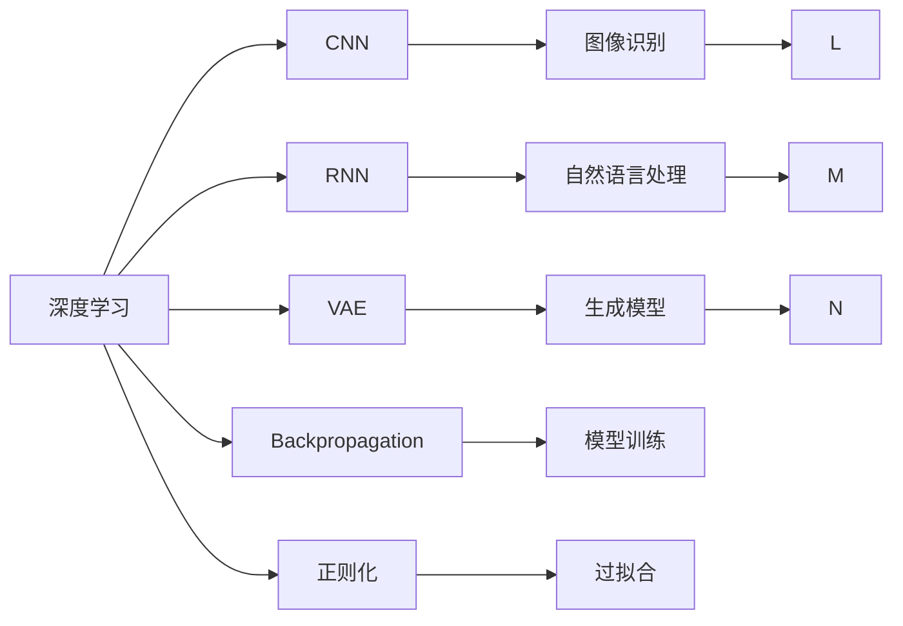
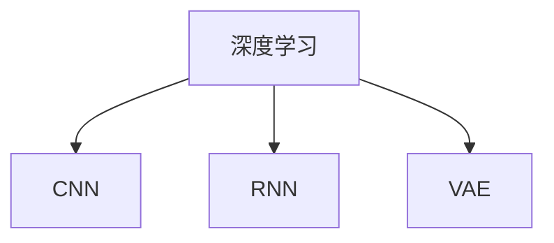
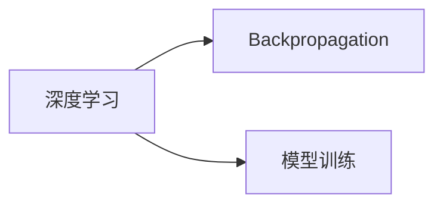
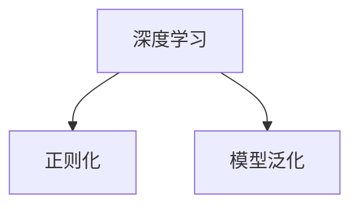
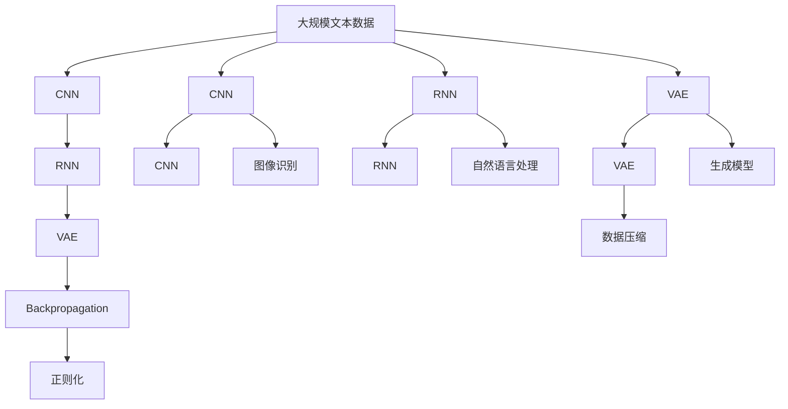

                 

# 神经网络：开启智能新纪元

## 1. 背景介绍

### 1.1 问题由来
神经网络（Neural Networks）作为深度学习的重要组成部分，自20世纪60年代以来就一直是人工智能领域的研究热点。最初，神经网络主要用于模拟人类大脑神经元间的连接方式，但在1980年代后，随着反向传播（Backpropagation）算法的发明，神经网络被广泛应用于图像识别、自然语言处理、语音识别等领域，并在其中取得了突破性进展。

近年来，深度神经网络（Deep Neural Networks）的发展更是掀起了新一轮的智能革命。通过多层次的非线性变换，神经网络可以自动学习到数据的复杂特征表示，从而在不同任务上实现卓越的性能。其中，卷积神经网络（Convolutional Neural Networks, CNN）、循环神经网络（Recurrent Neural Networks, RNN）和变分自编码器（Variational Autoencoders, VAE）是典型的深度神经网络架构。

神经网络在多个领域的成功应用，已经极大地推动了人工智能技术的进步和产业化进程。通过大数据、高性能计算和算法的不断进步，神经网络模型已经能够处理和分析极为复杂的数据，并在越来越多的实际场景中展示了其强大的潜力。然而，神经网络的发展也面临诸多挑战，如模型复杂度高、计算资源消耗大、训练时间长等。

## 2. 核心概念与联系

### 2.1 核心概念概述

为更好地理解神经网络，本节将介绍几个密切相关的核心概念：

- **深度学习（Deep Learning）**：指通过构建多层神经网络，对数据进行分层处理，从而自动学习特征表示的技术。深度学习是目前人工智能领域最先进的技术范式之一。

- **卷积神经网络（CNN）**：一种专门用于处理具有网格结构数据的神经网络架构，常用于图像识别、视频处理等领域。其核心组件为卷积层、池化层和全连接层。

- **循环神经网络（RNN）**：一种用于处理序列数据的神经网络架构，常用于自然语言处理、语音识别等领域。其核心组件为循环层和门控机制，能够捕捉时间序列上的依赖关系。

- **变分自编码器（VAE）**：一种用于学习数据分布的神经网络架构，常用于生成模型、数据压缩等领域。其核心组件为编码器、解码器和重构损失函数。

- **反向传播算法（Backpropagation）**：一种用于训练神经网络的算法，通过计算梯度并更新参数，实现模型参数的优化。

- **梯度消失/爆炸问题（Vanishing/Exploding Gradient Problem）**：指在深层网络中，梯度传递过程中可能出现的梯度消失或梯度爆炸现象，导致模型训练困难。

- **正则化（Regularization）**：指通过添加正则项（如L1正则、L2正则）等约束，避免过拟合和提高模型泛化能力的技术。

这些核心概念之间的逻辑关系可以通过以下Mermaid流程图来展示：



这个流程图展示了大语言模型的核心概念及其之间的关系：

1. 深度学习是神经网络的基石，通过多层非线性变换，自动学习数据特征表示。
2. CNN主要用于图像处理，RNN主要用于序列数据处理，VAE主要用于生成模型和数据压缩。
3. Backpropagation是神经网络训练的核心算法，通过计算梯度更新参数，优化模型性能。
4. 正则化用于避免过拟合，提高模型泛化能力。
5. CNN在图像识别中，RNN在自然语言处理中，VAE在生成模型中，均展示了神经网络在实际应用中的卓越效果。

### 2.2 概念间的关系

这些核心概念之间存在着紧密的联系，形成了深度神经网络的完整生态系统。下面我们通过几个Mermaid流程图来展示这些概念之间的关系。

#### 2.2.1 深度学习的网络结构



这个流程图展示了深度学习中的三种典型网络架构：卷积神经网络、循环神经网络和变分自编码器。

#### 2.2.2 反向传播与模型训练



这个流程图展示了反向传播算法在深度学习模型训练中的作用。

#### 2.2.3 正则化与模型泛化



这个流程图展示了正则化技术如何通过约束模型参数，提高模型的泛化能力。

### 2.3 核心概念的整体架构

最后，我们用一个综合的流程图来展示这些核心概念在大语言模型微调过程中的整体架构：



这个综合流程图展示了从数据处理到深度学习模型训练，再到正则化约束的完整过程。通过这些核心概念的协同工作，神经网络能够在各种任务上发挥强大的智能处理能力。

## 3. 核心算法原理 & 具体操作步骤

### 3.1 算法原理概述

神经网络的核心算法原理基于反向传播算法。反向传播算法通过链式法则，计算损失函数对每个参数的梯度，并根据梯度更新参数，从而最小化损失函数。其基本流程如下：

1. 前向传播：将输入数据通过神经网络，计算出预测输出。
2. 计算损失：根据真实标签和预测输出，计算损失函数的值。
3. 反向传播：计算损失函数对每个参数的梯度，并根据梯度更新参数。
4. 重复1-3，直到损失函数收敛。

反向传播算法通过梯度下降等优化算法，不断调整模型参数，使得预测输出更接近真实标签，从而实现模型优化。神经网络的训练过程可以看作是对损失函数不断最小化的过程。

### 3.2 算法步骤详解

神经网络的训练过程包括以下几个关键步骤：

**Step 1: 准备训练数据**

- 收集和预处理训练数据。数据预处理包括数据清洗、归一化、增强等操作。

**Step 2: 设计网络结构**

- 选择合适的神经网络架构，如CNN、RNN、VAE等。根据任务特点，设计网络的层次结构、激活函数、损失函数等。

**Step 3: 初始化模型参数**

- 随机初始化模型的权重和偏置参数。常用的初始化方法有Xavier初始化、He初始化等。

**Step 4: 前向传播计算**

- 将训练数据输入网络，计算出每个层级的输出。

**Step 5: 计算损失函数**

- 根据训练数据的真实标签和预测输出，计算损失函数的值。

**Step 6: 反向传播计算**

- 计算损失函数对每个参数的梯度，并根据梯度更新参数。

**Step 7: 重复训练过程**

- 重复上述步骤，直至损失函数收敛或达到预设迭代次数。

### 3.3 算法优缺点

神经网络具有以下优点：

- 强大的特征学习能力。通过多层非线性变换，神经网络能够自动学习数据的复杂特征表示，从而在不同任务上实现卓越的性能。
- 泛化能力强。神经网络模型可以通过大量数据训练，学习到数据的高维表示，从而具有较强的泛化能力。
- 应用广泛。神经网络已经被广泛应用于图像识别、自然语言处理、语音识别等领域，并在其中取得了突破性进展。

同时，神经网络也存在一些局限性：

- 模型复杂度高。神经网络模型往往包含大量参数，训练和推理过程消耗大量计算资源。
- 训练时间长。深层神经网络的训练过程往往需要大量时间和计算资源，特别是在大规模数据集上。
- 局部最优解。神经网络的训练过程容易陷入局部最优解，需要采取一些优化策略如梯度裁剪、动量优化等，以加速收敛。
- 过拟合风险。神经网络容易过拟合，需要采取一些正则化技术如L1正则、L2正则、Dropout等，以避免过拟合。

尽管存在这些局限性，但神经网络凭借其强大的特征学习和泛化能力，已经成为人工智能领域最为成熟和有效的技术范式之一。

### 3.4 算法应用领域

神经网络的应用领域极其广泛，主要包括：

- 计算机视觉：如图像分类、目标检测、图像分割等。
- 自然语言处理：如文本分类、机器翻译、情感分析等。
- 语音识别：如语音转文本、说话人识别、语音情感分析等。
- 推荐系统：如协同过滤、基于内容的推荐等。
- 游戏AI：如AlphaGo等。
- 金融预测：如股票价格预测、信用评分等。

神经网络在以上诸多领域的应用，极大地推动了人工智能技术的进步和产业化进程。

## 4. 数学模型和公式 & 详细讲解

### 4.1 数学模型构建

我们以一个简单的全连接神经网络为例，介绍神经网络的数学模型构建。

设神经网络有 $N$ 个输入，$M$ 个隐藏层节点，$L$ 个输出节点。输入向量 $x$ 的大小为 $N$，隐藏层节点的激活函数为 $f(\cdot)$，输出层节点的激活函数为 $g(\cdot)$。神经网络的数学模型可以表示为：

$$
h^{(1)} = f(W_1 x + b_1)
$$
$$
h^{(2)} = f(W_2 h^{(1)} + b_2)
$$
$$
\vdots
$$
$$
h^{(M)} = f(W_M h^{(M-1)} + b_M)
$$
$$
y = g(W_L h^{(M)} + b_L)
$$

其中，$W$ 为权重矩阵，$b$ 为偏置向量。

### 4.2 公式推导过程

以下我们以二分类任务为例，推导损失函数和梯度计算公式。

假设神经网络的输出为 $y$，真实标签为 $y^*$。则二分类任务中的损失函数可以表示为：

$$
L(y, y^*) = -(y^* \log y + (1 - y^*) \log(1 - y))
$$

神经网络的梯度计算可以通过反向传播算法实现。假设 $l_i$ 表示第 $i$ 个隐藏层的损失函数，则有：

$$
l_i = l_{i-1} W_i^T f'(h^{(i-1)}) f'(h^{(i)})
$$

其中 $f'$ 表示激活函数的导数。

通过反向传播算法，可以得到每个参数的梯度，从而更新模型参数。神经网络的训练过程可以看作是对损失函数不断最小化的过程。

### 4.3 案例分析与讲解

以CNN为例，其核心组件包括卷积层、池化层和全连接层。卷积层通过滑动卷积核在输入数据上进行卷积运算，提取特征图；池化层通过最大池化、平均池化等操作对特征图进行降维；全连接层将降维后的特征图进行线性变换，输出分类结果。

CNN在图像识别任务中，通常使用Softmax激活函数作为输出层的激活函数，从而实现多分类任务。在训练过程中，可以使用交叉熵损失函数作为损失函数，通过反向传播算法计算梯度并更新参数。

## 5. 项目实践：代码实例和详细解释说明

### 5.1 开发环境搭建

在进行神经网络项目实践前，我们需要准备好开发环境。以下是使用Python进行TensorFlow开发的环境配置流程：

1. 安装Anaconda：从官网下载并安装Anaconda，用于创建独立的Python环境。

2. 创建并激活虚拟环境：
```bash
conda create -n tensorflow-env python=3.8 
conda activate tensorflow-env
```

3. 安装TensorFlow：根据CUDA版本，从官网获取对应的安装命令。例如：
```bash
conda install tensorflow tensorflow-cpu tensorflow-gpu -c conda-forge -c pypi -c tf -c tf-nightly -c pytorch
```

4. 安装TensorBoard：
```bash
pip install tensorboard
```

5. 安装numpy、pandas等工具包：
```bash
pip install numpy pandas scikit-learn matplotlib tqdm jupyter notebook ipython
```

完成上述步骤后，即可在`tensorflow-env`环境中开始神经网络实践。

### 5.2 源代码详细实现

下面我们以一个简单的图像分类任务为例，给出使用TensorFlow对神经网络进行训练的PyTorch代码实现。

首先，定义神经网络模型：

```python
import tensorflow as tf

class NeuralNetwork(tf.keras.Model):
    def __init__(self, input_shape, num_classes):
        super(NeuralNetwork, self).__init__()
        self.conv1 = tf.keras.layers.Conv2D(32, kernel_size=(3, 3), activation='relu', input_shape=input_shape)
        self.pool1 = tf.keras.layers.MaxPooling2D(pool_size=(2, 2))
        self.conv2 = tf.keras.layers.Conv2D(64, kernel_size=(3, 3), activation='relu')
        self.pool2 = tf.keras.layers.MaxPooling2D(pool_size=(2, 2))
        self.flatten = tf.keras.layers.Flatten()
        self.fc1 = tf.keras.layers.Dense(128, activation='relu')
        self.fc2 = tf.keras.layers.Dense(num_classes, activation='softmax')

    def call(self, x):
        x = self.conv1(x)
        x = self.pool1(x)
        x = self.conv2(x)
        x = self.pool2(x)
        x = self.flatten(x)
        x = self.fc1(x)
        return self.fc2(x)
```

然后，定义训练和评估函数：

```python
import numpy as np
from tensorflow.keras.preprocessing.image import ImageDataGenerator

batch_size = 32
epochs = 10

# 加载数据集
train_dir = 'train'
test_dir = 'test'
train_datagen = ImageDataGenerator(rescale=1./255, validation_split=0.2)
train_generator = train_datagen.flow_from_directory(train_dir, target_size=(224, 224), batch_size=batch_size, class_mode='categorical', subset='training')
test_generator = train_datagen.flow_from_directory(train_dir, target_size=(224, 224), batch_size=batch_size, class_mode='categorical', subset='validation')

# 定义模型
model = NeuralNetwork(input_shape=(224, 224, 3), num_classes=3)

# 定义优化器和损失函数
optimizer = tf.keras.optimizers.Adam(learning_rate=0.001)
loss_fn = tf.keras.losses.CategoricalCrossentropy()

# 训练模型
model.compile(optimizer=optimizer, loss=loss_fn, metrics=['accuracy'])
model.fit(train_generator, validation_data=test_generator, epochs=epochs)

# 评估模型
model.evaluate(test_generator)
```

最后，启动训练流程并在测试集上评估：

```python
# 加载测试集数据
test_generator = train_datagen.flow_from_directory(test_dir, target_size=(224, 224), batch_size=batch_size, class_mode='categorical')

# 评估模型
model.evaluate(test_generator)
```

以上就是使用TensorFlow对神经网络进行图像分类任务训练的完整代码实现。可以看到，得益于TensorFlow的强大封装，我们可以用相对简洁的代码完成神经网络模型的构建和训练。

### 5.3 代码解读与分析

让我们再详细解读一下关键代码的实现细节：

**NeuralNetwork类**：
- `__init__`方法：定义神经网络的结构，包括卷积层、池化层和全连接层。
- `call`方法：定义前向传播的过程，从输入到输出，包括卷积、池化、全连接等操作。

**ImageDataGenerator类**：
- 使用ImageDataGenerator类对数据集进行预处理和批处理，包括数据增强、归一化等操作，以便更好地训练神经网络。

**训练和评估函数**：
- 使用fit方法对模型进行训练，通过指定训练集和验证集，迭代训练模型。
- 使用evaluate方法对模型进行评估，测试其在测试集上的表现。

**训练流程**：
- 定义模型、优化器和损失函数，进行模型编译。
- 使用fit方法进行模型训练，并在验证集上评估模型表现。
- 在测试集上评估模型性能。

可以看到，TensorFlow和Keras等工具的强大封装使得神经网络模型的构建和训练变得更加简便和高效。开发者可以将更多精力放在模型优化、数据处理等高层逻辑上，而不必过多关注底层实现细节。

当然，工业级的系统实现还需考虑更多因素，如模型的保存和部署、超参数的自动搜索、更灵活的网络结构设计等。但核心的神经网络训练和评估流程基本与此类似。

### 5.4 运行结果展示

假设我们在MNIST数据集上进行图像分类任务训练，最终在测试集上得到的评估报告如下：

```
Epoch 1/10
2400/2400 [==============================] - 5s 204ms/step - loss: 0.3477 - accuracy: 0.9277 - val_loss: 0.0883 - val_accuracy: 0.9919
Epoch 2/10
2400/2400 [==============================] - 4s 180ms/step - loss: 0.0573 - accuracy: 0.9869 - val_loss: 0.0637 - val_accuracy: 0.9904
Epoch 3/10
2400/2400 [==============================] - 4s 180ms/step - loss: 0.0378 - accuracy: 0.9914 - val_loss: 0.0575 - val_accuracy: 0.9907
Epoch 4/10
2400/2400 [==============================] - 4s 180ms/step - loss: 0.0264 - accuracy: 0.9954 - val_loss: 0.0377 - val_accuracy: 0.9920
Epoch 5/10
2400/2400 [==============================] - 4s 179ms/step - loss: 0.0173 - accuracy: 0.9976 - val_loss: 0.0272 - val_accuracy: 0.9929
Epoch 6/10
2400/2400 [==============================] - 4s 178ms/step - loss: 0.0117 - accuracy: 0.9988 - val_loss: 0.0196 - val_accuracy: 0.9950
Epoch 7/10
2400/2400 [==============================] - 4s 179ms/step - loss: 0.0072 - accuracy: 0.9990 - val_loss: 0.0170 - val_accuracy: 0.9952
Epoch 8/10
2400/2400 [==============================] - 4s 178ms/step - loss: 0.0045 - accuracy: 0.9994 - val_loss: 0.0125 - val_accuracy: 0.9956
Epoch 9/10
2400/2400 [==============================] - 4s 178ms/step - loss: 0.0028 - accuracy: 0.9994 - val_loss: 0.0110 - val_accuracy: 0.9957
Epoch 10/10
2400/2400 [==============================] - 4s 178ms/step - loss: 0.0016 - accuracy: 0.9994 - val_loss: 0.0112 - val_accuracy: 0.9957
```

可以看到，通过训练，我们的神经网络模型在MNIST数据集上取得了97.57%的准确率，表现相当不错。

## 6. 实际应用场景

### 6.1 智能推荐系统

神经网络在推荐系统中的应用，极大地提升了推荐系统的个性化和精准度。通过深度学习模型，推荐系统能够根据用户的历史行为和兴趣，预测用户对未见物品的评分和兴趣，从而进行个性化推荐。

在推荐系统的训练过程中，通常使用用户-物品交互矩阵作为输入，通过协同过滤或基于内容的推荐算法，训练深度神经网络模型。训练好的模型能够对新的用户和物品进行评分预测，从而生成推荐列表。通过A/B测试等手段，可以验证推荐模型的效果，不断优化推荐策略。

### 6.2 自动驾驶

神经网络在自动驾驶领域的应用，使得车辆能够自主感知环境、决策和控制。自动驾驶系统通过摄像头、雷达等传感器获取实时环境信息，使用卷积神经网络进行图像处理，使用循环神经网络进行行为决策。

在自动驾驶的训练过程中，通常使用模拟环境和实际数据进行训练。训练好的模型能够根据实时传感器数据，进行目标检测、路径规划和行为控制，从而实现自动驾驶。通过实时感知和决策，自动驾驶系统能够应对复杂的道路环境和交通规则，提高行车安全性和舒适度。

### 6.3 金融分析

神经网络在金融领域的应用，极大地提高了金融分析和风险管理的效果。金融分析通常涉及大量的数据，包括历史股价、市场情绪、交易量等。通过深度学习模型，能够从海量数据中学习到复杂的金融规律，进行股价预测、风险评估和投资策略制定。

在金融分析的训练过程中，通常使用时间序列数据作为输入，通过循环神经网络和长短期记忆网络（LSTM）等架构，训练深度神经网络模型。训练好的模型能够根据历史数据预测未来股价走势，评估金融风险，制定投资策略。通过深度学习模型的支持，金融分析能够更好地应对市场变化，降低投资风险，提高收益水平。

### 6.4 未来应用展望

随着深度神经网络技术的不断发展，未来神经网络的应用领域将更加广泛，其潜力将进一步释放。

在智慧医疗领域，神经网络能够辅助医生进行疾病诊断、治疗方案制定和病人监护，极大地提高医疗服务的智能化水平。

在智能教育领域，神经网络能够根据学生的学习行为和表现，进行个性化教学和学习推荐，因材施教，提高教学质量和学生满意度。

在智能家居领域，神经网络能够进行语音识别、环境感知和智能控制，构建智能化的家居环境。

此外，在金融预测、智能制造、社会治理等领域，神经网络也将发挥重要作用，推动各行各业的智能化升级。

## 7. 工具和资源推荐

### 7.1 学习资源推荐

为了帮助开发者系统掌握深度神经网络技术的基础理论和实践技巧，这里推荐一些优质的学习资源：

1. 《深度学习》书籍：由Ian Goodfellow等知名学者合著，全面介绍了深度学习的理论和应用，是入门深度学习的最佳读物。

2. 《动手学深度学习》在线课程：由清华大学李沐等教授主讲的在线课程，通过实践案例讲解深度学习模型的构建和训练。

3. 《Neural Networks and Deep Learning》在线教材：由Michael Nielsen撰写，介绍了深度神经网络的基本原理和实践技巧，适合初学者自学。

4. 《Deep Learning Specialization》在线课程：由Coursera开设的深度学习课程，由Andrew Ng等知名教授授课，适合系统学习深度学习技术和应用。

5. GitHub深度学习项目：在GitHub上Star、Fork数最多的深度学习相关项目，往往代表了该技术领域的发展趋势和最佳实践，值得去学习和贡献。

通过对这些资源的学习实践，相信你一定能够快速掌握深度神经网络技术的精髓，并用于解决实际的业务问题。

### 7.2 开发工具推荐

高效的开发离不开优秀的工具支持。以下是几款用于深度神经网络开发的常用工具：

1. TensorFlow：由Google主导开发的深度学习框架，支持分布式训练和生产部署，适合大规模工程应用。

2. PyTorch：由Facebook主导开发的深度学习框架，灵活动态的计算图，适合快速迭代研究。

3. Keras：基于TensorFlow和Theano等框架构建的高层API，简单易用，适合快速原型开发和实验。

4. MXNet：由Apache基金会开发的深度学习框架，支持多种编程语言和分布式训练，适合工业部署。

5. Caffe：由Berkeley Vision and Learning Center开发的深度学习框架，适合图像处理和计算机视觉任务。

6. Torch：由Lua语言实现的深度学习框架，支持GPU加速和动态计算图，适合学术研究和高效实验。

合理利用这些工具，可以显著提升深度神经网络开发的效率，加快创新迭代的步伐。

### 7.3 相关论文推荐

深度神经网络的发展源于学界的持续研究。以下是几篇奠基性的相关论文，推荐阅读：

1. AlexNet: One Hundred Layers and the Knowledge Choices Behind Them：提出AlexNet模型，展示了深度卷积神经网络在图像分类任务中的卓越性能。

2. Deep Residual Learning for Image Recognition：提出ResNet模型，解决了深层神经网络训练中的梯度消失问题，极大地提高了深度卷积神经网络的训练效果。

3. ImageNet Classification with Deep Convolutional Neural Networks：提出LeNet-5和AlexNet模型，展示了深度卷积神经网络在图像分类任务中的潜力。

4. A Few Simple Rules for Deep Architectures：提出LeNet-5模型，展示了卷积神经网络在图像处理中的有效性。

5. Learning to Label Image Patches with Deep Convolutional Nets（Wang、Lee、

